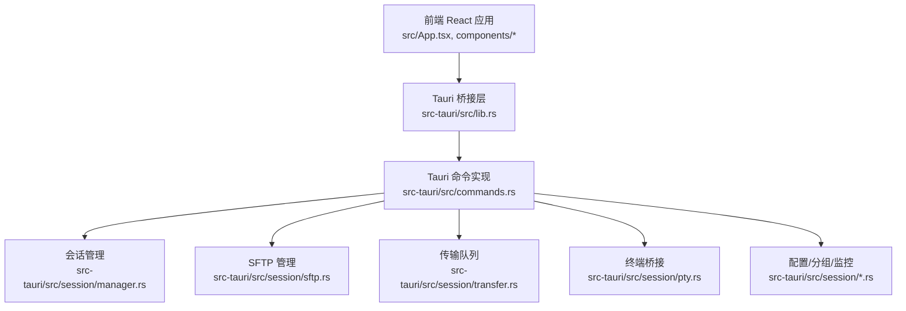
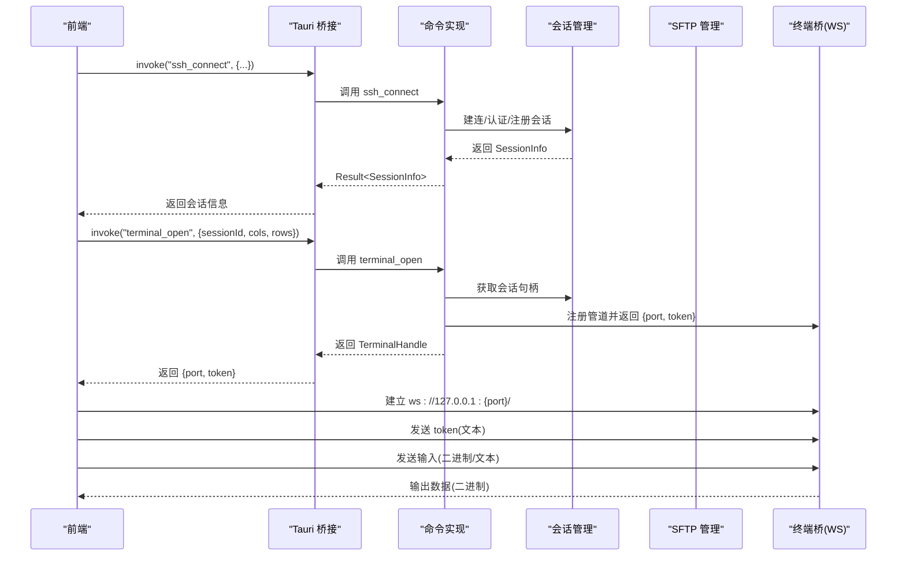
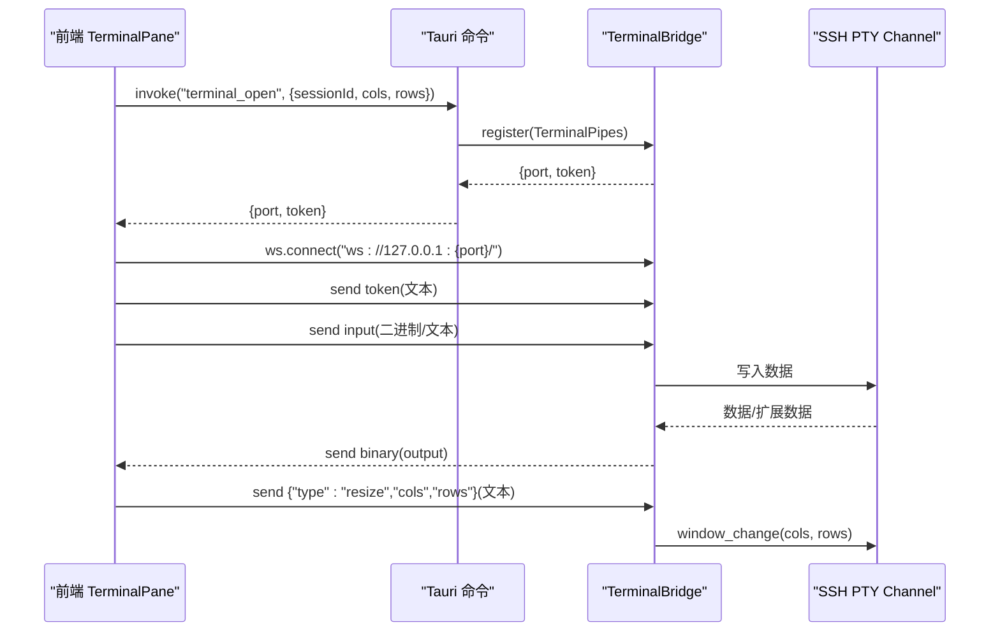
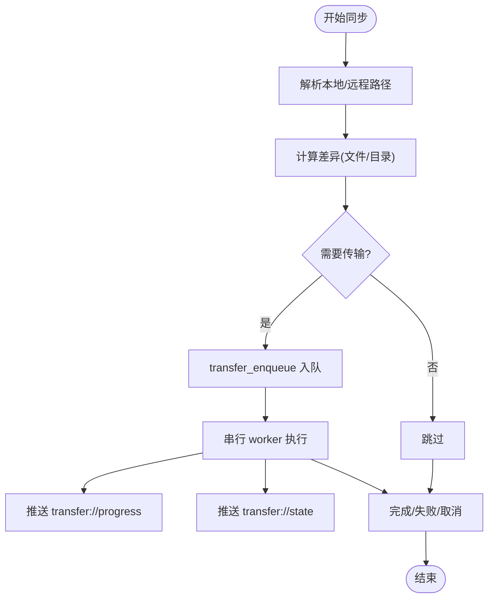
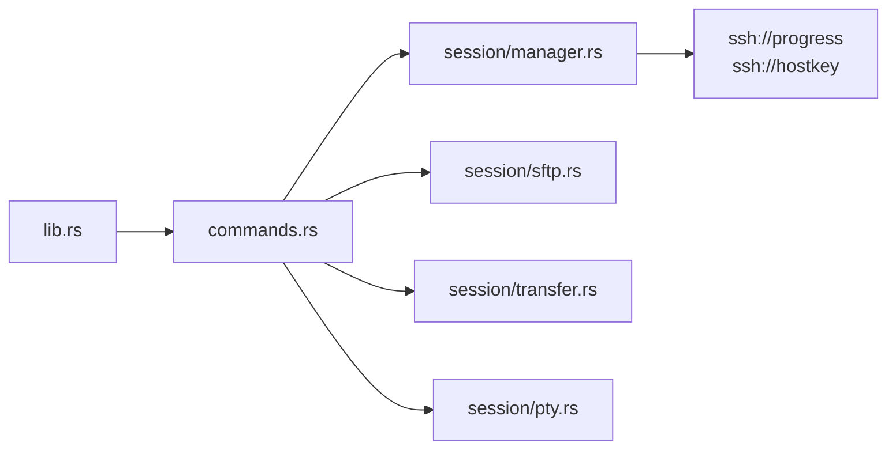

# API 参考

<cite>
**本文档引用的文件**
- [src-tauri/src/commands.rs](file://src-tauri/src/commands.rs)
- [src-tauri/src/lib.rs](file://src-tauri/src/lib.rs)
- [src-tauri/src/session/mod.rs](file://src-tauri/src/session/mod.rs)
- [src-tauri/src/session/manager.rs](file://src-tauri/src/session/manager.rs)
- [src-tauri/src/session/pty.rs](file://src-tauri/src/session/pty.rs)
- [src-tauri/src/session/sftp.rs](file://src-tauri/src/session/sftp.rs)
- [src-tauri/src/session/transfer.rs](file://src-tauri/src/session/transfer.rs)
- [src-tauri/Cargo.toml](file://src-tauri/Cargo.toml)
- [src-tauri/tauri.conf.json](file://src-tauri/tauri.conf.json)
- [src/types.ts](file://src/types.ts)
- [src/App.tsx](file://src/App.tsx)
- [src/components/TerminalPane.tsx](file://src/components/TerminalPane.tsx)
- [src/components/SftpPane.tsx](file://src/components/SftpPane.tsx)
- [src/components/ConnectDialog.tsx](file://src/components/ConnectDialog.tsx)
</cite>

## 目录
1. [简介](#简介)
2. [项目结构](#项目结构)
3. [核心组件](#核心组件)
4. [架构总览](#架构总览)
5. [详细组件分析](#详细组件分析)
6. [依赖关系分析](#依赖关系分析)
7. [性能考量](#性能考量)
8. [故障排查指南](#故障排查指南)
9. [结论](#结论)
10. [附录](#附录)

## 简介
本文件为 Simpl SSH 桌面客户端的 API 参考文档，涵盖 Tauri 命令 API 与 WebSocket 终端传输协议。内容包括：
- SSH 相关命令：连接、会话管理、主机公钥校验
- 终端操作命令：PTY 终端打开与本地 WebSocket 传输
- 文件管理命令：SFTP 列目录、读写、上传下载、目录同步
- 端口转发命令：本地/远程/动态转发的增删查
- 连接配置与分组：保存/更新/删除连接配置，分组管理
- 系统监控：采集远程系统指标快照
- WebSocket API：连接流程、消息格式、事件类型与实时交互模式
- 错误处理策略、性能优化建议与版本管理说明

## 项目结构
后端采用 Tauri 2 架构，Rust 作为后端语言，前端使用 React + TypeScript。命令通过 Tauri 暴露给前端调用，部分实时数据通过事件推送。

图表来源
- [src-tauri/src/lib.rs:14-92](file://src-tauri/src/lib.rs#L14-L92)
- [src-tauri/src/commands.rs:1-996](file://src-tauri/src/commands.rs#L1-L996)

章节来源
- [src-tauri/src/lib.rs:14-92](file://src-tauri/src/lib.rs#L14-L92)
- [src-tauri/src/commands.rs:1-996](file://src-tauri/src/commands.rs#L1-L996)

## 核心组件
- Tauri 命令模块：集中暴露所有公开 API，统一参数与返回值模型
- 会话管理器：维护持久 SSH 连接，支持跳板机、X11 转发、主机公钥校验
- 终端桥：本地 WebSocket 服务，承载 PTY 数据流
- SFTP 管理器：在会话上复用 SFTP 子系统通道，提供目录与文件操作
- 传输队列：串行执行上传/下载任务，支持取消与进度事件
- 配置与分组：连接配置持久化、分组管理、主机公钥信任管理

章节来源
- [src-tauri/src/session/mod.rs:1-226](file://src-tauri/src/session/mod.rs#L1-L226)
- [src-tauri/src/session/manager.rs:77-317](file://src-tauri/src/session/manager.rs#L77-L317)
- [src-tauri/src/session/pty.rs:41-143](file://src-tauri/src/session/pty.rs#L41-L143)
- [src-tauri/src/session/sftp.rs:24-124](file://src-tauri/src/session/sftp.rs#L24-L124)
- [src-tauri/src/session/transfer.rs:121-483](file://src-tauri/src/session/transfer.rs#L121-L483)

## 架构总览
Tauri 命令通过生成器注册，前端以 invoke 方式调用；部分实时事件通过 Tauri 事件系统推送。终端数据通过本地 WebSocket 传输，避免跨进程阻塞。

图表来源
- [src-tauri/src/lib.rs:43-89](file://src-tauri/src/lib.rs#L43-L89)
- [src-tauri/src/commands.rs:44-95](file://src-tauri/src/commands.rs#L44-L95)
- [src-tauri/src/commands.rs:107-186](file://src-tauri/src/commands.rs#L107-L186)
- [src-tauri/src/session/pty.rs:87-142](file://src-tauri/src/session/pty.rs#L87-L142)

## 详细组件分析

### SSH 会话命令
- ssh_exec
  - 参数：host, port, user, password, command
  - 返回：一次性执行结果（stdout+stderr）
  - 用途：早期 demo 的一次性连接执行
- ssh_connect
  - 参数：connect_id, host, port, user, auth_method, password?, private_key_path?, passphrase?, jump_profile_id?
  - 返回：SessionInfo
  - 行为：建立持久会话，推送 ssh://progress 事件，支持跳板机
- ssh_list_sessions
  - 返回：会话列表
- ssh_disconnect
  - 参数：id
  - 行为：断开会话并清理相关资源

章节来源
- [src-tauri/src/commands.rs:25-95](file://src-tauri/src/commands.rs#L25-L95)
- [src-tauri/src/session/manager.rs:82-252](file://src-tauri/src/session/manager.rs#L82-L252)

### 终端（PTY）命令与 WebSocket 传输
- terminal_open
  - 参数：session_id, cols, rows, enable_x11?
  - 返回：TerminalHandle { port, token }
  - 行为：在指定会话上开启 PTY，注册管道，返回本地 WS 端口与一次性 token
- WebSocket 协议
  - 首条消息：token（文本）
  - 输入：二进制（按键/粘贴）或文本（控制消息）
  - 输出：二进制（终端输出）
  - 控制消息格式：{"type":"resize","cols":N,"rows":M}
  - 连接地址：ws://127.0.0.1:{port}/

图表来源
- [src-tauri/src/commands.rs:107-186](file://src-tauri/src/commands.rs#L107-L186)
- [src-tauri/src/session/pty.rs:87-142](file://src-tauri/src/session/pty.rs#L87-L142)
- [src/components/TerminalPane.tsx:103-135](file://src/components/TerminalPane.tsx#L103-L135)

章节来源
- [src-tauri/src/commands.rs:107-186](file://src-tauri/src/commands.rs#L107-L186)
- [src-tauri/src/session/pty.rs:41-143](file://src-tauri/src/session/pty.rs#L41-L143)
- [src/components/TerminalPane.tsx:103-135](file://src/components/TerminalPane.tsx#L103-L135)

### SFTP 文件管理命令
- sftp_list
  - 参数：session_id, path?
  - 返回：(规范化绝对路径, 条目列表)
- sftp_mkdir
  - 参数：session_id, path
- sftp_rename
  - 参数：session_id, from, to
- sftp_remove
  - 参数：session_id, path, is_dir
- sftp_select_local_files
  - 返回：本地文件绝对路径数组
- sftp_select_folder
  - 参数：title
  - 返回：目标文件夹绝对路径
- sftp_read_file
  - 参数：session_id, path
  - 限制：5MB 上限，UTF-8 文本
  - 返回：RemoteFileContent
- sftp_write_file
  - 参数：session_id, path, content

章节来源
- [src-tauri/src/commands.rs:190-360](file://src-tauri/src/commands.rs#L190-L360)
- [src-tauri/src/session/sftp.rs:86-124](file://src-tauri/src/session/sftp.rs#L86-L124)
- [src/types.ts:140-147](file://src/types.ts#L140-L147)

### 传输队列与目录同步
- transfer_enqueue
  - 参数：session_id, kind, local_path, remote_path
  - 返回：task_id
  - 支持：upload/uploadDir/download
- transfer_cancel
  - 参数：id
- transfer_list
  - 返回：所有任务快照
- sync_directory
  - 参数：session_id, local_dir, remote_dir, mode
  - 返回：同步计划结果

图表来源
- [src-tauri/src/commands.rs:408-431](file://src-tauri/src/commands.rs#L408-L431)
- [src-tauri/src/session/transfer.rs:128-202](file://src-tauri/src/session/transfer.rs#L128-L202)
- [src-tauri/src/session/transfer.rs:296-482](file://src-tauri/src/session/transfer.rs#L296-L482)

章节来源
- [src-tauri/src/commands.rs:364-431](file://src-tauri/src/commands.rs#L364-L431)
- [src-tauri/src/session/transfer.rs:121-483](file://src-tauri/src/session/transfer.rs#L121-L483)

### 端口转发命令
- forward_add
  - 参数：session_id, kind(local|remote|dynamic), local_addr, local_port, remote_host?, remote_port?
  - 返回：ForwardEntrySnap
- forward_list
  - 返回：转发列表
- forward_remove
  - 参数：id
  - 行为：移除并通知服务器取消远端绑定（remote）

章节来源
- [src-tauri/src/commands.rs:435-514](file://src-tauri/src/commands.rs#L435-L514)

### 连接配置与分组
- profile_list
- profile_save
  - 参数：name, host, port, user, auth_method, password?, private_key_path?, passphrase?, group_id?, jump_profile_id?
- profile_update
  - 参数：id, name, host, port, user, auth_method, password?, private_key_path?, passphrase?, group_id?, jump_profile_id?
- profile_select_private_key
  - 返回：私钥文件绝对路径
- profile_delete
  - 参数：id
- profile_connect
  - 参数：id, connect_id
  - 返回：SessionInfo
- group_list
- group_create
- group_rename
- group_delete

章节来源
- [src-tauri/src/commands.rs:518-636](file://src-tauri/src/commands.rs#L518-L636)

### 主机公钥校验
- hostkey_trust
  - 参数：host, port
- hostkey_reject
  - 参数：host, port
- hostkey_remove
  - 参数：host, port

章节来源
- [src-tauri/src/commands.rs:772-800](file://src-tauri/src/commands.rs#L772-L800)

### 系统监控
- monitor_snapshot
  - 参数：session_id
  - 返回：MonitorSnapshot（CPU/内存/负载/磁盘/uptime）

章节来源
- [src-tauri/src/commands.rs:680-688](file://src-tauri/src/commands.rs#L680-L688)

### Git 与工作区（扩展命令）
- git_status, git_log, git_diff, git_branches, git_checkout
- git_worktree_list, git_worktree_add, git_worktree_remove
- workspace_save, workspace_load, workspace_clear

章节来源
- [src-tauri/src/lib.rs:81-89](file://src-tauri/src/lib.rs#L81-L89)

## 依赖关系分析
- Tauri 命令注册：通过 generate_handler 统一注册，便于版本演进与维护
- 事件系统：ssh://progress 与 ssh://hostkey 用于连接进度与主机公钥确认
- 传输层：russh 用于 SSH 连接与认证，russh-sftp 用于文件传输，tokio-tungstenite 用于本地 WebSocket

图表来源
- [src-tauri/src/lib.rs:43-89](file://src-tauri/src/lib.rs#L43-L89)
- [src-tauri/src/session/manager.rs:31-48](file://src-tauri/src/session/manager.rs#L31-L48)

章节来源
- [src-tauri/src/lib.rs:43-89](file://src-tauri/src/lib.rs#L43-L89)
- [src-tauri/Cargo.toml:22-49](file://src-tauri/Cargo.toml#L22-L49)

## 性能考量
- 会话复用：终端、SFTP、端口转发共享同一 SSH 连接，减少握手与认证开销
- 传输串行：传输队列串行执行，避免并发争用；支持取消与半成品清理
- 本地 WS：终端数据通过本地 WebSocket 传输，避免跨进程阻塞
- 超时控制：TCP 连接、SSH 握手、认证阶段均有超时保护
- X11 转发：按需启用，避免不必要的开销

## 故障排查指南
- 连接失败
  - 检查网络连通性与主机可达性
  - 查看 ssh://progress 事件定位阶段（resolve/handshake/auth/jump/ready）
  - 主机公钥问题：查看 ssh://hostkey 事件，确认 trust/reject
- 终端无输出
  - 确认 WS 已发送 token
  - 检查 resize 控制消息格式
  - 确认 enable_x11 设置与本地 DISPLAY 环境
- SFTP 读取失败
  - 文件过大（>5MB）或二进制文件不支持
  - 权限不足或路径错误
- 传输卡住
  - 检查 transfer://state 与 transfer://progress 事件
  - 使用 transfer_cancel 取消任务并重试

章节来源
- [src-tauri/src/session/manager.rs:31-48](file://src-tauri/src/session/manager.rs#L31-L48)
- [src-tauri/src/commands.rs:772-800](file://src-tauri/src/commands.rs#L772-L800)
- [src-tauri/src/session/sftp.rs:290-337](file://src-tauri/src/session/sftp.rs#L290-L337)
- [src-tauri/src/session/transfer.rs:286-482](file://src-tauri/src/session/transfer.rs#L286-L482)

## 结论
本 API 参考文档梳理了 Simpl SSH 的 Tauri 命令与 WebSocket 终端传输协议，覆盖 SSH 会话、终端、SFTP、传输队列、端口转发、配置与监控等核心能力。通过事件驱动与本地 WS 传输，实现了低延迟、高可靠的桌面级 SSH 客户端体验。建议在生产环境中结合错误事件与日志进行监控，并遵循版本管理与兼容性策略。

## 附录

### API 版本管理与兼容性
- 版本号：参见 Cargo.toml 与 tauri.conf.json
- 升级策略：遵循语义化版本，重大变更通过新增命令或事件实现向后兼容
- 自动更新：通过 tauri-plugin-updater 配置，后端提供公钥验证

章节来源
- [src-tauri/Cargo.toml:3](file://src-tauri/Cargo.toml#L3)
- [src-tauri/tauri.conf.json:46-51](file://src-tauri/tauri.conf.json#L46-L51)

### 前端调用示例（路径引用）
- 连接配置对话框
  - [ConnectDialog.tsx:180-190](file://src/components/ConnectDialog.tsx#L180-L190)
  - [ConnectDialog.tsx:201-217](file://src/components/ConnectDialog.tsx#L201-L217)
- 终端面板
  - [TerminalPane.tsx:103-119](file://src/components/TerminalPane.tsx#L103-L119)
  - [TerminalPane.tsx:120-131](file://src/components/TerminalPane.tsx#L120-L131)
- SFTP 面板
  - [SftpPane.tsx:44-47](file://src/components/SftpPane.tsx#L44-L47)
  - [SftpPane.tsx:84-92](file://src/components/SftpPane.tsx#L84-L92)
  - [SftpPane.tsx:118-131](file://src/components/SftpPane.tsx#L118-L131)
  - [SftpPane.tsx:158-163](file://src/components/SftpPane.tsx#L158-L163)
  - [SftpPane.tsx:179-184](file://src/components/SftpPane.tsx#L179-L184)