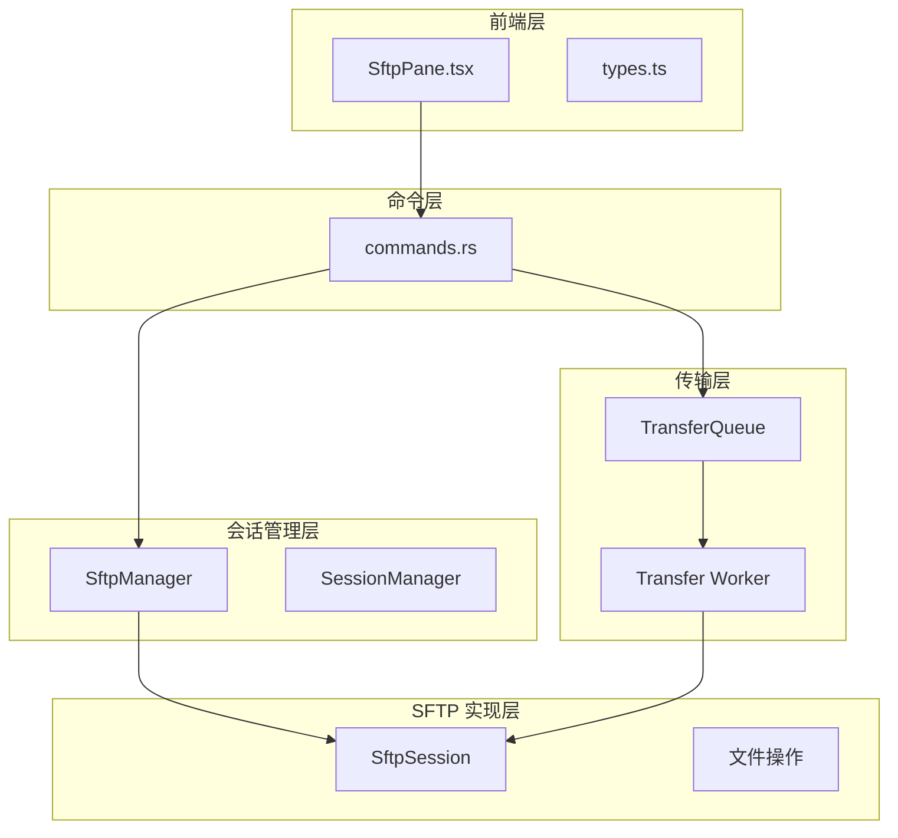
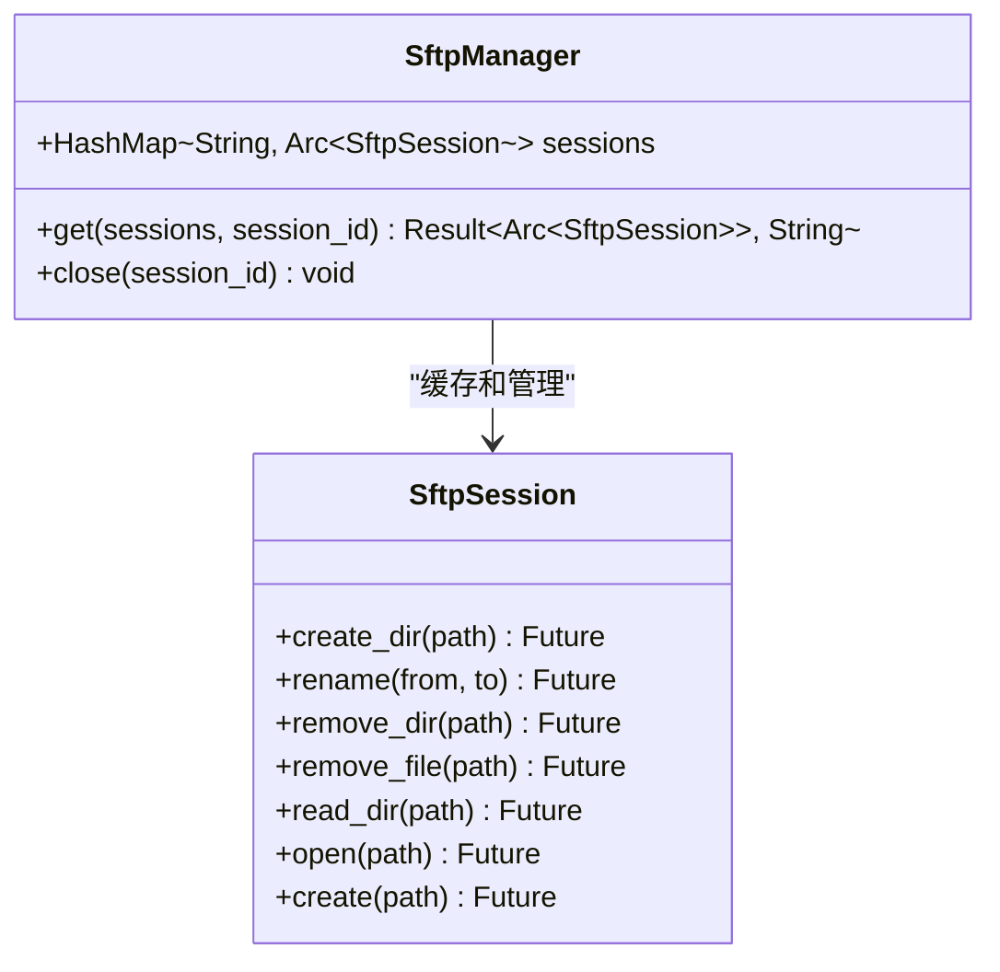
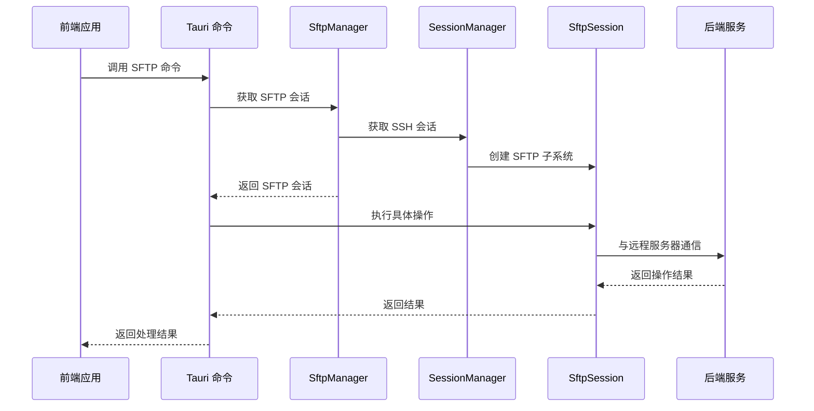
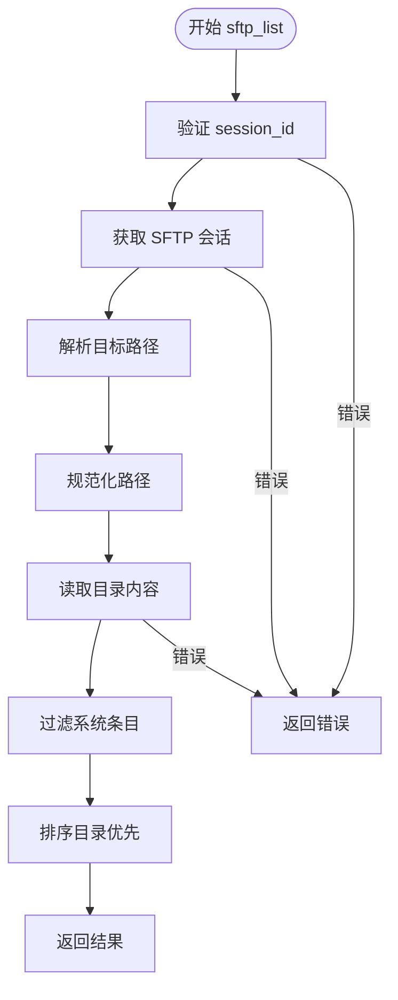
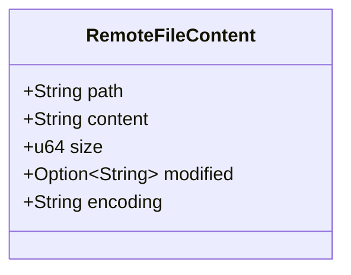
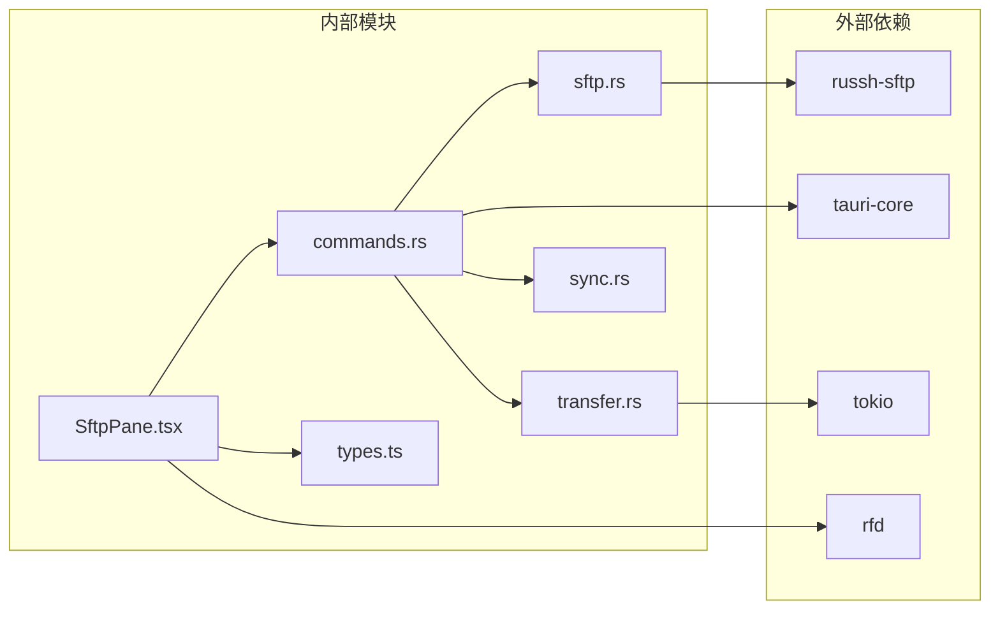

# SFTP 文件命令

<cite>
**本文档引用的文件**
- [sftp.rs](file://src-tauri/src/session/sftp.rs)
- [commands.rs](file://src-tauri/src/commands.rs)
- [transfer.rs](file://src-tauri/src/session/transfer.rs)
- [sync.rs](file://src-tauri/src/session/sync.rs)
- [SftpPane.tsx](file://src/components/SftpPane.tsx)
- [types.ts](file://src/types.ts)
</cite>

## 目录
1. [简介](#简介)
2. [项目结构](#项目结构)
3. [核心组件](#核心组件)
4. [架构概览](#架构概览)
5. [详细组件分析](#详细组件分析)
6. [依赖关系分析](#依赖关系分析)
7. [性能考虑](#性能考虑)
8. [故障排除指南](#故障排除指南)
9. [结论](#结论)
10. [附录](#附录)

## 简介

SFTP 文件管理命令是简化 SSH 客户端中文件操作功能的核心模块。该模块提供了完整的文件系统管理能力，包括目录操作、文件读写和传输辅助命令。本文档详细说明了以下命令的功能、参数验证、权限检查、错误处理和性能考虑：

- sftp_list（目录列表）
- sftp_mkdir（创建目录）
- sftp_rename（重命名/移动）
- sftp_remove（删除文件/目录）
- sftp_select_local_files（本地文件选择）
- sftp_select_folder（文件夹选择）
- sftp_read_file（远程文件读取）
- sftp_write_file（远程文件写入）

这些命令基于 Rust 的 russh-sftp 库实现，通过 Tauri 框架暴露给前端应用，支持安全的 SSH 连接和高效的文件传输。

## 项目结构

SFTP 功能分布在多个模块中，采用分层架构设计：



**图表来源**
- [commands.rs:188-433](file://src-tauri/src/commands.rs#L188-L433)
- [sftp.rs:25-75](file://src-tauri/src/session/sftp.rs#L25-L75)
- [transfer.rs:122-203](file://src-tauri/src/session/transfer.rs#L122-L203)

**章节来源**
- [commands.rs:1-996](file://src-tauri/src/commands.rs#L1-L996)
- [sftp.rs:1-124](file://src-tauri/src/session/sftp.rs#L1-L124)

## 核心组件

### SftpManager（SFTP 管理器）

SftpManager 是 SFTP 会话的缓存管理器，负责在 SSH 会话中复用 SFTP 连接：



**图表来源**
- [sftp.rs:25-75](file://src-tauri/src/session/sftp.rs#L25-L75)
- [sftp.rs:86-123](file://src-tauri/src/session/sftp.rs#L86-L123)

### FileEntry 数据模型

FileEntry 是目录项的标准数据结构，用于前后端数据交换：

| 字段名 | 类型 | 描述 | 示例 |
|--------|------|------|------|
| name | String | 文件或目录名称 | "config.txt" |
| is_dir | bool | 是否为目录 | true/false |
| is_symlink | bool | 是否为符号链接 | false |
| size | u64 | 文件大小（字节） | 1024 |
| modified | Option<String> | 修改时间 | "2024-01-15 14:30" |

**章节来源**
- [sftp.rs:14-22](file://src-tauri/src/session/sftp.rs#L14-L22)
- [types.ts:63-69](file://src/types.ts#L63-L69)

## 架构概览

SFTP 命令的完整执行流程如下：



**图表来源**
- [commands.rs:190-243](file://src-tauri/src/commands.rs#L190-L243)
- [sftp.rs:30-75](file://src-tauri/src/session/sftp.rs#L30-L75)

## 详细组件分析

### sftp_list（目录列表）

#### 功能概述
列出指定路径下的所有文件和目录，返回标准化的绝对路径和文件条目列表。

#### 参数验证
- `session_id`: 必填，有效的会话标识符
- `path`: 可选，目标路径，默认使用家目录
- 输入验证：自动处理空值和相对路径

#### 权限检查
- 自动解析用户主目录
- 过滤系统特殊目录（. 和 ..）
- 支持符号链接检测

#### 错误处理
- 会话不存在：返回 "session not found" 错误
- 权限不足：返回具体的 SFTP 错误信息
- 路径无效：返回路径解析错误

#### 性能优化
- 使用缓存机制避免重复创建 SFTP 会话
- 目录排序：目录优先，同类按名称排序
- 异步 I/O 操作



**图表来源**
- [commands.rs:190-200](file://src-tauri/src/commands.rs#L190-L200)
- [sftp.rs:86-123](file://src-tauri/src/session/sftp.rs#L86-L123)

**章节来源**
- [commands.rs:190-200](file://src-tauri/src/commands.rs#L190-L200)
- [sftp.rs:86-123](file://src-tauri/src/session/sftp.rs#L86-L123)

### sftp_mkdir（创建目录）

#### 功能概述
在指定路径创建新的目录，支持嵌套目录创建。

#### 参数验证
- `session_id`: 必填的有效会话标识符
- `path`: 必填，要创建的目录路径

#### 权限检查
- 检查父目录的写权限
- 验证路径格式的有效性
- 防止创建系统保留目录

#### 错误处理
- 父目录不存在：返回创建失败错误
- 权限不足：返回权限错误
- 路径冲突：返回已存在错误

#### 安全机制
- 路径规范化防止目录遍历攻击
- 最大深度限制防止无限递归

**章节来源**
- [commands.rs:202-212](file://src-tauri/src/commands.rs#L202-L212)

### sftp_rename（重命名/移动）

#### 功能概述
重命名或移动文件/目录，支持跨目录操作。

#### 参数验证
- `session_id`: 必填的有效会话标识符
- `from`: 必填，源路径
- `to`: 必填，目标路径

#### 权限检查
- 检查源文件/目录的读权限
- 检查目标位置的写权限
- 验证跨分区移动的可行性

#### 错误处理
- 源不存在：返回 "No such file" 错误
- 目标已存在：根据系统行为决定覆盖或报错
- 跨设备移动：可能返回不支持错误

#### 性能考虑
- 单次原子操作完成重命名
- 支持目录重命名但不递归移动内容

**章节来源**
- [commands.rs:214-225](file://src-tauri/src/commands.rs#L214-L225)

### sftp_remove（删除文件/目录）

#### 功能概述
删除指定的文件或目录，支持递归删除目录。

#### 参数验证
- `session_id`: 必填的有效会话标识符
- `path`: 必填，要删除的路径
- `is_dir`: 必填，指示是否为目录

#### 权限检查
- 检查文件/目录的删除权限
- 验证目录为空或允许递归删除
- 防止删除系统关键目录

#### 错误处理
- 文件不存在：返回 "No such file" 错误
- 权限不足：返回权限错误
- 目录非空：返回 "Directory not empty" 错误

#### 安全机制
- 确认删除操作（前端确认对话框）
- 防止删除根目录或重要系统目录
- 日志记录删除操作

**章节来源**
- [commands.rs:227-243](file://src-tauri/src/commands.rs#L227-L243)

### 本地文件选择命令

#### sftp_select_local_files（本地文件选择）

##### 功能概述
弹出本地文件选择对话框，支持多文件选择。

##### 参数验证
- 无参数输入
- 自动设置对话框标题

##### 错误处理
- 用户取消选择：返回 "未选择文件" 错误
- 文件系统访问失败：返回具体错误信息

##### 前端集成
- 使用 rfd::AsyncFileDialog 实现
- 返回绝对路径列表

**章节来源**
- [commands.rs:247-259](file://src-tauri/src/commands.rs#L247-L259)

#### sftp_select_folder（文件夹选择）

##### 功能概述
弹出文件夹选择对话框，返回所选文件夹的绝对路径。

##### 参数验证
- `title`: 必填，对话框标题

##### 错误处理
- 用户取消选择：返回 None
- 文件系统访问失败：返回具体错误

**章节来源**
- [commands.rs:261-269](file://src-tauri/src/commands.rs#L261-L269)

### 远程文件读写命令

#### sftp_read_file（远程文件读取）

##### 功能概述
读取远程文件内容，支持文本文件的最大 5MB 限制。

##### 参数验证
- `session_id`: 必填的有效会话标识符
- `path`: 必填，远程文件路径

##### 安全机制
- **文件大小限制**: 5MB 上限，防止内存溢出
- **二进制文件检测**: 检测 NUL 字节，拒绝二进制文件编辑
- **编码验证**: 确保 UTF-8 编码有效性

##### 错误处理
- 文件过大：返回 "文件过大" 错误
- 二进制文件：返回 "不支持编辑二进制文件" 错误
- 编码错误：返回 "文件不是有效的 UTF-8 文本" 错误
- 权限不足：返回具体权限错误

##### 数据模型


**图表来源**
- [commands.rs:273-281](file://src-tauri/src/commands.rs#L273-L281)

**章节来源**
- [commands.rs:283-337](file://src-tauri/src/commands.rs#L283-L337)

#### sftp_write_file（远程文件写入）

##### 功能概述
将内容写入远程文件，支持覆盖写入模式。

##### 参数验证
- `session_id`: 必填的有效会话标识符
- `path`: 必填，远程文件路径
- `content`: 必填，要写入的内容

##### 错误处理
- 目录不存在：自动创建父目录
- 权限不足：返回权限错误
- 磁盘空间不足：返回存储错误

##### 性能优化
- 使用异步写入操作
- 自动刷新缓冲区确保数据持久化

**章节来源**
- [commands.rs:339-360](file://src-tauri/src/commands.rs#L339-L360)

## 依赖关系分析

SFTP 命令的依赖关系图：



**图表来源**
- [commands.rs:1-23](file://src-tauri/src/commands.rs#L1-L23)
- [sftp.rs:1-12](file://src-tauri/src/session/sftp.rs#L1-L12)
- [transfer.rs:1-21](file://src-tauri/src/session/transfer.rs#L1-L21)

### 关键依赖特性

| 依赖项 | 版本/用途 | 安全特性 | 性能影响 |
|--------|-----------|----------|----------|
| russh-sftp | SFTP 协议实现 | 加密传输、身份验证 | 中等 |
| tauri-core | 跨平台框架 | 安全沙箱、权限控制 | 低 |
| tokio | 异步运行时 | 高效并发、内存管理 | 中等 |
| rfd | 文件对话框 | 平台原生界面 | 无 |

**章节来源**
- [commands.rs:1-23](file://src-tauri/src/commands.rs#L1-L23)
- [transfer.rs:1-21](file://src-tauri/src/session/transfer.rs#L1-L21)

## 性能考虑

### 内存管理
- **文件大小限制**: 远程文件读取限制为 5MB，防止内存溢出
- **异步 I/O**: 使用 tokio 的异步文件操作，避免阻塞主线程
- **连接复用**: SftpManager 缓存 SFTP 会话，减少连接建立开销

### 网络优化
- **批量操作**: 传输队列支持批量文件传输
- **进度报告**: 实时进度反馈，提升用户体验
- **错误恢复**: 自动重试机制，提高传输可靠性

### 前端响应性
- **非阻塞操作**: 所有文件操作都通过异步调用实现
- **状态管理**: 完整的状态跟踪和错误处理
- **用户反馈**: 实时的加载状态和错误提示

## 故障排除指南

### 常见错误及解决方案

#### 连接相关错误
| 错误类型 | 可能原因 | 解决方案 |
|----------|----------|----------|
| session not found | 会话已过期或不存在 | 重新建立 SSH 连接 |
| Permission denied | 权限不足 | 检查文件权限或联系管理员 |
| Network error | 网络连接问题 | 检查网络连接和防火墙设置 |

#### 文件操作错误
| 错误类型 | 可能原因 | 解决方案 |
|----------|----------|----------|
| No such file | 文件路径错误 | 验证文件路径的正确性 |
| Directory not empty | 目录非空 | 先删除目录内容再删除目录 |
| File too large | 超过 5MB 限制 | 使用传输队列进行大文件传输 |

#### 传输相关错误
| 错误类型 | 可能原因 | 解决方案 |
|----------|----------|----------|
| cancelled | 用户取消传输 | 重新发起传输任务 |
| failed | 传输过程中失败 | 检查磁盘空间和网络连接 |
| busy | 传输队列繁忙 | 等待现有任务完成后重试 |

### 调试技巧

1. **启用详细日志**: 检查后端日志输出
2. **验证路径**: 确保文件路径的正确性和可访问性
3. **测试权限**: 验证用户对目标文件的访问权限
4. **监控网络**: 检查网络连接的稳定性和速度

**章节来源**
- [commands.rs:283-337](file://src-tauri/src/commands.rs#L283-L337)
- [transfer.rs:206-284](file://src-tauri/src/session/transfer.rs#L206-L284)

## 结论

SFTP 文件管理命令提供了完整而安全的远程文件操作功能。通过合理的架构设计和严格的安全措施，该模块能够满足各种文件管理需求：

- **安全性**: 多层权限检查和安全机制
- **可靠性**: 完善的错误处理和恢复机制
- **性能**: 异步操作和连接复用优化
- **易用性**: 直观的 API 设计和错误提示

建议在生产环境中：
1. 定期更新 russh-sftp 库版本
2. 实施适当的日志记录策略
3. 监控文件操作的性能指标
4. 建立完善的备份和恢复机制

## 附录

### 使用示例

#### 基本目录操作
```typescript
// 列出当前目录
const [resolvedPath, entries] = await invoke<[string, FileEntry[]]>("sftp_list", {
  sessionId: "session-123",
  path: null
});

// 创建新目录
await invoke("sftp_mkdir", {
  sessionId: "session-123",
  path: "/home/user/new-folder"
});
```

#### 文件传输操作
```typescript
// 选择本地文件并上传
const files = await invoke<string[]>("sftp_select_local_files");
for (const file of files) {
  await invoke("transfer_enqueue", {
    sessionId: "session-123",
    kind: "upload",
    localPath: file,
    remotePath: `/remote/${path.basename(file)}`
  });
}
```

#### 远程文件编辑
```typescript
// 读取远程文件内容
const fileContent = await invoke<RemoteFileContent>("sftp_read_file", {
  sessionId: "session-123",
  path: "/remote/config.txt"
});

// 写入修改后的文件
await invoke("sftp_write_file", {
  sessionId: "session-123",
  path: "/remote/config.txt",
  content: fileContent.content
});
```

### 最佳实践

1. **错误处理**: 始终处理可能的异常情况
2. **资源管理**: 及时释放文件句柄和连接资源
3. **性能优化**: 对于大量文件操作，使用传输队列
4. **安全考虑**: 验证所有用户输入和文件路径
5. **用户体验**: 提供清晰的进度反馈和错误信息