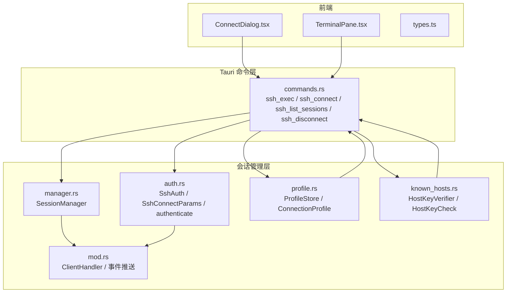
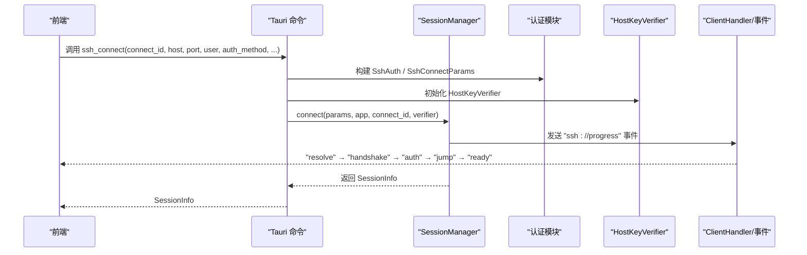
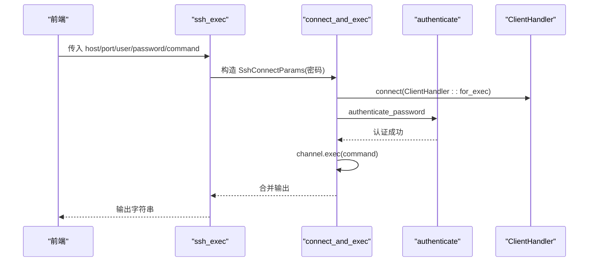
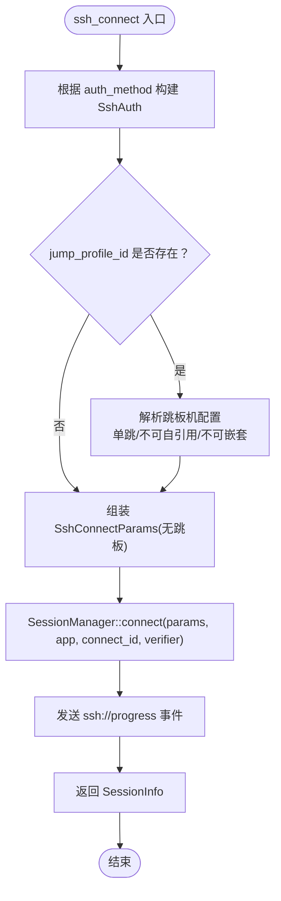
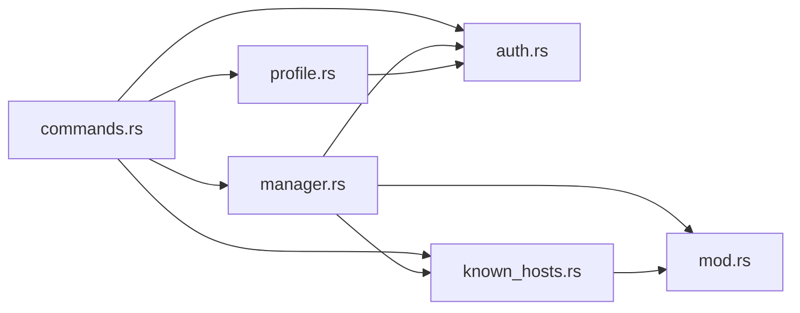

# SSH 会话命令

<cite>
**本文档引用的文件**
- [commands.rs](file://src-tauri/src/commands.rs)
- [manager.rs](file://src-tauri/src/session/manager.rs)
- [ssh.rs](file://src-tauri/src/session/ssh.rs)
- [auth.rs](file://src-tauri/src/session/auth.rs)
- [profile.rs](file://src-tauri/src/session/profile.rs)
- [known_hosts.rs](file://src-tauri/src/session/known_hosts.rs)
- [mod.rs](file://src-tauri/src/session/mod.rs)
- [types.ts](file://src/types.ts)
- [ConnectDialog.tsx](file://src/components/ConnectDialog.tsx)
- [TerminalPane.tsx](file://src/components/TerminalPane.tsx)
- [Cargo.toml](file://src-tauri/Cargo.toml)
</cite>

## 目录
1. [简介](#简介)
2. [项目结构](#项目结构)
3. [核心组件](#核心组件)
4. [架构总览](#架构总览)
5. [详细组件分析](#详细组件分析)
6. [依赖关系分析](#依赖关系分析)
7. [性能考量](#性能考量)
8. [故障排查指南](#故障排查指南)
9. [结论](#结论)
10. [附录](#附录)

## 简介
本文件面向 Tauri 应用中的 SSH 会话管理命令，系统性梳理以下核心命令：
- ssh_exec：一次性命令执行（演示用途）
- ssh_connect：建立持久会话（连接 + 认证）
- ssh_list_sessions：列出当前持久会话
- ssh_disconnect：断开会话并清理资源

文档覆盖每个命令的参数类型定义、返回值结构、错误码说明、使用示例、连接参数构建流程、认证方法处理、跳板机配置解析以及会话生命周期管理。同时提供 TypeScript 类型定义与前端调用示例，强调命令的异步特性、错误处理策略与最佳实践。

## 项目结构
后端采用 Rust + Tauri 架构，命令集中在 src-tauri/src/commands.rs 中，会话管理位于 src-tauri/src/session/ 目录下；前端 TypeScript 类型定义位于 src/types.ts，UI 组件负责事件监听与命令调用。

**图表来源**
- [commands.rs:1-996](file://src-tauri/src/commands.rs#L1-L996)
- [manager.rs:1-317](file://src-tauri/src/session/manager.rs#L1-L317)
- [auth.rs:1-82](file://src-tauri/src/session/auth.rs#L1-L82)
- [profile.rs:1-419](file://src-tauri/src/session/profile.rs#L1-L419)
- [known_hosts.rs:1-197](file://src-tauri/src/session/known_hosts.rs#L1-L197)
- [mod.rs:1-226](file://src-tauri/src/session/mod.rs#L1-L226)

**章节来源**
- [commands.rs:1-996](file://src-tauri/src/commands.rs#L1-L996)
- [manager.rs:1-317](file://src-tauri/src/session/manager.rs#L1-L317)
- [auth.rs:1-82](file://src-tauri/src/session/auth.rs#L1-L82)
- [profile.rs:1-419](file://src-tauri/src/session/profile.rs#L1-L419)
- [known_hosts.rs:1-197](file://src-tauri/src/session/known_hosts.rs#L1-L197)
- [mod.rs:1-226](file://src-tauri/src/session/mod.rs#L1-L226)

## 核心组件
- 会话管理器 SessionManager：维护持久会话池，负责连接建立、认证、断开与状态管理。
- 认证模块 auth：定义 SshAuth 与 SshConnectParams，提供密码与私钥认证逻辑。
- 配置存储 ProfileStore：保存连接配置，凭据存入系统钥匙串，元数据本地 JSON。
- 主机公钥校验 HostKeyVerifier：实现 known_hosts 校验与“探测-确认”流程。
- 前端类型定义 types.ts：提供 TypeScript 类型，确保前后端契约一致。

**章节来源**
- [manager.rs:76-253](file://src-tauri/src/session/manager.rs#L76-L253)
- [auth.rs:10-82](file://src-tauri/src/session/auth.rs#L10-L82)
- [profile.rs:67-419](file://src-tauri/src/session/profile.rs#L67-L419)
- [known_hosts.rs:91-135](file://src-tauri/src/session/known_hosts.rs#L91-L135)
- [types.ts:1-209](file://src/types.ts#L1-L209)

## 架构总览
SSH 会话命令围绕“持久会话复用”的设计展开：terminal_open、sftp_*、forward_* 等功能均基于 SessionManager 提供的共享 Handle。ssh_exec 为一次性演示，不复用会话池。

**图表来源**
- [commands.rs:44-72](file://src-tauri/src/commands.rs#L44-L72)
- [manager.rs:82-145](file://src-tauri/src/session/manager.rs#L82-L145)
- [mod.rs:115-160](file://src-tauri/src/session/mod.rs#L115-L160)

## 详细组件分析

### ssh_exec：一次性命令执行
- 功能：连接主机、认证、执行单条命令、断开，返回合并后的 stdout+stderr。
- 适用场景：早期 demo、快速验证链路。
- 参数类型（来自命令签名）：
  - host: string
  - port: number
  - user: string
  - password: string
  - command: string
- 返回值：string（输出）
- 错误：anyhow::Result 包装的错误转为字符串
- 实现要点：
  - 仅支持密码认证（私有实现限制）
  - 使用 ClientHandler::for_exec（非交互模式）
  - 执行完成后主动断开连接

**图表来源**
- [ssh.rs:13-64](file://src-tauri/src/session/ssh.rs#L13-L64)
- [auth.rs:44-81](file://src-tauri/src/session/auth.rs#L44-L81)
- [mod.rs:79-89](file://src-tauri/src/session/mod.rs#L79-L89)

**章节来源**
- [ssh.rs:1-65](file://src-tauri/src/session/ssh.rs#L1-L65)
- [commands.rs:25-38](file://src-tauri/src/commands.rs#L25-L38)

### ssh_connect：建立持久会话
- 功能：建立持久会话（连接 + 认证），返回 SessionInfo；支持密码/私钥认证与跳板机。
- 参数类型（来自命令签名）：
  - connect_id: string（关联 ssh://progress 事件）
  - host: string
  - port: number
  - user: string
  - auth_method: string（"password" | "private_key"）
  - password: string?（密码认证时必填）
  - private_key_path: string?（私钥认证时必填）
  - passphrase: string?（可选）
  - jump_profile_id: string?（可选，引用已保存配置）
- 返回值：SessionInfo
- 错误：anyhow::Result 包装的错误转为字符串
- 连接参数构建流程：
  - 根据 auth_method 构造 SshAuth
  - 若 jump_profile_id 存在，解析为 SshConnectParams（单跳、不可自引用、不可嵌套）
  - 组装 SshConnectParams 并调用 SessionManager::connect
- 认证方法处理：
  - 密码：password 必填
  - 私钥：private_key_path 必填，passphrase 可选
- 跳板机配置解析：
  - 仅允许单跳（jump_profile_id 不能为空且不可自引用）
  - 跳板机自身不得再设置 jump_profile_id
- 会话生命周期：
  - 进度事件：resolve → handshake → auth → jump → ready
  - 成功后生成唯一 SessionInfo.id 并加入会话池

**图表来源**
- [commands.rs:44-72](file://src-tauri/src/commands.rs#L44-L72)
- [commands.rs:698-766](file://src-tauri/src/commands.rs#L698-L766)
- [manager.rs:82-145](file://src-tauri/src/session/manager.rs#L82-L145)

**章节来源**
- [commands.rs:44-72](file://src-tauri/src/commands.rs#L44-L72)
- [commands.rs:698-766](file://src-tauri/src/commands.rs#L698-L766)
- [manager.rs:82-145](file://src-tauri/src/session/manager.rs#L82-L145)

### ssh_list_sessions：会话列表查询
- 功能：列出当前所有持久会话的元数据
- 参数：无
- 返回值：SessionInfo[]（数组）
- 实现：调用 SessionManager::list

**章节来源**
- [commands.rs:74-80](file://src-tauri/src/commands.rs#L74-L80)
- [manager.rs:224-232](file://src-tauri/src/session/manager.rs#L224-L232)

### ssh_disconnect：断开并移除会话
- 功能：断开并移除指定会话，同时停止其端口转发、清理 SFTP 缓存、清理监控缓存
- 参数：
  - id: string（会话 id）
- 返回值：void（Result<(), String>）
- 实现：
  - PortForwardManager::close_session
  - SftpManager::close
  - MonitorStore::clear_session
  - SessionManager::disconnect

**章节来源**
- [commands.rs:82-95](file://src-tauri/src/commands.rs#L82-L95)
- [manager.rs:234-252](file://src-tauri/src/session/manager.rs#L234-L252)

### TypeScript 类型定义与前端调用示例
- SessionInfo：会话信息
- AuthMethod：认证方式枚举
- 前端调用示例（概念性说明）：
  - 连接：invoke("ssh_connect", { connectId, host, port, user, authMethod, password?, privateKeyPath?, passphrase?, jumpProfileId? })
  - 列表：invoke("ssh_list_sessions")
  - 断开：invoke("ssh_disconnect", { id })
  - 一次性命令：invoke("ssh_exec", { host, port, user, password, command })

**章节来源**
- [types.ts:1-209](file://src/types.ts#L1-L209)
- [ConnectDialog.tsx:177-190](file://src/components/ConnectDialog.tsx#L177-L190)
- [TerminalPane.tsx:103-135](file://src/components/TerminalPane.tsx#L103-L135)

## 依赖关系分析
- 外部依赖：russh（SSH 协议）、keyring（系统钥匙串）、dirs（配置路径）、tokio（异步运行时）
- 内部模块耦合：
  - commands.rs 依赖 manager.rs、auth.rs、profile.rs、known_hosts.rs
  - manager.rs 依赖 auth.rs、known_hosts.rs、mod.rs（ClientHandler）
  - profile.rs 依赖 auth.rs、secrets（内存缓存）、keyring
  - known_hosts.rs 依赖 russh::keys::known_hosts

**图表来源**
- [Cargo.toml:22-49](file://src-tauri/Cargo.toml#L22-L49)
- [commands.rs:1-21](file://src-tauri/src/commands.rs#L1-L21)
- [manager.rs:1-25](file://src-tauri/src/session/manager.rs#L1-L25)
- [auth.rs:1-10](file://src-tauri/src/session/auth.rs#L1-L10)
- [profile.rs:1-17](file://src-tauri/src/session/profile.rs#L1-L17)
- [known_hosts.rs:1-25](file://src-tauri/src/session/known_hosts.rs#L1-L25)

**章节来源**
- [Cargo.toml:1-50](file://src-tauri/Cargo.toml#L1-L50)

## 性能考量
- 超时控制：TCP 建连、SSH 握手、认证均有明确 TTL，避免阻塞
- 连接复用：SessionManager 共享 Handle，减少重复握手成本
- 异步并发：Tokio 任务模型，事件驱动，避免阻塞 UI
- 前端优化：终端面板使用 xterm.js + WebGL 加速渲染，ResizeObserver 防抖

[本节为通用建议，无需特定文件引用]

## 故障排查指南
- 认证失败
  - 检查用户名/密码或私钥路径与口令
  - 私钥认证需正确加载密钥与口令
- 主机公钥校验
  - 首次连接或公钥变更会触发 ssh://hostkey 事件
  - 前端确认后调用 hostkey_trust 落盘，再重连
- 跳板机问题
  - 不支持嵌套跳板，仅允许单跳
  - 跳板机不可自引用
- 连接超时
  - TCP 建连超时、SSH 握手超时、认证超时均有明确报错
- 断开异常
  - 断开时会清理转发、SFTP、监控缓存，若出现残留可手动清理

**章节来源**
- [auth.rs:44-81](file://src-tauri/src/session/auth.rs#L44-L81)
- [manager.rs:255-273](file://src-tauri/src/session/manager.rs#L255-L273)
- [known_hosts.rs:97-135](file://src-tauri/src/session/known_hosts.rs#L97-L135)
- [commands.rs:724-766](file://src-tauri/src/commands.rs#L724-L766)

## 结论
本文档系统阐述了 SSH 会话命令的设计与实现，明确了参数、返回值、错误处理与生命周期管理。持久会话复用机制提升了资源利用率与用户体验，配合前端事件与 UI 组件实现了完整的连接流程闭环。建议在生产环境中优先使用 ssh_connect 与 ssh_list_sessions/ssh_disconnect 管理会话，ssh_exec 仅用于演示与快速验证。

[本节为总结，无需特定文件引用]

## 附录

### 命令参数与返回值一览
- ssh_exec
  - 输入：host, port, user, password, command
  - 输出：string
- ssh_connect
  - 输入：connect_id, host, port, user, auth_method, password?, private_key_path?, passphrase?, jump_profile_id?
  - 输出：SessionInfo
- ssh_list_sessions
  - 输入：无
  - 输出：SessionInfo[]
- ssh_disconnect
  - 输入：id
  - 输出：void

**章节来源**
- [commands.rs:25-95](file://src-tauri/src/commands.rs#L25-L95)
- [types.ts:1-9](file://src/types.ts#L1-L9)

### 前端调用示例（概念性说明）
- 连接并打开终端
  - invoke("ssh_connect", { connectId, host, port, user, authMethod, password?, privateKeyPath?, passphrase?, jumpProfileId? })
  - invoke("terminal_open", { sessionId, cols, rows, enableX11? })
- 列出会话与断开
  - invoke("ssh_list_sessions")
  - invoke("ssh_disconnect", { id })

**章节来源**
- [ConnectDialog.tsx:177-190](file://src/components/ConnectDialog.tsx#L177-L190)
- [TerminalPane.tsx:103-135](file://src/components/TerminalPane.tsx#L103-L135)