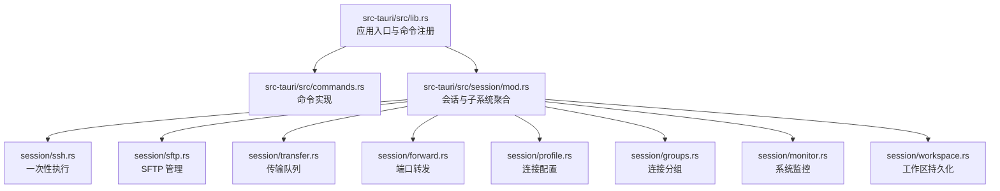
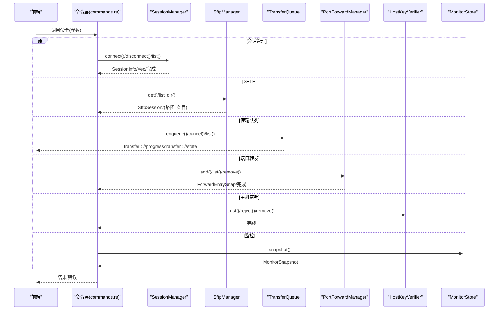
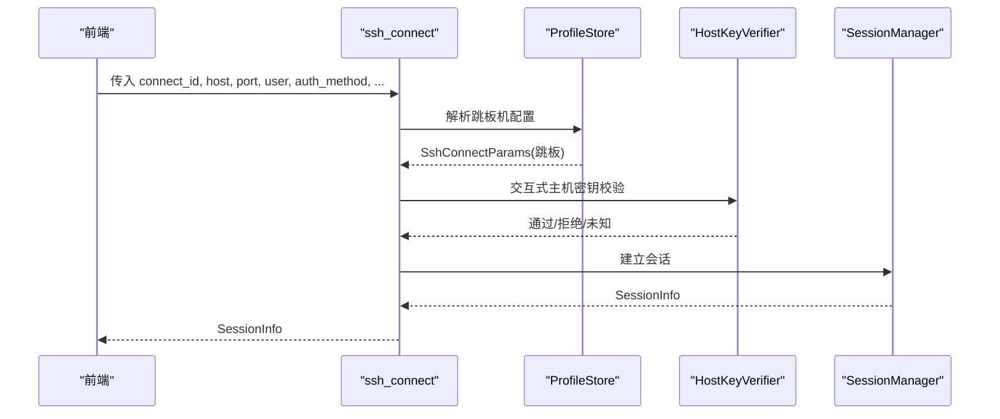
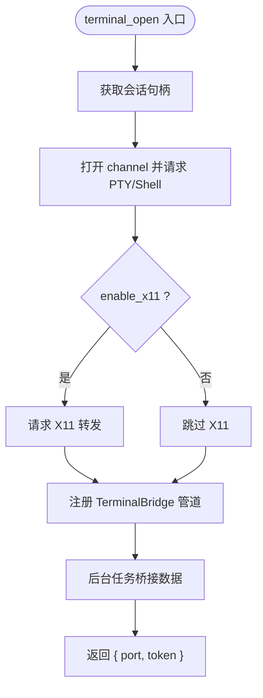
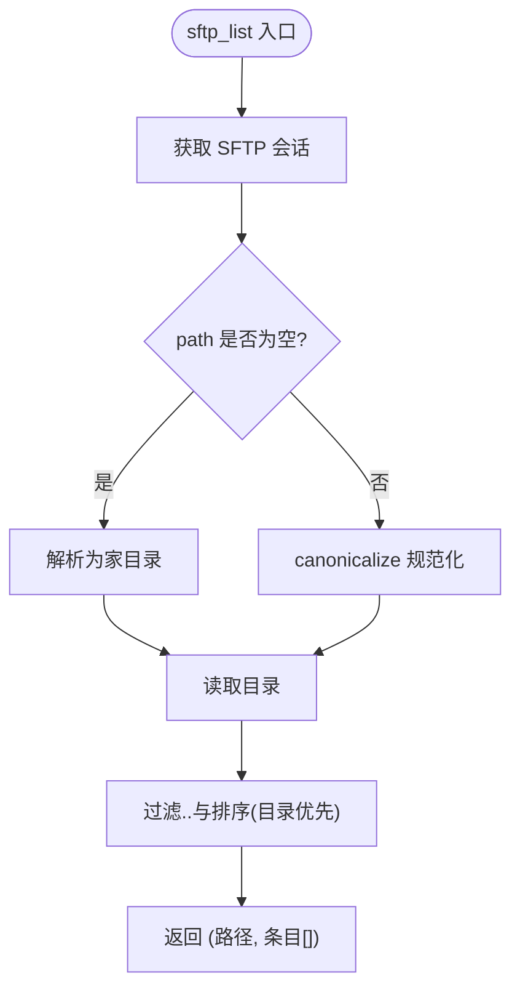
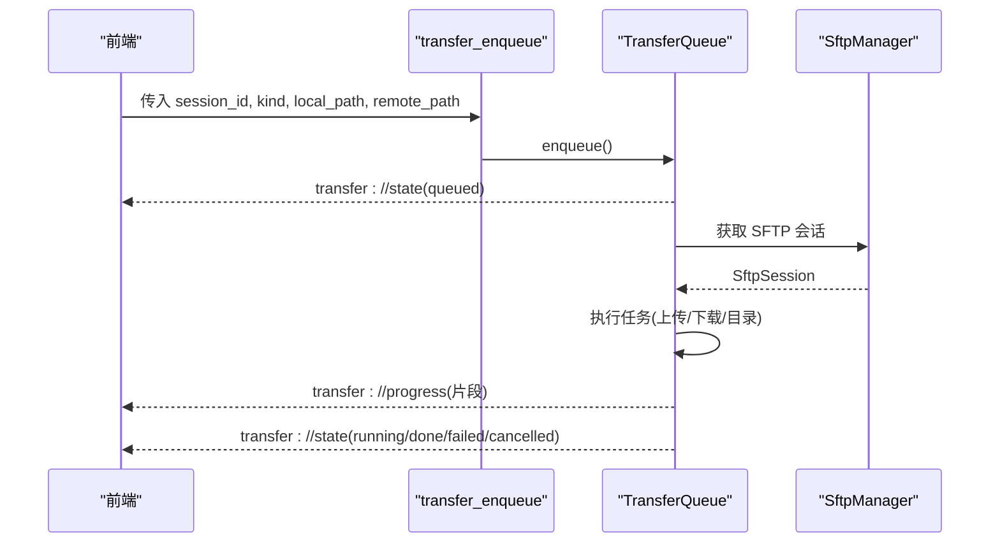
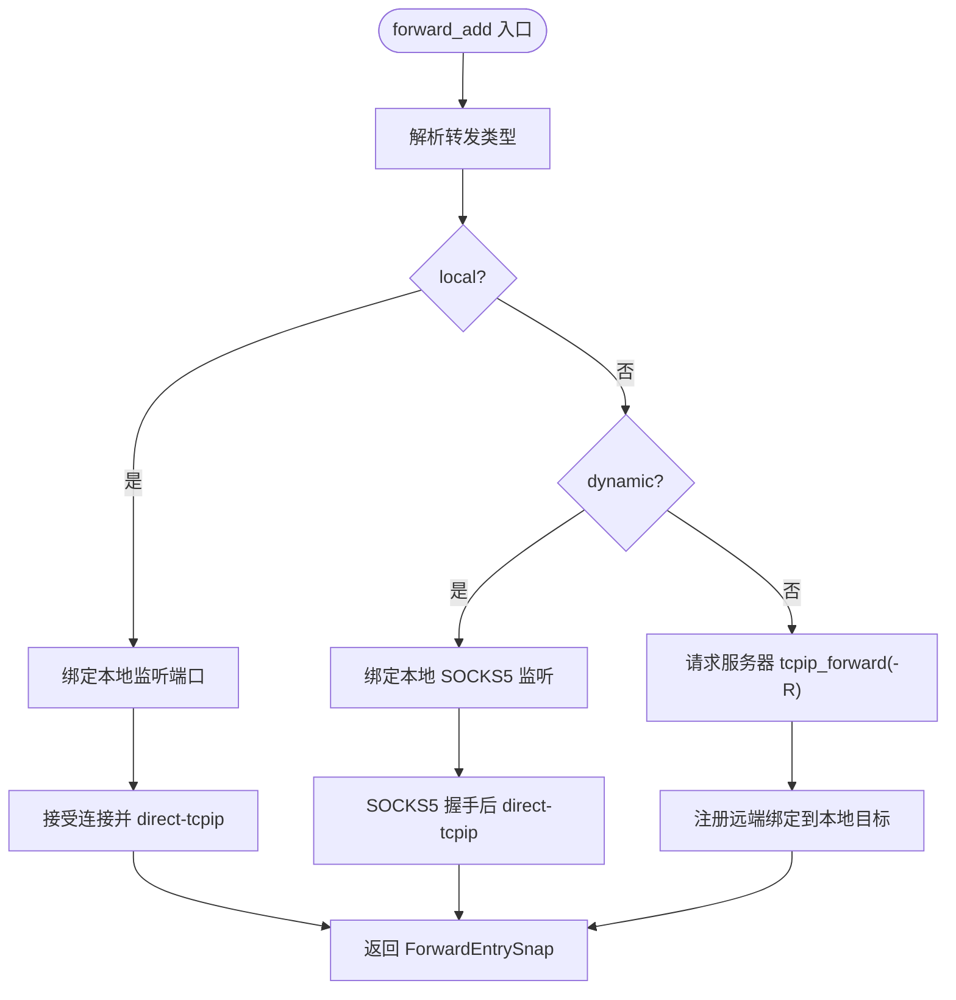
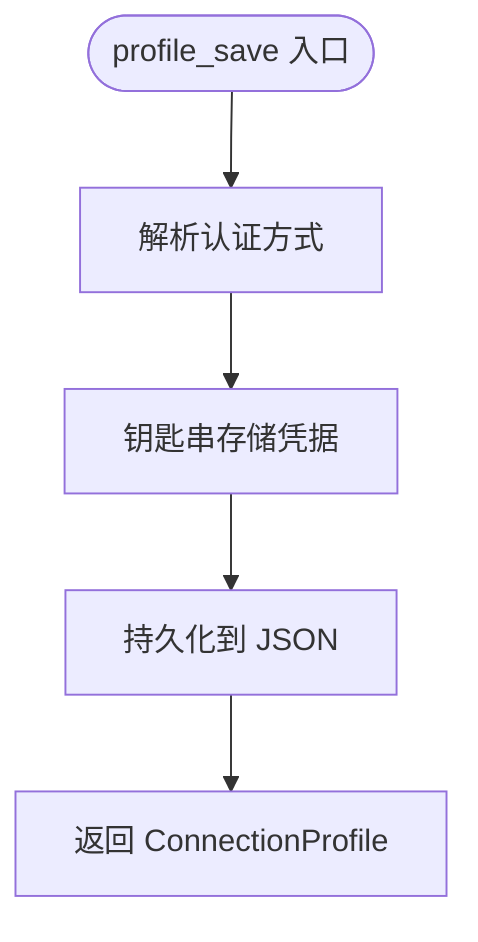
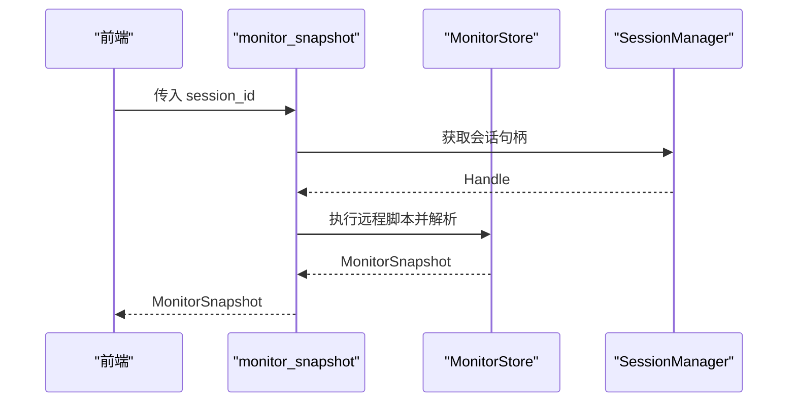
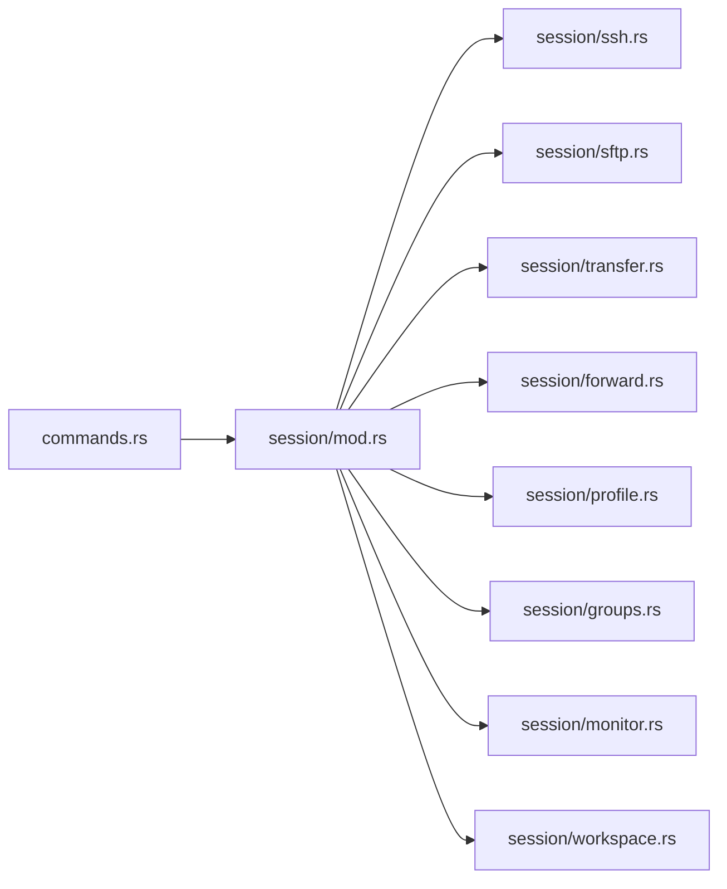

# Tauri 命令 API

<cite>
**本文档引用的文件**
- [src-tauri/src/lib.rs](file://src-tauri/src/lib.rs)
- [src-tauri/src/main.rs](file://src-tauri/src/main.rs)
- [src-tauri/src/commands.rs](file://src-tauri/src/commands.rs)
- [src-tauri/src/session/mod.rs](file://src-tauri/src/session/mod.rs)
- [src-tauri/src/session/ssh.rs](file://src-tauri/src/session/ssh.rs)
- [src-tauri/src/session/sftp.rs](file://src-tauri/src/session/sftp.rs)
- [src-tauri/src/session/transfer.rs](file://src-tauri/src/session/transfer.rs)
- [src-tauri/src/session/profile.rs](file://src-tauri/src/session/profile.rs)
- [src-tauri/src/session/forward.rs](file://src-tauri/src/session/forward.rs)
- [src-tauri/src/session/groups.rs](file://src-tauri/src/session/groups.rs)
- [src-tauri/src/session/monitor.rs](file://src-tauri/src/session/monitor.rs)
- [src-tauri/src/session/workspace.rs](file://src-tauri/src/session/workspace.rs)
- [src-tauri/Cargo.toml](file://src-tauri/Cargo.toml)
- [src-tauri/tauri.conf.json](file://src-tauri/tauri.conf.json)
</cite>

## 目录
1. [简介](#简介)
2. [项目结构](#项目结构)
3. [核心组件](#核心组件)
4. [架构总览](#架构总览)
5. [详细组件分析](#详细组件分析)
6. [依赖关系分析](#依赖关系分析)
7. [性能考量](#性能考量)
8. [故障排查指南](#故障排查指南)
9. [结论](#结论)
10. [附录](#附录)

## 简介
本文件系统性梳理了 Tauri 应用中暴露给前端的 Rust 命令 API，涵盖 SSH 会话管理、终端操作、SFTP 文件管理、传输队列、端口转发、连接配置与分组、系统监控等模块。文档逐项说明命令签名、参数类型、返回值结构、错误处理机制，并提供 TypeScript 类型定义与调用示例，帮助开发者正确使用这些命令。

## 项目结构
应用采用“薄封装”的命令层设计：命令函数位于 commands.rs，具体业务逻辑分布在 session 子模块中，如会话管理、SFTP、传输队列、端口转发、配置与分组、监控等。应用启动时集中注册所有命令并通过 Tauri 的 invoke_handler 暴露给前端。

**图表来源**
- [src-tauri/src/lib.rs:43-89](file://src-tauri/src/lib.rs#L43-L89)
- [src-tauri/src/commands.rs:1-20](file://src-tauri/src/commands.rs#L1-L20)
- [src-tauri/src/session/mod.rs:1-40](file://src-tauri/src/session/mod.rs#L1-L40)

**章节来源**
- [src-tauri/src/lib.rs:14-92](file://src-tauri/src/lib.rs#L14-L92)
- [src-tauri/src/main.rs:4-6](file://src-tauri/src/main.rs#L4-L6)

## 核心组件
- 命令注册与生命周期：应用启动时注册所有命令，并注入会话管理器、SFTP 管理器、传输队列、端口转发、主机密钥验证器、监控存储、工作区存储等状态对象。
- 会话复用：终端、SFTP、传输、端口转发均复用同一个 SSH 会话连接，避免重复认证与握手。
- 异步与事件：传输进度通过 transfer://progress 事件推送，传输状态变更通过 transfer://state 推送；主机密钥确认通过 ssh://hostkey 事件推送。

**章节来源**
- [src-tauri/src/lib.rs:20-42](file://src-tauri/src/lib.rs#L20-L42)
- [src-tauri/src/lib.rs:43-89](file://src-tauri/src/lib.rs#L43-L89)

## 架构总览
下图展示了命令到具体实现的调用关系与数据流：

**图表来源**
- [src-tauri/src/commands.rs:44-95](file://src-tauri/src/commands.rs#L44-L95)
- [src-tauri/src/commands.rs:192-243](file://src-tauri/src/commands.rs#L192-L243)
- [src-tauri/src/commands.rs:366-406](file://src-tauri/src/commands.rs#L366-L406)
- [src-tauri/src/commands.rs:438-514](file://src-tauri/src/commands.rs#L438-L514)
- [src-tauri/src/commands.rs:682-688](file://src-tauri/src/commands.rs#L682-L688)

## 详细组件分析

### SSH 会话管理命令
- ssh_exec
  - 参数：host, port, user, password, command
  - 返回：一次性执行结果（stdout+stderr）
  - 错误：认证失败、命令执行失败等
  - 用途：早期 demo 的一次性连接执行
  - 示例：参见“调用示例”章节
  - 章节来源
    - [src-tauri/src/commands.rs:27-38](file://src-tauri/src/commands.rs#L27-L38)
    - [src-tauri/src/session/ssh.rs:14-64](file://src-tauri/src/session/ssh.rs#L14-L64)

- ssh_connect
  - 参数：connect_id, host, port, user, auth_method, password?, private_key_path?, passphrase?, jump_profile_id?
  - 返回：SessionInfo
  - 错误：认证参数非法、跳板机配置错误、连接失败
  - 特性：支持密码/私钥认证，支持单跳跳板机，交互式主机密钥校验
  - 章节来源
    - [src-tauri/src/commands.rs:44-72](file://src-tauri/src/commands.rs#L44-L72)
    - [src-tauri/src/commands.rs:690-722](file://src-tauri/src/commands.rs#L690-L722)
    - [src-tauri/src/commands.rs:724-766](file://src-tauri/src/commands.rs#L724-L766)

- ssh_list_sessions
  - 参数：无
  - 返回：当前所有会话列表
  - 章节来源
    - [src-tauri/src/commands.rs:76-80](file://src-tauri/src/commands.rs#L76-L80)

- ssh_disconnect
  - 参数：id
  - 返回：完成
  - 特性：同时停止该会话的所有端口转发、清理 SFTP 缓存、清理监控快照
  - 章节来源
    - [src-tauri/src/commands.rs:84-95](file://src-tauri/src/commands.rs#L84-L95)

- TypeScript 类型定义
  - 命令签名
    - ssh_exec(host: string, port: number, user: string, password: string, command: string): Promise<string>
    - ssh_connect(params: ConnectParams): Promise<SessionInfo>
    - ssh_list_sessions(): Promise<SessionInfo[]>
    - ssh_disconnect(id: string): Promise<void>
  - 参数与返回类型
    - ConnectParams: { connect_id: string, host: string, port: number, user: string, auth_method: 'password' | 'private_key', password?: string, private_key_path?: string, passphrase?: string, jump_profile_id?: string }
    - SessionInfo: { id: string, host: string, port: number, user: string, connected_at: string }
  - 章节来源
    - [src-tauri/src/commands.rs:27-38](file://src-tauri/src/commands.rs#L27-L38)
    - [src-tauri/src/commands.rs:44-72](file://src-tauri/src/commands.rs#L44-L72)
    - [src-tauri/src/commands.rs:76-80](file://src-tauri/src/commands.rs#L76-L80)
    - [src-tauri/src/commands.rs:84-95](file://src-tauri/src/commands.rs#L84-L95)

- 调用示例
  - 连接并执行命令
    - 前端调用：await invoke('ssh_exec', { host, port, user, password, command })
    - 返回：字符串（输出）
  - 建立持久会话
    - 前端调用：await invoke('ssh_connect', { connect_id, host, port, user, auth_method, ... })
    - 返回：SessionInfo
  - 章节来源
    - [src-tauri/src/commands.rs:27-38](file://src-tauri/src/commands.rs#L27-L38)
    - [src-tauri/src/commands.rs:44-72](file://src-tauri/src/commands.rs#L44-L72)

**图表来源**
- [src-tauri/src/commands.rs:44-72](file://src-tauri/src/commands.rs#L44-L72)
- [src-tauri/src/commands.rs:724-766](file://src-tauri/src/commands.rs#L724-L766)

### 终端操作命令
- terminal_open
  - 参数：session_id, cols, rows, enable_x11?
  - 返回：TerminalHandle { port, token }
  - 特性：在指定会话上打开 PTY，返回本地 WebSocket 端口与一次性 token；可选启用 X11 转发
  - 章节来源
    - [src-tauri/src/commands.rs:107-186](file://src-tauri/src/commands.rs#L107-L186)

- TypeScript 类型定义
  - 命令签名
    - terminal_open(session_id: string, cols: number, rows: number, enable_x11?: boolean): Promise<TerminalHandle>
  - 返回类型
    - TerminalHandle: { port: number, token: string }
  - 章节来源
    - [src-tauri/src/commands.rs:99-103](file://src-tauri/src/commands.rs#L99-L103)
    - [src-tauri/src/commands.rs:107-186](file://src-tauri/src/commands.rs#L107-L186)

- 调用示例
  - 前端调用：await invoke('terminal_open', { session_id, cols, rows, enable_x11 })
  - 返回：{ port, token }
  - 章节来源
    - [src-tauri/src/commands.rs:107-186](file://src-tauri/src/commands.rs#L107-L186)

**图表来源**
- [src-tauri/src/commands.rs:107-186](file://src-tauri/src/commands.rs#L107-L186)

### SFTP 文件管理命令
- sftp_list
  - 参数：session_id, path?
  - 返回：(规范化绝对路径, 条目列表)
  - 条目结构：FileEntry { name, is_dir, is_symlink, size, modified }
  - 章节来源
    - [src-tauri/src/commands.rs:192-200](file://src-tauri/src/commands.rs#L192-L200)
    - [src-tauri/src/session/sftp.rs:15-22](file://src-tauri/src/session/sftp.rs#L15-L22)
    - [src-tauri/src/session/sftp.rs:87-123](file://src-tauri/src/session/sftp.rs#L87-L123)

- sftp_mkdir
  - 参数：session_id, path
  - 返回：完成
  - 章节来源
    - [src-tauri/src/commands.rs:204-212](file://src-tauri/src/commands.rs#L204-L212)

- sftp_rename
  - 参数：session_id, from, to
  - 返回：完成
  - 章节来源
    - [src-tauri/src/commands.rs:216-225](file://src-tauri/src/commands.rs#L216-L225)

- sftp_remove
  - 参数：session_id, path, is_dir
  - 返回：完成
  - 章节来源
    - [src-tauri/src/commands.rs:229-243](file://src-tauri/src/commands.rs#L229-L243)

- sftp_select_local_files / sftp_select_folder
  - 用途：弹出本地文件/文件夹选择框（不执行传输）
  - 返回：文件绝对路径数组 / 文件夹绝对路径
  - 章节来源
    - [src-tauri/src/commands.rs:247-269](file://src-tauri/src/commands.rs#L247-L269)

- sftp_read_file / sftp_write_file
  - 读取：限制 5MB，UTF-8 文本；返回 RemoteFileContent { path, content, size, modified, encoding }
  - 写入：覆盖写入
  - 章节来源
    - [src-tauri/src/commands.rs:285-360](file://src-tauri/src/commands.rs#L285-L360)

- TypeScript 类型定义
  - 命令签名
    - sftp_list(session_id: string, path?: string): Promise<[string, FileEntry[]]>
    - sftp_mkdir(session_id: string, path: string): Promise<void>
    - sftp_rename(session_id: string, from: string, to: string): Promise<void>
    - sftp_remove(session_id: string, path: string, is_dir: boolean): Promise<void>
    - sftp_select_local_files(): Promise<string[]>
    - sftp_select_folder(title: string): Promise<string?>
    - sftp_read_file(session_id: string, path: string): Promise<RemoteFileContent>
    - sftp_write_file(session_id: string, path: string, content: string): Promise<void>
  - 返回类型
    - FileEntry: { name: string, is_dir: boolean, is_symlink: boolean, size: number, modified?: string }
    - RemoteFileContent: { path: string, content: string, size: number, modified?: string, encoding: string }
  - 章节来源
    - [src-tauri/src/commands.rs:192-200](file://src-tauri/src/commands.rs#L192-L200)
    - [src-tauri/src/commands.rs:285-360](file://src-tauri/src/commands.rs#L285-L360)

- 调用示例
  - 列目录：await invoke('sftp_list', { session_id, path })
  - 创建目录：await invoke('sftp_mkdir', { session_id, path })
  - 重命名：await invoke('sftp_rename', { session_id, from, to })
  - 删除：await invoke('sftp_remove', { session_id, path, is_dir })
  - 读取文件：await invoke('sftp_read_file', { session_id, path })
  - 写入文件：await invoke('sftp_write_file', { session_id, path, content })
  - 章节来源
    - [src-tauri/src/commands.rs:192-243](file://src-tauri/src/commands.rs#L192-L243)
    - [src-tauri/src/commands.rs:285-360](file://src-tauri/src/commands.rs#L285-L360)

**图表来源**
- [src-tauri/src/commands.rs:192-200](file://src-tauri/src/commands.rs#L192-L200)
- [src-tauri/src/session/sftp.rs:87-123](file://src-tauri/src/session/sftp.rs#L87-L123)

### 传输队列命令
- transfer_enqueue
  - 参数：session_id, kind('upload'|'uploadDir'|'download'), local_path, remote_path
  - 返回：task_id
  - 章节来源
    - [src-tauri/src/commands.rs:366-388](file://src-tauri/src/commands.rs#L366-L388)

- transfer_cancel
  - 参数：id
  - 返回：完成
  - 章节来源
    - [src-tauri/src/commands.rs:392-398](file://src-tauri/src/commands.rs#L392-L398)

- transfer_list
  - 参数：无
  - 返回：所有任务快照数组
  - 章节来源
    - [src-tauri/src/commands.rs:402-406](file://src-tauri/src/commands.rs#L402-L406)

- sync_directory
  - 参数：session_id, local_dir, remote_dir, mode('upload'|'download'|'two-way')
  - 返回：同步计划结果
  - 章节来源
    - [src-tauri/src/commands.rs:410-431](file://src-tauri/src/commands.rs#L410-L431)

- 事件推送
  - transfer://progress: { task_id, name, transferred, total }
  - transfer://state: 任务快照
  - 章节来源
    - [src-tauri/src/session/transfer.rs:178-202](file://src-tauri/src/session/transfer.rs#L178-L202)
    - [src-tauri/src/session/transfer.rs:286-292](file://src-tauri/src/session/transfer.rs#L286-L292)

- TypeScript 类型定义
  - 命令签名
    - transfer_enqueue(session_id: string, kind: string, local_path: string, remote_path: string): Promise<string>
    - transfer_cancel(id: string): Promise<void>
    - transfer_list(): Promise<TransferTaskSnap[]>
    - sync_directory(session_id: string, local_dir: string, remote_dir: string, mode: string): Promise<SyncPlanResult>
  - 返回类型
    - TransferTaskSnap: { id, session_id, kind, name, total, transferred, status, error?: string }
    - SyncPlanResult: 由同步逻辑返回（结构取决于实现）
  - 章节来源
    - [src-tauri/src/commands.rs:366-406](file://src-tauri/src/commands.rs#L366-L406)
    - [src-tauri/src/commands.rs:410-431](file://src-tauri/src/commands.rs#L410-L431)

- 调用示例
  - 入队：await invoke('transfer_enqueue', { session_id, kind, local_path, remote_path })
  - 取消：await invoke('transfer_cancel', { id })
  - 列表：await invoke('transfer_list')
  - 同步：await invoke('sync_directory', { session_id, local_dir, remote_dir, mode })
  - 章节来源
    - [src-tauri/src/commands.rs:366-406](file://src-tauri/src/commands.rs#L366-L406)
    - [src-tauri/src/commands.rs:410-431](file://src-tauri/src/commands.rs#L410-L431)

**图表来源**
- [src-tauri/src/commands.rs:366-406](file://src-tauri/src/commands.rs#L366-L406)
- [src-tauri/src/session/transfer.rs:178-202](file://src-tauri/src/session/transfer.rs#L178-L202)

### 端口转发命令
- forward_add
  - 参数：session_id, kind('local'|'remote'|'dynamic'), local_addr, local_port, remote_host?, remote_port?
  - 返回：ForwardEntrySnap
  - 章节来源
    - [src-tauri/src/commands.rs:438-472](file://src-tauri/src/commands.rs#L438-L472)

- forward_list
  - 参数：无
  - 返回：ForwardEntrySnap[]
  - 章节来源
    - [src-tauri/src/commands.rs:476-480](file://src-tauri/src/commands.rs#L476-L480)

- forward_remove
  - 参数：id
  - 返回：完成；-R 额外通知服务器取消远端绑定
  - 章节来源
    - [src-tauri/src/commands.rs:484-514](file://src-tauri/src/commands.rs#L484-L514)

- TypeScript 类型定义
  - 命令签名
    - forward_add(session_id: string, kind: string, local_addr: string, local_port: number, remote_host?: string, remote_port?: number): Promise<ForwardEntrySnap>
    - forward_list(): Promise<ForwardEntrySnap[]>
    - forward_remove(id: string): Promise<void>
  - 返回类型
    - ForwardEntrySnap: { id, session_id, kind, local_addr, local_port, remote_host?, remote_port?, bound_port, state }
  - 章节来源
    - [src-tauri/src/commands.rs:438-472](file://src-tauri/src/commands.rs#L438-L472)
    - [src-tauri/src/commands.rs:476-480](file://src-tauri/src/commands.rs#L476-L480)
    - [src-tauri/src/commands.rs:484-514](file://src-tauri/src/commands.rs#L484-L514)

- 调用示例
  - 添加本地转发：await invoke('forward_add', { session_id, kind: 'local', local_addr, local_port, remote_host, remote_port })
  - 添加动态转发：await invoke('forward_add', { session_id, kind: 'dynamic', local_addr, local_port })
  - 添加远程转发：await invoke('forward_add', { session_id, kind: 'remote', local_addr, local_port, remote_host, remote_port })
  - 列表：await invoke('forward_list')
  - 删除：await invoke('forward_remove', { id })
  - 章节来源
    - [src-tauri/src/commands.rs:438-514](file://src-tauri/src/commands.rs#L438-L514)

**图表来源**
- [src-tauri/src/commands.rs:438-472](file://src-tauri/src/commands.rs#L438-L472)
- [src-tauri/src/session/forward.rs:124-191](file://src-tauri/src/session/forward.rs#L124-L191)

### 连接配置命令
- profile_list
  - 参数：无
  - 返回：ConnectionProfile[]
  - 章节来源
    - [src-tauri/src/commands.rs:520-524](file://src-tauri/src/commands.rs#L520-L524)

- profile_save
  - 参数：name, host, port, user, auth_method, password?, private_key_path?, passphrase?, group_id?, jump_profile_id?
  - 返回：新建的 ConnectionProfile
  - 章节来源
    - [src-tauri/src/commands.rs:529-557](file://src-tauri/src/commands.rs#L529-L557)

- profile_update
  - 参数：id, name, host, port, user, auth_method, password?, private_key_path?, passphrase?, group_id?, jump_profile_id?
  - 返回：更新后的 ConnectionProfile
  - 章节来源
    - [src-tauri/src/commands.rs:562-594](file://src-tauri/src/commands.rs#L562-L594)

- profile_delete
  - 参数：id
  - 返回：完成
  - 章节来源
    - [src-tauri/src/commands.rs:610-615](file://src-tauri/src/commands.rs#L610-L615)

- profile_connect
  - 参数：connect_id, id
  - 返回：SessionInfo
  - 章节来源
    - [src-tauri/src/commands.rs:619-636](file://src-tauri/src/commands.rs#L619-L636)

- profile_select_private_key
  - 参数：无
  - 返回：私钥文件绝对路径或空
  - 章节来源
    - [src-tauri/src/commands.rs:598-605](file://src-tauri/src/commands.rs#L598-L605)

- TypeScript 类型定义
  - 命令签名
    - profile_list(): Promise<ConnectionProfile[]>
    - profile_save(params: SaveParams): Promise<ConnectionProfile>
    - profile_update(params: UpdateParams): Promise<ConnectionProfile>
    - profile_delete(id: string): Promise<void>
    - profile_connect(connect_id: string, id: string): Promise<SessionInfo>
    - profile_select_private_key(): Promise<string?>
  - 返回类型
    - ConnectionProfile: { id, name, host, port, user, auth_method, private_key_path?: string, group_id?: string, jump_profile_id?: string }
  - 章节来源
    - [src-tauri/src/commands.rs:520-524](file://src-tauri/src/commands.rs#L520-L524)
    - [src-tauri/src/commands.rs:529-557](file://src-tauri/src/commands.rs#L529-L557)
    - [src-tauri/src/commands.rs:562-594](file://src-tauri/src/commands.rs#L562-L594)
    - [src-tauri/src/commands.rs:619-636](file://src-tauri/src/commands.rs#L619-L636)
    - [src-tauri/src/commands.rs:598-605](file://src-tauri/src/commands.rs#L598-L605)

- 调用示例
  - 保存：await invoke('profile_save', { name, host, port, user, auth_method, ... })
  - 更新：await invoke('profile_update', { id, name, host, port, user, auth_method, ... })
  - 删除：await invoke('profile_delete', { id })
  - 连接：await invoke('profile_connect', { connect_id, id })
  - 章节来源
    - [src-tauri/src/commands.rs:529-557](file://src-tauri/src/commands.rs#L529-L557)
    - [src-tauri/src/commands.rs:562-594](file://src-tauri/src/commands.rs#L562-L594)
    - [src-tauri/src/commands.rs:610-615](file://src-tauri/src/commands.rs#L610-L615)
    - [src-tauri/src/commands.rs:619-636](file://src-tauri/src/commands.rs#L619-L636)

**图表来源**
- [src-tauri/src/commands.rs:529-557](file://src-tauri/src/commands.rs#L529-L557)
- [src-tauri/src/session/profile.rs:103-128](file://src-tauri/src/session/profile.rs#L103-L128)

### 连接分组命令
- group_list
  - 参数：无
  - 返回：ProfileGroup[]
  - 章节来源
    - [src-tauri/src/commands.rs:642-646](file://src-tauri/src/commands.rs#L642-L646)

- group_create
  - 参数：name
  - 返回：新建的 ProfileGroup
  - 章节来源
    - [src-tauri/src/commands.rs:650-655](file://src-tauri/src/commands.rs#L650-L655)

- group_rename
  - 参数：id, name
  - 返回：重命名后的 ProfileGroup
  - 章节来源
    - [src-tauri/src/commands.rs:659-665](file://src-tauri/src/commands.rs#L659-L665)

- group_delete
  - 参数：id
  - 返回：完成
  - 章节来源
    - [src-tauri/src/commands.rs:669-676](file://src-tauri/src/commands.rs#L669-L676)

- TypeScript 类型定义
  - 命令签名
    - group_list(): Promise<ProfileGroup[]>
    - group_create(name: string): Promise<ProfileGroup>
    - group_rename(id: string, name: string): Promise<ProfileGroup>
    - group_delete(id: string): Promise<void>
  - 返回类型
    - ProfileGroup: { id, name, order: number }
  - 章节来源
    - [src-tauri/src/commands.rs:642-646](file://src-tauri/src/commands.rs#L642-L646)
    - [src-tauri/src/commands.rs:650-655](file://src-tauri/src/commands.rs#L650-L655)
    - [src-tauri/src/commands.rs:659-665](file://src-tauri/src/commands.rs#L659-L665)
    - [src-tauri/src/commands.rs:669-676](file://src-tauri/src/commands.rs#L669-L676)

- 调用示例
  - 列表：await invoke('group_list')
  - 创建：await invoke('group_create', { name })
  - 重命名：await invoke('group_rename', { id, name })
  - 删除：await invoke('group_delete', { id })
  - 章节来源
    - [src-tauri/src/commands.rs:642-676](file://src-tauri/src/commands.rs#L642-L676)

### 系统监控命令
- monitor_snapshot
  - 参数：session_id
  - 返回：MonitorSnapshot
  - 章节来源
    - [src-tauri/src/commands.rs:682-688](file://src-tauri/src/commands.rs#L682-L688)

- TypeScript 类型定义
  - 命令签名
    - monitor_snapshot(session_id: string): Promise<MonitorSnapshot>
  - 返回类型
    - MonitorSnapshot: { cpu_percent: number, mem_total_bytes: number, mem_used_bytes: number, mem_avail_bytes: number, load_1: number, load_5: number, load_15: number, uptime_secs: number, disks: DiskUsage[] }
    - DiskUsage: { mount: string, total_bytes: number, used_bytes: number, avail_bytes: number }
  - 章节来源
    - [src-tauri/src/commands.rs:682-688](file://src-tauri/src/commands.rs#L682-L688)
    - [src-tauri/src/session/monitor.rs:21-31](file://src-tauri/src/session/monitor.rs#L21-L31)

- 调用示例
  - 快照：await invoke('monitor_snapshot', { session_id })
  - 章节来源
    - [src-tauri/src/commands.rs:682-688](file://src-tauri/src/commands.rs#L682-L688)

**图表来源**
- [src-tauri/src/commands.rs:682-688](file://src-tauri/src/commands.rs#L682-L688)
- [src-tauri/src/session/monitor.rs:48-79](file://src-tauri/src/session/monitor.rs#L48-L79)

## 依赖关系分析
- 命令到模块的依赖
  - commands.rs 依赖 session 子模块（manager、sftp、transfer、forward、profile、groups、monitor、workspace）
  - session/mod.rs 汇聚各子模块并导出公共类型
- 外部依赖
  - russh/russh-sftp：SSH/SFTP 实现
  - keyring：凭据安全存储
  - tokio：异步运行时
  - serde：序列化
- 章节来源
  - [src-tauri/src/commands.rs:10-21](file://src-tauri/src/commands.rs#L10-L21)
  - [src-tauri/src/session/mod.rs:27-39](file://src-tauri/src/session/mod.rs#L27-L39)
  - [src-tauri/Cargo.toml:22-49](file://src-tauri/Cargo.toml#L22-L49)

**图表来源**
- [src-tauri/src/commands.rs:10-21](file://src-tauri/src/commands.rs#L10-L21)
- [src-tauri/src/session/mod.rs:9-39](file://src-tauri/src/session/mod.rs#L9-L39)

**章节来源**
- [src-tauri/src/commands.rs:10-21](file://src-tauri/src/commands.rs#L10-L21)
- [src-tauri/src/session/mod.rs:9-39](file://src-tauri/src/session/mod.rs#L9-L39)
- [src-tauri/Cargo.toml:22-49](file://src-tauri/Cargo.toml#L22-L49)

## 性能考量
- 串行传输：传输队列串行执行，避免并发争用，适合大多数场景；若需提升吞吐，可在应用层合理拆分任务。
- SFTP 缓存：SftpManager 为每个会话缓存 SftpSession，减少重复握手开销。
- 监控采样：CPU 使用率基于两次 /proc/stat 差分计算，避免频繁系统调用。
- 端口转发：本地监听与桥接采用 select 循环，按需读写，资源占用低。
- 最佳实践
  - 传输前先预估大小，避免大文件直接传输导致 UI 卡顿
  - 使用 transfer_list 轮询状态，结合 transfer://progress 事件实时反馈
  - 合理设置终端尺寸，避免频繁 resize 造成窗口变化消息抖动
  - 端口转发完成后及时调用 forward_remove，释放资源

[本节为通用指导，无需特定文件分析]

## 故障排查指南
- 认证失败
  - 检查 auth_method 与参数是否匹配（密码/私钥）
  - 私钥认证需提供私钥路径与可选 passphrase
  - 章节来源
    - [src-tauri/src/commands.rs:690-722](file://src-tauri/src/commands.rs#L690-L722)

- 跳板机错误
  - 跳板机不能自引用，且不支持嵌套
  - 章节来源
    - [src-tauri/src/commands.rs:724-766](file://src-tauri/src/commands.rs#L724-L766)

- 主机密钥问题
  - 首次连接或变更时会触发 ssh://hostkey 事件，前端需处理并调用 hostkey_trust
  - 章节来源
    - [src-tauri/src/session/mod.rs:144-156](file://src-tauri/src/session/mod.rs#L144-L156)

- SFTP 文件过大
  - sftp_read_file 限制 5MB，超过报错
  - 章节来源
    - [src-tauri/src/commands.rs:293-305](file://src-tauri/src/commands.rs#L293-L305)

- 传输被取消
  - transfer_cancel 设置标志，正在执行的任务会在下一片前检查并中断
  - 章节来源
    - [src-tauri/src/session/transfer.rs:157-166](file://src-tauri/src/session/transfer.rs#L157-L166)

**章节来源**
- [src-tauri/src/commands.rs:690-722](file://src-tauri/src/commands.rs#L690-L722)
- [src-tauri/src/commands.rs:724-766](file://src-tauri/src/commands.rs#L724-L766)
- [src-tauri/src/session/mod.rs:144-156](file://src-tauri/src/session/mod.rs#L144-L156)
- [src-tauri/src/commands.rs:293-305](file://src-tauri/src/commands.rs#L293-L305)
- [src-tauri/src/session/transfer.rs:157-166](file://src-tauri/src/session/transfer.rs#L157-L166)

## 结论
本命令 API 以“薄封装”方式将底层会话、SFTP、传输、转发、配置、分组与监控能力暴露给前端，具备清晰的职责划分与良好的扩展性。通过统一的错误处理与事件推送机制，前端可以稳定地构建复杂的 SSH 客户端功能。建议在生产环境中配合完善的日志与错误上报体系，持续优化用户体验。

[本节为总结，无需特定文件分析]

## 附录

### TypeScript 类型定义汇总
- 会话管理
  - ssh_exec(host: string, port: number, user: string, password: string, command: string): Promise<string>
  - ssh_connect(params: ConnectParams): Promise<SessionInfo>
  - ssh_list_sessions(): Promise<SessionInfo[]>
  - ssh_disconnect(id: string): Promise<void>
- 终端
  - terminal_open(session_id: string, cols: number, rows: number, enable_x11?: boolean): Promise<TerminalHandle>
- SFTP
  - sftp_list(session_id: string, path?: string): Promise<[string, FileEntry[]]>
  - sftp_mkdir(session_id: string, path: string): Promise<void>
  - sftp_rename(session_id: string, from: string, to: string): Promise<void>
  - sftp_remove(session_id: string, path: string, is_dir: boolean): Promise<void>
  - sftp_select_local_files(): Promise<string[]>
  - sftp_select_folder(title: string): Promise<string?>
  - sftp_read_file(session_id: string, path: string): Promise<RemoteFileContent>
  - sftp_write_file(session_id: string, path: string, content: string): Promise<void>
- 传输队列
  - transfer_enqueue(session_id: string, kind: string, local_path: string, remote_path: string): Promise<string>
  - transfer_cancel(id: string): Promise<void>
  - transfer_list(): Promise<TransferTaskSnap[]>
  - sync_directory(session_id: string, local_dir: string, remote_dir: string, mode: string): Promise<SyncPlanResult>
- 端口转发
  - forward_add(session_id: string, kind: string, local_addr: string, local_port: number, remote_host?: string, remote_port?: number): Promise<ForwardEntrySnap>
  - forward_list(): Promise<ForwardEntrySnap[]>
  - forward_remove(id: string): Promise<void>
- 连接配置
  - profile_list(): Promise<ConnectionProfile[]>
  - profile_save(params: SaveParams): Promise<ConnectionProfile>
  - profile_update(params: UpdateParams): Promise<ConnectionProfile>
  - profile_delete(id: string): Promise<void>
  - profile_connect(connect_id: string, id: string): Promise<SessionInfo>
  - profile_select_private_key(): Promise<string?>
- 连接分组
  - group_list(): Promise<ProfileGroup[]>
  - group_create(name: string): Promise<ProfileGroup>
  - group_rename(id: string, name: string): Promise<ProfileGroup>
  - group_delete(id: string): Promise<void>
- 系统监控
  - monitor_snapshot(session_id: string): Promise<MonitorSnapshot>

**章节来源**
- [src-tauri/src/commands.rs:27-38](file://src-tauri/src/commands.rs#L27-L38)
- [src-tauri/src/commands.rs:44-72](file://src-tauri/src/commands.rs#L44-L72)
- [src-tauri/src/commands.rs:76-80](file://src-tauri/src/commands.rs#L76-L80)
- [src-tauri/src/commands.rs:84-95](file://src-tauri/src/commands.rs#L84-L95)
- [src-tauri/src/commands.rs:107-186](file://src-tauri/src/commands.rs#L107-L186)
- [src-tauri/src/commands.rs:192-243](file://src-tauri/src/commands.rs#L192-L243)
- [src-tauri/src/commands.rs:285-360](file://src-tauri/src/commands.rs#L285-L360)
- [src-tauri/src/commands.rs:366-406](file://src-tauri/src/commands.rs#L366-L406)
- [src-tauri/src/commands.rs:410-431](file://src-tauri/src/commands.rs#L410-L431)
- [src-tauri/src/commands.rs:438-514](file://src-tauri/src/commands.rs#L438-L514)
- [src-tauri/src/commands.rs:520-524](file://src-tauri/src/commands.rs#L520-L524)
- [src-tauri/src/commands.rs:529-557](file://src-tauri/src/commands.rs#L529-L557)
- [src-tauri/src/commands.rs:562-594](file://src-tauri/src/commands.rs#L562-L594)
- [src-tauri/src/commands.rs:610-615](file://src-tauri/src/commands.rs#L610-L615)
- [src-tauri/src/commands.rs:619-636](file://src-tauri/src/commands.rs#L619-L636)
- [src-tauri/src/commands.rs:642-676](file://src-tauri/src/commands.rs#L642-L676)
- [src-tauri/src/commands.rs:682-688](file://src-tauri/src/commands.rs#L682-L688)

### 错误码与含义
- unknown auth_method：认证方式非法
- unknown forward kind：端口转发类型非法
- session not found：会话不存在
- forward not found：端口转发不存在
- 跳板机错误：自引用、嵌套跳板、配置不存在
- 文件过大：超过 5MB 限制
- 传输取消：cancelled
- 章节来源
  - [src-tauri/src/commands.rs:690-696](file://src-tauri/src/commands.rs#L690-L696)
  - [src-tauri/src/commands.rs:448-453](file://src-tauri/src/commands.rs#L448-L453)
  - [src-tauri/src/commands.rs:734-743](file://src-tauri/src/commands.rs#L734-L743)
  - [src-tauri/src/commands.rs:293-305](file://src-tauri/src/commands.rs#L293-L305)
  - [src-tauri/src/session/transfer.rs:269-283](file://src-tauri/src/session/transfer.rs#L269-L283)

### 最佳实践
- 使用 profile_connect 直接用保存的配置连接，避免重复输入
- 传输前先调用 sftp_list 预览目标路径，避免误操作
- 端口转发完成后及时清理，防止资源泄露
- 监控快照按需轮询，避免过于频繁导致性能影响
- 对于大文件传输，优先使用 download/upload（而非 read/write 文本接口）

[本节为通用指导，无需特定文件分析]