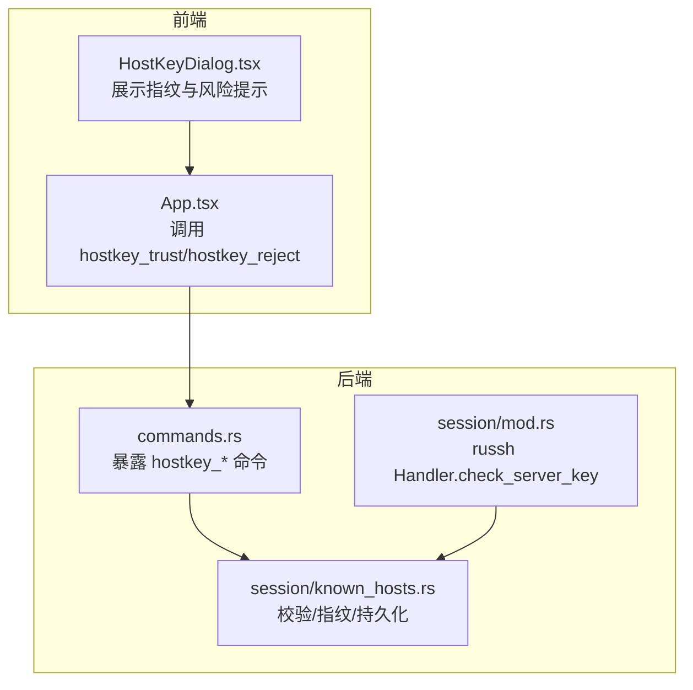
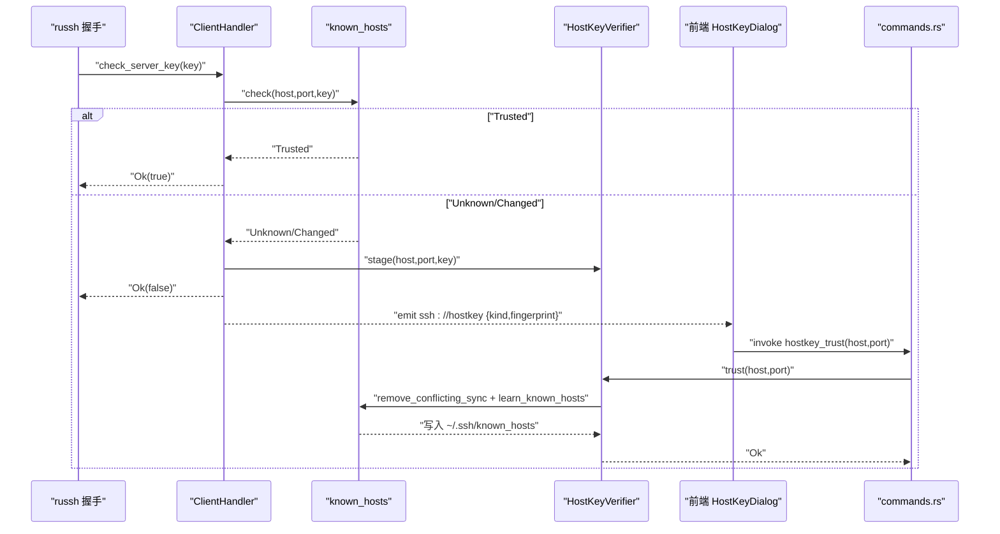
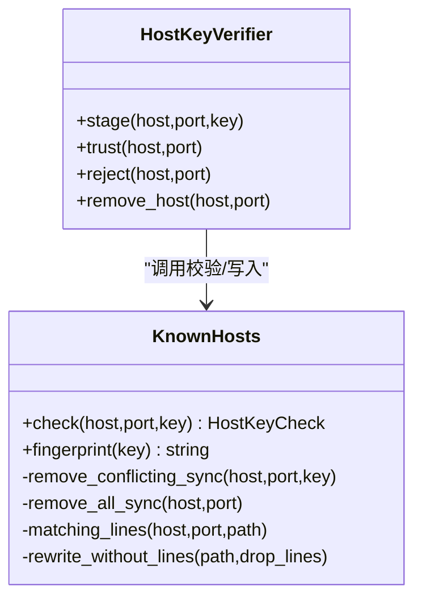
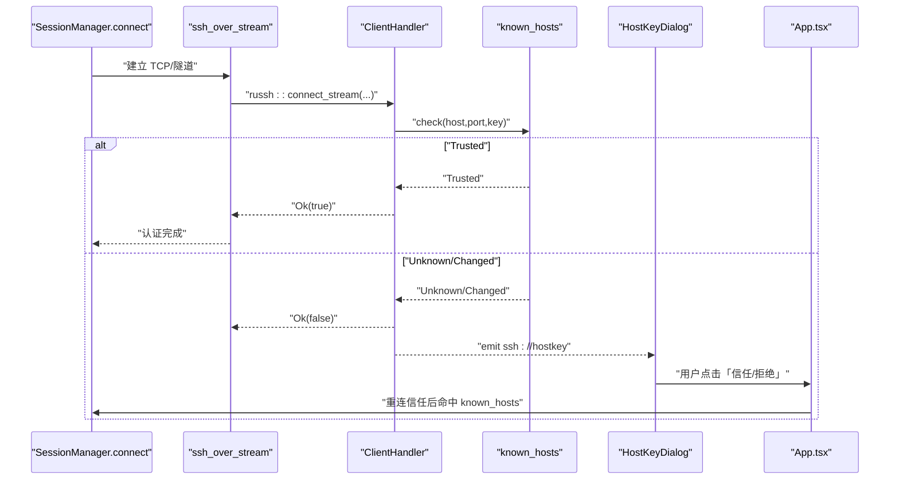
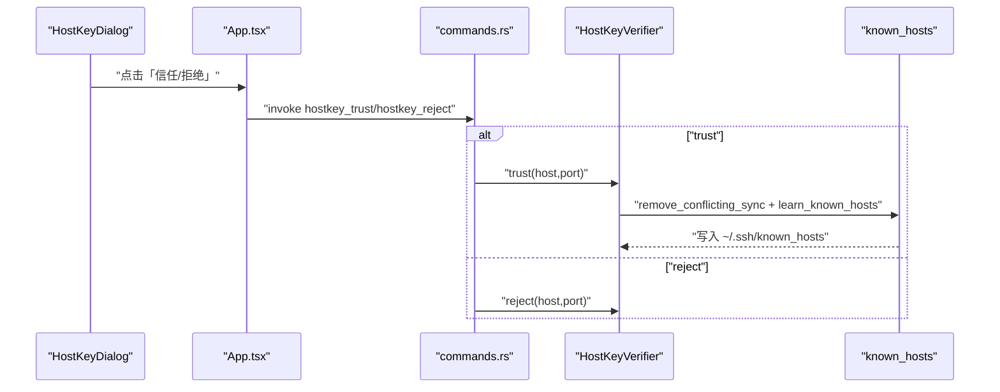
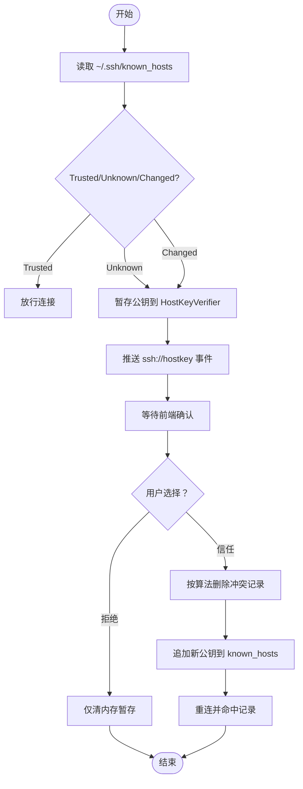
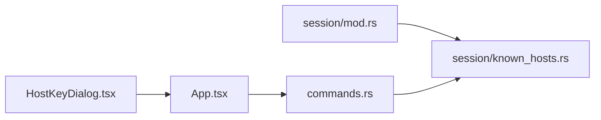

# 主机公钥命令

<cite>
**本文档引用的文件**
- [src-tauri/src/session/known_hosts.rs](file://src-tauri/src/session/known_hosts.rs)
- [src-tauri/src/session/mod.rs](file://src-tauri/src/session/mod.rs)
- [src-tauri/src/commands.rs](file://src-tauri/src/commands.rs)
- [src/components/HostKeyDialog.tsx](file://src/components/HostKeyDialog.tsx)
- [src/App.tsx](file://src/App.tsx)
- [src/types.ts](file://src/types.ts)
- [README.md](file://README.md)
- [docs/DESIGN.md](file://docs/DESIGN.md)
</cite>

## 目录
1. [简介](#简介)
2. [项目结构](#项目结构)
3. [核心组件](#核心组件)
4. [架构总览](#架构总览)
5. [详细组件分析](#详细组件分析)
6. [依赖关系分析](#依赖关系分析)
7. [性能考量](#性能考量)
8. [故障排查指南](#故障排查指南)
9. [结论](#结论)
10. [附录](#附录)

## 简介
本文件聚焦于 SSH 主机公钥的安全管理机制，围绕“主机公钥验证”命令展开，包括：
- hostkey_trust（信任公钥）
- hostkey_reject（拒绝公钥）
- hostkey_remove（删除记录）

内容涵盖主机公钥验证流程、known_hosts 文件管理、公钥算法兼容性与安全威胁防护、指纹计算与冲突检测机制、临时信任状态管理与持久化策略，并提供最佳实践、使用示例与安全配置建议。

## 项目结构
与主机公钥验证相关的核心模块分布如下：
- 后端（Rust）：会话与公钥校验逻辑位于 session 子模块，Tauri 命令暴露前端调用接口。
- 前端（TypeScript/React）：HostKeyDialog 对话框负责展示指纹、提示风险并接收用户选择；App.tsx 负责调用后端命令并驱动重连。

**图表来源**
- [src-tauri/src/commands.rs:768-800](file://src-tauri/src/commands.rs#L768-L800)
- [src-tauri/src/session/mod.rs:118-160](file://src-tauri/src/session/mod.rs#L118-L160)
- [src-tauri/src/session/known_hosts.rs:1-197](file://src-tauri/src/session/known_hosts.rs#L1-L197)
- [src/components/HostKeyDialog.tsx:1-119](file://src/components/HostKeyDialog.tsx#L1-L119)
- [src/App.tsx:410-444](file://src/App.tsx#L410-L444)

**章节来源**
- [README.md:155-162](file://README.md#L155-L162)
- [docs/DESIGN.md:41-59](file://docs/DESIGN.md#L41-L59)

## 核心组件
- HostKeyVerifier：进程内缓存“待确认”的公钥，提供 trust/reject/remove_host 三个命令实现。
- known_hosts 模块：封装 OpenSSH 兼容的 known_hosts 读取、指纹计算、冲突删除与追加。
- ClientHandler.check_server_key：russh 握手期间调用，根据校验结果决定放行或暂存并推送前端确认。
- HostKeyDialog：前端弹窗，展示算法与指纹，提示风险，支持复制指纹。
- Tauri 命令：hostkey_trust/hostkey_reject/hostkey_remove，分别对应信任、拒绝与删除。

**章节来源**
- [src-tauri/src/session/known_hosts.rs:91-135](file://src-tauri/src/session/known_hosts.rs#L91-L135)
- [src-tauri/src/session/mod.rs:118-160](file://src-tauri/src/session/mod.rs#L118-L160)
- [src-tauri/src/commands.rs:768-800](file://src-tauri/src/commands.rs#L768-L800)
- [src/components/HostKeyDialog.tsx:12-119](file://src/components/HostKeyDialog.tsx#L12-L119)

## 架构总览
主机公钥验证采用“探测-暂存-确认-持久化”的两阶段流程：
- 探测阶段：russh 握手触发 check_server_key，调用 known_hosts.check 判断 Trusted/Unknown/Changed。
- 暂存与确认：若非 Trusted，将公钥暂存至 HostKeyVerifier（仅内存），并向前端推送 ssh://hostkey 事件，等待用户确认。
- 持久化阶段：用户点击“信任”，前端调用 hostkey_trust，后端先清理同算法冲突记录，再以 OpenSSH 格式追加到 ~/.ssh/known_hosts。

**图表来源**
- [src-tauri/src/session/mod.rs:118-160](file://src-tauri/src/session/mod.rs#L118-L160)
- [src-tauri/src/session/known_hosts.rs:68-135](file://src-tauri/src/session/known_hosts.rs#L68-L135)
- [src-tauri/src/commands.rs:772-779](file://src-tauri/src/commands.rs#L772-L779)
- [src/components/HostKeyDialog.tsx:14-119](file://src/components/HostKeyDialog.tsx#L14-L119)

## 详细组件分析

### 组件一：HostKeyVerifier 与 known_hosts 模块
- HostKeyVerifier
  - stage：将待确认公钥以 host:port 为键缓存在内存中（仅进程内）。
  - trust：取出公钥，先按算法删除冲突记录，再追加到 known_hosts。
  - reject：仅清除内存中的暂存。
  - remove_host：删除该 host:port 的全部 known_hosts 记录。
- known_hosts
  - check：读取 ~/.ssh/known_hosts 中该 host:port 的全部记录，判断是否 Trusted/Unknown/Changed。
  - fingerprint：计算 SHA256 指纹（OpenSSH 风格）。
  - remove_conflicting_sync/remove_all_sync：按行号精确删除冲突或全部记录，保留注释与空行。

**图表来源**
- [src-tauri/src/session/known_hosts.rs:91-197](file://src-tauri/src/session/known_hosts.rs#L91-L197)

**章节来源**
- [src-tauri/src/session/known_hosts.rs:68-135](file://src-tauri/src/session/known_hosts.rs#L68-L135)
- [src-tauri/src/session/known_hosts.rs:137-197](file://src-tauri/src/session/known_hosts.rs#L137-L197)

### 组件二：russh 握手与前端确认流程
- ClientHandler.check_server_key
  - Trusted：直接放行。
  - Unknown/Changed：暂存公钥，推送 ssh://hostkey 事件，返回 Ok(false) 中止握手。
- 前端 HostKeyDialog
  - 展示算法与指纹，提示风险；支持复制指纹。
- App.tsx
  - 调用 hostkey_trust/hostkey_reject；信任后重连。

**图表来源**
- [src-tauri/src/session/manager.rs:275-317](file://src-tauri/src/session/manager.rs#L275-L317)
- [src-tauri/src/session/mod.rs:118-160](file://src-tauri/src/session/mod.rs#L118-L160)
- [src/components/HostKeyDialog.tsx:14-119](file://src/components/HostKeyDialog.tsx#L14-L119)
- [src/App.tsx:410-444](file://src/App.tsx#L410-L444)

**章节来源**
- [src-tauri/src/session/mod.rs:118-160](file://src-tauri/src/session/mod.rs#L118-L160)
- [src-tauri/src/session/manager.rs:275-317](file://src-tauri/src/session/manager.rs#L275-L317)
- [src/components/HostKeyDialog.tsx:12-119](file://src/components/HostKeyDialog.tsx#L12-L119)
- [src/App.tsx:410-444](file://src/App.tsx#L410-L444)

### 组件三：Tauri 命令与前端交互
- hostkey_trust：信任并持久化，先清理冲突，再追加。
- hostkey_reject：仅清内存暂存，不改动 known_hosts。
- hostkey_remove：删除该 host:port 的全部 known_hosts 记录。
- 前端调用：App.tsx 在 HostKeyDialog 点击后调用相应命令，信任后触发重连。

**图表来源**
- [src-tauri/src/commands.rs:772-789](file://src-tauri/src/commands.rs#L772-L789)
- [src-tauri/src/session/known_hosts.rs:103-135](file://src-tauri/src/session/known_hosts.rs#L103-L135)
- [src/components/HostKeyDialog.tsx:14-119](file://src/components/HostKeyDialog.tsx#L14-L119)
- [src/App.tsx:410-444](file://src/App.tsx#L410-L444)

**章节来源**
- [src-tauri/src/commands.rs:768-800](file://src-tauri/src/commands.rs#L768-L800)
- [src/App.tsx:410-444](file://src/App.tsx#L410-L444)

### 组件四：known_hosts 文件管理与冲突检测
- 冲突检测：当已记录但算法相同而 key 不同时，判定为 Changed（疑似 MITM）。
- 冲突清理：按算法删除旧记录，保留其他算法记录，避免误删。
- 指纹计算：统一使用 SHA256，输出 OpenSSH 风格格式。
- 文件写入：精确按行号删除，保留注释与空行，确保兼容性。

**图表来源**
- [src-tauri/src/session/known_hosts.rs:68-135](file://src-tauri/src/session/known_hosts.rs#L68-L135)
- [src-tauri/src/session/mod.rs:118-160](file://src-tauri/src/session/mod.rs#L118-L160)

**章节来源**
- [src-tauri/src/session/known_hosts.rs:68-135](file://src-tauri/src/session/known_hosts.rs#L68-L135)

## 依赖关系分析
- ClientHandler 依赖 russh 的 PublicKey 与 known_hosts 检查。
- HostKeyVerifier 依赖 known_hosts 的指纹计算与文件写入能力。
- commands.rs 将 HostKeyVerifier 暴露为 Tauri 命令，供前端调用。
- HostKeyDialog 与 App.tsx 通过 Tauri IPC 与后端交互。

**图表来源**
- [src-tauri/src/session/mod.rs:118-160](file://src-tauri/src/session/mod.rs#L118-L160)
- [src-tauri/src/session/known_hosts.rs:1-197](file://src-tauri/src/session/known_hosts.rs#L1-L197)
- [src-tauri/src/commands.rs:768-800](file://src-tauri/src/commands.rs#L768-L800)
- [src/components/HostKeyDialog.tsx:1-119](file://src/components/HostKeyDialog.tsx#L1-L119)
- [src/App.tsx:410-444](file://src/App.tsx#L410-L444)

**章节来源**
- [src-tauri/src/session/mod.rs:118-160](file://src-tauri/src/session/mod.rs#L118-L160)
- [src-tauri/src/commands.rs:768-800](file://src-tauri/src/commands.rs#L768-L800)

## 性能考量
- 文件 I/O 使用 spawn_blocking：冲突删除与追加写入在阻塞线程池执行，避免阻塞异步事件循环。
- 指纹计算与 known_hosts 解析在 CPU 密集路径，建议在高频场景下减少不必要的重复解析。
- 冲突删除按行号精确处理，避免全量重写带来的 IO 放大。

[本节为通用指导，不直接分析具体文件]

## 故障排查指南
- “没有待确认的主机公钥”
  - 可能原因：握手未触发暂存或已被清理。
  - 处理：重新发起连接，确保在 Unknown/Changed 场景下触发暂存。
- “主机公钥未通过校验（未知或已变更）”
  - 可能原因：known_hosts 中记录缺失或与服务器不一致。
  - 处理：通过 HostKeyDialog 核对指纹，确认后执行 hostkey_trust。
- “无法写入 ~/.ssh/known_hosts”
  - 可能原因：权限不足或路径不存在。
  - 处理：检查用户主目录下的 .ssh 目录权限与存在性。
- “公钥变更警告”
  - 可能原因：服务器密钥更换或中间人攻击。
  - 处理：通过可信渠道核对指纹，确认后信任；否则拒绝并断开。

**章节来源**
- [src-tauri/src/session/known_hosts.rs:105-121](file://src-tauri/src/session/known_hosts.rs#L105-L121)
- [src-tauri/src/session/mod.rs:307-311](file://src-tauri/src/session/manager.rs#L307-L311)

## 结论
本系统通过 russh 的 OpenSSH 兼容 known_hosts 实现，结合前端交互与进程内暂存，形成“探测-确认-持久化”的闭环。hostkey_trust/hostkey_reject/hostkey_remove 三个命令分别承担信任、拒绝与删除，配合指纹计算与冲突检测，有效防范中间人攻击并提升用户体验。建议在生产环境中严格遵循“先核对指纹再信任”的原则，并定期审计 known_hosts 文件。

[本节为总结性内容，不直接分析具体文件]

## 附录

### 使用示例（步骤说明）
- 首次连接（TOFU）
  - 连接触发 Unknown：前端弹出 HostKeyDialog，展示算法与指纹。
  - 通过可信渠道核对指纹后，点击“信任”，调用 hostkey_trust，随后重连命中记录。
- 公钥变更（疑似 MITM）
  - 连接触发 Changed：前端弹出 HostKeyDialog，强调风险。
  - 仅在确认服务器更换密钥或可信变更后，点击“信任”；否则点击“拒绝”。
- 删除记录
  - 当需要清理某主机记录时，调用 hostkey_remove，删除该 host:port 的全部 known_hosts 记录。

**章节来源**
- [src-tauri/src/commands.rs:772-799](file://src-tauri/src/commands.rs#L772-L799)
- [src/components/HostKeyDialog.tsx:12-119](file://src/components/HostKeyDialog.tsx#L12-L119)
- [src/App.tsx:410-444](file://src/App.tsx#L410-L444)

### 安全配置建议
- 仅在核对指纹无误后执行 hostkey_trust。
- 对于频繁变更的测试环境，建议使用短生命周期的临时信任或自动化脚本清理。
- 定期备份 ~/.ssh/known_hosts，以便在误删或冲突时恢复。
- 在企业网络中，建议集中管理 known_hosts 并通过受控渠道下发。

**章节来源**
- [README.md:155-162](file://README.md#L155-L162)