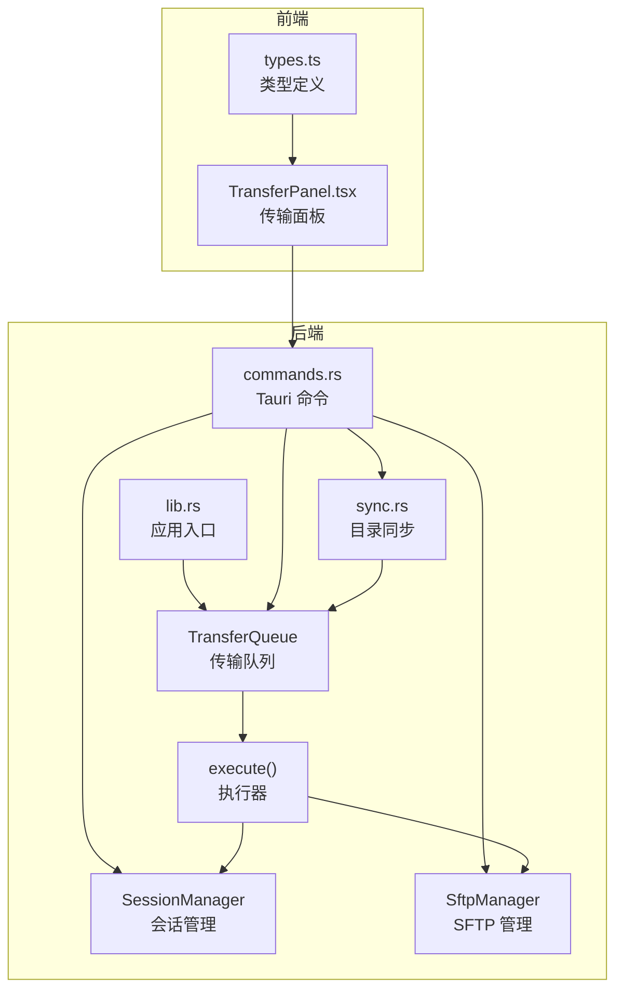
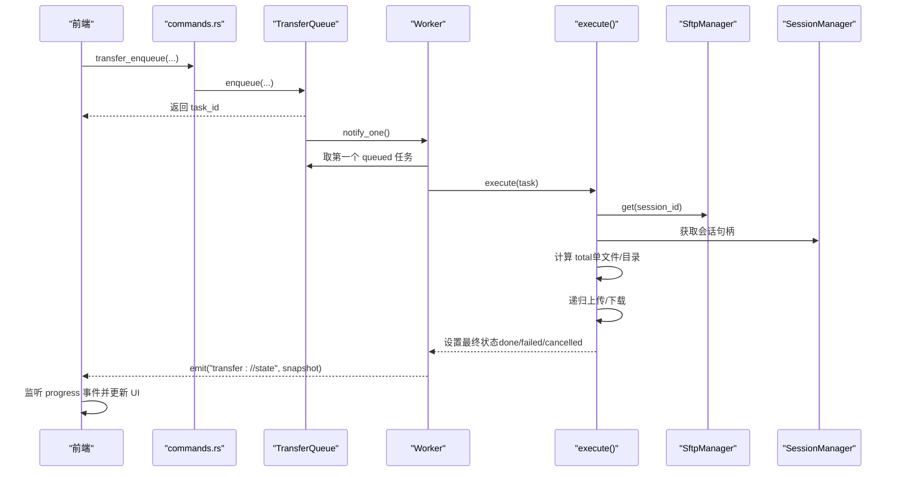
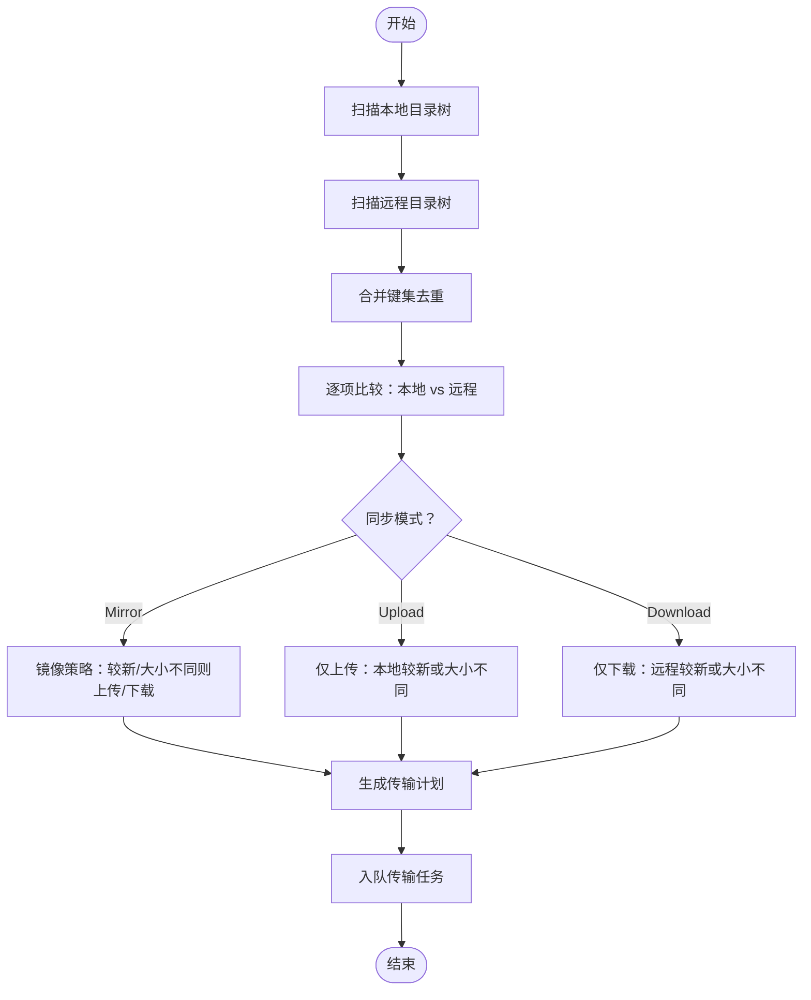
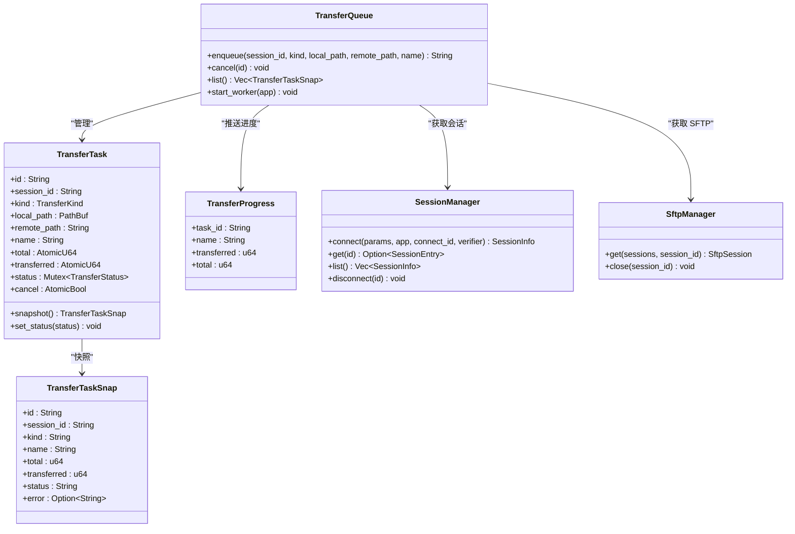

# 传输队列命令

<cite>
**本文档引用的文件**
- [transfer.rs](file://src-tauri/src/session/transfer.rs)
- [sync.rs](file://src-tauri/src/session/sync.rs)
- [commands.rs](file://src-tauri/src/commands.rs)
- [TransferPanel.tsx](file://src/components/TransferPanel.tsx)
- [types.ts](file://src/types.ts)
- [lib.rs](file://src-tauri/src/lib.rs)
- [manager.rs](file://src-tauri/src/session/manager.rs)
- [sftp.rs](file://src-tauri/src/session/sftp.rs)
</cite>

## 目录
1. [简介](#简介)
2. [项目结构](#项目结构)
3. [核心组件](#核心组件)
4. [架构总览](#架构总览)
5. [详细组件分析](#详细组件分析)
6. [依赖关系分析](#依赖关系分析)
7. [性能考量](#性能考量)
8. [故障排查指南](#故障排查指南)
9. [结论](#结论)
10. [附录](#附录)

## 简介
本文件面向传输队列管理命令的使用者与维护者，系统性阐述文件传输的完整生命周期管理，包括传输任务入队、任务取消、任务列表查询以及目录同步等命令。文档重点解释传输任务的数据结构、队列调度机制、并发控制策略、错误恢复机制，并提供传输类型枚举、任务状态跟踪、进度报告与日志记录方案。同时，详细说明目录同步的差异计算算法、双向同步策略与冲突解决方案，并给出完整的使用示例，帮助用户高效管理复杂的文件传输任务并实时监控传输状态。

## 项目结构
传输队列功能位于 Rust 后端模块化架构中，前端通过 Tauri 命令与后端交互，后端通过会话管理与 SFTP 管理器复用 SSH 连接，实现高并发下的稳定传输。

图表来源
- [lib.rs:34-42](file://src-tauri/src/lib.rs#L34-L42)
- [commands.rs:366-431](file://src-tauri/src/commands.rs#L366-L431)
- [transfer.rs:122-203](file://src-tauri/src/session/transfer.rs#L122-L203)
- [sync.rs:45-148](file://src-tauri/src/session/sync.rs#L45-L148)
- [manager.rs:78-145](file://src-tauri/src/session/manager.rs#L78-L145)
- [sftp.rs:25-75](file://src-tauri/src/session/sftp.rs#L25-L75)

章节来源
- [lib.rs:15-42](file://src-tauri/src/lib.rs#L15-L42)
- [commands.rs:366-431](file://src-tauri/src/commands.rs#L366-L431)

## 核心组件
- 传输队列与任务模型：负责任务入队、取消、状态快照与串行执行。
- 目录同步：对比本地与远程目录树，生成传输计划并入队。
- 前端面板：监听状态与进度事件，提供可视化界面与取消操作。
- 会话与 SFTP 管理：复用 SSH 连接，提供稳定的 SFTP 会话。

章节来源
- [transfer.rs:25-119](file://src-tauri/src/session/transfer.rs#L25-L119)
- [sync.rs:12-148](file://src-tauri/src/session/sync.rs#L12-L148)
- [TransferPanel.tsx:12-127](file://src/components/TransferPanel.tsx#L12-L127)
- [manager.rs:78-145](file://src-tauri/src/session/manager.rs#L78-L145)
- [sftp.rs:25-75](file://src-tauri/src/session/sftp.rs#L25-L75)

## 架构总览
传输队列采用“串行 worker + 可取消”的设计，将“选文件”与“执行传输”解耦，前端选好文件后立即入队返回，UI 不阻塞；多个任务排队串行执行，避免单 SSH 连接上 SFTP 并发争用；进行中的任务可取消，取消标志在每次传输循环的片前检查。

图表来源
- [commands.rs:366-406](file://src-tauri/src/commands.rs#L366-L406)
- [transfer.rs:122-203](file://src-tauri/src/session/transfer.rs#L122-L203)
- [transfer.rs:206-284](file://src-tauri/src/session/transfer.rs#L206-L284)
- [sftp.rs:30-69](file://src-tauri/src/session/sftp.rs#L30-L69)
- [manager.rs:220-252](file://src-tauri/src/session/manager.rs#L220-L252)

## 详细组件分析

### 传输类型与状态枚举
- 传输类型（TransferKind）：上传、上传目录、下载。
- 任务状态（TransferStatus）：排队、运行、完成、失败、取消。

章节来源
- [transfer.rs:25-69](file://src-tauri/src/session/transfer.rs#L25-L69)
- [types.ts:71-88](file://src/types.ts#L71-L88)

### 传输任务数据结构
- TransferTask：包含任务标识、会话标识、传输类型、本地/远程路径、名称、总字节数、已传输字节数、状态、取消标志等。
- TransferTaskSnap：用于前端快照传输，包含任务关键信息与错误描述。
- TransferProgress：用于进度事件推送，携带任务 ID、名称、已传输字节与总字节。

章节来源
- [transfer.rs:72-119](file://src-tauri/src/session/transfer.rs#L72-L119)
- [transfer.rs:85-95](file://src-tauri/src/session/transfer.rs#L85-L95)
- [transfer.rs:286-292](file://src-tauri/src/session/transfer.rs#L286-L292)

### 传输队列与调度机制
- 入队（enqueue）：创建任务对象并加入队列尾部，唤醒 worker。
- 取消（cancel）：设置取消标志；若任务仍处于排队状态则直接标记为取消。
- 列表（list）：返回所有任务快照，供前端轮询。
- Worker：当有任务时，取出第一个排队中的任务并标记为运行，执行完成后再次发出状态快照。

章节来源
- [transfer.rs:128-203](file://src-tauri/src/session/transfer.rs#L128-L203)

### 传输执行流程
- 获取 SFTP 会话：通过 SftpManager 从 SessionManager 获取会话并打开 SFTP 子系统。
- 计算总大小：单文件可精确获取，目录为 0（前端显示不确定进度）。
- 递归传输：根据类型分别执行上传或下载的递归逻辑，支持目录结构保持。
- 进度上报：每 64KB 片次写入后更新已传输字节并推送进度事件。
- 错误处理：捕获异常并设置失败状态；若为取消则标记取消并清理半成品文件。

章节来源
- [transfer.rs:206-284](file://src-tauri/src/session/transfer.rs#L206-L284)
- [transfer.rs:296-434](file://src-tauri/src/session/transfer.rs#L296-L434)
- [transfer.rs:448-482](file://src-tauri/src/session/transfer.rs#L448-L482)

### 目录同步（sync_directory）
- 扫描本地与远程目录树，生成相对路径映射与修改时间戳。
- 差异计算：基于文件修改时间与大小判断是否需要同步。
- 同步模式：
  - Mirror：双向较新覆盖，若大小不同也触发上传。
  - Upload：仅上传本地较新的或大小不同的文件。
  - Download：仅下载远程较新的或大小不同的文件。
- 生成传输计划并入队，返回上传/下载计数与任务 ID 列表。

图表来源
- [sync.rs:45-148](file://src-tauri/src/session/sync.rs#L45-L148)
- [sync.rs:150-233](file://src-tauri/src/session/sync.rs#L150-L233)
- [sync.rs:258-265](file://src-tauri/src/session/sync.rs#L258-L265)

章节来源
- [sync.rs:45-148](file://src-tauri/src/session/sync.rs#L45-L148)

### 前端集成与事件监听
- 传输面板通过轮询 transfer_list 获取任务快照，并监听 transfer://state 与 transfer://progress 事件动态更新 UI。
- 支持取消操作：点击取消按钮调用 transfer_cancel 命令。
- 进度条：根据 total 与 transferred 计算百分比，不确定进度时显示不确定状态。

章节来源
- [TransferPanel.tsx:16-50](file://src/components/TransferPanel.tsx#L16-L50)
- [TransferPanel.tsx:56-62](file://src/components/TransferPanel.tsx#L56-L62)
- [TransferPanel.tsx:139-143](file://src/components/TransferPanel.tsx#L139-L143)

### 并发控制与资源复用
- 串行执行：队列采用串行 worker，避免单 SSH 连接上的并发争用。
- 会话复用：SftpManager 在 SessionManager 提供的 SSH 连接上打开 SFTP 子系统，实现多模块共享同一连接。
- 取消机制：每次传输循环前检查取消标志，确保及时响应取消请求。

章节来源
- [transfer.rs:178-202](file://src-tauri/src/session/transfer.rs#L178-L202)
- [sftp.rs:30-69](file://src-tauri/src/session/sftp.rs#L30-L69)
- [manager.rs:78-145](file://src-tauri/src/session/manager.rs#L78-L145)

### 错误恢复与清理
- 失败状态：捕获底层错误并设置失败状态，错误消息随快照返回。
- 取消清理：对于半成品文件，上传失败清理远程临时文件，下载失败清理本地临时文件。
- 日志记录：后端通过事件推送状态与进度，前端可结合日志查看器进行问题定位。

章节来源
- [transfer.rs:267-284](file://src-tauri/src/session/transfer.rs#L267-L284)
- [lib.rs:34-42](file://src-tauri/src/lib.rs#L34-L42)

## 依赖关系分析

图表来源
- [transfer.rs:122-203](file://src-tauri/src/session/transfer.rs#L122-L203)
- [transfer.rs:72-119](file://src-tauri/src/session/transfer.rs#L72-L119)
- [transfer.rs:85-95](file://src-tauri/src/session/transfer.rs#L85-L95)
- [transfer.rs:286-292](file://src-tauri/src/session/transfer.rs#L286-L292)
- [manager.rs:78-145](file://src-tauri/src/session/manager.rs#L78-L145)
- [sftp.rs:25-75](file://src-tauri/src/session/sftp.rs#L25-L75)

章节来源
- [transfer.rs:122-203](file://src-tauri/src/session/transfer.rs#L122-L203)
- [manager.rs:78-145](file://src-tauri/src/session/manager.rs#L78-L145)
- [sftp.rs:25-75](file://src-tauri/src/session/sftp.rs#L25-L75)

## 性能考量
- 串行执行降低并发争用，适合大多数场景；如需更高吞吐，可在任务粒度上拆分会话或引入多队列。
- 进度上报频率适中（每 64KB 片次），兼顾 UI 响应与事件开销。
- 目录扫描采用栈式遍历，避免递归深度限制；建议对大目录使用分批扫描或增量同步策略。
- SFTP 会话复用减少握手与认证成本，提升整体吞吐。

## 故障排查指南
- 任务长时间停留在排队：检查队列是否被其他任务占用，或是否存在大量小文件导致总计算耗时。
- 传输中途失败：查看失败状态与错误消息，确认网络稳定性与权限问题。
- 取消无效：确认取消标志是否正确设置，以及传输循环是否在下一片前检查取消标志。
- 目录同步未触发：核对同步模式与差异判断条件，确认本地/远程路径正确且可访问。

章节来源
- [transfer.rs:156-166](file://src-tauri/src/session/transfer.rs#L156-L166)
- [transfer.rs:460-463](file://src-tauri/src/session/transfer.rs#L460-L463)

## 结论
传输队列管理命令提供了完整的文件传输生命周期管理能力：从任务入队、取消、列表查询到目录同步，均通过清晰的事件与状态机制实现。配合串行执行与会话复用，系统在保证稳定性的同时具备良好的扩展性。建议在复杂场景下结合会话池与多队列策略进一步优化吞吐，并通过前端面板与事件监听实现高效的传输监控与运维。

## 附录

### 使用示例

- 入队传输任务
  - 前端调用命令：transfer_enqueue
  - 参数：session_id、kind（upload/uploadDir/download）、local_path、remote_path
  - 返回：task_id
  - 示例路径：[commands.rs:366-388](file://src-tauri/src/commands.rs#L366-L388)

- 取消传输任务
  - 前端调用命令：transfer_cancel
  - 参数：id（task_id）
  - 示例路径：[commands.rs:391-398](file://src-tauri/src/commands.rs#L391-L398)

- 查询传输任务列表
  - 前端调用命令：transfer_list
  - 返回：任务快照数组
  - 示例路径：[commands.rs:400-406](file://src-tauri/src/commands.rs#L400-L406)

- 目录同步
  - 前端调用命令：sync_directory
  - 参数：session_id、local_dir、remote_dir、mode（mirror/upload/download）
  - 返回：上传/下载计数与任务 ID 列表
  - 示例路径：[commands.rs:408-431](file://src-tauri/src/commands.rs#L408-L431)

- 前端监听与交互
  - 监听事件：transfer://state、transfer://progress
  - 轮询列表：transfer_list
  - 取消操作：transfer_cancel
  - 示例路径：[TransferPanel.tsx:16-50](file://src/components/TransferPanel.tsx#L16-L50)