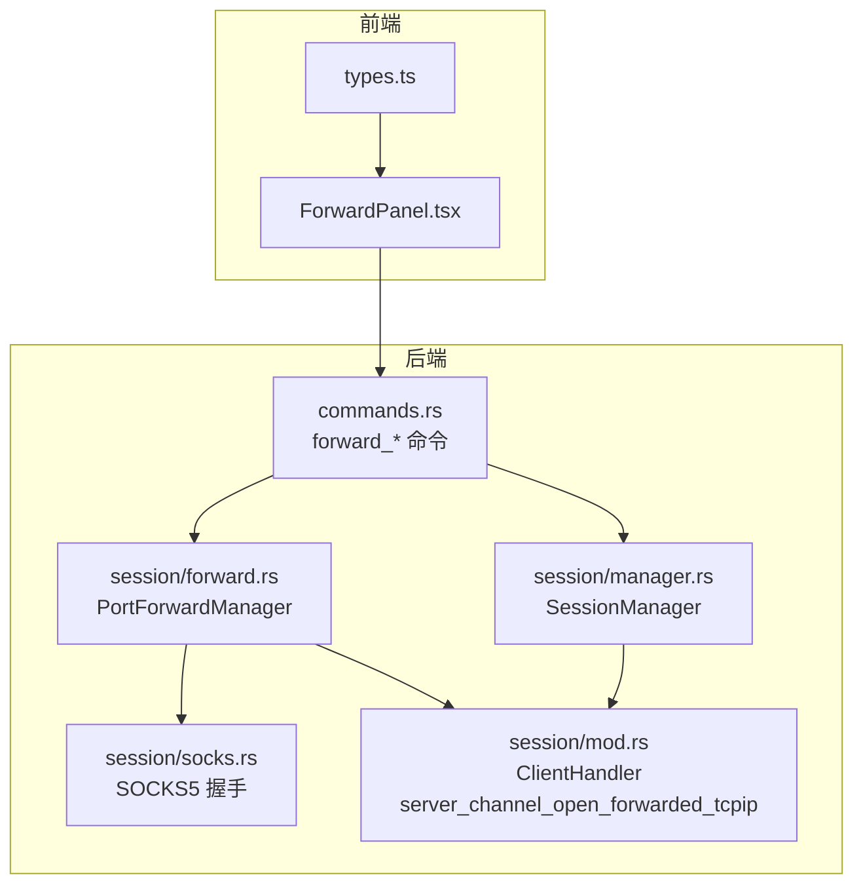
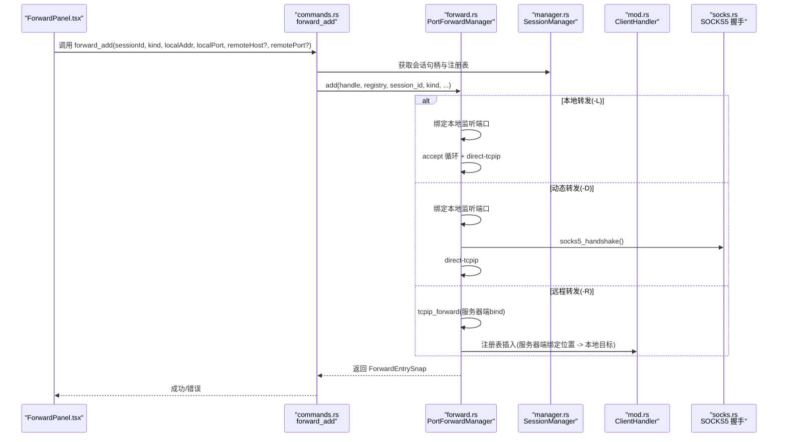
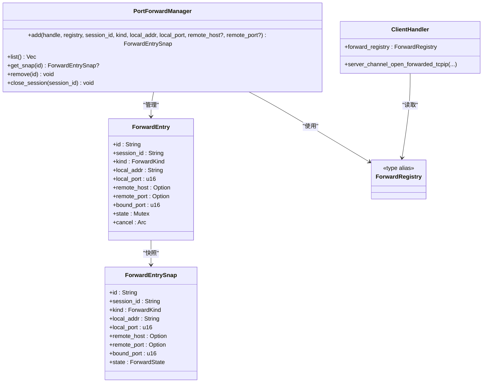

# 端口转发命令

<cite>
**本文档引用的文件**
- [forward.rs](file://src-tauri/src/session/forward.rs)
- [socks.rs](file://src-tauri/src/session/socks.rs)
- [commands.rs](file://src-tauri/src/commands.rs)
- [ForwardPanel.tsx](file://src/components/ForwardPanel.tsx)
- [types.ts](file://src/types.ts)
- [mod.rs](file://src-tauri/src/session/mod.rs)
- [manager.rs](file://src-tauri/src/session/manager.rs)
</cite>

## 目录
1. [简介](#简介)
2. [项目结构](#项目结构)
3. [核心组件](#核心组件)
4. [架构总览](#架构总览)
5. [详细组件分析](#详细组件分析)
6. [依赖关系分析](#依赖关系分析)
7. [性能考量](#性能考量)
8. [故障排查指南](#故障排查指南)
9. [结论](#结论)
10. [附录](#附录)

## 简介
本文件面向“端口转发管理命令”的完整实现，覆盖本地转发（-L）、远程转发（-R）与动态转发（-D）三类模式，详细说明以下命令与功能：
- forward_add：添加转发规则
- forward_list：转发列表查询
- forward_remove：移除转发规则

内容包括转发类型的区分、本地端口绑定、远程主机映射、动态转发的 SOCKS5 实现、转发状态管理、端口冲突检测、远程转发的服务器端清理机制、安全考虑、端口范围验证与错误处理策略，并提供完整的使用示例与故障排除方法。

## 项目结构
端口转发能力由 Rust 后端与前端 React 组件协同实现：
- 后端模块
  - session/forward.rs：转发管理器、类型定义、状态管理、本地/动态/远程三种转发的实现
  - session/socks.rs：SOCKS5 握手（-D 使用）
  - session/mod.rs：ClientHandler 实现，包含远程转发回调（server_channel_open_forwarded_tcpip）
  - session/manager.rs：会话管理，负责建立持久连接与转发注册表的生命周期
  - commands.rs：暴露 forward_add、forward_list、forward_remove 等 Tauri 命令
- 前端组件
  - ForwardPanel.tsx：转发面板，负责收集用户输入并调用后端命令
  - types.ts：定义前端使用的 ForwardEntry、ForwardKind 等类型



**图表来源**
- [commands.rs:433-516](file://src-tauri/src/commands.rs#L433-L516)
- [forward.rs:1-295](file://src-tauri/src/session/forward.rs#L1-L295)
- [socks.rs:1-98](file://src-tauri/src/session/socks.rs#L1-L98)
- [mod.rs:162-207](file://src-tauri/src/session/mod.rs#L162-L207)
- [manager.rs:1-200](file://src-tauri/src/session/manager.rs#L1-L200)

**章节来源**
- [forward.rs:1-295](file://src-tauri/src/session/forward.rs#L1-L295)
- [socks.rs:1-98](file://src-tauri/src/session/socks.rs#L1-L98)
- [commands.rs:433-516](file://src-tauri/src/commands.rs#L433-L516)
- [ForwardPanel.tsx:1-207](file://src/components/ForwardPanel.tsx#L1-L207)
- [types.ts:90-102](file://src/types.ts#L90-L102)
- [mod.rs:162-207](file://src-tauri/src/session/mod.rs#L162-L207)
- [manager.rs:1-200](file://src-tauri/src/session/manager.rs#L1-L200)

## 核心组件
- 转发类型枚举 ForwardKind：local、remote、dynamic
- 转发状态 ForwardState：Starting、Active、Failed(String)、Stopped
- 转发条目 ForwardEntry：包含 id、session_id、类型、本地/远程参数、绑定端口、状态与取消通知
- 转发快照 ForwardEntrySnap：用于命令返回与前端展示
- 远程转发注册表 ForwardRegistry：服务器端回调时根据远端绑定位置定位本地目标
- PortForwardManager：转发管理器，提供 add/list/get_snap/remove/close_session 等操作
- ClientHandler：russh 客户端处理器，实现 server_channel_open_forwarded_tcpip 将远端连接桥接到本地
- SOCKS5 握手 socks5_handshake：动态转发（-D）的 SOCKS5 握手实现

**章节来源**
- [forward.rs:52-115](file://src-tauri/src/session/forward.rs#L52-L115)
- [forward.rs:117-229](file://src-tauri/src/session/forward.rs#L117-L229)
- [mod.rs:59-113](file://src-tauri/src/session/mod.rs#L59-L113)
- [socks.rs:11-97](file://src-tauri/src/session/socks.rs#L11-L97)

## 架构总览
端口转发的总体流程如下：
- 前端通过 ForwardPanel.tsx 收集参数并调用 forward_add
- 后端命令 forward_add 解析类型，从 SessionManager 获取会话句柄与转发注册表，调用 PortForwardManager.add
- PortForwardManager.add 根据类型执行不同逻辑：
  - 本地转发（-L）：绑定本地监听端口，接受连接后通过 direct-tcpip 通道连接远端目标
  - 动态转发（-D）：绑定本地监听端口，每个连接先进行 SOCKS5 握手解析目标，再通过 direct-tcpip 通道连接
  - 远程转发（-R）：请求服务器在远端 bind 端口，服务器连接时触发 ClientHandler 回调，根据注册表桥接到本地目标
- forward_list 返回当前所有转发的快照
- forward_remove 停止并移除转发；对于 -R，还会通知服务器取消远端绑定并清理注册表



**图表来源**
- [commands.rs:433-472](file://src-tauri/src/commands.rs#L433-L472)
- [forward.rs:123-191](file://src-tauri/src/session/forward.rs#L123-L191)
- [socks.rs:11-97](file://src-tauri/src/session/socks.rs#L11-L97)
- [mod.rs:162-207](file://src-tauri/src/session/mod.rs#L162-L207)
- [manager.rs:50-145](file://src-tauri/src/session/manager.rs#L50-L145)

**章节来源**
- [commands.rs:433-472](file://src-tauri/src/commands.rs#L433-L472)
- [forward.rs:123-191](file://src-tauri/src/session/forward.rs#L123-L191)
- [socks.rs:11-97](file://src-tauri/src/session/socks.rs#L11-L97)
- [mod.rs:162-207](file://src-tauri/src/session/mod.rs#L162-L207)
- [manager.rs:50-145](file://src-tauri/src/session/manager.rs#L50-L145)

## 详细组件分析

### 转发类型与行为
- 本地转发（-L）
  - 本地监听端口绑定，每个进入的连接通过 direct-tcpip 通道连接到指定的远端主机与端口
  - 适用于访问服务器内部网络资源或数据库
- 动态转发（-D）
  - 本地监听端口绑定，每个进入的连接先进行 SOCKS5 握手，解析客户端请求的目标，再通过 direct-tcpip 通道连接
  - 适用于作为本地 SOCKS5 代理使用
- 远程转发（-R）
  - 请求服务器在远端 bind 指定端口，服务器连接时触发回调，根据注册表将通道桥接到本地目标
  - 适用于将本地服务暴露给服务器侧访问

```mermaid
flowchart TD
Start(["开始"]) --> Kind{"转发类型？"}
Kind --> |本地(-L)| LBind["绑定本地监听端口"]
LBind --> LAccept["accept 循环"]
LAccept --> LOpen["channel_open_direct_tcpip"]
LOpen --> LBridge["桥接循环"]
Kind --> |动态(-D)| DBind["绑定本地监听端口"]
DBind --> DHandshake["SOCKS5 握手"]
DHandshake --> DOpen["channel_open_direct_tcpip"]
DOpen --> DBridge["桥接循环"]
Kind --> |远程(-R)| RServer["tcpip_forward 服务器端bind"]
RServer --> RReg["注册表插入(服务器端绑定位置 -> 本地目标)"]
RReg --> RCallback["服务器连接触发回调"]
RCallback --> RBridge["桥接循环"]
```

**图表来源**
- [forward.rs:140-174](file://src-tauri/src/session/forward.rs#L140-L174)
- [forward.rs:231-294](file://src-tauri/src/session/forward.rs#L231-L294)
- [socks.rs:11-97](file://src-tauri/src/session/socks.rs#L11-L97)
- [mod.rs:162-207](file://src-tauri/src/session/mod.rs#L162-L207)

**章节来源**
- [forward.rs:1-295](file://src-tauri/src/session/forward.rs#L1-L295)
- [socks.rs:1-98](file://src-tauri/src/session/socks.rs#L1-L98)
- [mod.rs:162-207](file://src-tauri/src/session/mod.rs#L162-L207)

### 转发状态管理
- 状态枚举 ForwardState：Starting、Active、Failed(String)、Stopped
- PortForwardManager 提供状态更新与查询接口
- 前端通过 forward_list 获取实时状态，用于 UI 展示与交互

**章节来源**
- [forward.rs:60-68](file://src-tauri/src/session/forward.rs#L60-L68)
- [forward.rs:193-229](file://src-tauri/src/session/forward.rs#L193-L229)
- [ForwardPanel.tsx:184-207](file://src/components/ForwardPanel.tsx#L184-L207)

### 端口冲突检测与处理
- 本地监听端口绑定时，若绑定失败（如端口已被占用），会返回错误字符串
- 前端捕获错误并在 UI 中提示
- 远程转发（-R）在服务器端执行 tcpip_forward，若服务器端绑定失败也会返回错误

**章节来源**
- [forward.rs:144-147](file://src-tauri/src/session/forward.rs#L144-L147)
- [forward.rs:164-167](file://src-tauri/src/session/forward.rs#L164-L167)
- [ForwardPanel.tsx:46-60](file://src/components/ForwardPanel.tsx#L46-L60)

### 远程转发的服务器端清理机制
- forward_remove 对于 -R 类型，会调用服务器端 cancel_tcpip_forward 取消远端绑定
- 同时从注册表中移除对应的绑定项，避免残留

**章节来源**
- [commands.rs:482-514](file://src-tauri/src/commands.rs#L482-L514)
- [forward.rs:168-171](file://src-tauri/src/session/forward.rs#L168-L171)

### SOCKS5 动态转发实现
- socks5_handshake 完成 RFC 1928 的无认证 CONNECT 握手，解析目标主机与端口
- 握手超时控制（默认 5 秒），失败时发送对应错误响应
- 成功后通过 direct-tcpip 通道连接目标

**章节来源**
- [socks.rs:11-97](file://src-tauri/src/session/socks.rs#L11-L97)
- [forward.rs:277-291](file://src-tauri/src/session/forward.rs#L277-L291)

### 前端集成与使用
- ForwardPanel.tsx 提供转发面板，支持选择会话、选择类型、填写本地/远程参数
- 调用 forward_add 添加转发，调用 forward_remove 停止转发
- forward_list 定时刷新，展示转发状态与目标

**章节来源**
- [ForwardPanel.tsx:1-207](file://src/components/ForwardPanel.tsx#L1-L207)
- [types.ts:90-102](file://src/types.ts#L90-L102)

## 依赖关系分析



**图表来源**
- [forward.rs:74-115](file://src-tauri/src/session/forward.rs#L74-L115)
- [forward.rs:117-229](file://src-tauri/src/session/forward.rs#L117-L229)
- [mod.rs:59-113](file://src-tauri/src/session/mod.rs#L59-L113)

**章节来源**
- [forward.rs:74-115](file://src-tauri/src/session/forward.rs#L74-L115)
- [forward.rs:117-229](file://src-tauri/src/session/forward.rs#L117-L229)
- [mod.rs:59-113](file://src-tauri/src/session/mod.rs#L59-L113)

## 性能考量
- 桥接循环采用 tokio::select! 并发读写，避免阻塞
- 每个连接独立 spawn，避免阻塞监听器
- 动态转发（-D）对每个连接进行 SOCKS5 握手，存在握手超时控制
- 远程转发（-R）通过注册表快速定位本地目标，减少查找成本

[本节为通用性能讨论，无需特定文件来源]

## 故障排查指南
- 本地转发（-L）无法连接
  - 检查 remote_host 与 remote_port 是否正确
  - 查看状态是否为 Failed(String)，前端会显示错误信息
- 动态转发（-D）无法代理
  - 检查本地端口是否被占用
  - 确认客户端 SOCKS5 代理配置正确
- 远程转发（-R）无法访问
  - 检查服务器端是否允许 tcpip_forward
  - 确认服务器端绑定端口是否被占用
  - 使用 forward_remove 清理服务器端绑定并重新添加
- 端口冲突
  - 修改本地端口或停止占用端口的其他程序
  - 前端会在添加时捕获错误并提示

**章节来源**
- [forward.rs:140-174](file://src-tauri/src/session/forward.rs#L140-L174)
- [forward.rs:231-294](file://src-tauri/src/session/forward.rs#L231-L294)
- [commands.rs:482-514](file://src-tauri/src/commands.rs#L482-L514)
- [ForwardPanel.tsx:46-60](file://src/components/ForwardPanel.tsx#L46-L60)

## 结论
本实现提供了完整的端口转发能力，覆盖本地、动态与远程三种模式，具备完善的错误处理、状态管理与服务器端清理机制。前端通过 ForwardPanel 提供直观的操作界面，后端通过 PortForwardManager 与 ClientHandler 实现稳定的转发链路。建议在生产环境中结合安全策略与日志监控，确保转发的安全性与稳定性。

[本节为总结性内容，无需特定文件来源]

## 附录

### 命令与参数说明
- forward_add
  - 参数：sessionId、kind（local/remote/dynamic）、localAddr、localPort、remoteHost（-L/-R）、remotePort（-L/-R）
  - 返回：ForwardEntrySnap（包含实际绑定端口与状态）
- forward_list
  - 返回：所有转发的快照列表
- forward_remove
  - 参数：id
  - 行为：停止并移除转发；-R 时通知服务器取消远端绑定并清理注册表

**章节来源**
- [commands.rs:433-516](file://src-tauri/src/commands.rs#L433-L516)
- [forward.rs:193-229](file://src-tauri/src/session/forward.rs#L193-L229)

### 使用示例
- 本地转发（-L）
  - 选择会话与类型为 local，填写本地地址与端口，以及远端主机与端口，点击添加
- 动态转发（-D）
  - 选择会话与类型为 dynamic，填写本地地址与端口，点击添加；客户端使用本地 SOCKS5 代理
- 远程转发（-R）
  - 选择会话与类型为 remote，填写本地地址与端口，以及服务器端绑定的远端主机与端口，点击添加；服务器端将监听该端口并转发到本地目标

**章节来源**
- [ForwardPanel.tsx:1-207](file://src/components/ForwardPanel.tsx#L1-L207)
- [types.ts:90-102](file://src/types.ts#L90-L102)