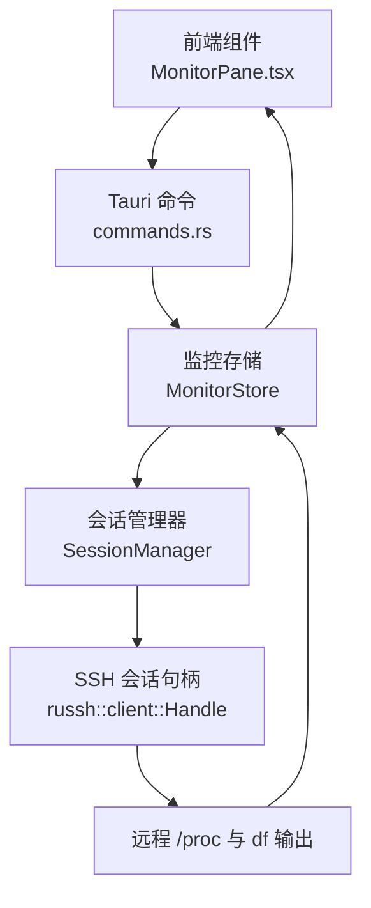
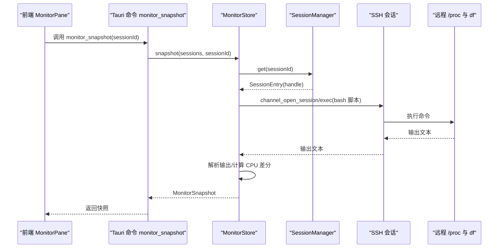
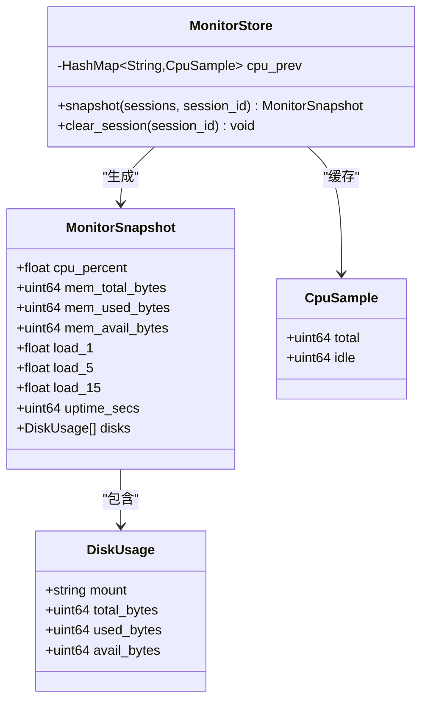
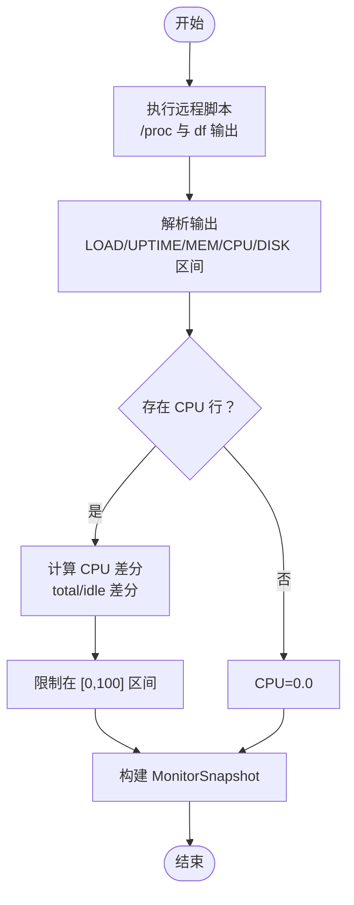
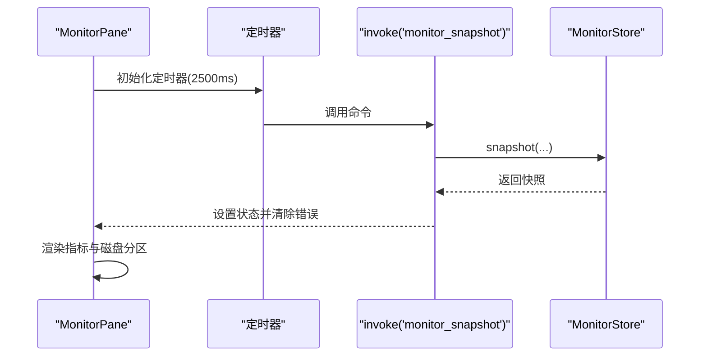
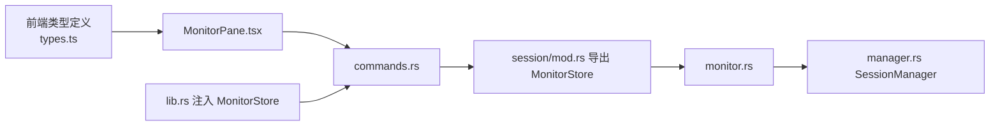

# 系统监控命令

<cite>
**本文档引用的文件**
- [monitor.rs](file://src-tauri/src/session/monitor.rs)
- [MonitorPane.tsx](file://src/components/MonitorPane.tsx)
- [commands.rs](file://src-tauri/src/commands.rs)
- [lib.rs](file://src-tauri/src/lib.rs)
- [types.ts](file://src/types.ts)
- [mod.rs](file://src-tauri/src/session/mod.rs)
- [manager.rs](file://src-tauri/src/session/manager.rs)
</cite>

## 目录
1. [简介](#简介)
2. [项目结构](#项目结构)
3. [核心组件](#核心组件)
4. [架构总览](#架构总览)
5. [详细组件分析](#详细组件分析)
6. [依赖关系分析](#依赖关系分析)
7. [性能考量](#性能考量)
8. [故障排查指南](#故障排查指南)
9. [结论](#结论)
10. [附录](#附录)

## 简介
本文件聚焦于系统监控命令“monitor_snapshot”的完整实现与使用说明，涵盖以下方面：
- 如何在指定 SSH 会话上采集远程 Linux /proc 指标快照（CPU、内存、负载、运行时间、磁盘分区）。
- 数据结构定义、采样频率控制、缓存机制与性能影响。
- 实时性保障、错误处理策略与数据格式标准化。
- 监控面板集成与可视化建议，以及基于监控数据进行性能分析与故障诊断的方法。

## 项目结构
监控功能由 Rust 后端与 React 前端协同完成：
- 后端负责在现有 SSH 会话上执行远程命令、解析输出并计算 CPU 利用率差分。
- 前端负责定时轮询、展示指标与错误提示，并提供手动刷新按钮。

图表来源
- [MonitorPane.tsx:57-88](file://src/components/MonitorPane.tsx#L57-L88)
- [commands.rs:680-688](file://src-tauri/src/commands.rs#L680-L688)
- [monitor.rs:46-79](file://src-tauri/src/session/monitor.rs#L46-L79)
- [manager.rs:76-80](file://src-tauri/src/session/manager.rs#L76-L80)

章节来源
- [MonitorPane.tsx:57-88](file://src/components/MonitorPane.tsx#L57-L88)
- [commands.rs:680-688](file://src-tauri/src/commands.rs#L680-L688)
- [monitor.rs:46-79](file://src-tauri/src/session/monitor.rs#L46-L79)
- [lib.rs:32](file://src-tauri/src/lib.rs#L32)

## 核心组件
- 监控快照数据模型：包含 CPU 百分比、内存总量/已用/可用、负载（1/5/15）、运行时间秒数、磁盘分区列表。
- 监控存储：维护各会话的上次 CPU 采样，用于差分计算利用率。
- 命令接口：暴露 monitor_snapshot 命令，接收会话 ID 并返回快照。
- 前端面板：定时轮询、展示指标、格式化显示与错误提示。

章节来源
- [monitor.rs:10-31](file://src-tauri/src/session/monitor.rs#L10-L31)
- [monitor.rs:40-44](file://src-tauri/src/session/monitor.rs#L40-L44)
- [commands.rs:680-688](file://src-tauri/src/commands.rs#L680-L688)
- [MonitorPane.tsx:57-178](file://src/components/MonitorPane.tsx#L57-L178)
- [types.ts:125-136](file://src/types.ts#L125-L136)

## 架构总览
monitor_snapshot 的调用链路如下：
- 前端通过 Tauri invoke 调用 monitor_snapshot 命令。
- 命令函数委托 MonitorStore 执行快照采集。
- MonitorStore 在指定会话上打开 SSH channel，执行远程 bash 脚本，收集 /proc 与 df 输出。
- 解析器提取各项指标，CPU 利用率通过两次 /proc/stat 差分计算。
- 结果序列化为 MonitorSnapshot 返回前端。

图表来源
- [MonitorPane.tsx:62-74](file://src/components/MonitorPane.tsx#L62-L74)
- [commands.rs:680-688](file://src-tauri/src/commands.rs#L680-L688)
- [monitor.rs:46-79](file://src-tauri/src/session/monitor.rs#L46-L79)
- [monitor.rs:81-117](file://src-tauri/src/session/monitor.rs#L81-L117)
- [monitor.rs:119-197](file://src-tauri/src/session/monitor.rs#L119-L197)

## 详细组件分析

### 数据模型与结构定义
- MonitorSnapshot：包含 CPU 百分比、内存总量/已用/可用、负载（1/5/15）、运行时间秒数、磁盘分区列表。
- DiskUsage：描述单个挂载点的总容量、已用、可用字节数。
- MonitorStore：维护每个会话的上次 CPU 采样，用于差分计算。

图表来源
- [monitor.rs:10-31](file://src-tauri/src/session/monitor.rs#L10-L31)
- [monitor.rs:33-44](file://src-tauri/src/session/monitor.rs#L33-L44)

章节来源
- [monitor.rs:10-31](file://src-tauri/src/session/monitor.rs#L10-L31)
- [monitor.rs:33-44](file://src-tauri/src/session/monitor.rs#L33-L44)
- [types.ts:118-136](file://src/types.ts#L118-L136)

### 采样流程与解析逻辑
- 远程脚本：通过 bash -c 采集 /proc/loadavg、/proc/uptime、/proc/meminfo、/proc/stat 与 df 输出。
- 解析器：按标记行分割输出，提取数值并构造 MonitorSnapshot。
- CPU 利用率：从 /proc/stat 读取累计时间和空闲时间，与上次样本做差分，得到区间利用率。

图表来源
- [monitor.rs:58-70](file://src-tauri/src/session/monitor.rs#L58-L70)
- [monitor.rs:119-197](file://src-tauri/src/session/monitor.rs#L119-L197)
- [monitor.rs:199-230](file://src-tauri/src/session/monitor.rs#L199-L230)

章节来源
- [monitor.rs:58-70](file://src-tauri/src/session/monitor.rs#L58-L70)
- [monitor.rs:119-197](file://src-tauri/src/session/monitor.rs#L119-L197)
- [monitor.rs:199-230](file://src-tauri/src/session/monitor.rs#L199-L230)

### 前端轮询与展示
- 轮询周期：默认每 2.5 秒拉取一次快照。
- 展示内容：CPU 使用率、内存使用百分比、负载与运行时间、各磁盘分区使用情况。
- 错误处理：捕获异常并显示错误信息；首次 CPU 采样需等待下一轮刷新。

图表来源
- [MonitorPane.tsx:76-88](file://src/components/MonitorPane.tsx#L76-L88)
- [MonitorPane.tsx:62-74](file://src/components/MonitorPane.tsx#L62-L74)

章节来源
- [MonitorPane.tsx:57-178](file://src/components/MonitorPane.tsx#L57-L178)

### 命令与状态注入
- Tauri 命令：monitor_snapshot 将请求转发给 MonitorStore。
- 应用启动：全局管理 MonitorStore，确保命令可用。

章节来源
- [commands.rs:680-688](file://src-tauri/src/commands.rs#L680-L688)
- [lib.rs:32](file://src-tauri/src/lib.rs#L32)

## 依赖关系分析
- MonitorPane.tsx 依赖前端类型 MonitorSnapshot 与 Tauri invoke。
- commands.rs 暴露 monitor_snapshot 命令，依赖 SessionManager 与 MonitorStore。
- monitor.rs 依赖 SessionManager、russh Handle 与 tokio Mutex。
- lib.rs 在应用启动时注入 MonitorStore。

图表来源
- [types.ts:125-136](file://src/types.ts#L125-L136)
- [MonitorPane.tsx:64-66](file://src/components/MonitorPane.tsx#L64-L66)
- [commands.rs:680-688](file://src-tauri/src/commands.rs#L680-L688)
- [mod.rs:32](file://src-tauri/src/session/mod.rs#L32)
- [monitor.rs:46-79](file://src-tauri/src/session/monitor.rs#L46-L79)
- [manager.rs:76-80](file://src-tauri/src/session/manager.rs#L76-L80)
- [lib.rs:32](file://src-tauri/src/lib.rs#L32)

章节来源
- [types.ts:125-136](file://src/types.ts#L125-L136)
- [MonitorPane.tsx:64-66](file://src/components/MonitorPane.tsx#L64-L66)
- [commands.rs:680-688](file://src-tauri/src/commands.rs#L680-L688)
- [mod.rs:32](file://src-tauri/src/session/mod.rs#L32)
- [monitor.rs:46-79](file://src-tauri/src/session/monitor.rs#L46-L79)
- [manager.rs:76-80](file://src-tauri/src/session/manager.rs#L76-L80)
- [lib.rs:32](file://src-tauri/src/lib.rs#L32)

## 性能考量
- 采样频率：前端默认 2.5 秒一次，适合观察短期波动；如需更低延迟可缩短间隔，但会增加远程命令开销与网络往返次数。
- CPU 差分：仅在第二次及之后采样时有效，首次采样返回 0.0，避免因缺少基线导致的异常值。
- 远程命令成本：每次调用都会在远端执行 bash 脚本与多个 /proc 文件读取，建议在仪表盘中合并展示，减少不必要的频繁刷新。
- 并发与锁：MonitorStore 使用 Mutex 保护会话级 CPU 缓存，避免并发写入竞争。
- 磁盘遍历：df 命令过滤了临时文件系统，但仍会产生一定 IO 开销，建议在高并发场景下适当降低轮询频率。

[本节为通用性能讨论，无需特定文件来源]

## 故障排查指南
- 会话不存在：当传入无效的 session_id 时，返回“会话不存在”错误。请确认会话已建立且 ID 正确。
- 非 Linux 主机：远程脚本退出码非零时，返回“可能非 Linux 主机”提示。请检查目标主机操作系统。
- 网络中断：SSH 通道异常会导致命令执行失败。前端会显示错误信息，可在“立即刷新”按钮重试。
- 首次 CPU 采样：由于需要两次 /proc/stat 差分，首次返回 CPU 为 0.0，属预期行为。

章节来源
- [monitor.rs:53-56](file://src-tauri/src/session/monitor.rs#L53-L56)
- [monitor.rs:105-111](file://src-tauri/src/session/monitor.rs#L105-L111)
- [MonitorPane.tsx:69-71](file://src/components/MonitorPane.tsx#L69-L71)

## 结论
monitor_snapshot 命令通过在现有 SSH 会话上执行轻量远程脚本，实现了对 Linux 系统关键指标的快速采集与展示。其设计具备以下特点：
- 低耦合：复用已有会话，无需额外连接。
- 易扩展：数据模型清晰，便于添加更多指标。
- 友好体验：前端定时轮询与错误提示提升可观测性。
- 可靠性：CPU 利用率差分计算与错误处理保障数据稳定性。

[本节为总结性内容，无需特定文件来源]

## 附录

### 使用步骤
- 确保已建立 SSH 会话并获取会话 ID。
- 在前端监控面板中输入会话 ID，点击“立即刷新”或等待自动轮询。
- 查看 CPU、内存、负载、运行时间与磁盘分区使用情况。

章节来源
- [MonitorPane.tsx:57-88](file://src/components/MonitorPane.tsx#L57-L88)

### 数据格式标准化
- 字段命名与含义：参考 MonitorSnapshot 与 DiskUsage 的字段定义。
- 单位约定：内存与磁盘容量统一为字节；CPU 百分比为 0-100 浮点数；负载为浮点数；运行时间为整数秒。
- 前端格式化：内存与磁盘容量采用人类可读单位（KB/MB/GB）；运行时间采用天/小时/分钟格式。

章节来源
- [monitor.rs:10-31](file://src-tauri/src/session/monitor.rs#L10-L31)
- [MonitorPane.tsx:11-26](file://src/components/MonitorPane.tsx#L11-L26)
- [types.ts:118-136](file://src/types.ts#L118-L136)

### 监控面板集成与可视化建议
- 集成方式：在应用侧新增一个标签页或侧边栏面板，渲染 MonitorPane 并传入当前会话 ID。
- 可视化建议：
  - CPU 与内存使用率采用进度条或面积图展示趋势。
  - 负载与运行时间可作为状态卡片展示。
  - 磁盘分区使用率采用堆叠柱状图或环形图，突出关键分区。
- 交互优化：提供手动刷新按钮、设置轮询间隔、在错误时自动重试与告警。

章节来源
- [MonitorPane.tsx:95-178](file://src/components/MonitorPane.tsx#L95-L178)

### 性能分析与故障诊断
- 性能分析：
  - 观察 CPU 与内存使用率峰值与持续时间，结合负载判断系统压力。
  - 对比不同时间段的磁盘使用变化，定位大文件增长或异常写入。
- 故障诊断：
  - 若 CPU 一直为 0.0，检查是否为首次采样或 /proc/stat 是否可读。
  - 若磁盘分区为空，检查 df 命令权限与过滤条件。
  - 若出现错误提示，优先确认会话状态与目标主机类型。

章节来源
- [monitor.rs:199-230](file://src-tauri/src/session/monitor.rs#L199-L230)
- [monitor.rs:119-197](file://src-tauri/src/session/monitor.rs#L119-L197)