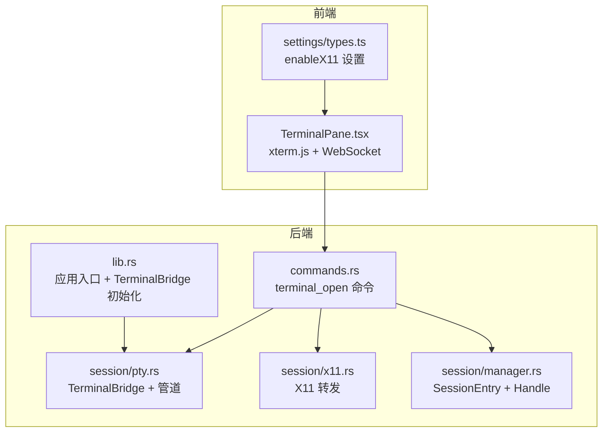
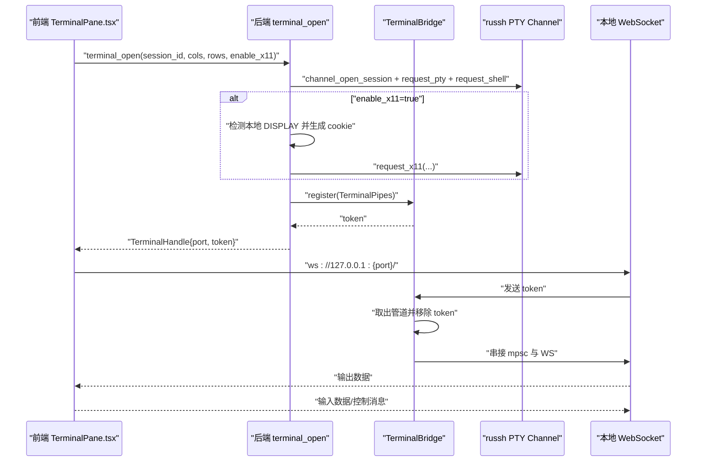
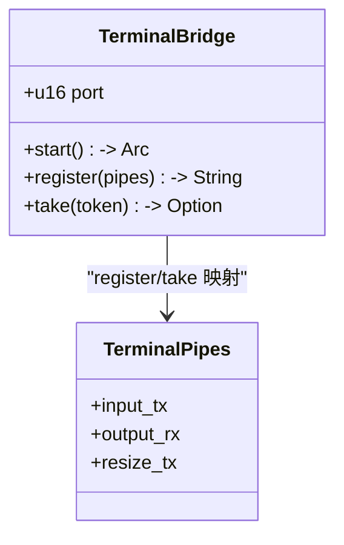
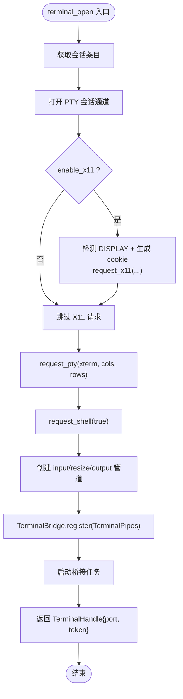
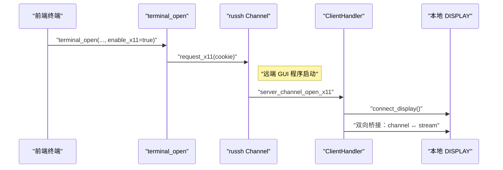
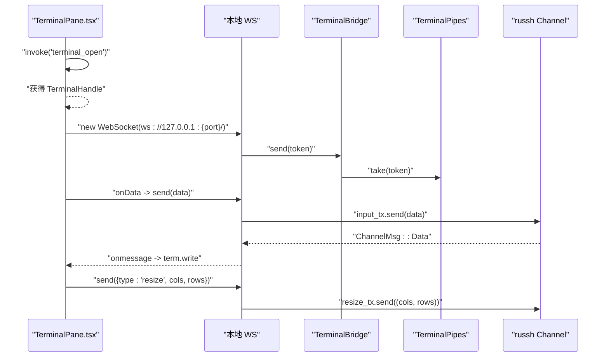
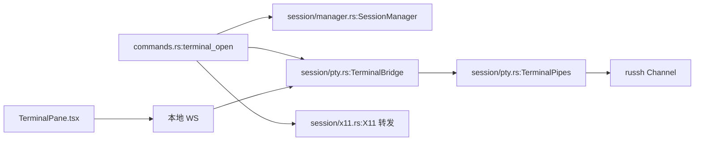

# 终端命令

<cite>
**本文引用的文件**
- [commands.rs](file://src-tauri/src/commands.rs)
- [pty.rs](file://src-tauri/src/session/pty.rs)
- [x11.rs](file://src-tauri/src/session/x11.rs)
- [lib.rs](file://src-tauri/src/lib.rs)
- [TerminalPane.tsx](file://src/components/TerminalPane.tsx)
- [types.ts](file://src/settings/types.ts)
- [manager.rs](file://src-tauri/src/session/manager.rs)
</cite>

## 目录
1. [简介](#简介)
2. [项目结构](#项目结构)
3. [核心组件](#核心组件)
4. [架构总览](#架构总览)
5. [组件详解](#组件详解)
6. [依赖关系分析](#依赖关系分析)
7. [性能考量](#性能考量)
8. [故障排查指南](#故障排查指南)
9. [结论](#结论)
10. [附录](#附录)

## 简介
本文件围绕终端操作命令“terminal_open”的完整实现进行深入解析，涵盖以下关键主题：
- 如何在指定会话上开启交互式 PTY 终端
- 参数配置（会话ID、终端尺寸、X11转发选项）
- WebSocket 桥接机制与输入输出管道管理
- 终端生命周期控制与优雅关闭
- TerminalHandle 结构体的组成（端口号和一次性token）
- X11 转发的实现原理与安全考虑
- 提供完整的使用示例，说明如何建立终端连接、处理终端数据流和优雅关闭终端会话

## 项目结构
终端功能涉及前后端协作的关键文件如下：
- Rust 后端
  - commands.rs：暴露 terminal_open 命令，负责 PTY 通道创建、管道注册与桥接任务启动
  - session/pty.rs：本地 WebSocket 终端桥接、token 管道映射、输入输出控制
  - session/x11.rs：X11 转发实现，将远端 X11 channel 桥接到本地 DISPLAY
  - session/manager.rs：会话池与会话条目，承载 russh Handle 与 X11 显示目标
  - lib.rs：应用入口，初始化 TerminalBridge 并注册命令
- 前端
  - TerminalPane.tsx：xterm.js 终端面板，负责与本地 WS 通信、尺寸调整、数据流处理
  - settings/types.ts：应用设置，包含 enableX11 开关

图表来源
- [commands.rs:106-186](file://src-tauri/src/commands.rs#L106-L186)
- [pty.rs:42-85](file://src-tauri/src/session/pty.rs#L42-L85)
- [x11.rs:27-36](file://src-tauri/src/session/x11.rs#L27-L36)
- [manager.rs:51-62](file://src-tauri/src/session/manager.rs#L51-L62)
- [lib.rs:34-42](file://src-tauri/src/lib.rs#L34-L42)

章节来源
- [lib.rs:14-92](file://src-tauri/src/lib.rs#L14-L92)
- [commands.rs:106-186](file://src-tauri/src/commands.rs#L106-L186)

## 核心组件
- TerminalHandle：后端返回给前端的连接凭证，包含本地 WebSocket 端口与一次性 token
- TerminalBridge：本地 WebSocket 服务，负责接受前端 WS 连接、验证 token、将 mpsc 管道与 WS 串接
- TerminalPipes：输入/输出/尺寸三类 mpsc 管道，作为 russh Channel 与 WebSocket 的中转
- X11 转发：通过 request_x11 请求与本地 DISPLAY 建立双向桥接

章节来源
- [commands.rs:99-103](file://src-tauri/src/commands.rs#L99-L103)
- [pty.rs:32-39](file://src-tauri/src/session/pty.rs#L32-L39)
- [pty.rs:42-85](file://src-tauri/src/session/pty.rs#L42-L85)
- [x11.rs:27-36](file://src-tauri/src/session/x11.rs#L27-L36)

## 架构总览
terminal_open 的端到端流程如下：
- 前端调用 terminal_open，携带会话ID、终端尺寸与 X11 开关
- 后端在指定会话上打开 PTY 通道，并根据开关决定是否请求 X11
- 后端创建三类 mpsc 管道，注册到 TerminalBridge，生成一次性 token
- 后端返回 TerminalHandle（端口 + token）
- 前端使用返回的端口建立本地 WS 连接，并发送 token
- WS 连接建立后，后端将 mpsc 管道与 WS 串接，开始数据流转发

图表来源
- [commands.rs:106-186](file://src-tauri/src/commands.rs#L106-L186)
- [pty.rs:87-141](file://src-tauri/src/session/pty.rs#L87-L141)
- [TerminalPane.tsx:103-135](file://src/components/TerminalPane.tsx#L103-L135)

## 组件详解

### TerminalHandle 结构体
- 字段
  - port：本地 WebSocket 端口（127.0.0.1:port）
  - token：一次性 token，用于 WS 首条消息的身份验证
- 作用
  - 前端通过该结构体建立本地 WS 连接并进行身份验证
  - token 一次性使用，确保每个 terminal_open 对应一次 WS 连接

章节来源
- [commands.rs:99-103](file://src-tauri/src/commands.rs#L99-L103)

### TerminalBridge 与 TerminalPipes
- TerminalBridge
  - 绑定 127.0.0.1:0 随机端口，启动 accept 循环
  - 维护 token → TerminalPipes 的映射，支持 register/take
  - WS 连接建立后，取出对应管道并移除 token
- TerminalPipes
  - input_tx：前端输入 → 后端桥接任务 → russh Channel.data
  - output_rx：russh Channel 数据 → 后端桥接任务 → WS 输出
  - resize_tx：前端控制消息（resize）→ 后端桥接任务 → russh Channel.window_change

图表来源
- [pty.rs:42-85](file://src-tauri/src/session/pty.rs#L42-L85)
- [pty.rs:32-39](file://src-tauri/src/session/pty.rs#L32-L39)

章节来源
- [pty.rs:42-85](file://src-tauri/src/session/pty.rs#L42-L85)
- [pty.rs:32-39](file://src-tauri/src/session/pty.rs#L32-L39)

### terminal_open 命令实现要点
- 参数
  - session_id：目标会话 ID
  - cols/rows：终端初始尺寸
  - enable_x11：可选布尔，是否启用 X11 转发
- 步骤
  - 获取会话条目，打开 PTY 会话通道
  - 若启用 X11：检测本地 DISPLAY，生成随机 cookie，发起 request_x11
  - 请求 PTY（xterm）与 shell
  - 创建三类 mpsc 管道，注册到 TerminalBridge，生成 token
  - 启动桥接任务：监听 input/resize 与 ChannelMsg，转发数据
  - 返回 TerminalHandle

图表来源
- [commands.rs:106-186](file://src-tauri/src/commands.rs#L106-L186)

章节来源
- [commands.rs:106-186](file://src-tauri/src/commands.rs#L106-L186)

### X11 转发实现与安全
- 实现原理
  - 后端在 terminal_open 中请求 X11，设置认证 cookie（MIT-MAGIC-COOKIE-1）
  - 远端 GUI 程序通过 SSH X11 channel 回调触发，后端在 ClientHandler 中桥接到本地 DISPLAY
  - 本地 DISPLAY 解析：支持 Unix Socket（/tmp/.X11-unix/Xn）与 TCP 6000+n
- 安全考虑
  - 一次性 cookie：每次会话生成新的随机 cookie，降低重放风险
  - 本地环境变量：要求存在 DISPLAY，否则禁用 X11 转发
  - 仅在会话级生效：X11 目标存储于 SessionEntry 的 x11_display，随会话生命周期管理

图表来源
- [commands.rs:127-136](file://src-tauri/src/commands.rs#L127-L136)
- [x11.rs:27-36](file://src-tauri/src/session/x11.rs#L27-L36)
- [x11.rs:62-125](file://src-tauri/src/session/x11.rs#L62-L125)
- [manager.rs:60-61](file://src-tauri/src/session/manager.rs#L60-L61)

章节来源
- [commands.rs:127-136](file://src-tauri/src/commands.rs#L127-L136)
- [x11.rs:27-36](file://src-tauri/src/session/x11.rs#L27-L36)
- [x11.rs:62-125](file://src-tauri/src/session/x11.rs#L62-L125)
- [manager.rs:60-61](file://src-tauri/src/session/manager.rs#L60-L61)

### WebSocket 桥接与前端交互
- 前端流程
  - 调用 terminal_open，获得 TerminalHandle
  - 使用返回端口建立 ws://127.0.0.1:{port}/ 连接
  - 首条消息发送 token，随后进入数据流
  - 输入：xterm.js onData → encode → WS.send
  - 输出：WS.onmessage → highlight → term.write
  - 尺寸：FitAddon.fit + 防抖定时器 → WS.send({type:"resize", cols, rows})
- 后端 WS 处理
  - 验证首条消息为 token
  - 取出管道并移除 token
  - select 监听 WS 输入与输出管道，分别写入 Channel 或发送 WS Binary

图表来源
- [TerminalPane.tsx:103-135](file://src/components/TerminalPane.tsx#L103-L135)
- [pty.rs:87-141](file://src-tauri/src/session/pty.rs#L87-L141)

章节来源
- [TerminalPane.tsx:103-135](file://src/components/TerminalPane.tsx#L103-L135)
- [pty.rs:87-141](file://src-tauri/src/session/pty.rs#L87-L141)

### 终端生命周期控制
- 启动：terminal_open 创建 PTY 通道、注册管道、启动桥接任务
- 运行：WS 连接建立后，数据双向转发；前端可发送 resize 控制消息
- 关闭：当 Channel EOF 或 ExitStatus，桥接任务退出；WS 关闭时清理资源
- 优雅关闭：前端 dispose 时关闭 WS、销毁 xterm、移除事件监听

章节来源
- [commands.rs:169-183](file://src-tauri/src/commands.rs#L169-L183)
- [TerminalPane.tsx:137-148](file://src/components/TerminalPane.tsx#L137-L148)

## 依赖关系分析
- 命令依赖
  - terminal_open 依赖 SessionManager 获取会话条目
  - 依赖 TerminalBridge 注册管道与生成 token
  - 可选依赖 x11.rs 进行 X11 转发
- 组件耦合
  - TerminalBridge 与 TerminalPipes 通过 token 建立一一对应关系
  - 会话条目 SessionEntry 持有 russh Handle 与 X11 显示目标
- 外部集成
  - xterm.js 前端渲染与输入输出
  - tokio_tungstenite 本地 WebSocket 服务

图表来源
- [commands.rs:106-186](file://src-tauri/src/commands.rs#L106-L186)
- [pty.rs:42-85](file://src-tauri/src/session/pty.rs#L42-L85)
- [manager.rs:51-62](file://src-tauri/src/session/manager.rs#L51-L62)
- [TerminalPane.tsx:103-135](file://src/components/TerminalPane.tsx#L103-L135)

章节来源
- [commands.rs:106-186](file://src-tauri/src/commands.rs#L106-L186)
- [pty.rs:42-85](file://src-tauri/src/session/pty.rs#L42-L85)
- [manager.rs:51-62](file://src-tauri/src/session/manager.rs#L51-L62)
- [TerminalPane.tsx:103-135](file://src/components/TerminalPane.tsx#L103-L135)

## 性能考量
- 管道容量
  - input/output 管道容量为 64，resize 管道容量为 8，平衡吞吐与内存占用
- 事件选择
  - tokio::select! 并发监听 WS 输入与输出管道，避免阻塞
- 尺寸调整
  - 前端使用防抖定时器减少 resize 消息洪泛
- X11 转发
  - 采用 64KB 缓冲区，双向桥接，注意远端 GUI 程序的网络延迟与带宽

## 故障排查指南
- “会话不存在”
  - 现象：terminal_open 返回 session not found
  - 排查：确认 session_id 是否正确，会话是否仍处于活跃状态
- “无法启用 X11 转发”
  - 现象：返回未检测到 DISPLAY 或 X11 请求失败
  - 排查：检查本地 DISPLAY 环境变量；确认 enableX11 设置为 true；查看 X11 连接日志
- “WS 连接异常关闭”
  - 现象：WS onclose 触发
  - 排查：确认 token 是否正确发送；检查 TerminalBridge 是否移除了 token；查看后端日志
- “终端无输出”
  - 现象：term.write 无响应
  - 排查：确认 WS 已发送 token；检查 ChannelMsg::Data 是否到达；核对输出管道是否被消费

章节来源
- [commands.rs:115-118](file://src-tauri/src/commands.rs#L115-L118)
- [commands.rs:128-135](file://src-tauri/src/commands.rs#L128-L135)
- [pty.rs:92-95](file://src-tauri/src/session/pty.rs#L92-L95)
- [TerminalPane.tsx:128-130](file://src/components/TerminalPane.tsx#L128-L130)

## 结论
terminal_open 命令通过会话复用、PTC 通道与本地 WebSocket 桥接，实现了高效稳定的终端交互体验。配合 X11 转发与一次性 token 机制，在安全性与易用性之间取得平衡。前端通过 xterm.js 与后端形成清晰的数据流闭环，支持动态尺寸调整与优雅关闭。

## 附录

### 使用示例（步骤说明）
- 建立终端连接
  - 前端调用 terminal_open，传入 session_id、cols、rows、enableX11
  - 获取 TerminalHandle，使用其中 port 建立 ws://127.0.0.1:{port}/ 连接
  - 首条消息发送 token
- 处理终端数据流
  - 输入：xterm.js onData → encode → WS.send
  - 输出：WS.onmessage → highlight → term.write
  - 尺寸：FitAddon.fit + 防抖 → WS.send({type:"resize", cols, rows})
- 优雅关闭终端会话
  - 前端 dispose：关闭 WS、销毁 xterm、移除事件监听
  - 后端：Channel EOF/ExitStatus 触发桥接任务退出；TerminalBridge 移除 token

章节来源
- [TerminalPane.tsx:103-135](file://src/components/TerminalPane.tsx#L103-L135)
- [pty.rs:87-141](file://src-tauri/src/session/pty.rs#L87-L141)
- [commands.rs:169-183](file://src-tauri/src/commands.rs#L169-L183)