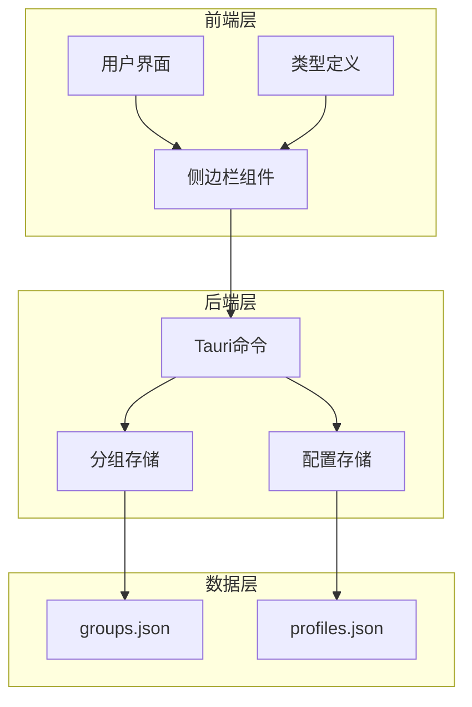
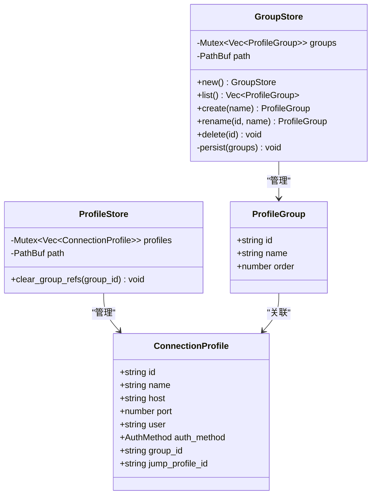
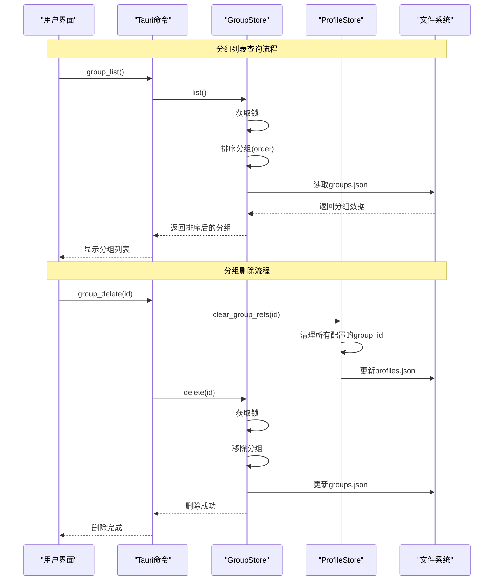
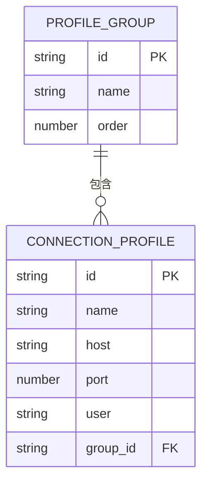
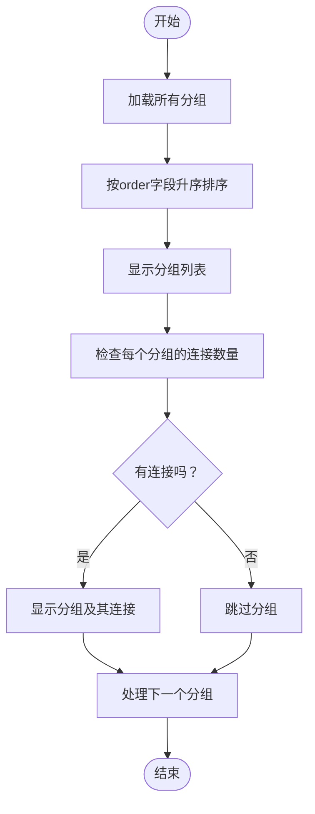
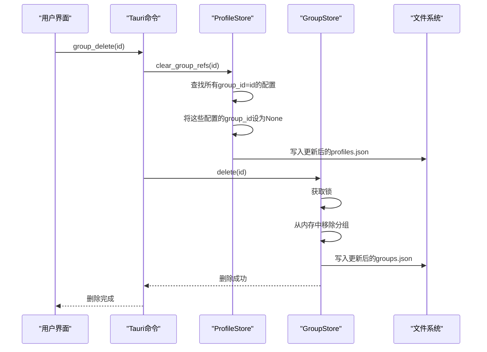
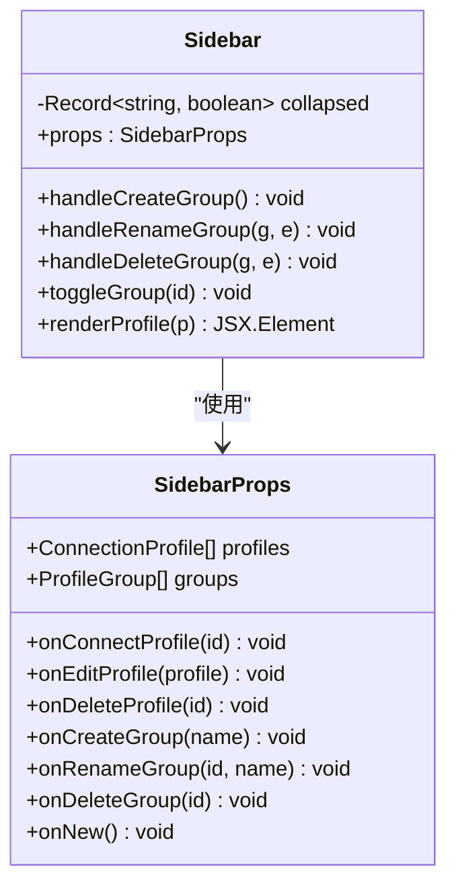
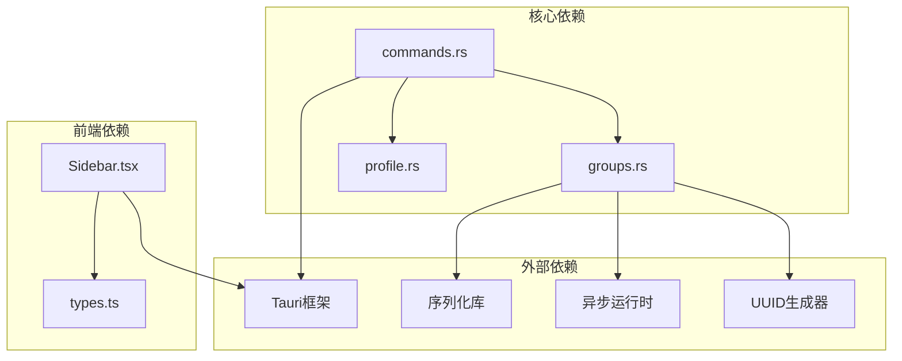

# 连接分组命令

<cite>
**本文档引用的文件**
- [groups.rs](file://src-tauri/src/session/groups.rs)
- [commands.rs](file://src-tauri/src/commands.rs)
- [profile.rs](file://src-tauri/src/session/profile.rs)
- [Sidebar.tsx](file://src/components/Sidebar.tsx)
- [types.ts](file://src/types.ts)
- [mod.rs](file://src-tauri/src/session/mod.rs)
</cite>

## 目录
1. [简介](#简介)
2. [项目结构](#项目结构)
3. [核心组件](#核心组件)
4. [架构概览](#架构概览)
5. [详细组件分析](#详细组件分析)
6. [依赖关系分析](#依赖关系分析)
7. [性能考虑](#性能考虑)
8. [故障排除指南](#故障排除指南)
9. [最佳实践](#最佳实践)
10. [使用示例](#使用示例)
11. [结论](#结论)

## 简介

连接分组管理命令是简化 SSH 客户端中连接配置组织功能的核心模块。该模块提供了完整的连接分组生命周期管理，包括分组列表查看、创建、重命名、删除等操作。分组功能采用扁平化的树形结构设计，支持连接配置的灵活分类和高效管理。

该系统将连接分组与连接配置分离存储，确保了数据结构的清晰性和系统的可维护性。分组数据独立存储在 `groups.json` 文件中，而连接配置存储在 `profiles.json` 文件中，两者通过 `group_id` 字段建立关联关系。

## 项目结构

连接分组功能分布在 Rust 后端和 TypeScript 前端两个层面：



**图表来源**
- [Sidebar.tsx:1-212](file://src/components/Sidebar.tsx#L1-L212)
- [commands.rs:638-676](file://src-tauri/src/commands.rs#L638-L676)
- [groups.rs:18-96](file://src-tauri/src/session/groups.rs#L18-L96)

**章节来源**
- [Sidebar.tsx:1-212](file://src/components/Sidebar.tsx#L1-L212)
- [commands.rs:638-676](file://src-tauri/src/commands.rs#L638-L676)
- [groups.rs:1-102](file://src-tauri/src/session/groups.rs#L1-L102)

## 核心组件

连接分组管理系统由以下核心组件构成：

### 数据模型



**图表来源**
- [groups.rs:9-16](file://src-tauri/src/session/groups.rs#L9-L16)
- [groups.rs:18-90](file://src-tauri/src/session/groups.rs#L18-L90)
- [profile.rs:47-65](file://src-tauri/src/session/profile.rs#L47-L65)
- [profile.rs:221-235](file://src-tauri/src/session/profile.rs#L221-L235)

### 命令接口

系统提供四个主要的 Tauri 命令：

| 命令名称 | 参数 | 返回值 | 功能描述 |
|---------|------|--------|----------|
| group_list | 无 | Vec<ProfileGroup> | 列出所有连接分组 |
| group_create | name: string | ProfileGroup | 创建新的连接分组 |
| group_rename | id: string, name: string | ProfileGroup | 重命名连接分组 |
| group_delete | id: string | void | 删除连接分组 |

**章节来源**
- [commands.rs:640-676](file://src-tauri/src/commands.rs#L640-L676)
- [groups.rs:37-80](file://src-tauri/src/session/groups.rs#L37-L80)

## 架构概览

连接分组管理采用分层架构设计，确保了良好的关注点分离：



**图表来源**
- [commands.rs:640-676](file://src-tauri/src/commands.rs#L640-L676)
- [groups.rs:70-80](file://src-tauri/src/session/groups.rs#L70-L80)
- [profile.rs:221-235](file://src-tauri/src/session/profile.rs#L221-L235)

## 详细组件分析

### 分组数据结构

分组采用扁平化设计，不支持嵌套结构：



**图表来源**
- [groups.rs:9-16](file://src-tauri/src/session/groups.rs#L9-L16)
- [profile.rs:47-65](file://src-tauri/src/session/profile.rs#L47-L65)

### 排序规则和显示逻辑

分组的排序基于 `order` 字段，数值越小显示位置越靠前：



**图表来源**
- [groups.rs:37-41](file://src-tauri/src/session/groups.rs#L37-L41)
- [Sidebar.tsx:40-43](file://src/components/Sidebar.tsx#L40-L43)

### 分组删除机制

分组删除采用"先迁移后删除"的安全策略：



**图表来源**
- [commands.rs:667-676](file://src-tauri/src/commands.rs#L667-L676)
- [profile.rs:221-235](file://src-tauri/src/session/profile.rs#L221-L235)
- [groups.rs:70-80](file://src-tauri/src/session/groups.rs#L70-L80)

**章节来源**
- [commands.rs:667-676](file://src-tauri/src/commands.rs#L667-L676)
- [profile.rs:221-235](file://src-tauri/src/session/profile.rs#L221-L235)

### 前端集成

前端侧边栏组件实现了完整的分组管理交互：



**图表来源**
- [Sidebar.tsx:14-24](file://src/components/Sidebar.tsx#L14-L24)
- [Sidebar.tsx:27-37](file://src/components/Sidebar.tsx#L27-L37)

**章节来源**
- [Sidebar.tsx:1-212](file://src/components/Sidebar.tsx#L1-L212)
- [types.ts:13-17](file://src/types.ts#L13-L17)

## 依赖关系分析

连接分组系统与其他组件的依赖关系如下：



**图表来源**
- [commands.rs:10-21](file://src-tauri/src/commands.rs#L10-L21)
- [groups.rs:3-7](file://src-tauri/src/session/groups.rs#L3-L7)
- [Sidebar.tsx:1-12](file://src/components/Sidebar.tsx#L1-L12)

**章节来源**
- [commands.rs:10-21](file://src-tauri/src/commands.rs#L10-L21)
- [groups.rs:3-7](file://src-tauri/src/session/groups.rs#L3-L7)
- [mod.rs:12-29](file://src-tauri/src/session/mod.rs#L12-L29)

## 性能考虑

### 内存管理
- 使用 `Mutex<Vec<ProfileGroup>>` 确保并发安全
- 每次操作都进行完整的数据复制，保证线程安全
- 排序操作的时间复杂度为 O(n log n)

### 文件I/O优化
- 分组数据采用 JSON 序列化，便于人类阅读和调试
- 使用 `pretty` 格式化输出，提高可读性
- 文件写入采用原子操作，避免数据损坏

### 前端渲染优化
- 使用 `useMemo` 缓存排序结果
- 仅在数据变化时重新计算排序
- 支持分组折叠，减少 DOM 节点数量

## 故障排除指南

### 常见问题及解决方案

| 问题类型 | 症状 | 可能原因 | 解决方案 |
|---------|------|----------|----------|
| 分组创建失败 | 返回错误信息 | 名称为空或包含特殊字符 | 确保名称非空且符合要求 |
| 分组重命名失败 | 返回"分组不存在" | ID 错误或已被删除 | 检查分组 ID 是否正确 |
| 分组删除失败 | 返回"分组不存在" | ID 错误或已被删除 | 确认分组 ID 和存在状态 |
| 连接迁移异常 | 分组内仍有连接 | 数据库不一致 | 手动检查 profiles.json 文件 |
| 排序显示异常 | 分组顺序错误 | order 字段异常 | 重新创建分组或手动修复 |

### 调试技巧

1. **检查数据文件**：验证 `~/.config/simpl-ssh/groups.json` 和 `profiles.json` 文件格式
2. **查看日志**：启用调试模式查看详细的错误信息
3. **验证 ID**：确保所有 `group_id` 引用都指向有效分组
4. **检查权限**：确认应用程序对配置目录有读写权限

**章节来源**
- [groups.rs:82-89](file://src-tauri/src/session/groups.rs#L82-L89)
- [profile.rs:221-235](file://src-tauri/src/session/profile.rs#L221-L235)

## 最佳实践

### 分组命名规范

1. **语义化命名**：使用描述性强的名称，如 "生产环境-数据库"、"开发测试-应用"
2. **层级结构**：通过前缀区分不同级别的分组，如 "1-生产环境"、"2-开发环境"
3. **一致性**：保持团队内部命名风格统一

### 连接组织策略

1. **按环境分组**：将不同环境的连接分别组织到独立分组中
2. **按项目分组**：为不同项目创建专门的连接分组
3. **按地理位置分组**：根据服务器地理位置进行分组管理
4. **混合策略**：结合多种维度进行组织，如 "生产-北京-数据库"

### 维护建议

1. **定期清理**：定期审查和清理不再使用的分组
2. **备份策略**：定期备份 `groups.json` 和 `profiles.json` 文件
3. **权限控制**：确保只有授权用户可以修改分组设置
4. **版本管理**：对于重要的连接配置，考虑使用版本控制系统

## 使用示例

### 基本操作流程

#### 创建分组
```typescript
// 前端调用
const newGroup = await window.__TAURI__.invoke('group_create', { name: '生产环境' });
console.log('创建的分组:', newGroup);
```

#### 列出分组
```typescript
// 前端调用
const groups = await window.__TAURI__.invoke('group_list');
console.log('所有分组:', groups);
```

#### 重命名分组
```typescript
// 前端调用
const renamedGroup = await window.__TAURI__.invoke('group_rename', { 
    id: 'group-id', 
    name: '新的分组名称' 
});
console.log('重命名后的分组:', renamedGroup);
```

#### 删除分组
```typescript
// 前端调用
await window.__TAURI__.invoke('group_delete', { id: 'group-id' });
console.log('分组删除成功');
```

### 高级用法

#### 批量操作
```typescript
// 批量创建多个分组
const groupNames = ['开发环境', '测试环境', '生产环境'];
const createdGroups = await Promise.all(
    groupNames.map(name => window.__TAURI__.invoke('group_create', { name }))
);
```

#### 分组排序
```typescript
// 获取排序后的分组列表
const groups = await window.__TAURI__.invoke('group_list');
const sortedGroups = groups.sort((a, b) => a.order - b.order);
```

#### 连接迁移
```typescript
// 将连接从一个分组移动到另一个分组
// 步骤1：更新连接配置的 group_id
await window.__TAURI__.invoke('profile_update', {
    id: 'connection-id',
    group_id: 'target-group-id'
});
```

### 错误处理示例

```typescript
try {
    const result = await window.__TAURI__.invoke('group_create', { name: '' });
} catch (error) {
    console.error('创建分组失败:', error);
    // 处理错误：显示用户友好的错误消息
    alert('分组名称不能为空');
}
```

## 结论

连接分组管理命令为 SSH 客户端提供了强大而灵活的连接配置组织能力。通过扁平化的分组设计、完善的生命周期管理和安全的删除机制，用户可以轻松地管理和维护大量的连接配置。

系统的关键优势包括：
- **简单易用**：直观的 API 设计和用户界面
- **安全可靠**：删除操作采用先迁移后删除的安全策略
- **性能优秀**：合理的数据结构和并发处理机制
- **扩展性强**：模块化的架构设计便于功能扩展

通过遵循最佳实践和使用示例，用户可以构建高效的连接管理策略，提升 SSH 连接的使用体验和管理效率。