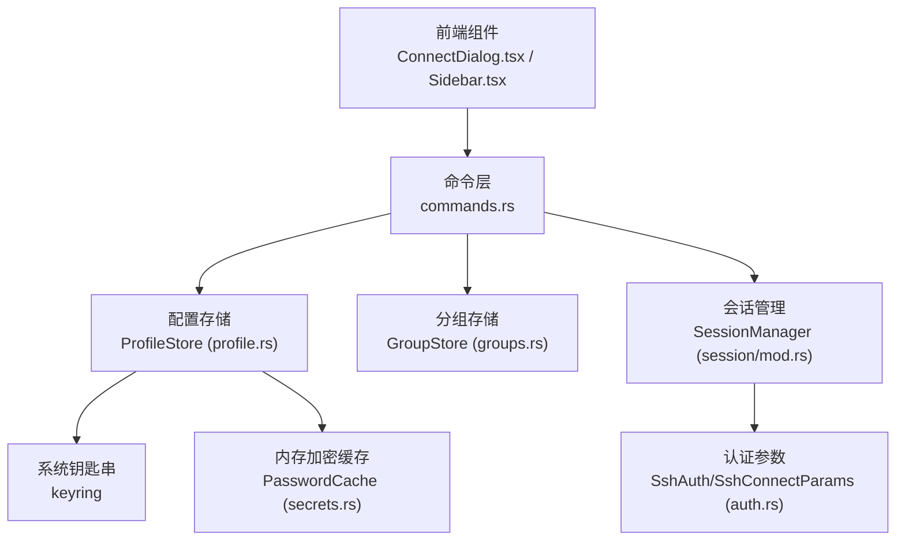
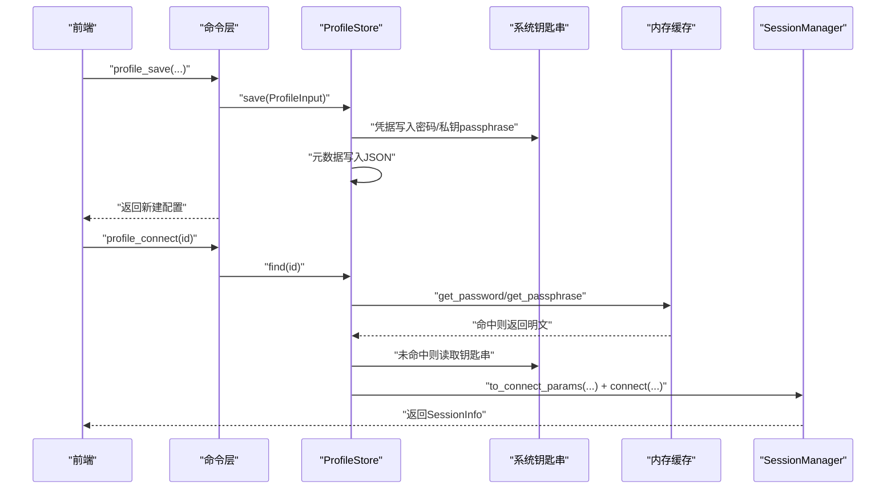
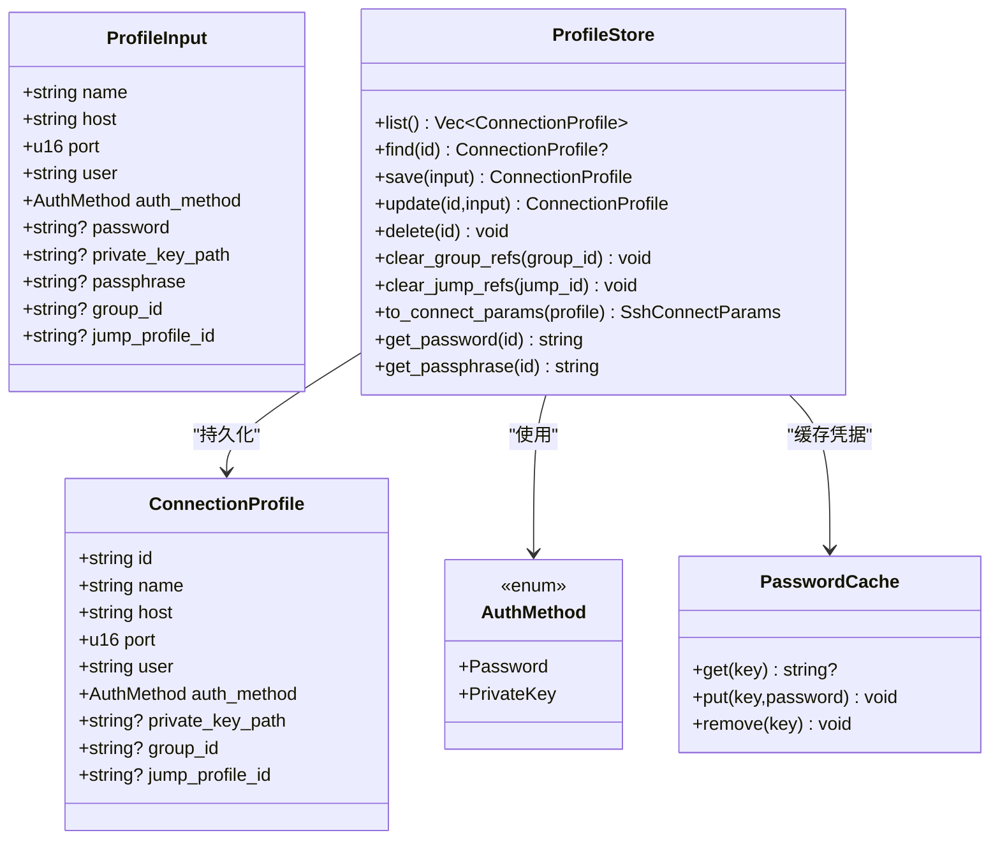
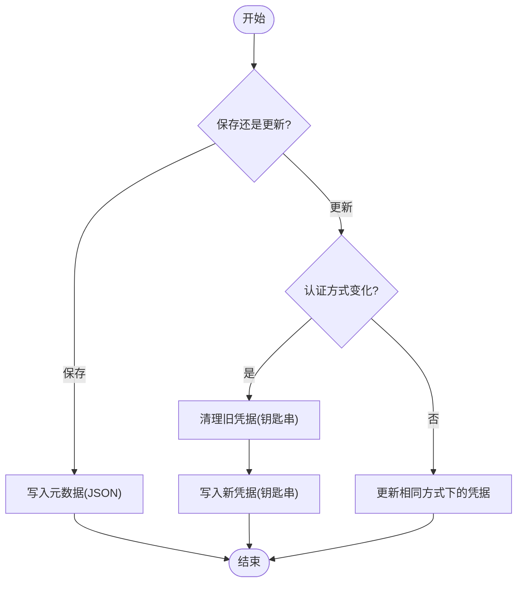
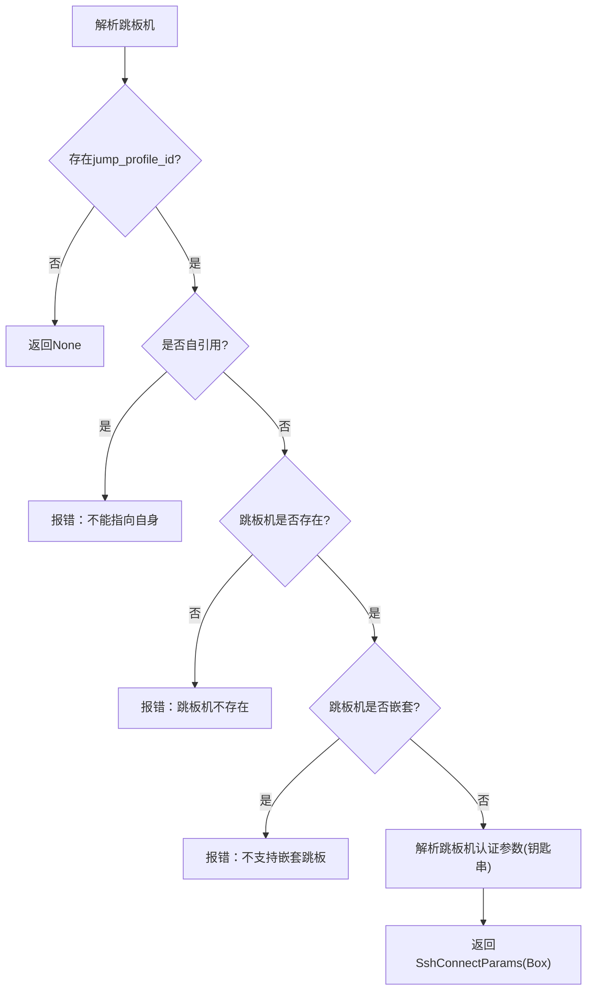
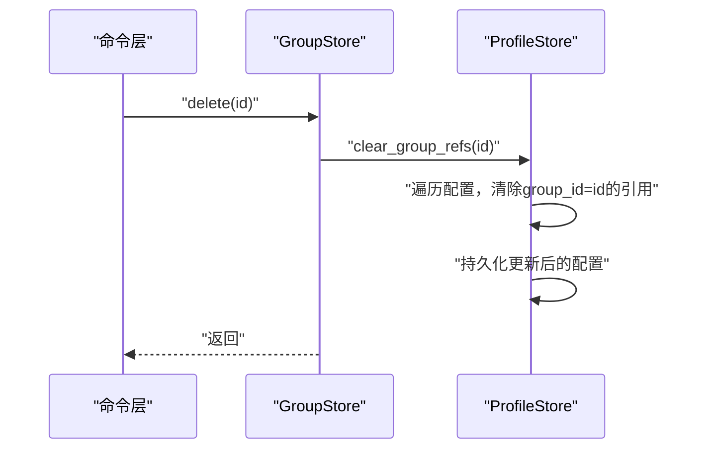
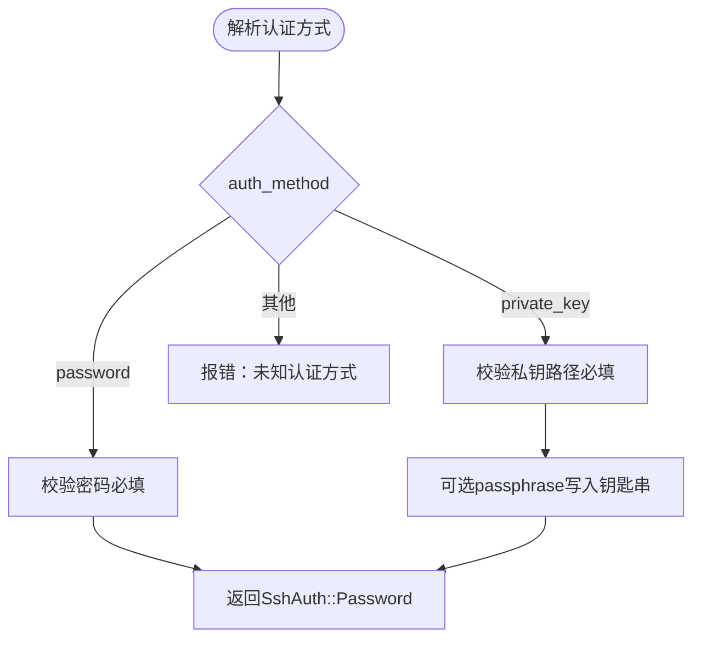
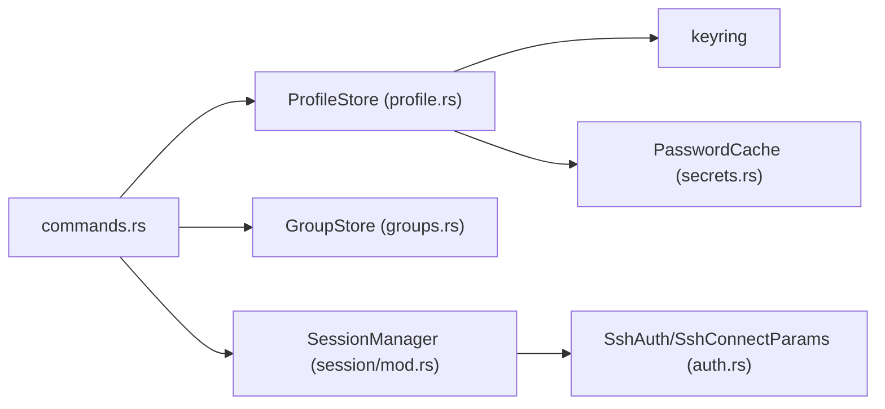

# 连接配置命令

<cite>
**本文档引用的文件**
- [commands.rs](file://src-tauri/src/commands.rs)
- [profile.rs](file://src-tauri/src/session/profile.rs)
- [auth.rs](file://src-tauri/src/session/auth.rs)
- [secrets.rs](file://src-tauri/src/session/secrets.rs)
- [groups.rs](file://src-tauri/src/session/groups.rs)
- [lib.rs](file://src-tauri/src/lib.rs)
- [Cargo.toml](file://src-tauri/Cargo.toml)
- [ConnectDialog.tsx](file://src/components/ConnectDialog.tsx)
- [Sidebar.tsx](file://src/components/Sidebar.tsx)
- [README.md](file://README.md)
</cite>

## 目录
1. [简介](#简介)
2. [项目结构](#项目结构)
3. [核心组件](#核心组件)
4. [架构总览](#架构总览)
5. [详细组件分析](#详细组件分析)
6. [依赖关系分析](#依赖关系分析)
7. [性能考量](#性能考量)
8. [故障排查指南](#故障排查指南)
9. [结论](#结论)
10. [附录](#附录)

## 简介
本文件聚焦于连接配置管理命令，涵盖 profile_list（配置列表）、profile_save（保存配置）、profile_update（更新配置）、profile_delete（删除配置）、profile_connect（直接连接）、profile_select_private_key（私钥选择）等命令。文档详细说明配置数据结构、凭据安全存储（OS 钥匙串 + 内存加密缓存）、跳板机配置解析与分组关联管理，并提供认证方法验证、密码和私钥的安全处理、配置导入导出与迁移支持的实践建议，以及完整的使用示例，帮助用户高效管理复杂连接配置并实现配置模板功能。

## 项目结构
后端采用 Tauri 2 + Rust，命令通过薄封装暴露给前端，核心会话与配置管理位于 session 模块。命令注册在后端入口统一管理，前端通过 Tauri invoke 调用。

图表来源
- [lib.rs:43-89](file://src-tauri/src/lib.rs#L43-L89)
- [commands.rs:516-636](file://src-tauri/src/commands.rs#L516-L636)
- [profile.rs:68-403](file://src-tauri/src/session/profile.rs#L68-L403)
- [groups.rs:19-90](file://src-tauri/src/session/groups.rs#L19-L90)
- [auth.rs:11-42](file://src-tauri/src/session/auth.rs#L11-L42)
- [secrets.rs:38-87](file://src-tauri/src/session/secrets.rs#L38-L87)

章节来源
- [lib.rs:14-92](file://src-tauri/src/lib.rs#L14-L92)
- [Cargo.toml:22-49](file://src-tauri/Cargo.toml#L22-L49)

## 核心组件
- ProfileStore：连接配置的持久化与凭据安全存储，支持列表、保存、更新、删除、跳板机解析与分组引用清理。
- GroupStore：连接分组的持久化与管理，支持列表、创建、重命名、删除。
- PasswordCache：基于 AES-256-GCM 的内存加密缓存，提升重复连接体验并降低钥匙串授权频率。
- SshAuth/SshConnectParams：认证参数与连接参数模型，支持密码与私钥两种认证方式及单跳跳板机。

章节来源
- [profile.rs:68-403](file://src-tauri/src/session/profile.rs#L68-L403)
- [groups.rs:19-90](file://src-tauri/src/session/groups.rs#L19-L90)
- [secrets.rs:38-87](file://src-tauri/src/session/secrets.rs#L38-L87)
- [auth.rs:11-42](file://src-tauri/src/session/auth.rs#L11-L42)

## 架构总览
连接配置命令围绕 ProfileStore 与 GroupStore 展开，命令层负责参数校验、认证方法解析与跳板机解析，最终通过 SessionManager 建立持久会话。

图表来源
- [commands.rs:526-636](file://src-tauri/src/commands.rs#L526-L636)
- [profile.rs:103-128](file://src-tauri/src/session/profile.rs#L103-L128)
- [profile.rs:254-267](file://src-tauri/src/session/profile.rs#L254-L267)
- [profile.rs:317-341](file://src-tauri/src/session/profile.rs#L317-L341)
- [secrets.rs:52-81](file://src-tauri/src/session/secrets.rs#L52-L81)

## 详细组件分析

### 配置数据结构与安全存储
- ConnectionProfile：保存连接的基本信息（名称、主机、端口、用户、认证方式、私钥路径、分组ID、跳板机ID），不包含明文凭据。
- ProfileInput：保存/更新时的输入封装，便于命令层统一处理。
- AuthMethod：认证方式枚举，支持密码与私钥两种。
- 凭据存储策略：
  - 元数据：保存在本地 JSON 文件（profiles.json）。
  - 凭据：保存在系统钥匙串（keyring），不落明文。
  - 内存缓存：24小时有效期的 AES-256-GCM 加密缓存，减少钥匙串访问与授权弹窗。

图表来源
- [profile.rs:48-65](file://src-tauri/src/session/profile.rs#L48-L65)
- [profile.rs:34-45](file://src-tauri/src/session/profile.rs#L34-L45)
- [profile.rs:24-30](file://src-tauri/src/session/profile.rs#L24-L30)
- [profile.rs:68-72](file://src-tauri/src/session/profile.rs#L68-L72)
- [profile.rs:38-41](file://src-tauri/src/session/profile.rs#L38-L41)
- [secrets.rs:38-41](file://src-tauri/src/session/secrets.rs#L38-L41)

章节来源
- [profile.rs:48-128](file://src-tauri/src/session/profile.rs#L48-L128)
- [profile.rs:317-341](file://src-tauri/src/session/profile.rs#L317-L341)
- [secrets.rs:52-81](file://src-tauri/src/session/secrets.rs#L52-L81)

### 凭据安全处理流程
- 保存配置：根据认证方式将密码或私钥passphrase写入系统钥匙串，元数据写入 JSON。
- 更新配置：若认证方式变化，先清理旧凭据，再写入新凭据；若在同一方式下更新密码/私钥passphrase，则仅更新对应凭据。
- 读取凭据：优先从内存缓存命中，未命中则从钥匙串读取并写入缓存。
- 删除配置：从 JSON 移除并清理钥匙串条目，同时清理内存缓存。

图表来源
- [profile.rs:103-128](file://src-tauri/src/session/profile.rs#L103-L128)
- [profile.rs:131-199](file://src-tauri/src/session/profile.rs#L131-L199)
- [profile.rs:317-341](file://src-tauri/src/session/profile.rs#L317-L341)

章节来源
- [profile.rs:103-199](file://src-tauri/src/session/profile.rs#L103-L199)
- [profile.rs:317-341](file://src-tauri/src/session/profile.rs#L317-L341)

### 跳板机配置解析与限制
- 支持单跳 ProxyJump，解析跳板机配置为连接参数。
- 禁止自引用与嵌套跳板：跳板机ID不得等于自身，且跳板机不得再引用其他配置。
- 跳板机认证方式与主配置一致，从钥匙串读取凭据。

图表来源
- [profile.rs:288-314](file://src-tauri/src/session/profile.rs#L288-L314)
- [commands.rs:725-766](file://src-tauri/src/commands.rs#L725-L766)

章节来源
- [profile.rs:288-314](file://src-tauri/src/session/profile.rs#L288-L314)
- [commands.rs:725-766](file://src-tauri/src/commands.rs#L725-L766)

### 分组关联管理
- 分组与配置分离持久化：分组保存在 groups.json，配置保存在 profiles.json。
- 删除分组时，清理所有配置对该分组的引用并持久化。
- 删除配置时，清理内存缓存中对应的凭据密文。

图表来源
- [groups.rs:71-80](file://src-tauri/src/session/groups.rs#L71-L80)
- [profile.rs:222-235](file://src-tauri/src/session/profile.rs#L222-L235)

章节来源
- [groups.rs:71-80](file://src-tauri/src/session/groups.rs#L71-L80)
- [profile.rs:222-235](file://src-tauri/src/session/profile.rs#L222-L235)

### 认证方法验证与参数解析
- 支持的认证方式：password、private_key。
- 参数校验：密码认证必须提供密码；私钥认证必须提供私钥路径；切换认证方式时需满足相应约束。
- 命令层解析认证字符串为枚举，构建 SshAuth。

图表来源
- [commands.rs:690-722](file://src-tauri/src/commands.rs#L690-L722)
- [auth.rs:11-18](file://src-tauri/src/session/auth.rs#L11-L18)

章节来源
- [commands.rs:690-722](file://src-tauri/src/commands.rs#L690-L722)
- [auth.rs:11-18](file://src-tauri/src/session/auth.rs#L11-L18)

### 配置 CRUD 命令详解

#### profile_list（配置列表）
- 功能：列出所有保存的连接配置。
- 数据来源：ProfileStore.list()。
- 输出：ConnectionProfile 数组。

章节来源
- [commands.rs:518-524](file://src-tauri/src/commands.rs#L518-L524)
- [profile.rs:89-91](file://src-tauri/src/session/profile.rs#L89-L91)

#### profile_save（保存配置）
- 功能：保存新的连接配置，凭据写入系统钥匙串，元数据写入 JSON。
- 输入：name、host、port、user、auth_method、password、private_key_path、passphrase、group_id、jump_profile_id。
- 行为：生成 UUID 作为 id，写入凭据，创建 ConnectionProfile，追加到内存列表并持久化。
- 安全：密码与私钥 passphrase 仅写入钥匙串，不落明文。

章节来源
- [commands.rs:529-557](file://src-tauri/src/commands.rs#L529-L557)
- [profile.rs:103-128](file://src-tauri/src/session/profile.rs#L103-L128)
- [profile.rs:353-378](file://src-tauri/src/session/profile.rs#L353-L378)

#### profile_update（更新配置）
- 功能：更新现有配置；密码/私钥passphrase留空则保留原值。
- 行为：定位索引，按认证方式变化或相同方式分别处理，必要时清理旧凭据并写入新凭据，最后持久化更新。
- 限制：私钥认证必须提供私钥路径；跳板机不得自引用或嵌套。

章节来源
- [commands.rs:562-594](file://src-tauri/src/commands.rs#L562-L594)
- [profile.rs:131-199](file://src-tauri/src/session/profile.rs#L131-L199)

#### profile_delete（删除配置）
- 功能：删除配置并清理钥匙串与内存缓存。
- 行为：从内存列表移除，持久化；清理对应凭据；清理内存缓存中密码与私钥passphrase。

章节来源
- [commands.rs:609-615](file://src-tauri/src/commands.rs#L609-L615)
- [profile.rs:202-219](file://src-tauri/src/session/profile.rs#L202-L219)

#### profile_connect（直接连接）
- 功能：使用保存的配置直接连接，从钥匙串读取凭据。
- 步骤：查找配置 → 解析认证与跳板机 → 构造 SshConnectParams → 通过 SessionManager 建立会话。

章节来源
- [commands.rs:618-636](file://src-tauri/src/commands.rs#L618-L636)
- [profile.rs:254-267](file://src-tauri/src/session/profile.rs#L254-L267)

#### profile_select_private_key（私钥选择）
- 功能：弹出本地文件选择框，返回私钥文件绝对路径。
- 用途：在保存/更新配置时选择私钥文件。

章节来源
- [commands.rs:597-605](file://src-tauri/src/commands.rs#L597-L605)

### 分组管理命令
- group_list：列出所有连接分组。
- group_create：新建分组，返回新建分组。
- group_rename：重命名分组。
- group_delete：删除分组，清理组内配置的分组引用。

章节来源
- [commands.rs:641-676](file://src-tauri/src/commands.rs#L641-L676)
- [groups.rs:37-80](file://src-tauri/src/session/groups.rs#L37-L80)

## 依赖关系分析
- 命令层依赖 ProfileStore、GroupStore、SessionManager、HostKeyVerifier 等状态。
- ProfileStore 依赖 keyring 进行凭据存储，依赖 PasswordCache 进行内存缓存。
- 认证参数模型 SshAuth/SshConnectParams 由 auth.rs 提供，供命令层与会话层使用。

图表来源
- [commands.rs:10-21](file://src-tauri/src/commands.rs#L10-L21)
- [profile.rs:16-17](file://src-tauri/src/session/profile.rs#L16-L17)
- [auth.rs:11-29](file://src-tauri/src/session/auth.rs#L11-L29)
- [Cargo.toml:41](file://src-tauri/Cargo.toml#L41)

章节来源
- [commands.rs:10-21](file://src-tauri/src/commands.rs#L10-L21)
- [Cargo.toml:41](file://src-tauri/Cargo.toml#L41)

## 性能考量
- 内存加密缓存：24小时有效期，显著降低钥匙串访问频率，减少系统授权弹窗。
- JSON 持久化：配置与分组均采用 JSON 文件存储，读写简单高效。
- 跳板机解析：仅单跳，避免复杂拓扑带来的解析成本。
- 并发安全：ProfileStore 使用 Mutex 保护内存列表，保证并发安全。

## 故障排查指南
- 未知认证方式：检查 auth_method 是否为 password 或 private_key。
- 密码认证缺少密码：切换为密码认证或更新配置时需提供密码。
- 私钥认证缺少私钥路径：私钥认证必须提供有效私钥路径。
- 跳板机错误：
  - 跳板机不存在：确认跳板机ID正确。
  - 跳板机自引用：跳板机ID不得等于自身。
  - 跳板机嵌套：跳板机不得再引用其他配置。
- 钥匙串权限问题：系统钥匙串授权失败时，检查系统钥匙串权限与凭据是否正确。
- 配置删除后残留：确认已清理钥匙串与内存缓存。

章节来源
- [commands.rs:690-722](file://src-tauri/src/commands.rs#L690-L722)
- [commands.rs:725-766](file://src-tauri/src/commands.rs#L725-L766)
- [profile.rs:140-179](file://src-tauri/src/session/profile.rs#L140-L179)
- [profile.rs:288-314](file://src-tauri/src/session/profile.rs#L288-L314)

## 结论
连接配置管理命令围绕 ProfileStore 与 GroupStore 构建，实现了安全、便捷的配置 CRUD 操作。通过系统钥匙串与内存加密缓存保障凭据安全与用户体验，跳板机单跳解析与分组管理满足复杂场景需求。命令层提供清晰的参数校验与错误反馈，便于前端集成与用户操作。

## 附录

### 使用示例与最佳实践
- 创建配置模板：
  - 使用 profile_save 保存常用配置，设置合理的 group_id 以便分类管理。
  - 对于多环境相似配置，先保存基础模板，再通过 profile_update 快速调整差异字段。
- 管理复杂连接：
  - 使用跳板机功能时，确保跳板机为单跳且不可自引用。
  - 将跳板机与目标主机分别保存，便于复用与维护。
- 安全与合规：
  - 私钥认证务必提供私钥路径与可选 passphrase，passphrase 写入钥匙串。
  - 定期清理不再使用的配置与分组，避免凭据冗余。
- 导入导出与迁移：
  - profiles.json 与 groups.json 为可移植的配置文件，可在不同设备间复制迁移。
  - 迁移前备份当前配置，确认目标系统钥匙串可用，再进行导入。
  - 若更换认证方式，更新配置时需重新提供相应凭据。

章节来源
- [profile.rs:103-128](file://src-tauri/src/session/profile.rs#L103-L128)
- [profile.rs:131-199](file://src-tauri/src/session/profile.rs#L131-L199)
- [groups.rs:37-80](file://src-tauri/src/session/groups.rs#L37-L80)
- [README.md:29-40](file://README.md#L29-L40)