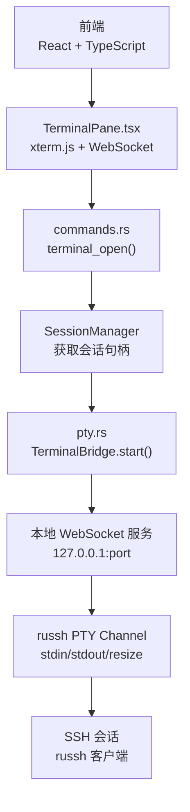
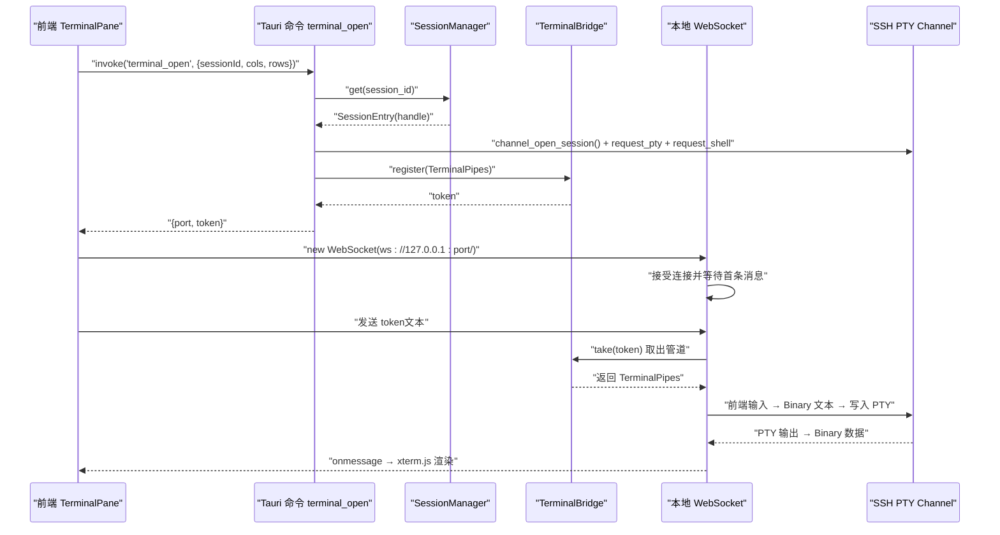
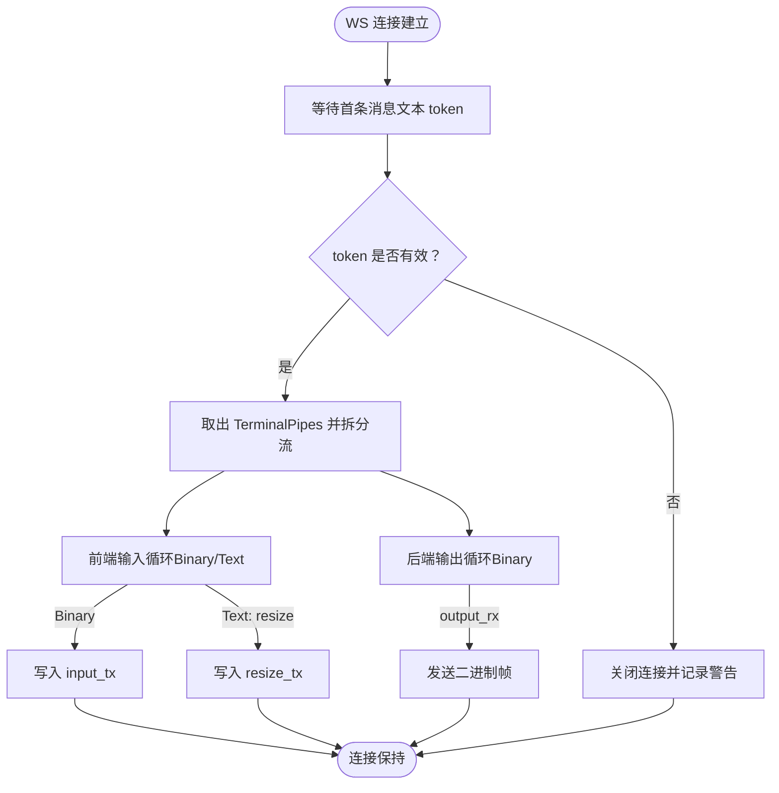
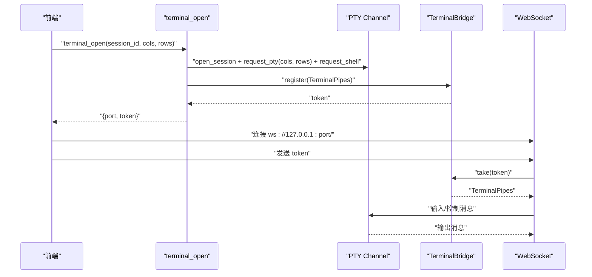
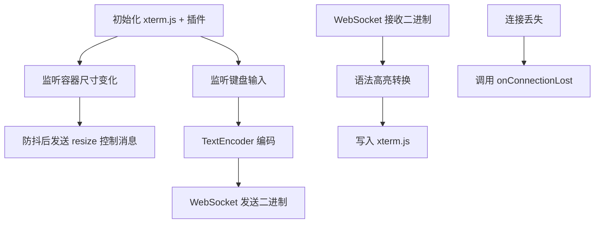
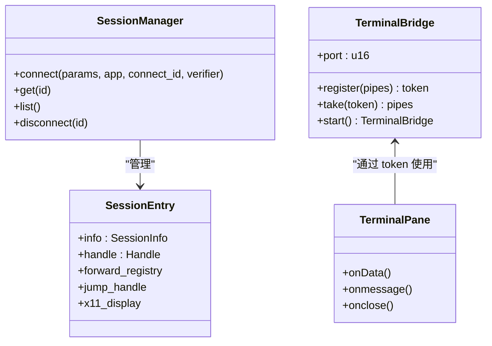
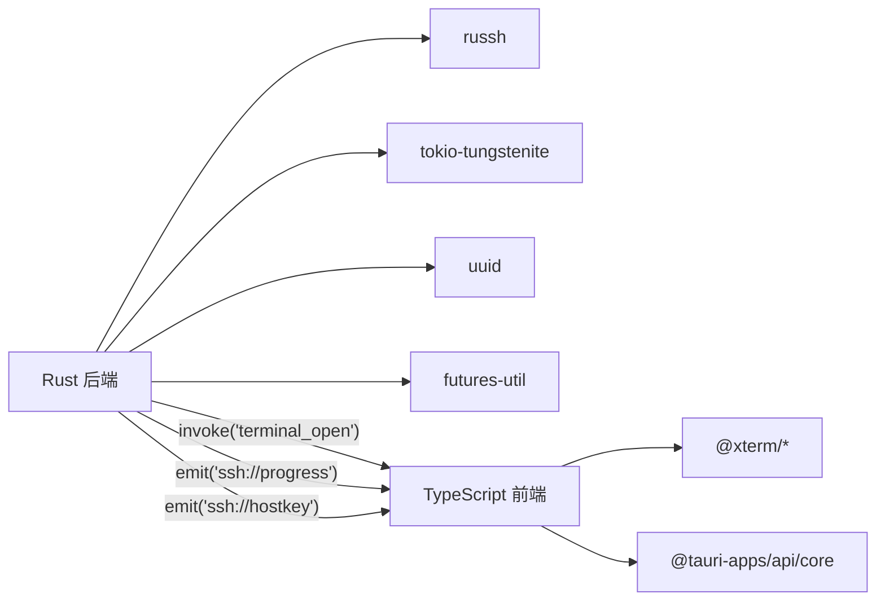

# WebSocket 通信协议

<cite>
**本文档引用的文件**
- [src-tauri/src/session/pty.rs](file://src-tauri/src/session/pty.rs)
- [src-tauri/src/commands.rs](file://src-tauri/src/commands.rs)
- [src-tauri/src/lib.rs](file://src-tauri/src/lib.rs)
- [src/components/TerminalPane.tsx](file://src/components/TerminalPane.tsx)
- [src/App.tsx](file://src/App.tsx)
- [src/types.ts](file://src/types.ts)
- [src-tauri/src/session/manager.rs](file://src-tauri/src/session/manager.rs)
- [src-tauri/src/session/mod.rs](file://src-tauri/src/session/mod.rs)
- [src-tauri/Cargo.toml](file://src-tauri/Cargo.toml)
</cite>

## 目录
1. [简介](#简介)
2. [项目结构](#项目结构)
3. [核心组件](#核心组件)
4. [架构总览](#架构总览)
5. [详细组件分析](#详细组件分析)
6. [依赖关系分析](#依赖关系分析)
7. [性能考量](#性能考量)
8. [故障排查指南](#故障排查指南)
9. [结论](#结论)
10. [附录](#附录)

## 简介
本文件系统化地文档化了基于 WebSocket 的终端实时通信协议，涵盖从前端到后端的完整链路：会话建立、PTYSHELL 通道、本地 WebSocket 终端桥接、数据帧格式、消息类型与事件处理、连接参数（本地端口、一次性 token）、心跳与保活策略、连接管理与重连机制。同时阐明 WebSocket 与 SSH 会话的关系，以及如何通过 WebSocket 实现终端交互与实时数据传输。

## 项目结构
该应用采用 Rust + Tauri 架构，前端使用 React + TypeScript，后端使用 Tokio 异步运行时与 russh SSH 客户端库。WebSocket 终端桥接位于后端，作为本地服务暴露于 127.0.0.1，前端通过本地 WebSocket 连接进行交互。

图表来源
- [src/components/TerminalPane.tsx:103-135](file://src/components/TerminalPane.tsx#L103-L135)
- [src-tauri/src/commands.rs:106-186](file://src-tauri/src/commands.rs#L106-L186)
- [src-tauri/src/session/pty.rs:48-73](file://src-tauri/src/session/pty.rs#L48-L73)
- [src-tauri/src/session/manager.rs:219-232](file://src-tauri/src/session/manager.rs#L219-L232)

章节来源
- [src-tauri/src/lib.rs:34-42](file://src-tauri/src/lib.rs#L34-L42)
- [src-tauri/src/session/pty.rs:48-73](file://src-tauri/src/session/pty.rs#L48-L73)

## 核心组件
- 终端桥接 TerminalBridge：在本地 127.0.0.1 启动随机端口的 WebSocket 服务，负责接收前端连接、校验一次性 token，并将 mpsc 管道与 WebSocket 流对接。
- 终端命令 terminal_open：在指定 SSH 会话上打开 PTY 通道，创建输入/输出/尺寸变更三类 mpsc 管道，注册 token 并返回给前端。
- 前端 TerminalPane：初始化 xterm.js，监听键盘输入与窗口尺寸变化，通过 WebSocket 与后端桥接通信。
- 会话管理 SessionManager：维护持久 SSH 会话，供终端、SFTP、端口转发共享复用。

章节来源
- [src-tauri/src/session/pty.rs:41-86](file://src-tauri/src/session/pty.rs#L41-L86)
- [src-tauri/src/commands.rs:106-186](file://src-tauri/src/commands.rs#L106-L186)
- [src/components/TerminalPane.tsx:23-149](file://src/components/TerminalPane.tsx#L23-L149)
- [src-tauri/src/session/manager.rs:76-80](file://src-tauri/src/session/manager.rs#L76-L80)

## 架构总览
WebSocket 终端通信链路由“前端 → Tauri 命令 → 会话管理 → PTY 通道 → 本地 WebSocket → 前端”构成。后端在应用启动时即启动 TerminalBridge，分配本地端口；前端通过 terminal_open 获取端口与一次性 token，随后建立 WebSocket 连接。

图表来源
- [src-tauri/src/commands.rs:106-186](file://src-tauri/src/commands.rs#L106-L186)
- [src-tauri/src/session/pty.rs:87-141](file://src-tauri/src/session/pty.rs#L87-L141)
- [src/components/TerminalPane.tsx:103-135](file://src/components/TerminalPane.tsx#L103-L135)

## 详细组件分析

### 终端桥接 TerminalBridge
- 本地服务：绑定 127.0.0.1:0（随机端口），启动 accept 循环。
- 连接处理：接受 TCP 连接后升级为 WebSocket，要求第一条消息为一次性 token（文本）。
- 管道映射：根据 token 查找并取出 TerminalPipes，将输入/输出/尺寸变更三类通道与 WebSocket 流对接。
- 数据帧格式：
  - 前端输入：WebSocket 二进制帧（字节流）。
  - 前端控制：WebSocket 文本帧（JSON），字段 type=resize 时携带 cols/rows。
  - 后端输出：WebSocket 二进制帧（字节流）。
- 生命周期：token 一次性使用，取出后立即移除；连接关闭时结束任务。

图表来源
- [src-tauri/src/session/pty.rs:87-141](file://src-tauri/src/session/pty.rs#L87-L141)

章节来源
- [src-tauri/src/session/pty.rs:41-86](file://src-tauri/src/session/pty.rs#L41-L86)
- [src-tauri/src/session/pty.rs:87-141](file://src-tauri/src/session/pty.rs#L87-L141)

### 终端命令 terminal_open
- 功能：在指定会话上打开 PTY 通道，设置初始窗口尺寸，创建三类 mpsc 管道，注册 token 并返回给前端。
- 管道职责：
  - input_tx：前端输入（键盘）→ 后端 PTY。
  - output_rx：后端 PTY → 前端输出（屏幕渲染）。
  - resize_tx：前端窗口尺寸变化 → 后端 PTY 调整窗口大小。
- 通道桥接：启动异步任务，循环处理 input/resize 与 PTY 消息，将数据在 mpsc 与 PTY 之间转发。

图表来源
- [src-tauri/src/commands.rs:106-186](file://src-tauri/src/commands.rs#L106-L186)
- [src-tauri/src/session/pty.rs:75-86](file://src-tauri/src/session/pty.rs#L75-L86)

章节来源
- [src-tauri/src/commands.rs:106-186](file://src-tauri/src/commands.rs#L106-L186)

### 前端 TerminalPane
- 初始化：创建 xterm.js 实例，加载 Fit/WebGL 插件，监听容器尺寸变化并发送 resize 控制消息。
- 输入处理：捕获键盘输入，编码后通过 WebSocket 发送（二进制）。
- 输出处理：接收二进制帧，进行语法高亮转换后写入终端。
- 连接生命周期：连接丢失时回调 onConnectionLost，交由上层逻辑决定是否重连。

图表来源
- [src/components/TerminalPane.tsx:38-149](file://src/components/TerminalPane.tsx#L38-L149)

章节来源
- [src/components/TerminalPane.tsx:23-149](file://src/components/TerminalPane.tsx#L23-L149)

### 会话管理与 SSH 关系
- SessionManager：维护持久 SSH 会话，供终端、SFTP、端口转发共享复用。
- PTY 通道：在已有会话上打开 PTY，复用底层 SSH 连接，避免重复握手与认证。
- X11 转发：可选开启，通过 request_x11 请求与本地 DISPLAY 桥接。

图表来源
- [src-tauri/src/session/manager.rs:76-80](file://src-tauri/src/session/manager.rs#L76-L80)
- [src-tauri/src/session/pty.rs:41-45](file://src-tauri/src/session/pty.rs#L41-L45)
- [src/components/TerminalPane.tsx:23-149](file://src/components/TerminalPane.tsx#L23-L149)

章节来源
- [src-tauri/src/session/manager.rs:76-80](file://src-tauri/src/session/manager.rs#L76-L80)
- [src-tauri/src/session/mod.rs:31-39](file://src-tauri/src/session/mod.rs#L31-L39)

## 依赖关系分析
- 后端依赖：russh（SSH 客户端）、tokio-tungstenite（WebSocket）、uuid（一次性 token）、futures-util（流组合）。
- 前端依赖：@xterm/xterm、@xterm/addon-fit、@xterm/addon-webgl。
- 关键外部接口：Tauri invoke（terminal_open）、事件系统（ssh://progress、ssh://hostkey）。

图表来源
- [src-tauri/Cargo.toml:22-49](file://src-tauri/Cargo.toml#L22-L49)
- [src/components/TerminalPane.tsx:5-10](file://src/components/TerminalPane.tsx#L5-L10)
- [src-tauri/src/session/manager.rs:39-48](file://src-tauri/src/session/manager.rs#L39-L48)

章节来源
- [src-tauri/Cargo.toml:22-49](file://src-tauri/Cargo.toml#L22-L49)
- [src/types.ts:107-116](file://src/types.ts#L107-L116)

## 性能考量
- 流量控制：后端使用 mpsc 通道缓冲，避免阻塞 PTY 读写；前端对 resize 事件进行防抖，减少控制消息洪泛。
- 传输效率：输出使用二进制帧，降低序列化开销；输入支持文本与二进制混合，便于兼容不同场景。
- 连接复用：TerminalBridge 与 SessionManager 共享底层 SSH 连接，减少握手成本。

## 故障排查指南
- 连接参数
  - 本地端口：由后端启动时分配（127.0.0.1:0），通过 terminal_open 返回给前端。
  - 一次性 token：首次连接必须发送文本帧，否则连接被关闭。
- 常见问题
  - token 错误：前端未发送首条消息或 token 无效，后端记录警告并关闭连接。
  - 输出异常：确保后端 PTY 通道处于活跃状态，前端 onmessage 正常接收二进制帧。
  - 尺寸不生效：前端需在 fitAndResize 后发送 resize 控制消息，且 cols/rows 必须大于 0。
- 重连机制
  - 前端：TerminalPane 在 onclose 触发回调，上层 App 根据配置与状态判断是否自动重连。
  - 上层策略：App.tsx 维护 reconnectingRef、sessionProfileRef、intentionalDisconnectRef，避免重复重连与误触。

章节来源
- [src-tauri/src/session/pty.rs:91-95](file://src-tauri/src/session/pty.rs#L91-L95)
- [src-tauri/src/session/pty.rs:113-122](file://src-tauri/src/session/pty.rs#L113-L122)
- [src/components/TerminalPane.tsx:128-130](file://src/components/TerminalPane.tsx#L128-L130)
- [src/App.tsx:390-408](file://src/App.tsx#L390-L408)

## 结论
该 WebSocket 通信协议通过 TerminalBridge 将 SSH PTY 通道与前端 xterm.js 无缝衔接，采用一次性 token 与本地 WebSocket 实现安全高效的实时交互。配合会话管理与事件系统，既满足终端交互需求，又具备良好的扩展性与可维护性。

## 附录

### 数据帧格式与消息类型
- 帧类型
  - 二进制帧：用于传输 PTY 输出与前端输入。
  - 文本帧：用于控制消息，如窗口尺寸调整。
- 控制消息
  - {"type":"resize","cols":N,"rows":M}：前端发送，后端调用 PTY window_change。

章节来源
- [src-tauri/src/session/pty.rs:22-29](file://src-tauri/src/session/pty.rs#L22-L29)
- [src-tauri/src/session/pty.rs:113-122](file://src-tauri/src/session/pty.rs#L113-L122)

### 连接参数与事件
- 连接参数
  - 本地端口：由 TerminalBridge.start() 返回。
  - 一次性 token：通过 terminal_open 返回。
- 事件
  - ssh://progress：连接进度事件（resolve/handshake/auth/jump/ready）。
  - ssh://hostkey：主机公钥校验事件，前端确认后调用 hostkey_trust/hostkey_reject。

章节来源
- [src-tauri/src/lib.rs:34-42](file://src-tauri/src/lib.rs#L34-L42)
- [src-tauri/src/commands.rs:106-186](file://src-tauri/src/commands.rs#L106-L186)
- [src-tauri/src/session/manager.rs:31-48](file://src-tauri/src/session/manager.rs#L31-L48)
- [src/types.ts:107-116](file://src/types.ts#L107-L116)

### 心跳与保活
- 当前实现未显式内置心跳/pong 机制；建议前端在空闲时发送轻量控制帧以维持连接活跃。
- 若网络环境存在中间设备（如代理/防火墙）超时，可在前端增加定时 ping 逻辑。

### 协议版本兼容性
- 本协议基于后端 TerminalBridge 的实现，前端需遵循“首条消息 token + 后续二进制/文本帧”的约定。
- 版本演进建议：在 token 前添加版本号字段，以便未来扩展控制消息格式。