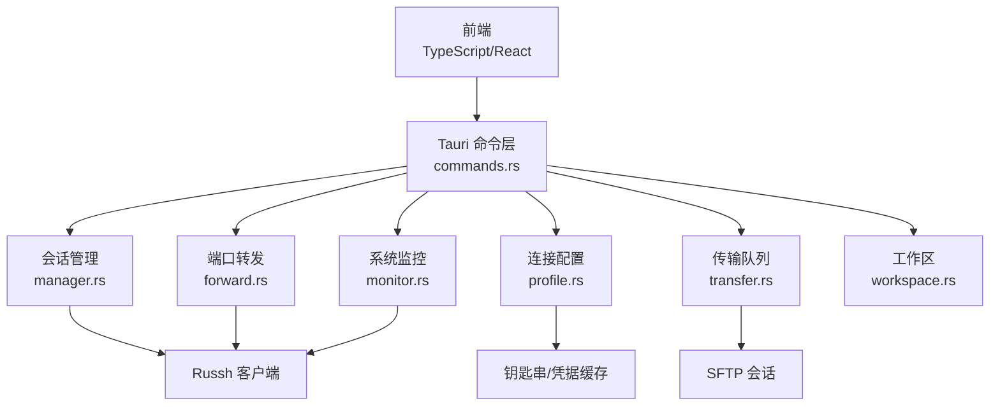
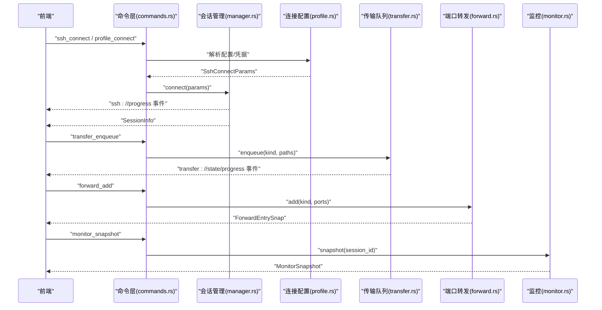
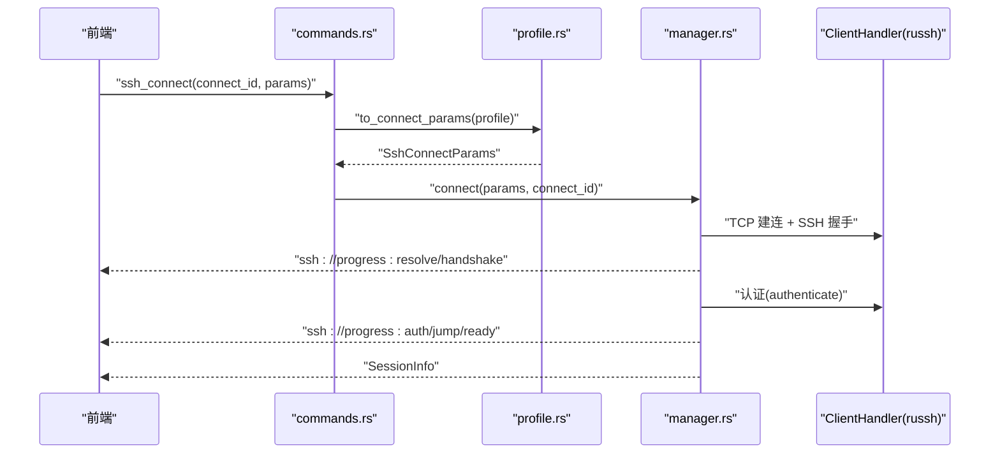
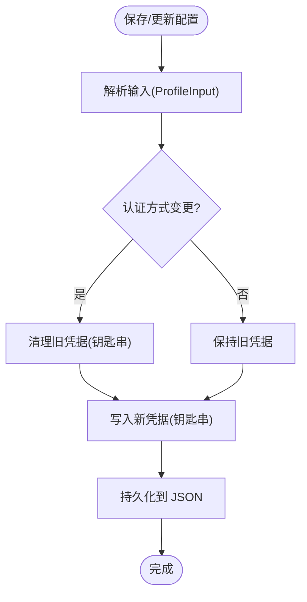
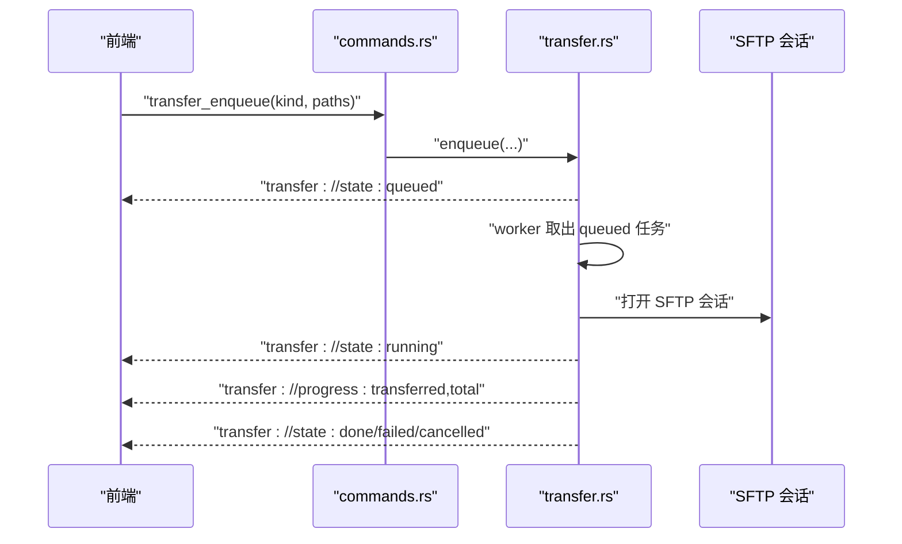
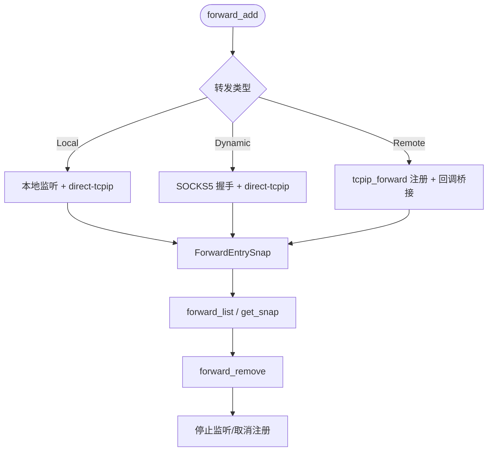
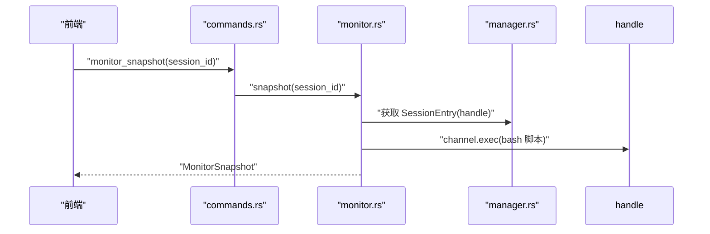
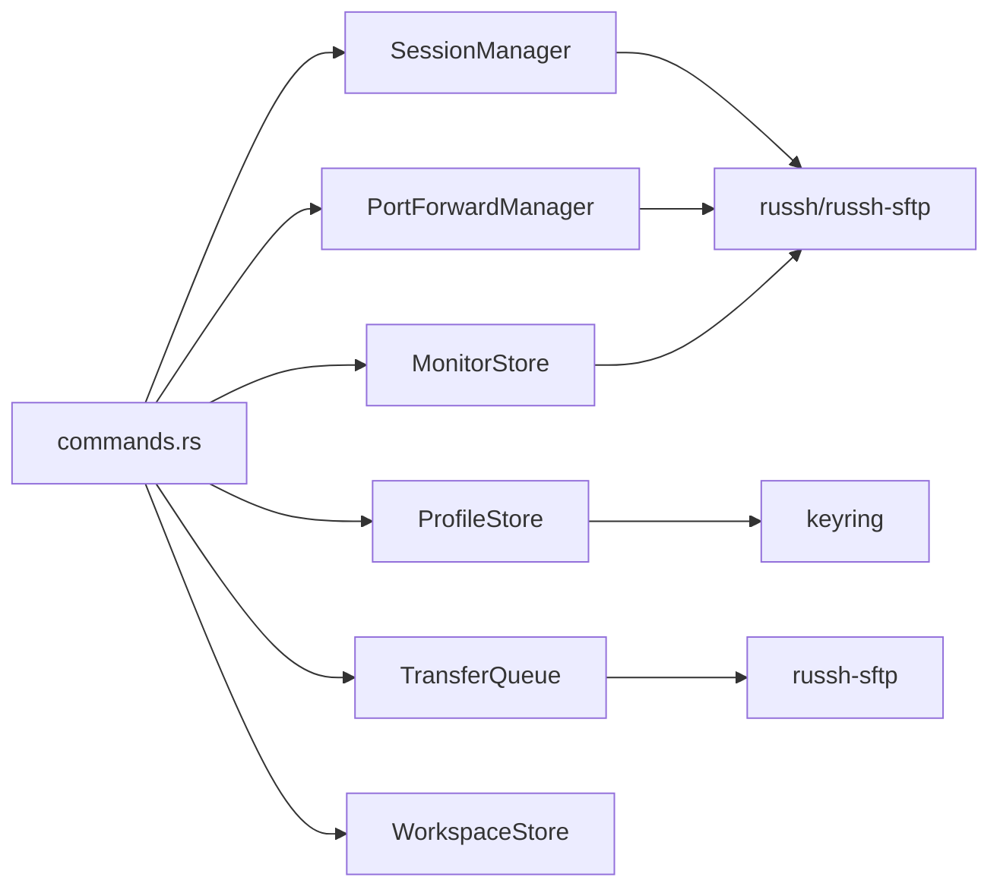

# 数据模型与类型定义

<cite>
**本文档引用的文件**
- [src/types.ts](file://src/types.ts)
- [src/settings/types.ts](file://src/settings/types.ts)
- [src-tauri/src/session/mod.rs](file://src-tauri/src/session/mod.rs)
- [src-tauri/src/session/manager.rs](file://src-tauri/src/session/manager.rs)
- [src-tauri/src/session/profile.rs](file://src-tauri/src/session/profile.rs)
- [src-tauri/src/session/transfer.rs](file://src-tauri/src/session/transfer.rs)
- [src-tauri/src/session/monitor.rs](file://src-tauri/src/session/monitor.rs)
- [src-tauri/src/session/forward.rs](file://src-tauri/src/session/forward.rs)
- [src-tauri/src/session/auth.rs](file://src-tauri/src/session/auth.rs)
- [src-tauri/src/commands.rs](file://src-tauri/src/commands.rs)
- [src-tauri/src/session/sync.rs](file://src-tauri/src/session/sync.rs)
- [src-tauri/src/session/workspace.rs](file://src-tauri/src/session/workspace.rs)
- [src-tauri/Cargo.toml](file://src-tauri/Cargo.toml)
</cite>

## 目录
1. [简介](#简介)
2. [项目结构](#项目结构)
3. [核心组件](#核心组件)
4. [架构总览](#架构总览)
5. [详细组件分析](#详细组件分析)
6. [依赖分析](#依赖分析)
7. [性能考虑](#性能考虑)
8. [故障排查指南](#故障排查指南)
9. [结论](#结论)
10. [附录](#附录)

## 简介
本文件系统性梳理简化版 SSH 客户端项目中的数据模型与类型定义，重点覆盖以下关键类型：
- SessionInfo：会话元数据
- ConnectionProfile：连接配置
- FileEntry：SFTP 文件条目
- TransferTask/TransferTaskSnap：传输任务及其快照
- ForwardEntry/ForwardEntrySnap：端口转发条目及其快照
- MonitorSnapshot：远程系统监控快照

同时说明 TypeScript 接口与 Rust 结构体的对应关系、序列化格式、默认值与约束、数据流转与状态转换，并给出错误处理模式与模块间依赖关系。

## 项目结构
前端与后端采用 TypeScript + Tauri + Rust 的分层架构：
- 前端负责 UI、工作区持久化、对话框与交互
- 后端（Rust）通过 Tauri 暴露命令，管理会话、SFTP、传输队列、端口转发、监控与工作区等

图表来源
- [src-tauri/src/commands.rs:1-996](file://src-tauri/src/commands.rs#L1-L996)
- [src-tauri/src/session/manager.rs:1-317](file://src-tauri/src/session/manager.rs#L1-L317)
- [src-tauri/src/session/profile.rs:1-419](file://src-tauri/src/session/profile.rs#L1-L419)
- [src-tauri/src/session/transfer.rs:1-483](file://src-tauri/src/session/transfer.rs#L1-L483)
- [src-tauri/src/session/forward.rs:1-295](file://src-tauri/src/session/forward.rs#L1-L295)
- [src-tauri/src/session/monitor.rs:1-231](file://src-tauri/src/session/monitor.rs#L1-L231)
- [src-tauri/src/session/workspace.rs:1-82](file://src-tauri/src/session/workspace.rs#L1-L82)

章节来源
- [src-tauri/src/lib.rs:1-93](file://src-tauri/src/lib.rs#L1-L93)
- [src-tauri/Cargo.toml:1-50](file://src-tauri/Cargo.toml#L1-L50)

## 核心组件
本节对关键数据模型进行逐项说明，包括字段定义、数据类型、约束、默认值、序列化格式与业务含义。

- SessionInfo（会话元数据）
  - 字段与类型
    - id: 字符串（UUID）
    - host: 字符串
    - port: 整数（u16）
    - user: 字符串
    - created_at: 字符串（RFC3339 时间）
    - jump_via?: 字符串（可选，格式为 host:port，表示经跳板机连接时的上游主机）
  - 约束与默认值
    - created_at 由后端在建立会话时填充
    - jump_via 默认为空，当经跳板机连接时填充
  - 序列化格式
    - Rust 使用 serde::Serialize 输出 camelCase 字段名
    - 前端 TypeScript 类型与后端保持一致（字段名 snake_case）
  - 业务含义
    - 标识一次持久会话的元信息，便于 UI 展示与日志追踪

- ConnectionProfile（连接配置）
  - 字段与类型
    - id: 字符串（UUID）
    - name: 字符串
    - host: 字符串
    - port: 整数（u16）
    - user: 字符串
    - auth_method?: 枚举（password/private_key，默认 password）
    - private_key_path?: 字符串（可选）
    - group_id?: 字符串（可选，分组引用）
    - jump_profile_id?: 字符串（可选，跳板机配置 ID，单跳，不可自引用）
  - 约束与默认值
    - auth_method 默认为 password
    - jump_profile_id 自引用与嵌套跳板均不允许
    - 私钥认证时必须提供私钥路径
  - 序列化格式
    - Rust 使用 serde JSON，枚举以 snake_case 序列化
    - 前端 TypeScript 类型与后端字段名保持一致
  - 业务含义
    - 保存的连接模板，配合钥匙串安全存储凭据

- FileEntry（SFTP 文件条目）
  - 字段与类型
    - name: 字符串
    - is_dir: 布尔
    - is_symlink: 布尔
    - size: 整数（字节）
    - modified: 字符串（可选，修改时间）
  - 约束与默认值
    - modified 可能为空（如权限不足）
  - 序列化格式
    - 前端 TypeScript 与后端一致
  - 业务含义
    - 目录浏览与文件操作的基础数据结构

- TransferTask/TransferTaskSnap（传输任务与快照）
  - 字段与类型
    - TransferTask（后端）
      - id: 字符串（UUID）
      - session_id: 字符串
      - kind: 枚举（upload/uploadDir/download）
      - name: 字符串
      - total: 原子整数（字节）
      - transferred: 原子整数（字节）
      - status: 状态枚举（queued/running/done/failed/cancelled）
      - error: 字符串（可选）
    - TransferTaskSnap（快照，用于前端轮询）
      - id, session_id, kind, name, total, transferred, status, error
  - 约束与默认值
    - total 由任务开始时计算（单文件可精确，目录为 0）
    - status 默认 queued
    - error 仅在 failed 时携带
  - 序列化格式
    - Rust 使用 serde::Serialize 输出 camelCase
    - 前端 TypeScript 类型与后端字段名保持一致
  - 业务含义
    - 串行传输队列的任务实体，支持取消与进度推送

- ForwardEntry/ForwardEntrySnap（端口转发条目与快照）
  - 字段与类型
    - ForwardEntry（后端）
      - id: 字符串（UUID）
      - session_id: 字符串
      - kind: 枚举（local/remote/dynamic）
      - local_addr: 字符串
      - local_port: 整数（u16）
      - remote_host: 字符串（可选）
      - remote_port: 整数（u16，可选）
      - bound_port: 整数（u16，实际绑定端口）
      - state: 状态枚举（Starting/Active/Failed/Stopped）
    - ForwardEntrySnap（快照）
      - id, session_id, kind, local_addr, local_port, remote_host, remote_port, bound_port, state
  - 约束与默认值
    - local/remote/dynamic 三类转发的参数要求不同
    - bound_port 由监听端口或服务器绑定决定
  - 序列化格式
    - Rust 使用 serde::Serialize 输出 camelCase
    - 前端 TypeScript 类型与后端字段名保持一致
  - 业务含义
    - 管理本地/动态/远程三种转发，支持启动、停止与状态查询

- MonitorSnapshot（远程系统监控快照）
  - 字段与类型
    - cpu_percent: 浮点数（百分比）
    - mem_total_bytes/mem_used_bytes/mem_avail_bytes: 整数（字节）
    - load_1/load_5/load_15: 浮点数
    - uptime_secs: 整数（秒）
    - disks: 数组（DiskUsage）
  - 约束与默认值
    - 仅在 Linux 系统上有效；非 Linux 返回友好错误
    - CPU 百分比基于两次 /proc/stat 差分计算
  - 序列化格式
    - Rust 使用 serde::Serialize 输出 camelCase
    - 前端 TypeScript 类型与后端字段名保持一致
  - 业务含义
    - 提供轻量级远程资源使用情况，便于运维与诊断

章节来源
- [src/types.ts:1-209](file://src/types.ts#L1-L209)
- [src-tauri/src/session/manager.rs:64-74](file://src-tauri/src/session/manager.rs#L64-L74)
- [src-tauri/src/session/profile.rs:48-65](file://src-tauri/src/session/profile.rs#L48-L65)
- [src-tauri/src/session/transfer.rs:72-95](file://src-tauri/src/session/transfer.rs#L72-L95)
- [src-tauri/src/session/forward.rs:74-99](file://src-tauri/src/session/forward.rs#L74-L99)
- [src-tauri/src/session/monitor.rs:20-31](file://src-tauri/src/session/monitor.rs#L20-L31)

## 架构总览
下图展示从前端到后端的关键数据流与事件：

图表来源
- [src-tauri/src/commands.rs:44-95](file://src-tauri/src/commands.rs#L44-L95)
- [src-tauri/src/session/transfer.rs:128-203](file://src-tauri/src/session/transfer.rs#L128-L203)
- [src-tauri/src/session/forward.rs:123-191](file://src-tauri/src/session/forward.rs#L123-L191)
- [src-tauri/src/session/monitor.rs:46-79](file://src-tauri/src/session/monitor.rs#L46-L79)

## 详细组件分析

### 会话与认证（SessionInfo 与 SshConnectParams/SshAuth）
- SessionInfo
  - 由 SessionManager 在建立会话后生成，包含连接元信息与创建时间
  - jump_via 仅在经跳板机连接时填充
- SshConnectParams/SshAuth
  - SshConnectParams 描述一次连接所需的主机、端口、用户、认证方式与可选跳板
  - SshAuth 支持密码与私钥两种认证；私钥可选 passphrase
- 连接流程要点
  - 前端调用 ssh_connect，后端解析 ProfileInput 为 SshConnectParams
  - 建连过程分阶段推送 ssh://progress 事件，包含 resolve/handshake/auth/jump/ready 等阶段
  - 认证超时与失败均有明确错误提示

图表来源
- [src-tauri/src/commands.rs:44-72](file://src-tauri/src/commands.rs#L44-L72)
- [src-tauri/src/session/profile.rs:254-267](file://src-tauri/src/session/profile.rs#L254-L267)
- [src-tauri/src/session/manager.rs:85-145](file://src-tauri/src/session/manager.rs#L85-L145)
- [src-tauri/src/session/auth.rs:44-81](file://src-tauri/src/session/auth.rs#L44-L81)

章节来源
- [src-tauri/src/session/manager.rs:31-48](file://src-tauri/src/session/manager.rs#L31-L48)
- [src-tauri/src/session/auth.rs:10-82](file://src-tauri/src/session/auth.rs#L10-L82)
- [src-tauri/src/session/profile.rs:21-65](file://src-tauri/src/session/profile.rs#L21-L65)

### 连接配置（ConnectionProfile 与 ProfileStore）
- ProfileStore
  - 负责连接配置的增删改查、凭据安全存储（钥匙串）、内存缓存与 JSON 文件持久化
  - 支持跳板机引用，禁止自引用与嵌套跳板
- 凭据安全
  - 密码与私钥 passphrase 写入 OS 钥匙串，不落明文
  - 内存缓存 24 小时有效期，减少系统授权弹窗
- 更新策略
  - 切换认证方式时清理旧凭据并写入新凭据
  - 留空密码/私钥 passphrase 表示保留旧值

图表来源
- [src-tauri/src/session/profile.rs:103-199](file://src-tauri/src/session/profile.rs#L103-L199)

章节来源
- [src-tauri/src/session/profile.rs:67-419](file://src-tauri/src/session/profile.rs#L67-L419)

### 传输队列（TransferTask/TransferTaskSnap）
- 设计目标
  - 串行执行，避免并发争用；支持取消；进度通过事件推送
- 关键字段
  - total/transferred 使用原子类型，确保并发安全
  - status 使用标准互斥保护，序列化时输出字符串状态
- 执行流程
  - enqueue 入队并通知 worker
  - worker 取出第一个 queued 任务，标记为 running，执行后根据结果设置 done/failed/cancelled
  - 进度事件 transfer://progress 与状态事件 transfer://state 持续推送

图表来源
- [src-tauri/src/commands.rs:365-406](file://src-tauri/src/commands.rs#L365-L406)
- [src-tauri/src/session/transfer.rs:128-203](file://src-tauri/src/session/transfer.rs#L128-L203)

章节来源
- [src-tauri/src/session/transfer.rs:72-126](file://src-tauri/src/session/transfer.rs#L72-L126)

### 端口转发（ForwardEntry/ForwardEntrySnap）
- 三种转发
  - -L 本地转发：本地监听，每个连接在 SSH 上开 direct-tcpip
  - -D 动态转发：SOCKS5 握手后建立 direct-tcpip
  - -R 远程转发：服务器端口绑定，回调桥接到本地目标
- 注册表
  - ForwardRegistry 保存服务器远端地址到本地目标的映射
- 生命周期
  - add 创建监听/注册，返回 ForwardEntrySnap
  - remove 停止并移除；-R 额外通知服务器取消绑定

图表来源
- [src-tauri/src/commands.rs:438-514](file://src-tauri/src/commands.rs#L438-L514)
- [src-tauri/src/session/forward.rs:123-229](file://src-tauri/src/session/forward.rs#L123-L229)

章节来源
- [src-tauri/src/session/forward.rs:74-122](file://src-tauri/src/session/forward.rs#L74-L122)

### 系统监控（MonitorSnapshot）
- 采集范围
  - 负载、内存、CPU 百分比、运行时长、磁盘分区使用情况
- 实现细节
  - 在会话上执行 bash 脚本，解析 /proc 下指标
  - CPU 百分比基于两次采样差分计算，使用 MonitorStore 缓存上次样本
- 错误处理
  - 非 Linux 主机或命令失败返回友好错误

图表来源
- [src-tauri/src/commands.rs:682-688](file://src-tauri/src/commands.rs#L682-L688)
- [src-tauri/src/session/monitor.rs:46-79](file://src-tauri/src/session/monitor.rs#L46-L79)

章节来源
- [src-tauri/src/session/monitor.rs:19-31](file://src-tauri/src/session/monitor.rs#L19-L31)

### 工作区与设置（WorkspaceStore 与 AppSettings）
- WorkspaceStore
  - 工作区快照 JSON 存储于配置目录，支持缓存与清空
- AppSettings（前端）
  - 终端字体、字号、行高、光标样式/闪烁、自动重连、最大重连次数、X11 转发、启动检查更新
  - 提供默认值与字体选项

章节来源
- [src-tauri/src/session/workspace.rs:10-82](file://src-tauri/src/session/workspace.rs#L10-L82)
- [src/settings/types.ts:1-48](file://src/settings/types.ts#L1-L48)

## 依赖分析
- 模块耦合
  - commands.rs 作为统一入口，协调 SessionManager、ProfileStore、TransferQueue、PortForwardManager、MonitorStore、WorkspaceStore
  - SessionManager 与 Russh 客户端紧密耦合，负责握手、认证与通道管理
  - TransferQueue 与 SFTP 会话耦合，通过 SftpManager 获取会话
- 外部依赖
  - russh/russh-sftp：SSH 客户端与 SFTP
  - keyring：OS 钥匙串
  - serde/serde_json：序列化
  - tokio/tokio-tungstenite/futures-util：异步网络与通道
  - tauri-plugin-*：系统集成插件

图表来源
- [src-tauri/src/lib.rs:25-33](file://src-tauri/src/lib.rs#L25-L33)
- [src-tauri/src/commands.rs:1-22](file://src-tauri/src/commands.rs#L1-L22)

章节来源
- [src-tauri/Cargo.toml:22-49](file://src-tauri/Cargo.toml#L22-L49)

## 性能考虑
- 串行传输：避免 SFTP 并发争用，提升稳定性
- 原子与互斥：TransferTask 使用原子计数与互斥保护状态，降低锁竞争
- 进度批量推送：每 64KB 片段推送一次 progress，兼顾实时性与开销
- CPU 采样缓存：MonitorStore 缓存上次采样，避免重复计算
- 超时控制：TCP 建连、SSH 握手、认证均设置超时，防止长时间阻塞

## 故障排查指南
- 连接失败
  - 检查 ssh://progress 事件定位阶段（resolve/handshake/auth/jump/ready）
  - 若出现 UnknownKey，前端确认公钥后重连
- 认证失败
  - 密码/私钥错误或超时；查看认证超时与错误消息
- 传输中断
  - 查看 transfer://state 是否为 cancelled/failed
  - 检查本地/远程路径权限与空间
- 端口转发异常
  - 检查本地端口占用与防火墙
  - -R 转发需在移除时通知服务器取消绑定
- 监控失败
  - 非 Linux 主机会返回友好错误；确认远程 shell 可用

章节来源
- [src-tauri/src/session/manager.rs:255-317](file://src-tauri/src/session/manager.rs#L255-L317)
- [src-tauri/src/session/auth.rs:44-81](file://src-tauri/src/session/auth.rs#L44-L81)
- [src-tauri/src/session/transfer.rs:205-284](file://src-tauri/src/session/transfer.rs#L205-L284)
- [src-tauri/src/session/forward.rs:123-229](file://src-tauri/src/session/forward.rs#L123-L229)
- [src-tauri/src/session/monitor.rs:81-117](file://src-tauri/src/session/monitor.rs#L81-L117)

## 结论
本项目通过清晰的数据模型与严格的前后端类型映射，实现了稳定可靠的 SSH 客户端功能。会话、配置、传输、转发与监控等模块围绕统一的命令层协同工作，既满足易用性也兼顾安全性与性能。建议在后续迭代中进一步完善版本兼容与错误码标准化，增强可观测性与可维护性。

## 附录
- TypeScript 与 Rust 字段映射
  - SessionInfo：id/host/port/user/created_at/jump_via（Rust camelCase → 前端 snake_case）
  - ConnectionProfile：id/name/host/port/user/auth_method/private_key_path/group_id/jump_profile_id
  - FileEntry：name/is_dir/is_symlink/size/modified
  - TransferTaskSnap：id/session_id/kind/name/total/transferred/status/error
  - ForwardEntrySnap：id/session_id/kind/local_addr/local_port/remote_host/remote_port/bound_port/state
  - MonitorSnapshot：cpu_percent/mem_total_bytes/mem_used_bytes/mem_avail_bytes/load_1/load_5/load_15/uptime_secs/disks
- 序列化与反序列化
  - Rust 使用 serde JSON；前端使用 JSON 字符串；字段名遵循 camelCase（后端）与 snake_case（前端）
- 默认值与约束
  - auth_method 默认 password
  - jump_profile_id 自引用与嵌套跳板禁止
  - total 为 0 表示目录传输（前端显示不确定进度）