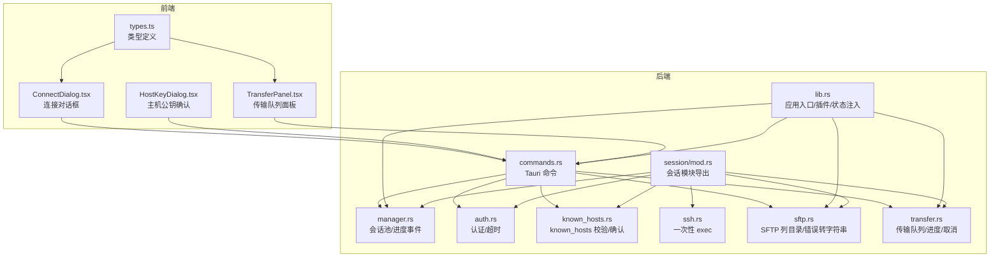
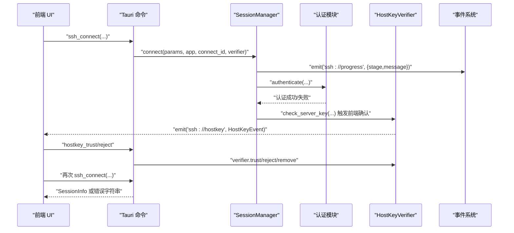
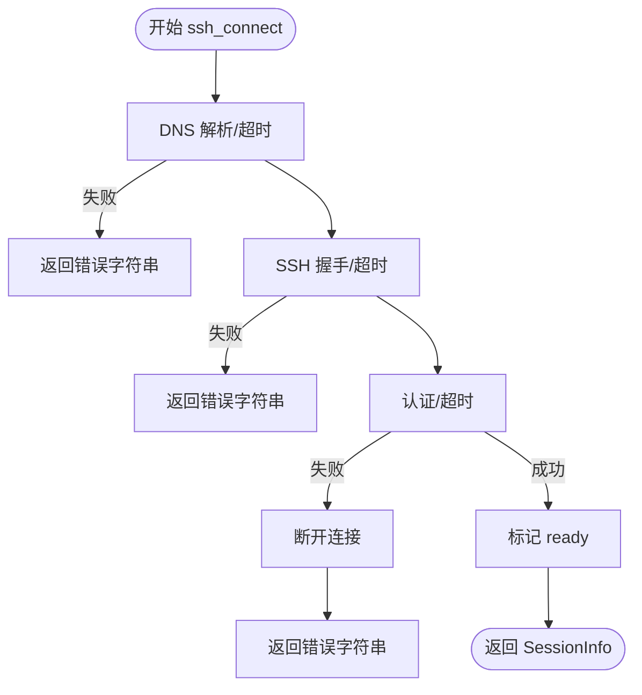
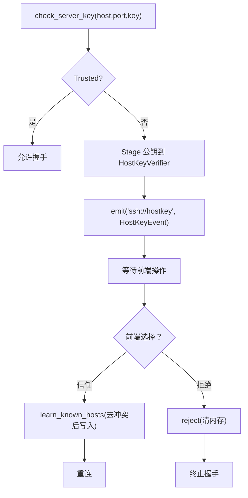
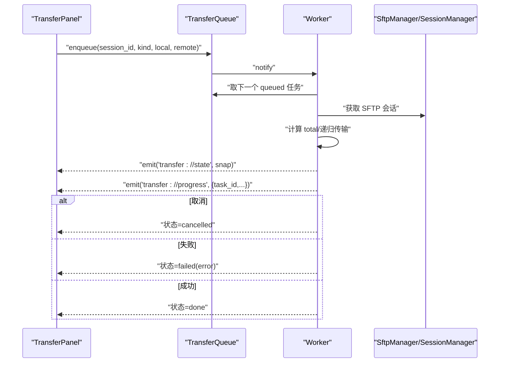
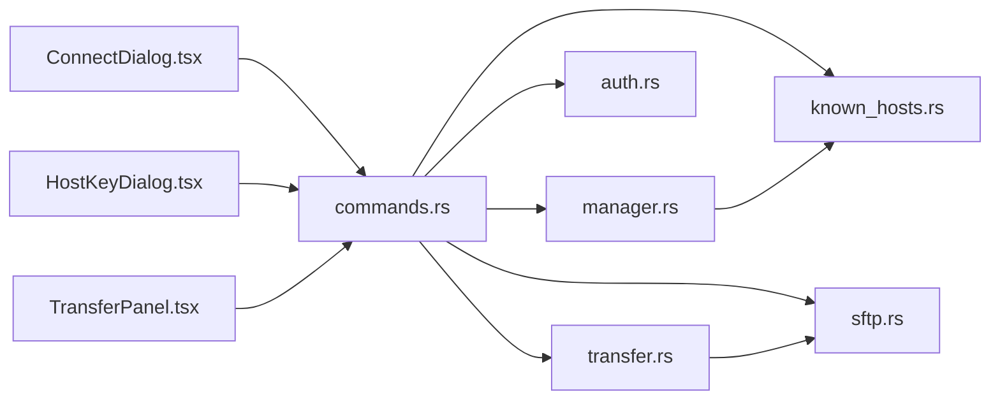

# 错误处理与异常管理

<cite>
**本文档引用的文件**
- [src-tauri/src/lib.rs](file://src-tauri/src/lib.rs)
- [src-tauri/src/commands.rs](file://src-tauri/src/commands.rs)
- [src-tauri/src/session/mod.rs](file://src-tauri/src/session/mod.rs)
- [src-tauri/src/session/manager.rs](file://src-tauri/src/session/manager.rs)
- [src-tauri/src/session/auth.rs](file://src-tauri/src/session/auth.rs)
- [src-tauri/src/session/known_hosts.rs](file://src-tauri/src/session/known_hosts.rs)
- [src-tauri/src/session/ssh.rs](file://src-tauri/src/session/ssh.rs)
- [src-tauri/src/session/sftp.rs](file://src-tauri/src/session/sftp.rs)
- [src-tauri/src/session/transfer.rs](file://src-tauri/src/session/transfer.rs)
- [src/components/ConnectDialog.tsx](file://src/components/ConnectDialog.tsx)
- [src/components/HostKeyDialog.tsx](file://src/components/HostKeyDialog.tsx)
- [src/components/TransferPanel.tsx](file://src/components/TransferPanel.tsx)
- [src/types.ts](file://src/types.ts)
</cite>

## 目录
1. [简介](#简介)
2. [项目结构](#项目结构)
3. [核心组件](#核心组件)
4. [架构总览](#架构总览)
5. [详细组件分析](#详细组件分析)
6. [依赖关系分析](#依赖关系分析)
7. [性能考量](#性能考量)
8. [故障排查指南](#故障排查指南)
9. [结论](#结论)
10. [附录](#附录)

## 简介
本文件系统性梳理简化版 SSH 客户端在后端 Rust 与前端 React/Tauri 层面的错误处理与异常管理机制，覆盖以下方面：
- 错误类型与错误码定义
- SSH 连接错误、认证失败、文件操作错误、传输中断等具体表现与处理策略
- 错误消息格式、国际化支持与用户友好提示
- 错误恢复机制、重试策略与降级处理
- 常见错误场景诊断、日志分析与调试工具使用
- 前端与后端的错误传播机制及多层级捕获

## 项目结构
后端采用 Tauri + Rust，前端采用 React。错误处理横跨命令层、会话层、传输层与前端 UI 事件监听。

图表来源
- [src-tauri/src/lib.rs:14-92](file://src-tauri/src/lib.rs#L14-L92)
- [src-tauri/src/commands.rs:23-95](file://src-tauri/src/commands.rs#L23-L95)
- [src-tauri/src/session/mod.rs:1-25](file://src-tauri/src/session/mod.rs#L1-L25)

章节来源
- [src-tauri/src/lib.rs:14-92](file://src-tauri/src/lib.rs#L14-L92)
- [src-tauri/src/commands.rs:23-95](file://src-tauri/src/commands.rs#L23-L95)
- [src-tauri/src/session/mod.rs:1-25](file://src-tauri/src/session/mod.rs#L1-L25)

## 核心组件
- 会话管理与进度事件：负责 TCP/SSH 握手/认证超时、阶段进度事件推送、会话生命周期管理。
- 认证模块：密码/私钥认证、超时控制、失败断开。
- 主机公钥校验：known_hosts 三态判定、前端确认流程、落盘与冲突处理。
- SFTP 模块：会话内复用连接开 SFTP 子系统、错误统一转字符串。
- 传输队列：串行 worker、可取消、进度事件、失败/取消状态。
- 前端 UI：连接进度监听、主机公钥确认弹窗、传输队列面板。

章节来源
- [src-tauri/src/session/manager.rs:24-48](file://src-tauri/src/session/manager.rs#L24-L48)
- [src-tauri/src/session/auth.rs:44-81](file://src-tauri/src/session/auth.rs#L44-L81)
- [src-tauri/src/session/known_hosts.rs:25-84](file://src-tauri/src/session/known_hosts.rs#L25-L84)
- [src-tauri/src/session/sftp.rs:24-75](file://src-tauri/src/session/sftp.rs#L24-L75)
- [src-tauri/src/session/transfer.rs:121-203](file://src-tauri/src/session/transfer.rs#L121-L203)
- [src/components/ConnectDialog.tsx:75-98](file://src/components/ConnectDialog.tsx#L75-L98)
- [src/components/HostKeyDialog.tsx:12-118](file://src/components/HostKeyDialog.tsx#L12-L118)
- [src/components/TransferPanel.tsx:12-50](file://src/components/TransferPanel.tsx#L12-L50)

## 架构总览
后端通过 Tauri 命令暴露能力，前端通过事件订阅与命令调用进行交互。错误在各层以“错误字符串”或“anyhow::Result”形式传递，前端统一渲染。

图表来源
- [src-tauri/src/commands.rs:42-72](file://src-tauri/src/commands.rs#L42-L72)
- [src-tauri/src/session/manager.rs:82-145](file://src-tauri/src/session/manager.rs#L82-L145)
- [src-tauri/src/session/auth.rs:44-81](file://src-tauri/src/session/auth.rs#L44-L81)
- [src-tauri/src/session/known_hosts.rs:97-135](file://src-tauri/src/session/known_hosts.rs#L97-L135)
- [src/components/ConnectDialog.tsx:75-98](file://src/components/ConnectDialog.tsx#L75-L98)

## 详细组件分析

### 会话连接与错误传播
- 超时策略：TCP 建连、SSH 握手、认证分别设置超时，超时或错误转换为人类可读消息。
- 进度事件：阶段推进通过事件推送，前端实时展示。
- 失败断开：认证失败或握手失败时主动断开，避免悬挂连接。

图表来源
- [src-tauri/src/session/manager.rs:255-316](file://src-tauri/src/session/manager.rs#L255-L316)
- [src-tauri/src/commands.rs:42-72](file://src-tauri/src/commands.rs#L42-L72)

章节来源
- [src-tauri/src/session/manager.rs:24-48](file://src-tauri/src/session/manager.rs#L24-L48)
- [src-tauri/src/session/manager.rs:255-316](file://src-tauri/src/session/manager.rs#L255-L316)
- [src-tauri/src/commands.rs:42-72](file://src-tauri/src/commands.rs#L42-L72)

### 主机公钥校验与用户确认
- 三态判定：已信任、未知（首次）、已变更（疑似 MITM）。
- 探针与确认：握手阶段若非信任态，暂存公钥并触发前端确认事件。
- 落盘与冲突：信任后剔除同算法冲突项再追加，拒绝仅清内存。

图表来源
- [src-tauri/src/session/mod.rs:115-160](file://src-tauri/src/session/mod.rs#L115-L160)
- [src-tauri/src/session/known_hosts.rs:63-84](file://src-tauri/src/session/known_hosts.rs#L63-L84)
- [src-tauri/src/session/known_hosts.rs:97-135](file://src-tauri/src/session/known_hosts.rs#L97-L135)

章节来源
- [src-tauri/src/session/mod.rs:115-160](file://src-tauri/src/session/mod.rs#L115-L160)
- [src-tauri/src/session/known_hosts.rs:25-84](file://src-tauri/src/session/known_hosts.rs#L25-L84)
- [src-tauri/src/session/known_hosts.rs:97-135](file://src-tauri/src/session/known_hosts.rs#L97-L135)

### 认证失败与错误消息
- 密码认证：超时包装为“认证超时（秒）”，失败包装为“认证出错：...”，最终断开并返回错误。
- 私钥认证：加载私钥失败、RSA 哈希协商失败均转为人类可读错误；认证失败同样断开并返回。

章节来源
- [src-tauri/src/session/auth.rs:44-81](file://src-tauri/src/session/auth.rs#L44-L81)

### SFTP 文件操作错误
- 会话内复用连接开 SFTP，所有错误统一转为字符串返回，前端直接展示。
- 列目录、创建/删除、读写等操作均遵循此策略。

章节来源
- [src-tauri/src/session/sftp.rs:24-75](file://src-tauri/src/session/sftp.rs#L24-L75)
- [src-tauri/src/session/sftp.rs:86-124](file://src-tauri/src/session/sftp.rs#L86-L124)
- [src-tauri/src/commands.rs:190-243](file://src-tauri/src/commands.rs#L190-L243)

### 传输队列与中断恢复
- 串行执行：队列按 FIFO 串行执行，避免并发争用。
- 可取消：任务携带取消标志，每次读片前检查，支持半成品清理。
- 进度事件：按任务粒度推送进度，前端实时更新。
- 失败/取消：失败状态携带错误字符串，取消时尝试清理半成品文件。

图表来源
- [src-tauri/src/session/transfer.rs:121-203](file://src-tauri/src/session/transfer.rs#L121-L203)
- [src-tauri/src/session/transfer.rs:205-284](file://src-tauri/src/session/transfer.rs#L205-L284)
- [src-tauri/src/session/transfer.rs:447-482](file://src-tauri/src/session/transfer.rs#L447-L482)
- [src/components/TransferPanel.tsx:12-50](file://src/components/TransferPanel.tsx#L12-L50)

章节来源
- [src-tauri/src/session/transfer.rs:50-95](file://src-tauri/src/session/transfer.rs#L50-L95)
- [src-tauri/src/session/transfer.rs:121-203](file://src-tauri/src/session/transfer.rs#L121-L203)
- [src-tauri/src/session/transfer.rs:205-284](file://src-tauri/src/session/transfer.rs#L205-L284)
- [src-tauri/src/session/transfer.rs:447-482](file://src-tauri/src/session/transfer.rs#L447-L482)
- [src/components/TransferPanel.tsx:12-50](file://src/components/TransferPanel.tsx#L12-L50)

### 一次性 exec 与错误处理
- 仅支持密码认证；超时/错误均转换为字符串返回。
- 执行完成后主动断开连接。

章节来源
- [src-tauri/src/session/ssh.rs:13-64](file://src-tauri/src/session/ssh.rs#L13-L64)

### 前端错误传播与用户提示
- 连接对话框：监听 ssh://progress 与 ssh://hostkey 事件，展示阶段与公钥确认。
- 主机公钥弹窗：根据 kind 决定文案与按钮顺序，支持复制指纹。
- 传输面板：轮询与事件驱动结合，失败状态携带错误字符串，支持取消。

章节来源
- [src/components/ConnectDialog.tsx:75-98](file://src/components/ConnectDialog.tsx#L75-L98)
- [src/components/HostKeyDialog.tsx:12-118](file://src/components/HostKeyDialog.tsx#L12-L118)
- [src/components/TransferPanel.tsx:12-50](file://src/components/TransferPanel.tsx#L12-L50)
- [src/types.ts:71-88](file://src/types.ts#L71-L88)
- [src/types.ts:104-116](file://src/types.ts#L104-L116)

## 依赖关系分析
- 命令层依赖会话层、认证层、SFTP 层、传输层与事件系统。
- 会话层依赖认证与 known_hosts，并向前端推送进度与公钥事件。
- 传输层依赖 SFTP 与会话句柄，向前端推送状态与进度。
- 前端通过事件监听与命令调用与后端交互。

图表来源
- [src-tauri/src/commands.rs:16-21](file://src-tauri/src/commands.rs#L16-L21)
- [src-tauri/src/session/mod.rs:27-39](file://src-tauri/src/session/mod.rs#L27-L39)
- [src/components/ConnectDialog.tsx:3-13](file://src/components/ConnectDialog.tsx#L3-L13)
- [src/components/HostKeyDialog.tsx:1-10](file://src/components/HostKeyDialog.tsx#L1-L10)
- [src/components/TransferPanel.tsx:1-6](file://src/components/TransferPanel.tsx#L1-L6)

章节来源
- [src-tauri/src/commands.rs:16-21](file://src-tauri/src/commands.rs#L16-L21)
- [src-tauri/src/session/mod.rs:27-39](file://src-tauri/src/session/mod.rs#L27-L39)
- [src/components/ConnectDialog.tsx:3-13](file://src/components/ConnectDialog.tsx#L3-L13)
- [src/components/HostKeyDialog.tsx:1-10](file://src/components/HostKeyDialog.tsx#L1-L10)
- [src/components/TransferPanel.tsx:1-6](file://src/components/TransferPanel.tsx#L1-L6)

## 性能考量
- 串行传输：避免单连接上 SFTP 并发争用，提升稳定性。
- 进度事件频率：按 64KB 片段推送，兼顾实时性与开销。
- 超时控制：TCP/握手/认证分层超时，避免长时间阻塞。
- 取消短路：每次读片前检查取消标志，降低无效 IO。

## 故障排查指南
- 连接超时
  - 现象：TCP 建连或握手超时，前端显示对应阶段。
  - 排查：检查网络连通性、防火墙、DNS 解析；缩短超时或重试。
  - 参考：[src-tauri/src/session/manager.rs:255-316](file://src-tauri/src/session/manager.rs#L255-L316)
- 认证失败
  - 现象：认证超时或认证出错，后端断开连接。
  - 排查：确认用户名/密码/私钥路径/口令；查看日志过滤器。
  - 参考：[src-tauri/src/session/auth.rs:44-81](file://src-tauri/src/session/auth.rs#L44-L81)
- 主机公钥变更
  - 现象：前端弹出 HostKeyDialog，提示 MITM 风险。
  - 排查：通过安全渠道核对指纹；确认后信任并重连。
  - 参考：[src-tauri/src/session/known_hosts.rs:97-135](file://src-tauri/src/session/known_hosts.rs#L97-L135)
- SFTP 操作失败
  - 现象：文件读写/列目录报错，错误字符串直接显示。
  - 排查：检查权限、路径、磁盘空间；必要时切换为下载/上传模式。
  - 参考：[src-tauri/src/session/sftp.rs:86-124](file://src-tauri/src/session/sftp.rs#L86-L124)
- 传输中断/取消
  - 现象：传输队列状态变为 failed/cancelled，前端显示错误。
  - 排查：检查网络波动、磁盘写入权限；可重试或清理半成品。
  - 参考：[src-tauri/src/session/transfer.rs:205-284](file://src-tauri/src/session/transfer.rs#L205-L284)
- 日志与调试
  - 初始化日志：应用启动时初始化日志过滤器。
  - 建议：使用环境变量调整日志级别，关注 ssh://progress 与 transfer:// 事件。

章节来源
- [src-tauri/src/session/manager.rs:255-316](file://src-tauri/src/session/manager.rs#L255-L316)
- [src-tauri/src/session/auth.rs:44-81](file://src-tauri/src/session/auth.rs#L44-L81)
- [src-tauri/src/session/known_hosts.rs:97-135](file://src-tauri/src/session/known_hosts.rs#L97-L135)
- [src-tauri/src/session/sftp.rs:86-124](file://src-tauri/src/session/sftp.rs#L86-L124)
- [src-tauri/src/session/transfer.rs:205-284](file://src-tauri/src/session/transfer.rs#L205-L284)
- [src-tauri/src/lib.rs:16-18](file://src-tauri/src/lib.rs#L16-L18)

## 结论
本项目在错误处理上采取“分层超时 + 事件驱动 + 字符串错误”的策略：后端在关键环节设置超时并统一转换为可读错误，前端通过事件与命令进行交互与提示。主机公钥采用“探针+确认”流程确保安全性；SFTP 与传输队列遵循“错误即字符串”的简单可靠设计。建议未来扩展：
- 错误码枚举与国际化映射
- 重试策略与退避算法
- 更细粒度的日志标签与采样

## 附录

### 错误类型与消息格式
- 连接阶段：resolve/handshake/auth/jump/ready，配合 message 字段。
- 主机公钥：unknown/changed，携带算法与指纹。
- 传输：queued/running/done/failed(cancelled)，失败携带错误字符串。
- 类型定义参考：[src/types.ts:71-88](file://src/types.ts#L71-L88)、[src/types.ts:104-116](file://src/types.ts#L104-L116)

章节来源
- [src/types.ts:71-88](file://src/types.ts#L71-L88)
- [src/types.ts:104-116](file://src/types.ts#L104-L116)