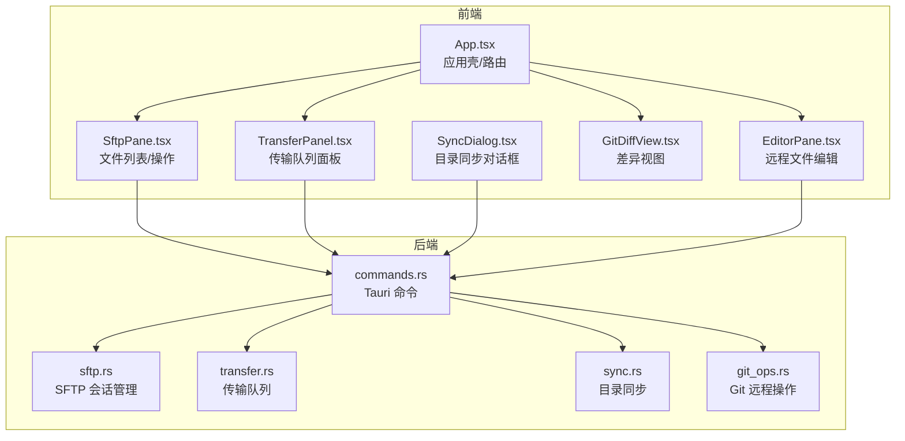
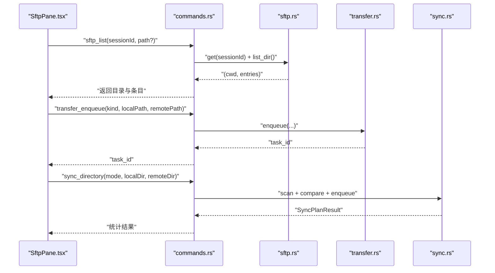
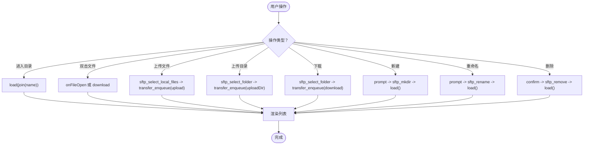
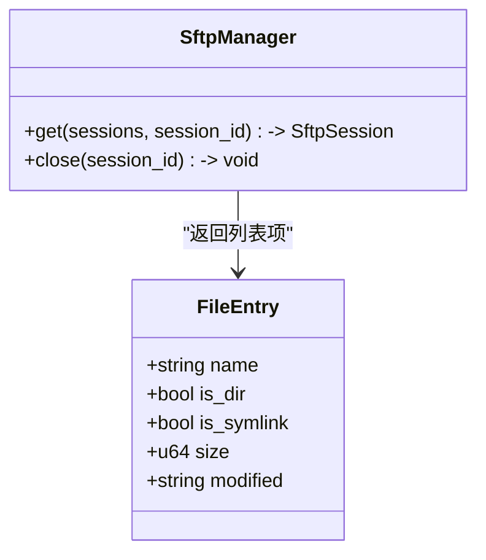
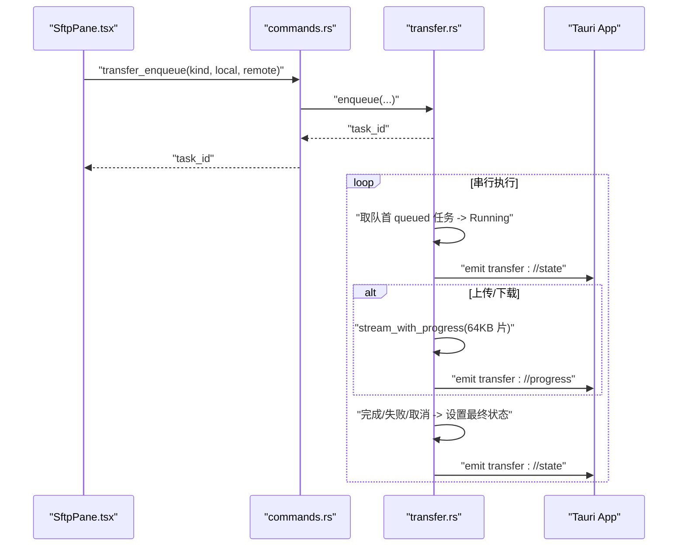
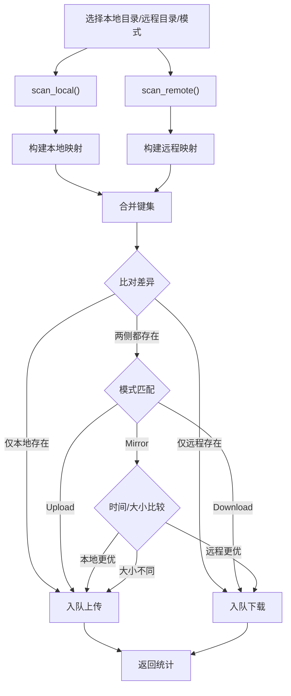
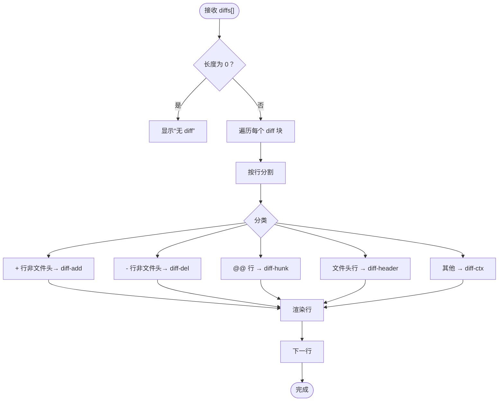
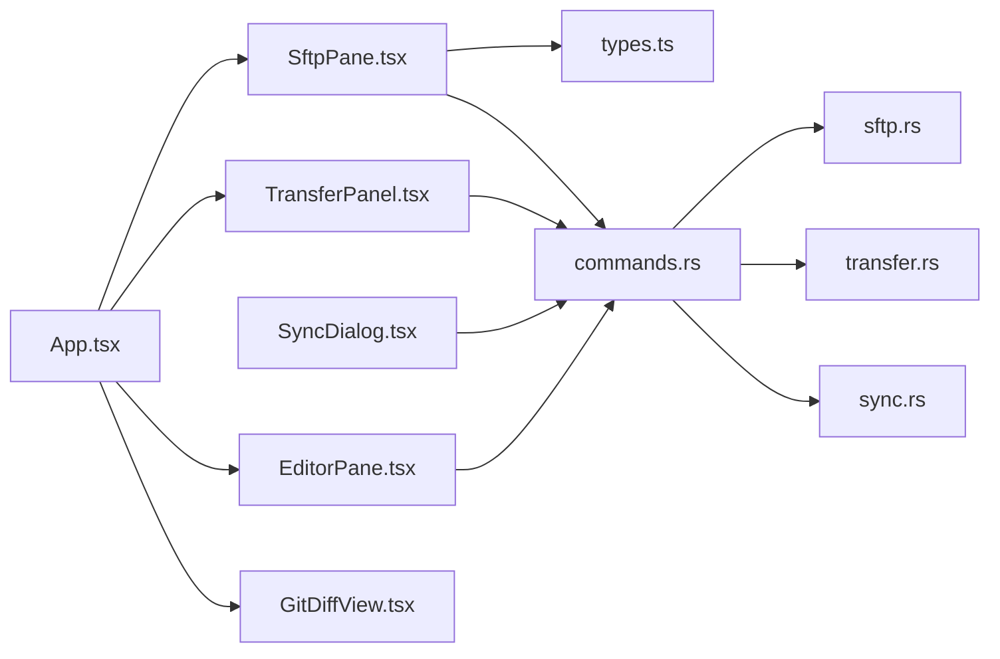

# SftpPane 文件管理器

<cite>
**本文档引用的文件**
- [SftpPane.tsx](file://src/components/SftpPane.tsx)
- [sftp.rs](file://src-tauri/src/session/sftp.rs)
- [commands.rs](file://src-tauri/src/commands.rs)
- [GitDiffView.tsx](file://src/components/GitDiffView.tsx)
- [types.ts](file://src/types.ts)
- [TransferPanel.tsx](file://src/components/TransferPanel.tsx)
- [SyncDialog.tsx](file://src/components/SyncDialog.tsx)
- [transfer.rs](file://src-tauri/src/session/transfer.rs)
- [sync.rs](file://src-tauri/src/session/sync.rs)
- [App.tsx](file://src/App.tsx)
- [EditorPane.tsx](file://src/components/EditorPane.tsx)
- [git_ops.rs](file://src-tauri/src/session/git_ops.rs)
- [App.css](file://src/App.css)
</cite>

## 目录
1. [简介](#简介)
2. [项目结构](#项目结构)
3. [核心组件](#核心组件)
4. [架构总览](#架构总览)
5. [详细组件分析](#详细组件分析)
6. [依赖关系分析](#依赖关系分析)
7. [性能考量](#性能考量)
8. [故障排查指南](#故障排查指南)
9. [结论](#结论)

## 简介
SftpPane 是基于 Tauri + React 的 SFTP 文件管理器组件，提供远程文件系统的浏览、文件列表渲染、权限与属性显示、上传下载、批量操作、目录同步、以及与传输队列的集成。它通过 Tauri 命令与 Rust 后端通信，实现安全、高效的文件传输与管理，并与全局传输面板、编辑器、Git 面板等模块协同工作。

## 项目结构
SftpPane 位于前端组件层，配合 Tauri 命令与 Rust 会话管理、SFTP 会话、传输队列、目录同步等后端模块共同构成完整的文件管理能力。

**图表来源**
- [SftpPane.tsx:1-312](file://src/components/SftpPane.tsx#L1-L312)
- [commands.rs:1-996](file://src-tauri/src/commands.rs#L1-L996)
- [sftp.rs:1-124](file://src-tauri/src/session/sftp.rs#L1-L124)
- [transfer.rs:1-483](file://src-tauri/src/session/transfer.rs#L1-L483)
- [sync.rs:1-265](file://src-tauri/src/session/sync.rs#L1-L265)
- [git_ops.rs:1-328](file://src-tauri/src/session/git_ops.rs#L1-L328)
- [App.tsx:530-685](file://src/App.tsx#L530-L685)

**章节来源**
- [SftpPane.tsx:1-312](file://src/components/SftpPane.tsx#L1-L312)
- [commands.rs:188-431](file://src-tauri/src/commands.rs#L188-L431)
- [App.tsx:570-595](file://src/App.tsx#L570-L595)

## 核心组件
- SftpPane：文件浏览与操作的核心 UI，负责目录加载、文件列表渲染、双击打开、上传下载、新建/重命名/删除等。
- Tauri 命令：封装后端能力，如 sftp_list、sftp_mkdir、sftp_rename、sftp_remove、transfer_enqueue、sync_directory 等。
- 传输队列：串行执行上传/下载任务，支持取消、进度与状态事件推送。
- 目录同步：扫描本地与远程目录，按策略生成传输计划并入队。
- GitDiffView：渲染 Git diff 输出，支持可视化对比。
- EditorPane：远程文件读取/保存，与 SftpPane 双击打开联动。

**章节来源**
- [SftpPane.tsx:30-304](file://src/components/SftpPane.tsx#L30-L304)
- [commands.rs:190-431](file://src-tauri/src/commands.rs#L190-L431)
- [TransferPanel.tsx:12-166](file://src/components/TransferPanel.tsx#L12-L166)
- [SyncDialog.tsx:17-126](file://src/components/SyncDialog.tsx#L17-L126)
- [GitDiffView.tsx:10-38](file://src/components/GitDiffView.tsx#L10-L38)
- [EditorPane.tsx:16-121](file://src/components/EditorPane.tsx#L16-L121)

## 架构总览
SftpPane 通过 invoke 调用 Tauri 命令，后端使用 SftpManager 获取/缓存 SFTP 会话，执行文件系统操作；上传/下载通过 transfer_enqueue 入队，交由传输队列串行执行；目录同步通过 sync_directory 对比两侧目录差异并入队相应任务。

**图表来源**
- [SftpPane.tsx:40-134](file://src/components/SftpPane.tsx#L40-L134)
- [commands.rs:190-431](file://src-tauri/src/commands.rs#L190-L431)
- [sftp.rs:87-123](file://src-tauri/src/session/sftp.rs#L87-L123)
- [transfer.rs:128-203](file://src-tauri/src/session/transfer.rs#L128-L203)
- [sync.rs:44-148](file://src-tauri/src/session/sync.rs#L44-L148)

## 详细组件分析

### SftpPane 文件管理器
- 目录浏览与路径控制：维护当前工作目录、地址输入框、回车跳转；父级目录按钮禁用条件基于 cwd。
- 文件列表渲染：按目录在前、名称排序；显示图标（文件/文件夹/符号链接）、大小、修改时间；支持单击选中、双击进入或打开。
- 文件操作：
  - 上传：选择本地文件，入队上传任务。
  - 上传目录：选择本地目录，入队目录上传任务。
  - 下载：选择本地保存位置，入队下载任务。
  - 新建目录：输入名称，调用 sftp_mkdir。
  - 重命名：输入新名称，调用 sftp_rename。
  - 删除：确认后调用 sftp_remove。
- 错误处理：统一捕获异常并显示；busy 状态避免并发操作。
- 与编辑器联动：双击文件或在 onFileOpen 回调中打开 EditorPane。

**图表来源**
- [SftpPane.tsx:67-190](file://src/components/SftpPane.tsx#L67-L190)
- [commands.rs:190-243](file://src-tauri/src/commands.rs#L190-L243)

**章节来源**
- [SftpPane.tsx:30-304](file://src/components/SftpPane.tsx#L30-L304)

### SFTP 会话与数据模型
- SftpManager：缓存每个会话的 SftpSession，首次缺失时在现有 SSH 连接上开启 SFTP 子系统。
- FileEntry：序列化传递给前端的目录项，包含名称、是否目录、是否符号链接、大小、修改时间。
- 列目录：规范化路径、过滤 . 和 ..、按目录优先、名称排序。

**图表来源**
- [sftp.rs:26-75](file://src-tauri/src/session/sftp.rs#L26-L75)
- [sftp.rs:15-22](file://src-tauri/src/session/sftp.rs#L15-L22)
- [sftp.rs:87-123](file://src-tauri/src/session/sftp.rs#L87-L123)

**章节来源**
- [sftp.rs:1-124](file://src-tauri/src/session/sftp.rs#L1-L124)
- [types.ts:63-69](file://src/types.ts#L63-L69)

### 传输队列与进度反馈
- 传输队列：串行 worker，入队后等待执行；支持取消（设置标志并在下次读片前检查）。
- 进度与状态：通过 transfer://progress 推送每任务进度，通过 transfer://state 推送状态快照；前端 TransferPanel 轮询与监听结合更新 UI。
- 支持的任务类型：upload、uploadDir、download；目录上传时总大小为 0（前端显示不确定进度）。

**图表来源**
- [commands.rs:365-407](file://src-tauri/src/commands.rs#L365-L407)
- [transfer.rs:128-203](file://src-tauri/src/session/transfer.rs#L128-L203)
- [transfer.rs:449-482](file://src-tauri/src/session/transfer.rs#L449-L482)
- [TransferPanel.tsx:16-50](file://src/components/TransferPanel.tsx#L16-L50)

**章节来源**
- [transfer.rs:1-483](file://src-tauri/src/session/transfer.rs#L1-L483)
- [TransferPanel.tsx:12-166](file://src/components/TransferPanel.tsx#L12-L166)

### 目录同步与差异入队
- 同步模式：镜像（双向较新覆盖）、仅上传、仅下载。
- 扫描策略：本地使用 tokio fs，远程使用 SFTP；忽略符号链接；相对路径映射。
- 差异判定：比较修改时间与大小；镜像模式下若大小不同也入队上传。
- 入队命名：上传任务前缀“同步↑”，下载任务前缀“同步↓”。

**图表来源**
- [SyncDialog.tsx:34-60](file://src/components/SyncDialog.tsx#L34-L60)
- [commands.rs:409-431](file://src-tauri/src/commands.rs#L409-L431)
- [sync.rs:44-148](file://src-tauri/src/session/sync.rs#L44-L148)

**章节来源**
- [SyncDialog.tsx:17-126](file://src/components/SyncDialog.tsx#L17-L126)
- [sync.rs:1-265](file://src-tauri/src/session/sync.rs#L1-L265)

### GitDiffView 差异查看组件
- 输入：GitDiffResult 数组，每项包含文件路径与 diff 字符串。
- 渲染：按行分类高亮：
  - 绿色：新增行（以 + 开头且非文件头）
  - 红色：删除行（以 - 开头且非文件头）
  - 灰色：上下文与文件头
  - 黄色：hunk 标识行（@@ ... @@）

**图表来源**
- [GitDiffView.tsx:10-38](file://src/components/GitDiffView.tsx#L10-L38)

**章节来源**
- [GitDiffView.tsx:1-38](file://src/components/GitDiffView.tsx#L1-L38)

### 文件类型识别、排序与过滤
- 类型识别：通过文件扩展名识别语言，用于编辑器标签显示。
- 排序规则：目录优先于文件，同组内按名称排序。
- 过滤机制：列表中过滤 . 与 ..；同步扫描中忽略符号链接；编辑器读取时限制文件大小与编码。

**章节来源**
- [sftp.rs:120-123](file://src-tauri/src/session/sftp.rs#L120-L123)
- [EditorPane.tsx:28-42](file://src/components/EditorPane.tsx#L28-L42)

### 安全考虑与错误处理
- 安全：
  - 传输队列串行执行，避免同一 SSH 连接上的 SFTP 并发争用。
  - 传输过程每 64KB 片检查取消标志，保证可中断。
  - 仅允许文本文件编辑（UTF-8），二进制文件禁止编辑。
- 错误处理：
  - 前端统一捕获异常并显示错误信息。
  - 传输失败状态与错误消息推送；取消后清理半成品文件。
  - 同步扫描中忽略符号链接，避免潜在风险。

**章节来源**
- [transfer.rs:206-284](file://src-tauri/src/session/transfer.rs#L206-L284)
- [commands.rs:284-360](file://src-tauri/src/commands.rs#L284-L360)
- [sync.rs:200-232](file://src-tauri/src/session/sync.rs#L200-L232)

## 依赖关系分析

**图表来源**
- [SftpPane.tsx:16-304](file://src/components/SftpPane.tsx#L16-L304)
- [types.ts:63-88](file://src/types.ts#L63-L88)
- [commands.rs:190-431](file://src-tauri/src/commands.rs#L190-L431)
- [App.tsx:570-595](file://src/App.tsx#L570-L595)

**章节来源**
- [types.ts:1-209](file://src/types.ts#L1-L209)
- [commands.rs:1-996](file://src-tauri/src/commands.rs#L1-L996)

## 性能考量
- 串行传输：避免并发导致的资源争用，提升稳定性。
- 分片传输：每 64KB 片次写入，平衡内存占用与吞吐。
- 目录扫描：本地与远程分别采用迭代方式，避免一次性加载大目录树。
- UI 非阻塞：文件选择与实际传输解耦，入队后立即返回，避免阻塞 UI。

[本节为通用性能讨论，无需特定文件来源]

## 故障排查指南
- 无法列出目录：检查 sessionId 是否有效，确认会话连接状态。
- 上传/下载无响应：确认传输队列是否正常运行，查看 TransferPanel 中任务状态。
- 同步无任务：确认本地目录选择正确，检查模式与差异判定逻辑。
- 编辑器报错：确认文件为文本且小于 5MB，确保 UTF-8 编码。
- 主机公钥问题：根据 HostKeyDialog 提示信任或拒绝，必要时重新连接。

**章节来源**
- [TransferPanel.tsx:16-50](file://src/components/TransferPanel.tsx#L16-L50)
- [commands.rs:284-360](file://src-tauri/src/commands.rs#L284-L360)
- [App.tsx:657-664](file://src/App.tsx#L657-L664)

## 结论
SftpPane 通过清晰的前后端职责划分，实现了稳定、可扩展的 SFTP 文件管理能力。前端负责直观的文件浏览与操作，后端提供可靠的会话管理、传输队列与目录同步。配合传输面板、编辑器与 Git 面板，形成完整的远程开发工作流。未来可在图标映射、右键菜单、拖拽支持等方面进一步增强用户体验。