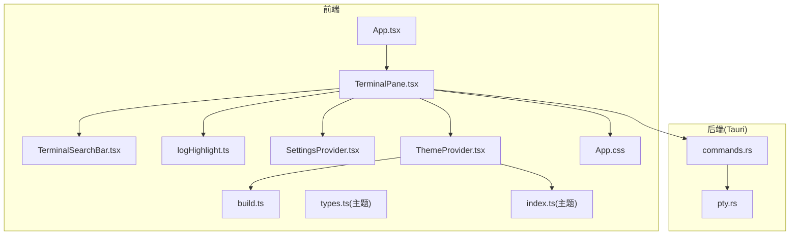
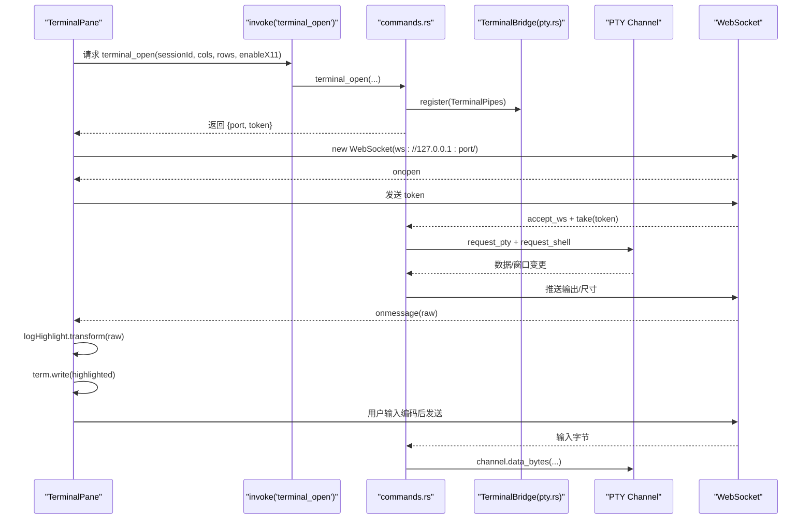
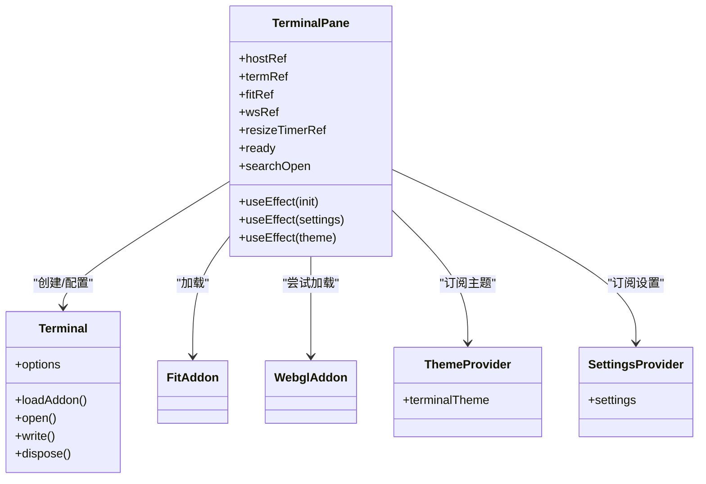
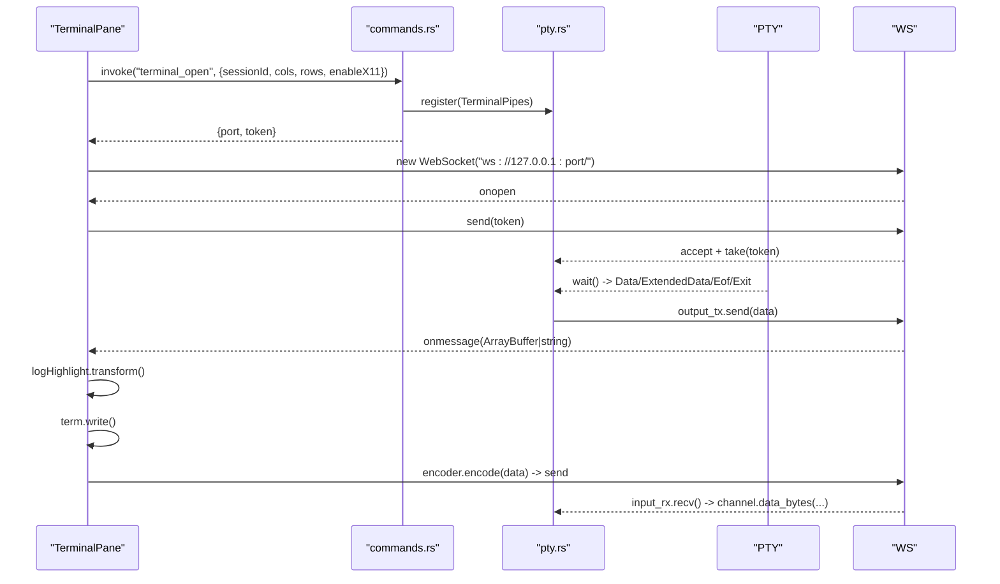
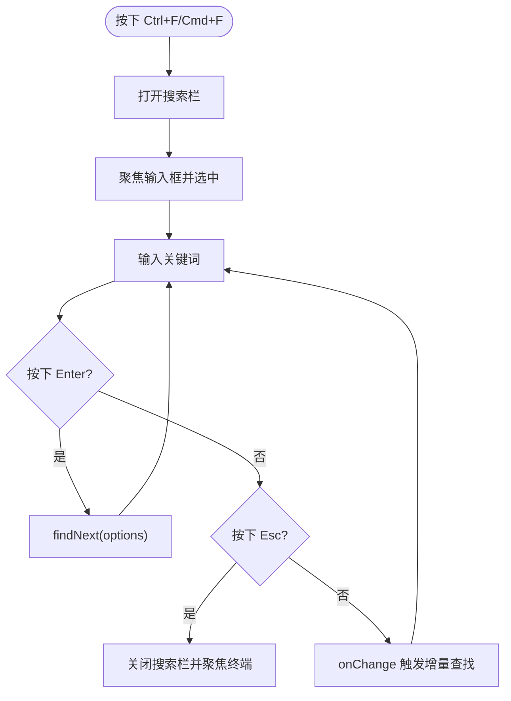
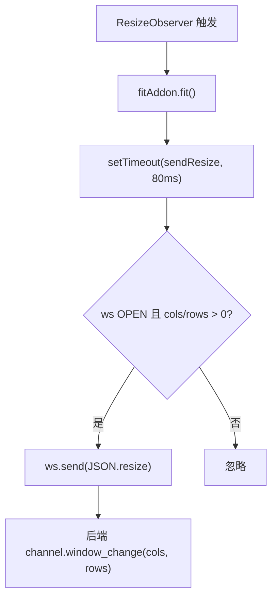
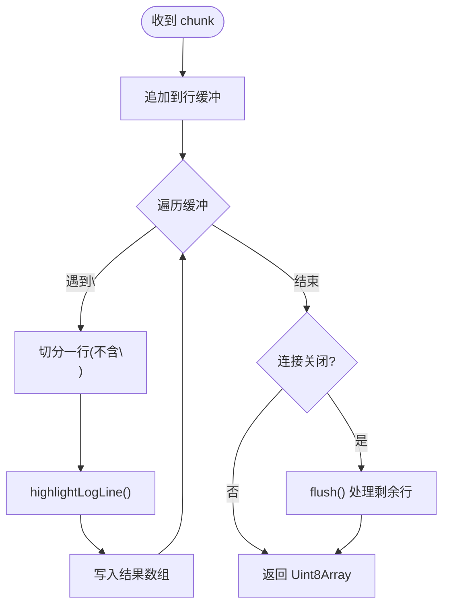
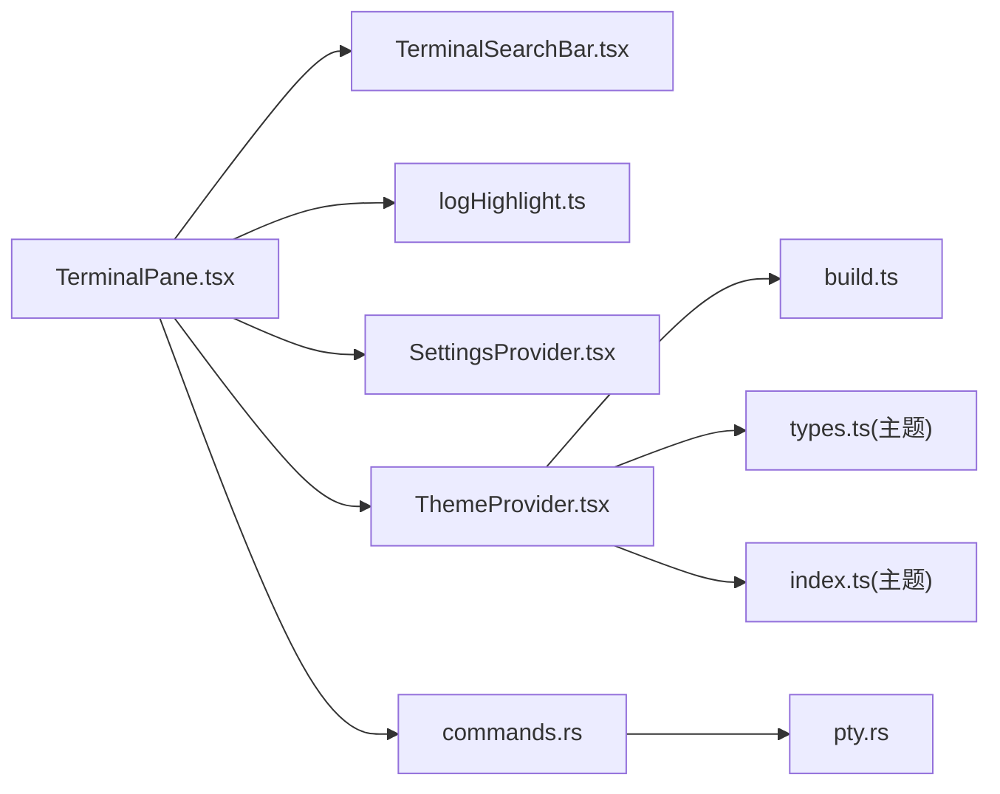

# TerminalPane 终端面板

<cite>
**本文引用的文件**
- [TerminalPane.tsx](file://src/components/TerminalPane.tsx)
- [TerminalSearchBar.tsx](file://src/components/TerminalSearchBar.tsx)
- [logHighlight.ts](file://src/utils/logHighlight.ts)
- [pty.rs](file://src-tauri/src/session/pty.rs)
- [commands.rs](file://src-tauri/src/commands.rs)
- [ThemeProvider.tsx](file://src/theme/ThemeProvider.tsx)
- [build.ts](file://src/themes/build.ts)
- [types.ts](file://src/themes/types.ts)
- [index.ts](file://src/themes/index.ts)
- [SettingsProvider.tsx](file://src/settings/SettingsProvider.tsx)
- [types.ts](file://src/settings/types.ts)
- [SplitView.tsx](file://src/components/SplitView.tsx)
- [App.tsx](file://src/App.tsx)
- [App.css](file://src/App.css)
</cite>

## 目录
1. [简介](#简介)
2. [项目结构](#项目结构)
3. [核心组件](#核心组件)
4. [架构总览](#架构总览)
5. [组件详解](#组件详解)
6. [依赖关系分析](#依赖关系分析)
7. [性能考量](#性能考量)
8. [故障排除指南](#故障排除指南)
9. [结论](#结论)
10. [附录](#附录)

## 简介
TerminalPane 是一个基于 xterm.js 6.0 的终端面板组件，负责与后端 PTY 通道进行双向通信，支持：
- WebGL 加速渲染与 Canvas 回退
- 动态自适应布局与尺寸同步
- 终端主题系统集成
- 日志语法高亮
- 终端内搜索（Ctrl+F）
- 键盘事件处理与断线重连机制

## 项目结构
TerminalPane 位于前端组件层，配合主题系统、设置系统、日志高亮工具以及后端 Tauri 命令与 PTY 桥接模块共同工作。

**图表来源**
- [TerminalPane.tsx:1-199](file://src/components/TerminalPane.tsx#L1-L199)
- [TerminalSearchBar.tsx:1-83](file://src/components/TerminalSearchBar.tsx#L1-L83)
- [logHighlight.ts:1-162](file://src/utils/logHighlight.ts#L1-L162)
- [SettingsProvider.tsx:1-80](file://src/settings/SettingsProvider.tsx#L1-L80)
- [ThemeProvider.tsx:1-32](file://src/theme/ThemeProvider.tsx#L1-L32)
- [build.ts:1-30](file://src/themes/build.ts#L1-L30)
- [types.ts:1-62](file://src/themes/types.ts#L1-L62)
- [index.ts:1-892](file://src/themes/index.ts#L1-L892)
- [commands.rs:105-186](file://src-tauri/src/commands.rs#L105-L186)
- [pty.rs:1-104](file://src-tauri/src/session/pty.rs#L1-L104)
- [App.tsx:312-509](file://src/App.tsx#L312-L509)
- [App.css:366-880](file://src/App.css#L366-L880)

**章节来源**
- [TerminalPane.tsx:1-199](file://src/components/TerminalPane.tsx#L1-L199)
- [commands.rs:105-186](file://src-tauri/src/commands.rs#L105-L186)
- [pty.rs:1-104](file://src-tauri/src/session/pty.rs#L1-L104)

## 核心组件
- TerminalPane：终端面板主体，负责 xterm 初始化、WebGL 加速、Fit 自适应、WebSocket 通信、日志高亮、搜索栏集成、主题联动与键盘事件。
- TerminalSearchBar：终端内搜索栏，集成 xterm-addon-search，支持 Ctrl+F 唤起与 F3/F Shift+F3 导航。
- logHighlight：日志高亮转换器，对无 ANSI 的纯文本注入 SGR 转义序列，增强可读性。
- ThemeProvider + themes：主题系统，构建 xterm ITheme 并与 GUI 主题联动。
- SettingsProvider + types：终端设置（字体、字号、行高、光标样式、闪烁、X11 转发、自动重连等）。
- commands.rs + pty.rs：后端命令与 PTY 桥接，提供 terminal_open、WS 令牌、mpsc 管道与 resize 通知。

**章节来源**
- [TerminalPane.tsx:1-199](file://src/components/TerminalPane.tsx#L1-L199)
- [TerminalSearchBar.tsx:1-83](file://src/components/TerminalSearchBar.tsx#L1-L83)
- [logHighlight.ts:1-162](file://src/utils/logHighlight.ts#L1-L162)
- [ThemeProvider.tsx:1-32](file://src/theme/ThemeProvider.tsx#L1-L32)
- [build.ts:1-30](file://src/themes/build.ts#L1-L30)
- [types.ts:1-62](file://src/themes/types.ts#L1-L62)
- [index.ts:1-892](file://src/themes/index.ts#L1-L892)
- [SettingsProvider.tsx:1-80](file://src/settings/SettingsProvider.tsx#L1-L80)
- [types.ts:1-48](file://src/settings/types.ts#L1-L48)
- [commands.rs:105-186](file://src-tauri/src/commands.rs#L105-L186)
- [pty.rs:1-104](file://src-tauri/src/session/pty.rs#L1-L104)

## 架构总览
TerminalPane 通过 Tauri invoke 调用后端 terminal_open 获取本地 WS 端口与一次性 token，随后建立 WebSocket 连接。前端将用户输入编码为字节发送到后端 PTY，后端通过 mpsc 管道将 PTY 输出转发到 WebSocket，TerminalPane 使用日志高亮器处理输出后再写入 xterm。

**图表来源**
- [TerminalPane.tsx:103-135](file://src/components/TerminalPane.tsx#L103-L135)
- [commands.rs:105-186](file://src-tauri/src/commands.rs#L105-L186)
- [pty.rs:87-104](file://src-tauri/src/session/pty.rs#L87-L104)

## 组件详解

### xterm.js 6.0 集成与 WebGL 加速
- 初始化：创建 Terminal 实例，加载 FitAddon，尝试加载 WebglAddon；若不可用则回退 Canvas 渲染。
- 主题系统：从 ThemeProvider 获取 terminalTheme，并在设置变化时动态更新。
- 字体与光标：根据 SettingsProvider 的设置动态调整字体族、字号、行高、光标样式与闪烁。

**图表来源**
- [TerminalPane.tsx:38-57](file://src/components/TerminalPane.tsx#L38-L57)
- [TerminalPane.tsx:151-178](file://src/components/TerminalPane.tsx#L151-L178)
- [ThemeProvider.tsx:14-25](file://src/theme/ThemeProvider.tsx#L14-L25)
- [SettingsProvider.tsx:15-21](file://src/settings/SettingsProvider.tsx#L15-L21)

**章节来源**
- [TerminalPane.tsx:38-57](file://src/components/TerminalPane.tsx#L38-L57)
- [TerminalPane.tsx:151-178](file://src/components/TerminalPane.tsx#L151-L178)
- [build.ts:14-30](file://src/themes/build.ts#L14-L30)
- [types.ts:52-59](file://src/themes/types.ts#L52-L59)

### WebSocket 通信机制与 PTY 通道
- 前端：invoke 调用 terminal_open，获得 port 与 token；建立 WS，binaryType 为 arraybuffer；onmessage 使用 logHighlight 处理后写入 term；onclose 触发断线回调。
- 后端：terminal_open 为会话创建 PTY，注册 TerminalBridge 管道，返回 port 与 token；WS 首条消息必须为 token；后续处理输入/输出与窗口变更。

**图表来源**
- [TerminalPane.tsx:103-135](file://src/components/TerminalPane.tsx#L103-L135)
- [commands.rs:105-186](file://src-tauri/src/commands.rs#L105-L186)
- [pty.rs:87-104](file://src-tauri/src/session/pty.rs#L87-L104)

**章节来源**
- [TerminalPane.tsx:103-135](file://src/components/TerminalPane.tsx#L103-L135)
- [commands.rs:105-186](file://src-tauri/src/commands.rs#L105-L186)
- [pty.rs:22-39](file://src-tauri/src/session/pty.rs#L22-L39)

### 终端搜索功能
- 快捷键：在终端容器上监听 Ctrl+F/Cmd+F，打开搜索栏。
- 搜索栏：加载 SearchAddon，输入框支持 Enter/Shift+Enter 上一个/下一个，Esc 关闭；支持大小写敏感、正则、增量与高亮装饰。

**图表来源**
- [TerminalPane.tsx:95-101](file://src/components/TerminalPane.tsx#L95-L101)
- [TerminalSearchBar.tsx:19-34](file://src/components/TerminalSearchBar.tsx#L19-L34)
- [TerminalSearchBar.tsx:38-53](file://src/components/TerminalSearchBar.tsx#L38-L53)
- [TerminalSearchBar.tsx:61-69](file://src/components/TerminalSearchBar.tsx#L61-L69)

**章节来源**
- [TerminalPane.tsx:95-101](file://src/components/TerminalPane.tsx#L95-L101)
- [TerminalSearchBar.tsx:1-83](file://src/components/TerminalSearchBar.tsx#L1-L83)

### 终端自适应布局与尺寸同步
- ResizeObserver：监听容器尺寸变化，触发 fitAndResize。
- 防抖：在 fit 后延时 80ms 发送 resize 消息，避免拖拽分隔条时洪泛。
- 尺寸协议：前端将 cols/rows 通过 JSON 发送到后端 PTY，后端调用 window_change。

**图表来源**
- [TerminalPane.tsx:80-81](file://src/components/TerminalPane.tsx#L80-L81)
- [TerminalPane.tsx:70-78](file://src/components/TerminalPane.tsx#L70-L78)
- [TerminalPane.tsx:60-68](file://src/components/TerminalPane.tsx#L60-L68)
- [commands.rs:166-168](file://src-tauri/src/commands.rs#L166-L168)

**章节来源**
- [TerminalPane.tsx:80-81](file://src/components/TerminalPane.tsx#L80-L81)
- [TerminalPane.tsx:70-78](file://src/components/TerminalPane.tsx#L70-L78)
- [TerminalPane.tsx:60-68](file://src/components/TerminalPane.tsx#L60-L68)
- [commands.rs:166-168](file://src-tauri/src/commands.rs#L166-L168)

### 日志语法高亮器集成
- 流式处理：按行缓冲，遇到换行注入颜色；支持二进制与字符串输入。
- 匹配规则：时间戳、日志级别（整词）、方括号/括号级别、HTTP 状态码、Java 异常类名。
- 性能：仅对疑似日志行注入颜色，避免干扰交互式 shell 输出。

**图表来源**
- [logHighlight.ts:125-161](file://src/utils/logHighlight.ts#L125-L161)
- [logHighlight.ts:111-119](file://src/utils/logHighlight.ts#L111-L119)

**章节来源**
- [logHighlight.ts:1-162](file://src/utils/logHighlight.ts#L1-L162)

### 键盘事件处理
- 终端内搜索：在终端容器上监听 Ctrl+F/Cmd+F，阻止默认行为并打开搜索栏。
- 全局快捷键：全局 useAppShortcuts 在非可编辑元素时拦截 Ctrl+N/W/Tab/,/K/P 等，不与终端搜索冲突。

**章节来源**
- [TerminalPane.tsx:95-101](file://src/components/TerminalPane.tsx#L95-L101)
- [useAppShortcuts.ts:20-59](file://src/hooks/useAppShortcuts.ts#L20-L59)

### 断线重连机制
- 连接丢失回调：WebSocket onclose 触发 onConnectionLost，由上层根据 profileId 与设置进行指数退避重试。
- 设置项：autoReconnect 与 maxReconnectAttempts 控制策略。

**章节来源**
- [TerminalPane.tsx:128-130](file://src/components/TerminalPane.tsx#L128-L130)
- [App.tsx:339-350](file://src/App.tsx#L339-L350)
- [types.ts:16-24](file://src/settings/types.ts#L16-L24)

## 依赖关系分析
- 组件耦合
  - TerminalPane 依赖 ThemeProvider、SettingsProvider、logHighlight、TerminalSearchBar。
  - 后端 commands.rs 依赖 pty.rs 与 TerminalBridge，后者维护 token→pipes 映射。
- 外部依赖
  - @xterm/xterm、@xterm/addon-fit、@xterm/addon-webgl、@xterm/addon-search。
  - @tauri-apps/api/core 提供 invoke。
- 潜在循环
  - 前后端通过 invoke/WS 解耦，无直接循环依赖。

**图表来源**
- [TerminalPane.tsx:1-10](file://src/components/TerminalPane.tsx#L1-L10)
- [TerminalSearchBar.tsx:1-4](file://src/components/TerminalSearchBar.tsx#L1-L4)
- [logHighlight.ts:1-7](file://src/utils/logHighlight.ts#L1-L7)
- [SettingsProvider.tsx:1-13](file://src/settings/SettingsProvider.tsx#L1-L13)
- [ThemeProvider.tsx:1-12](file://src/theme/ThemeProvider.tsx#L1-L12)
- [commands.rs:1-21](file://src-tauri/src/commands.rs#L1-L21)
- [pty.rs:1-21](file://src-tauri/src/session/pty.rs#L1-L21)
- [build.ts:1-3](file://src/themes/build.ts#L1-L3)
- [types.ts:1-5](file://src/themes/types.ts#L1-L5)
- [index.ts:1-4](file://src/themes/index.ts#L1-L4)

**章节来源**
- [TerminalPane.tsx:1-10](file://src/components/TerminalPane.tsx#L1-L10)
- [commands.rs:1-21](file://src-tauri/src/commands.rs#L1-L21)
- [pty.rs:1-21](file://src-tauri/src/session/pty.rs#L1-L21)

## 性能考量
- WebGL 加速：优先使用 WebglAddon，不可用时回退 Canvas，确保在低端设备上仍可运行。
- Resize 防抖：80ms 防抖减少 resize 消息频率，避免频繁 PTY 尺寸变更导致的性能问题。
- 流式高亮：按行缓冲与增量处理，避免全量扫描；仅对疑似日志行注入颜色。
- 字体与渲染：合理设置 fontSize、lineHeight，避免过小或过大造成重排与绘制压力。
- 事件监听：在组件卸载时清理 ResizeObserver、定时器与事件监听，防止内存泄漏。

[本节为通用性能建议，无需特定文件引用]

## 故障排除指南
- 无法打开终端
  - 前端：terminal_open 调用失败时会写入错误提示；检查后端会话状态与权限。
  - 后端：terminal_open 返回错误信息，确认会话存在、PTY 请求成功、X11 转发条件满足。
- WebSocket 连接失败
  - 确认 token 正确且一次性；检查本地 WS 端口与防火墙；观察 onclose 回调是否触发。
- 终端无输出或乱码
  - 检查 logHighlight 是否正确注入颜色；确认 binaryType 为 arraybuffer；确认后端输出通道正常。
- 搜索无效
  - 确保 Ctrl+F 在终端容器上触发；检查 SearchAddon 是否加载；确认输入框聚焦。
- 尺寸不正确
  - 检查 ResizeObserver 是否生效；确认 fitAddon.fit() 调用；排查防抖定时器是否被清理。
- 断线未重连
  - 检查 autoReconnect 与 maxReconnectAttempts 设置；确认 onConnectionLost 回调链路。

**章节来源**
- [TerminalPane.tsx:132-135](file://src/components/TerminalPane.tsx#L132-L135)
- [commands.rs:105-146](file://src-tauri/src/commands.rs#L105-L146)
- [pty.rs:87-104](file://src-tauri/src/session/pty.rs#L87-L104)
- [TerminalSearchBar.tsx:19-27](file://src/components/TerminalSearchBar.tsx#L19-L27)
- [types.ts:16-24](file://src/settings/types.ts#L16-L24)

## 结论
TerminalPane 通过清晰的前后端职责划分与完善的主题、设置、搜索与高亮体系，提供了高性能、可扩展的终端体验。其基于 xterm.js 6.0 的渲染与 PTY 通道设计，结合断线重连与自适应布局，满足复杂运维场景下的实时交互需求。

[本节为总结性内容，无需特定文件引用]

## 附录

### 终端样式与搜索栏样式
- 终端容器与覆盖层样式定义于 App.css。
- 搜索栏容器、输入框与按钮样式定义于 App.css。

**章节来源**
- [App.css:366-370](file://src/App.css#L366-L370)
- [App.css:824-840](file://src/App.css#L824-L840)
- [App.css:880-880](file://src/App.css#L880-L880)
- [App.css:1302-1337](file://src/App.css#L1302-L1337)