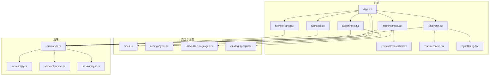
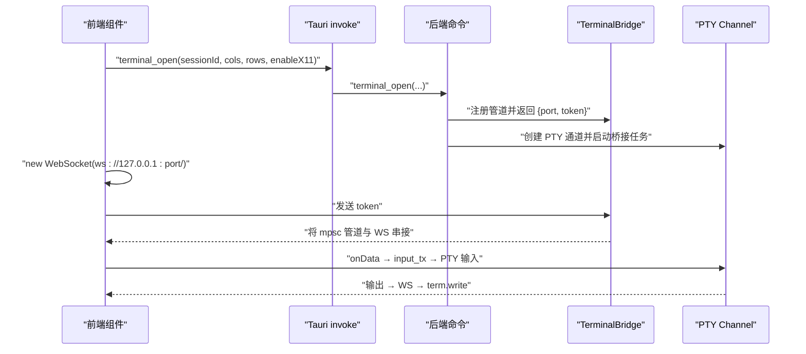
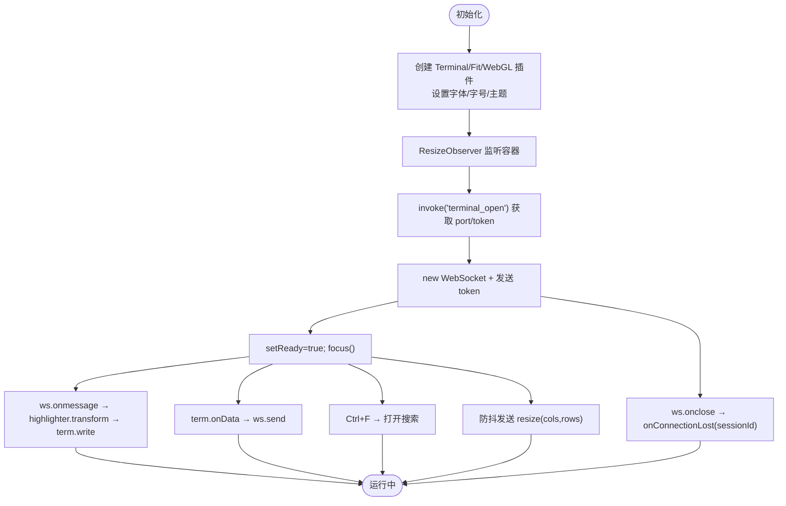
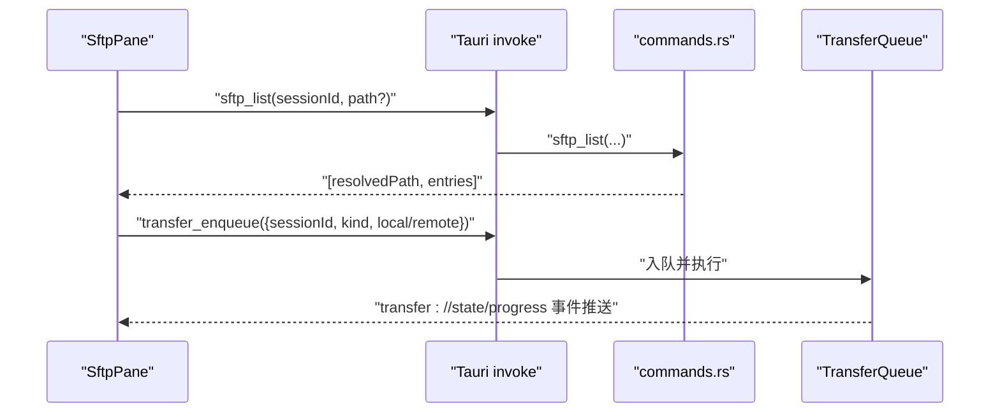
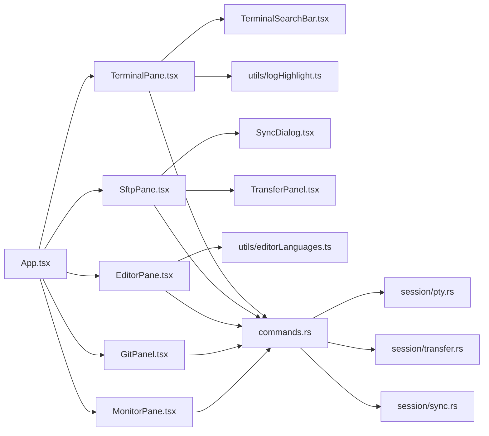

# UI 组件库

<cite>
**本文档引用的文件**
- [src/components/TerminalPane.tsx](file://src/components/TerminalPane.tsx)
- [src/components/TerminalSearchBar.tsx](file://src/components/TerminalSearchBar.tsx)
- [src/components/SftpPane.tsx](file://src/components/SftpPane.tsx)
- [src/components/EditorPane.tsx](file://src/components/EditorPane.tsx)
- [src/components/GitPanel.tsx](file://src/components/GitPanel.tsx)
- [src/components/MonitorPane.tsx](file://src/components/MonitorPane.tsx)
- [src/components/TransferPanel.tsx](file://src/components/TransferPanel.tsx)
- [src/components/SyncDialog.tsx](file://src/components/SyncDialog.tsx)
- [src/App.tsx](file://src/App.tsx)
- [src/types.ts](file://src/types.ts)
- [src/settings/types.ts](file://src/settings/types.ts)
- [src/utils/editorLanguages.ts](file://src/utils/editorLanguages.ts)
- [src/utils/logHighlight.ts](file://src/utils/logHighlight.ts)
- [src-tauri/src/session/pty.rs](file://src-tauri/src/session/pty.rs)
- [src-tauri/src/commands.rs](file://src-tauri/src/commands.rs)
- [src-tauri/src/session/transfer.rs](file://src-tauri/src/session/transfer.rs)
- [src-tauri/src/session/sync.rs](file://src-tauri/src/session/sync.rs)
</cite>

## 目录
1. [简介](#简介)
2. [项目结构](#项目结构)
3. [核心组件](#核心组件)
4. [架构总览](#架构总览)
5. [详细组件分析](#详细组件分析)
6. [依赖关系分析](#依赖关系分析)
7. [性能考量](#性能考量)
8. [故障排查指南](#故障排查指南)
9. [结论](#结论)
10. [附录](#附录)

## 简介
本文件为简化 SSH 客户端的 UI 组件库综合文档，聚焦以下核心界面组件：
- TerminalPane：基于 xterm.js 的终端面板，集成 WebSocket 桥接与 PTY 通道，支持动态尺寸、搜索、主题联动与日志高亮。
- SftpPane：远程文件管理器，提供目录浏览、文件操作与传输队列集成，支持目录同步。
- EditorPane：远程文件编辑器，支持读写、语法高亮与保存快捷键。
- GitPanel：版本控制集成，展示仓库状态、提交历史与 Worktree 管理。
- MonitorPane：系统监控面板，轮询远程 Linux /proc 指标并可视化。

文档同时给出各组件 Props 接口定义、事件处理机制、样式定制建议、使用示例与最佳实践。

## 项目结构
UI 组件位于 src/components，类型定义在 src/types.ts，设置在 src/settings/types.ts，工具函数在 src/utils。后端命令与会话逻辑位于 src-tauri/src，其中：
- pty.rs：终端 PTY 与本地 WebSocket 桥接。
- commands.rs：前端通过 Tauri invoke 调用的命令实现，如 terminal_open、sftp_*、git_*、monitor_snapshot 等。
- transfer.rs：SFTP 传输队列与进度/状态事件推送。
- sync.rs：目录同步策略与任务生成。

**图表来源**
- [src/App.tsx:530-682](file://src/App.tsx#L530-L682)
- [src/components/TerminalPane.tsx:19-199](file://src/components/TerminalPane.tsx#L19-L199)
- [src/components/SftpPane.tsx:25-312](file://src/components/SftpPane.tsx#L25-L312)
- [src/components/EditorPane.tsx:13-121](file://src/components/EditorPane.tsx#L13-L121)
- [src/components/GitPanel.tsx:27-305](file://src/components/GitPanel.tsx#L27-L305)
- [src/components/MonitorPane.tsx:53-181](file://src/components/MonitorPane.tsx#L53-L181)
- [src-tauri/src/session/pty.rs:1-104](file://src-tauri/src/session/pty.rs#L1-L104)
- [src-tauri/src/commands.rs:121-188](file://src-tauri/src/commands.rs#L121-L188)
- [src-tauri/src/session/transfer.rs:1-83](file://src-tauri/src/session/transfer.rs#L1-L83)
- [src-tauri/src/session/sync.rs:1-60](file://src-tauri/src/session/sync.rs#L1-L60)

**章节来源**
- [src/App.tsx:530-682](file://src/App.tsx#L530-L682)

## 核心组件
本节概述各组件职责、关键接口与行为。

- TerminalPane
  - 功能：xterm.js 终端渲染、动态尺寸适配、搜索栏、日志高亮、断线重连回调。
  - 关键 Props：sessionId、paneId、onConnectionLost。
  - 关键流程：invoke("terminal_open") 获取本地 WS 端口与 token，建立 ws 连接，发送 token，监听 onmessage 写入终端，监听 onclose 触发 onConnectionLost。
- SftpPane
  - 功能：目录浏览、文件操作（新建/重命名/删除）、上传/下载/上传目录、目录同步。
  - 关键 Props：sessionId、onFileOpen。
  - 关键流程：invoke("sftp_list"/"sftp_mkdir"/"sftp_rename"/"sftp_remove") 与 TransferQueue 交互（transfer_enqueue）。
- EditorPane
  - 功能：远程文件读取/写入、语法高亮标签、保存快捷键（Ctrl+S）。
  - 关键 Props：sessionId、filePath、onTitleChange。
  - 关键流程：invoke("sftp_read_file")、invoke("sftp_write_file")。
- GitPanel
  - 功能：仓库状态、分支切换、提交历史、Worktree 管理、文件差异视图。
  - 关键 Props：sessionId、repoPath、onOpenFile。
  - 关键流程：invoke("git_status"/"git_log"/"git_branches"/"git_worktree_list"/"git_checkout"/"git_worktree_remove")。
- MonitorPane
  - 功能：周期性拉取系统监控快照并可视化。
  - 关键 Props：sessionId。
  - 关键流程：invoke("monitor_snapshot")，定时刷新。

**章节来源**
- [src/components/TerminalPane.tsx:12-199](file://src/components/TerminalPane.tsx#L12-L199)
- [src/components/SftpPane.tsx:19-312](file://src/components/SftpPane.tsx#L19-L312)
- [src/components/EditorPane.tsx:7-121](file://src/components/EditorPane.tsx#L7-L121)
- [src/components/GitPanel.tsx:19-305](file://src/components/GitPanel.tsx#L19-L305)
- [src/components/MonitorPane.tsx:6-181](file://src/components/MonitorPane.tsx#L6-L181)

## 架构总览
前端通过 Tauri invoke 调用后端命令，后端在指定会话上执行相应操作。TerminalPane 的 PTY 通道通过本地 WebSocket 桥接 russh 的 Channel；SFTP 文件操作与传输队列由 TransferQueue 管理；Git 与监控数据通过对应的命令获取。

**图表来源**
- [src-tauri/src/session/pty.rs:47-104](file://src-tauri/src/session/pty.rs#L47-L104)
- [src-tauri/src/commands.rs:121-188](file://src-tauri/src/commands.rs#L121-L188)
- [src/components/TerminalPane.tsx:103-135](file://src/components/TerminalPane.tsx#L103-L135)

## 详细组件分析

### TerminalPane 终端面板
- Props 接口
  - sessionId: string
  - paneId: string
  - onConnectionLost?: (sessionId: string) => void
- 关键实现要点
  - 初始化 xterm.js：加载 Fit/WebGL 插件，设置字体、字号、行高、光标样式与主题。
  - 动态尺寸：ResizeObserver 监听容器变化，防抖后向后端发送 resize 消息。
  - WebSocket 桥接：invoke("terminal_open") 获取本地 WS 端口与 token，连接后发送 token，onmessage 使用日志高亮器 transform 后写入终端。
  - 搜索：通过 TerminalSearchBar 集成 @xterm/addon-search，支持 Ctrl+F 唤起与 F3 导航。
  - 断线重连：onclose 回调 onConnectionLost，交由上层 App 管理自动重连。
- 事件与副作用
  - onData → ws.send
  - onmessage → highlighter.transform → term.write
  - 键盘监听 Ctrl+F → 打开搜索
  - 设置变化 → 更新 term.options 与 fit.fit()

**图表来源**
- [src/components/TerminalPane.tsx:34-149](file://src/components/TerminalPane.tsx#L34-L149)
- [src/components/TerminalSearchBar.tsx:12-83](file://src/components/TerminalSearchBar.tsx#L12-L83)
- [src/utils/logHighlight.ts:121-162](file://src/utils/logHighlight.ts#L121-L162)

**章节来源**
- [src/components/TerminalPane.tsx:12-199](file://src/components/TerminalPane.tsx#L12-L199)
- [src/components/TerminalSearchBar.tsx:6-83](file://src/components/TerminalSearchBar.tsx#L6-L83)
- [src/utils/logHighlight.ts:1-162](file://src/utils/logHighlight.ts#L1-162)

### SftpPane 文件管理器
- Props 接口
  - sessionId: string
  - onFileOpen?: (filePath: string) => void
- 关键实现要点
  - 目录浏览：invoke("sftp_list") 获取当前目录与条目，支持上一级、地址栏直达、刷新。
  - 文件操作：mkdir、rename、remove，均通过 invoke 调用后端命令。
  - 传输队列：upload/uploadDir/download 通过 invoke("transfer_enqueue") 入队，进度与状态由 TransferPanel 监听事件更新。
  - 目录同步：弹出 SyncDialog，选择本地目录与模式（镜像/上传/下载），后端扫描比对并入队。
- 事件与副作用
  - enter(e)：双击目录进入，双击文件若提供 onFileOpen 则打开编辑器，否则下载。
  - 键盘 Enter 刷新路径。
  - 错误状态与忙碌态管理。

**图表来源**
- [src/components/SftpPane.tsx:40-149](file://src/components/SftpPane.tsx#L40-L149)
- [src-tauri/src/commands.rs:408-433](file://src-tauri/src/commands.rs#L408-L433)
- [src-tauri/src/session/transfer.rs:71-83](file://src-tauri/src/session/transfer.rs#L71-L83)

**章节来源**
- [src/components/SftpPane.tsx:19-312](file://src/components/SftpPane.tsx#L19-L312)
- [src/components/SyncDialog.tsx:14-126](file://src/components/SyncDialog.tsx#L14-L126)
- [src-tauri/src/session/sync.rs:44-60](file://src-tauri/src/session/sync.rs#L44-L60)

### EditorPane 编辑器组件
- Props 接口
  - sessionId: string
  - filePath: string
  - onTitleChange?: (title: string) => void
- 关键实现要点
  - 文件读取：invoke("sftp_read_file")，设置 content/original，触发 onTitleChange。
  - 保存：invoke("sftp_write_file")，成功后更新 original。
  - 语法高亮：根据文件扩展名检测语言，显示语言标签。
  - 快捷键：Ctrl+S 保存（当有改动时）。
- 事件与副作用
  - 键盘监听 Ctrl+S → save
  - textarea onChange → setContent

**章节来源**
- [src/components/EditorPane.tsx:7-121](file://src/components/EditorPane.tsx#L7-L121)
- [src/utils/editorLanguages.ts:88-139](file://src/utils/editorLanguages.ts#L88-L139)

### GitPanel 版本控制集成
- Props 接口
  - sessionId: string
  - repoPath: string
  - onOpenFile?: (filePath: string) => void
- 关键实现要点
  - 标签页：changes、log、worktrees。
  - 数据获取：git_status、git_log、git_branches、git_worktree_list。
  - 操作：checkoutBranch、removeWorktree、viewDiff（支持 staged 参数）。
- 事件与副作用
  - 切换标签页时按需懒加载数据。
  - 选择文件 → 调用 git_diff 展示差异。

**章节来源**
- [src/components/GitPanel.tsx:19-305](file://src/components/GitPanel.tsx#L19-L305)

### MonitorPane 系统监控面板
- Props 接口
  - sessionId: string
- 关键实现要点
  - 定时刷新：setInterval(2500) 调用 invoke("monitor_snapshot")。
  - 指标展示：CPU、内存、负载、运行时间、磁盘使用率。
  - 格式化：字节与 uptime 的人类可读格式化函数。
- 事件与副作用
  - 刷新按钮手动触发。
  - 首次采样需等待下一周期。

**章节来源**
- [src/components/MonitorPane.tsx:6-181](file://src/components/MonitorPane.tsx#L6-L181)

## 依赖关系分析
- 组件间依赖
  - App.tsx 作为根组件，负责路由与容器渲染，将 sessionId 传递给各面板。
  - TerminalPane 依赖 TerminalSearchBar 与日志高亮工具。
  - SftpPane 依赖 TransferPanel 与 SyncDialog。
  - EditorPane 依赖语法高亮工具。
- 外部依赖
  - xterm.js、@xterm/addon-fit、@xterm/addon-webgl、@xterm/addon-search。
  - Tauri invoke 与事件系统。
- 后端依赖
  - PTY 桥接、SFTP 命令、传输队列、目录同步、监控快照。

**图表来源**
- [src/App.tsx:530-682](file://src/App.tsx#L530-L682)
- [src/components/TerminalPane.tsx:19-199](file://src/components/TerminalPane.tsx#L19-L199)
- [src/components/SftpPane.tsx:25-312](file://src/components/SftpPane.tsx#L25-L312)
- [src/components/EditorPane.tsx:13-121](file://src/components/EditorPane.tsx#L13-L121)
- [src/components/GitPanel.tsx:27-305](file://src/components/GitPanel.tsx#L27-L305)
- [src/components/MonitorPane.tsx:53-181](file://src/components/MonitorPane.tsx#L53-L181)
- [src-tauri/src/session/pty.rs:1-104](file://src-tauri/src/session/pty.rs#L1-L104)
- [src-tauri/src/commands.rs:121-188](file://src-tauri/src/commands.rs#L121-L188)
- [src-tauri/src/session/transfer.rs:1-83](file://src-tauri/src/session/transfer.rs#L1-L83)
- [src-tauri/src/session/sync.rs:1-60](file://src-tauri/src/session/sync.rs#L1-L60)

**章节来源**
- [src/App.tsx:530-682](file://src/App.tsx#L530-L682)

## 性能考量
- 终端面板
  - FitAddon.fit 与防抖 resize：减少 resize 事件洪泛，避免频繁 PTY 尺寸调整。
  - WebGL 降级：WebGL 不可用时回退 Canvas，保证可用性。
  - 日志高亮：按行缓冲与增量注入，避免全量重绘。
- 文件管理器
  - 传输队列串行执行：避免同一 SSH 连接上的 SFTP 并发争用。
  - 传输进度与状态事件：按任务 ID 推送，局部更新 UI。
- 监控面板
  - 固定周期轮询（2.5s），避免过于频繁的系统调用。
- 编辑器
  - 仅在需要时加载文件内容，避免不必要的网络往返。

[本节为通用指导，无需特定文件来源]

## 故障排查指南
- 终端无法打开
  - 检查 invoke("terminal_open") 是否返回错误；查看 onConnectionLost 回调是否触发。
  - 确认 enableX11 设置与本地 DISPLAY 环境一致。
- WebSocket 连接失败
  - 确认 token 首包正确发送；检查 TerminalBridge 是否存在对应 token 的管道。
- 传输队列无进度
  - 确认事件监听："transfer://state" 与 "transfer://progress" 是否正常接收。
  - 检查 transfer_enqueue 调用与队列状态流转。
- 目录同步无效
  - 确认本地目录选择与模式配置；检查后端扫描与入队逻辑。
- Git 面板数据为空
  - 确认 repoPath 正确；检查 git_status/git_log 等命令返回。
- 监控数据延迟
  - 首次 CPU 采样需等待下一周期；检查轮询间隔与权限。

**章节来源**
- [src/components/TerminalPane.tsx:103-135](file://src/components/TerminalPane.tsx#L103-L135)
- [src-tauri/src/session/pty.rs:87-104](file://src-tauri/src/session/pty.rs#L87-L104)
- [src/components/TransferPanel.tsx:16-50](file://src/components/TransferPanel.tsx#L16-L50)
- [src-tauri/src/commands.rs:408-433](file://src-tauri/src/commands.rs#L408-L433)
- [src/components/GitPanel.tsx:41-102](file://src/components/GitPanel.tsx#L41-L102)
- [src/components/MonitorPane.tsx:76-88](file://src/components/MonitorPane.tsx#L76-L88)

## 结论
本 UI 组件库围绕 SSH 会话提供了完整的终端、文件、编辑、版本控制与监控能力。前端通过 Tauri 与后端命令紧密协作，结合传输队列与桥接机制，实现了高性能、可扩展的用户体验。建议在实际使用中关注断线重连、传输进度与日志高亮等关键路径，以获得稳定可靠的运维体验。

[本节为总结性内容，无需特定文件来源]

## 附录

### 组件 Props 与事件一览
- TerminalPane
  - Props: sessionId, paneId, onConnectionLost
  - 事件: onConnectionLost(sessionId)
- SftpPane
  - Props: sessionId, onFileOpen
  - 事件: onFileOpen(filePath)
- EditorPane
  - Props: sessionId, filePath, onTitleChange
  - 事件: onTitleChange(title)
- GitPanel
  - Props: sessionId, repoPath, onOpenFile
  - 事件: onOpenFile(filePath)
- MonitorPane
  - Props: sessionId

**章节来源**
- [src/components/TerminalPane.tsx:12-17](file://src/components/TerminalPane.tsx#L12-L17)
- [src/components/SftpPane.tsx:19-23](file://src/components/SftpPane.tsx#L19-L23)
- [src/components/EditorPane.tsx:7-11](file://src/components/EditorPane.tsx#L7-L11)
- [src/components/GitPanel.tsx:19-23](file://src/components/GitPanel.tsx#L19-L23)
- [src/components/MonitorPane.tsx:6-8](file://src/components/MonitorPane.tsx#L6-L8)

### 样式定制方案
- 终端主题与字体
  - 通过 SettingsProvider 的应用设置（fontFamily、fontSize、lineHeight、cursorStyle、cursorBlink）与 ThemeProvider 的 terminalTheme 联动。
- 终端面板
  - .terminal-host、.term-overlay、.conn-spinner 等类名用于布局与加载态。
- 文件管理器
  - .sftp-toolbar、.sftp-list、.sftp-row、.sftp-error 等类名用于工具栏、列表与错误提示。
- 编辑器
  - .editor-pane、.editor-toolbar、.editor-textarea、.editor-error-bar 等类名用于整体布局与错误展示。
- Git 面板
  - .git-panel、.git-tabs、.git-file-list、.git-diff-section 等类名用于标签页与差异展示。
- 监控面板
  - .monitor-pane、.monitor-grid、.monitor-metric、.monitor-error 等类名用于网格与指标展示。

**章节来源**
- [src/settings/types.ts:1-48](file://src/settings/types.ts#L1-L48)
- [src/components/TerminalPane.tsx:180-199](file://src/components/TerminalPane.tsx#L180-L199)
- [src/components/SftpPane.tsx:196-304](file://src/components/SftpPane.tsx#L196-L304)
- [src/components/EditorPane.tsx:96-120](file://src/components/EditorPane.tsx#L96-L120)
- [src/components/GitPanel.tsx:151-287](file://src/components/GitPanel.tsx#L151-L287)
- [src/components/MonitorPane.tsx:95-181](file://src/components/MonitorPane.tsx#L95-L181)

### 使用示例与最佳实践
- 打开终端
  - 在 App.tsx 中调用 openTerminal，传入 SessionInfo，TerminalPane 通过 onConnectionLost 处理断线重连。
- 打开文件管理器
  - 在 App.tsx 中调用 openSftp，SftpPane 提供 onFileOpen 回调以在编辑器中打开文件。
- 编辑远程文件
  - 在 App.tsx 中调用 openEditor，EditorPane 自动读取并写入远程文件，支持 Ctrl+S 保存。
- 查看系统监控
  - 在 App.tsx 中调用 openMonitor，MonitorPane 每 2.5s 自动刷新一次。
- Git 面板
  - 在 App.tsx 中调用 openGit，GitPanel 展示状态、日志与 Worktree，并支持差异查看与分支切换。

**章节来源**
- [src/App.tsx:175-267](file://src/App.tsx#L175-L267)
- [src/components/TerminalPane.tsx:23-149](file://src/components/TerminalPane.tsx#L23-L149)
- [src/components/SftpPane.tsx:30-62](file://src/components/SftpPane.tsx#L30-L62)
- [src/components/EditorPane.tsx:23-73](file://src/components/EditorPane.tsx#L23-L73)
- [src/components/MonitorPane.tsx:76-88](file://src/components/MonitorPane.tsx#L76-L88)
- [src/components/GitPanel.tsx:90-102](file://src/components/GitPanel.tsx#L90-L102)