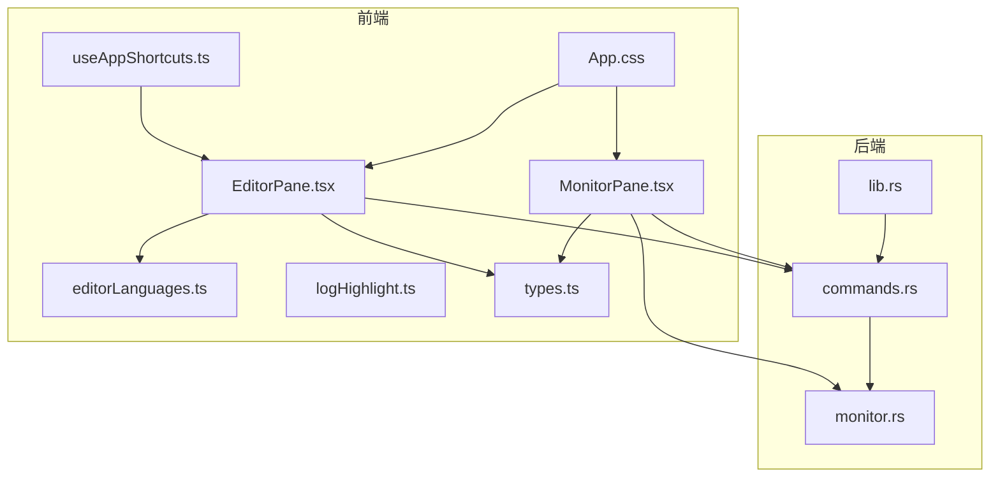
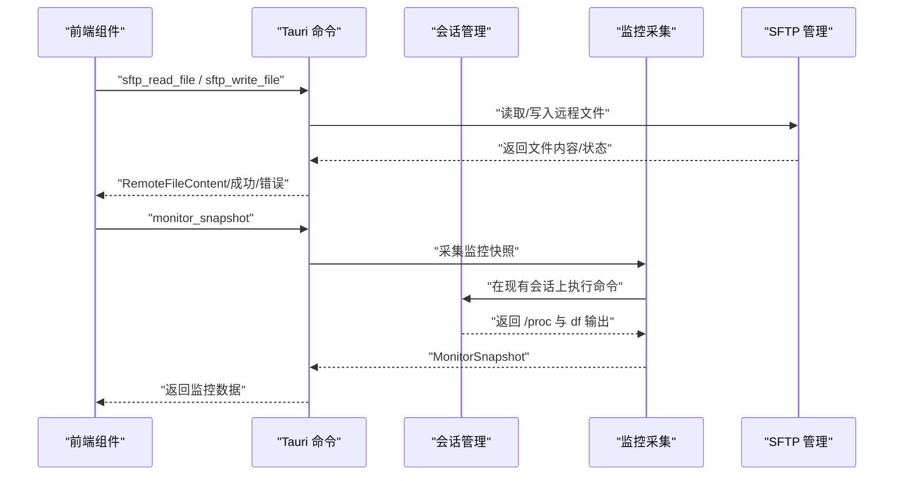
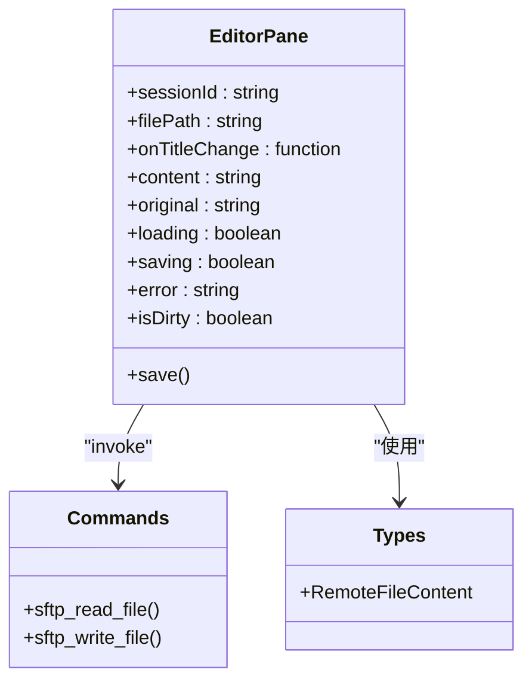
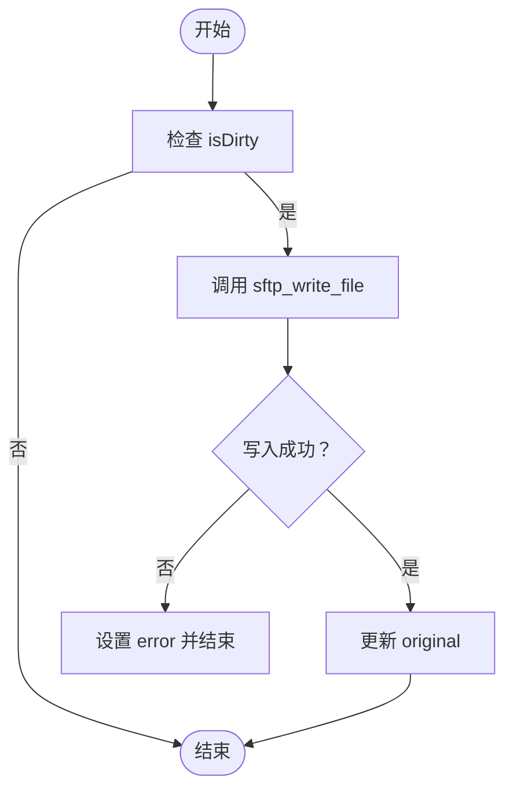
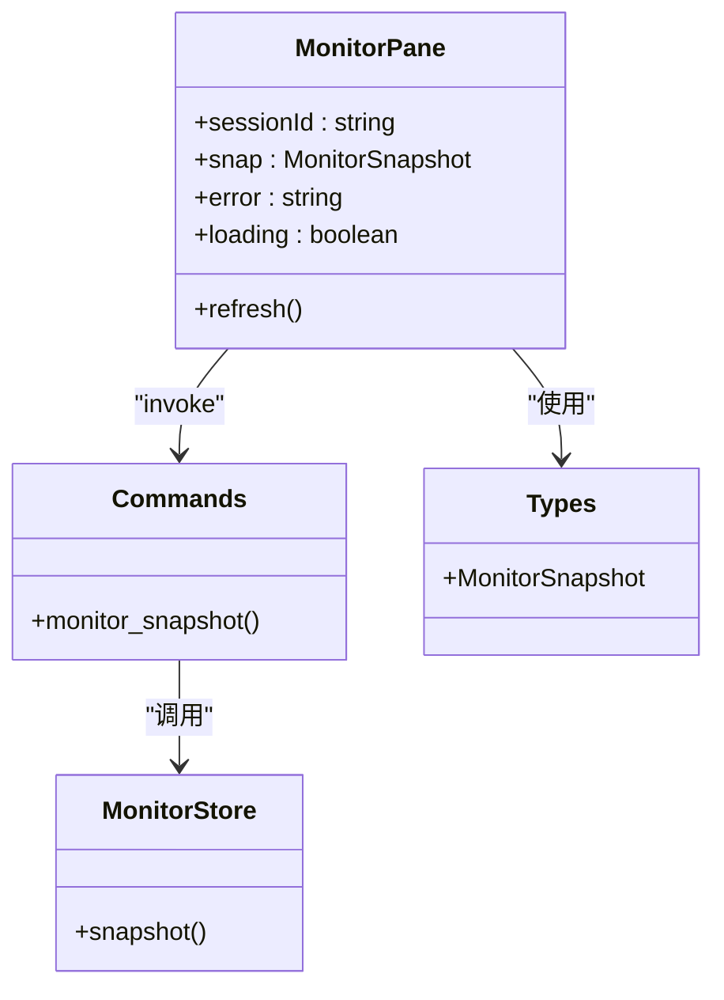
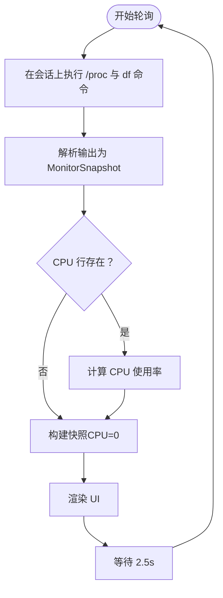
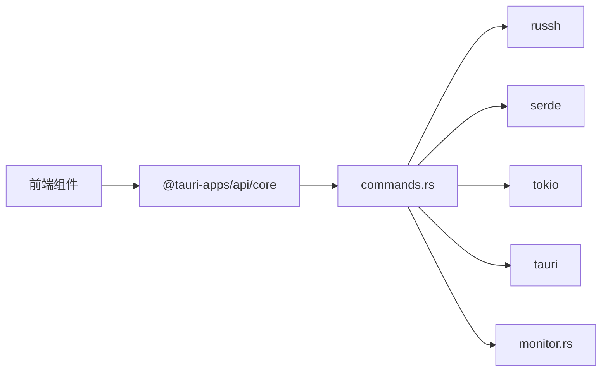

# 编辑器与监控面板

<cite>
**本文档引用的文件**
- [EditorPane.tsx](file://src/components/EditorPane.tsx)
- [MonitorPane.tsx](file://src/components/MonitorPane.tsx)
- [editorLanguages.ts](file://src/utils/editorLanguages.ts)
- [logHighlight.ts](file://src/utils/logHighlight.ts)
- [types.ts](file://src/types.ts)
- [useAppShortcuts.ts](file://src/hooks/useAppShortcuts.ts)
- [commands.rs](file://src-tauri/src/commands.rs)
- [monitor.rs](file://src-tauri/src/session/monitor.rs)
- [lib.rs](file://src-tauri/src/lib.rs)
- [App.css](file://src/App.css)
</cite>

## 目录
1. [简介](#简介)
2. [项目结构](#项目结构)
3. [核心组件](#核心组件)
4. [架构总览](#架构总览)
5. [组件详解](#组件详解)
6. [依赖关系分析](#依赖关系分析)
7. [性能考量](#性能考量)
8. [故障排查指南](#故障排查指南)
9. [结论](#结论)
10. [附录](#附录)

## 简介
本文件聚焦于编辑器与监控面板两大核心组件，系统性解析以下能力：
- 编辑器组件：远程文件读取、语法高亮、自动补全、保存机制与快捷键绑定
- 监控面板：进程监控、资源使用统计、性能指标展示与告警机制
- 组件间数据传递与状态同步：文件修改通知、实时更新与缓存管理
- 主题配置、快捷键绑定与插件扩展机制
- 监控数据可视化、历史趋势分析与导出功能
- 用户体验优化与性能调优建议

## 项目结构
前端采用 React + Tauri 架构，编辑器与监控面板位于组件层；后端 Rust 通过 Tauri 命令暴露接口，负责与 SSH 会话交互、采集系统指标与文件读写。

图表来源
- [EditorPane.tsx:16-121](file://src/components/EditorPane.tsx#L16-L121)
- [MonitorPane.tsx:57-181](file://src/components/MonitorPane.tsx#L57-L181)
- [editorLanguages.ts:1-139](file://src/utils/editorLanguages.ts#L1-L139)
- [logHighlight.ts:1-162](file://src/utils/logHighlight.ts#L1-L162)
- [types.ts:125-147](file://src/types.ts#L125-L147)
- [useAppShortcuts.ts:23-61](file://src/hooks/useAppShortcuts.ts#L23-L61)
- [commands.rs:284-360](file://src-tauri/src/commands.rs#L284-L360)
- [monitor.rs:48-79](file://src-tauri/src/session/monitor.rs#L48-L79)
- [lib.rs:14-92](file://src-tauri/src/lib.rs#L14-L92)
- [App.css:1843-1921](file://src/App.css#L1843-L1921)

章节来源
- [EditorPane.tsx:16-121](file://src/components/EditorPane.tsx#L16-L121)
- [MonitorPane.tsx:57-181](file://src/components/MonitorPane.tsx#L57-L181)
- [commands.rs:284-360](file://src-tauri/src/commands.rs#L284-L360)
- [monitor.rs:48-79](file://src-tauri/src/session/monitor.rs#L48-L79)
- [lib.rs:14-92](file://src-tauri/src/lib.rs#L14-L92)
- [App.css:1843-1921](file://src/App.css#L1843-L1921)

## 核心组件
- 编辑器组件：负责远程文件的读取、显示、编辑与保存，提供语法高亮与脏状态提示，并通过快捷键触发保存。
- 监控面板：周期性采集远程主机的 CPU、内存、负载、运行时间与磁盘使用情况，进行可视化展示与错误处理。

章节来源
- [EditorPane.tsx:16-121](file://src/components/EditorPane.tsx#L16-L121)
- [MonitorPane.tsx:57-181](file://src/components/MonitorPane.tsx#L57-L181)

## 架构总览
前端通过 Tauri invoke 调用后端命令，后端基于现有 SSH 会话执行远程命令或 SFTP 操作，返回结构化数据给前端渲染。

图表来源
- [commands.rs:284-360](file://src-tauri/src/commands.rs#L284-L360)
- [commands.rs:680-688](file://src-tauri/src/commands.rs#L680-L688)
- [monitor.rs:48-79](file://src-tauri/src/session/monitor.rs#L48-L79)
- [monitor.rs:119-197](file://src-tauri/src/session/monitor.rs#L119-L197)

## 组件详解

### 编辑器组件（EditorPane）
- 功能要点
  - 文件读取：通过 sftp_read_file 命令拉取远程文件内容，设置标题与原始内容，支持错误提示与加载态。
  - 语法高亮：根据文件扩展名自动识别语言标签，用于 UI 展示语言类型。
  - 自动补全：当前实现未集成编辑器自动补全逻辑，可通过扩展引入编辑器库实现。
  - 保存机制：检测脏状态（content 与 original 不一致），调用 sftp_write_file 写回，更新原始状态并禁用保存按钮。
  - 快捷键：监听 Ctrl/Cmd+S 触发保存，避免在可编辑元素中拦截。
  - 错误处理：网络或权限问题导致的读写失败统一捕获并展示。

- 数据流与状态
  - 输入：sessionId、filePath、onTitleChange 回调
  - 状态：content、original、loading、saving、error
  - 输出：标题更新、保存成功/失败、错误提示

- 代码级关系图

图表来源
- [EditorPane.tsx:16-121](file://src/components/EditorPane.tsx#L16-L121)
- [commands.rs:284-360](file://src-tauri/src/commands.rs#L284-L360)
- [types.ts:140-147](file://src/types.ts#L140-L147)

- 关键流程图（保存）

图表来源
- [EditorPane.tsx:46-61](file://src/components/EditorPane.tsx#L46-L61)
- [commands.rs:340-360](file://src-tauri/src/commands.rs#L340-L360)

章节来源
- [EditorPane.tsx:16-121](file://src/components/EditorPane.tsx#L16-L121)
- [editorLanguages.ts:91-101](file://src/utils/editorLanguages.ts#L91-L101)
- [useAppShortcuts.ts:23-61](file://src/hooks/useAppShortcuts.ts#L23-L61)
- [commands.rs:284-360](file://src-tauri/src/commands.rs#L284-L360)
- [types.ts:140-147](file://src/types.ts#L140-L147)

### 监控面板（MonitorPane）
- 功能要点
  - 指标采集：通过 monitor_snapshot 命令获取 CPU、内存、负载、运行时间与磁盘使用情况。
  - 实时刷新：每 2.5 秒轮询一次，支持手动刷新按钮。
  - 可视化：CPU/内存使用率以进度条展示，磁盘分区按挂载点分组展示使用率。
  - 格式化：字节转人类可读单位，uptime 转换为天/小时/分钟格式。
  - 错误处理：采集失败时展示错误信息，加载态与错误态互斥。

- 数据模型
  - MonitorSnapshot：包含 CPU 百分比、内存总量/已用/可用、负载（1/5/15）、运行时间秒数、磁盘数组。

- 代码级关系图

图表来源
- [MonitorPane.tsx:57-181](file://src/components/MonitorPane.tsx#L57-L181)
- [commands.rs:680-688](file://src-tauri/src/commands.rs#L680-L688)
- [monitor.rs:48-79](file://src-tauri/src/session/monitor.rs#L48-L79)
- [types.ts:125-136](file://src/types.ts#L125-L136)

- 关键流程图（监控采集）

图表来源
- [monitor.rs:72-117](file://src-tauri/src/session/monitor.rs#L72-L117)
- [monitor.rs:119-197](file://src-tauri/src/session/monitor.rs#L119-L197)
- [monitor.rs:199-230](file://src-tauri/src/session/monitor.rs#L199-L230)

章节来源
- [MonitorPane.tsx:57-181](file://src/components/MonitorPane.tsx#L57-L181)
- [monitor.rs:48-79](file://src-tauri/src/session/monitor.rs#L48-L79)
- [commands.rs:680-688](file://src-tauri/src/commands.rs#L680-L688)
- [types.ts:125-136](file://src/types.ts#L125-L136)

### 语法高亮与日志增强
- 语法高亮
  - 基于扩展名映射的语言识别，用于 UI 显示语言标签。
- 日志高亮
  - 提供日志行增强工具，按时间戳、级别、HTTP 状态、异常类名注入 ANSI 转义序列，便于终端查看。

章节来源
- [editorLanguages.ts:6-101](file://src/utils/editorLanguages.ts#L6-L101)
- [logHighlight.ts:1-162](file://src/utils/logHighlight.ts#L1-L162)

### 主题配置、快捷键与扩展机制
- 主题与样式
  - 深色主题变量定义，编辑器与监控面板样式独立，支持滚动条与品牌色系。
- 快捷键
  - 全局快捷键钩子，拦截 Ctrl/Cmd+N/W/T/K/P 等组合，避免在可编辑元素中触发。
- 插件扩展
  - 当前未发现编辑器自动补全与告警机制的具体实现，可在现有架构基础上扩展：
    - 编辑器自动补全：引入编辑器库并通过命令扩展实现
    - 告警机制：在 MonitorPane 中增加阈值判断与通知

章节来源
- [App.css:6-45](file://src/App.css#L6-L45)
- [App.css:1843-1921](file://src/App.css#L1843-L1921)
- [useAppShortcuts.ts:23-61](file://src/hooks/useAppShortcuts.ts#L23-L61)

## 依赖关系分析
- 前端依赖
  - @tauri-apps/api/core：invoke 调用后端命令
  - lucide-react：图标
  - 类型定义：RemoteFileContent、MonitorSnapshot
- 后端依赖
  - russh：SSH 会话与通道
  - serde：序列化
  - tokio：异步运行时
  - tauri：命令注册与插件

图表来源
- [EditorPane.tsx:2-5](file://src/components/EditorPane.tsx#L2-L5)
- [MonitorPane.tsx:2-4](file://src/components/MonitorPane.tsx#L2-L4)
- [commands.rs:3-21](file://src-tauri/src/commands.rs#L3-L21)
- [lib.rs:12-33](file://src-tauri/src/lib.rs#L12-L33)

章节来源
- [EditorPane.tsx:2-5](file://src/components/EditorPane.tsx#L2-L5)
- [MonitorPane.tsx:2-4](file://src/components/MonitorPane.tsx#L2-L4)
- [commands.rs:3-21](file://src-tauri/src/commands.rs#L3-L21)
- [lib.rs:12-33](file://src-tauri/src/lib.rs#L12-L33)

## 性能考量
- 编辑器
  - 文件大小限制：后端对读取文件大小上限为 5MB，避免大文件阻塞 UI。
  - 二进制文件检测：若包含 NUL 字节则拒绝编辑。
  - 脏状态检测：仅在内容变化时允许保存，减少不必要的写入。
- 监控面板
  - 采集间隔：2.5 秒一次，兼顾实时性与资源消耗。
  - CPU 计算：基于两次 /proc/stat 的差分，避免首次采样误差。
  - 错误快速反馈：失败时立即展示错误，避免长时间无响应。
- UI 与交互
  - 按需渲染：加载态与错误态互斥，提升感知速度。
  - 滚动条与动画：合理使用滚动条与微动画，避免过度渲染。

章节来源
- [commands.rs:293-305](file://src-tauri/src/commands.rs#L293-L305)
- [commands.rs:322-329](file://src-tauri/src/commands.rs#L322-L329)
- [monitor.rs:199-230](file://src-tauri/src/session/monitor.rs#L199-L230)
- [MonitorPane.tsx:76-88](file://src/components/MonitorPane.tsx#L76-L88)

## 故障排查指南
- 编辑器
  - 无法读取文件：检查 sessionId 与路径是否正确；关注错误提示中的权限或大小限制。
  - 无法保存：确认 isDirty 状态；检查网络与权限；查看错误条。
  - 二进制文件：后端检测到 NUL 字节会拒绝编辑。
- 监控面板
  - 非 Linux 主机：监控脚本退出码非零会报错；确保目标主机为 Linux。
  - 首次 CPU 采样：由于需要两次 /proc/stat 差分，首次刷新可能显示 0。
  - 磁盘采集：忽略 tmpfs/devtmpfs/squashfs 等临时文件系统。
- 快捷键
  - 在输入框中不会触发全局快捷键，避免误操作。

章节来源
- [commands.rs:300-305](file://src-tauri/src/commands.rs#L300-L305)
- [commands.rs:322-329](file://src-tauri/src/commands.rs#L322-L329)
- [monitor.rs:106-111](file://src-tauri/src/session/monitor.rs#L106-L111)
- [monitor.rs:67-70](file://src-tauri/src/session/monitor.rs#L67-L70)
- [useAppShortcuts.ts:12-18](file://src/hooks/useAppShortcuts.ts#L12-L18)

## 结论
本项目在编辑器与监控面板方面实现了清晰的职责分离与稳定的前后端交互。编辑器组件具备基本的远程读写与保存能力，监控面板提供关键系统指标的可视化展示。未来可在以下方面进一步增强：
- 编辑器：引入自动补全与主题扩展
- 监控面板：增加阈值告警与历史趋势分析
- 数据导出：支持将监控数据导出为 CSV/JSON

## 附录
- 样式与主题
  - 编辑器与监控面板样式分别定义，支持滚动条与品牌色系。
- 类型定义
  - RemoteFileContent、MonitorSnapshot 等类型在前端与后端保持一致，确保数据契约稳定。

章节来源
- [App.css:1843-1921](file://src/App.css#L1843-L1921)
- [types.ts:140-147](file://src/types.ts#L140-L147)
- [types.ts:125-136](file://src/types.ts#L125-L136)