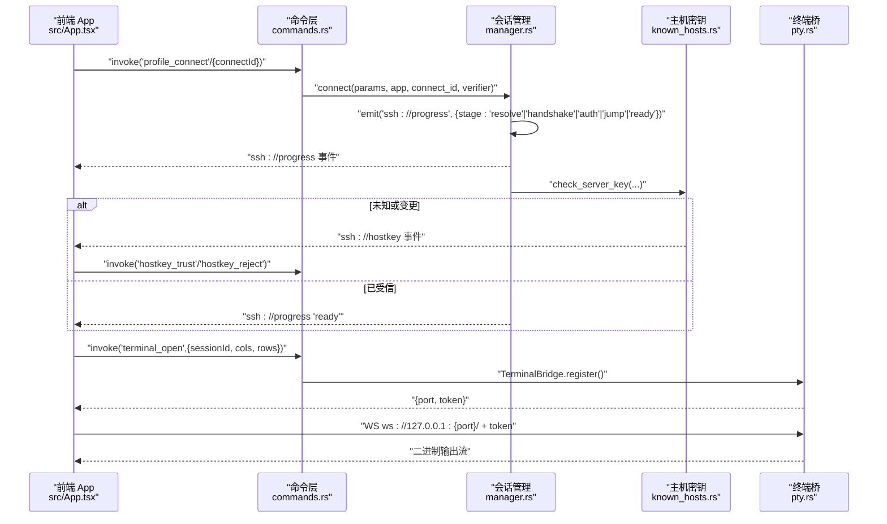
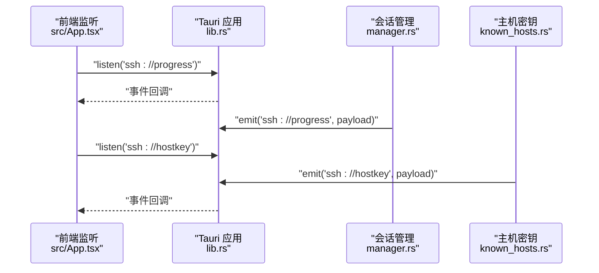
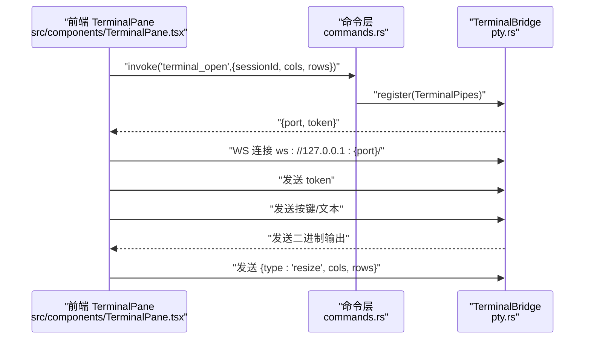
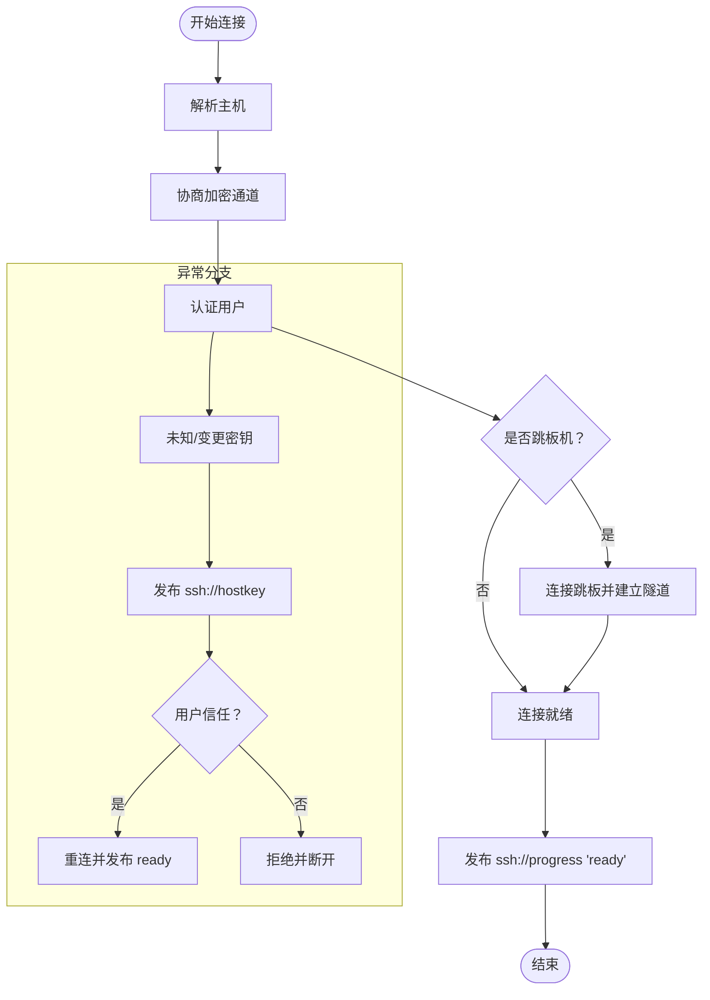
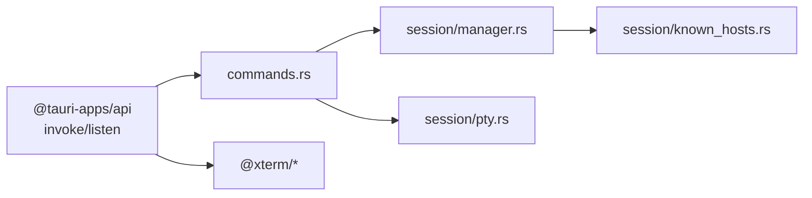

# 事件通信

<cite>
**本文档引用的文件**
- [src-tauri/src/lib.rs](file://src-tauri/src/lib.rs)
- [src-tauri/src/main.rs](file://src-tauri/src/main.rs)
- [src-tauri/src/commands.rs](file://src-tauri/src/commands.rs)
- [src-tauri/src/session/mod.rs](file://src-tauri/src/session/mod.rs)
- [src-tauri/src/session/manager.rs](file://src-tauri/src/session/manager.rs)
- [src-tauri/src/session/pty.rs](file://src-tauri/src/session/pty.rs)
- [src-tauri/src/session/known_hosts.rs](file://src-tauri/src/session/known_hosts.rs)
- [src-tauri/src/session/forward.rs](file://src-tauri/src/session/forward.rs)
- [src-tauri/src/session/sftp.rs](file://src-tauri/src/session/sftp.rs)
- [src/App.tsx](file://src/App.tsx)
- [src/components/TerminalPane.tsx](file://src/components/TerminalPane.tsx)
- [src/types.ts](file://src/types.ts)
- [src/main.tsx](file://src/main.tsx)
</cite>

## 目录
1. [简介](#简介)
2. [项目结构](#项目结构)
3. [核心组件](#核心组件)
4. [架构总览](#架构总览)
5. [详细组件分析](#详细组件分析)
6. [依赖关系分析](#依赖关系分析)
7. [性能考量](#性能考量)
8. [故障排查指南](#故障排查指南)
9. [结论](#结论)
10. [附录](#附录)

## 简介
本文件系统性梳理简化 SSH 客户端的事件通信机制，重点覆盖：
- Tauri IPC 事件监听与自定义事件的发布/订阅
- WebSocket 在终端数据传输中的应用与桥接
- 连接进度事件、主机密钥验证事件等自定义事件的创建与传播
- 事件订阅管理、内存泄漏防护与异步事件处理最佳实践
- 事件流程图与代码示例路径，帮助构建可靠的前后端通信管道

## 项目结构
该项目采用 Tauri 双端架构：前端使用 React + TypeScript，后端使用 Rust。事件通信主要通过以下路径实现：
- 前端通过 @tauri-apps/api 的 invoke 与 listen 与后端交互
- 后端通过 tauri::Emitter 发布自定义事件
- 终端场景通过本地 WebSocket 与 PTY 通道桥接

```mermaid
graph TB
subgraph "前端"
FE_App["React 应用<br/>src/App.tsx"]
FE_Term["TerminalPane 组件<br/>src/components/TerminalPane.tsx"]
FE_Listen["事件监听 listen()<br/>@tauri-apps/api/event"]
end
subgraph "Tauri 后端"
RS_Lib["后端入口 lib.rs<br/>注册命令/状态/插件"]
RS_Cmd["命令模块 commands.rs<br/>暴露 invoke 接口"]
RS_SessMgr["会话管理 manager.rs<br/>连接进度事件"]
RS_KH["主机密钥 known_hosts.rs<br/>ssh://hostkey 事件"]
RS_PTYSrv["终端桥 pty.rs<br/>本地 WS 服务"]
end
FE_Listen --> |"listen('ssh://progress')<br/>listen('ssh://hostkey')"| FE_App
FE_App --> |"invoke('ssh_connect'/'profile_connect')"| RS_Cmd
RS_Cmd --> |"state.get()/connect()"| RS_SessMgr
RS_SessMgr --> |"emit('ssh://progress')"| FE_Listen
RS_KH --> |"emit('ssh://hostkey')"| FE_Listen
FE_Term --> |"invoke('terminal_open')"| RS_Cmd
RS_Cmd --> |"TerminalBridge.register()"/"TerminalBridge.start()"| RS_PTYSrv
FE_Term --> |"WS ws://127.0.0.1:{port}/"| RS_PTYSrv
```

图表来源
- [src-tauri/src/lib.rs:20-91](file://src-tauri/src/lib.rs#L20-L91)
- [src-tauri/src/commands.rs:42-72](file://src-tauri/src/commands.rs#L42-L72)
- [src-tauri/src/session/manager.rs:39-48](file://src-tauri/src/session/manager.rs#L39-L48)
- [src-tauri/src/session/known_hosts.rs:47-61](file://src-tauri/src/session/known_hosts.rs#L47-L61)
- [src-tauri/src/session/pty.rs:47-85](file://src-tauri/src/session/pty.rs#L47-L85)
- [src/App.tsx:136-160](file://src/App.tsx#L136-L160)
- [src/components/TerminalPane.tsx:103-135](file://src/components/TerminalPane.tsx#L103-L135)

章节来源
- [src-tauri/src/lib.rs:14-91](file://src-tauri/src/lib.rs#L14-L91)
- [src-tauri/src/main.rs:4-6](file://src-tauri/src/main.rs#L4-L6)
- [src/App.tsx:136-160](file://src/App.tsx#L136-L160)
- [src/components/TerminalPane.tsx:103-135](file://src/components/TerminalPane.tsx#L103-L135)

## 核心组件
- 事件发布者（后端）
  - 连接进度事件：在会话建立过程中，按阶段向前端推送 ssh://progress 事件
  - 主机密钥事件：在握手阶段检测到未知或变更的主机密钥时，推送 ssh://hostkey 事件
- 事件订阅者（前端）
  - 使用 listen 监听 ssh://progress 与 ssh://hostkey，驱动 UI 状态与对话框
- 终端桥接（后端）
  - 启动本地 WebSocket 服务，为每个 terminal_open 请求生成一次性 token，并将 PTY 数据通过 WS 传输
- 命令层（后端）
  - 提供 ssh_connect、profile_connect、terminal_open 等命令，承载事件发布与桥接逻辑

章节来源
- [src-tauri/src/session/manager.rs:31-48](file://src-tauri/src/session/manager.rs#L31-L48)
- [src-tauri/src/session/known_hosts.rs:47-61](file://src-tauri/src/session/known_hosts.rs#L47-L61)
- [src-tauri/src/commands.rs:42-72](file://src-tauri/src/commands.rs#L42-L72)
- [src-tauri/src/session/pty.rs:47-85](file://src-tauri/src/session/pty.rs#L47-L85)
- [src/App.tsx:136-160](file://src/App.tsx#L136-L160)

## 架构总览
下图展示了从前端发起连接到后端事件发布的完整链路，以及终端数据通过本地 WebSocket 的桥接路径。



图表来源
- [src-tauri/src/commands.rs:42-72](file://src-tauri/src/commands.rs#L42-L72)
- [src-tauri/src/session/manager.rs:82-145](file://src-tauri/src/session/manager.rs#L82-L145)
- [src-tauri/src/session/known_hosts.rs:118-160](file://src-tauri/src/session/known_hosts.rs#L118-L160)
- [src-tauri/src/session/pty.rs:75-104](file://src-tauri/src/session/pty.rs#L75-L104)
- [src/App.tsx:136-160](file://src/App.tsx#L136-L160)
- [src/components/TerminalPane.tsx:103-135](file://src/components/TerminalPane.tsx#L103-L135)

## 详细组件分析

### Tauri IPC 事件监听与自定义事件
- 事件类型与载荷
  - 连接进度事件："ssh://progress"，载荷包含 connect_id、stage、message
  - 主机密钥事件："ssh://hostkey"，载荷包含 connect_id、kind、host、port、algorithm、fingerprint、line
- 前端监听与订阅管理
  - 使用 listen 监听上述事件，返回 unlisten 函数用于清理
  - 在组件卸载时调用 unlisten，防止内存泄漏
- 后端事件发布
  - 会话管理器在连接各阶段调用 emit_progress 发布 ssh://progress
  - 主机密钥模块在 check_server_key 中根据校验结果发布 ssh://hostkey



图表来源
- [src/App.tsx:136-160](file://src/App.tsx#L136-L160)
- [src-tauri/src/session/manager.rs:39-48](file://src-tauri/src/session/manager.rs#L39-L48)
- [src-tauri/src/session/known_hosts.rs:144-155](file://src-tauri/src/session/known_hosts.rs#L144-L155)
- [src-tauri/src/lib.rs:43-89](file://src-tauri/src/lib.rs#L43-L89)

章节来源
- [src/App.tsx:136-160](file://src/App.tsx#L136-L160)
- [src/types.ts:107-116](file://src/types.ts#L107-L116)
- [src-tauri/src/session/manager.rs:31-48](file://src-tauri/src/session/manager.rs#L31-L48)
- [src-tauri/src/session/known_hosts.rs:47-61](file://src-tauri/src/session/known_hosts.rs#L47-L61)

### WebSocket 通信模式与终端数据传输
- 终端打开流程
  - 前端调用 terminal_open，后端在指定会话上开启 PTY 并启动桥接任务
  - 后端启动本地 WebSocket 服务，返回 {port, token}
  - 前端以 WS 连接 ws://127.0.0.1:{port}/，首条消息发送 token
- 数据通路
  - 前端按键输入 → WS 二进制消息 → 后端 mpsc → PTY channel → 远端
  - 远端输出 → PTY channel → 后端 mpsc → WS 二进制消息 → 前端渲染
- 控制消息
  - 前端发送 {"type":"resize","cols":N,"rows":M} 触发窗口大小变化



图表来源
- [src/components/TerminalPane.tsx:103-135](file://src/components/TerminalPane.tsx#L103-L135)
- [src-tauri/src/commands.rs:107-186](file://src-tauri/src/commands.rs#L107-L186)
- [src-tauri/src/session/pty.rs:75-141](file://src-tauri/src/session/pty.rs#L75-L141)

章节来源
- [src-tauri/src/commands.rs:107-186](file://src-tauri/src/commands.rs#L107-L186)
- [src-tauri/src/session/pty.rs:22-40](file://src-tauri/src/session/pty.rs#L22-L40)
- [src/components/TerminalPane.tsx:103-135](file://src/components/TerminalPane.tsx#L103-L135)

### 自定义事件：连接进度与主机密钥
- 连接进度事件（ssh://progress）
  - 事件来源：会话管理器在 resolve、handshake、auth、jump、ready 等阶段发布
  - 前端消费：显示连接步骤与消息，驱动 UI 状态
- 主机密钥事件（ssh://hostkey）
  - 事件来源：握手阶段检测到未知或变更密钥时发布
  - 前端消费：弹出对话框，用户选择信任或拒绝；信任后调用 hostkey_trust 重连



图表来源
- [src-tauri/src/session/manager.rs:82-145](file://src-tauri/src/session/manager.rs#L82-L145)
- [src-tauri/src/session/known_hosts.rs:118-160](file://src-tauri/src/session/known_hosts.rs#L118-L160)
- [src/App.tsx:136-160](file://src/App.tsx#L136-L160)

章节来源
- [src-tauri/src/session/manager.rs:31-48](file://src-tauri/src/session/manager.rs#L31-L48)
- [src-tauri/src/session/known_hosts.rs:47-61](file://src-tauri/src/session/known_hosts.rs#L47-L61)
- [src/App.tsx:136-160](file://src/App.tsx#L136-L160)

### 事件订阅管理与内存泄漏防护
- 订阅管理
  - 使用 useEffect 注册监听，返回 unlisten 函数
  - 在组件卸载时调用 unlisten，确保事件解绑
- 异步处理最佳实践
  - 事件回调中避免长时间阻塞，必要时拆分为小任务
  - 对于可能频繁触发的事件（如 resize），建议前端侧做节流/防抖
- 生命周期注意
  - 严格区分“稳定单次生命周期”的组件（如终端），避免 StrictMode 导致的重复挂载

章节来源
- [src/App.tsx:136-160](file://src/App.tsx#L136-L160)
- [src/main.tsx:10-19](file://src/main.tsx#L10-L19)

### 错误处理策略
- 连接阶段
  - TCP 连接超时、SSH 握手超时、认证超时均有明确错误提示
  - 主机密钥未知或变更时，前端弹窗并等待用户确认
- 终端桥接
  - WS 首条消息必须为 token，否则视为协议错误
  - 通道关闭时触发 onConnectionLost 回调，用于断线重连
- 命令层
  - invoke 返回的错误统一转换为字符串，前端 toast 展示

章节来源
- [src-tauri/src/session/manager.rs:255-273](file://src-tauri/src/session/manager.rs#L255-L273)
- [src-tauri/src/session/pty.rs:87-104](file://src-tauri/src/session/pty.rs#L87-L104)
- [src-tauri/src/commands.rs:27-38](file://src-tauri/src/commands.rs#L27-L38)

## 依赖关系分析
- 前端依赖
  - @tauri-apps/api：invoke 与 listen
  - xterm.js：终端渲染与搜索
- 后端依赖
  - russh：SSH 连接与通道
  - russh-sftp：SFTP 子系统
  - tokio_tungstenite：WebSocket 服务
  - uuid：一次性 token 生成



图表来源
- [src-tauri/src/commands.rs:1-22](file://src-tauri/src/commands.rs#L1-L22)
- [src-tauri/src/session/manager.rs:1-22](file://src-tauri/src/session/manager.rs#L1-L22)
- [src-tauri/src/session/pty.rs:1-21](file://src-tauri/src/session/pty.rs#L1-L21)
- [src-tauri/src/session/known_hosts.rs:1-23](file://src-tauri/src/session/known_hosts.rs#L1-L23)
- [src/components/TerminalPane.tsx:1-10](file://src/components/TerminalPane.tsx#L1-L10)

章节来源
- [src-tauri/src/commands.rs:1-22](file://src-tauri/src/commands.rs#L1-L22)
- [src-tauri/src/session/pty.rs:1-21](file://src-tauri/src/session/pty.rs#L1-L21)

## 性能考量
- 事件频率控制
  - 连接进度事件按阶段推送，避免高频轮询
  - 终端 resize 建议前端做节流，减少通道窗口调整频率
- 通道与缓冲
  - mpsc 缓冲大小适配（默认 64/8），避免阻塞主事件循环
- I/O 优化
  - WebSocket 使用二进制传输，减少编码开销
  - SFTP 复用会话连接，避免重复认证

## 故障排查指南
- 无法打开终端
  - 检查 terminal_open 是否成功返回 {port, token}
  - 确认 WS 首条消息为 token，且 WS 状态为 OPEN
- 连接卡在某个阶段
  - 查看 ssh://progress 事件是否持续推送
  - 检查 TCP/SSH 超时配置与网络连通性
- 主机密钥弹窗不出现
  - 确认 ssh://hostkey 事件监听已注册
  - 检查握手阶段是否触发 check_server_key
- 断线重连
  - 监听 WS onclose，触发 onConnectionLost 回调
  - 前端根据会话状态与设置决定是否自动重连

章节来源
- [src-tauri/src/session/pty.rs:87-104](file://src-tauri/src/session/pty.rs#L87-L104)
- [src-tauri/src/session/manager.rs:255-273](file://src-tauri/src/session/manager.rs#L255-L273)
- [src/App.tsx:136-160](file://src/App.tsx#L136-L160)
- [src/components/TerminalPane.tsx:128-131](file://src/components/TerminalPane.tsx#L128-L131)

## 结论
本项目通过 Tauri IPC 与本地 WebSocket 实现了高效、可控的前后端事件通信：
- 事件驱动的连接进度与主机密钥确认，提升了用户体验与安全性
- 终端桥接将 PTY 数据通过 WS 低延迟传输，满足实时交互需求
- 清晰的订阅管理与错误处理策略，保障了系统的稳定性与可维护性

## 附录
- 事件类型与载荷参考
  - ssh://progress：connect_id、stage、message
  - ssh://hostkey：connect_id、kind、host、port、algorithm、fingerprint、line
- 关键命令参考
  - ssh_connect/profile_connect：建立持久会话并发布连接进度事件
  - terminal_open：开启 PTY 并启动本地 WS 服务
  - hostkey_trust/hostkey_reject：处理主机密钥确认

章节来源
- [src/types.ts:107-116](file://src/types.ts#L107-L116)
- [src-tauri/src/commands.rs:42-72](file://src-tauri/src/commands.rs#L42-L72)
- [src-tauri/src/session/pty.rs:47-85](file://src-tauri/src/session/pty.rs#L47-L85)