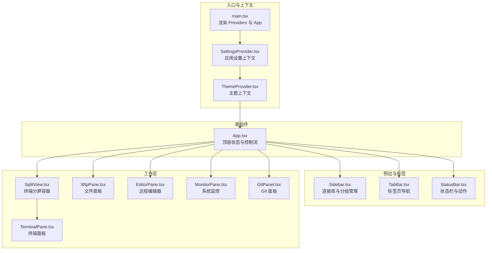
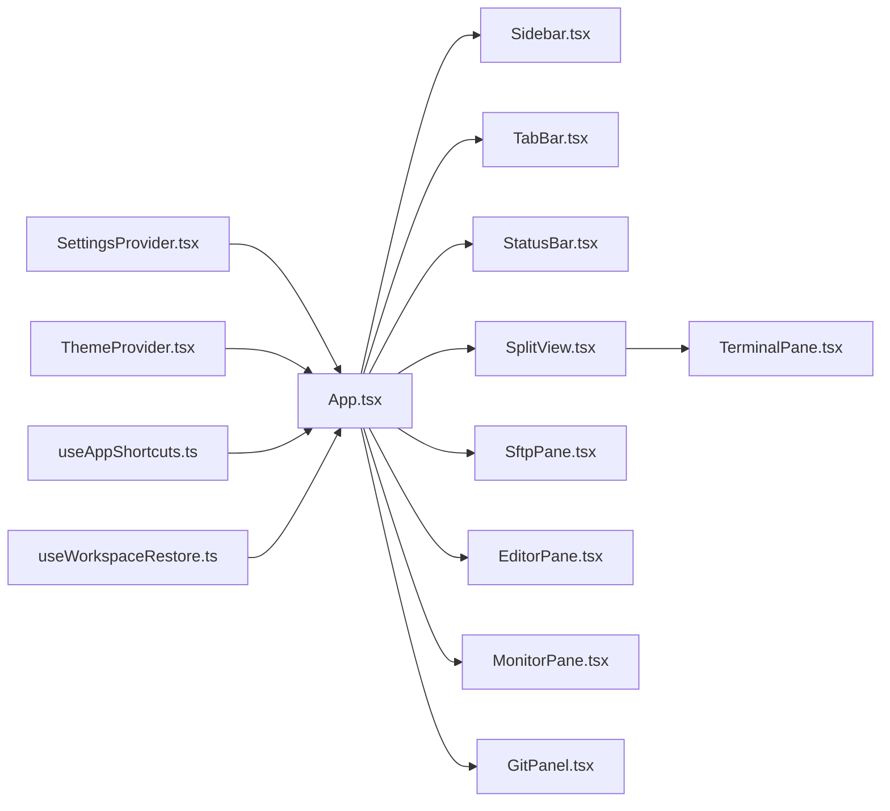
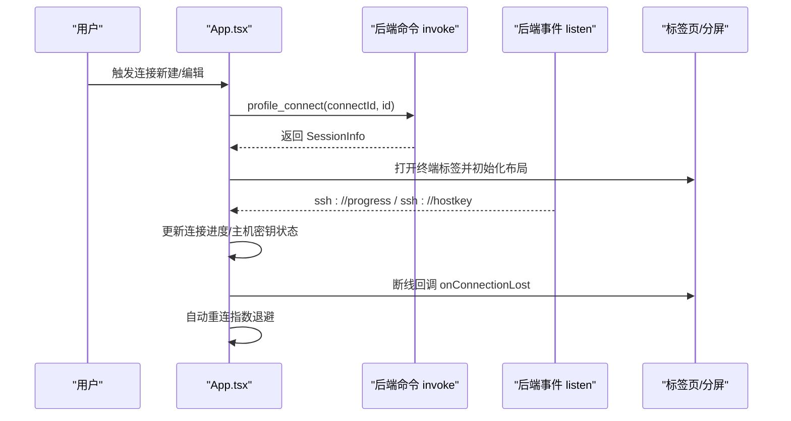
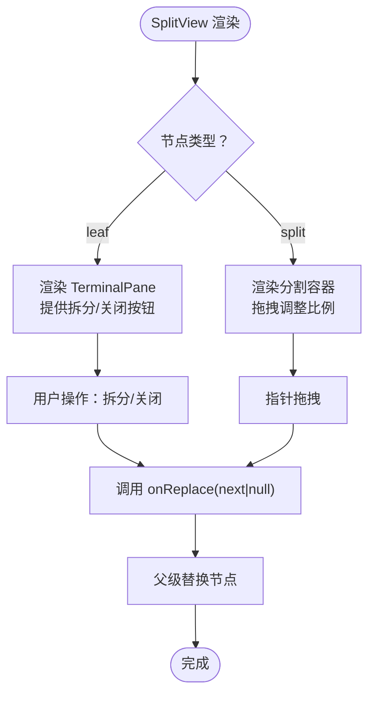
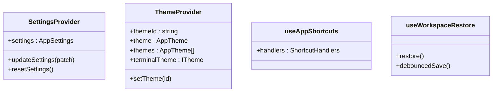
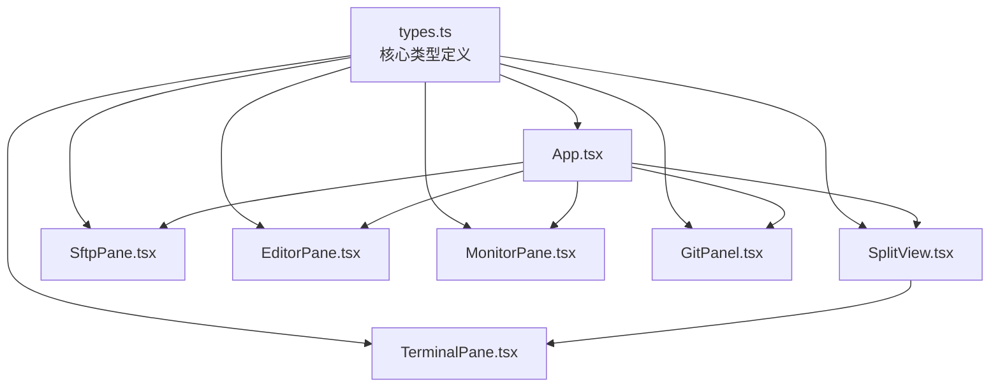

# 前端组件架构

<cite>
**本文档引用的文件**
- [src/App.tsx](file://src/App.tsx)
- [src/main.tsx](file://src/main.tsx)
- [src/components/Sidebar.tsx](file://src/components/Sidebar.tsx)
- [src/components/TabBar.tsx](file://src/components/TabBar.tsx)
- [src/components/TerminalPane.tsx](file://src/components/TerminalPane.tsx)
- [src/components/SftpPane.tsx](file://src/components/SftpPane.tsx)
- [src/components/SplitView.tsx](file://src/components/SplitView.tsx)
- [src/components/EditorPane.tsx](file://src/components/EditorPane.tsx)
- [src/components/MonitorPane.tsx](file://src/components/MonitorPane.tsx)
- [src/components/GitPanel.tsx](file://src/components/GitPanel.tsx)
- [src/components/StatusBar.tsx](file://src/components/StatusBar.tsx)
- [src/types.ts](file://src/types.ts)
- [src/settings/SettingsProvider.tsx](file://src/settings/SettingsProvider.tsx)
- [src/settings/types.ts](file://src/settings/types.ts)
- [src/theme/ThemeProvider.tsx](file://src/theme/ThemeProvider.tsx)
- [src/themes/types.ts](file://src/themes/types.ts)
- [src/hooks/useAppShortcuts.ts](file://src/hooks/useAppShortcuts.ts)
- [src/hooks/useWorkspaceRestore.ts](file://src/hooks/useWorkspaceRestore.ts)
</cite>

## 目录
1. [简介](#简介)
2. [项目结构](#项目结构)
3. [核心组件](#核心组件)
4. [架构总览](#架构总览)
5. [组件详解](#组件详解)
6. [依赖关系分析](#依赖关系分析)
7. [性能考量](#性能考量)
8. [故障排查指南](#故障排查指南)
9. [结论](#结论)
10. [附录](#附录)

## 简介
本文件系统性梳理简化 SSH 客户端前端组件架构，聚焦 React 组件体系的组织方式、设计模式与交互流程。重点覆盖根组件 App 的职责边界、组件层次结构、状态管理模式、组件间通信机制，并深入解析 Sidebar、TabBar、TerminalPane、SftpPane 等关键组件的实现细节与职责分工。同时总结组件复用模式、性能优化策略与可访问性设计，提供最佳实践与参考路径。

## 项目结构
前端采用以功能域为中心的分层组织：根组件负责顶层状态与控制流，各功能面板作为独立子组件，共享 Settings 与 Theme 上下文；工具层通过自定义 Hook 提供横切能力（快捷键、工作区恢复、更新检测等）。

图表来源
- [src/main.tsx:13-19](file://src/main.tsx#L13-L19)
- [src/App.tsx:530-681](file://src/App.tsx#L530-L681)
- [src/components/Sidebar.tsx:111-210](file://src/components/Sidebar.tsx#L111-L210)
- [src/components/TabBar.tsx:19-57](file://src/components/TabBar.tsx#L19-L57)
- [src/components/StatusBar.tsx:26-95](file://src/components/StatusBar.tsx#L26-L95)
- [src/components/SplitView.tsx:21-39](file://src/components/SplitView.tsx#L21-L39)
- [src/components/TerminalPane.tsx:23-149](file://src/components/TerminalPane.tsx#L23-L149)
- [src/components/SftpPane.tsx:30-303](file://src/components/SftpPane.tsx#L30-L303)
- [src/components/EditorPane.tsx:16-120](file://src/components/EditorPane.tsx#L16-L120)
- [src/components/MonitorPane.tsx:57-180](file://src/components/MonitorPane.tsx#L57-L180)
- [src/components/GitPanel.tsx:30-286](file://src/components/GitPanel.tsx#L30-L286)

章节来源
- [src/main.tsx:13-19](file://src/main.tsx#L13-L19)
- [src/App.tsx:530-681](file://src/App.tsx#L530-L681)

## 核心组件
- 根组件 App：集中管理连接、会话、标签页、分屏布局、对话框与全局提示；订阅后端事件，驱动自动重连与主机密钥确认；通过命令面板与快捷键增强操作效率。
- 侧边栏 Sidebar：按分组树形展示连接档案，支持折叠/展开、新建/重命名/删除分组，以及连接档案的编辑与删除。
- 标签栏 TabBar：展示当前打开的标签页，支持切换、关闭与新建连接。
- 终端分屏 SplitView：递归渲染 SplitNode 树，支持叶子面板水平/垂直拆分、拖拽调整比例、关闭面板收缩。
- 终端面板 TerminalPane：封装 xterm.js 与 WebSocket，负责终端初始化、尺寸适配、输入输出、搜索与主题联动。
- 文件面板 SftpPane：远程文件浏览、上传/下载（入队）、新建/重命名/删除、目录同步。
- 编辑器 EditorPane：远程文件读写、语言识别、脏状态与保存。
- 监控面板 MonitorPane：周期拉取系统指标并可视化展示。
- Git 面板 GitPanel：仓库状态、提交历史、分支与 worktree 管理。
- 状态栏 StatusBar：显示连接状态、会话信息与常用动作入口。
- SettingsProvider/ThemeProvider：应用设置与主题上下文，提供持久化与主题切换能力。
- 自定义 Hook：useAppShortcuts（全局快捷键）、useWorkspaceRestore（工作区持久化）。

章节来源
- [src/App.tsx:60-682](file://src/App.tsx#L60-L682)
- [src/components/Sidebar.tsx:27-211](file://src/components/Sidebar.tsx#L27-L211)
- [src/components/TabBar.tsx:12-58](file://src/components/TabBar.tsx#L12-L58)
- [src/components/SplitView.tsx:21-151](file://src/components/SplitView.tsx#L21-L151)
- [src/components/TerminalPane.tsx:23-198](file://src/components/TerminalPane.tsx#L23-L198)
- [src/components/SftpPane.tsx:30-312](file://src/components/SftpPane.tsx#L30-L312)
- [src/components/EditorPane.tsx:16-121](file://src/components/EditorPane.tsx#L16-L121)
- [src/components/MonitorPane.tsx:57-181](file://src/components/MonitorPane.tsx#L57-L181)
- [src/components/GitPanel.tsx:30-305](file://src/components/GitPanel.tsx#L30-L305)
- [src/components/StatusBar.tsx:16-97](file://src/components/StatusBar.tsx#L16-L97)
- [src/settings/SettingsProvider.tsx:37-79](file://src/settings/SettingsProvider.tsx#L37-L79)
- [src/theme/ThemeProvider.tsx:70-107](file://src/theme/ThemeProvider.tsx#L70-L107)
- [src/hooks/useAppShortcuts.ts:23-60](file://src/hooks/useAppShortcuts.ts#L23-L60)
- [src/hooks/useWorkspaceRestore.ts:28-158](file://src/hooks/useWorkspaceRestore.ts#L28-L158)

## 架构总览
应用采用“根组件集中状态 + 子组件职责清晰”的模式。根组件通过 props 向子组件传递数据与回调，子组件通过回调向上游回传状态变更；上下文提供主题与设置的跨层级访问；Hook 抽象通用行为（快捷键、工作区恢复）。

图表来源
- [src/App.tsx:530-681](file://src/App.tsx#L530-L681)
- [src/main.tsx:13-19](file://src/main.tsx#L13-L19)
- [src/hooks/useAppShortcuts.ts:23-60](file://src/hooks/useAppShortcuts.ts#L23-L60)
- [src/hooks/useWorkspaceRestore.ts:28-158](file://src/hooks/useWorkspaceRestore.ts#L28-L158)

## 组件详解

### 根组件 App 设计与控制流
- 状态与数据源
  - 连接档案、分组、会话列表、标签页集合、活动标签、连接进度、主机密钥事件、提示消息、命令面板开关等。
  - 通过后端命令（invoke）拉取与更新数据，监听后端事件（listen）处理连接进度与主机密钥。
- 控制流
  - 打开/关闭标签页、切换活动标签、更新分屏布局、断开会话、自动重连（指数退避）、主机密钥信任/拒绝。
  - 通过命令面板与快捷键触发新建连接、关闭标签、切换标签、打开设置等。
- 工作区持久化
  - 启动时加载快照并串行重连，标签变化后去抖保存快照；分屏布局中的 sessionId 替换以保证重连一致性。
- 对话框与全局提示
  - 连接中进度卡片、设置对话框、主机密钥确认对话框、全局 toast 提示。

图表来源
- [src/App.tsx:312-408](file://src/App.tsx#L312-L408)
- [src/App.tsx:122-160](file://src/App.tsx#L122-L160)
- [src/App.tsx:280-290](file://src/App.tsx#L280-L290)
- [src/hooks/useWorkspaceRestore.ts:45-117](file://src/hooks/useWorkspaceRestore.ts#L45-L117)

章节来源
- [src/App.tsx:60-682](file://src/App.tsx#L60-L682)
- [src/hooks/useWorkspaceRestore.ts:28-158](file://src/hooks/useWorkspaceRestore.ts#L28-L158)

### Sidebar：连接库与分组管理
- 职责
  - 展示连接档案与分组，支持折叠/展开、新建/重命名/删除分组，连接项的编辑与删除。
- Props 接口
  - profiles: ConnectionProfile[]
  - groups: ProfileGroup[]
  - onConnectProfile(id)
  - onEditProfile(profile)
  - onDeleteProfile(id)
  - onCreateGroup(name)
  - onRenameGroup(id, name)
  - onDeleteGroup(id)
  - onNew()
- 交互要点
  - 使用本地状态维护分组折叠状态；通过回调向上游传递操作意图；未分组项单独展示。

章节来源
- [src/components/Sidebar.tsx:14-24](file://src/components/Sidebar.tsx#L14-L24)
- [src/components/Sidebar.tsx:27-211](file://src/components/Sidebar.tsx#L27-L211)

### TabBar：标签页导航
- 职责
  - 展示当前标签页，根据标签类型显示不同图标；支持激活、关闭与新建连接。
- Props 接口
  - tabs: Tab[]
  - activeTabId: string | null
  - onActivate(id)
  - onClose(id)
  - onNew()

章节来源
- [src/components/TabBar.tsx:4-10](file://src/components/TabBar.tsx#L4-L10)
- [src/components/TabBar.tsx:12-58](file://src/components/TabBar.tsx#L12-L58)

### SplitView 与 TerminalPane：终端分屏与面板
- SplitView
  - 递归渲染 SplitNode 树，支持叶子面板水平/垂直拆分、拖拽调整比例、关闭面板收缩。
  - 通过 onReplace 回调向父级替换/关闭节点，onChange 回调更新整棵布局树。
- TerminalPane
  - 初始化 xterm.js、fit 插件与 WebGL 插件；监听窗口尺寸变化并防抖发送 resize；处理键盘输入与远端输出；支持 Ctrl+F 搜索；主题联动；断线回调 onConnectionLost。
  - 通过后端命令打开终端 WebSocket 并进行认证令牌交换。

图表来源
- [src/components/SplitView.tsx:21-151](file://src/components/SplitView.tsx#L21-L151)
- [src/components/TerminalPane.tsx:23-149](file://src/components/TerminalPane.tsx#L23-L149)

章节来源
- [src/components/SplitView.tsx:21-151](file://src/components/SplitView.tsx#L21-L151)
- [src/components/TerminalPane.tsx:23-198](file://src/components/TerminalPane.tsx#L23-L198)

### SftpPane：文件面板
- 职责
  - 浏览远程文件系统，进入目录、上传/下载（入队）、新建/重命名/删除、目录同步。
- Props 接口
  - sessionId: string
  - onFileOpen?: (filePath: string) => void
- 数据与状态
  - 当前目录、路径输入、条目列表、选中项、加载/错误/忙碌状态、同步对话框开关。
- 事件处理
  - 目录进入（双击文件/文件夹）、路径回车跳转、上传/下载、新建文件夹、重命名、删除、同步。

章节来源
- [src/components/SftpPane.tsx:19-23](file://src/components/SftpPane.tsx#L19-L23)
- [src/components/SftpPane.tsx:30-312](file://src/components/SftpPane.tsx#L30-L312)

### EditorPane：远程编辑器
- 职责
  - 读取/保存远程文件，语言识别，脏状态检测，保存快捷键（Ctrl+S）。
- Props 接口
  - sessionId: string
  - filePath: string
  - onTitleChange?: (title: string) => void

章节来源
- [src/components/EditorPane.tsx:7-11](file://src/components/EditorPane.tsx#L7-L11)
- [src/components/EditorPane.tsx:16-121](file://src/components/EditorPane.tsx#L16-L121)

### MonitorPane：系统监控
- 职责
  - 周期拉取系统指标（CPU/内存/负载/磁盘），格式化展示。
- Props 接口
  - sessionId: string

章节来源
- [src/components/MonitorPane.tsx:6-8](file://src/components/MonitorPane.tsx#L6-L8)
- [src/components/MonitorPane.tsx:57-181](file://src/components/MonitorPane.tsx#L57-L181)

### GitPanel：Git 面板
- 职责
  - 展示仓库状态、提交历史、分支与 worktree 管理；支持查看差异、切换分支、删除 worktree。
- Props 接口
  - sessionId: string
  - repoPath: string
  - onOpenFile?: (filePath: string) => void

章节来源
- [src/components/GitPanel.tsx:19-23](file://src/components/GitPanel.tsx#L19-L23)
- [src/components/GitPanel.tsx:30-305](file://src/components/GitPanel.tsx#L30-L305)

### StatusBar：状态栏
- 职责
  - 显示连接状态与会话信息，提供打开监控/Git/文件、断开连接、打开设置、命令面板等入口。
- Props 接口
  - session: SessionInfo | null
  - tabCount: number
  - onOpenSftp()
  - onOpenMonitor()
  - onOpenGit()
  - onDisconnect()
  - onOpenSettings()
  - onOpenCommandPalette?()

章节来源
- [src/components/StatusBar.tsx:5-14](file://src/components/StatusBar.tsx#L5-L14)
- [src/components/StatusBar.tsx:16-97](file://src/components/StatusBar.tsx#L16-L97)

### 上下文与 Hook：状态管理模式
- SettingsProvider
  - 提供 settings、updateSettings、resetSettings；持久化到 localStorage；默认值合并。
- ThemeProvider
  - 提供 themeId、theme、setTheme、themes、terminalTheme；应用 CSS 变量；主题持久化。
- useAppShortcuts
  - 全局快捷键处理，排除可编辑元素；支持新建连接、关闭标签、切换标签、打开设置、命令面板。
- useWorkspaceRestore
  - 启动时加载快照并串行重连，标签变化后去抖保存；分屏布局中的 sessionId 替换。

图表来源
- [src/settings/SettingsProvider.tsx:37-79](file://src/settings/SettingsProvider.tsx#L37-L79)
- [src/theme/ThemeProvider.tsx:70-107](file://src/theme/ThemeProvider.tsx#L70-L107)
- [src/hooks/useAppShortcuts.ts:23-60](file://src/hooks/useAppShortcuts.ts#L23-L60)
- [src/hooks/useWorkspaceRestore.ts:28-158](file://src/hooks/useWorkspaceRestore.ts#L28-L158)

章节来源
- [src/settings/SettingsProvider.tsx:15-79](file://src/settings/SettingsProvider.tsx#L15-L79)
- [src/theme/ThemeProvider.tsx:14-107](file://src/theme/ThemeProvider.tsx#L14-L107)
- [src/hooks/useAppShortcuts.ts:12-60](file://src/hooks/useAppShortcuts.ts#L12-L60)
- [src/hooks/useWorkspaceRestore.ts:28-158](file://src/hooks/useWorkspaceRestore.ts#L28-L158)

## 依赖关系分析
- 组件耦合
  - App 与所有子组件通过 props 单向传递数据与回调，保持低耦合。
  - SplitView 与 TerminalPane 通过回调进行布局与断线事件的上抛，形成父子协作。
  - SftpPane 与 EditorPane 通过 onFileOpen 回调打通文件浏览与编辑器。
- 外部依赖
  - @xterm/*：终端渲染与插件（fit/webgl）。
  - @tauri-apps/api：与后端通信（invoke/listen）。
  - lucide-react：图标库。
- 类型与契约
  - types.ts 定义了 SessionInfo、ConnectionProfile、SplitNode、Tab、FileEntry 等核心类型，确保组件间契约一致。

图表来源
- [src/types.ts:1-209](file://src/types.ts#L1-L209)
- [src/App.tsx:30-37](file://src/App.tsx#L30-L37)
- [src/components/SplitView.tsx:4-4](file://src/components/SplitView.tsx#L4-L4)
- [src/components/TerminalPane.tsx:1-10](file://src/components/TerminalPane.tsx#L1-L10)
- [src/components/SftpPane.tsx:15-16](file://src/components/SftpPane.tsx#L15-L16)
- [src/components/EditorPane.tsx:4-5](file://src/components/EditorPane.tsx#L4-L5)
- [src/components/MonitorPane.tsx:3-4](file://src/components/MonitorPane.tsx#L3-L4)
- [src/components/GitPanel.tsx:10-16](file://src/components/GitPanel.tsx#L10-L16)

章节来源
- [src/types.ts:1-209](file://src/types.ts#L1-L209)

## 性能考量
- 终端面板
  - ResizeObserver 与防抖 resize 发送，避免频繁网络请求；WebGL 插件降级回退；主题与字体参数变更时局部更新。
- 文件面板
  - 上传/下载直接入队，UI 非阻塞；错误与忙碌状态最小化渲染范围。
- 监控面板
  - 定时轮询（固定间隔），加载态与错误态分离，避免重复请求。
- 工作区持久化
  - 去抖保存（延迟）减少 I/O；启动时串行重连降低资源竞争。
- 可访问性
  - 按钮具备 aria-label 或明确标题；键盘快捷键区分终端内部与应用级；焦点管理与可见性切换。

章节来源
- [src/components/TerminalPane.tsx:59-78](file://src/components/TerminalPane.tsx#L59-L78)
- [src/components/SftpPane.tsx:81-114](file://src/components/SftpPane.tsx#L81-L114)
- [src/components/MonitorPane.tsx:76-88](file://src/components/MonitorPane.tsx#L76-L88)
- [src/hooks/useWorkspaceRestore.ts:119-158](file://src/hooks/useWorkspaceRestore.ts#L119-L158)

## 故障排查指南
- 连接失败
  - 检查连接进度事件与错误提示；确认主机密钥事件是否触发；必要时拒绝主机密钥并重新连接。
- 断线重连
  - 查看自动重连策略（启用/最大次数）与指数退避逻辑；确认是否为用户主动断开；检查 reconnectingRef/intentionalDisconnectRef。
- 终端无输出/卡死
  - 检查终端 ready 状态与 WebSocket 连接；确认 fit 与尺寸计算；排查 WebGL 插件异常回退。
- 文件传输
  - 确认传输队列与进度面板；检查本地路径选择与权限；关注错误提示。
- 工作区恢复
  - 检查 workspace_load 返回与快照解析；确认 profile 是否存在；注意 sessionId 替换逻辑。

章节来源
- [src/App.tsx:338-408](file://src/App.tsx#L338-L408)
- [src/App.tsx:136-160](file://src/App.tsx#L136-L160)
- [src/components/TerminalPane.tsx:128-135](file://src/components/TerminalPane.tsx#L128-L135)
- [src/hooks/useWorkspaceRestore.ts:45-117](file://src/hooks/useWorkspaceRestore.ts#L45-L117)

## 结论
该前端组件架构以 App 为核心，围绕标签页与分屏布局组织终端、文件、编辑、监控与 Git 等功能面板，通过上下文与 Hook 提供横切能力，形成清晰的职责边界与低耦合的组件生态。配合类型系统与工作区持久化，既保证了开发体验，也提升了用户体验与稳定性。

## 附录
- 组件 Props 与事件接口概览
  - Sidebar: onConnectProfile, onEditProfile, onDeleteProfile, onCreateGroup, onRenameGroup, onDeleteGroup, onNew
  - TabBar: onActivate, onClose, onNew
  - SplitView: onChange, onCloseAll, onConnectionLost
  - TerminalPane: onConnectionLost
  - SftpPane: onFileOpen
  - EditorPane: onTitleChange
  - StatusBar: onOpenSftp, onOpenMonitor, onOpenGit, onDisconnect, onOpenSettings, onOpenCommandPalette
- 最佳实践
  - 状态提升：将共享状态置于 App，通过 props 下发，回调上抛。
  - 组件复用：将通用 UI（如按钮、对话框）抽象为可复用组件，保持业务组件专注领域逻辑。
  - 性能优化：防抖/去抖、懒加载、最小化渲染、插件降级回退。
  - 可访问性：语义化标签、键盘导航、焦点管理、提示文案清晰。