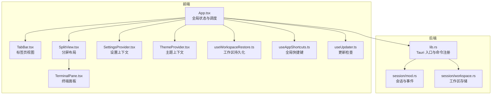
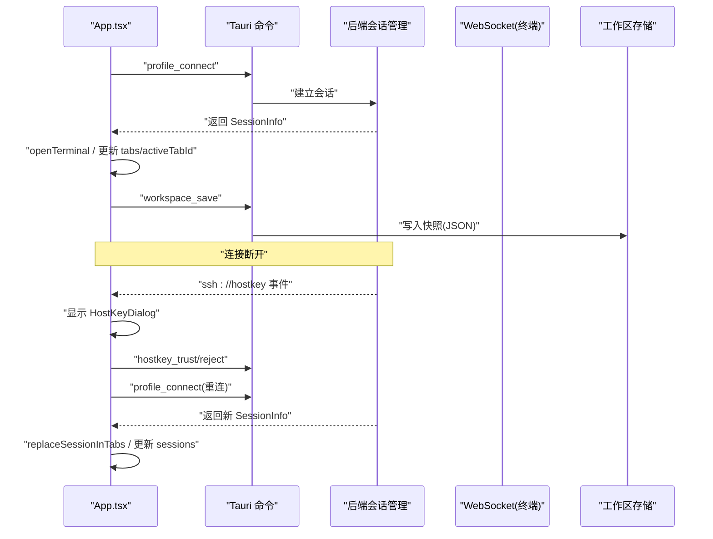
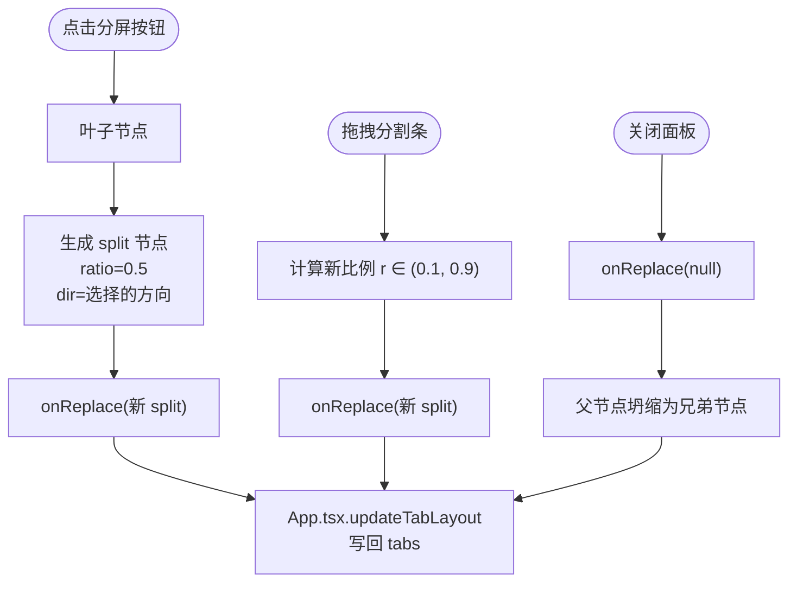
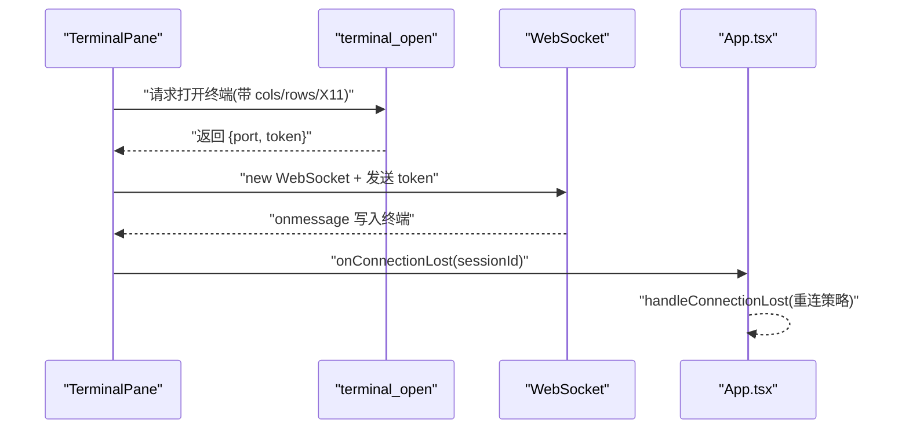
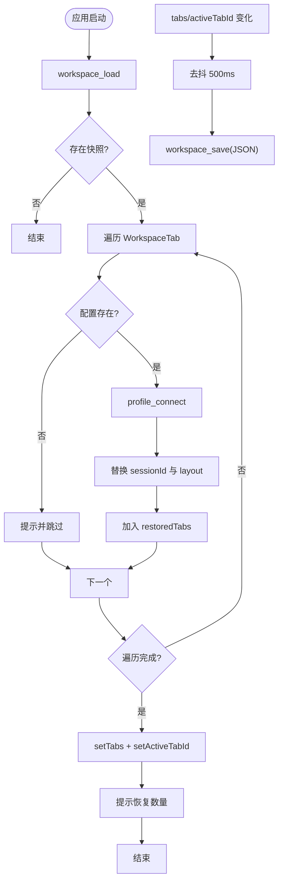
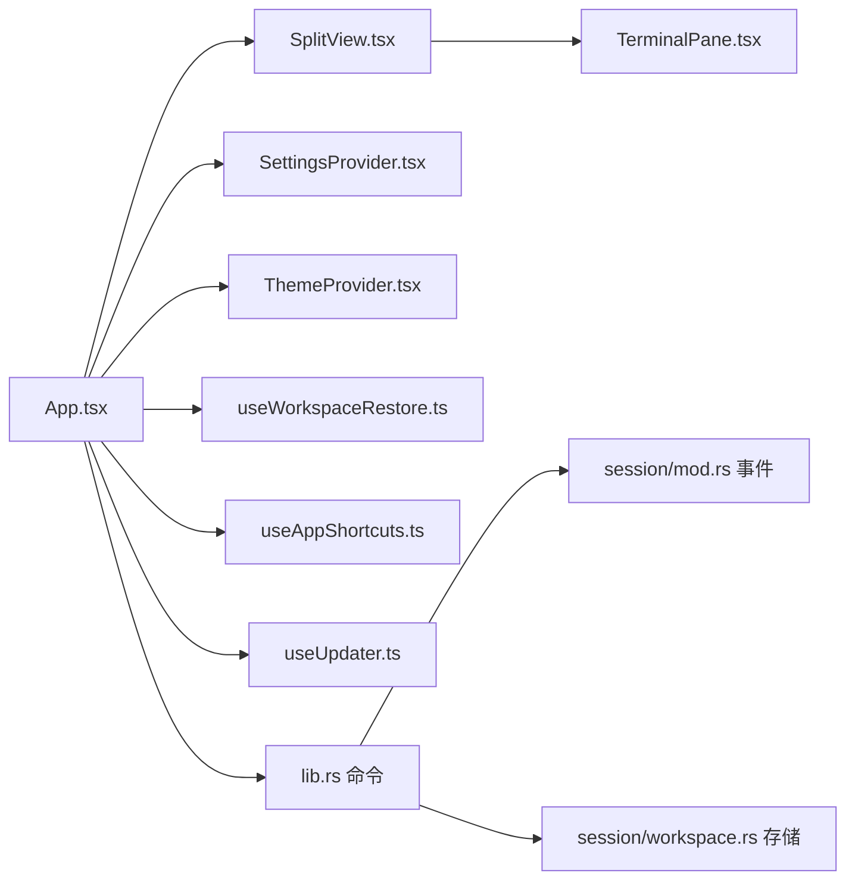

# 状态管理

<cite>
**本文档引用的文件**
- [src/App.tsx](file://src/App.tsx)
- [src/main.tsx](file://src/main.tsx)
- [src/types.ts](file://src/types.ts)
- [src/hooks/useWorkspaceRestore.ts](file://src/hooks/useWorkspaceRestore.ts)
- [src/settings/SettingsProvider.tsx](file://src/settings/SettingsProvider.tsx)
- [src/settings/types.ts](file://src/settings/types.ts)
- [src/components/SplitView.tsx](file://src/components/SplitView.tsx)
- [src/components/TabBar.tsx](file://src/components/TabBar.tsx)
- [src/components/TerminalPane.tsx](file://src/components/TerminalPane.tsx)
- [src/hooks/useAppShortcuts.ts](file://src/hooks/useAppShortcuts.ts)
- [src/hooks/useUpdater.ts](file://src/hooks/useUpdater.ts)
- [src/theme/ThemeProvider.tsx](file://src/theme/ThemeProvider.tsx)
- [src-tauri/src/lib.rs](file://src-tauri/src/lib.rs)
- [src-tauri/src/session/mod.rs](file://src-tauri/src/session/mod.rs)
- [src-tauri/src/session/workspace.rs](file://src-tauri/src/session/workspace.rs)
</cite>

## 目录
1. [引言](#引言)
2. [项目结构](#项目结构)
3. [核心组件](#核心组件)
4. [架构总览](#架构总览)
5. [详细组件分析](#详细组件分析)
6. [依赖关系分析](#依赖关系分析)
7. [性能考量](#性能考量)
8. [故障排查指南](#故障排查指南)
9. [结论](#结论)
10. [附录](#附录)

## 引言
本文件面向简化 SSH 客户端的状态管理，系统性解析前端全局状态的组织方式与后端会话管理机制，涵盖连接状态、会话状态、标签页状态、分屏布局状态等。文档重点阐述 React Hooks 的使用模式（useState、useEffect、useCallback 等）、状态提升策略与组件间共享机制，以及工作区持久化、状态恢复与内存优化策略。文中提供状态流转图与代码片段路径，帮助读者避免不必要的重渲染并保持状态一致性。

## 项目结构
前端采用以功能域划分的组件化结构，配合自定义 Hook 实现跨组件的状态共享与持久化；后端基于 Tauri + Rust，通过命令暴露与事件推送实现与前端的双向通信。整体采用“前端集中式状态 + 后端会话池”的架构，确保终端、SFTP、转发等功能共享同一底层会话。

图表来源
- [src/App.tsx:60-685](file://src/App.tsx#L60-L685)
- [src/main.tsx:10-20](file://src/main.tsx#L10-L20)
- [src-tauri/src/lib.rs:14-93](file://src-tauri/src/lib.rs#L14-L93)
- [src-tauri/src/session/mod.rs:1-226](file://src-tauri/src/session/mod.rs#L1-L226)
- [src-tauri/src/session/workspace.rs:1-82](file://src-tauri/src/session/workspace.rs#L1-L82)

章节来源
- [src/main.tsx:10-20](file://src/main.tsx#L10-L20)
- [src/App.tsx:60-685](file://src/App.tsx#L60-L685)

## 核心组件
- 全局状态与调度中心：App.tsx 负责维护连接配置、分组、会话列表、标签页集合、活动标签、对话框可见性、连接进度、主机密钥事件、提示信息等，并通过事件监听与后端交互。
- 分屏布局：SplitView.tsx 递归渲染 SplitNode 树，支持叶子节点水平/垂直分屏、拖拽调整比例、关闭面板等操作，并向上回调更新布局。
- 终端面板：TerminalPane.tsx 负责 xterm 初始化、Websocket 传输、尺寸适配、搜索栏、日志高亮、主题联动与断线回调。
- 设置与主题：SettingsProvider.tsx 与 ThemeProvider.tsx 提供设置与主题的上下文，均采用 useState + localStorage 持久化。
- 工作区持久化：useWorkspaceRestore.ts 在启动时加载快照并串行重连，标签页变化时去抖保存。
- 快捷键与更新：useAppShortcuts.ts 注册全局快捷键；useUpdater.ts 提供更新检查与安装流程。

章节来源
- [src/App.tsx:60-685](file://src/App.tsx#L60-L685)
- [src/components/SplitView.tsx:1-152](file://src/components/SplitView.tsx#L1-L152)
- [src/components/TerminalPane.tsx:1-199](file://src/components/TerminalPane.tsx#L1-L199)
- [src/settings/SettingsProvider.tsx:1-80](file://src/settings/SettingsProvider.tsx#L1-L80)
- [src/theme/ThemeProvider.tsx:1-108](file://src/theme/ThemeProvider.tsx#L1-L108)
- [src/hooks/useWorkspaceRestore.ts:1-178](file://src/hooks/useWorkspaceRestore.ts#L1-L178)
- [src/hooks/useAppShortcuts.ts:1-61](file://src/hooks/useAppShortcuts.ts#L1-L61)
- [src/hooks/useUpdater.ts:1-56](file://src/hooks/useUpdater.ts#L1-L56)

## 架构总览
前端通过 Tauri 命令与后端交互，后端通过事件向前端推送连接进度与主机密钥确认请求。App.tsx 作为状态中枢，协调连接、断线重连、标签页与分屏布局的更新，并通过工作区持久化实现状态恢复。

图表来源
- [src/App.tsx:312-408](file://src/App.tsx#L312-L408)
- [src-tauri/src/session/mod.rs:144-156](file://src-tauri/src/session/mod.rs#L144-L156)
- [src-tauri/src/session/workspace.rs:25-69](file://src-tauri/src/session/workspace.rs#L25-L69)

## 详细组件分析

### 全局状态与调度（App.tsx）
- 状态组织
  - 连接状态：profiles、groups、sessions、connecting、hostKey、hostKeyBusy
  - 标签页状态：tabs、activeTabId
  - 对话框与命令面板：showConnect、showSettings、showCommandPalette、editProfile
  - 通知与提示：toast、toastKind
- Ref 辅助
  - hostKeyRef、connectingCidRef、retryProfileIdRef、sessionProfileRef、intentionalDisconnectRef、reconnectingRef 用于跨渲染周期的临时状态与去重控制
- 生命周期与事件
  - 首次加载：刷新 sessions/profiles/groups
  - 进度事件：监听 ssh://progress，更新 connecting
  - 主机密钥事件：监听 ssh://hostkey，更新 hostKey
  - 启动检查更新：根据设置决定是否检查
  - 工作区恢复：useWorkspaceRestore 注入 sessionProfileRef，实现断线重连映射
- 标签页与分屏
  - openTerminal/openSftp/openMonitor/openEditor/openGit：创建新标签页并激活
  - closeTab：关闭指定标签页并处理活动标签
  - updateTabLayout：更新指定标签页的分屏布局
  - replaceSessionInTabs/replaceSessionInLayout：重连后替换布局中的 sessionId
- 断线重连
  - handleConnectionLost：根据 sessionProfileRef 与设置决定是否自动重连
  - attemptReconnect：指数退避重试，遇到主机密钥变更时提示手动重连
- 主机密钥确认
  - handleHostKeyTrust/handleHostKeyReject：调用后端接口并触发重连或清理状态
- 连接与断开
  - connectProfile：发起连接，成功后打开终端并刷新会话
  - disconnect：标记意图断开、清理映射、关闭相关标签、调用后端断开

章节来源
- [src/App.tsx:60-685](file://src/App.tsx#L60-L685)
- [src/types.ts:1-209](file://src/types.ts#L1-L209)

### 分屏布局（SplitView.tsx）
- 数据模型
  - SplitNode：叶子节点包含 paneId 与 sessionId；split 节点包含方向、比例与两个子节点
- 交互逻辑
  - 叶子节点：提供水平/垂直分屏按钮，生成新的 split 节点；提供关闭按钮，触发父节点坍缩
  - split 节点：拖拽分割条调整比例，支持子节点替换或关闭（坍缩）
- 状态提升
  - onReplace 回调向上更新父级 SplitNode，最终由 App.tsx 的 updateTabLayout 写回 tabs

图表来源
- [src/components/SplitView.tsx:55-151](file://src/components/SplitView.tsx#L55-L151)
- [src/types.ts:35-61](file://src/types.ts#L35-L61)

章节来源
- [src/components/SplitView.tsx:1-152](file://src/components/SplitView.tsx#L1-L152)
- [src/types.ts:35-61](file://src/types.ts#L35-L61)

### 终端面板（TerminalPane.tsx）
- 生命周期
  - 初始化：创建 xterm、fit、webgl/canvas 插件，绑定键盘输入与消息处理
  - 尺寸适配：ResizeObserver 触发 fitAndResize，防抖发送 resize 消息
  - WebSocket：terminal_open 返回端口与 token，建立连接后发送 token，接收数据写入终端
  - 断线回调：WebSocket 关闭时触发 onConnectionLost（传递 sessionId）
- 主题与设置联动
  - 使用 useTheme/useSettings，动态更新字体、字号、行高、光标样式与主题
- 性能与体验
  - WebGL 不可用时回退 Canvas
  - 搜索栏 Ctrl+F/Cmd+F 打开
  - 日志高亮器 transform 输出

图表来源
- [src/components/TerminalPane.tsx:103-135](file://src/components/TerminalPane.tsx#L103-L135)
- [src/App.tsx:390-408](file://src/App.tsx#L390-L408)

章节来源
- [src/components/TerminalPane.tsx:1-199](file://src/components/TerminalPane.tsx#L1-L199)

### 工作区持久化（useWorkspaceRestore.ts）
- 启动恢复
  - workspace_load 读取快照，遍历 WorkspaceTab，按 profileId 逐个重连，替换旧 sessionId 为新 sessionId
  - 若无 profileId（手动连接）则跳过；若配置不存在则提示；异常则记录错误
  - 成功恢复后设置 activeTabId，并提示数量
- 自动保存
  - tabs 或 activeTabId 变化时，去抖 500ms 后序列化 WorkspaceSnapshot 并调用 workspace_save
- 会话映射
  - 通过外部 sessionProfileRef 维护 sessionId → profileId 映射，供断线重连使用

图表来源
- [src/hooks/useWorkspaceRestore.ts:41-117](file://src/hooks/useWorkspaceRestore.ts#L41-L117)
- [src/hooks/useWorkspaceRestore.ts:120-158](file://src/hooks/useWorkspaceRestore.ts#L120-L158)
- [src-tauri/src/session/workspace.rs:25-69](file://src-tauri/src/session/workspace.rs#L25-L69)

章节来源
- [src/hooks/useWorkspaceRestore.ts:1-178](file://src/hooks/useWorkspaceRestore.ts#L1-L178)
- [src-tauri/src/session/workspace.rs:1-82](file://src-tauri/src/session/workspace.rs#L1-L82)

### 设置与主题（SettingsProvider.tsx、ThemeProvider.tsx）
- 设置持久化
  - SettingsProvider：localStorage 存取 AppSettings，默认值来自 DEFAULT_SETTINGS；updateSettings 支持增量更新并持久化
- 主题持久化
  - ThemeProvider：localStorage 存取当前主题 id，应用 CSS 变量并提供 terminalTheme
- 使用建议
  - 将设置与主题作为上下文注入根组件，子组件通过 useSettings/useTheme 获取

章节来源
- [src/settings/SettingsProvider.tsx:1-80](file://src/settings/SettingsProvider.tsx#L1-L80)
- [src/settings/types.ts:1-48](file://src/settings/types.ts#L1-L48)
- [src/theme/ThemeProvider.tsx:1-108](file://src/theme/ThemeProvider.tsx#L1-L108)

### 快捷键与更新（useAppShortcuts.ts、useUpdater.ts）
- 快捷键
  - useAppShortcuts：在窗口级别监听组合键，过滤可编辑元素，调用对应处理器（新建连接、关闭标签、切换标签、打开设置、打开命令面板）
- 更新
  - useUpdater：检查更新、下载安装、可选重启，状态机式管理检查与消息提示

章节来源
- [src/hooks/useAppShortcuts.ts:1-61](file://src/hooks/useAppShortcuts.ts#L1-L61)
- [src/hooks/useUpdater.ts:1-56](file://src/hooks/useUpdater.ts#L1-L56)

## 依赖关系分析
- 组件耦合
  - App.tsx 与 SplitView/TerminalPane 通过 props 与回调解耦，实现状态提升与布局更新
  - 终端面板通过 onConnectionLost 与 App.tsx 协作，实现断线重连
- 外部依赖
  - @tauri-apps/api：invoke 与 listen 用于命令调用与事件监听
  - @xterm/*：终端渲染与插件
  - tauri 插件：dialog、process、updater、opener、process
- 后端集成
  - Tauri 命令注册：lib.rs 中统一注册所有命令
  - 事件推送：mod.rs 中通过 Emitter 推送 ssh://hostkey 与 ssh://progress

图表来源
- [src/App.tsx:60-685](file://src/App.tsx#L60-L685)
- [src-tauri/src/lib.rs:43-89](file://src-tauri/src/lib.rs#L43-L89)
- [src-tauri/src/session/mod.rs:144-156](file://src-tauri/src/session/mod.rs#L144-L156)
- [src-tauri/src/session/workspace.rs:25-69](file://src-tauri/src/session/workspace.rs#L25-L69)

章节来源
- [src-tauri/src/lib.rs:14-93](file://src-tauri/src/lib.rs#L14-L93)
- [src-tauri/src/session/mod.rs:1-226](file://src-tauri/src/session/mod.rs#L1-L226)

## 性能考量
- 避免不必要重渲染
  - 使用 useCallback 包装高频回调（如 cycleTab、attemptReconnect、handleConnectionLost），确保依赖稳定
  - 将依赖数组最小化，例如 cycleTab 依赖 activeTabId 与 tabs
  - 使用 useMemo 包装 Provider 值，减少上下文订阅者的重渲染
- 去抖与节流
  - 工作区保存使用 setTimeout 去抖 500ms，避免频繁 IO
  - 终端 resize 使用定时器防抖，降低 WebSocket 消息频率
- 内存优化
  - 终端面板在卸载时清理 ResizeObserver、事件监听、WebSocket 与 xterm 实例
  - Ref 用于跨渲染周期的临时状态，避免污染状态树
- 渲染范围控制
  - SplitView 仅在节点替换时更新父级，避免整树重渲染
  - TabBar 仅渲染当前 tabs，点击事件在 App.tsx 统一处理

## 故障排查指南
- 连接失败
  - 检查 ssh://progress 事件是否正确更新 connecting；查看 toast 错误提示
  - 若出现主机密钥事件，确认 HostKeyDialog 已弹出并执行信任或拒绝
- 断线重连
  - 确认 settings.autoReconnect 与 maxReconnectAttempts 设置
  - 查看 reconnectingRef/intentionalDisconnectRef 是否阻止了重连
  - 若提示需确认主机密钥，需手动重连
- 工作区恢复
  - workspace_load 返回空或解析失败时，静默忽略；检查 workspace.json 是否损坏
  - 恢复时若配置不存在，会提示并跳过
- 终端无输出
  - 检查 WebSocket 是否已发送 token；确认 terminal_open 返回的端口与 token
  - 若 WebGL 不可用，终端会回退 Canvas，观察是否有报错

章节来源
- [src/App.tsx:122-160](file://src/App.tsx#L122-L160)
- [src/App.tsx:338-408](file://src/App.tsx#L338-L408)
- [src/hooks/useWorkspaceRestore.ts:41-117](file://src/hooks/useWorkspaceRestore.ts#L41-L117)
- [src/components/TerminalPane.tsx:103-135](file://src/components/TerminalPane.tsx#L103-L135)

## 结论
该简化 SSH 客户端采用“前端集中式状态 + 后端会话池”的设计，通过 SplitNode 与 Tab 的组合实现灵活的多面板工作区；借助 Tauri 命令与事件，前后端协同完成连接、断线重连、主机密钥确认与工作区持久化。通过合理的 Hook 使用模式与 Ref 辅助，实现了状态一致性与性能平衡。建议在后续迭代中进一步细化状态边界、增强错误边界与日志追踪，以提升可观测性与可维护性。

## 附录
- 数据模型概览（类型定义）
  - 会话与配置：SessionInfo、ConnectionProfile、ProfileGroup
  - 标签页与布局：Tab、SplitNode、TabKind
  - 工作区快照：WorkspaceTab、WorkspaceSnapshot
  - 设置与主题：AppSettings、CursorStyle、FontOptions
  - 传输与转发：TransferTask、ForwardEntry、ForwardKind
  - 监控与 Git：MonitorSnapshot、DiskUsage、Git* 类型

章节来源
- [src/types.ts:1-209](file://src/types.ts#L1-L209)
- [src/settings/types.ts:1-48](file://src/settings/types.ts#L1-L48)