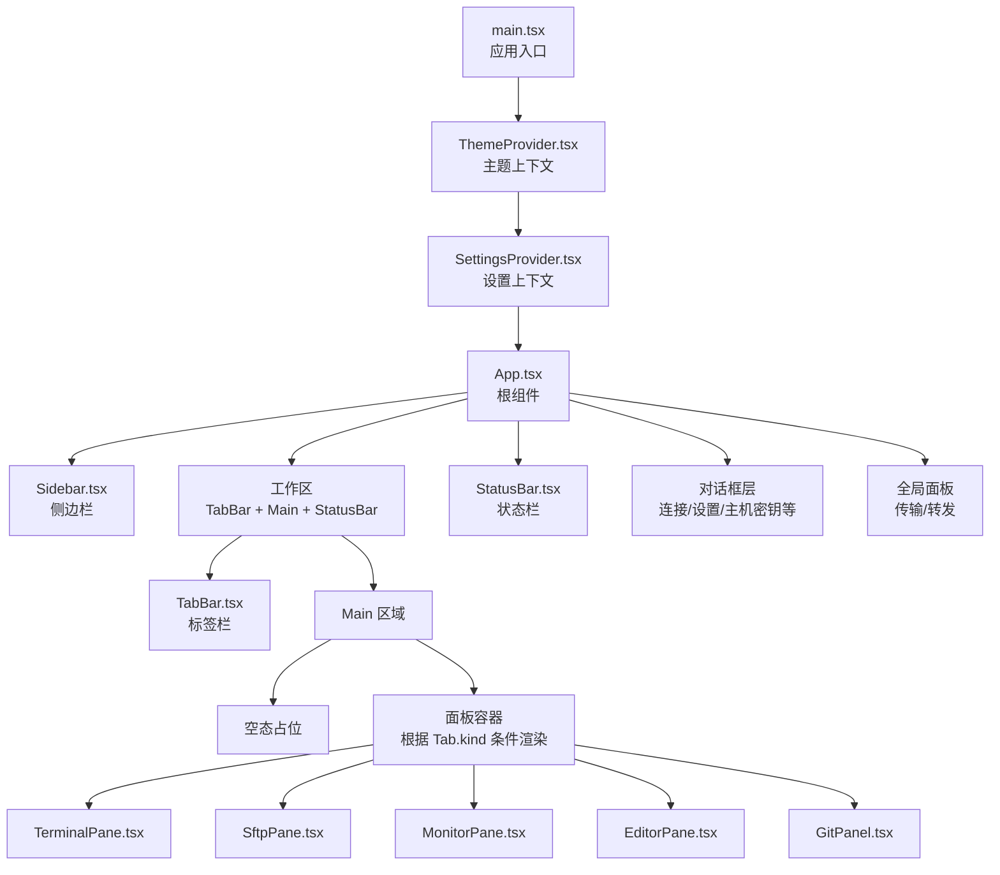
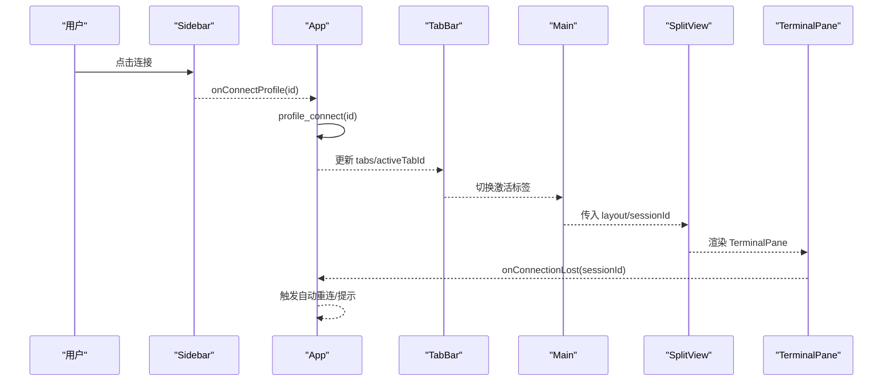
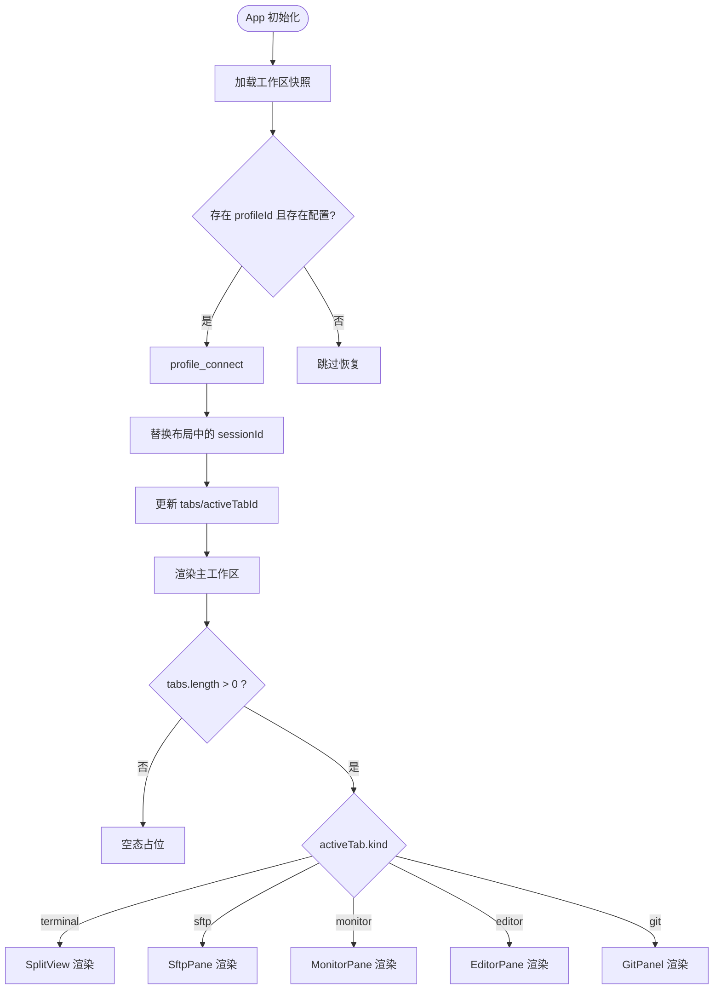
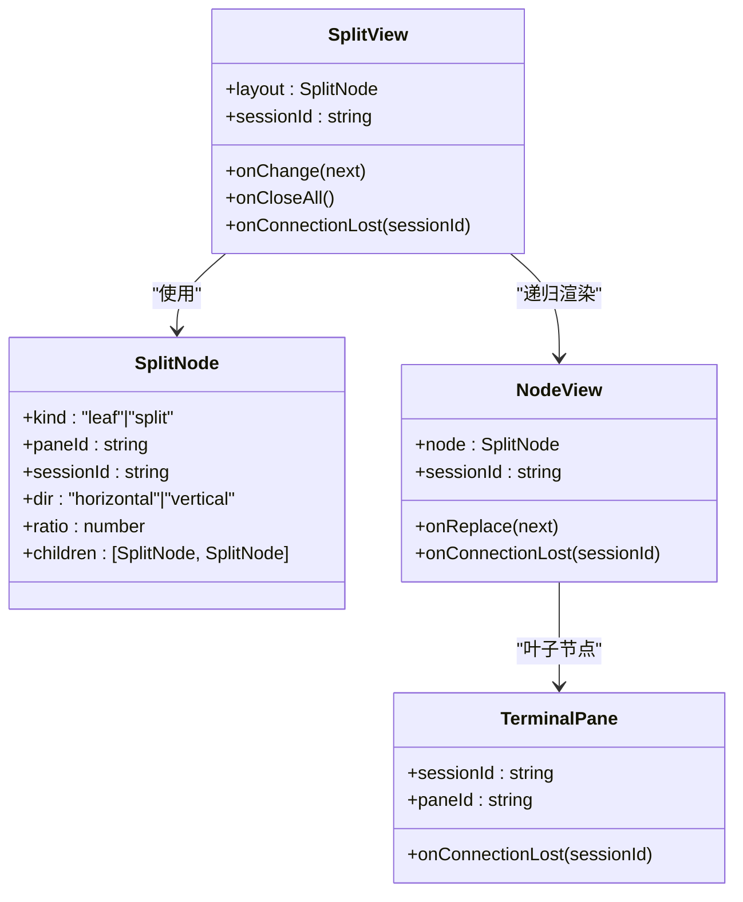
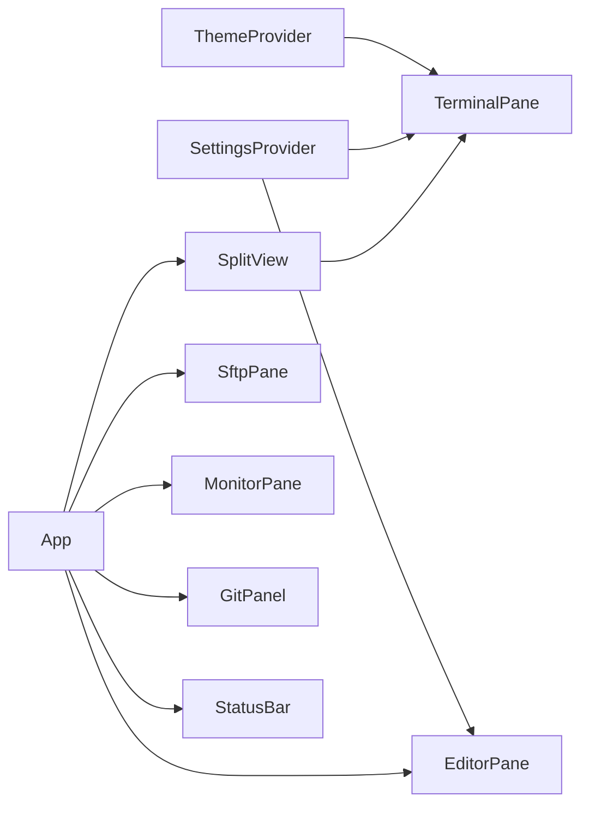

# 组件层次结构

<cite>
**本文档引用的文件**
- [src/App.tsx](file://src/App.tsx)
- [src/main.tsx](file://src/main.tsx)
- [src/components/Sidebar.tsx](file://src/components/Sidebar.tsx)
- [src/components/TabBar.tsx](file://src/components/TabBar.tsx)
- [src/components/SplitView.tsx](file://src/components/SplitView.tsx)
- [src/components/StatusBar.tsx](file://src/components/StatusBar.tsx)
- [src/components/TerminalPane.tsx](file://src/components/TerminalPane.tsx)
- [src/components/SftpPane.tsx](file://src/components/SftpPane.tsx)
- [src/components/MonitorPane.tsx](file://src/components/MonitorPane.tsx)
- [src/components/EditorPane.tsx](file://src/components/EditorPane.tsx)
- [src/components/GitPanel.tsx](file://src/components/GitPanel.tsx)
- [src/types.ts](file://src/types.ts)
- [src/settings/SettingsProvider.tsx](file://src/settings/SettingsProvider.tsx)
- [src/theme/ThemeProvider.tsx](file://src/theme/ThemeProvider.tsx)
- [src/hooks/useWorkspaceRestore.ts](file://src/hooks/useWorkspaceRestore.ts)
</cite>

## 目录
1. [引言](#引言)
2. [项目结构](#项目结构)
3. [核心组件](#核心组件)
4. [架构总览](#架构总览)
5. [详细组件分析](#详细组件分析)
6. [依赖分析](#依赖分析)
7. [性能考虑](#性能考虑)
8. [故障排查指南](#故障排查指南)
9. [结论](#结论)
10. [附录](#附录)

## 引言
本文件聚焦简化 SSH 客户端的组件层次结构，系统性解析根组件 App 如何组织应用的整体结构，并深入说明 Sidebar、TabBar、Main Workspace、StatusBar 等主要容器组件的职责分工与交互方式。文档同时阐述 SplitView 分屏布局系统的设计理念与实现机制，覆盖组件组合模式、条件渲染策略、动态组件加载以及工作区持久化与自动重连等关键能力，帮助读者快速把握前端架构脉络与数据流走向。

## 项目结构
应用采用“根组件 + 多容器 + 功能面板”的分层组织方式：
- 根入口负责注入主题与设置上下文，渲染根组件 App
- App 作为顶层容器，组织侧边栏、主工作区与状态栏
- 主工作区内部以标签页为单位承载不同功能面板（终端、SFTP、监控、编辑器、Git）
- SplitView 作为终端分屏容器，基于 SplitNode 树递归渲染，支持拖拽调整比例与动态拆分/合并

图表来源
- [src/main.tsx:1-20](file://src/main.tsx#L1-L20)
- [src/App.tsx:530-682](file://src/App.tsx#L530-L682)
- [src/components/Sidebar.tsx:111-210](file://src/components/Sidebar.tsx#L111-L210)
- [src/components/TabBar.tsx:19-57](file://src/components/TabBar.tsx#L19-L57)
- [src/components/StatusBar.tsx:26-96](file://src/components/StatusBar.tsx#L26-L96)

章节来源
- [src/main.tsx:1-20](file://src/main.tsx#L1-L20)
- [src/App.tsx:530-682](file://src/App.tsx#L530-L682)

## 核心组件
- 根组件 App：集中管理连接状态、会话列表、标签页集合、分屏布局、自动重连、命令面板、对话框与全局提示等。通过 useWorkspaceRestore 实现工作区快照加载与保存，通过 useSettings/useUpdater/useTheme 提供设置、更新与主题能力。
- Sidebar：按分组树形展示连接配置，支持新建/重命名/删除分组与连接项操作，提供一键新建连接入口。
- TabBar：展示当前打开的标签页，支持切换、关闭与新建连接。
- Main Workspace：根据当前激活标签页动态渲染对应面板；当无标签页时显示空态占位。
- StatusBar：展示当前会话状态、连接信息与快捷操作入口，提供设置、主题切换与命令面板入口。

章节来源
- [src/App.tsx:60-510](file://src/App.tsx#L60-L510)
- [src/components/Sidebar.tsx:27-211](file://src/components/Sidebar.tsx#L27-L211)
- [src/components/TabBar.tsx:12-58](file://src/components/TabBar.tsx#L12-L58)
- [src/components/StatusBar.tsx:16-97](file://src/components/StatusBar.tsx#L16-L97)

## 架构总览
App 作为顶层协调者，将数据与控制权下沉至各子组件，形成清晰的单向数据流与事件回调链路。组件间通过 props 传递数据，通过回调函数向上游反馈用户行为与系统事件。

图表来源
- [src/App.tsx:312-336](file://src/App.tsx#L312-L336)
- [src/App.tsx:596-602](file://src/App.tsx#L596-L602)
- [src/components/SplitView.tsx:21-39](file://src/components/SplitView.tsx#L21-L39)
- [src/components/TerminalPane.tsx:23-149](file://src/components/TerminalPane.tsx#L23-L149)

## 详细组件分析

### App 根组件与应用控制流
- 数据与状态
  - 连接与会话：profiles/groups/sessions 列表，连接进度与主机密钥事件监听
  - 标签页与激活：tabs/activeTabId，支持新建/关闭/循环切换
  - 分屏布局：每个 terminal 类型标签维护一棵 SplitNode 树
  - 对话框与提示：连接中弹窗、设置对话框、主机密钥确认、全局 toast
- 控制流
  - 连接流程：Sidebar 触发 connectProfile → profile_connect → 打开终端标签
  - 断线处理：TerminalPane onConnectionLost → App handleConnectionLost → 自动重连（指数退避）
  - 工作区恢复：启动时加载快照 → 逐个按 profile 重连 → 替换 sessionId 并恢复布局
  - 条件渲染：根据 tabs.length 与 activeTab.kind 渲染不同面板
- 组合模式
  - 使用多个子组件组合出完整的 UI 结构，通过 props 传递数据与回调
  - 通过 ref 与回调在组件间传递副作用（如连接 ID、重连状态）

图表来源
- [src/hooks/useWorkspaceRestore.ts:41-117](file://src/hooks/useWorkspaceRestore.ts#L41-L117)
- [src/App.tsx:564-606](file://src/App.tsx#L564-L606)

章节来源
- [src/App.tsx:60-510](file://src/App.tsx#L60-L510)
- [src/hooks/useWorkspaceRestore.ts:28-159](file://src/hooks/useWorkspaceRestore.ts#L28-L159)

### Sidebar 侧边栏
- 职责：按分组树形展示连接配置，支持折叠/展开、新建/重命名/删除分组与连接项操作，提供新建连接入口
- 设计要点：使用 useMemo 对分组排序，按组过滤连接项；通过受控状态 collapsed 控制折叠状态
- 交互：点击连接项触发 onConnectProfile；按钮事件阻止冒泡以避免误触

章节来源
- [src/components/Sidebar.tsx:27-211](file://src/components/Sidebar.tsx#L27-L211)

### TabBar 标签栏
- 职责：展示当前打开的标签页，支持切换、关闭与新建连接
- 设计要点：根据 Tab.kind 渲染不同图标；通过 active 类名标识当前激活标签
- 交互：点击标签切换激活；点击关闭按钮触发 onClose 回调

章节来源
- [src/components/TabBar.tsx:12-58](file://src/components/TabBar.tsx#L12-L58)

### Main Workspace 主工作区
- 职责：根据激活标签页动态渲染对应面板；无标签页时显示空态占位
- 设计要点：使用条件渲染与映射遍历 tabs，通过 key 与 active 类名控制可见性
- 面板选择：terminal → SplitView；sftp → SftpPane；monitor → MonitorPane；editor → EditorPane；git → GitPanel

章节来源
- [src/App.tsx:564-606](file://src/App.tsx#L564-L606)

### StatusBar 状态栏
- 职责：展示当前会话状态、连接信息与快捷操作入口；提供设置、主题切换与命令面板入口
- 设计要点：根据 session 存在与否显示不同文案；提供文件/监控/Git/断开等操作按钮

章节来源
- [src/components/StatusBar.tsx:16-97](file://src/components/StatusBar.tsx#L16-L97)

### SplitView 分屏布局系统
- 设计理念：以 SplitNode 为统一数据模型，叶子节点代表一个终端面板，split 节点代表两个子区域按比例分割。支持水平/垂直拆分、拖拽调整比例、关闭子面板（父级坍缩为兄弟）。
- 实现机制：
  - NodeView 递归渲染：叶子节点渲染 TerminalPane 并提供拆分与关闭按钮；split 节点渲染两个子区域并通过拖拽事件更新比例
  - 替换策略：通过 onReplace 回调返回新的 SplitNode 或 null（关闭自身）
  - 事件处理：指针按下开始拖拽，移动过程中计算比例并回调 onChange/onReplace，释放时停止监听
- 数据结构：SplitNode 定义叶子与 split 两种节点形态，包含方向、比例与子节点数组

图表来源
- [src/components/SplitView.tsx:21-151](file://src/components/SplitView.tsx#L21-L151)
- [src/types.ts:36-43](file://src/types.ts#L36-L43)

章节来源
- [src/components/SplitView.tsx:21-151](file://src/components/SplitView.tsx#L21-L151)
- [src/types.ts:32-43](file://src/types.ts#L32-L43)

### 终端面板 TerminalPane
- 职责：承载 xterm.js 终端实例，建立本地 WebSocket 与后端 PTY 通道，处理输入输出、动态适配、搜索与日志高亮
- 设计要点：通过 invoke 启动终端，建立 WebSocket 并发送令牌；监听 onclose 触发 onConnectionLost 回调
- 性能与体验：ResizeObserver 监听容器尺寸变化，防抖发送 resize；WebGL 可用时启用 WebGL 渲染

章节来源
- [src/components/TerminalPane.tsx:23-149](file://src/components/TerminalPane.tsx#L23-L149)

### SFTP 文件面板 SftpPane
- 职责：浏览远程文件系统、进入目录、上传/下载（入队至传输队列）、新建/重命名/删除；支持目录同步
- 设计要点：通过 sftp_list/sftp_read_file/sftp_write_file 等后端接口完成文件操作；错误状态与忙碌状态通过局部状态管理

章节来源
- [src/components/SftpPane.tsx:30-304](file://src/components/SftpPane.tsx#L30-L304)

### 监控面板 MonitorPane
- 职责：周期性拉取远程系统监控快照（CPU/内存/负载/磁盘），以可视化指标展示
- 设计要点：定时轮询 invoke("monitor_snapshot")，格式化数值与时间；提供手动刷新

章节来源
- [src/components/MonitorPane.tsx:57-180](file://src/components/MonitorPane.tsx#L57-L180)

### 编辑器面板 EditorPane
- 职责：远程文件读取与保存，支持 Ctrl+S 快捷键保存；检测语言并显示文件路径与脏状态
- 设计要点：键盘事件监听触发保存；通过 sftp_read_file/sftp_write_file 完成读写

章节来源
- [src/components/EditorPane.tsx:16-121](file://src/components/EditorPane.tsx#L16-L121)

### Git 面板 GitPanel
- 职责：展示仓库状态、分支切换、提交历史、Worktree 管理与文件差异查看
- 设计要点：按标签页切换懒加载对应数据；支持双击打开文件到编辑器

章节来源
- [src/components/GitPanel.tsx:30-287](file://src/components/GitPanel.tsx#L30-L287)

## 依赖分析
- 上下文依赖
  - ThemeProvider 提供主题与终端配色，TerminalPane 读取 terminalTheme
  - SettingsProvider 提供字体、光标样式等设置，TerminalPane 与 EditorPane 均消费
- 组件耦合
  - App 与各面板组件松耦合：通过 props 传递 sessionId/layout/回调
  - SplitView 与 TerminalPane：SplitView 仅负责布局与事件，TerminalPane 负责终端生命周期
- 外部依赖
  - @xterm/*：终端渲染与适配
  - @tauri-apps/api：与后端通信（invoke 与事件监听）
  - lucide-react：图标

图表来源
- [src/theme/ThemeProvider.tsx:70-99](file://src/theme/ThemeProvider.tsx#L70-L99)
- [src/settings/SettingsProvider.tsx:37-73](file://src/settings/SettingsProvider.tsx#L37-L73)
- [src/App.tsx:530-682](file://src/App.tsx#L530-L682)

章节来源
- [src/theme/ThemeProvider.tsx:70-99](file://src/theme/ThemeProvider.tsx#L70-L99)
- [src/settings/SettingsProvider.tsx:37-73](file://src/settings/SettingsProvider.tsx#L37-L73)
- [src/App.tsx:530-682](file://src/App.tsx#L530-L682)

## 性能考虑
- 终端渲染优化：TerminalPane 在可用时启用 WebGL 渲染，不可用时回退 Canvas；ResizeObserver 防抖发送 resize，避免频繁重算
- 分屏拖拽：拖拽过程实时计算比例并回调，但仅在 pointerup 时持久化，减少不必要的状态更新
- 工作区持久化：useWorkspaceRestore 对保存进行去抖，避免频繁 IO；恢复阶段串行重连，降低后端压力
- 自动重连：指数退避与最大尝试次数限制，避免风暴式重试

## 故障排查指南
- 连接失败
  - 检查连接进度事件与主机密钥事件是否正确触发；必要时在 HostKeyDialog 中信任或拒绝
  - 查看 App 中的 toast 提示与错误信息
- 断线重连
  - 确认 autoReconnect 开关与最大重试次数设置；观察指数退避提示
  - 若因主机密钥变更需确认，重连会被阻断，需手动处理
- 终端无响应
  - 检查 TerminalPane 的 ready 状态与 WebSocket 连接；确认容器尺寸非 0
- 文件操作异常
  - SftpPane 的错误状态与 busy 状态；确认权限与路径正确
- Git 面板空白
  - 确认仓库路径有效；检查 activeTab 是否为 git 类型并已加载对应数据

章节来源
- [src/App.tsx:338-408](file://src/App.tsx#L338-L408)
- [src/components/TerminalPane.tsx:128-135](file://src/components/TerminalPane.tsx#L128-L135)
- [src/components/SftpPane.tsx:40-57](file://src/components/SftpPane.tsx#L40-L57)
- [src/components/GitPanel.tsx:90-97](file://src/components/GitPanel.tsx#L90-L97)

## 结论
该简化 SSH 客户端通过 App 根组件实现了清晰的控制与数据流，配合 Sidebar、TabBar、Main Workspace、StatusBar 等容器组件，形成了职责明确、边界清晰的 UI 架构。SplitView 分屏系统以 SplitNode 为核心数据结构，提供了直观的拆分、合并与比例调整能力。结合工作区持久化与自动重连机制，应用在易用性与稳定性方面达到良好平衡。建议在后续迭代中进一步细化错误边界与日志埋点，以提升可观测性与可维护性。

## 附录
- 数据模型参考：SplitNode、Tab、SessionInfo、HostKeyEvent 等类型定义
- 上下文能力：SettingsProvider 与 ThemeProvider 提供设置与主题的全局访问

章节来源
- [src/types.ts:32-61](file://src/types.ts#L32-L61)
- [src/settings/SettingsProvider.tsx:37-79](file://src/settings/SettingsProvider.tsx#L37-L79)
- [src/theme/ThemeProvider.tsx:70-107](file://src/theme/ThemeProvider.tsx#L70-L107)