# SSH 协议处理

<cite>
**本文档引用的文件**
- [src-tauri/src/session/ssh.rs](file://src-tauri/src/session/ssh.rs)
- [src-tauri/src/session/auth.rs](file://src-tauri/src/session/auth.rs)
- [src-tauri/src/session/manager.rs](file://src-tauri/src/session/manager.rs)
- [src-tauri/src/session/mod.rs](file://src-tauri/src/session/mod.rs)
- [src-tauri/src/session/pty.rs](file://src-tauri/src/session/pty.rs)
- [src-tauri/src/session/known_hosts.rs](file://src-tauri/src/session/known_hosts.rs)
- [src-tauri/src/session/sftp.rs](file://src-tauri/src/session/sftp.rs)
- [src-tauri/src/session/forward.rs](file://src-tauri/src/session/forward.rs)
- [src-tauri/src/session/x11.rs](file://src-tauri/src/session/x11.rs)
- [src-tauri/src/session/transfer.rs](file://src-tauri/src/session/transfer.rs)
- [src-tauri/src/session/profile.rs](file://src-tauri/src/session/profile.rs)
- [src-tauri/src/commands.rs](file://src-tauri/src/commands.rs)
- [src-tauri/src/lib.rs](file://src-tauri/src/lib.rs)
- [src-tauri/Cargo.toml](file://src-tauri/Cargo.toml)
- [README.md](file://README.md)
</cite>

## 目录
1. [简介](#简介)
2. [项目结构](#项目结构)
3. [核心组件](#核心组件)
4. [架构总览](#架构总览)
5. [详细组件分析](#详细组件分析)
6. [依赖关系分析](#依赖关系分析)
7. [性能考虑](#性能考虑)
8. [故障排查指南](#故障排查指南)
9. [结论](#结论)
10. [附录](#附录)

## 简介
本文件面向 russh 库的集成与自定义实现，系统梳理 SSH 连接建立、认证机制（密码认证、公钥认证、跳板机支持）、密钥交换与主机公钥校验、PTY 通道与终端会话的 WebSocket 桥接、SFTP 文件传输与端口转发（本地/远程/动态 SOCKS5）等能力。文档还涵盖 SSH 配置参数、安全选项与性能调优建议，并提供扩展与自定义认证方式的实现指导。

## 项目结构
后端采用 Tauri 2 架构，Rust 侧通过 russh 提供 SSH 协议实现，配套 tokio 异步运行时、WebSocket 终端桥接、russh-sftp 文件传输、端口转发与 X11 转发等子系统。命令层通过 Tauri 暴露给前端，形成“薄命令层 + 会话池 + 多子系统”的分层设计。

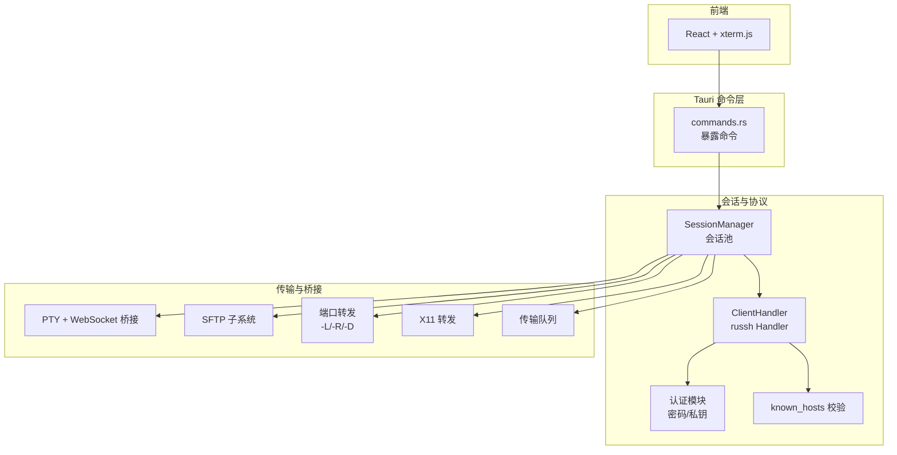

图表来源
- [src-tauri/src/lib.rs:14-92](file://src-tauri/src/lib.rs#L14-L92)
- [src-tauri/src/commands.rs:1-120](file://src-tauri/src/commands.rs#L1-L120)
- [src-tauri/src/session/manager.rs:82-145](file://src-tauri/src/session/manager.rs#L82-L145)
- [src-tauri/src/session/mod.rs:52-226](file://src-tauri/src/session/mod.rs#L52-L226)
- [src-tauri/src/session/pty.rs:1-143](file://src-tauri/src/session/pty.rs#L1-L143)
- [src-tauri/src/session/sftp.rs:1-124](file://src-tauri/src/session/sftp.rs#L1-L124)
- [src-tauri/src/session/forward.rs:1-295](file://src-tauri/src/session/forward.rs#L1-L295)
- [src-tauri/src/session/x11.rs:1-151](file://src-tauri/src/session/x11.rs#L1-L151)
- [src-tauri/src/session/transfer.rs:1-483](file://src-tauri/src/session/transfer.rs#L1-L483)

章节来源
- [README.md:111-135](file://README.md#L111-L135)
- [src-tauri/src/lib.rs:14-92](file://src-tauri/src/lib.rs#L14-L92)

## 核心组件
- 会话池与连接管理：统一管理持久连接，供终端、SFTP、端口转发共享；支持跳板机 ProxyJump。
- 认证模块：密码认证与私钥认证，支持 RSA 哈希算法协商与超时控制。
- 主机公钥校验：基于 ~/.ssh/known_hosts 的 TOFU 与变更检测，兼容 OpenSSH。
- PTY 与 WebSocket 终端桥接：在会话上开 PTY，桥接到本地 WebSocket，前端通过 token 建立连接。
- SFTP：复用会话连接，按需创建 SFTP 子系统会话。
- 端口转发：本地转发（-L）、远程转发（-R）、动态 SOCKS5（-D）。
- X11 转发：将远端 X11 channel 桥接到本地 DISPLAY。
- 传输队列：串行执行、可取消的 SFTP 传输，带进度事件推送。
- 连接配置与凭据：保存连接配置，密码与私钥口令使用 OS 钥匙串，支持内存缓存减少授权弹窗。

章节来源
- [src-tauri/src/session/manager.rs:50-145](file://src-tauri/src/session/manager.rs#L50-L145)
- [src-tauri/src/session/auth.rs:10-82](file://src-tauri/src/session/auth.rs#L10-L82)
- [src-tauri/src/session/known_hosts.rs:25-135](file://src-tauri/src/session/known_hosts.rs#L25-L135)
- [src-tauri/src/session/pty.rs:31-143](file://src-tauri/src/session/pty.rs#L31-L143)
- [src-tauri/src/session/sftp.rs:24-75](file://src-tauri/src/session/sftp.rs#L24-L75)
- [src-tauri/src/session/forward.rs:1-295](file://src-tauri/src/session/forward.rs#L1-L295)
- [src-tauri/src/session/x11.rs:1-151](file://src-tauri/src/session/x11.rs#L1-L151)
- [src-tauri/src/session/transfer.rs:121-203](file://src-tauri/src/session/transfer.rs#L121-L203)
- [src-tauri/src/session/profile.rs:67-220](file://src-tauri/src/session/profile.rs#L67-L220)

## 架构总览
russh 作为 SSH 协议实现，通过 ClientHandler 统一处理握手、认证、主机公钥校验、远程转发回调与 X11 回调。会话池持有 russh Handle，各子系统在其上开不同类型的 channel（PTY、SFTP、direct-tcpip、X11）。

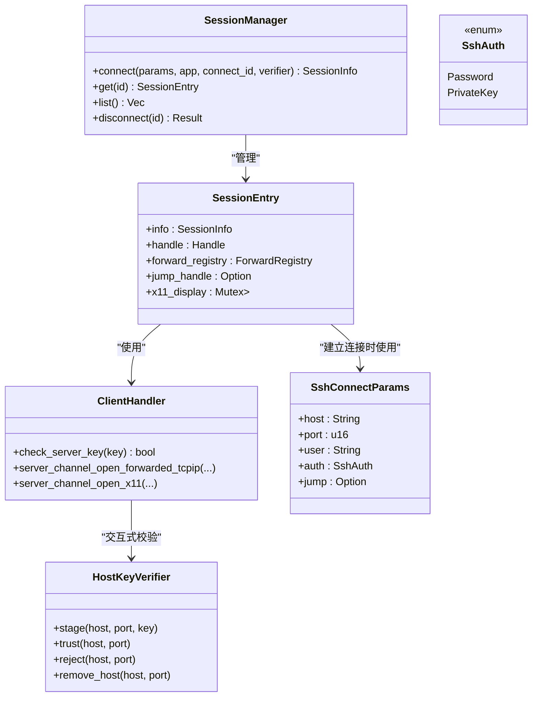

图表来源
- [src-tauri/src/session/manager.rs:50-145](file://src-tauri/src/session/manager.rs#L50-L145)
- [src-tauri/src/session/mod.rs:59-226](file://src-tauri/src/session/mod.rs#L59-L226)
- [src-tauri/src/session/auth.rs:20-42](file://src-tauri/src/session/auth.rs#L20-L42)
- [src-tauri/src/session/known_hosts.rs:92-135](file://src-tauri/src/session/known_hosts.rs#L92-L135)

## 详细组件分析

### 会话建立与持久化
- 会话池负责 TCP 连接超时、SSH 握手超时与认证超时，全程推送连接进度事件。
- 支持直连与跳板机（单跳 ProxyJump）两种路径：直连时直接在 TCP 流上握手；跳板时先在跳板上建立 SSH，再通过 direct-tcpip 隧道到目标主机。
- 会话建立后，Handle 与转发注册表、X11 显示目标等作为 SessionEntry 成员共享。

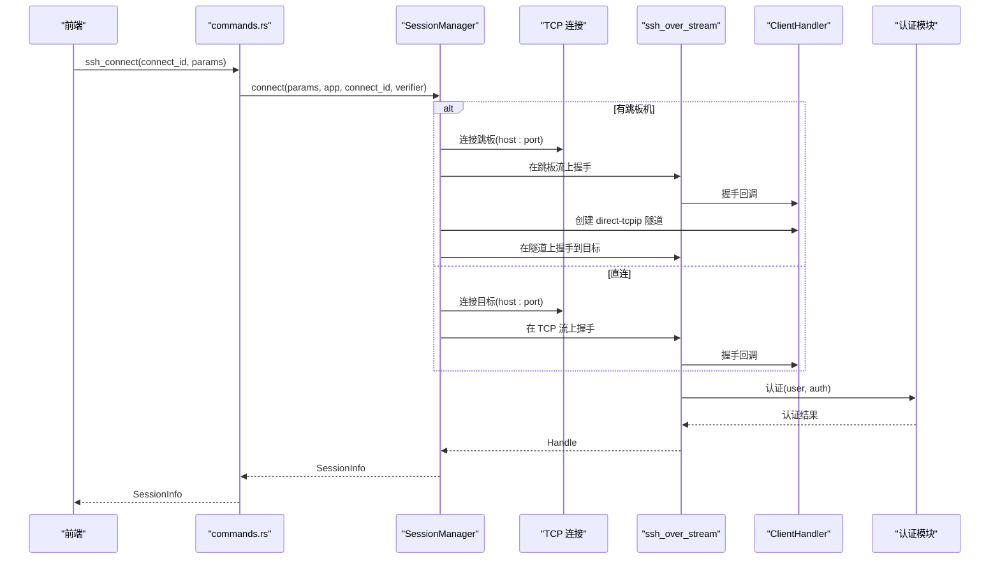

图表来源
- [src-tauri/src/session/manager.rs:82-145](file://src-tauri/src/session/manager.rs#L82-L145)
- [src-tauri/src/session/manager.rs:147-217](file://src-tauri/src/session/manager.rs#L147-L217)
- [src-tauri/src/session/manager.rs:275-317](file://src-tauri/src/session/manager.rs#L275-L317)
- [src-tauri/src/session/auth.rs:44-82](file://src-tauri/src/session/auth.rs#L44-L82)

章节来源
- [src-tauri/src/session/manager.rs:24-317](file://src-tauri/src/session/manager.rs#L24-L317)
- [src-tauri/src/commands.rs:42-72](file://src-tauri/src/commands.rs#L42-L72)

### 主机公钥校验与 TOFU
- check_server_key 根据 ~/.ssh/known_hosts 判断 Trusted/Unknown/Changed 三种状态。
- 非交互（一次性 exec）：Unknown 静默 TOFU 落盘，变更拒绝；交互式（持久会话）：Unknown/Changed 暂存并推送前端确认事件。
- HostKeyVerifier 提供 stage/trust/reject/remove_host 等操作，支持删除特定 host:port 的记录。

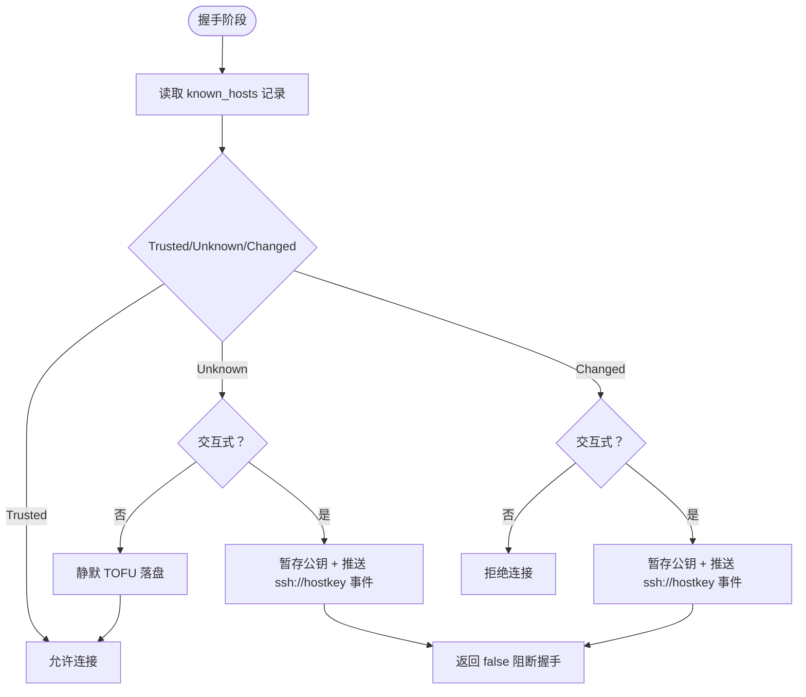

图表来源
- [src-tauri/src/session/mod.rs:118-160](file://src-tauri/src/session/mod.rs#L118-L160)
- [src-tauri/src/session/known_hosts.rs:68-135](file://src-tauri/src/session/known_hosts.rs#L68-L135)

章节来源
- [src-tauri/src/session/known_hosts.rs:25-197](file://src-tauri/src/session/known_hosts.rs#L25-L197)
- [src-tauri/src/session/mod.rs:59-160](file://src-tauri/src/session/mod.rs#L59-L160)

### 认证机制（密码/公钥）
- 密码认证：authenticate_password，带超时控制。
- 私钥认证：load_secret_key 读取私钥，best_supported_rsa_hash 协商哈希算法，authenticate_publickey 完成认证。
- SshConnectParams 支持 jump（单跳 ProxyJump）参数，用于跳板机连接。

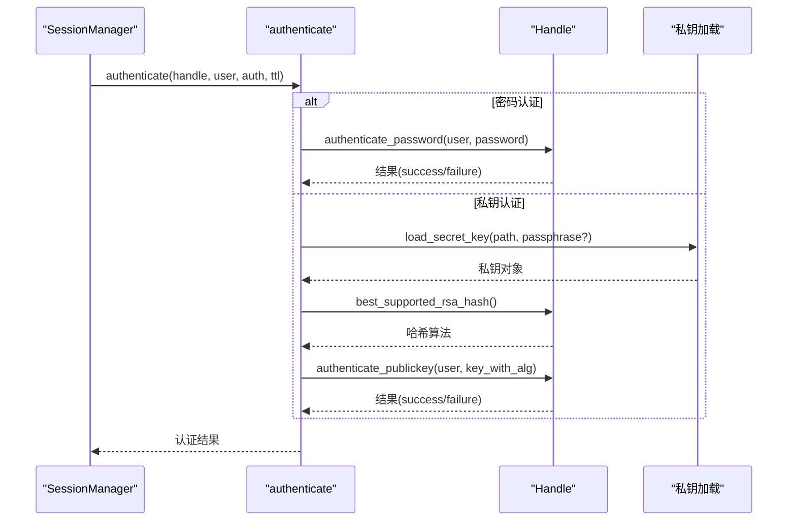

图表来源
- [src-tauri/src/session/auth.rs:44-82](file://src-tauri/src/session/auth.rs#L44-L82)
- [src-tauri/src/session/ssh.rs:34-40](file://src-tauri/src/session/ssh.rs#L34-L40)

章节来源
- [src-tauri/src/session/auth.rs:10-82](file://src-tauri/src/session/auth.rs#L10-L82)
- [src-tauri/src/session/ssh.rs:13-65](file://src-tauri/src/session/ssh.rs#L13-L65)

### PTY 通道与 WebSocket 桥接
- 前端调用 terminal_open，在指定会话上开 PTY channel，请求 shell。
- 后端创建 mpsc 管道（输入/输出/尺寸），注册到 TerminalBridge，返回本地 WS 端口与一次性 token。
- TerminalBridge 接受 WS 连接，第一条消息为 token；根据 token 取出管道，将 WS 与 mpsc/通道桥接。
- 支持 X11 转发：enable_x11 时请求 X11 并将远端 channel 桥接本地 DISPLAY。

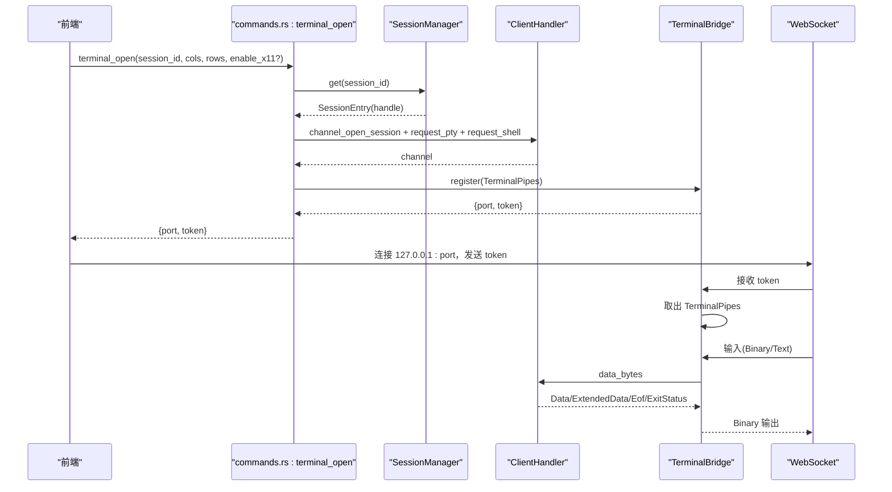

图表来源
- [src-tauri/src/commands.rs:105-186](file://src-tauri/src/commands.rs#L105-L186)
- [src-tauri/src/session/pty.rs:47-143](file://src-tauri/src/session/pty.rs#L47-L143)
- [src-tauri/src/session/x11.rs:26-36](file://src-tauri/src/session/x11.rs#L26-L36)

章节来源
- [src-tauri/src/commands.rs:97-186](file://src-tauri/src/commands.rs#L97-L186)
- [src-tauri/src/session/pty.rs:1-143](file://src-tauri/src/session/pty.rs#L1-L143)
- [src-tauri/src/session/x11.rs:1-151](file://src-tauri/src/session/x11.rs#L1-L151)

### SFTP 文件传输
- 在会话已建立的 SSH 连接上开 SFTP subsystem channel，复用同一条连接。
- SftpManager 缓存每个会话的 SftpSession，避免重复开销。
- 支持目录列举、文件读写、大小限制与编码检查。

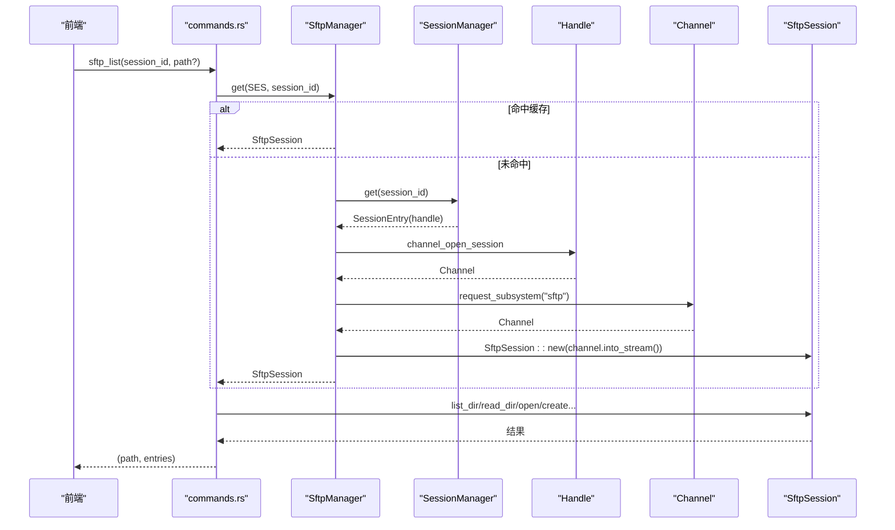

图表来源
- [src-tauri/src/session/sftp.rs:30-75](file://src-tauri/src/session/sftp.rs#L30-L75)
- [src-tauri/src/commands.rs:188-200](file://src-tauri/src/commands.rs#L188-L200)

章节来源
- [src-tauri/src/session/sftp.rs:1-124](file://src-tauri/src/session/sftp.rs#L1-L124)
- [src-tauri/src/commands.rs:188-360](file://src-tauri/src/commands.rs#L188-L360)

### 端口转发（-L/-R/-D）
- 本地转发（-L）：本地监听，每个连接在 SSH 上开 direct-tcpip 并桥接。
- 远程转发（-R）：请求服务器在远端 bind 端口，服务器连接时回调根据注册表桥接到本地目标。
- 动态转发（-D）：本地监听，每个连接先 SOCKS5 握手，再 direct-tcpip。
- PortForwardManager 管理转发生命周期，支持取消与状态查询。

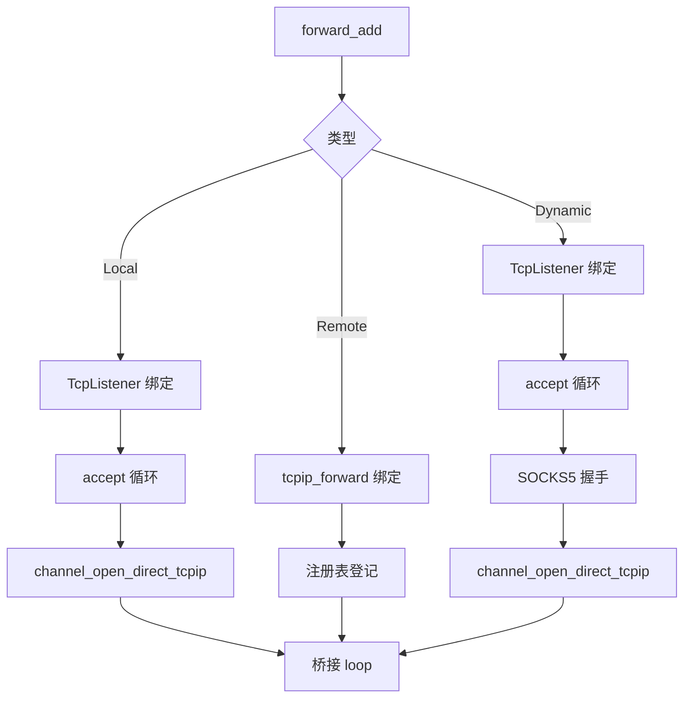

图表来源
- [src-tauri/src/session/forward.rs:117-295](file://src-tauri/src/session/forward.rs#L117-L295)
- [src-tauri/src/commands.rs:433-514](file://src-tauri/src/commands.rs#L433-L514)

章节来源
- [src-tauri/src/session/forward.rs:1-295](file://src-tauri/src/session/forward.rs#L1-L295)
- [src-tauri/src/commands.rs:433-514](file://src-tauri/src/commands.rs#L433-L514)

### X11 转发
- 在 PTY 请求时可启用 X11，生成随机 cookie，请求 X11 channel。
- 将远端 X11 channel 与本地 DISPLAY（TCP 或 Unix）桥接，支持多种 DISPLAY 形式解析。

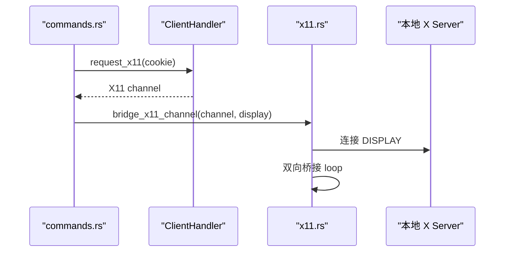

图表来源
- [src-tauri/src/commands.rs:127-136](file://src-tauri/src/commands.rs#L127-L136)
- [src-tauri/src/session/x11.rs:26-151](file://src-tauri/src/session/x11.rs#L26-L151)

章节来源
- [src-tauri/src/session/x11.rs:1-151](file://src-tauri/src/session/x11.rs#L1-L151)
- [src-tauri/src/commands.rs:127-136](file://src-tauri/src/commands.rs#L127-L136)

### 传输队列与进度事件
- TransferQueue 串行执行上传/下载任务，支持取消与进度事件推送。
- 任务状态与进度通过 transfer://state 与 transfer://progress 事件上报前端。

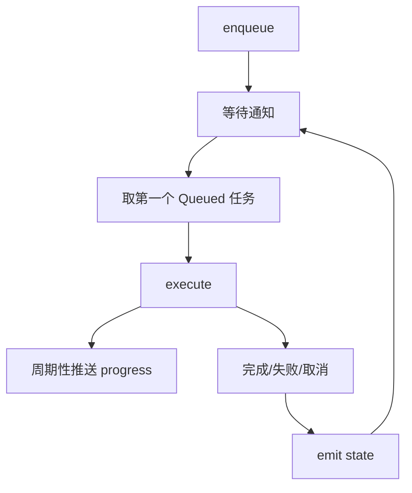

图表来源
- [src-tauri/src/session/transfer.rs:121-203](file://src-tauri/src/session/transfer.rs#L121-L203)
- [src-tauri/src/session/transfer.rs:286-483](file://src-tauri/src/session/transfer.rs#L286-L483)

章节来源
- [src-tauri/src/session/transfer.rs:1-483](file://src-tauri/src/session/transfer.rs#L1-L483)

### 连接配置与凭据安全
- ProfileStore 保存连接元数据（名称/主机/端口/用户/认证方式/私钥路径/分组/跳板机）。
- 密码与私钥口令存 OS 钥匙串，支持内存缓存（24h）减少授权弹窗。
- 支持跳板机单跳引用，禁止自引用与嵌套。

章节来源
- [src-tauri/src/session/profile.rs:47-325](file://src-tauri/src/session/profile.rs#L47-L325)
- [README.md:155-162](file://README.md#L155-L162)

## 依赖关系分析
russh 作为核心依赖，配合 russh-sftp、tokio、tokio-tungstenite、keyring 等生态组件，构成完整的 SSH 客户端能力矩阵。

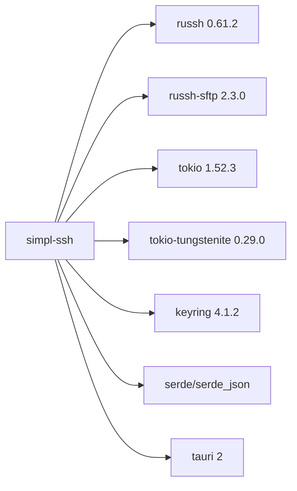

图表来源
- [src-tauri/Cargo.toml:22-49](file://src-tauri/Cargo.toml#L22-L49)

章节来源
- [src-tauri/Cargo.toml:1-50](file://src-tauri/Cargo.toml#L1-L50)

## 性能考虑
- 会话复用：终端、SFTP、端口转发共享同一 Handle，避免重复握手与认证。
- 超时策略：TCP 建连、SSH 握手、认证分别设置超时，提升失败反馈速度。
- 传输串行：SFTP 传输队列串行执行，降低并发争用；大文件分片传输（64KB 片）并定期推送进度。
- PTY 桥接：使用 mpsc 管道与 select! 并发读写，避免阻塞。
- 缓存与最小授权：凭据缓存减少钥匙串访问；known_hosts 与 TOFU 降低交互成本。

## 故障排查指南
- 连接超时：检查 TCP_TTL/HANDSHAKE_TTL/AUTH_TTL 设置与网络可达性。
- 主机公钥问题：Unknown/Changed 时通过 ssh://hostkey 事件确认；必要时使用 hostkey_remove 清理冲突记录。
- 认证失败：确认用户名/密码或私钥路径/口令；查看认证超时与错误日志。
- PTY 无输出：确认 request_pty/request_shell 成功；检查 TerminalBridge 是否正确注册 token。
- SFTP 错误：检查会话是否存在、SFTP channel 是否创建成功；关注文件大小与编码限制。
- 端口转发失败：确认本地监听端口可用、-R 远端绑定成功、-D SOCKS5 握手超时设置合理。
- X11 无法连接：确认 DISPLAY 环境变量与本地 X Server 可达；检查 cookie 与权限。

章节来源
- [src-tauri/src/session/manager.rs:24-317](file://src-tauri/src/session/manager.rs#L24-L317)
- [src-tauri/src/session/known_hosts.rs:97-135](file://src-tauri/src/session/known_hosts.rs#L97-L135)
- [src-tauri/src/session/pty.rs:75-143](file://src-tauri/src/session/pty.rs#L75-L143)
- [src-tauri/src/session/sftp.rs:30-75](file://src-tauri/src/session/sftp.rs#L30-L75)
- [src-tauri/src/session/forward.rs:231-295](file://src-tauri/src/session/forward.rs#L231-L295)
- [src-tauri/src/session/x11.rs:62-125](file://src-tauri/src/session/x11.rs#L62-L125)

## 结论
本项目以 russh 为核心，结合会话池、认证、主机公钥校验、PTY/WS 桥接、SFTP、端口转发与 X11 转发，构建了功能完备、安全可控的 SSH 客户端后端。通过合理的超时策略、凭据安全与传输串行化，兼顾易用性与性能。扩展方面，可在 ClientHandler 中增加自定义认证回调、在 HostKeyVerifier 中扩展校验策略、在 PortForwardManager 中新增转发类型。

## 附录

### SSH 配置参数与安全选项
- 连接参数：host/port/user/auth（密码/私钥）/jump（单跳跳板机）。
- 主机公钥：~/.ssh/known_hosts 兼容，支持 TOFU 与变更检测。
- 凭据存储：密码与私钥口令存 OS 钥匙串，支持 24h 内内存缓存。
- 安全建议：首次连接严格核验指纹；公钥变更需人工确认；避免在不受信网络暴露本地端口转发。

章节来源
- [src-tauri/src/session/auth.rs:20-42](file://src-tauri/src/session/auth.rs#L20-L42)
- [src-tauri/src/session/known_hosts.rs:68-135](file://src-tauri/src/session/known_hosts.rs#L68-L135)
- [src-tauri/src/session/profile.rs:316-341](file://src-tauri/src/session/profile.rs#L316-L341)
- [README.md:155-162](file://README.md#L155-L162)

### 性能调优建议
- 合理设置超时：根据网络环境调整 TCP_TTL/HANDSHAKE_TTL/AUTH_TTL。
- 传输优化：增大传输块大小（谨慎评估内存占用），减少进度事件频率以降低开销。
- 并发控制：保持 SFTP 串行，避免多任务并发争用；如需并行，拆分为多会话。
- 日志与追踪：生产环境启用 env-filter，聚焦关键事件（ssh://progress、transfer://state）。

### 扩展与自定义认证实现指导
- 在 ClientHandler 中扩展认证回调：实现 russh::client::Handler 的认证相关方法，按需添加挑战/响应逻辑。
- 在 HostKeyVerifier 中扩展校验策略：支持多源 known_hosts、批量导入/导出、冲突自动修复。
- 在 PortForwardManager 中新增转发类型：定义新的 ForwardKind 与桥接逻辑，注册到 ForwardRegistry。
- 在 ProfileStore 中扩展认证方式：新增 AuthMethod 与凭据存储/读取逻辑，保持与现有缓存与钥匙串集成。

章节来源
- [src-tauri/src/session/mod.rs:115-226](file://src-tauri/src/session/mod.rs#L115-L226)
- [src-tauri/src/session/forward.rs:52-116](file://src-tauri/src/session/forward.rs#L52-L116)
- [src-tauri/src/session/profile.rs:21-45](file://src-tauri/src/session/profile.rs#L21-L45)