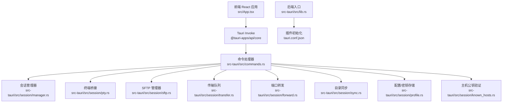
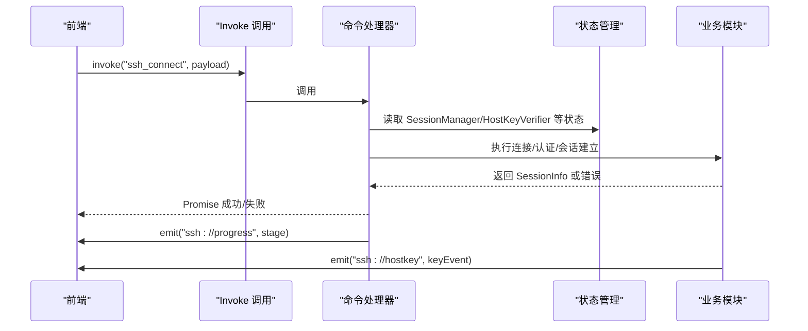
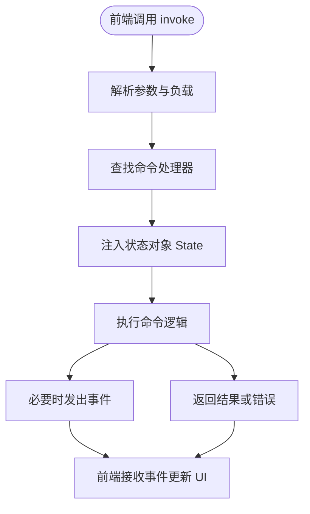
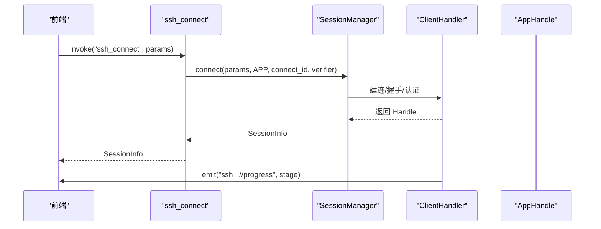
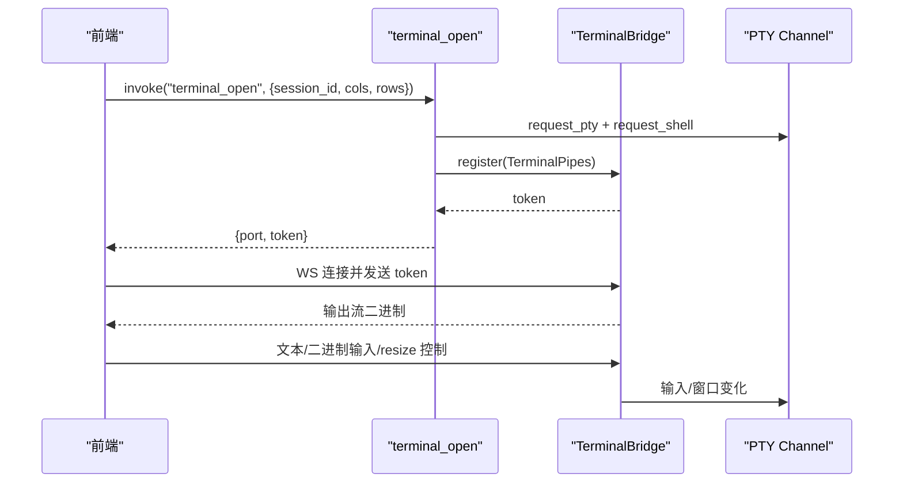
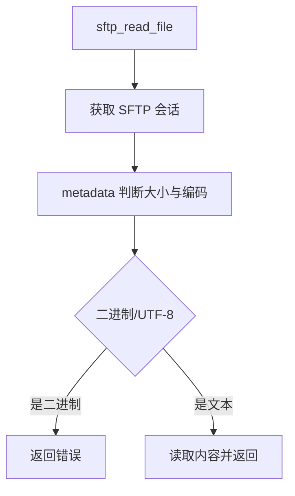
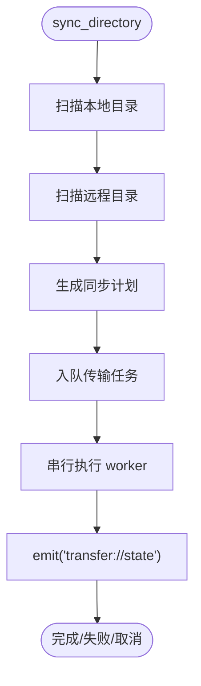
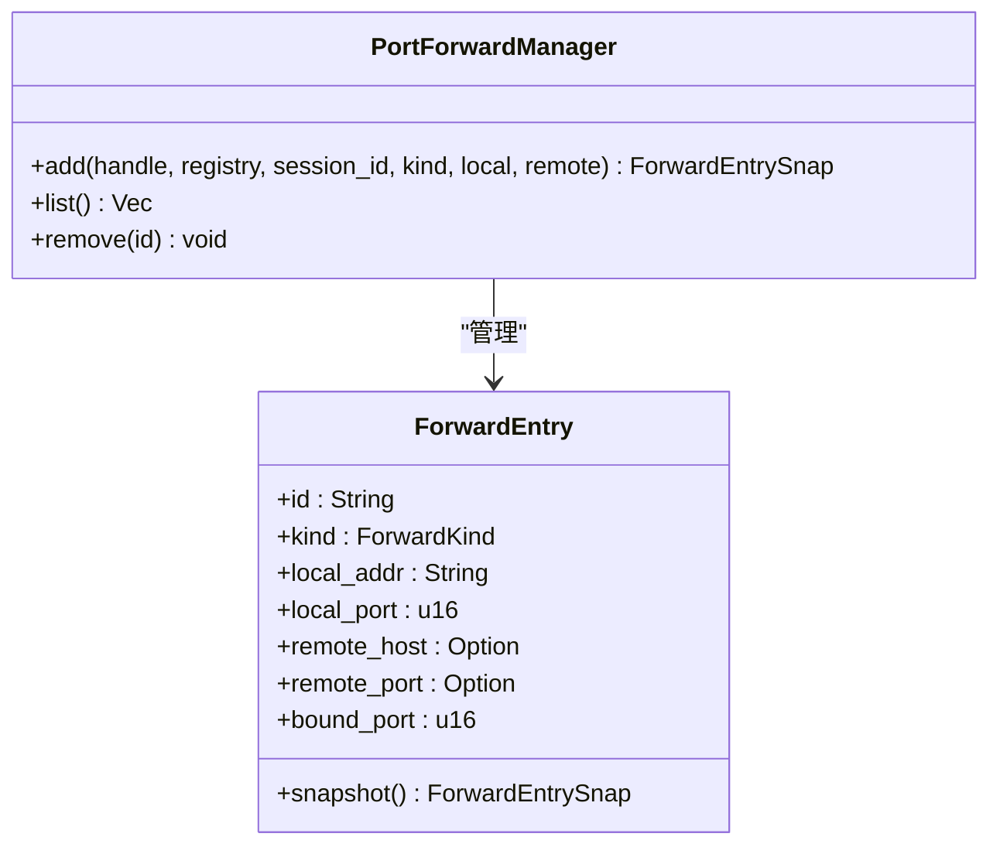
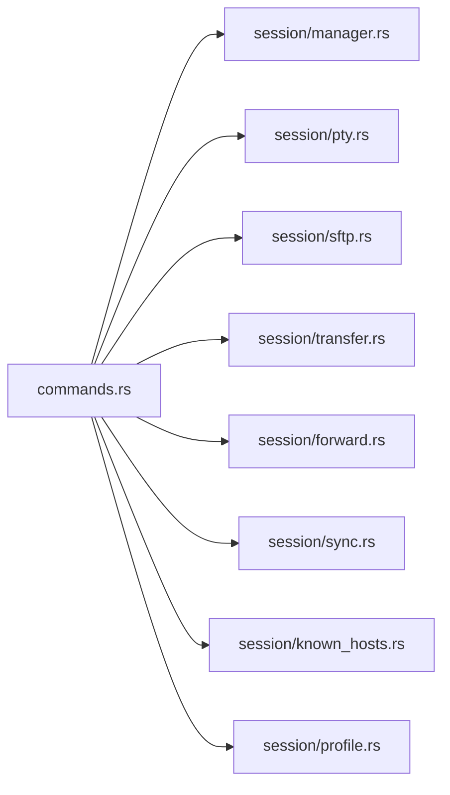

# Tauri 命令系统

<cite>
**本文档引用的文件**
- [src-tauri/src/lib.rs](file://src-tauri/src/lib.rs)
- [src-tauri/src/main.rs](file://src-tauri/src/main.rs)
- [src-tauri/src/commands.rs](file://src-tauri/src/commands.rs)
- [src-tauri/src/session/mod.rs](file://src-tauri/src/session/mod.rs)
- [src-tauri/src/session/manager.rs](file://src-tauri/src/session/manager.rs)
- [src-tauri/src/session/pty.rs](file://src-tauri/src/session/pty.rs)
- [src-tauri/src/session/sftp.rs](file://src-tauri/src/session/sftp.rs)
- [src-tauri/src/session/transfer.rs](file://src-tauri/src/session/transfer.rs)
- [src-tauri/src/session/sync.rs](file://src-tauri/src/session/sync.rs)
- [src-tauri/src/session/forward.rs](file://src-tauri/src/session/forward.rs)
- [src/App.tsx](file://src/App.tsx)
- [src/main.tsx](file://src/main.tsx)
- [src-tauri/Cargo.toml](file://src-tauri/Cargo.toml)
- [src-tauri/tauri.conf.json](file://src-tauri/tauri.conf.json)
</cite>

## 目录
1. [简介](#简介)
2. [项目结构](#项目结构)
3. [核心组件](#核心组件)
4. [架构总览](#架构总览)
5. [详细组件分析](#详细组件分析)
6. [依赖关系分析](#依赖关系分析)
7. [性能考虑](#性能考虑)
8. [故障排除指南](#故障排除指南)
9. [结论](#结论)

## 简介
本文件系统性解析 Tauri 命令系统在该项目中的实现与应用，重点涵盖：
- 命令注册与调用机制
- 参数传递与返回值处理
- 错误传播与事件驱动反馈
- 命令执行上下文与异步并发模型
- 传输队列、端口转发、SFTP 等扩展能力
- 前后端通信协议与调试技巧

## 项目结构
后端采用 Rust + Tauri，前端为 React。命令系统位于后端，通过 Tauri 的 invoke 机制暴露给前端。

**图表来源**
- [src-tauri/src/lib.rs:14-92](file://src-tauri/src/lib.rs#L14-L92)
- [src-tauri/src/commands.rs:1-996](file://src-tauri/src/commands.rs#L1-L996)
- [src/App.tsx:1-685](file://src/App.tsx#L1-L685)

**章节来源**
- [src-tauri/src/lib.rs:14-92](file://src-tauri/src/lib.rs#L14-L92)
- [src-tauri/src/main.rs:4-7](file://src-tauri/src/main.rs#L4-L7)
- [src-tauri/tauri.conf.json:1-54](file://src-tauri/tauri.conf.json#L1-L54)

## 核心组件
- 命令注册与入口
  - 后端入口在 lib.rs 中构建 Builder，注册所有命令并通过 generate_handler! 聚合。
  - 管理器、桥接器、SFTP、传输队列、转发等通过 manage 注入为全局状态，命令通过 tauri::State<'_, T> 获取。
- 命令定义与实现
  - commands.rs 使用 #[tauri::command] 宏声明命令，参数来自前端 invoke 调用，返回值统一为 Result<T, String>。
- 前端调用
  - 前端通过 @tauri-apps/api/core 的 invoke 调用命令，监听 ssh://progress、ssh://hostkey、transfer://* 等事件获取状态反馈。

**章节来源**
- [src-tauri/src/lib.rs:43-89](file://src-tauri/src/lib.rs#L43-L89)
- [src-tauri/src/commands.rs:25-996](file://src-tauri/src/commands.rs#L25-L996)
- [src/App.tsx:98-126](file://src/App.tsx#L98-L126)

## 架构总览
Tauri 命令系统采用“薄封装”的命令层，将业务逻辑集中在 session 子模块中，命令层负责参数解析、状态注入与事件广播。

**图表来源**
- [src-tauri/src/commands.rs:42-72](file://src-tauri/src/commands.rs#L42-L72)
- [src-tauri/src/session/manager.rs:82-145](file://src-tauri/src/session/manager.rs#L82-L145)
- [src/App.tsx:136-160](file://src/App.tsx#L136-L160)

## 详细组件分析

### 命令注册与调用流程
- 注册方式
  - 在 lib.rs 的 Builder.setup 中，通过 generate_handler! 将 commands.rs 中的所有 #[tauri::command] 函数注册为可调用命令。
- 调用方式
  - 前端使用 invoke("commandName", payload) 调用，返回 Promise；错误通过 catch 捕获并提示。
- 上下文注入
  - 通过 tauri::State<'_, T> 注入 SessionManager、SftpManager、TransferQueue、PortForwardManager、HostKeyVerifier 等状态对象。

**图表来源**
- [src-tauri/src/lib.rs:43-89](file://src-tauri/src/lib.rs#L43-L89)
- [src/App.tsx:312-336](file://src/App.tsx#L312-L336)

**章节来源**
- [src-tauri/src/lib.rs:43-89](file://src-tauri/src/lib.rs#L43-L89)
- [src/App.tsx:98-126](file://src/App.tsx#L98-L126)

### SSH 会话管理与命令
- ssh_connect
  - 解析认证方式与跳板机参数，调用 SessionManager.connect 建立持久会话，并通过 emit("ssh://progress") 推送连接阶段。
- ssh_list_sessions / ssh_disconnect
  - 列出会话、断开会话并清理相关资源（转发、SFTP、监控）。
- ssh_exec（一次性执行）
  - 早期 demo，连接后执行命令并返回输出。

**图表来源**
- [src-tauri/src/commands.rs:42-72](file://src-tauri/src/commands.rs#L42-L72)
- [src-tauri/src/session/manager.rs:82-145](file://src-tauri/src/session/manager.rs#L82-L145)

**章节来源**
- [src-tauri/src/commands.rs:25-95](file://src-tauri/src/commands.rs#L25-L95)
- [src-tauri/src/session/manager.rs:31-48](file://src-tauri/src/session/manager.rs#L31-L48)

### 终端（PTY）与 WebSocket 桥接
- terminal_open
  - 在指定会话上打开 PTY，创建 mpsc 管道，注册到 TerminalBridge，返回本地 WS 端口与一次性 token。
  - 后端桥接任务监听输入/窗口大小变化，将 PTY 数据通过 WS 推送前端。
- 前端连接
  - 建立 WS 连接，发送 token，随后通过二进制消息与控制消息（resize）与后端交互。

**图表来源**
- [src-tauri/src/commands.rs:106-186](file://src-tauri/src/commands.rs#L106-L186)
- [src-tauri/src/session/pty.rs:47-143](file://src-tauri/src/session/pty.rs#L47-L143)

**章节来源**
- [src-tauri/src/commands.rs:99-186](file://src-tauri/src/commands.rs#L99-L186)
- [src-tauri/src/session/pty.rs:31-143](file://src-tauri/src/session/pty.rs#L31-L143)

### SFTP 文件操作
- sftp_list / sftp_mkdir / sftp_rename / sftp_remove
  - 通过 SftpManager 获取/创建 SFTP 会话，复用 SSH 连接执行目录/文件操作。
- sftp_read_file / sftp_write_file
  - 读取远程文件内容（5MB 上限）、写入远程文件，返回结构化结果。

**图表来源**
- [src-tauri/src/commands.rs:284-360](file://src-tauri/src/commands.rs#L284-L360)
- [src-tauri/src/session/sftp.rs:30-75](file://src-tauri/src/session/sftp.rs#L30-L75)

**章节来源**
- [src-tauri/src/commands.rs:190-360](file://src-tauri/src/commands.rs#L190-L360)
- [src-tauri/src/session/sftp.rs:14-124](file://src-tauri/src/session/sftp.rs#L14-L124)

### 传输队列与目录同步
- 传输队列
  - TransferQueue 串行执行任务，支持取消；通过 transfer://state 事件推送任务快照。
- 目录同步
  - 根据本地/远程文件时间戳与大小比较，生成上传/下载计划并入队。

**图表来源**
- [src-tauri/src/commands.rs:408-431](file://src-tauri/src/commands.rs#L408-L431)
- [src-tauri/src/session/sync.rs:44-148](file://src-tauri/src/session/sync.rs#L44-L148)
- [src-tauri/src/session/transfer.rs:128-200](file://src-tauri/src/session/transfer.rs#L128-L200)

**章节来源**
- [src-tauri/src/commands.rs:364-431](file://src-tauri/src/commands.rs#L364-L431)
- [src-tauri/src/session/transfer.rs:25-200](file://src-tauri/src/session/transfer.rs#L25-L200)
- [src-tauri/src/session/sync.rs:12-200](file://src-tauri/src/session/sync.rs#L12-L200)

### 端口转发（-L/-R/-D）
- forward_add
  - 支持本地转发、动态转发（SOCKS5）、远程转发（服务器绑定端口）。
- forward_list / forward_remove
  - 列出与移除转发；远程转发额外通知服务器取消绑定。

**图表来源**
- [src-tauri/src/commands.rs:436-514](file://src-tauri/src/commands.rs#L436-L514)
- [src-tauri/src/session/forward.rs:117-200](file://src-tauri/src/session/forward.rs#L117-L200)

**章节来源**
- [src-tauri/src/commands.rs:433-514](file://src-tauri/src/commands.rs#L433-L514)
- [src-tauri/src/session/forward.rs:1-200](file://src-tauri/src/session/forward.rs#L1-L200)

### 连接配置与主机公钥校验
- 配置管理
  - profile_list/save/update/delete/connect/select_private_key/group_* 等命令。
- 主机公钥校验
  - hostkey_trust/reject/remove：信任/拒绝/删除已知主机记录，配合 ssh://hostkey 事件驱动前端确认。

**章节来源**
- [src-tauri/src/commands.rs:516-800](file://src-tauri/src/commands.rs#L516-L800)
- [src-tauri/src/session/mod.rs:52-160](file://src-tauri/src/session/mod.rs#L52-L160)

## 依赖关系分析
- 外部依赖
  - russh / russh-sftp：SSH 与 SFTP 实现
  - tokio / tokio-tungstenite：异步运行时与 WebSocket
  - serde / serde_json：序列化与事件载荷
  - tauri-plugin-*：系统集成插件
- 内部模块耦合
  - commands.rs 依赖 session 子模块（manager/pty/sftp/transfer/forward/sync/known_hosts/profile 等）
  - 通过 State 注入降低耦合，命令仅关注参数与状态读写

**图表来源**
- [src-tauri/src/commands.rs:1-22](file://src-tauri/src/commands.rs#L1-L22)
- [src-tauri/Cargo.toml:22-49](file://src-tauri/Cargo.toml#L22-L49)

**章节来源**
- [src-tauri/Cargo.toml:22-49](file://src-tauri/Cargo.toml#L22-L49)

## 性能考虑
- 异步并发
  - 命令与桥接均基于 tokio；传输队列串行执行避免 SFTP 并发争用；端口转发使用独立监听器与桥接循环。
- 资源复用
  - 会话复用同一 SSH 连接，SFTP 与 PTY 共享 Handle；SFTP 会话按会话 ID 缓存。
- 事件驱动
  - 连接进度与传输状态通过事件推送，前端无需轮询，降低 CPU 占用。
- I/O 优化
  - PTY 桥接使用固定缓冲区与 select! 并发读写；SFTP 列目录排序与过滤减少前端渲染压力。

[本节为通用指导，不直接分析具体文件]

## 故障排除指南
- 前端调用失败
  - 检查命令名称与参数是否与后端定义一致；捕获 invoke 的错误并显示提示。
- 连接失败
  - 关注 ssh://progress 事件，定位阶段（resolve/handshake/auth/jump/ready）；查看日志与错误字符串。
- 主机公钥问题
  - 监听 ssh://hostkey 事件，调用 hostkey_trust/hostkey_reject；确保重连流程正确。
- 传输异常
  - 查看 transfer://state 事件，确认任务状态与错误信息；必要时取消任务并重试。
- 终端无输出
  - 确认 WS token 正确发送；检查桥接任务是否正常运行；排查 resize 控制消息格式。

**章节来源**
- [src/App.tsx:136-160](file://src/App.tsx#L136-L160)
- [src-tauri/src/commands.rs:770-800](file://src-tauri/src/commands.rs#L770-L800)
- [src-tauri/src/session/transfer.rs:178-200](file://src-tauri/src/session/transfer.rs#L178-L200)

## 结论
该 Tauri 命令系统通过薄封装的命令层与丰富的会话子模块，实现了 SSH 连接、终端、SFTP、传输队列与端口转发的完整功能栈。命令层负责参数解析与状态注入，业务逻辑集中在 session 子模块，结合事件驱动与异步并发，提供了稳定高效的前后端通信机制。建议在扩展新命令时遵循现有模式：命令层仅做薄封装，核心逻辑下沉到 session 模块，保持高内聚低耦合。