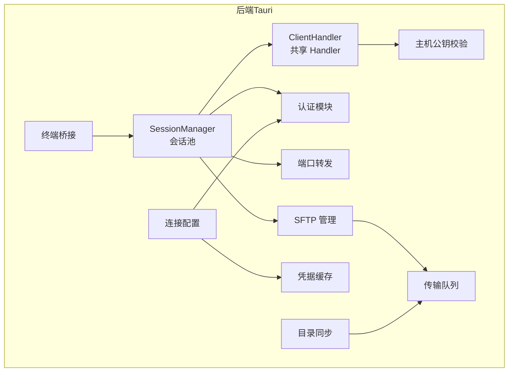
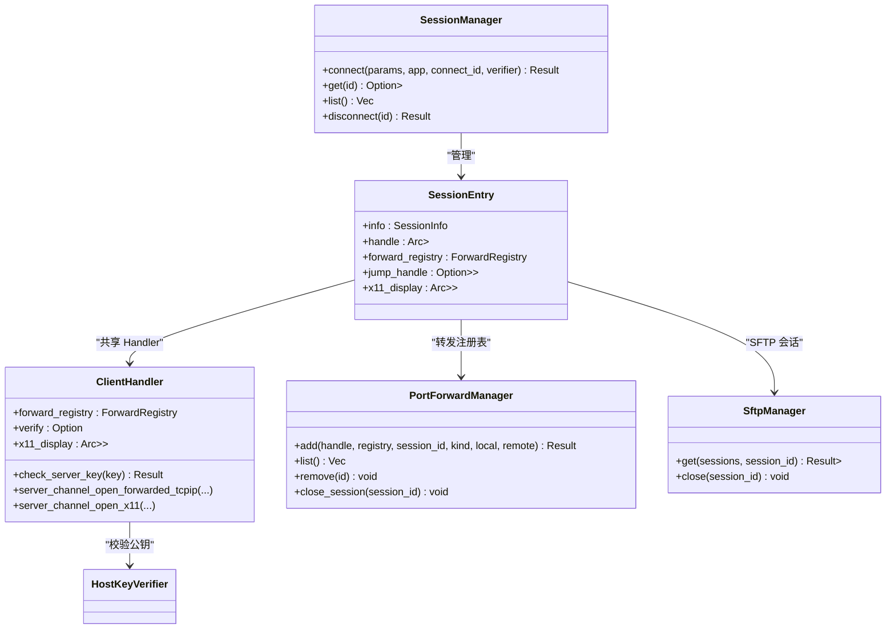
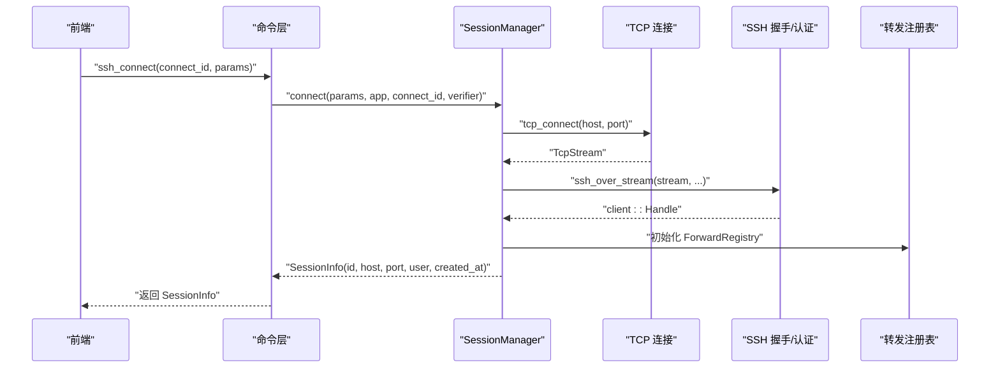
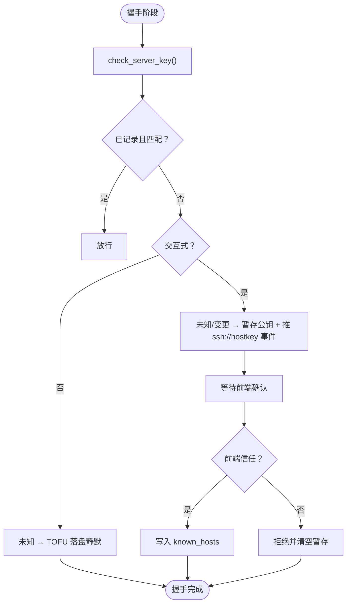
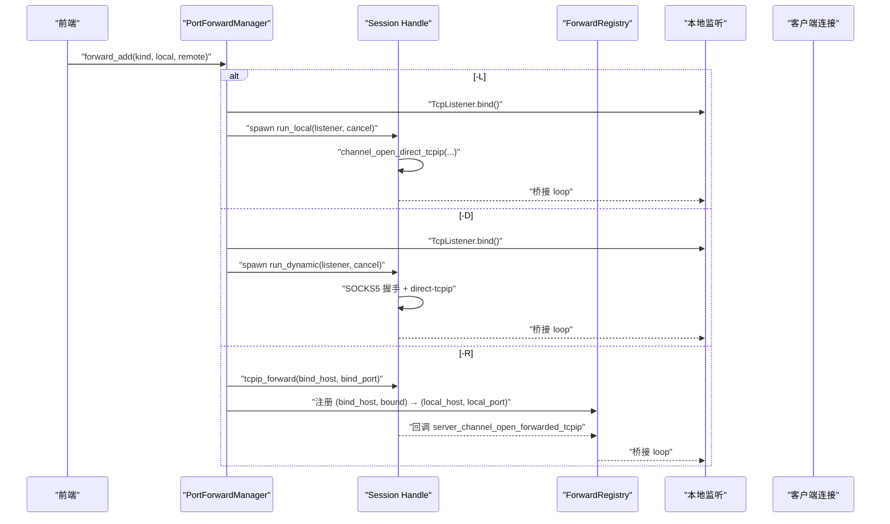
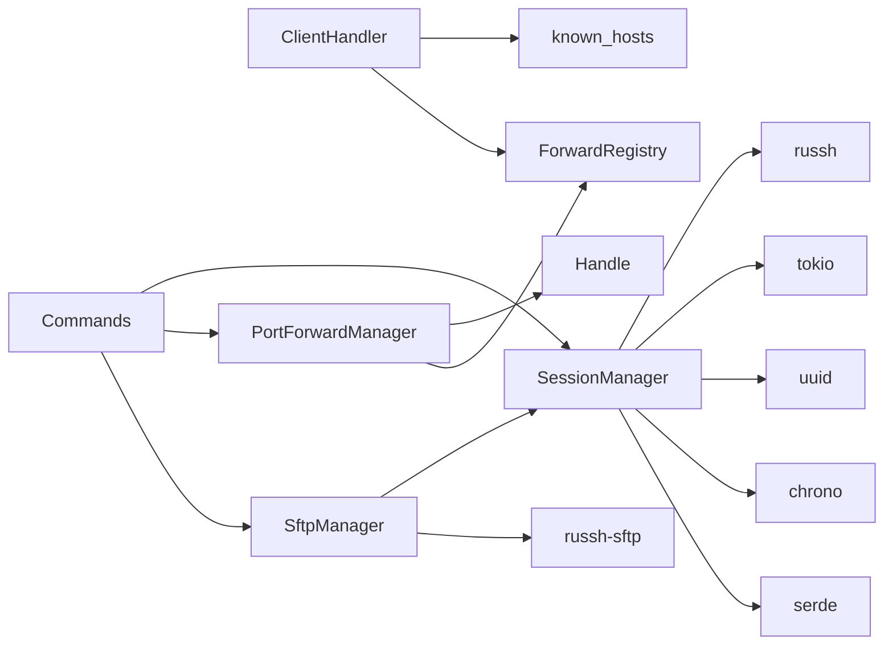

# 会话管理系统

<cite>
**本文档引用的文件**
- [src-tauri/src/session/manager.rs](file://src-tauri/src/session/manager.rs)
- [src-tauri/src/session/mod.rs](file://src-tauri/src/session/mod.rs)
- [src-tauri/src/session/auth.rs](file://src-tauri/src/session/auth.rs)
- [src-tauri/src/session/ssh.rs](file://src-tauri/src/session/ssh.rs)
- [src-tauri/src/session/forward.rs](file://src-tauri/src/session/forward.rs)
- [src-tauri/src/session/pty.rs](file://src-tauri/src/session/pty.rs)
- [src-tauri/src/session/sftp.rs](file://src-tauri/src/session/sftp.rs)
- [src-tauri/src/session/known_hosts.rs](file://src-tauri/src/session/known_hosts.rs)
- [src-tauri/src/session/profile.rs](file://src-tauri/src/session/profile.rs)
- [src-tauri/src/session/secrets.rs](file://src-tauri/src/session/secrets.rs)
- [src-tauri/src/session/transfer.rs](file://src-tauri/src/session/transfer.rs)
- [src-tauri/src/session/sync.rs](file://src-tauri/src/session/sync.rs)
- [src-tauri/src/commands.rs](file://src-tauri/src/commands.rs)
- [src-tauri/src/lib.rs](file://src-tauri/src/lib.rs)
- [src-tauri/Cargo.toml](file://src-tauri/Cargo.toml)
- [README.md](file://README.md)
</cite>

## 目录
1. [简介](#简介)
2. [项目结构](#项目结构)
3. [核心组件](#核心组件)
4. [架构总览](#架构总览)
5. [详细组件分析](#详细组件分析)
6. [依赖关系分析](#依赖关系分析)
7. [性能考量](#性能考量)
8. [故障排查指南](#故障排查指南)
9. [结论](#结论)
10. [附录](#附录)

## 简介
本项目是一个基于 Rust 与 Tauri 的轻量级 SSH 客户端，核心能力包括多会话管理、终端（PTY）、SFTP 文件传输、端口转发（-L/-R/-D）、目录同步、主机公钥校验与凭据安全存储。本文聚焦“会话管理系统”，深入解析 SessionManager 的设计架构与实现机制，涵盖连接池管理策略、会话生命周期控制、SSH 连接复用机制、并发会话处理、会话状态管理、连接超时处理、断线重连逻辑、资源清理策略、会话标识符生成、会话数据持久化以及多会话协调机制，并提供最佳实践与性能优化建议。

## 项目结构
后端位于 src-tauri，采用模块化组织，会话相关的核心模块包括：
- session/manager.rs：会话池与持久连接管理
- session/mod.rs：会话共享的 ClientHandler 与公共类型
- session/auth.rs：认证参数与认证流程
- session/ssh.rs：一次性 exec 示例
- session/forward.rs：端口转发（-L/-R/-D）
- session/pty.rs：终端桥接（本地 WebSocket）
- session/sftp.rs：SFTP 管理（复用会话连接）
- session/known_hosts.rs：主机公钥校验与 known_hosts 管理
- session/profile.rs：连接配置与凭据存储
- session/secrets.rs：内存加密凭据缓存
- session/transfer.rs：传输队列（串行 + 可取消）
- session/sync.rs：目录同步（基于传输队列）

图表来源
- [src-tauri/src/session/manager.rs:76-253](file://src-tauri/src/session/manager.rs#L76-L253)
- [src-tauri/src/session/mod.rs:52-225](file://src-tauri/src/session/mod.rs#L52-L225)
- [src-tauri/src/session/auth.rs:10-81](file://src-tauri/src/session/auth.rs#L10-L81)
- [src-tauri/src/session/forward.rs:117-229](file://src-tauri/src/session/forward.rs#L117-L229)
- [src-tauri/src/session/pty.rs:41-142](file://src-tauri/src/session/pty.rs#L41-L142)
- [src-tauri/src/session/sftp.rs:24-75](file://src-tauri/src/session/sftp.rs#L24-L75)
- [src-tauri/src/session/known_hosts.rs:63-135](file://src-tauri/src/session/known_hosts.rs#L63-L135)
- [src-tauri/src/session/profile.rs:67-419](file://src-tauri/src/session/profile.rs#L67-L419)
- [src-tauri/src/session/secrets.rs:37-110](file://src-tauri/src/session/secrets.rs#L37-L110)
- [src-tauri/src/session/transfer.rs:121-203](file://src-tauri/src/session/transfer.rs#L121-L203)
- [src-tauri/src/session/sync.rs:44-148](file://src-tauri/src/session/sync.rs#L44-L148)

章节来源
- [src-tauri/src/lib.rs:14-92](file://src-tauri/src/lib.rs#L14-L92)
- [README.md:111-135](file://README.md#L111-L135)

## 核心组件
- SessionManager：全局会话池，负责建立持久连接、登记会话、查询、断开与清理。
- SessionEntry：会话实体，包含会话元数据、共享 Handle、转发注册表、跳板机 Handle、X11 显示目标。
- ClientHandler：共享的 russh 客户端 Handler，统一处理主机公钥校验、远端转发回调、X11 桥接。
- SshConnectParams/SshAuth：连接参数与认证方式（密码/私钥）。
- PortForwardManager：端口转发管理（-L/-R/-D），与会话共享 Handle。
- SftpManager：SFTP 会话缓存，复用同一 SSH 连接。
- HostKeyVerifier：主机公钥校验状态机（内存暂存 + 前端确认）。
- ProfileStore/PasswordCache：连接配置持久化与凭据加密缓存。
- TerminalBridge：本地 WebSocket 终端桥接。
- TransferQueue/Sync：传输队列与目录同步。

章节来源
- [src-tauri/src/session/manager.rs:50-144](file://src-tauri/src/session/manager.rs#L50-L144)
- [src-tauri/src/session/mod.rs:52-113](file://src-tauri/src/session/mod.rs#L52-L113)
- [src-tauri/src/session/auth.rs:10-81](file://src-tauri/src/session/auth.rs#L10-L81)
- [src-tauri/src/session/forward.rs:117-229](file://src-tauri/src/session/forward.rs#L117-L229)
- [src-tauri/src/session/sftp.rs:24-75](file://src-tauri/src/session/sftp.rs#L24-L75)
- [src-tauri/src/session/known_hosts.rs:63-135](file://src-tauri/src/session/known_hosts.rs#L63-L135)
- [src-tauri/src/session/profile.rs:67-419](file://src-tauri/src/session/profile.rs#L67-L419)
- [src-tauri/src/session/secrets.rs:37-110](file://src-tauri/src/session/secrets.rs#L37-L110)
- [src-tauri/src/session/pty.rs:41-142](file://src-tauri/src/session/pty.rs#L41-L142)
- [src-tauri/src/session/transfer.rs:121-203](file://src-tauri/src/session/transfer.rs#L121-L203)
- [src-tauri/src/session/sync.rs:44-148](file://src-tauri/src/session/sync.rs#L44-L148)

## 架构总览
会话管理以 SessionManager 为核心，围绕“一个连接 = 一个 SessionEntry”的理念，将认证后的 russh Handle 与转发注册表、X11 显示目标等共享给终端、SFTP、端口转发等子系统使用。ClientHandler 统一处理握手阶段的主机公钥校验与转发回调，确保多子系统在同一 SSH 连接上并发工作而不互相干扰。

图表来源
- [src-tauri/src/session/manager.rs:76-253](file://src-tauri/src/session/manager.rs#L76-L253)
- [src-tauri/src/session/mod.rs:52-225](file://src-tauri/src/session/mod.rs#L52-L225)
- [src-tauri/src/session/forward.rs:117-229](file://src-tauri/src/session/forward.rs#L117-L229)
- [src-tauri/src/session/sftp.rs:24-75](file://src-tauri/src/session/sftp.rs#L24-L75)

## 详细组件分析

### SessionManager：会话池与生命周期
- 连接池策略：以 HashMap<String, Arc<SessionEntry>> 维护会话，键为会话标识符，值为共享的 SessionEntry。
- 生命周期：
  - 建连：connect() 完成 TCP 连接、SSH 握手与认证，生成 SessionInfo 与 SessionEntry 并登记。
  - 查询：get()/list() 提供会话检索与列表。
  - 断开：disconnect() 触发 ByApplication 断开，优先断开目标会话，再断开跳板机（若存在）。
- 超时与进度：TCP_TTL/HANDSHAKE_TTL/AUTH_TTL 三段超时，配合 ssh://progress 事件向前端反馈阶段进度。
- 跳板机：connect_via_jump() 先连跳板，再通过 direct-tcpip 隧道连目标，保持 jump_handle 以维持隧道存活。
- 会话标识符：使用 UUID v4 生成唯一会话 ID。

图表来源
- [src-tauri/src/session/manager.rs:82-145](file://src-tauri/src/session/manager.rs#L82-L145)
- [src-tauri/src/session/manager.rs:255-317](file://src-tauri/src/session/manager.rs#L255-L317)
- [src-tauri/src/commands.rs:42-72](file://src-tauri/src/commands.rs#L42-L72)

章节来源
- [src-tauri/src/session/manager.rs:24-317](file://src-tauri/src/session/manager.rs#L24-L317)
- [src-tauri/src/commands.rs:42-95](file://src-tauri/src/commands.rs#L42-L95)

### ClientHandler：共享 Handler 与回调
- 主机公钥校验：check_server_key() 复用 ~/.ssh/known_hosts，支持未知（TOFU）与变更（MITM）两种交互式确认流程。
- 远端转发回调：server_channel_open_forwarded_tcpip() 根据 ForwardRegistry 查找本地目标并桥接。
- X11 转发：server_channel_open_x11() 依据 x11_display 桥接到本地 DISPLAY。
- 交互式 vs 非交互：for_session()/for_exec() 区分持久会话与一次性 exec 的校验行为。

图表来源
- [src-tauri/src/session/mod.rs:115-160](file://src-tauri/src/session/mod.rs#L115-L160)
- [src-tauri/src/session/known_hosts.rs:63-135](file://src-tauri/src/session/known_hosts.rs#L63-L135)

章节来源
- [src-tauri/src/session/mod.rs:52-225](file://src-tauri/src/session/mod.rs#L52-L225)
- [src-tauri/src/session/known_hosts.rs:63-135](file://src-tauri/src/session/known_hosts.rs#L63-L135)

### 认证与连接参数
- SshAuth：密码认证与私钥认证（支持 passphrase）。
- SshConnectParams：包含 host/port/user/auth/jump。
- authenticate()：带超时的认证流程，失败时主动断开连接。
- 一次性 exec：connect_and_exec() 用于早期 demo，不复用会话池。

章节来源
- [src-tauri/src/session/auth.rs:10-81](file://src-tauri/src/session/auth.rs#L10-L81)
- [src-tauri/src/session/ssh.rs:13-64](file://src-tauri/src/session/ssh.rs#L13-L64)

### 端口转发：-L/-R/-D 复用同一 Handle
- ForwardRegistry：远端转发注册表，供回调桥接本地目标。
- PortForwardManager：管理转发生命周期，支持本地监听（-L）、动态 SOCKS5（-D）、远端绑定（-R）。
- 本地转发：run_local() 每个连接开 direct-tcpip 并桥接。
- 动态转发：run_dynamic() 先 SOCKS5 握手再 direct-tcpip。
- 远端转发：tcpip_forward() 绑定远端端口，回调中根据注册表桥接。

图表来源
- [src-tauri/src/session/forward.rs:117-229](file://src-tauri/src/session/forward.rs#L117-L229)
- [src-tauri/src/session/forward.rs:231-294](file://src-tauri/src/session/forward.rs#L231-L294)

章节来源
- [src-tauri/src/session/forward.rs:1-295](file://src-tauri/src/session/forward.rs#L1-L295)

### SFTP：复用会话连接
- SftpManager：按 session_id 缓存 SftpSession，首次在会话 Handle 上开 SFTP subsystem channel。
- 列目录、读写文件、删除、创建等操作均复用同一 SSH 连接，避免重复认证。
- 断开会话时清理对应 SftpSession。

章节来源
- [src-tauri/src/session/sftp.rs:24-75](file://src-tauri/src/session/sftp.rs#L24-L75)

### 终端桥接：本地 WebSocket
- TerminalBridge：启动本地 WS 服务，按 token 将 mpsc 管道与 WS 连接绑定。
- terminal_open()：在指定会话上开 PTY，桥接输入输出与窗口大小变化。
- 与 PTY 的桥接循环在命令层启动，确保输入/输出/Resize 三向流动。

章节来源
- [src-tauri/src/session/pty.rs:41-142](file://src-tauri/src/session/pty.rs#L41-L142)
- [src-tauri/src/commands.rs:105-186](file://src-tauri/src/commands.rs#L105-L186)

### 传输队列与目录同步
- TransferQueue：串行 worker + 可取消，避免单连接上 SFTP 并发争用。
- 传输进度通过 transfer://progress 与 transfer://state 推送。
- Sync：扫描本地/远程目录树，按策略生成上传/下载任务并入队。

章节来源
- [src-tauri/src/session/transfer.rs:121-203](file://src-tauri/src/session/transfer.rs#L121-L203)
- [src-tauri/src/session/sync.rs:44-148](file://src-tauri/src/session/sync.rs#L44-L148)

### 主机公钥校验与凭据安全
- HostKeyVerifier：内存暂存待确认公钥，前端确认后写入 known_hosts。
- ProfileStore：连接配置持久化（JSON），凭据存 OS 钥匙串。
- PasswordCache：内存加密缓存（AES-256-GCM），24h TTL，提升用户体验。

章节来源
- [src-tauri/src/session/known_hosts.rs:63-135](file://src-tauri/src/session/known_hosts.rs#L63-L135)
- [src-tauri/src/session/profile.rs:67-419](file://src-tauri/src/session/profile.rs#L67-L419)
- [src-tauri/src/session/secrets.rs:37-110](file://src-tauri/src/session/secrets.rs#L37-L110)

## 依赖关系分析
- SessionManager 依赖 russh 客户端、tokio 异步运行时、uuid、chrono、serde 等。
- ClientHandler 依赖 known_hosts 校验与 ForwardRegistry。
- PortForwardManager 依赖 Handle 与 ForwardRegistry。
- SftpManager 依赖 SessionManager 与 russh-sftp。
- Commands 层通过 Tauri State 注入各管理器并暴露命令。

图表来源
- [src-tauri/Cargo.toml:22-49](file://src-tauri/Cargo.toml#L22-L49)
- [src-tauri/src/session/manager.rs:1-317](file://src-tauri/src/session/manager.rs#L1-L317)
- [src-tauri/src/session/forward.rs:1-295](file://src-tauri/src/session/forward.rs#L1-L295)
- [src-tauri/src/session/sftp.rs:1-124](file://src-tauri/src/session/sftp.rs#L1-L124)
- [src-tauri/src/commands.rs:1-800](file://src-tauri/src/commands.rs#L1-L800)

章节来源
- [src-tauri/Cargo.toml:22-49](file://src-tauri/Cargo.toml#L22-L49)
- [src-tauri/src/lib.rs:20-92](file://src-tauri/src/lib.rs#L20-L92)

## 性能考量
- 连接复用：通过 Arc<Handle> 共享同一 SSH 连接，减少握手与认证开销。
- 并发模型：Tokio 异步运行时 + select! 并发桥接，避免阻塞。
- 传输串行：TransferQueue 串行执行，降低 SFTP 并发竞争与网络拥塞风险。
- 缓存策略：PasswordCache 24h 内命中，减少钥匙串访问与授权弹窗。
- 超时控制：三段超时（DNS/TCP/Handshake/Auth）避免长时间挂起。
- 资源清理：断开会话时清理 SFTP 缓存、停止转发、清空监控快照。

## 故障排查指南
- 连接超时
  - TCP 连接超时：检查网络连通性与防火墙，确认 TCP_TTL 设置合理。
  - 握手超时：检查服务器负载与加密算法协商，适当增大 HANDSHAKE_TTL。
  - 认证超时：检查凭据有效性与服务器响应速度，适当增大 AUTH_TTL。
- 主机公钥问题
  - 未知公钥：前端确认后调用 hostkey_trust() 写入 known_hosts。
  - 公钥变更：前端确认后调用 hostkey_trust() 替换冲突记录。
- 断线与重连
  - 当前实现为断开即清理，不自动重连。可在上层业务中根据需要实现重连策略。
- 转发异常
  - -L/-D：检查本地监听端口占用与权限。
  - -R：确认服务器允许 tcpip_forward，断开会话时需取消远端绑定。
- SFTP 异常
  - 检查会话是否存在与 SFTP 缓存是否命中，必要时重新获取 SftpSession。
- 终端异常
  - 确认 TerminalBridge 正常启动与 token 有效，检查 mpsc 管道是否被消费。

章节来源
- [src-tauri/src/session/manager.rs:24-317](file://src-tauri/src/session/manager.rs#L24-L317)
- [src-tauri/src/session/known_hosts.rs:63-135](file://src-tauri/src/session/known_hosts.rs#L63-L135)
- [src-tauri/src/commands.rs:82-95](file://src-tauri/src/commands.rs#L82-L95)
- [src-tauri/src/session/forward.rs:117-229](file://src-tauri/src/session/forward.rs#L117-L229)
- [src-tauri/src/session/sftp.rs:24-75](file://src-tauri/src/session/sftp.rs#L24-L75)
- [src-tauri/src/session/pty.rs:41-142](file://src-tauri/src/session/pty.rs#L41-L142)

## 结论
SessionManager 以“一个连接 = 一个 SessionEntry”的设计实现了高效的连接复用与多子系统协同。通过共享的 ClientHandler、ForwardRegistry、X11 显示目标与 SFTP 缓存，终端、SFTP、端口转发在同一条 SSH 连接上并发运行，显著降低资源消耗与延迟。结合三段超时、主机公钥校验、凭据缓存与传输串行策略，系统在安全性与性能之间取得良好平衡。未来可在断线重连、连接池容量控制、会话心跳等方面进一步增强。

## 附录
- 最佳实践
  - 使用 SessionManager 统一管理会话，避免重复握手与认证。
  - 优先使用 -R 远端转发而非 -L 本地转发，减少对外网暴露面。
  - 传输任务使用 TransferQueue 串行执行，避免并发争用。
  - 合理设置超时参数，结合前端进度反馈提升用户体验。
  - 严格遵循主机公钥校验流程，避免 MITM 风险。
- 性能优化建议
  - 合理配置 Buffer 大小与桥接循环频率，平衡吞吐与 CPU 占用。
  - 对频繁操作（如目录扫描）考虑增量缓存与去重策略。
  - 在高延迟网络下适当增大超时阈值，避免误判超时。
  - 对大文件传输启用断点续传（如需）以提升稳定性。