# 后端服务架构

<cite>
**本文档引用的文件**
- [Cargo.toml](file://src-tauri/Cargo.toml)
- [main.rs](file://src-tauri/src/main.rs)
- [lib.rs](file://src-tauri/src/lib.rs)
- [commands.rs](file://src-tauri/src/commands.rs)
- [mod.rs](file://src-tauri/src/session/mod.rs)
- [manager.rs](file://src-tauri/src/session/manager.rs)
- [ssh.rs](file://src-tauri/src/session/ssh.rs)
- [pty.rs](file://src-tauri/src/session/pty.rs)
- [sftp.rs](file://src-tauri/src/session/sftp.rs)
- [transfer.rs](file://src-tauri/src/session/transfer.rs)
- [auth.rs](file://src-tauri/src/session/auth.rs)
- [forward.rs](file://src-tauri/src/session/forward.rs)
- [profile.rs](file://src-tauri/src/session/profile.rs)
- [known_hosts.rs](file://src-tauri/src/session/known_hosts.rs)
- [git_ops.rs](file://src-tauri/src/session/git_ops.rs)
</cite>

## 目录
1. [简介](#简介)
2. [项目结构](#项目结构)
3. [核心组件](#核心组件)
4. [架构总览](#架构总览)
5. [详细组件分析](#详细组件分析)
6. [依赖关系分析](#依赖关系分析)
7. [性能考量](#性能考量)
8. [故障排查指南](#故障排查指南)
9. [结论](#结论)
10. [附录](#附录)

## 简介
本项目是一个基于 Rust 与 Tauri 的轻量级 SSH 客户端后端，融合了终端（PTY）、SFTP 文件传输、端口转发、Git 操作与连接配置管理能力。后端采用模块化设计，围绕会话管理器统一复用底层 SSH 连接，结合 Tokio 异步运行时与 Russh/Russh-SFTP 实现高性能、可扩展的网络协议处理，并通过 Tauri 命令系统暴露给前端。

## 项目结构
后端位于 src-tauri 目录，采用“模块分层 + Tauri 状态注入”的组织方式：
- 入口与插件装配：lib.rs 负责初始化日志、注册插件、注入全局状态、启动本地终端桥接服务与传输队列 worker。
- 命令层：commands.rs 暴露所有 Tauri 命令，负责参数解析、鉴权与调用会话/传输/转发等子模块。
- 会话与协议：session 子模块提供 SSH 连接、认证、PTY、SFTP、端口转发、Git 操作、配置与主机公钥校验等能力。
- 依赖与运行时：Cargo.toml 指定 Tokio、Russh、Russh-SFTP、Tungstenite、Keyring 等依赖，使用 full 特性启用完整异步能力。

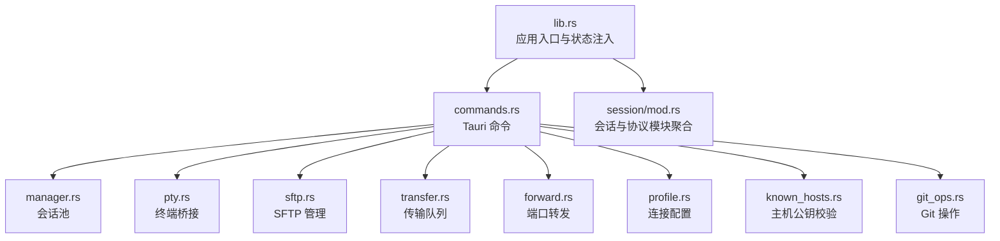

图表来源
- [lib.rs:14-92](file://src-tauri/src/lib.rs#L14-L92)
- [commands.rs:23-89](file://src-tauri/src/commands.rs#L23-L89)
- [mod.rs:1-40](file://src-tauri/src/session/mod.rs#L1-L40)

章节来源
- [Cargo.toml:22-49](file://src-tauri/Cargo.toml#L22-L49)
- [lib.rs:14-92](file://src-tauri/src/lib.rs#L14-L92)

## 核心组件
- 会话管理器（SessionManager）：维护持久 SSH 会话，支持直连与跳板机（ProxyJump）连接，统一推送连接进度事件。
- 终端桥接（TerminalBridge）：在本地启动 WebSocket 服务，将 russh 的 PTY channel 与前端 WS 通过 mpsc 管道桥接。
- SFTP 管理器（SftpManager）：在已建立的会话上打开 SFTP subsystem，缓存会话级 SFTP 会话，复用连接。
- 传输队列（TransferQueue）：串行执行上传/下载任务，支持取消与进度事件推送。
- 端口转发（PortForwardManager）：支持本地转发（-L）、动态转发（-D）与远程转发（-R），并在回调中桥接远端连接。
- 连接配置（ProfileStore）：保存连接元数据，凭据存入系统钥匙串，支持内存缓存减少授权弹窗。
- 主机公钥校验（HostKeyVerifier）：实现 known_hosts 校验与前端确认流程，支持 TOFU 与冲突替换。
- Git 操作（git_ops）：在现有会话上执行 git 命令并解析结构化输出。

章节来源
- [manager.rs:77-253](file://src-tauri/src/session/manager.rs#L77-L253)
- [pty.rs:42-143](file://src-tauri/src/session/pty.rs#L42-L143)
- [sftp.rs:25-75](file://src-tauri/src/session/sftp.rs#L25-L75)
- [transfer.rs:122-203](file://src-tauri/src/session/transfer.rs#L122-L203)
- [forward.rs:118-229](file://src-tauri/src/session/forward.rs#L118-L229)
- [profile.rs:68-419](file://src-tauri/src/session/profile.rs#L68-L419)
- [known_hosts.rs:92-135](file://src-tauri/src/session/known_hosts.rs#L92-L135)
- [git_ops.rs:64-122](file://src-tauri/src/session/git_ops.rs#L64-L122)

## 架构总览
后端以 Tauri Builder 为核心，注入多个全局状态对象，统一管理会话、SFTP、传输、转发、配置、主机公钥与工作区等资源。命令层通过 async/await 与 Tokio runtime 并发执行，russh 提供 SSH 协议栈，russh-sftp 提供 SFTP 能力，tokio-tungstenite 提供本地 WebSocket 终端桥接。

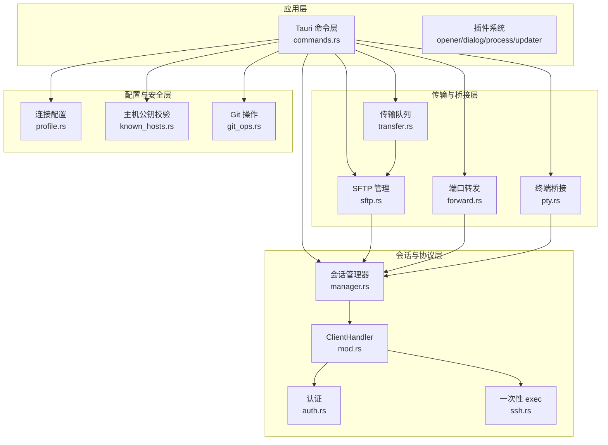

图表来源
- [lib.rs:20-91](file://src-tauri/src/lib.rs#L20-L91)
- [commands.rs:23-89](file://src-tauri/src/commands.rs#L23-L89)
- [mod.rs:52-225](file://src-tauri/src/session/mod.rs#L52-L225)

## 详细组件分析

### 会话管理器（SessionManager）
- 设计要点
  - 会话池：以 UUID 为键，持有 Arc<SessionEntry>，支持并发读取与安全断开。
  - 跳板机支持：先连跳板，再通过 direct-tcpip 隧道连接目标主机，保持 jump_handle 生命周期。
  - 进度事件：在连接各阶段（DNS 解析、握手、认证、跳板、就绪）推送 ssh://progress 事件。
  - 超时控制：TCP 建连、SSH 握手、认证分别设置 TTL，避免长时间阻塞。
- 关键流程
  - connect：根据是否有 jump 参数选择直连或 via Jump 的路径；在 handle 上注册 forward_registry 与 x11_display。
  - connect_via_jump：先在跳板上建立 SSH，再 open direct-tcpip 隧道到目标。
  - disconnect：主动断开目标与跳板连接，确保资源回收。

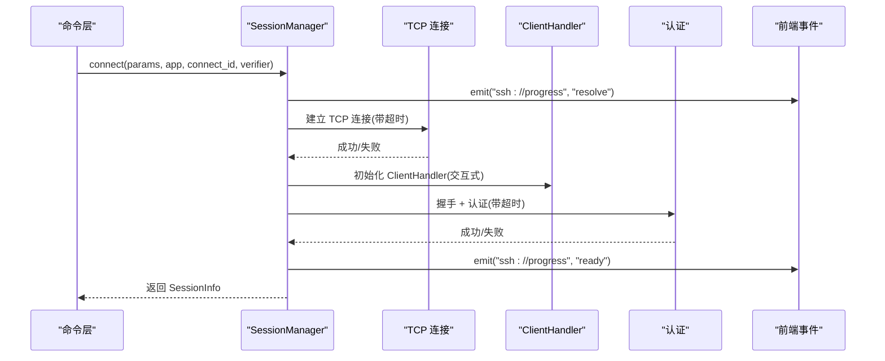

图表来源
- [manager.rs:85-145](file://src-tauri/src/session/manager.rs#L85-L145)
- [manager.rs:148-217](file://src-tauri/src/session/manager.rs#L148-L217)
- [manager.rs:256-316](file://src-tauri/src/session/manager.rs#L256-L316)

章节来源
- [manager.rs:77-253](file://src-tauri/src/session/manager.rs#L77-L253)

### 终端桥接（TerminalBridge）
- 设计要点
  - 本地 WS 服务：绑定 127.0.0.1:0，随机端口，接受前端连接。
  - Token 机制：terminal_open 返回一次性 token，前端首条消息必须为 token，用于取出对应管道。
  - mpsc 管道：将 russh Channel 的输入/输出与 WS 串接，支持窗口大小调整消息。
- 关键流程
  - terminal_open：在指定会话上开 PTY channel，创建 TerminalPipes，注册到 TerminalBridge，返回 port/token。
  - WS 连接：接受连接后读取 token，取出管道，循环转发 Binary/Text 消息与 Data/ExtendedData。

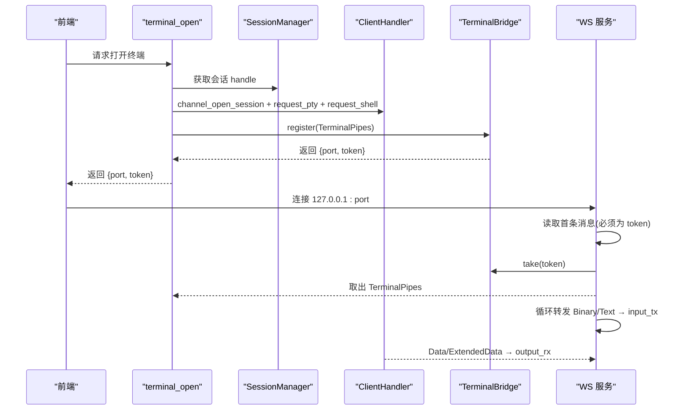

图表来源
- [commands.rs:107-186](file://src-tauri/src/commands.rs#L107-L186)
- [pty.rs:48-143](file://src-tauri/src/session/pty.rs#L48-L143)

章节来源
- [pty.rs:42-143](file://src-tauri/src/session/pty.rs#L42-L143)

### SFTP 管理器（SftpManager）
- 设计要点
  - 会话级缓存：每个 session_id 对应一个 SftpSession，避免重复打开 subsystem。
  - 复用连接：直接在已认证的 SSH handle 上 request_subsystem("sftp")。
  - 列目录：支持规范化路径与排序规则。
- 关键流程
  - get：若缓存命中直接返回；否则在会话 handle 上开 channel 并创建 SftpSession。
  - close：断开会话时清理缓存。

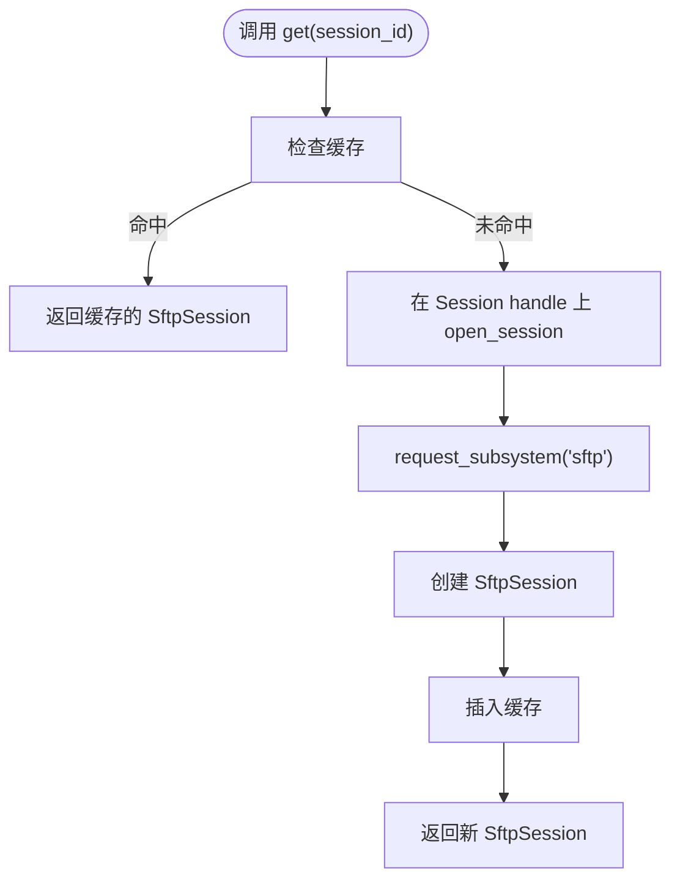

图表来源
- [sftp.rs:32-75](file://src-tauri/src/session/sftp.rs#L32-L75)

章节来源
- [sftp.rs:25-124](file://src-tauri/src/session/sftp.rs#L25-L124)

### 传输队列（TransferQueue）
- 设计要点
  - 串行执行：队列按 FIFO 顺序执行，避免单连接上 SFTP 并发争用。
  - 可取消：每个任务持有一个 AtomicBool，在读写循环前检查，支持半成品清理。
  - 进度与状态：通过 transfer://progress 与 transfer://state 推送事件。
- 关键流程
  - enqueue：创建任务并入队，通知 worker。
  - start_worker：监听通知，取第一个 queued 任务标记 Running 并执行。
  - execute：计算 total、调用 upload/download 递归、更新最终状态。

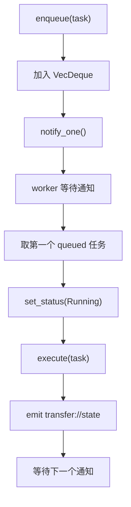

图表来源
- [transfer.rs:128-203](file://src-tauri/src/session/transfer.rs#L128-L203)
- [transfer.rs:206-284](file://src-tauri/src/session/transfer.rs#L206-L284)

章节来源
- [transfer.rs:122-483](file://src-tauri/src/session/transfer.rs#L122-L483)

### 端口转发（PortForwardManager）
- 设计要点
  - 三种模式：-L（本地转发）、-D（动态 SOCKS5）、-R（远程转发）。
  - -R：服务器端绑定后，回调中根据 registry 将 incoming channel 桥接到本地目标。
  - 宏桥接：bridge_loop! 统一处理 TCP 与 Channel 的双向数据搬运。
- 关键流程
  - add：根据 kind 创建监听器或发起 tcpip_forward，spawn 对应 run_* 任务。
  - remove：通知 cancel，标记 stopped 并从表移除。

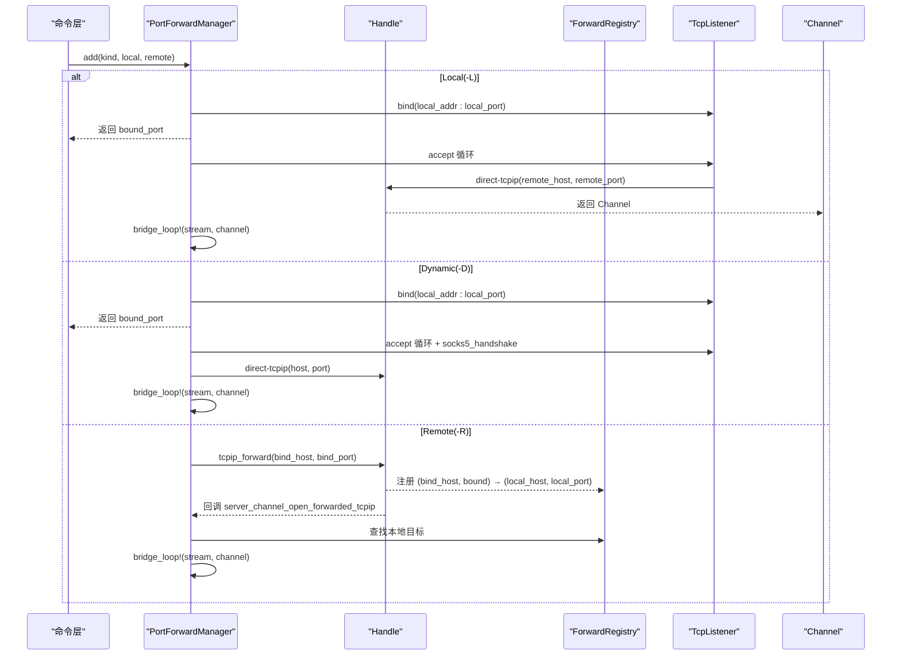

图表来源
- [forward.rs:126-191](file://src-tauri/src/session/forward.rs#L126-L191)
- [forward.rs:232-294](file://src-tauri/src/session/forward.rs#L232-L294)
- [mod.rs:165-207](file://src-tauri/src/session/mod.rs#L165-L207)

章节来源
- [forward.rs:118-295](file://src-tauri/src/session/forward.rs#L118-L295)

### 连接配置（ProfileStore）与凭据安全
- 设计要点
  - 元数据：保存在本地 JSON（~/.config/simpl-ssh/profiles.json）。
  - 凭据：存入系统钥匙串（keyring），不落明文；提供内存缓存（PasswordCache）降低授权弹窗频率。
  - 跳板机：支持单跳引用，禁止自引用与嵌套。
- 关键流程
  - save/update：根据认证方式写入钥匙串，必要时清理旧凭据；更新 JSON。
  - get_password/get_passphrase：优先内存缓存，再读取钥匙串并回填缓存。
  - to_connect_params：解析跳板机并生成 SshConnectParams。

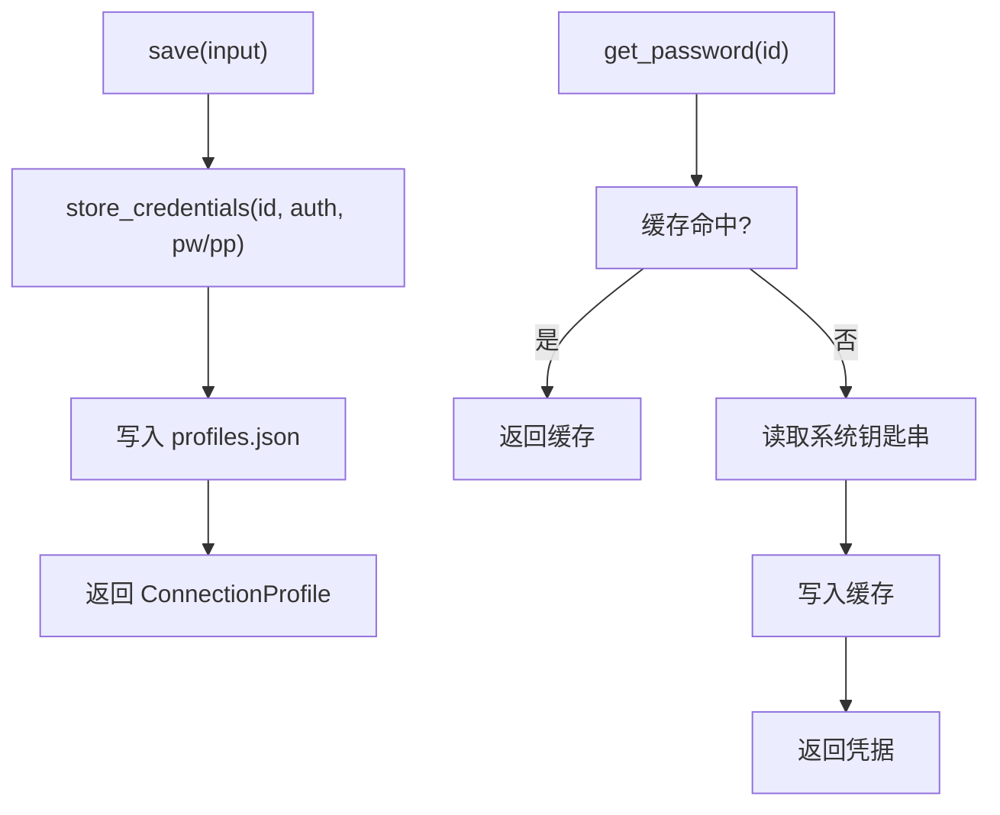

图表来源
- [profile.rs:103-128](file://src-tauri/src/session/profile.rs#L103-L128)
- [profile.rs:317-341](file://src-tauri/src/session/profile.rs#L317-L341)

章节来源
- [profile.rs:68-419](file://src-tauri/src/session/profile.rs#L68-L419)

### 主机公钥校验（HostKeyVerifier）
- 设计要点
  - 三态校验：Trusted/Unknown/Changed；Unknown/Changed 时暂存公钥到内存，触发前端确认。
  - TOFU 与冲突处理：信任时剔除同算法冲突项后追加到 ~/.ssh/known_hosts。
  - 事件推送：通过 ssh://hostkey 事件携带指纹与算法，前端核对后调用 trust/reject/remove_host。
- 关键流程
  - check_server_key：根据 known_hosts 检查，非 Trusted 时暂存并返回 false，让握手失败。
  - trust：移除同算法冲突项，追加新公钥；reject：仅清内存；remove_host：删除全部记录。

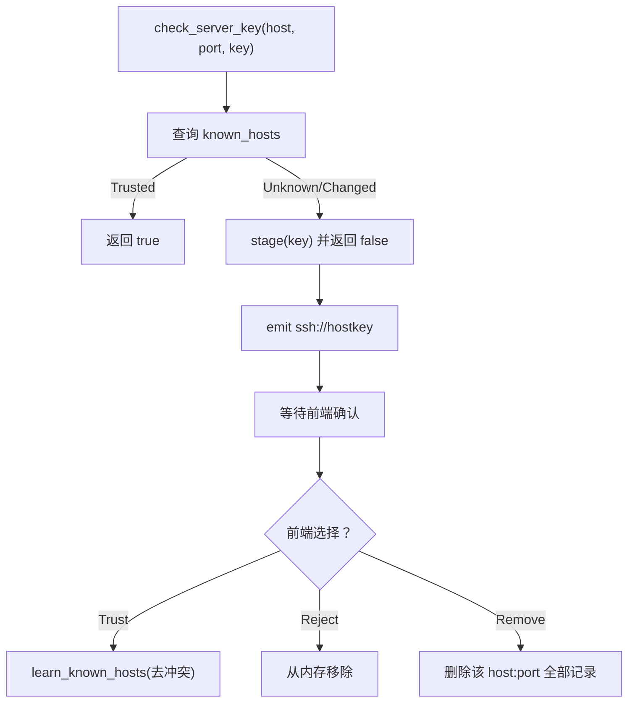

图表来源
- [mod.rs:118-160](file://src-tauri/src/session/mod.rs#L118-L160)
- [known_hosts.rs:98-135](file://src-tauri/src/session/known_hosts.rs#L98-L135)

章节来源
- [known_hosts.rs:26-135](file://src-tauri/src/session/known_hosts.rs#L26-L135)

### Git 操作（git_ops）
- 设计要点
  - 复用会话：在已认证的 handle 上开 exec channel 执行 git 命令。
  - 输出解析：提供 status/log/diff/branches/worktree 的解析函数，返回结构化结果。
- 关键流程
  - exec_git：拼装 cd + git args，调用 exec_on_session 收集输出。
  - parse_*：按输出格式解析为结构化对象。

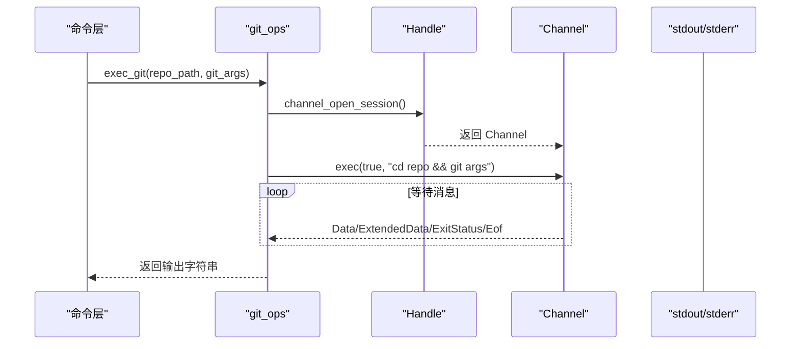

图表来源
- [git_ops.rs:65-112](file://src-tauri/src/session/git_ops.rs#L65-L112)

章节来源
- [git_ops.rs:64-328](file://src-tauri/src/session/git_ops.rs#L64-L328)

## 依赖关系分析
- 运行时与并发
  - Tokio：全特性启用，提供异步 I/O、定时器、通知与任务调度。
  - Futures/Tungstenite：用于 mpsc 管道与 WebSocket 服务。
- 协议栈
  - Russh：SSH 客户端核心，包括握手、认证、通道管理、known_hosts 校验。
  - Russh-SFTP：在 SSH 通道上提供 SFTP 客户端能力。
- 外部集成
  - Keyring：系统钥匙串，用于安全存储密码与私钥口令。
  - Tauri 插件：opener、dialog、process、updater，增强桌面体验。
- 错误处理
  - anyhow/thiserror：统一错误类型与错误传播；russh 错误映射到业务错误。

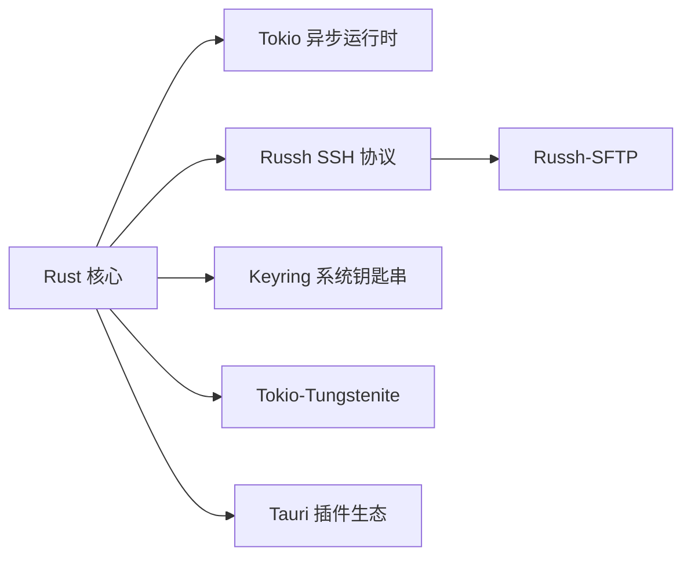

图表来源
- [Cargo.toml:22-49](file://src-tauri/Cargo.toml#L22-L49)

章节来源
- [Cargo.toml:22-49](file://src-tauri/Cargo.toml#L22-L49)

## 性能考量
- 连接复用
  - 会话池与 SFTP 缓存避免重复握手与 subsystem 开启，降低延迟与 CPU 开销。
- 串行传输
  - 传输队列串行执行，减少 SFTP 并发竞争，提升吞吐稳定性。
- 超时与背压
  - TCP/握手/认证 TTL 限制阻塞时间；WS 与 Channel 间使用 mpsc 控制缓冲大小。
- I/O 优化
  - 64KB 分片拷贝，定期刷新，兼顾内存占用与传输效率。
- 事件驱动
  - 使用 Notify 与 select! 实现低开销的任务唤醒与多源并发。

## 故障排查指南
- 连接失败
  - 检查 DNS 解析与 TCP 超时（resolve/handshake 阶段）；查看 ssh://progress 事件定位阶段。
  - 若提示 UnknownKey，确认前端是否已信任主机公钥；必要时调用 hostkey_remove 清理冲突记录。
- 认证失败
  - 确认用户名、密码或私钥路径正确；查看 AUTH_TTL 是否过短导致超时。
- SFTP 读写异常
  - 检查会话是否仍存活；确认 SftpSession 缓存是否被意外清理。
- 传输卡住
  - 查看 transfer://state 与 transfer://progress，确认任务是否处于 Running；必要时 cancel 后重试。
- 端口转发异常
  - -R：确认服务器端已绑定并检查 registry；-L/-D：确认本地监听端口可用且未被占用。

章节来源
- [manager.rs:256-316](file://src-tauri/src/session/manager.rs#L256-L316)
- [known_hosts.rs:98-135](file://src-tauri/src/session/known_hosts.rs#L98-L135)
- [transfer.rs:178-203](file://src-tauri/src/session/transfer.rs#L178-L203)
- [forward.rs:140-174](file://src-tauri/src/session/forward.rs#L140-L174)

## 结论
本后端以模块化与状态注入为核心，围绕会话管理器实现了 SSH 连接的统一复用与生命周期管理；结合 Tokio 异步模型与 Russh 生态，提供了稳定高效的 PTY、SFTP、端口转发与 Git 操作能力。通过 Tauri 命令系统与 IPC 事件机制，前后端协同清晰，具备良好的可维护性与扩展性。

## 附录
- Tauri 命令清单（节选）
  - SSH 会话：ssh_exec、ssh_connect、ssh_list_sessions、ssh_disconnect
  - 终端：terminal_open
  - SFTP：sftp_list、sftp_mkdir、sftp_rename、sftp_remove、sftp_read_file、sftp_write_file、sftp_select_local_files、sftp_select_folder
  - 传输：transfer_enqueue、transfer_cancel、transfer_list、sync_directory
  - 端口转发：forward_add、forward_list、forward_remove
  - 配置：profile_list、profile_save、profile_update、profile_delete、profile_connect、profile_select_private_key
  - 分组：group_list、group_create、group_rename、group_delete
  - 监控：monitor_snapshot
  - 主机公钥：hostkey_trust、hostkey_reject、hostkey_remove
  - 工作区：workspace_save、workspace_load、workspace_clear
  - Git：git_status、git_log、git_diff、git_branches、git_checkout、git_worktree_list、git_worktree_add、git_worktree_remove

章节来源
- [lib.rs:43-89](file://src-tauri/src/lib.rs#L43-L89)
- [commands.rs:25-89](file://src-tauri/src/commands.rs#L25-L89)