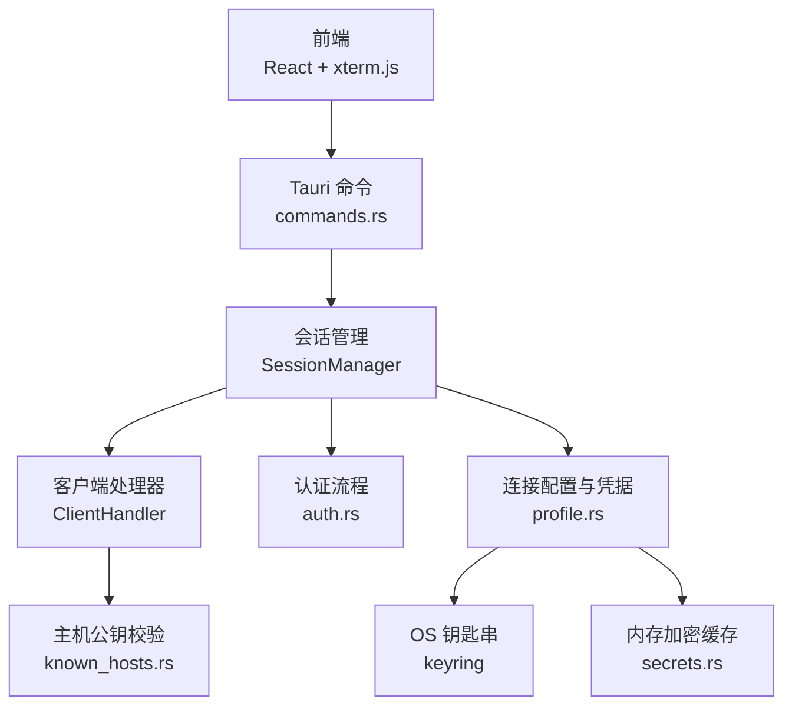
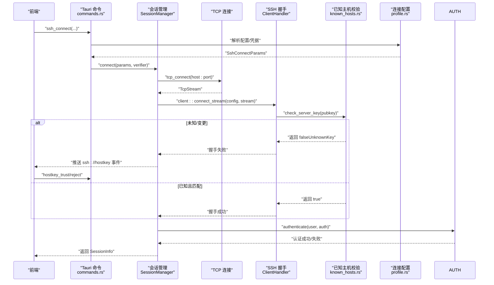
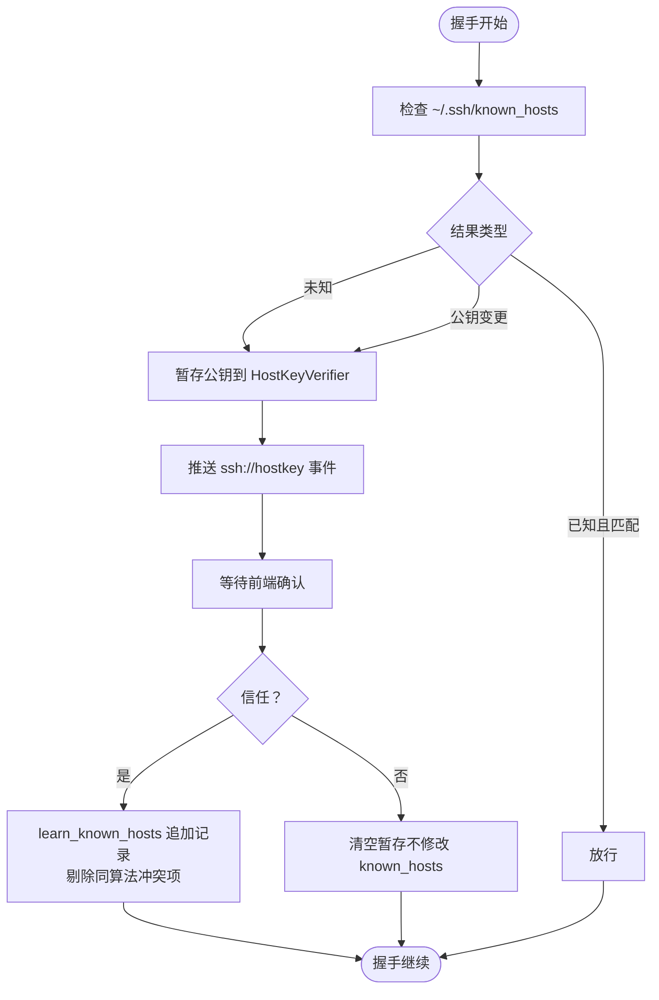
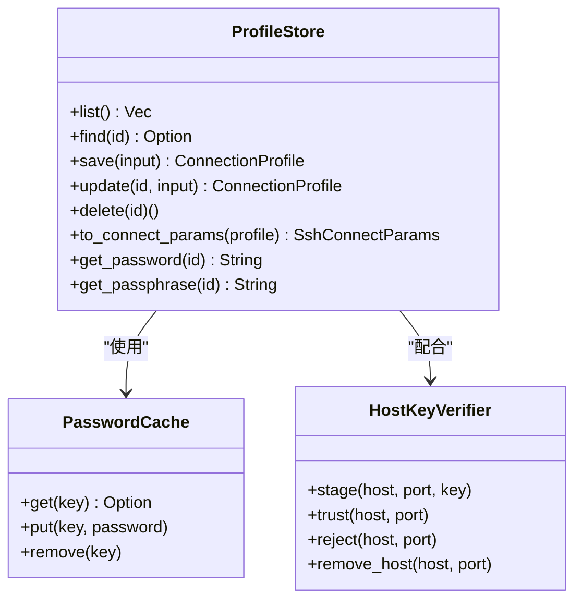
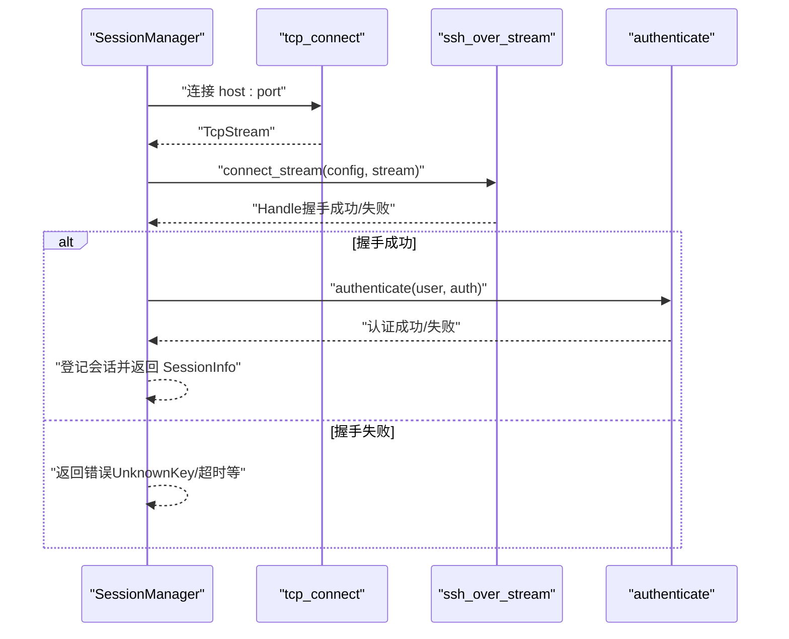
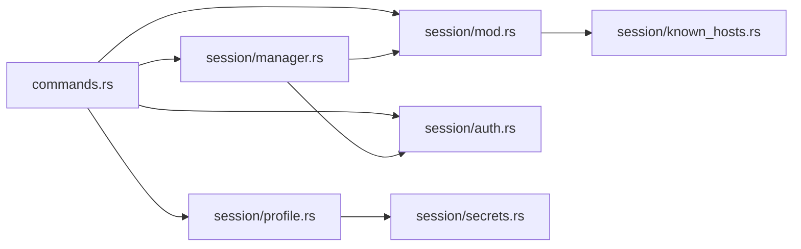

# 安全机制

<cite>
**本文档引用的文件**
- [README.md](file://README.md)
- [docs/DESIGN.md](file://docs/DESIGN.md)
- [src-tauri/Cargo.toml](file://src-tauri/Cargo.toml)
- [src-tauri/src/lib.rs](file://src-tauri/src/lib.rs)
- [src-tauri/src/main.rs](file://src-tauri/src/main.rs)
- [src-tauri/src/commands.rs](file://src-tauri/src/commands.rs)
- [src-tauri/src/session/mod.rs](file://src-tauri/src/session/mod.rs)
- [src-tauri/src/session/ssh.rs](file://src-tauri/src/session/ssh.rs)
- [src-tauri/src/session/auth.rs](file://src-tauri/src/session/auth.rs)
- [src-tauri/src/session/manager.rs](file://src-tauri/src/session/manager.rs)
- [src-tauri/src/session/known_hosts.rs](file://src-tauri/src/session/known_hosts.rs)
- [src-tauri/src/session/profile.rs](file://src-tauri/src/session/profile.rs)
- [src-tauri/src/session/secrets.rs](file://src-tauri/src/session/secrets.rs)
- [src/settings/types.ts](file://src/settings/types.ts)
</cite>

## 目录
1. [引言](#引言)
2. [项目结构](#项目结构)
3. [核心组件](#核心组件)
4. [架构总览](#架构总览)
5. [详细组件分析](#详细组件分析)
6. [依赖关系分析](#依赖关系分析)
7. [性能考量](#性能考量)
8. [故障排查指南](#故障排查指南)
9. [结论](#结论)
10. [附录](#附录)

## 引言
本文件面向安全与合规需求，系统梳理该 SSH 客户端在主机公钥验证、已知主机管理、凭据加密存储、安全连接建立、连接配置与访问控制、审计日志与合规实现等方面的机制与最佳实践。文档基于仓库现有实现进行归纳总结，并提供可操作的改进建议与风险缓解策略。

## 项目结构
后端采用 Rust + Tauri 架构，核心安全能力集中在 src-tauri/src/session 子模块中，包括：
- 会话与连接管理：SessionManager、ClientHandler、认证流程
- 主机公钥校验：known_hosts 与 HostKeyVerifier
- 凭据存储：ProfileStore + OS 钥匙串 + 内存加密缓存
- 安全命令：前端通过 Tauri 命令触发连接、认证、主机公钥确认等

**图表来源**
- [src-tauri/src/lib.rs:14-92](file://src-tauri/src/lib.rs#L14-L92)
- [src-tauri/src/commands.rs:1-800](file://src-tauri/src/commands.rs#L1-L800)
- [src-tauri/src/session/manager.rs:1-317](file://src-tauri/src/session/manager.rs#L1-L317)
- [src-tauri/src/session/mod.rs:52-226](file://src-tauri/src/session/mod.rs#L52-L226)
- [src-tauri/src/session/known_hosts.rs:1-197](file://src-tauri/src/session/known_hosts.rs#L1-L197)
- [src-tauri/src/session/profile.rs:1-419](file://src-tauri/src/session/profile.rs#L1-L419)
- [src-tauri/src/session/secrets.rs:1-110](file://src-tauri/src/session/secrets.rs#L1-L110)

**章节来源**
- [src-tauri/src/lib.rs:14-92](file://src-tauri/src/lib.rs#L14-L92)
- [src-tauri/src/commands.rs:1-800](file://src-tauri/src/commands.rs#L1-L800)
- [src-tauri/src/session/manager.rs:1-317](file://src-tauri/src/session/manager.rs#L1-L317)
- [src-tauri/src/session/mod.rs:52-226](file://src-tauri/src/session/mod.rs#L52-L226)

## 核心组件
- 会话与连接管理：SessionManager 提供持久会话池，统一 TCP/SSH 握手、认证与错误处理；支持跳板机 ProxyJump。
- 主机公钥校验：ClientHandler.check_server_key 基于 ~/.ssh/known_hosts 校验，未知/变更时暂存公钥并推送前端确认。
- 凭据加密存储：ProfileStore 将密码/私钥口令写入 OS 钥匙串，配合内存 AES-256-GCM 缓存降低授权弹窗频率。
- 认证流程：支持密码与私钥认证，带超时控制；私钥认证时协商最佳 RSA 哈希算法。
- 安全命令：提供 hostkey_trust/hostkey_reject/hostkey_remove 等命令，配合前端完成已知主机管理。

**章节来源**
- [src-tauri/src/session/manager.rs:76-253](file://src-tauri/src/session/manager.rs#L76-L253)
- [src-tauri/src/session/mod.rs:115-160](file://src-tauri/src/session/mod.rs#L115-L160)
- [src-tauri/src/session/profile.rs:67-72](file://src-tauri/src/session/profile.rs#L67-L72)
- [src-tauri/src/session/auth.rs:44-82](file://src-tauri/src/session/auth.rs#L44-L82)
- [src-tauri/src/commands.rs:768-800](file://src-tauri/src/commands.rs#L768-L800)

## 架构总览
下图展示从前端发起连接到建立安全会话的关键路径，以及主机公钥校验与凭据获取的交互。

**图表来源**
- [src-tauri/src/commands.rs:42-72](file://src-tauri/src/commands.rs#L42-L72)
- [src-tauri/src/session/manager.rs:82-145](file://src-tauri/src/session/manager.rs#L82-L145)
- [src-tauri/src/session/mod.rs:115-160](file://src-tauri/src/session/mod.rs#L115-L160)
- [src-tauri/src/session/known_hosts.rs:68-84](file://src-tauri/src/session/known_hosts.rs#L68-L84)
- [src-tauri/src/session/auth.rs:44-82](file://src-tauri/src/session/auth.rs#L44-L82)

## 详细组件分析

### 主机公钥验证与已知主机管理
- 校验策略
  - 已记录且匹配：直接放行
  - 未知（首次连接）：TOFU，暂存公钥并推送前端确认
  - 已记录但公钥变更：拦截并警示，需用户显式确认后替换
- 实现要点
  - ClientHandler.check_server_key 调用 known_hosts::check(host, port, key)
  - HostKeyVerifier.stage 仅在交互式会话中使用，暂存内存，不落盘
  - hostkey_trust 通过 learn_known_hosts 追加记录，同时剔除同算法冲突项
  - hostkey_remove 支持删除指定 host:port 的全部 known_hosts 记录
- 与 OpenSSH 兼容
  - 使用 russh::keys::known_hosts，遵循 OpenSSH 格式

**图表来源**
- [src-tauri/src/session/mod.rs:115-160](file://src-tauri/src/session/mod.rs#L115-L160)
- [src-tauri/src/session/known_hosts.rs:68-135](file://src-tauri/src/session/known_hosts.rs#L68-L135)
- [src-tauri/src/commands.rs:772-800](file://src-tauri/src/commands.rs#L772-L800)

**章节来源**
- [src-tauri/src/session/mod.rs:52-160](file://src-tauri/src/session/mod.rs#L52-L160)
- [src-tauri/src/session/known_hosts.rs:1-197](file://src-tauri/src/session/known_hosts.rs#L1-L197)
- [src-tauri/src/commands.rs:768-800](file://src-tauri/src/commands.rs#L768-L800)

### 凭据加密存储与凭据轮换
- 存储位置
  - 连接配置元数据：本地 JSON 文件（~/.config/simpl-ssh/profiles.json）
  - 凭据：OS 钥匙串（keyring），不落明文
- 内存缓存
  - PasswordCache 使用 AES-256-GCM 加密存储，24 小时 TTL，进程退出即清空
  - 机器绑定密钥派生：machine_uid + 应用盐，若无法获取机器 ID，则退化为进程随机 key
- 凭据轮换
  - 更新配置时，若更换认证方式或修改密码/口令，会清理旧条目并写入新值
  - 删除配置时同步清理钥匙串与缓存，避免残留密文

**图表来源**
- [src-tauri/src/session/profile.rs:67-419](file://src-tauri/src/session/profile.rs#L67-L419)
- [src-tauri/src/session/secrets.rs:37-110](file://src-tauri/src/session/secrets.rs#L37-L110)
- [src-tauri/src/session/known_hosts.rs:91-135](file://src-tauri/src/session/known_hosts.rs#L91-L135)

**章节来源**
- [src-tauri/src/session/profile.rs:1-419](file://src-tauri/src/session/profile.rs#L1-L419)
- [src-tauri/src/session/secrets.rs:1-110](file://src-tauri/src/session/secrets.rs#L1-L110)
- [src-tauri/src/session/known_hosts.rs:91-135](file://src-tauri/src/session/known_hosts.rs#L91-L135)

### 认证流程与连接建立
- 支持的认证方式
  - 密码认证：authenticate_password，带超时保护
  - 私钥认证：load_secret_key + best_supported_rsa_hash 协商哈希算法，再 authenticate_publickey
- 连接建立
  - TCP 建连带超时（DNS 解析、SYN 超时）
  - SSH 握手超时（版本协商 + 密钥交换）
  - 认证超时（防止长时间阻塞）
- 跳板机（ProxyJump）
  - 先连跳板，建立 direct-tcpip 隧道，再在隧道上完成目标主机的 SSH 握手与认证

**图表来源**
- [src-tauri/src/session/manager.rs:255-317](file://src-tauri/src/session/manager.rs#L255-L317)
- [src-tauri/src/session/auth.rs:44-82](file://src-tauri/src/session/auth.rs#L44-L82)

**章节来源**
- [src-tauri/src/session/manager.rs:24-317](file://src-tauri/src/session/manager.rs#L24-L317)
- [src-tauri/src/session/auth.rs:1-82](file://src-tauri/src/session/auth.rs#L1-L82)

### 连接配置的安全选项与访问控制
- 配置项
  - 名称、主机、端口、用户、认证方式（密码/私钥）、私钥路径、分组、跳板机
- 访问控制
  - 仅允许单跳 ProxyJump，禁止自引用与嵌套跳板
  - 连接分组与清理：删除分组/跳板配置时，自动清理引用，避免悬挂配置
- 安全建议
  - 优先使用私钥认证并启用口令保护
  - 严格限制跳板机配置，避免形成不受控的跳转路径

**章节来源**
- [src-tauri/src/session/profile.rs:47-314](file://src-tauri/src/session/profile.rs#L47-L314)
- [src-tauri/src/commands.rs:724-766](file://src-tauri/src/commands.rs#L724-L766)

### 审计日志与合规实现
- 当前实现
  - 连接进度事件：resolve/handshake/auth/jump/ready
  - 主机公钥事件：ssh://hostkey，携带算法与指纹
- 建议增强
  - 会话生命周期事件：connect/start/stop/disconnect
  - 认证结果事件：success/failure + 失败原因
  - 已知主机变更事件：changed/trust/reject/remove
  - 日志落盘：结合 tracing-subscriber 输出到文件，按天切割
  - 合规字段：会话ID、用户、主机、端口、算法、指纹、时间戳、结果状态

**章节来源**
- [src-tauri/src/session/manager.rs:31-48](file://src-tauri/src/session/manager.rs#L31-L48)
- [src-tauri/src/session/mod.rs:47-61](file://src-tauri/src/session/mod.rs#L47-L61)
- [src-tauri/src/session/known_hosts.rs:47-61](file://src-tauri/src/session/known_hosts.rs#L47-L61)

## 依赖关系分析
- 外部依赖
  - russh/russh-sftp：SSH 协议与 SFTP 实现
  - keyring：OS 钥匙串访问
  - aes-gcm/sha2/rand：内存加密缓存
  - tracing/tracing-subscriber：日志
- 内部模块耦合
  - commands.rs 依赖 session 各模块，暴露给前端
  - session/mod.rs 暴露 ClientHandler、HostKeyVerifier 等核心类型
  - profile.rs 与 secrets.rs 协同实现凭据安全

**图表来源**
- [src-tauri/src/commands.rs:1-800](file://src-tauri/src/commands.rs#L1-L800)
- [src-tauri/src/session/mod.rs:27-39](file://src-tauri/src/session/mod.rs#L27-L39)
- [src-tauri/src/session/profile.rs:16-17](file://src-tauri/src/session/profile.rs#L16-L17)

**章节来源**
- [src-tauri/Cargo.toml:22-49](file://src-tauri/Cargo.toml#L22-L49)
- [src-tauri/src/commands.rs:1-800](file://src-tauri/src/commands.rs#L1-L800)

## 性能考量
- 连接超时与快速失败
  - TCP 建连、SSH 握手、认证均设置超时，避免长时间阻塞
- 内存加密缓存
  - 24 小时 TTL，减少频繁访问 OS 钥匙串带来的授权弹窗与 I/O 开销
- 并发与资源复用
  - 会话 Handle 复用（终端/SFTP/转发共享），降低连接数与资源消耗

**章节来源**
- [src-tauri/src/session/manager.rs:24-29](file://src-tauri/src/session/manager.rs#L24-L29)
- [src-tauri/src/session/secrets.rs:26-27](file://src-tauri/src/session/secrets.rs#L26-L27)

## 故障排查指南
- 主机公钥问题
  - 未知主机：确认指纹后执行 hostkey_trust；若误触 hostkey_reject，重新发起连接
  - 公钥变更：确认为合法迁移后执行 hostkey_trust；若怀疑中间人攻击，拒绝并检查网络
  - 删除记录：使用 hostkey_remove 清理指定 host:port 的全部记录
- 认证失败
  - 检查用户名/密码或私钥路径与口令
  - 查看认证超时日志，必要时提高超时阈值
- 连接超时
  - TCP 建连超时：检查网络连通性与 DNS 解析
  - SSH 握手超时：检查服务器负载与加密套件协商
- 凭据问题
  - 钥匙串权限：确保应用具有访问 OS 钥匙串的权限
  - 缓存异常：重启应用以清空内存缓存

**章节来源**
- [src-tauri/src/commands.rs:768-800](file://src-tauri/src/commands.rs#L768-L800)
- [src-tauri/src/session/manager.rs:255-317](file://src-tauri/src/session/manager.rs#L255-L317)
- [src-tauri/src/session/auth.rs:44-82](file://src-tauri/src/session/auth.rs#L44-L82)

## 结论
该项目在主机公钥校验、凭据加密存储与连接建立方面具备完善的基础设施，遵循 OpenSSH 兼容规范与最小暴露原则。建议进一步完善审计日志与合规字段、强化访问控制策略（如细粒度权限与会话隔离）、以及提供可视化的“已知主机”管理界面，以满足更高安全等级与合规要求。

## 附录
- 安全最佳实践清单
  - 优先使用私钥认证并启用口令保护
  - 严格限制跳板机配置，避免嵌套与自引用
  - 定期轮换凭据，及时清理不再使用的配置
  - 启用并审查审计日志，留存合规证据
  - 保持依赖更新，关注 CVE 与安全公告

**章节来源**
- [README.md:155-162](file://README.md#L155-L162)
- [docs/DESIGN.md:61-71](file://docs/DESIGN.md#L61-L71)