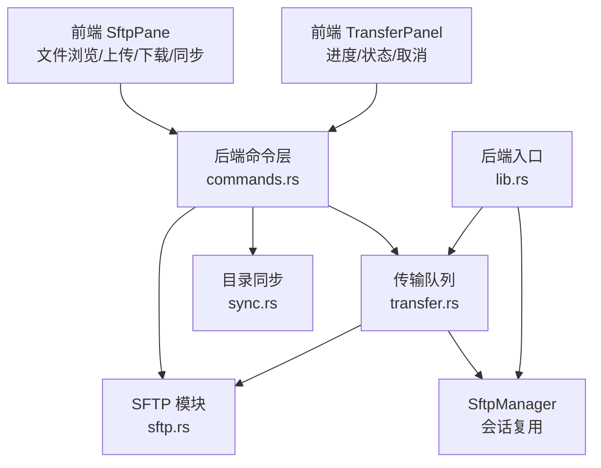
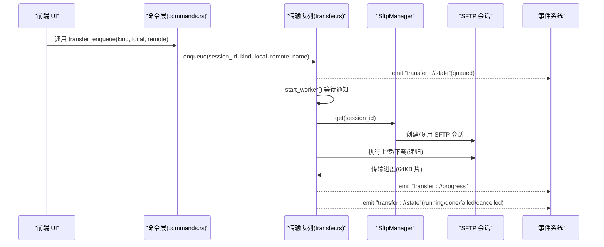
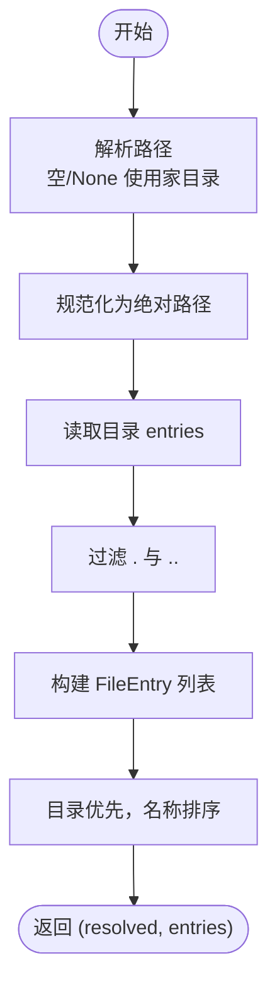
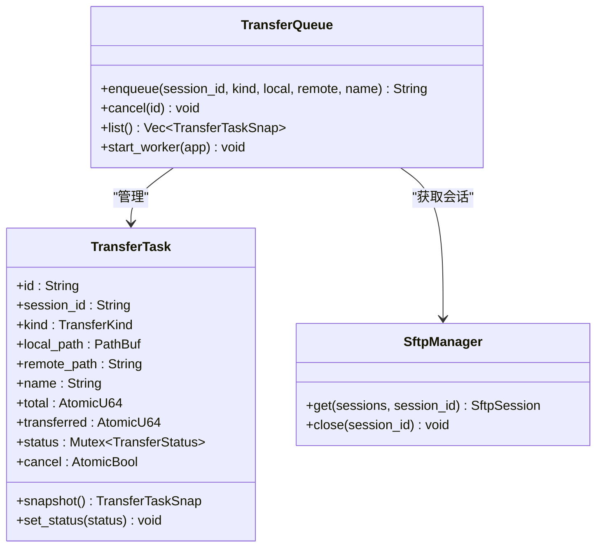
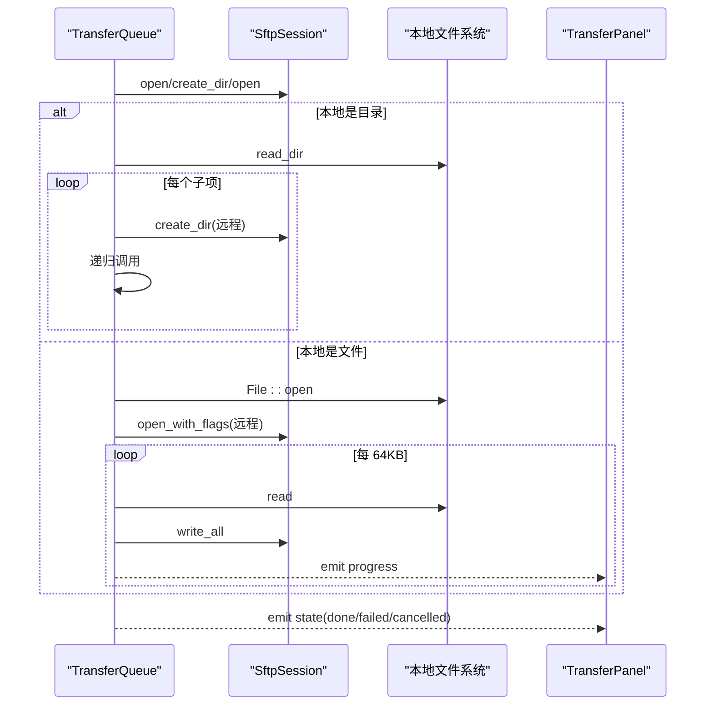
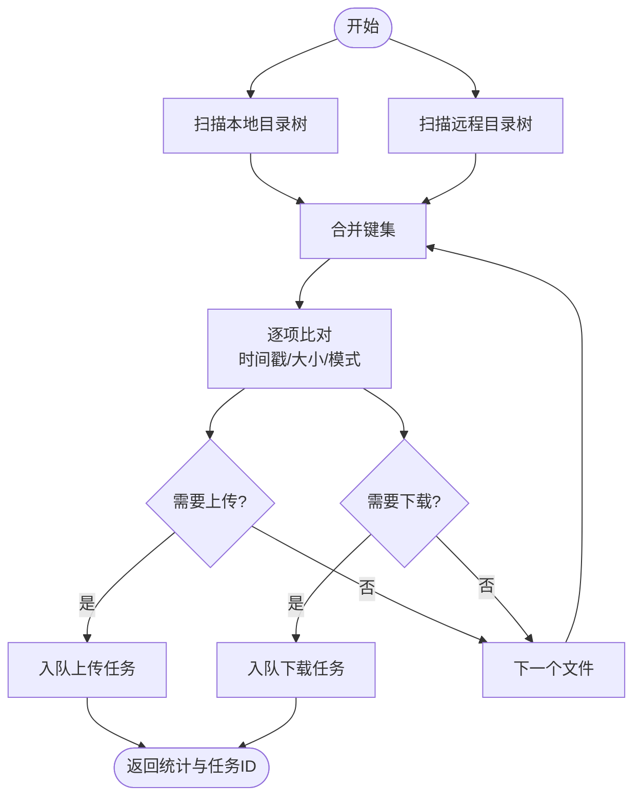
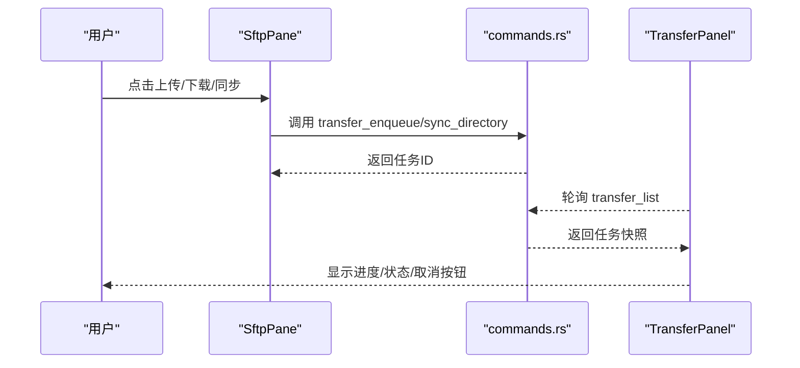
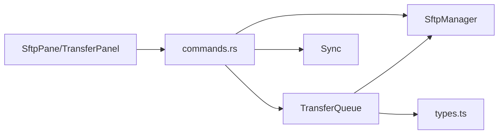

# 文件系统管理

<cite>
**本文档引用的文件**
- [sftp.rs](file://src-tauri/src/session/sftp.rs)
- [transfer.rs](file://src-tauri/src/session/transfer.rs)
- [sync.rs](file://src-tauri/src/session/sync.rs)
- [commands.rs](file://src-tauri/src/commands.rs)
- [lib.rs](file://src-tauri/src/lib.rs)
- [SftpPane.tsx](file://src/components/SftpPane.tsx)
- [TransferPanel.tsx](file://src/components/TransferPanel.tsx)
- [types.ts](file://src/types.ts)
- [DESIGN.md](file://docs/DESIGN.md)
- [README.md](file://README.md)
</cite>

## 目录
1. [简介](#简介)
2. [项目结构](#项目结构)
3. [核心组件](#核心组件)
4. [架构总览](#架构总览)
5. [详细组件分析](#详细组件分析)
6. [依赖关系分析](#依赖关系分析)
7. [性能考量](#性能考量)
8. [故障排查指南](#故障排查指南)
9. [结论](#结论)
10. [附录](#附录)

## 简介
本文件系统管理文档聚焦于 SFTP 文件操作与传输队列管理，涵盖：
- 文件列表获取与目录浏览
- 目录递归上传/下载
- 传输队列工作机制、并发控制与错误恢复
- 目录同步与批量操作
- 进度监控与 UI 集成
- 性能优化与大文件传输最佳实践

## 项目结构
后端采用 Rust + Tauri 架构，前端使用 React + TypeScript。SFTP 功能位于后端模块化目录中，通过 Tauri 命令暴露给前端，传输队列与进度通过事件推送至前端面板。

图表来源
- [lib.rs:34-42](file://src-tauri/src/lib.rs#L34-L42)
- [commands.rs:43-89](file://src-tauri/src/commands.rs#L43-L89)
- [sftp.rs:25-75](file://src-tauri/src/session/sftp.rs#L25-L75)
- [transfer.rs:122-203](file://src-tauri/src/session/transfer.rs#L122-L203)
- [sync.rs:45-148](file://src-tauri/src/session/sync.rs#L45-L148)

章节来源
- [DESIGN.md:26-59](file://docs/DESIGN.md#L26-L59)
- [README.md:111-135](file://README.md#L111-L135)

## 核心组件
- SftpManager：缓存并复用每个会话的 SFTP 会话，避免重复认证
- TransferQueue：串行传输队列，支持取消、进度事件与状态快照
- TransferTask：单个传输任务的数据结构与状态
- Sync 模块：本地/远程目录扫描、差异比对与批量入队
- 前端 SftpPane：文件列表、目录导航、上传/下载触发
- 前端 TransferPanel：全局传输队列面板，监听状态与进度事件

章节来源
- [sftp.rs:25-75](file://src-tauri/src/session/sftp.rs#L25-L75)
- [transfer.rs:72-203](file://src-tauri/src/session/transfer.rs#L72-L203)
- [sync.rs:45-148](file://src-tauri/src/session/sync.rs#L45-L148)
- [SftpPane.tsx:30-312](file://src/components/SftpPane.tsx#L30-L312)
- [TransferPanel.tsx:12-166](file://src/components/TransferPanel.tsx#L12-L166)

## 架构总览
SFTP 复用同一 SSH 会话，前端通过命令触发后端执行，传输队列串行执行，进度与状态通过事件推送至前端面板。

图表来源
- [commands.rs:365-388](file://src-tauri/src/commands.rs#L365-L388)
- [transfer.rs:178-202](file://src-tauri/src/session/transfer.rs#L178-L202)
- [transfer.rs:206-284](file://src-tauri/src/session/transfer.rs#L206-L284)
- [transfer.rs:449-482](file://src-tauri/src/session/transfer.rs#L449-L482)

## 详细组件分析

### SFTP 文件列表与目录浏览
- 列目录：支持空路径时使用家目录，返回标准化绝对路径与条目列表
- 条目过滤：排除当前目录与父目录，区分目录/文件/符号链接
- 排序规则：目录优先，同类型按名称排序

图表来源
- [sftp.rs:86-123](file://src-tauri/src/session/sftp.rs#L86-L123)

章节来源
- [sftp.rs:86-123](file://src-tauri/src/session/sftp.rs#L86-L123)
- [commands.rs:192-200](file://src-tauri/src/commands.rs#L192-L200)
- [SftpPane.tsx:40-57](file://src/components/SftpPane.tsx#L40-L57)

### 传输队列与并发控制
- 串行执行：worker 逐个取出排队中的任务并标记为运行中
- 可取消：每个任务持有取消标志，每次读取前检查
- 进度推送：每 64KB 片段发送一次进度事件
- 状态快照：通过状态事件与轮询接口提供统一视图

图表来源
- [transfer.rs:122-203](file://src-tauri/src/session/transfer.rs#L122-L203)
- [transfer.rs:72-119](file://src-tauri/src/session/transfer.rs#L72-L119)
- [sftp.rs:25-75](file://src-tauri/src/session/sftp.rs#L25-L75)

章节来源
- [transfer.rs:122-203](file://src-tauri/src/session/transfer.rs#L122-L203)
- [transfer.rs:206-284](file://src-tauri/src/session/transfer.rs#L206-L284)
- [lib.rs:38-40](file://src-tauri/src/lib.rs#L38-L40)

### 上传/下载递归与进度监控
- 上传：目录递归创建，文件流式写入，64KB 片推进进度
- 下载：目录递归创建，文件流式读取，64KB 片推进进度
- 取消：在每次迭代前检查取消标志，及时中断
- 错误处理：失败时设置失败状态，取消时清理半成品文件

图表来源
- [transfer.rs:296-363](file://src-tauri/src/session/transfer.rs#L296-L363)
- [transfer.rs:365-434](file://src-tauri/src/session/transfer.rs#L365-L434)
- [transfer.rs:449-482](file://src-tauri/src/session/transfer.rs#L449-L482)

章节来源
- [transfer.rs:296-482](file://src-tauri/src/session/transfer.rs#L296-L482)

### 目录同步与批量操作
- 扫描：本地/远程分别遍历，生成相对路径映射与修改时间/大小
- 比对：根据同步模式（镜像/仅上传/仅下载）决定差异方向
- 入队：将差异文件批量入传输队列，返回任务 ID 列表

图表来源
- [sync.rs:45-148](file://src-tauri/src/session/sync.rs#L45-L148)
- [sync.rs:150-233](file://src-tauri/src/session/sync.rs#L150-L233)

章节来源
- [sync.rs:45-148](file://src-tauri/src/session/sync.rs#L45-L148)

### 前端集成与用户交互
- SftpPane：提供地址栏、上一级、刷新、新建目录、上传/下载、重命名/删除、目录同步等操作
- TransferPanel：底部抽屉式面板，监听状态与进度事件，支持取消任务

图表来源
- [SftpPane.tsx:81-134](file://src/components/SftpPane.tsx#L81-L134)
- [commands.rs:408-431](file://src-tauri/src/commands.rs#L408-L431)
- [TransferPanel.tsx:16-50](file://src/components/TransferPanel.tsx#L16-L50)

章节来源
- [SftpPane.tsx:30-312](file://src/components/SftpPane.tsx#L30-L312)
- [TransferPanel.tsx:12-166](file://src/components/TransferPanel.tsx#L12-L166)
- [types.ts:63-88](file://src/types.ts#L63-L88)

## 依赖关系分析
- 命令层依赖 SftpManager 与 TransferQueue，负责任务编排与事件推送
- 传输队列依赖 SftpManager 获取会话，依赖 russh-sftp 执行文件操作
- 前端通过 Tauri 事件与命令与后端交互

图表来源
- [commands.rs:14-19](file://src-tauri/src/commands.rs#L14-L19)
- [transfer.rs:23-24](file://src-tauri/src/session/transfer.rs#L23-L24)
- [types.ts:63-88](file://src/types.ts#L63-L88)

章节来源
- [commands.rs:43-89](file://src-tauri/src/commands.rs#L43-L89)
- [lib.rs:25-33](file://src-tauri/src/lib.rs#L25-L33)

## 性能考量
- 串行传输避免单连接上的资源争用，适合大多数场景
- 64KB 片大小平衡吞吐与内存占用，适合大文件传输
- 递归目录扫描使用栈式遍历，避免深度过大的递归栈风险
- 进度事件频率适中，避免 UI 频繁重绘
- 会话复用减少认证开销，提升整体响应速度

## 故障排查指南
- 会话未找到：检查会话 ID 是否正确，确认会话生命周期
- 传输被取消：确认取消标志是否被设置，清理半成品文件
- 进度不更新：检查事件监听与轮询逻辑，确认任务状态变化
- 同步结果异常：核对本地/远程扫描结果与比对逻辑

章节来源
- [transfer.rs:210-217](file://src-tauri/src/session/transfer.rs#L210-L217)
- [transfer.rs:267-283](file://src-tauri/src/session/transfer.rs#L267-L283)
- [TransferPanel.tsx:26-44](file://src/components/TransferPanel.tsx#L26-L44)

## 结论
本文件系统管理模块以“串行队列 + 会话复用 + 事件驱动”的方式实现了稳定高效的 SFTP 文件操作。通过目录同步与批量入队，满足日常运维与开发场景；通过进度与状态事件，提供良好的用户体验。建议在生产环境中结合网络状况与业务需求，合理规划同步策略与并发参数。

## 附录
- 术语
  - 会话：一次 SSH 连接及其子通道
  - 传输任务：一次具体的上传/下载/目录上传任务
  - 同步模式：镜像、仅上传、仅下载
- 相关文件
  - [DESIGN.md](file://docs/DESIGN.md)
  - [README.md](file://README.md)