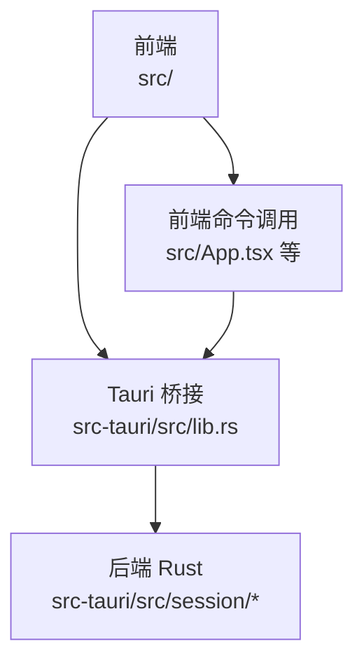
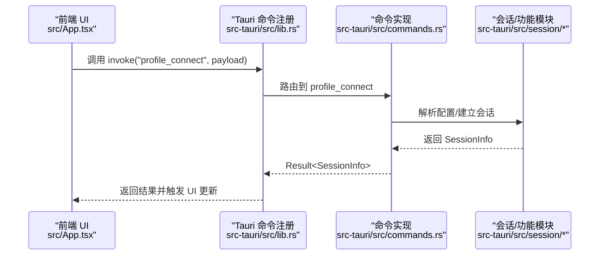
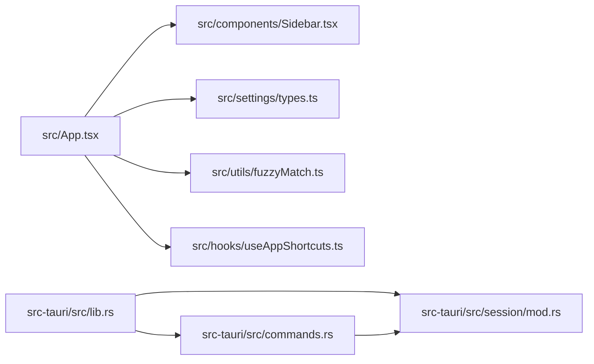

# 代码规范

<cite>
**本文引用的文件**   
- [CONTRIBUTING.md](file://CONTRIBUTING.md)
- [README.md](file://README.md)
- [package.json](file://package.json)
- [tsconfig.json](file://tsconfig.json)
- [vite.config.ts](file://vite.config.ts)
- [Cargo.toml](file://src-tauri/Cargo.toml)
- [src/App.tsx](file://src/App.tsx)
- [src/components/Sidebar.tsx](file://src/components/Sidebar.tsx)
- [src/settings/types.ts](file://src/settings/types.ts)
- [src/utils/fuzzyMatch.ts](file://src/utils/fuzzyMatch.ts)
- [src/hooks/useAppShortcuts.ts](file://src/hooks/useAppShortcuts.ts)
- [src-tauri/src/lib.rs](file://src-tauri/src/lib.rs)
- [src-tauri/src/main.rs](file://src-tauri/src/main.rs)
- [src-tauri/src/session/mod.rs](file://src-tauri/src/session/mod.rs)
- [src-tauri/src/commands.rs](file://src-tauri/src/commands.rs)
</cite>

## 目录
1. [引言](#引言)
2. [项目结构](#项目结构)
3. [核心组件](#核心组件)
4. [架构总览](#架构总览)
5. [详细组件分析](#详细组件分析)
6. [依赖关系分析](#依赖关系分析)
7. [性能考量](#性能考量)
8. [故障排查指南](#故障排查指南)
9. [结论](#结论)
10. [附录](#附录)

## 引言
本文件旨在制定并统一本项目的代码规范，覆盖前端 TypeScript/React 与后端 Rust 的编码风格、提交信息格式、分支命名约定、代码审查标准与质量检查清单。规范依据项目现有贡献流程与代码现状提炼而来，确保团队协作一致性与长期可维护性。

## 项目结构
项目采用“前端 React + 后端 Rust + Tauri 桥接”的双层架构，前端位于 src/，后端位于 src-tauri/，二者通过 Tauri 命令互通。

图表来源
- [src-tauri/src/lib.rs:14-92](file://src-tauri/src/lib.rs#L14-L92)
- [src/App.tsx:1-685](file://src/App.tsx#L1-L685)

章节来源
- [README.md:111-135](file://README.md#L111-L135)
- [src-tauri/src/lib.rs:1-93](file://src-tauri/src/lib.rs#L1-L93)

## 核心组件
- 前端工作区外壳与路由：负责侧栏、标签页、主工作区、状态栏、对话框等容器级逻辑，协调各功能面板。
- 会话与命令桥接：通过 Tauri 命令暴露后端能力（连接、SFTP、传输、转发、监控等）。
- 后端会话管理：集中管理 SSH 会话、PTYS、SFTP、传输队列、端口转发、主机公钥校验等。

章节来源
- [src/App.tsx:60-685](file://src/App.tsx#L60-L685)
- [src-tauri/src/lib.rs:14-92](file://src-tauri/src/lib.rs#L14-L92)
- [src-tauri/src/commands.rs:1-800](file://src-tauri/src/commands.rs#L1-L800)

## 架构总览
前后端交互遵循“前端发起命令 → Tauri 注册命令 → 后端处理业务 → 前端接收结果/事件”的模式。后端模块化拆分，围绕会话生命周期与功能域划分。

图表来源
- [src-tauri/src/lib.rs:43-89](file://src-tauri/src/lib.rs#L43-L89)
- [src-tauri/src/commands.rs:617-636](file://src-tauri/src/commands.rs#L617-L636)
- [src/App.tsx:312-336](file://src/App.tsx#L312-L336)

## 详细组件分析

### 前端 TypeScript/React 规范

- 命名约定
  - 组件函数名使用帕斯卡命名法（如 Sidebar、TabBar）。
  - 类型名使用帕斯卡命名法（如 AppSettings、CursorStyle）。
  - 常量使用大写下划线命名法（如 SETTINGS_STORAGE_KEY）。
  - 变量与函数使用小驼峰命名法（如 connectProfile、replaceSessionInTabs）。
  - 文件名与组件名一致（如 Sidebar.tsx 对应 Sidebar）。

- 组件设计原则
  - 单一职责：每个组件聚焦单一功能（如 Sidebar 负责连接库展示与分组管理）。
  - 无状态优先：尽量使用受控组件与外部状态（如 Tabs、Sessions 由 App 维护）。
  - 可组合性：通过 props 传递行为（如 onConnectProfile、onDeleteProfile）。
  - 事件监听解绑：在 useEffect 中注册事件并在卸载时解绑（如 App 中对 ssh://progress、ssh://hostkey 的监听）。

- 文件组织结构
  - 组件：src/components/ 下按功能模块划分（Sidebar、TabBar、TerminalPane 等）。
  - Hooks：src/hooks/ 下存放自定义 Hook（如 useAppShortcuts）。
  - 设置：src/settings/ 下存放设置 Provider 与类型定义。
  - 工具：src/utils/ 下存放通用工具（如 fuzzyMatch）。
  - 样式：src/App.css 作为全局设计系统基础。

- 注释标准
  - 函数/模块顶部使用 JSDoc 风格注释，说明用途、参数与返回值。
  - 关键流程与边界条件添加简要注释（如重连策略、事件处理）。
  - 复杂算法与业务规则处补充注释说明（如 fuzzyMatch 的评分规则）。

- 类型检查与构建
  - 使用 TypeScript 严格模式与未使用变量/参数检查。
  - 构建脚本包含 tsc 与 Vite 打包，确保类型安全与产物正确。

章节来源
- [src/components/Sidebar.tsx:1-212](file://src/components/Sidebar.tsx#L1-L212)
- [src/hooks/useAppShortcuts.ts:1-61](file://src/hooks/useAppShortcuts.ts#L1-L61)
- [src/settings/types.ts:1-48](file://src/settings/types.ts#L1-L48)
- [src/utils/fuzzyMatch.ts:1-69](file://src/utils/fuzzyMatch.ts#L1-L69)
- [src/App.tsx:1-685](file://src/App.tsx#L1-L685)
- [tsconfig.json:1-26](file://tsconfig.json#L1-L26)
- [package.json:22-27](file://package.json#L22-L27)
- [vite.config.ts:1-33](file://vite.config.ts#L1-L33)

### 后端 Rust 规范

- 命名约定
  - 模块与文件名使用蛇形命名法（如 session/mod.rs、commands.rs）。
  - 结构体与枚举使用帕斯卡命名法（如 SessionManager、TransferKind）。
  - 方法与函数使用蛇形命名法（如 connect_and_exec、list_dir）。
  - 常量使用大写下划线命名法（如 MAX_SIZE）。

- 模块与职责
  - lib.rs：应用入口与插件初始化、命令注册、状态管理。
  - session/mod.rs：会话、认证、SFTP、传输、转发、监控等子模块聚合。
  - commands.rs：对外暴露的 Tauri 命令实现，按功能域分段注释清晰。

- 错误处理
  - 统一使用 anyhow/thiserror 进行错误传播与包装。
  - 前端可见错误通过字符串化返回，便于 UI 提示。

- 并发与异步
  - 使用 tokio 异步运行时，通道（mpsc）用于终端输入输出与尺寸变化。
  - 重要资源（会话、SFTP、传输队列）通过状态管理器注入，避免全局状态。

- 代码风格与格式
  - 使用 cargo fmt 格式化，保持一致的缩进与换行。
  - 使用 cargo clippy 作为静态分析，禁止警告（-D warnings）。

章节来源
- [src-tauri/src/lib.rs:1-93](file://src-tauri/src/lib.rs#L1-L93)
- [src-tauri/src/session/mod.rs:1-226](file://src-tauri/src/session/mod.rs#L1-L226)
- [src-tauri/src/commands.rs:1-800](file://src-tauri/src/commands.rs#L1-L800)
- [src-tauri/src/main.rs:1-7](file://src-tauri/src/main.rs#L1-L7)
- [Cargo.toml:1-50](file://src-tauri/Cargo.toml#L1-L50)

### 提交信息与分支命名规范

- 提交信息格式
  - 采用 Conventional Commits 风格，包含 type(scope): subject。
  - 示例：feat: 新增 SFTP 上传队列、fix: 修复终端断线后不重连、docs: 更新 README 截图。

- 分支命名约定
  - 功能分支：feat/xxx
  - 修复分支：fix/xxx
  - 其他：docs/xxx、chore/xxx 等

- 提交流程
  - Fork → 新建分支（feat/xxx / fix/xxx）→ 修改代码并补充必要说明 → 自查通过后开 PR → 清晰描述动机与改动。

章节来源
- [CONTRIBUTING.md:28-42](file://CONTRIBUTING.md#L28-L42)

### 代码审查与质量检查清单

- 提交前自查
  - 前端：pnpm build（类型检查 + 构建）
  - 后端：cargo check（编译检查）
  - 后端：cargo clippy -- -D warnings（禁止警告）
  - 后端：cargo fmt -- --check（格式检查）

- 代码审查关注点
  - 前端：组件职责单一、事件监听解绑、状态提升与 props 传递合理、类型安全、注释清晰。
  - 后端：命令实现清晰、错误处理一致、并发安全、资源释放、日志与可观测性。

章节来源
- [CONTRIBUTING.md:17-26](file://CONTRIBUTING.md#L17-L26)

## 依赖关系分析

图表来源
- [src/App.tsx:1-685](file://src/App.tsx#L1-L685)
- [src-tauri/src/lib.rs:1-93](file://src-tauri/src/lib.rs#L1-L93)
- [src-tauri/src/commands.rs:1-800](file://src-tauri/src/commands.rs#L1-L800)
- [src-tauri/src/session/mod.rs:1-226](file://src-tauri/src/session/mod.rs#L1-L226)

章节来源
- [src/App.tsx:1-685](file://src/App.tsx#L1-L685)
- [src-tauri/src/lib.rs:1-93](file://src-tauri/src/lib.rs#L1-L93)

## 性能考量
- 前端
  - 合理使用 useMemo/useCallback，避免不必要的重渲染。
  - 事件监听及时解绑，防止内存泄漏。
  - 终端与 SFTP 等长耗时操作应配合进度反馈与取消机制。

- 后端
  - 传输队列串行化与可取消，避免阻塞。
  - 日志级别与过滤（tracing-subscriber）按环境配置，避免生产环境冗余日志。
  - 并发通道容量与背压策略（如 mpsc 容量）需根据场景调优。

## 故障排查指南
- 常见问题定位
  - 前端：查看控制台错误、网络面板（Vite/HMR）、事件监听是否生效。
  - 后端：查看日志输出、命令返回错误、会话状态与资源释放情况。

- 质量检查
  - 提交前务必执行自查命令，确保类型检查、构建、格式化与静态分析均通过。

章节来源
- [CONTRIBUTING.md:17-26](file://CONTRIBUTING.md#L17-L26)

## 结论
本规范基于现有贡献流程与代码现状制定，强调前后端职责分离、一致的命名与注释风格、严格的类型与静态分析、以及清晰的提交与审查流程。建议在团队内推广并持续演进，以保障长期可维护性与协作效率。

## 附录

### 前端 TypeScript/React 规范摘要
- 命名：组件帕斯卡、类型帕斯卡、常量大写下划线、变量函数小驼峰、文件名与组件名一致。
- 组件：单一职责、无状态优先、可组合、事件解绑。
- 文件组织：components/hooks/settings/utils/App.css。
- 注释：JSDoc 风格、关键流程与边界条件注释。
- 类型与构建：tsconfig 严格模式、pnpm build 包含 tsc 与 Vite。

章节来源
- [tsconfig.json:1-26](file://tsconfig.json#L1-L26)
- [package.json:22-27](file://package.json#L22-L27)
- [vite.config.ts:1-33](file://vite.config.ts#L1-L33)
- [src/App.tsx:1-685](file://src/App.tsx#L1-L685)
- [src/components/Sidebar.tsx:1-212](file://src/components/Sidebar.tsx#L1-L212)
- [src/settings/types.ts:1-48](file://src/settings/types.ts#L1-L48)
- [src/utils/fuzzyMatch.ts:1-69](file://src/utils/fuzzyMatch.ts#L1-L69)
- [src/hooks/useAppShortcuts.ts:1-61](file://src/hooks/useAppShortcuts.ts#L1-L61)

### 后端 Rust 规范摘要
- 命名：模块蛇形、结构体/枚举帕斯卡、方法/函数蛇形、常量大写下划线。
- 模块：lib.rs 初始化与命令注册、session/mod.rs 聚合功能域。
- 错误处理：anyhow/thiserror 统一包装。
- 并发：tokio + mpsc，状态管理器注入。
- 格式与静态分析：cargo fmt、cargo clippy -- -D warnings。

章节来源
- [src-tauri/src/lib.rs:1-93](file://src-tauri/src/lib.rs#L1-L93)
- [src-tauri/src/session/mod.rs:1-226](file://src-tauri/src/session/mod.rs#L1-L226)
- [src-tauri/src/commands.rs:1-800](file://src-tauri/src/commands.rs#L1-L800)
- [Cargo.toml:1-50](file://src-tauri/Cargo.toml#L1-L50)

### 提交与审查流程摘要
- 提交信息：Conventional Commits 风格。
- 分支命名：feat/xxx、fix/xxx 等。
- 提交流程：Fork → 新建分支 → 修改与说明 → 自查通过 → 开 PR。
- 质量检查：pnpm build、cargo check、cargo clippy -- -D warnings、cargo fmt -- --check。

章节来源
- [CONTRIBUTING.md:17-42](file://CONTRIBUTING.md#L17-L42)
- [README.md:77-91](file://README.md#L77-L91)