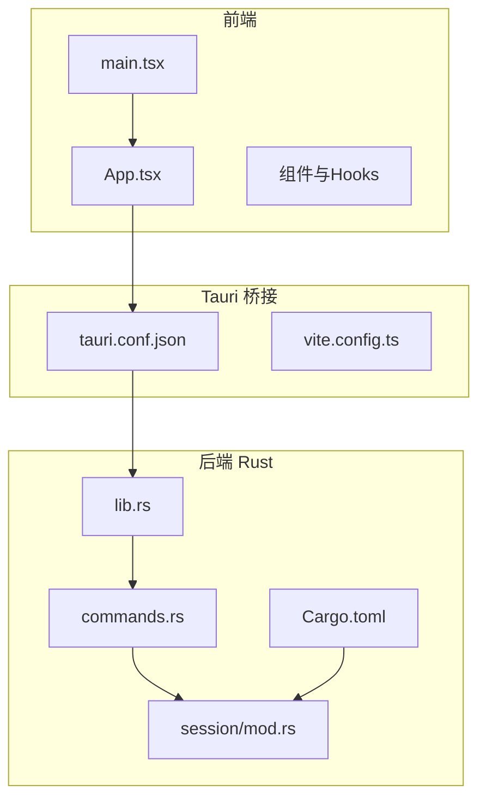
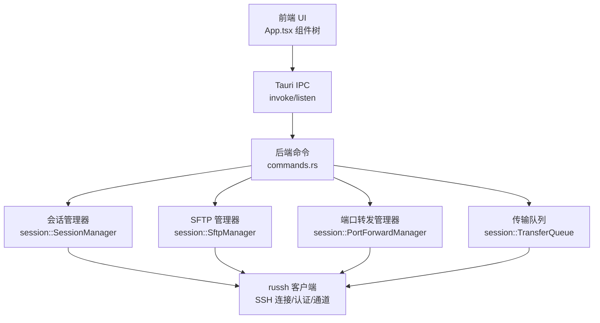
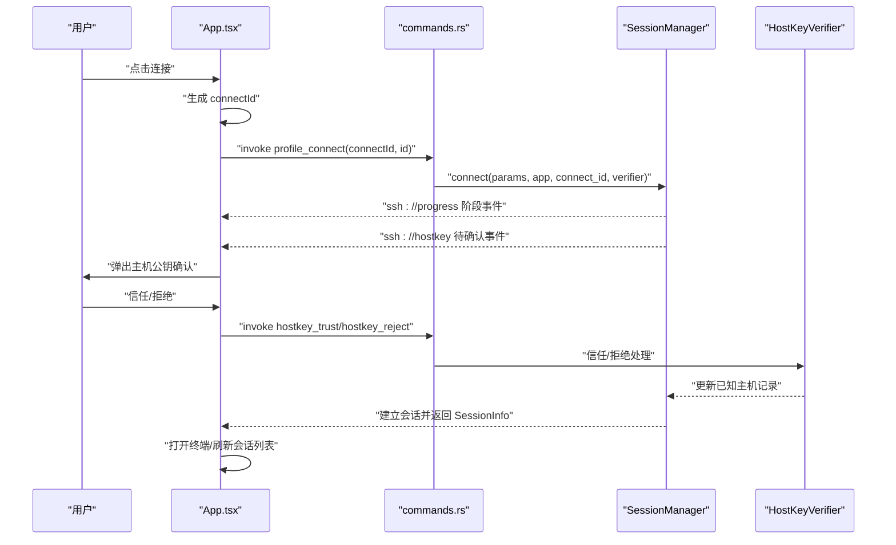
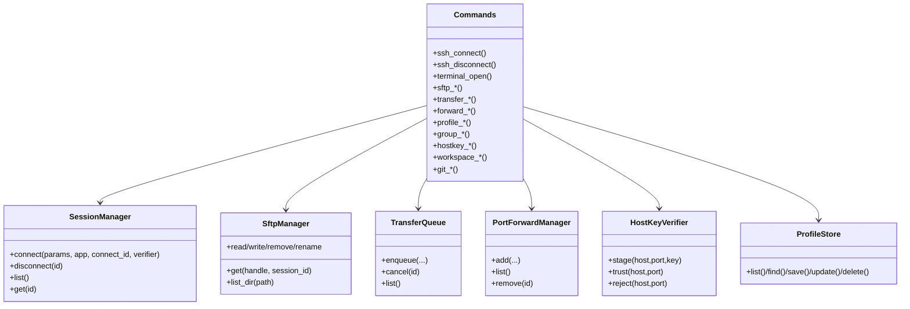
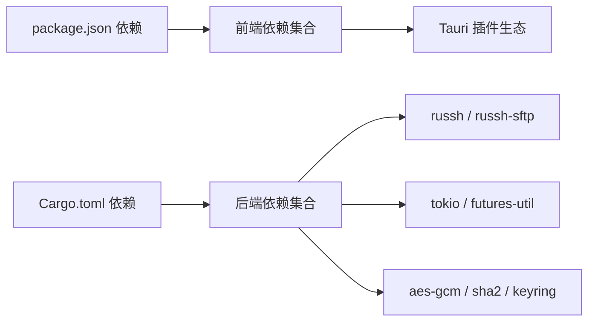

# 开发指南

<cite>
**本文档引用的文件**
- [README.md](file://README.md)
- [CONTRIBUTING.md](file://CONTRIBUTING.md)
- [package.json](file://package.json)
- [Cargo.toml](file://src-tauri/Cargo.toml)
- [vite.config.ts](file://vite.config.ts)
- [tauri.conf.json](file://src-tauri/tauri.conf.json)
- [DESIGN.md](file://docs/DESIGN.md)
- [main.tsx](file://src/main.tsx)
- [App.tsx](file://src/App.tsx)
- [lib.rs](file://src-tauri/src/lib.rs)
- [commands.rs](file://src-tauri/src/commands.rs)
- [mod.rs](file://src-tauri/src/session/mod.rs)
- [types.ts](file://src/types.ts)
- [types.ts（设置）](file://src/settings/types.ts)
- [tsconfig.json](file://tsconfig.json)
</cite>

## 目录
1. [简介](#简介)
2. [项目结构](#项目结构)
3. [核心组件](#核心组件)
4. [架构总览](#架构总览)
5. [详细组件分析](#详细组件分析)
6. [依赖关系分析](#依赖关系分析)
7. [性能考虑](#性能考虑)
8. [故障排查指南](#故障排查指南)
9. [结论](#结论)
10. [附录](#附录)

## 简介
本开发指南面向希望参与 simpl-ssh 项目的贡献者与开发者，提供从环境搭建、依赖安装、构建配置到调试方法的全流程说明；涵盖代码规范、命名约定、注释标准与测试要求；明确贡献流程、Pull Request 规范与代码审查标准；给出开发工具推荐、IDE 配置建议与调试技巧；描述构建系统、CI/CD 流程与发布流程；并总结常见问题与性能优化建议。

## 项目结构
项目采用“前端 React + Tauri 2 + Rust 后端”的混合架构，前端负责 UI 与交互，后端负责 SSH 会话、SFTP、端口转发、传输队列等核心能力，二者通过 Tauri IPC 通信。关键目录与职责如下：
- src：前端源码（React 19 + TypeScript + xterm.js）
- src-tauri：Rust 后端（Tauri 应用、会话管理、SFTP、传输、转发等模块）
- docs：设计与架构文档
- .github/workflows：CI/CD 流水线（构建、测试、发布）

图表来源
- [tauri.conf.json:1-54](file://src-tauri/tauri.conf.json#L1-L54)
- [vite.config.ts:1-33](file://vite.config.ts#L1-L33)
- [lib.rs:1-93](file://src-tauri/src/lib.rs#L1-L93)
- [commands.rs:1-800](file://src-tauri/src/commands.rs#L1-L800)
- [mod.rs:1-226](file://src-tauri/src/session/mod.rs#L1-L226)

章节来源
- [README.md: 111-135:111-135](file://README.md#L111-L135)
- [DESIGN.md: 26-59:26-59](file://docs/DESIGN.md#L26-L59)

## 核心组件
- 前端工作区外壳与状态管理：App.tsx 负责侧栏、标签页、分屏、状态栏、对话框、连接进度与主机公钥确认等；通过 invoke 与监听事件与后端交互。
- Tauri 配置与桥接：tauri.conf.json 定义产品名称、窗口尺寸、安全策略、打包目标与插件；vite.config.ts 配置开发服务器端口与热重载。
- 后端命令与会话：lib.rs 注册命令、初始化各管理器；commands.rs 暴露 SSH/SFTP/传输/转发/配置/分组/监控等命令；session/mod.rs 组织会话、SFTP、传输、转发、X11、Git 等模块。

章节来源
- [App.tsx: 60-682:60-682](file://src/App.tsx#L60-L682)
- [tauri.conf.json: 1-54:1-54](file://src-tauri/tauri.conf.json#L1-L54)
- [vite.config.ts: 1-33:1-33](file://vite.config.ts#L1-L33)
- [lib.rs: 1-L93:1-93](file://src-tauri/src/lib.rs#L1-L93)
- [commands.rs: 1-L800:1-800](file://src-tauri/src/commands.rs#L1-L800)
- [mod.rs: 1-L226:1-226](file://src-tauri/src/session/mod.rs#L1-L226)

## 架构总览
整体架构围绕“前端 UI + Tauri IPC + Rust 后端”的模式展开，核心数据流为：前端发起连接/操作 → Tauri 命令 → 后端会话管理器/通道 → russh 协议栈 → 远端主机。终端与 SFTP 复用同一会话连接，保证资源高效利用与一致性。

图表来源
- [DESIGN.md: 26-59:26-59](file://docs/DESIGN.md#L26-L59)
- [commands.rs: 1-L800:1-800](file://src-tauri/src/commands.rs#L1-L800)
- [lib.rs: 20-L92:20-92](file://src-tauri/src/lib.rs#L20-L92)

## 详细组件分析

### 前端工作区外壳与状态流
- 责任边界：侧栏连接库、标签页管理、分屏布局、状态栏、连接对话框、设置面板、传输/转发面板、主机公钥确认弹窗、命令面板等。
- 数据与事件：通过 invoke 调用后端命令；监听 ssh://progress 与 ssh://hostkey 事件推进连接进度与主机公钥确认。
- 自动重连：基于会话 ID 与配置 ID 映射，指数退避重连，支持用户中断与前台提示。
- 工作区持久化：通过 useWorkspaceRestore 钩子在启动与变化时保存/恢复标签页与布局。

图表来源
- [App.tsx: 136-160:136-160](file://src/App.tsx#L136-L160)
- [App.tsx: 312-336:312-336](file://src/App.tsx#L312-L336)
- [App.tsx: 409-408:409-408](file://src/App.tsx#L409-L408)
- [commands.rs: 617-L636:617-636](file://src-tauri/src/commands.rs#L617-L636)
- [mod.rs: 115-L160:115-160](file://src-tauri/src/session/mod.rs#L115-L160)

章节来源
- [App.tsx: 60-682:60-682](file://src/App.tsx#L60-L682)

### Tauri 配置与开发调试
- 开发服务器：固定端口 1420，严格端口占用；支持 HMR（可配置 host）；忽略 src-tauri 目录监听。
- 应用配置：产品名、窗口尺寸、安全策略（CSP 置空）、打包目标（all）、图标、自动更新公钥与发布地址。
- 前后端联动：beforeDevCommand 指向 pnpm dev，devUrl 指向 http://localhost:1420；build 前置脚本为 pnpm build，输出 dist。

章节来源
- [vite.config.ts: 1-L33:1-33](file://vite.config.ts#L1-L33)
- [tauri.conf.json: 1-L54:1-54](file://src-tauri/tauri.conf.json#L1-L54)

### 后端命令与模块组织
- 命令注册：lib.rs 在启动时注册所有命令，包括 SSH 会话、终端、SFTP、传输、转发、配置、分组、监控、主机公钥、工作区等。
- 会话与通道：commands.rs 实现连接、断开、终端 PTY 打开、SFTP 列表/读写/删除/重命名、传输队列入队/取消/列出、目录同步、端口转发增删查、配置 CRUD、分组管理、监控快照、主机公钥处理、工作区保存/加载/清空、Git 操作等。
- 模块划分：session/mod.rs 汇聚 auth/forward/git_ops/groups/known_hosts/manager/monitor/profile/pty/secrets/sftp/socks/ssh/sync/transfer/workspace/x11 等子模块。

图表来源
- [lib.rs: 20-L92:20-92](file://src-tauri/src/lib.rs#L20-L92)
- [commands.rs: 1-L800:1-800](file://src-tauri/src/commands.rs#L1-L800)
- [mod.rs: 1-L40:1-40](file://src-tauri/src/session/mod.rs#L1-L40)

章节来源
- [lib.rs: 1-L93:1-93](file://src-tauri/src/lib.rs#L1-L93)
- [commands.rs: 1-L800:1-800](file://src-tauri/src/commands.rs#L1-L800)
- [mod.rs: 1-L226:1-226](file://src-tauri/src/session/mod.rs#L1-L226)

### 类型与数据模型
- 会话与配置：SessionInfo、ConnectionProfile、ProfileGroup、AuthMethod。
- 标签页与分屏：Tab、TabKind、SplitNode（叶子/分割节点）、SplitDir。
- 文件与传输：FileEntry、TransferKind、TransferStatus、TransferTask。
- 监控与磁盘：DiskUsage、MonitorSnapshot。
- Git：GitFileStatus、GitStatusResult、GitLogEntry、GitDiffResult、GitBranch、GitWorktree。
- 工作区：WorkspaceTab、WorkspaceSnapshot。
- 设置：AppSettings、默认值与字体选项。

章节来源
- [types.ts: 1-L209:1-209](file://src/types.ts#L1-L209)
- [types.ts（设置）: 1-L48:1-48](file://src/settings/types.ts#L1-L48)

## 依赖关系分析
- 前端依赖：React 19、TypeScript、xterm.js、Lucide React、Tauri 插件（dialog、opener、process、updater）。
- 后端依赖：Tauri 2、russh、russh-sftp、tokio、tokio-tungstenite、serde、keyring、aes-gcm、sha2、uuid、dirs、tracing、tauri-plugin-* 等。
- 构建与工具：Vite、@vitejs/plugin-react、@tauri-apps/cli、TypeScript、pnpm。

图表来源
- [package.json: 22-L51:22-51](file://package.json#L22-L51)
- [Cargo.toml: 22-L49:22-49](file://src-tauri/Cargo.toml#L22-L49)

章节来源
- [package.json: 1-L53:1-53](file://package.json#L1-L53)
- [Cargo.toml: 1-L50:1-50](file://src-tauri/Cargo.toml#L1-L50)

## 性能考虑
- 终端与 SFTP 复用同一会话连接，降低握手与认证成本，避免重复登录。
- 终端 I/O 通过本地 WebSocket 传输，减少主线程阻塞；传输队列串行执行并支持取消，避免 UI 卡顿。
- 断线重连采用指数退避策略，限制最大尝试次数，减轻网络抖动影响。
- 前端 StrictMode 已禁用，避免 effect 双次挂载导致的多余远端 shell 创建。
- TypeScript 严格模式与 noUnused* 规则减少潜在性能与维护风险。

章节来源
- [DESIGN.md: 61-L71:61-71](file://docs/DESIGN.md#L61-L71)
- [main.tsx: 10-L19:10-19](file://src/main.tsx#L10-L19)
- [tsconfig.json: 17-L21:17-21](file://tsconfig.json#L17-L21)

## 故障排查指南
- 开发环境与依赖
  - 确保 Node.js ≥ 22、pnpm 11、Rust stable；Linux 需安装 WebKit、构建工具、SSL、指示器、SVG 等系统依赖。
  - 使用 pnpm 安装依赖后，执行 pnpm tauri dev 启动开发模式。
- 构建与检查
  - 提交前执行 pnpm build、cargo check、cargo clippy（禁止警告）、cargo fmt（检查格式）。
- 常见问题
  - macOS 未签名 DMG 双击报错：执行 xattr 清理；或配置 Apple Developer ID 与公证 Secrets。
  - Linux 依赖缺失导致编译失败：补齐 apt 依赖。
  - 端口占用：开发服务器固定端口 1420，确保未被占用或使用 strictPort。
- 安全与主机公钥
  - 首次连接 TOFU 与公钥变更均会触发 ssh://hostkey 事件，需在前端确认后信任；拒绝则不会修改 known_hosts。
  - 如需删除已知主机记录，可通过 hostkey_remove 命令清理。

章节来源
- [README.md: 77-L98:77-98](file://README.md#L77-L98)
- [CONTRIBUTING.md: 17-L26:17-26](file://CONTRIBUTING.md#L17-L26)
- [README.md: 65-L75:65-75](file://README.md#L65-L75)
- [vite.config.ts: 15-L18:15-18](file://vite.config.ts#L15-L18)
- [commands.rs: 770-L800:770-800](file://src-tauri/src/commands.rs#L770-L800)

## 结论
本指南提供了从环境搭建到贡献流程、从架构理解到性能优化的完整路径。建议在开发过程中始终遵循“终端与 SFTP 复用同一会话”的设计原则，保持前后端职责清晰、命令接口稳定，并通过严格的提交前自查与 CI 流水线保障质量。

## 附录

### 开发环境搭建与依赖安装
- 前置条件：Node.js ≥ 22、pnpm 11、Rust stable；Linux 额外安装系统依赖。
- 安装与启动：克隆仓库 → pnpm install → pnpm tauri dev。
- Linux 依赖示例：libwebkit2gtk-4.1-dev、build-essential、curl、wget、file、libxdo-dev、libssl-dev、libayatana-appindicator3-dev、librsvg2-dev。

章节来源
- [README.md: 77-L98:77-98](file://README.md#L77-L98)

### 构建配置与调试方法
- 前端：Vite 配置固定端口 1420，严格端口占用；HMR 可指定 host；忽略 src-tauri 监听。
- 后端：Tauri 配置 beforeDevCommand/pnpm dev、devUrl、beforeBuildCommand/pnpm build、frontendDist。
- 调试：使用 Tauri Dev 启动，结合 tracing 日志与事件监听（ssh://progress、ssh://hostkey）定位问题。

章节来源
- [vite.config.ts: 1-L33:1-33](file://vite.config.ts#L1-L33)
- [tauri.conf.json: 6-L11:6-11](file://src-tauri/tauri.conf.json#L6-L11)
- [lib.rs: 16-L18:16-18](file://src-tauri/src/lib.rs#L16-L18)

### 代码规范与命名约定
- 提交信息：采用 Conventional Commits 风格（如 feat/fix/docs/refactor）。
- Rust：遵循 cargo fmt 与 clippy；模块组织清晰，命令集中在 commands.rs。
- 前端：TypeScript 严格模式；组件风格统一；事件与命令命名清晰。

章节来源
- [CONTRIBUTING.md: 28-L35:28-35](file://CONTRIBUTING.md#L28-L35)
- [tsconfig.json: 17-L21:17-21](file://tsconfig.json#L17-L21)

### 测试要求
- 前端：pnpm build（类型检查 + 构建）。
- 后端：cargo check、cargo clippy（禁止警告）、cargo fmt（检查格式）。
- 提交前自查：确保上述检查全部通过。

章节来源
- [CONTRIBUTING.md: 17-L26:17-26](file://CONTRIBUTING.md#L17-L26)

### 贡献流程与代码审查
- Fork 仓库 → 新建分支（feat/fix） → 修改代码并补充说明 → 自查通过后提交 PR → 描述改动动机与影响。
- 行为准则：友善、对事不对人，对新手友好。

章节来源
- [CONTRIBUTING.md: 37-L45:37-45](file://CONTRIBUTING.md#L37-L45)

### 开发工具与 IDE 配置建议
- 前端：VS Code + TypeScript/React 插件；启用严格模式；配置 Vite HMR host。
- 后端：Rust Analyzer + Toml/LSP；启用 clippy 与 rustfmt；使用 tracing 输出日志。
- 前后端联动：确保 tauri.conf.json 的 beforeDevCommand 与 devUrl 与 vite.config.ts 一致。

章节来源
- [vite.config.ts: 5-L26:5-26](file://vite.config.ts#L5-L26)
- [tauri.conf.json: 7-L10:7-10](file://src-tauri/tauri.conf.json#L7-L10)

### 构建系统、CI/CD 与发布
- CI：GitHub Actions 工作流包含 CI 与 Release；Release 流水线支持 macOS Developer ID 签名与 Apple 公证。
- 发布：多平台打包（targets all），自动更新通过 tauri-plugin-updater 配置公钥与发布地址。
- macOS：需配置 APPLE_CERTIFICATE、APPLE_CERTIFICATE_PASSWORD、APPLE_SIGNING_IDENTITY、KEYCHAIN_PASSWORD、APPLE_ID/PASSWORD/TEAM_ID 或 APPLE_API_ISSUER/API_KEY/API_PRIVATE_KEY、TAURI_SIGNING_PRIVATE_KEY。

章节来源
- [README.md: 9-L11:9-11](file://README.md#L9-L11)
- [README.md: 58-L75:58-75](file://README.md#L58-L75)
- [tauri.conf.json: 24-L51:24-51](file://src-tauri/tauri.conf.json#L24-L51)