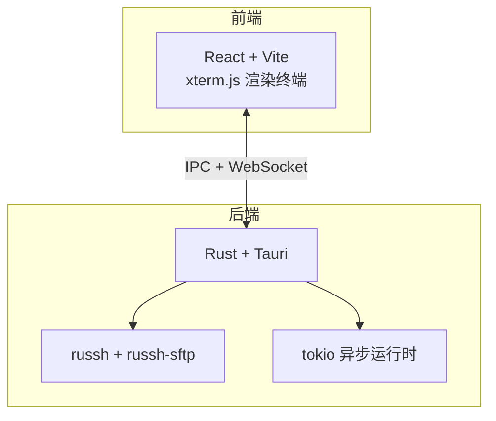
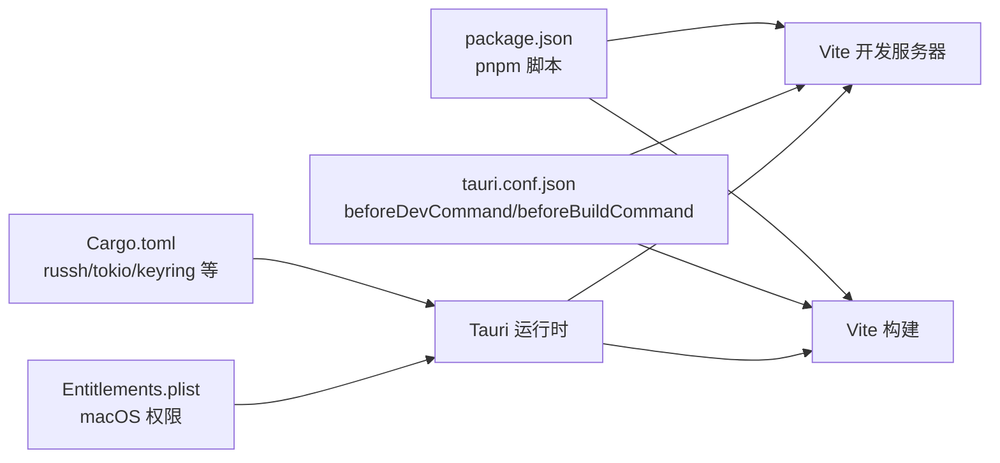

# 环境搭建

<cite>
**本文引用的文件**
- [README.md](file://README.md)
- [CONTRIBUTING.md](file://CONTRIBUTING.md)
- [package.json](file://package.json)
- [src-tauri/Cargo.toml](file://src-tauri/Cargo.toml)
- [src-tauri/tauri.conf.json](file://src-tauri/tauri.conf.json)
- [.github/workflows/ci.yml](file://.github/workflows/ci.yml)
- [.github/workflows/release.yml](file://.github/workflows/release.yml)
- [src-tauri/Entitlements.plist](file://src-tauri/Entitlements.plist)
- [src-tauri/build.rs](file://src-tauri/build.rs)
- [pnpm-workspace.yaml](file://pnpm-workspace.yaml)
</cite>

## 目录
1. [简介](#简介)
2. [系统要求与平台支持](#系统要求与平台支持)
3. [必需系统依赖与可选依赖](#必需系统依赖与可选依赖)
4. [安装步骤](#安装步骤)
5. [开发与构建命令](#开发与构建命令)
6. [架构概览](#架构概览)
7. [详细组件分析](#详细组件分析)
8. [依赖关系分析](#依赖关系分析)
9. [性能与资源建议](#性能与资源建议)
10. [故障排查指南](#故障排查指南)
11. [结论](#结论)

## 简介
本指南面向希望在本地搭建开发环境并参与本项目的开发者，覆盖系统要求、依赖安装、开发与构建流程，以及常见问题排查。项目采用前端 React + TypeScript + Vite，后端 Rust + Tauri，结合 russh 实现 SSH 与 SFTP 能力，并通过 tokio 提供异步运行时。

## 系统要求与平台支持
- Node.js：≥ 22（CI 使用 22，README 也明确 ≥ 22）
- pnpm：11（packageManager 指定为 pnpm@11.9.0）
- Rust：stable（CI 使用 dtolnay/rust-toolchain@stable）
- 支持平台：macOS、Windows、Linux（三端）

上述要求来自 README 的“从源码构建”章节与 CI 工作流配置。

**章节来源**
- [README.md:77-91](file://README.md#L77-L91)
- [.github/workflows/ci.yml:21-29](file://.github/workflows/ci.yml#L21-L29)

## 必需系统依赖与可选依赖
- Linux 必需系统依赖（CI 中安装）：
  - libwebkit2gtk-4.1-dev
  - build-essential
  - curl
  - wget
  - file
  - libssl-dev
  - libayatana-appindicator3-dev
  - librsvg2-dev

- macOS（可选）：若未配置 Apple Secrets，可能需要通过命令行移除 Gatekeeper 标记以允许安装（README 提示）。

- Windows：未在 README 中列出额外系统依赖，通常遵循 Tauri 官方要求。

- 可选工具：用于自动更新与签名的 Apple 证书与公证相关 Secret（仅影响发布流程，不影响本地开发）。

**章节来源**
- [README.md:93-98](file://README.md#L93-L98)
- [README.md:58-63](file://README.md#L58-L63)
- [.github/workflows/ci.yml:36-40](file://.github/workflows/ci.yml#L36-L40)

## 安装步骤
1. 获取源码并进入项目目录
   - 使用 git 克隆仓库并进入目录
2. 安装前端依赖
   - 使用 pnpm 安装（package.json 指定 packageManager 为 pnpm@11）
3. 安装后端依赖（Rust）
   - 通过 Rust stable 工具链安装依赖（Cargo.toml 中声明依赖）
4. Linux 平台额外准备
   - 安装 README 中列出的系统依赖（CI 中已验证）
5. 验证安装
   - 运行开发服务器进行自检（见下一节）

**章节来源**
- [README.md:81-84](file://README.md#L81-L84)
- [package.json:8](file://package.json#L8)
- [.github/workflows/ci.yml:42-43](file://.github/workflows/ci.yml#L42-L43)

## 开发与构建命令
- 开发服务器
  - 前端开发：pnpm dev（Vite）
  - Tauri 开发：pnpm tauri dev（Tauri 会先执行 beforeDevCommand=pnpm dev，再启动 Tauri 开发）
- 构建
  - 前端构建：pnpm build（TypeScript + Vite）
  - Tauri 构建：pnpm tauri build（打包当前平台安装包）
- 提交前自检（CI 与 CONTRIBUTING 中一致）
  - pnpm build
  - cargo check
  - cargo clippy
  - cargo fmt

**章节来源**
- [package.json:22-26](file://package.json#L22-L26)
- [src-tauri/tauri.conf.json:6-11](file://src-tauri/tauri.conf.json#L6-L11)
- [CONTRIBUTING.md:17-26](file://CONTRIBUTING.md#L17-L26)
- [.github/workflows/ci.yml:45-55](file://.github/workflows/ci.yml#L45-L55)

## 架构概览
整体采用“前端 React/Vite + 后端 Rust/Tauri”的桌面应用架构，前端负责 UI 与终端渲染（xterm.js），后端负责 SSH/SFTP 与系统能力（russh、tokio、Tauri 插件等）。Tauri 在开发阶段通过 beforeDevCommand 启动前端开发服务，生产阶段通过 beforeBuildCommand 构建前端静态资源。

**图表来源**
- [src-tauri/Cargo.toml:22-49](file://src-tauri/Cargo.toml#L22-L49)
- [src-tauri/tauri.conf.json:6-11](file://src-tauri/tauri.conf.json#L6-L11)

## 详细组件分析

### 前端与构建配置
- 包管理器与脚本
  - packageManager 指定为 pnpm@11.9.0
  - scripts.dev 指向 Vite 开发服务器
  - scripts.build 指向 TypeScript + Vite 构建
  - scripts.tauri 指向 Tauri CLI
- 依赖
  - @tauri-apps/api、@tauri-apps/cli、@xterm/xterm 等
- 工作空间
  - pnpm-workspace.yaml 允许构建 esbuild

**章节来源**
- [package.json:8](file://package.json#L8)
- [package.json:22-26](file://package.json#L22-L26)
- [package.json:28-51](file://package.json#L28-L51)
- [pnpm-workspace.yaml:1-3](file://pnpm-workspace.yaml#L1-L3)

### 后端与 Tauri 配置
- 语言与工具链
  - Rust edition 2021，稳定工具链
  - 通过 tauri-build 与 tauri 插件生态集成
- 依赖
  - russh、russh-sftp、tokio、serde、keyring、uuid 等
- Tauri 配置
  - beforeDevCommand=pnpm dev，devUrl=http://localhost:1420
  - beforeBuildCommand=pnpm build，frontendDist=../dist
  - 插件：updater、process、dialog、opener
  - macOS Entitlements.plist 注入 WebView JIT 权限（用于签名/公证后的启动）
- 构建入口
  - build.rs 调用 tauri_build::build()

**章节来源**
- [src-tauri/Cargo.toml:1-50](file://src-tauri/Cargo.toml#L1-L50)
- [src-tauri/tauri.conf.json:6-11](file://src-tauri/tauri.conf.json#L6-L11)
- [src-tauri/tauri.conf.json:45-52](file://src-tauri/tauri.conf.json#L45-L52)
- [src-tauri/Entitlements.plist:1-16](file://src-tauri/Entitlements.plist#L1-L16)
- [src-tauri/build.rs:1-4](file://src-tauri/build.rs#L1-L4)

### 平台特定配置
- macOS
  - minimumSystemVersion 11.0
  - Entitlements.plist 注入 JIT/可执行内存权限，防止签名/公证后启动崩溃
- Linux
  - CI 中安装 libwebkit2gtk-4.1-dev 等依赖
- Windows
  - 未在 README 明确列出额外依赖，遵循 Tauri 官方要求

**章节来源**
- [src-tauri/tauri.conf.json:28-31](file://src-tauri/tauri.conf.json#L28-L31)
- [src-tauri/Entitlements.plist:3-14](file://src-tauri/Entitlements.plist#L3-L14)
- [.github/workflows/ci.yml:36-40](file://.github/workflows/ci.yml#L36-L40)

## 依赖关系分析
- 前端到后端
  - Tauri 在开发阶段通过 beforeDevCommand 启动前端开发服务，后端通过 IPC 与 WebSocket 与前端通信
- 后端到系统
  - Tauri 插件提供进程、对话框、更新等能力；russh 提供 SSH/SFTP；tokio 提供异步运行时
- 平台依赖
  - Linux 需要 WebKitGTK 等系统库；macOS 需要 WebView JIT 权限；Windows 依赖 Tauri 官方要求

**图表来源**
- [package.json:22-26](file://package.json#L22-L26)
- [src-tauri/tauri.conf.json:6-11](file://src-tauri/tauri.conf.json#L6-L11)
- [src-tauri/Cargo.toml:22-49](file://src-tauri/Cargo.toml#L22-L49)
- [src-tauri/Entitlements.plist:1-16](file://src-tauri/Entitlements.plist#L1-L16)

## 性能与资源建议
- 前端开发
  - 使用 Vite 的热重载提升开发体验；确保 Node.js 版本满足 ≥ 22
- 后端开发
  - 使用 Rust stable 工具链；启用 clippy 与 fmt 保证代码质量
- Linux
  - 安装系统依赖可避免构建期缺失库导致的失败与重试

[本节为通用建议，不直接分析具体文件]

## 故障排查指南
- Node.js 版本过低
  - 现象：pnpm 安装失败或脚本报错
  - 处理：升级 Node.js 至 ≥ 22（CI 使用 22）
- pnpm 版本不匹配
  - 现象：packageManager 指定 pnpm@11，若本地版本不匹配可能导致安装异常
  - 处理：使用 pnpm@11 或按 packageManager 指定版本安装
- Rust 工具链不稳定
  - 现象：cargo 命令不可用或 clippy/fmt 不可用
  - 处理：安装 stable 工具链并确保 clippy、rustfmt 可用
- Linux 依赖缺失
  - 现象：构建期找不到 WebKitGTK 或其他系统库
  - 处理：安装 README 中列出的系统依赖（libwebkit2gtk-4.1-dev、build-essential、curl、wget、file、libssl-dev、libayatana-appindicator3-dev、librsvg2-dev）
- macOS 安装被 Gatekeeper 拦截
  - 现象：提示“已损坏，无法打开”
  - 处理：执行 xattr -cr 命令移除标记（README 提示）
- Tauri 开发服务器无法访问前端
  - 现象：Tauri dev 无法加载 http://localhost:1420
  - 处理：确认 beforeDevCommand=pnpm dev 正常启动；检查端口占用与防火墙
- 构建失败
  - 现象：pnpm build 或 pnpm tauri build 失败
  - 处理：先执行 pnpm build 通过前端检查，再执行 cargo check/clippy/fmt 通过后端检查

**章节来源**
- [.github/workflows/ci.yml:21-29](file://.github/workflows/ci.yml#L21-L29)
- [README.md:77-91](file://README.md#L77-L91)
- [README.md:93-98](file://README.md#L93-L98)
- [README.md:58-63](file://README.md#L58-L63)
- [src-tauri/tauri.conf.json:6-11](file://src-tauri/tauri.conf.json#L6-L11)
- [CONTRIBUTING.md:17-26](file://CONTRIBUTING.md#L17-L26)

## 结论
按照本指南完成系统要求与依赖安装后，即可顺利启动开发服务器并进行构建。遇到问题时优先对照“故障排查指南”逐项检查，确保 Node.js、pnpm、Rust 工具链与平台依赖均满足要求。如需发布制品，可参考 CI 工作流中的依赖安装与构建步骤。