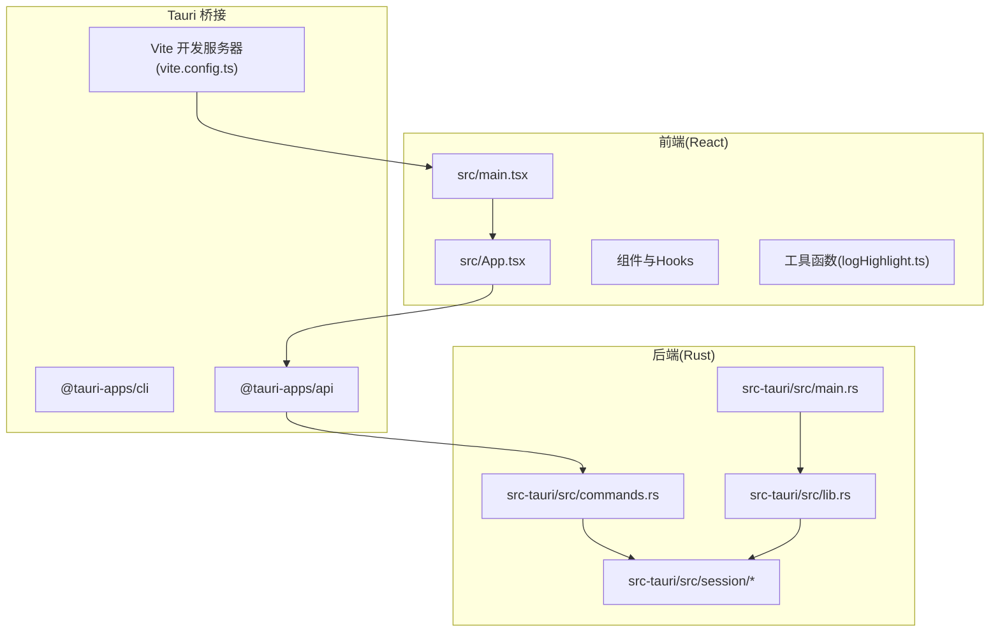
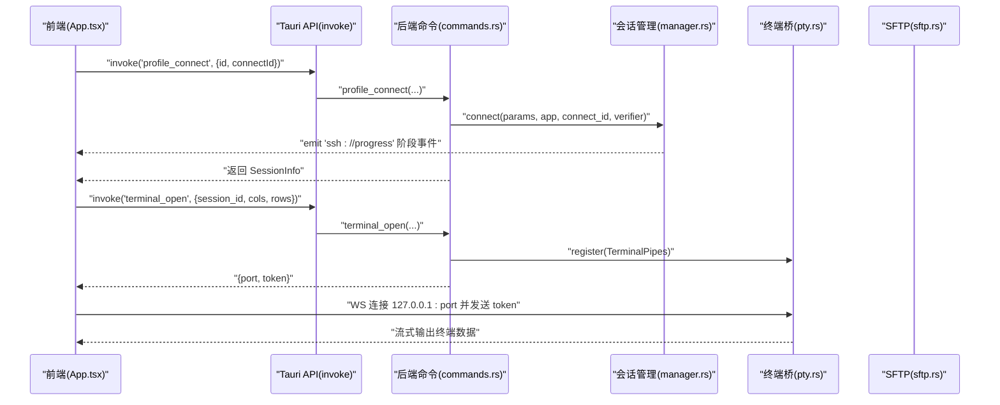
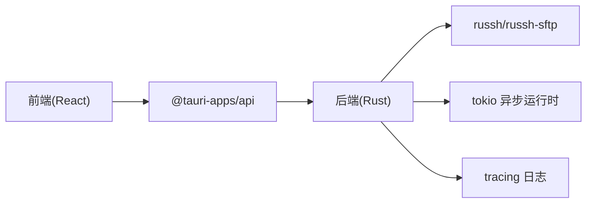
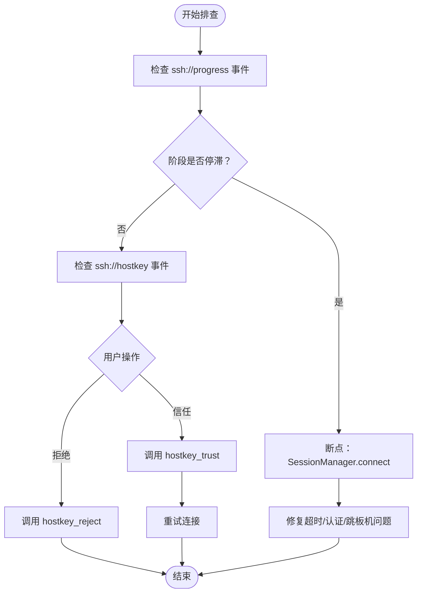

# 调试与测试

<cite>
**本文引用的文件**
- [README.md](file://README.md)
- [CONTRIBUTING.md](file://CONTRIBUTING.md)
- [package.json](file://package.json)
- [vite.config.ts](file://vite.config.ts)
- [src/main.tsx](file://src/main.tsx)
- [src/App.tsx](file://src/App.tsx)
- [src-tauri/Cargo.toml](file://src-tauri/Cargo.toml)
- [src-tauri/src/lib.rs](file://src-tauri/src/lib.rs)
- [src-tauri/src/main.rs](file://src-tauri/src/main.rs)
- [src-tauri/src/commands.rs](file://src-tauri/src/commands.rs)
- [src-tauri/src/session/manager.rs](file://src-tauri/src/session/manager.rs)
- [src-tauri/src/session/pty.rs](file://src-tauri/src/session/pty.rs)
- [src-tauri/src/session/sftp.rs](file://src-tauri/src/session/sftp.rs)
- [src/utils/logHighlight.ts](file://src/utils/logHighlight.ts)
</cite>

## 目录
1. [简介](#简介)
2. [项目结构](#项目结构)
3. [核心组件](#核心组件)
4. [架构总览](#架构总览)
5. [详细组件分析](#详细组件分析)
6. [依赖分析](#依赖分析)
7. [性能考虑](#性能考虑)
8. [故障排查指南](#故障排查指南)
9. [结论](#结论)
10. [附录](#附录)

## 简介
本指南面向前端与后端开发者，提供本项目的调试与测试实践建议，涵盖：
- 前端开发调试：浏览器开发者工具、React DevTools、Vite 开发服务器配置与热重载。
- 后端 Rust 调试：Cargo 调试命令、日志配置与断点设置、异步任务与事件流。
- 测试策略：单元测试与集成测试的编写方法、测试框架选择与覆盖率要求。
- 性能分析与常见问题诊断：基于项目现有日志与事件机制的定位方法。

## 项目结构
该项目采用 Tauri 2 + React 19 + TypeScript 前端 + Rust 后端的混合架构。前端通过 Tauri 桥接调用后端命令，后端通过 russh 与 russh-sftp 提供 SSH、SFTP、端口转发等能力。

图表来源
- [src/main.tsx:1-20](file://src/main.tsx#L1-L20)
- [src/App.tsx:1-685](file://src/App.tsx#L1-L685)
- [vite.config.ts:1-33](file://vite.config.ts#L1-L33)
- [src-tauri/src/lib.rs:1-93](file://src-tauri/src/lib.rs#L1-L93)
- [src-tauri/src/main.rs:1-7](file://src-tauri/src/main.rs#L1-L7)
- [src-tauri/src/commands.rs:1-800](file://src-tauri/src/commands.rs#L1-L800)

章节来源
- [README.md:100-135](file://README.md#L100-L135)
- [package.json:22-27](file://package.json#L22-L27)
- [vite.config.ts:8-32](file://vite.config.ts#L8-L32)
- [src-tauri/Cargo.toml:22-49](file://src-tauri/Cargo.toml#L22-L49)

## 核心组件
- 前端入口与渲染：React 渲染根节点，禁用 StrictMode 以避免终端副作用重复挂载。
- Tauri 命令暴露：commands.rs 中集中定义后端命令，前端通过 invoke 调用。
- 会话管理：SessionManager 管理持久 SSH 会话，支持跳板机、X11 转发、端口转发。
- 终端桥接：TerminalBridge 将 PTY 数据通过本地 WebSocket 传输到前端。
- SFTP 管理：SftpManager 在已有会话上开启 SFTP 子系统通道，复用连接。
- 日志高亮：logHighlight.ts 为终端输出提供日志级别高亮与状态码着色。

章节来源
- [src/main.tsx:10-19](file://src/main.tsx#L10-L19)
- [src-tauri/src/commands.rs:23-89](file://src-tauri/src/commands.rs#L23-L89)
- [src-tauri/src/session/manager.rs:76-145](file://src-tauri/src/session/manager.rs#L76-L145)
- [src-tauri/src/session/pty.rs:41-86](file://src-tauri/src/session/pty.rs#L41-L86)
- [src-tauri/src/session/sftp.rs:24-75](file://src-tauri/src/session/sftp.rs#L24-L75)
- [src/utils/logHighlight.ts:33-161](file://src/utils/logHighlight.ts#L33-L161)

## 架构总览
前端通过 Tauri API 调用后端命令，后端根据命令类型执行相应逻辑（连接、终端、SFTP、传输、转发等），并通过事件向前端推送连接进度与主机密钥提示。

图表来源
- [src/App.tsx:136-160](file://src/App.tsx#L136-L160)
- [src-tauri/src/commands.rs:617-636](file://src-tauri/src/commands.rs#L617-L636)
- [src-tauri/src/commands.rs:106-186](file://src-tauri/src/commands.rs#L106-L186)
- [src-tauri/src/session/manager.rs:82-145](file://src-tauri/src/session/manager.rs#L82-L145)
- [src-tauri/src/session/pty.rs:75-141](file://src-tauri/src/session/pty.rs#L75-L141)

## 详细组件分析

### 前端调试：浏览器与 React DevTools
- 使用 Vite 开发服务器进行热重载与快速迭代，固定端口与严格端口模式有助于稳定 HMR。
- React 渲染根节点禁用 StrictMode，避免终端相关副作用重复挂载导致的异常行为。
- 建议在浏览器开发者工具中：
  - 使用 Elements 面板检查组件层级与 DOM 结构。
  - 使用 Network 面板观察 Tauri 桥接请求与本地 WebSocket（终端桥）流量。
  - 使用 Console 面板查看日志高亮输出与错误信息。
- React DevTools：
  - 使用 Profiler 分析组件渲染性能，识别重渲染热点。
  - 使用组件树定位 invoke 调用与事件监听位置，便于排查连接进度与主机密钥事件。

章节来源
- [vite.config.ts:14-31](file://vite.config.ts#L14-L31)
- [src/main.tsx:10-19](file://src/main.tsx#L10-L19)
- [src/App.tsx:136-160](file://src/App.tsx#L136-L160)

### 后端调试：Cargo、日志与断点
- Cargo 调试：
  - 使用标准调试命令运行后端，结合断点定位会话建立、认证、终端桥接与 SFTP 操作。
  - 在 SessionManager.connect 中设置断点，观察连接阶段事件与超时处理。
  - 在 TerminalBridge.handle_connection 中设置断点，验证 token 校验与数据流。
- 日志配置：
  - 后端初始化了 tracing-subscriber，可通过环境变量过滤日志级别与目标。
  - 建议在开发时设置合适的 RUST_LOG 环境变量，聚焦 ssh、session、pty、sftp 等模块。
- 断点建议位置：
  - commands.rs 中各命令入口（如 ssh_connect、terminal_open、sftp_list 等）。
  - manager.rs 中 connect、connect_via_jump、emit_progress 等关键流程。
  - pty.rs 中 register、handle_connection、WS 控制消息解析。
  - sftp.rs 中 get、list_dir 等会话级缓存与目录遍历逻辑。

章节来源
- [src-tauri/src/lib.rs:16-18](file://src-tauri/src/lib.rs#L16-L18)
- [src-tauri/src/commands.rs:42-72](file://src-tauri/src/commands.rs#L42-L72)
- [src-tauri/src/session/manager.rs:82-145](file://src-tauri/src/session/manager.rs#L82-L145)
- [src-tauri/src/session/pty.rs:75-141](file://src-tauri/src/session/pty.rs#L75-L141)
- [src-tauri/src/session/sftp.rs:30-75](file://src-tauri/src/session/sftp.rs#L30-L75)

### 测试策略与覆盖率
- 测试框架选择：
  - 后端：使用 Rust 标准库与 cargo test，结合 anyhow 错误模型与 tokio 测试环境。
  - 前端：使用 React Testing Library 与 Vitest，配合 @testing-library/jest-dom。
- 单元测试：
  - 建议针对 commands.rs 中的命令函数进行隔离测试，覆盖正常路径与错误路径。
  - 针对 manager.rs 的会话管理逻辑（连接、断开、跳板机）编写异步测试。
  - 针对 pty.rs 的 TerminalBridge 注册与 WS 通信进行模拟测试。
  - 针对 sftp.rs 的 SFTP 会话缓存与目录遍历进行 mock 测试。
- 集成测试：
  - 使用 Tauri 的 e2e 测试能力，模拟真实用户操作（连接、终端、SFTP、传输）。
  - 通过事件监听（ssh://progress、ssh://hostkey）验证后端事件流。
- 覆盖率要求：
  - 建议后端关键模块覆盖率不低于 70%，前端交互组件不低于 60%。
  - 对于安全相关模块（主机公钥校验、凭据存储）覆盖率不低于 80%。

章节来源
- [CONTRIBUTING.md:17-26](file://CONTRIBUTING.md#L17-L26)
- [src-tauri/src/commands.rs:23-89](file://src-tauri/src/commands.rs#L23-L89)
- [src-tauri/src/session/manager.rs:76-145](file://src-tauri/src/session/manager.rs#L76-L145)
- [src-tauri/src/session/pty.rs:41-86](file://src-tauri/src/session/pty.rs#L41-L86)
- [src-tauri/src/session/sftp.rs:24-75](file://src-tauri/src/session/sftp.rs#L24-L75)

### 终端与日志高亮
- 前端日志高亮：logHighlight.ts 提供基于正则的日志级别、HTTP 状态码、异常类名与时间戳高亮，适合在终端输出中快速定位问题。
- 后端日志：通过 tracing-subscriber 输出结构化日志，建议在开发时开启详细日志，生产环境按需降级。

章节来源
- [src/utils/logHighlight.ts:33-161](file://src/utils/logHighlight.ts#L33-L161)
- [src-tauri/src/lib.rs:16-18](file://src-tauri/src/lib.rs#L16-L18)

## 依赖分析
- 前端依赖：React 19、TypeScript、xterm.js、@tauri-apps/* 插件生态。
- 后端依赖：Tauri 2、russh、russh-sftp、tokio、tracing、serde 等。
- Vite 与 Tauri CLI：统一开发体验，固定端口与 HMR 配置提升调试效率。

图表来源
- [package.json:28-51](file://package.json#L28-L51)
- [src-tauri/Cargo.toml:22-49](file://src-tauri/Cargo.toml#L22-L49)

章节来源
- [package.json:28-51](file://package.json#L28-L51)
- [src-tauri/Cargo.toml:22-49](file://src-tauri/Cargo.toml#L22-L49)

## 性能考虑
- 前端性能：
  - 使用 React Profiler 分析组件渲染与重渲染热点，减少不必要的状态更新。
  - 优化 xterm.js 的 WebGL 渲染与滚动性能，避免大块日志输出导致卡顿。
- 后端性能：
  - 会话池复用：通过 SessionManager 复用 SSH 连接，降低握手与认证开销。
  - 终端桥接：使用 mpsc 管道与本地 WS，避免阻塞主线程。
  - SFTP 缓存：SftpManager 对每个会话缓存 SFTP 会话，减少子系统开销。
- 日志与事件：
  - 合理设置日志级别，避免高频事件刷屏影响性能。
  - 使用事件驱动的连接进度推送，前端按需渲染，减少轮询。

章节来源
- [src-tauri/src/session/manager.rs:76-145](file://src-tauri/src/session/manager.rs#L76-L145)
- [src-tauri/src/session/pty.rs:41-86](file://src-tauri/src/session/pty.rs#L41-L86)
- [src-tauri/src/session/sftp.rs:24-75](file://src-tauri/src/session/sftp.rs#L24-L75)

## 故障排查指南
- 连接阶段问题：
  - 观察 ssh://progress 事件，确认阶段是否停留在 resolve/handshake/auth/jump/ready。
  - 在 SessionManager.connect 与 connect_via_jump 设置断点，检查超时与错误路径。
- 主机公钥校验：
  - 当出现 ssh://hostkey 事件时，前端弹窗等待用户确认。若拒绝，需在后端调用 hostkey_reject。
- 终端无输出或断流：
  - 检查 terminal_open 返回的 port/token 是否正确，确认 WS 连接与 token 匹配。
  - 在 TerminalBridge.handle_connection 设置断点，验证输入/输出管道与控制消息（resize）。
- SFTP 列目录异常：
  - 在 sftp.rs 的 list_dir 与 get 中断点，检查路径解析与会话缓存状态。
- 日志与高亮：
  - 使用 logHighlight.ts 的高亮规则辅助定位错误级别与状态码异常。
  - 在后端设置 RUST_LOG 环境变量，聚焦相关模块日志。

图表来源
- [src-tauri/src/session/manager.rs:31-48](file://src-tauri/src/session/manager.rs#L31-L48)
- [src-tauri/src/commands.rs:770-790](file://src-tauri/src/commands.rs#L770-L790)
- [src-tauri/src/commands.rs:106-186](file://src-tauri/src/commands.rs#L106-L186)

章节来源
- [src/App.tsx:136-160](file://src/App.tsx#L136-L160)
- [src-tauri/src/session/manager.rs:31-48](file://src-tauri/src/session/manager.rs#L31-L48)
- [src-tauri/src/commands.rs:770-790](file://src-tauri/src/commands.rs#L770-L790)

## 结论
本项目提供了清晰的前后端分离与桥接设计，结合 Tauri 与 Rust 的高性能特性，能够高效地进行调试与测试。建议在日常开发中：
- 前端：充分利用 Vite 热重载与 React DevTools，结合日志高亮快速定位问题。
- 后端：通过 Cargo 调试与 tracing 日志，围绕会话、终端、SFTP 三大核心模块建立完善的测试体系。
- 测试：以单元测试为基础，以集成测试为补充，逐步提升覆盖率与稳定性。

## 附录
- 开发与构建命令参考：
  - 前端开发：pnpm dev（Vite）
  - 前端构建：pnpm build
  - 后端检查：cargo check（src-tauri/Cargo.toml）
  - 贡献自检：pnpm build && cargo check && cargo clippy && cargo fmt

章节来源
- [README.md:77-91](file://README.md#L77-L91)
- [CONTRIBUTING.md:17-26](file://CONTRIBUTING.md#L17-L26)