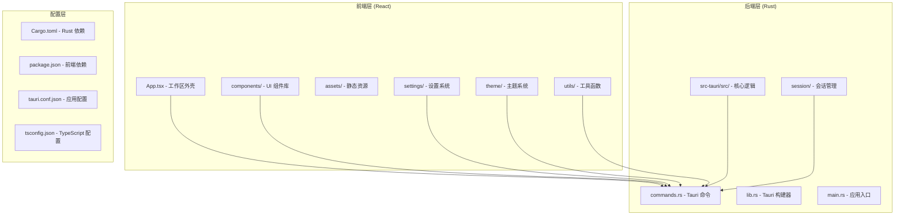
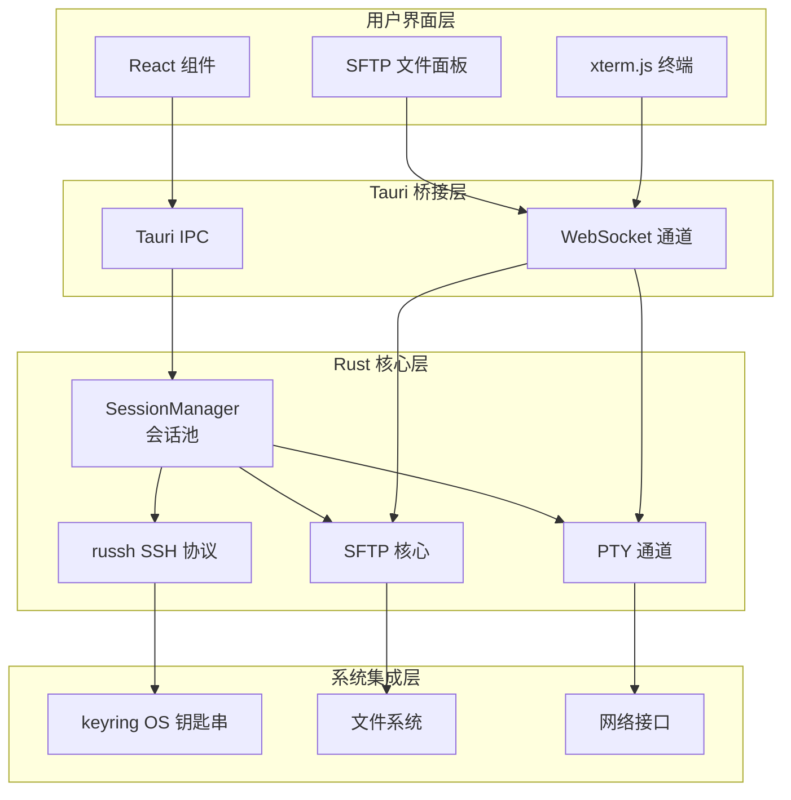
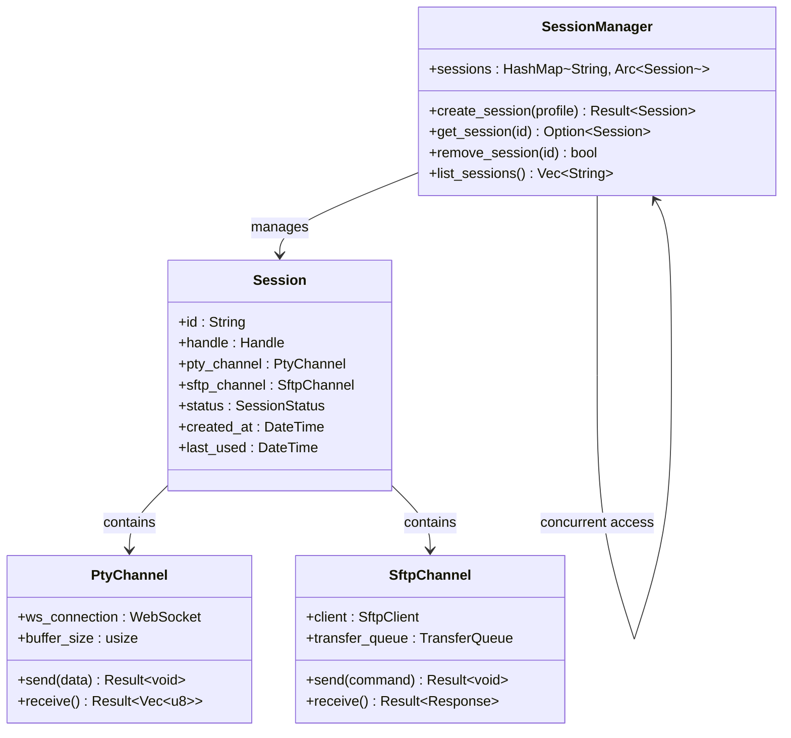
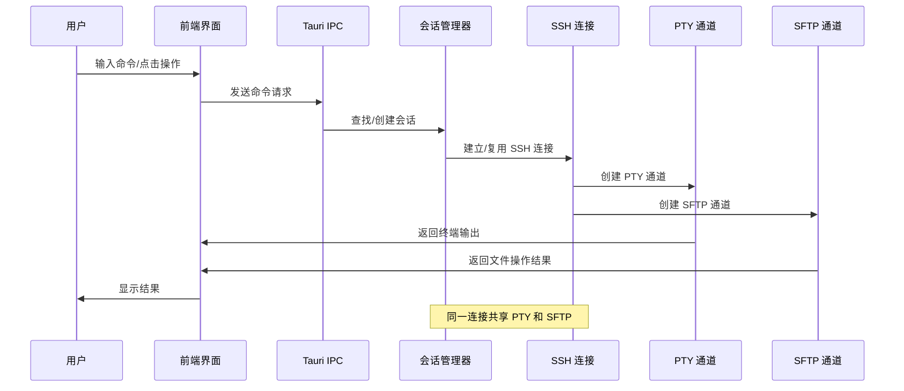
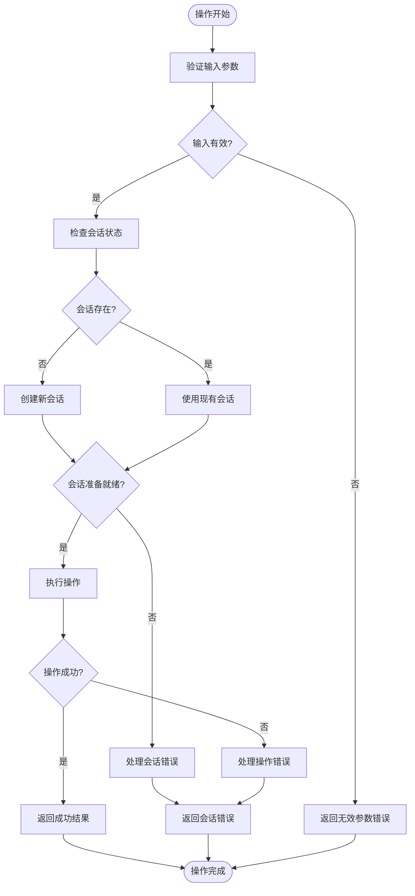
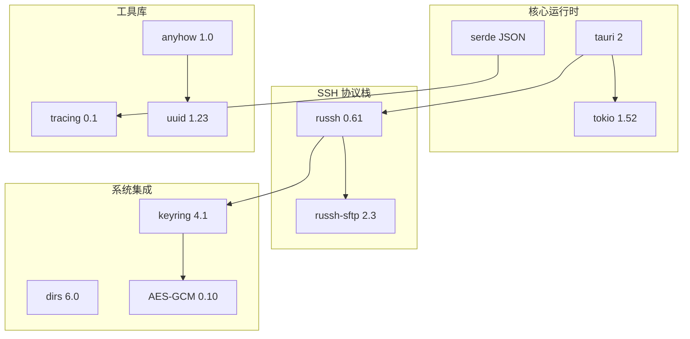

# 贡献流程

<cite>
**本文档引用的文件**
- [CONTRIBUTING.md](file://CONTRIBUTING.md)
- [README.md](file://README.md)
- [docs/DESIGN.md](file://docs/DESIGN.md)
- [.github/workflows/ci.yml](file://.github/workflows/ci.yml)
- [.github/workflows/release.yml](file://.github/workflows/release.yml)
- [package.json](file://package.json)
- [src-tauri/Cargo.toml](file://src-tauri/Cargo.toml)
- [pnpm-workspace.yaml](file://pnpm-workspace.yaml)
</cite>

## 目录
1. [简介](#简介)
2. [项目结构](#项目结构)
3. [核心组件](#核心组件)
4. [架构概览](#架构概览)
5. [详细组件分析](#详细组件分析)
6. [依赖关系分析](#依赖关系分析)
7. [性能考虑](#性能考虑)
8. [故障排除指南](#故障排除指南)
9. [结论](#结论)

## 简介

simpl-ssh 是一个用 Rust + Tauri 构建的轻量级 SSH 客户端，将 Xshell 和 Xftp 合二为一。该项目采用现代化的技术栈，包括 React 19 + TypeScript + xterm.js + russh + tokio 异步运行时，旨在提供高性能、跨平台的终端和文件管理体验。

项目的核心设计理念是"合体"（终端+SFTP 一体）、"轻量"（目标 ~34MB 内存、<10MB 安装包）、"开源免费"和"三端支持"（macOS/Windows/Linux）。通过共享同一条 SSH 连接，用户可以在一个窗口中同时使用终端和文件管理器，无需二次认证或切换软件。

## 项目结构

项目采用前后端分离的架构设计，主要分为前端和 Rust 后端两大部分：



**图表来源**
- [README.md:111-135](file://README.md#L111-L135)
- [docs/DESIGN.md:41-59](file://docs/DESIGN.md#L41-L59)

**章节来源**
- [README.md:111-135](file://README.md#L111-L135)
- [docs/DESIGN.md:26-37](file://docs/DESIGN.md#L26-L37)

## 核心组件

### 前端组件系统

前端采用模块化的组件架构，主要包含以下核心组件：

- **工作区外壳**：App.tsx 提供整体布局，包含侧栏、标签栏、终端面板和状态栏
- **连接对话框**：ConnectDialog.tsx 处理 SSH 连接配置和认证
- **终端面板**：TerminalPane.tsx 集成 xterm.js，支持 WebGL 加速和完整的 PTY 功能
- **文件传输面板**：SftpPane.tsx 和 TransferPanel.tsx 提供 SFTP 文件管理功能
- **设置系统**：SettingsDialog.tsx 和相关的设置提供者组件
- **工具栏**：StatusBar.tsx 和各种工具组件

### Rust 后端核心模块

后端采用模块化设计，主要模块包括：

- **会话管理**：session/manager.rs 管理 SSH 连接池，实现多会话共享同一连接
- **SSH 协议**：session/ssh.rs 使用 russh 库处理 SSH 连接和认证
- **PTY 通道**：session/pty.rs 通过 WebSocket 实现终端 I/O 流式传输
- **SFTP 服务**：session/sftp.rs 提供文件传输功能
- **端口转发**：session/forward.rs 和 socks.rs 支持本地、远程和动态转发
- **配置存储**：session/profile.rs 和 secrets.rs 处理连接配置和凭据加密

**章节来源**
- [docs/DESIGN.md:41-59](file://docs/DESIGN.md#L41-L59)
- [src-tauri/src/session/mod.rs](file://src-tauri/src/session/mod.rs)

## 架构概览

项目采用"前端 React + Rust 后端 + Tauri 桥接"的混合架构，实现了高性能的桌面应用体验：



**图表来源**
- [docs/DESIGN.md:26-37](file://docs/DESIGN.md#L26-L37)
- [docs/DESIGN.md:61-71](file://docs/DESIGN.md#L61-L71)

该架构的核心优势在于：

1. **性能优化**：Rust 后端提供高性能的 SSH 协议处理和异步 I/O
2. **资源共享**：终端和 SFTP 功能共享同一 SSH 连接，避免重复认证
3. **跨平台兼容**：Tauri 桥接确保在 macOS、Windows 和 Linux 上的一致体验
4. **安全保证**：使用 OS 钥匙串存储凭据，支持主机公钥校验和 TOFU 机制

## 详细组件分析

### 会话管理系统

会话管理是整个系统的核心组件，负责管理所有 SSH 连接的状态和生命周期：



**图表来源**
- [docs/DESIGN.md:32-36](file://docs/DESIGN.md#L32-L36)
- [src-tauri/src/session/manager.rs](file://src-tauri/src/session/manager.rs)

### 数据流处理

系统采用事件驱动的数据流架构，确保终端和文件传输的高效处理：



**图表来源**
- [docs/DESIGN.md:39](file://docs/DESIGN.md#L39)
- [docs/DESIGN.md:65](file://docs/DESIGN.md#L65)

### 错误处理机制

系统采用分层错误处理策略，确保错误能够被正确捕获和处理：



**图表来源**
- [docs/DESIGN.md:61-71](file://docs/DESIGN.md#L61-L71)

**章节来源**
- [docs/DESIGN.md:26-37](file://docs/DESIGN.md#L26-L37)
- [docs/DESIGN.md:61-71](file://docs/DESIGN.md#L61-L71)

## 依赖关系分析

### 前端依赖架构

前端采用现代化的依赖管理策略，主要依赖包括：

```mermaid
graph TB
subgraph "核心框架"
REACT[React 19]
TS[TypeScript]
XTERM[xterm.js 6.0]
end
subgraph "Tauri 生态"
TAPI[@tauri-apps/api]
DIALOG[@tauri-apps/plugin-dialog]
OPENER[@tauri-apps/plugin-opener]
UPDATER[@tauri-apps/plugin-updater]
end
subgraph "UI 组件库"
LUCIDE[lucide-react]
FONT[IBM Plex 字体]
end
subgraph "开发工具"
VITE[Vite]
ESLINT[ESLint]
PRETTIER[Prettier]
end
REACT --> XTERM
REACT --> LUCIDE
REACT --> FONT
TAPI --> DIALOG
TAPI --> OPENER
TAPI --> UPDATER
VITE --> ESLINT
VITE --> PRETTIER
```

**图表来源**
- [package.json:28-43](file://package.json#L28-L43)
- [package.json:44-51](file://package.json#L44-L51)

### Rust 后端依赖架构

后端采用高性能的 Rust 生态系统，主要依赖包括：



**图表来源**
- [src-tauri/Cargo.toml:22-49](file://src-tauri/Cargo.toml#L22-L49)

**章节来源**
- [package.json:28-51](file://package.json#L28-L51)
- [src-tauri/Cargo.toml:22-49](file://src-tauri/Cargo.toml#L22-L49)

## 性能考虑

### 内存优化策略

项目采用多项内存优化策略，确保在不同平台上的高效运行：

1. **Rust 后端优化**：使用 `tokio full` 特性启用所有异步功能，避免不必要的性能损失
2. **终端渲染优化**：xterm.js 使用 WebGL 加速，减少 CPU 占用
3. **连接复用**：通过 `Arc` 共享会话句柄，避免重复认证和连接建立
4. **增量构建**：Vite 提供快速的开发服务器和热重载功能

### 构建性能优化

CI/CD 流水线采用多种优化策略：

1. **缓存机制**：Rust 缓存 (`swatinem/rust-cache`) 和 npm 缓存减少构建时间
2. **并行执行**：GitHub Actions 并行构建多平台版本
3. **增量编译**：只重新编译修改的模块
4. **依赖预安装**：提前安装系统依赖，避免重复下载

## 故障排除指南

### 开发环境问题

**常见问题 1：Node.js 版本不兼容**
- 症状：`pnpm install` 失败，报错提示 Node.js 版本过低
- 解决方案：升级 Node.js 到 22+ 版本，确保与 pnpm 11 兼容

**常见问题 2：Rust 工具链缺失**
- 症状：`cargo build` 失败，提示找不到 Rust 工具链
- 解决方案：安装稳定版 Rust (`rustup install stable`)，确保 `cargo` 和 `rustc` 可用

**常见问题 3：Linux 系统依赖缺失**
- 症状：编译失败，提示缺少 WebKitGTK 或其他系统库
- 解决方案：安装完整的系统依赖，包括 `libwebkit2gtk-4.1-dev`、`build-essential` 等

### 构建问题

**常见问题 4：Tauri 构建失败**
- 症状：`pnpm tauri build` 失败，提示 Tauri CLI 问题
- 解决方案：确保安装了 `@tauri-apps/cli`，清理 `node_modules` 后重新安装依赖

**常见问题 5：macOS 签名问题**
- 症状：`.dmg` 文件无法正常安装，Gatekeeper 报告损坏
- 解决方案：如果配置了 Apple Secrets，确保正确设置 `APPLE_CERTIFICATE` 和 `KEYCHAIN_PASSWORD`

### 运行时问题

**常见问题 6：SSH 连接失败**
- 症状：无法建立 SSH 连接，出现认证错误
- 解决方案：检查主机公钥是否在 `~/.ssh/known_hosts` 中，确认凭据正确性

**常见问题 7：SFTP 传输中断**
- 症状：文件传输过程中断，进度丢失
- 解决方案：检查网络连接稳定性，确认服务器磁盘空间充足

**章节来源**
- [README.md:77-98](file://README.md#L77-L98)
- [CONTRIBUTING.md:17-26](file://CONTRIBUTING.md#L17-L26)

## 结论

simpl-ssh 项目展现了现代桌面应用开发的最佳实践，通过精心设计的架构和严格的质量控制，为用户提供了高性能、可靠的 SSH 客户端解决方案。项目不仅在技术实现上表现出色，在社区协作方面也建立了完善的贡献流程。

项目的成功关键在于：

1. **清晰的架构设计**：前后端分离、模块化设计确保了代码的可维护性和扩展性
2. **严格的质量控制**：CI/CD 流水线自动化测试和构建，确保代码质量
3. **完善的文档体系**：从设计文档到贡献指南，为开发者提供了全面的指导
4. **友好的社区文化**：强调对新手友好、对事不对人的协作精神

对于想要参与贡献的开发者来说，遵循既定的流程和规范，不仅能够提高贡献效率，更重要的是能够与项目团队保持良好的协作关系，共同推动项目的持续发展。