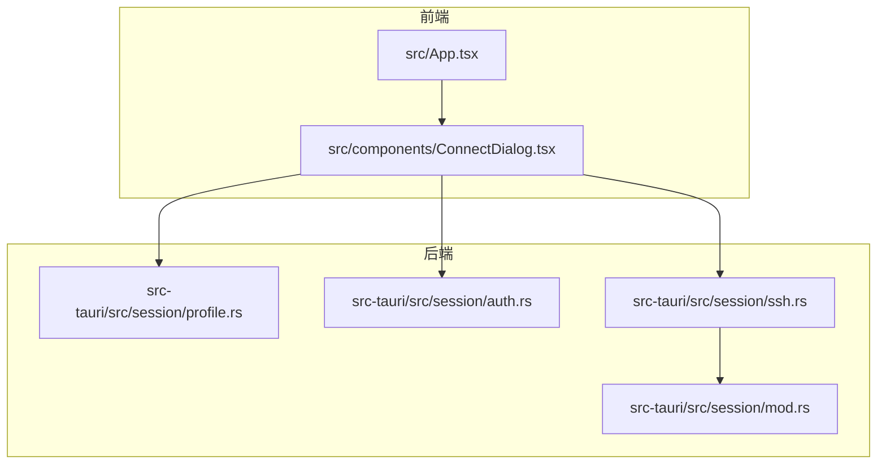
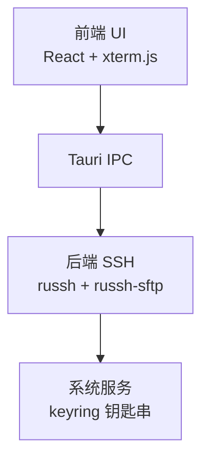
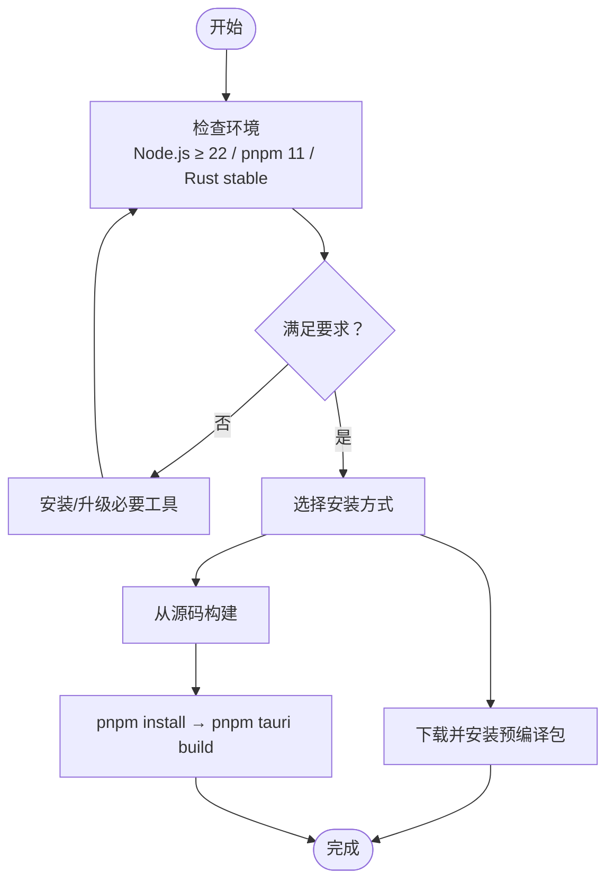
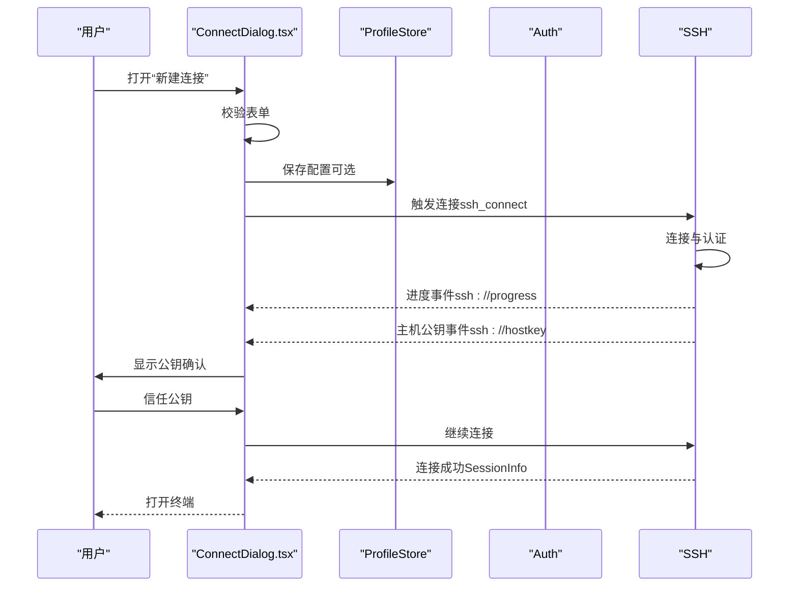
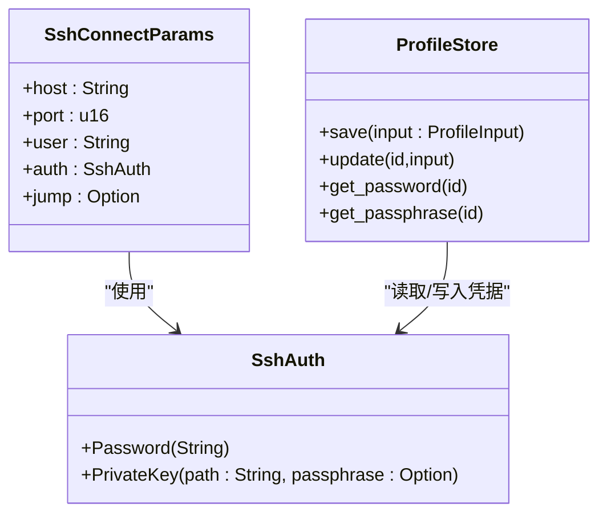
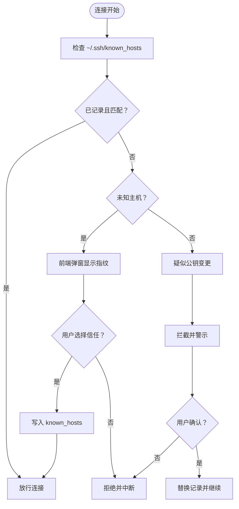
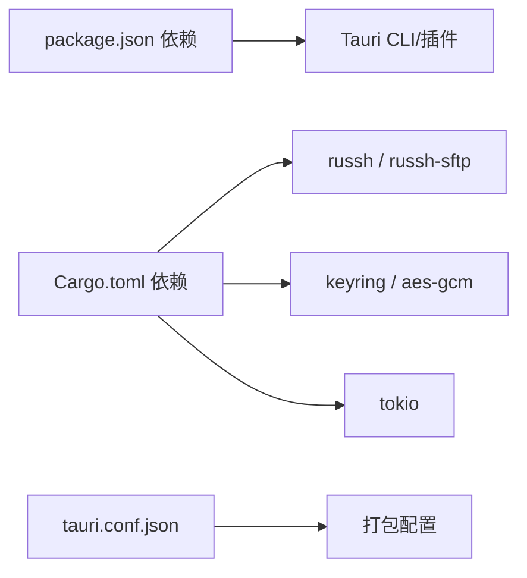

# 快速开始

<cite>
**本文档引用的文件**
- [README.md](file://README.md)
- [package.json](file://package.json)
- [Cargo.toml](file://src-tauri/Cargo.toml)
- [tauri.conf.json](file://src-tauri/tauri.conf.json)
- [CONTRIBUTING.md](file://CONTRIBUTING.md)
- [src/App.tsx](file://src/App.tsx)
- [src/components/ConnectDialog.tsx](file://src/components/ConnectDialog.tsx)
- [src-tauri/src/session/profile.rs](file://src-tauri/src/session/profile.rs)
- [src-tauri/src/session/auth.rs](file://src-tauri/src/session/auth.rs)
- [src-tauri/src/session/ssh.rs](file://src-tauri/src/session/ssh.rs)
- [src-tauri/src/session/mod.rs](file://src-tauri/src/session/mod.rs)
- [docs/DESIGN.md](file://docs/DESIGN.md)
</cite>

## 目录
1. [简介](#简介)
2. [项目结构](#项目结构)
3. [核心组件](#核心组件)
4. [架构总览](#架构总览)
5. [详细组件分析](#详细组件分析)
6. [依赖关系分析](#依赖关系分析)
7. [性能考虑](#性能考虑)
8. [故障排除指南](#故障排除指南)
9. [结论](#结论)
10. [附录](#附录)

## 简介
本指南面向首次使用简化 SSH 客户端的用户，帮助你在最短时间内完成安装、配置与首次连接。项目采用 Rust + Tauri 架构，前端基于 React 与 xterm.js，提供终端与 SFTP 文件管理一体化体验，支持密码认证与私钥认证，并内置主机公钥校验与凭据安全存储。

## 项目结构
- 前端（React + TypeScript）位于 src/，负责 UI、状态管理与与后端的 IPC 通信。
- 后端（Rust）位于 src-tauri/，负责 SSH 连接、认证、会话管理、SFTP、端口转发等。
- 配置文件：
  - package.json：前端依赖与脚本
  - Cargo.toml：Rust 依赖与版本
  - tauri.conf.json：应用打包与安全策略配置

**图表来源**
- [src/App.tsx:60-120](file://src/App.tsx#L60-L120)
- [src/components/ConnectDialog.tsx:31-98](file://src/components/ConnectDialog.tsx#L31-L98)
- [src-tauri/src/session/profile.rs:68-128](file://src-tauri/src/session/profile.rs#L68-L128)
- [src-tauri/src/session/auth.rs:44-82](file://src-tauri/src/session/auth.rs#L44-L82)
- [src-tauri/src/session/ssh.rs:14-65](file://src-tauri/src/session/ssh.rs#L14-L65)
- [src-tauri/src/session/mod.rs:52-113](file://src-tauri/src/session/mod.rs#L52-L113)

**章节来源**
- [README.md:100-135](file://README.md#L100-L135)
- [package.json:1-53](file://package.json#L1-L53)
- [Cargo.toml:1-50](file://src-tauri/Cargo.toml#L1-L50)
- [tauri.conf.json:1-54](file://src-tauri/tauri.conf.json#L1-L54)

## 核心组件
- 连接配置与凭据存储：保存连接元数据（名称、主机、端口、用户、认证方式、私钥路径、分组、跳板机）与凭据（密码/私钥口令）存入系统钥匙串，不落明文。
- 认证模块：支持密码认证与私钥认证，带超时控制与错误处理。
- 会话与主机公钥校验：复用同一条 SSH 连接，支持首次 TOFU 与公钥变更拦截，与 OpenSSH 兼容。
- 前端连接对话框：提供表单校验、连接进度展示、主机公钥确认与保存连接的能力。

**章节来源**
- [src-tauri/src/session/profile.rs:67-128](file://src-tauri/src/session/profile.rs#L67-L128)
- [src-tauri/src/session/auth.rs:10-82](file://src-tauri/src/session/auth.rs#L10-L82)
- [src-tauri/src/session/mod.rs:52-113](file://src-tauri/src/session/mod.rs#L52-L113)
- [src/components/ConnectDialog.tsx:31-98](file://src/components/ConnectDialog.tsx#L31-L98)

## 架构总览
应用采用“前端 React + 后端 Rust + Tauri IPC”的架构，前端通过 IPC 调用后端命令，后端使用 russh 完成 SSH 连接与认证，终端与 SFTP 共享同一会话连接。

**图表来源**
- [docs/DESIGN.md:26-37](file://docs/DESIGN.md#L26-L37)
- [src-tauri/src/session/profile.rs:316-341](file://src-tauri/src/session/profile.rs#L316-L341)

**章节来源**
- [docs/DESIGN.md:12-37](file://docs/DESIGN.md#L12-L37)

## 详细组件分析

### 安装与环境准备
- 环境要求
  - Node.js ≥ 22（pnpm 11 需要）
  - pnpm 11
  - Rust stable
  - Linux 额外系统依赖（apt 安装）
- 安装方式
  - 使用预编译包（推荐）
  - 从源码构建（开发/贡献场景）

**图表来源**
- [README.md:77-98](file://README.md#L77-L98)
- [CONTRIBUTING.md:5-8](file://CONTRIBUTING.md#L5-L8)

**章节来源**
- [README.md:47-98](file://README.md#L47-L98)
- [CONTRIBUTING.md:5-15](file://CONTRIBUTING.md#L5-L15)

### 首次使用流程
- 打开应用，点击“新建连接”
- 填写主机、端口、用户、认证方式
- 选择“保存这个连接”以便后续快速连接
- 点击“连接”，等待进度提示
- 首次连接出现主机公钥确认时，核对指纹后选择“信任”

**图表来源**
- [src/components/ConnectDialog.tsx:147-199](file://src/components/ConnectDialog.tsx#L147-L199)
- [src-tauri/src/session/profile.rs:102-128](file://src-tauri/src/session/profile.rs#L102-L128)
- [src-tauri/src/session/auth.rs:44-82](file://src-tauri/src/session/auth.rs#L44-L82)
- [src-tauri/src/session/ssh.rs:14-65](file://src-tauri/src/session/ssh.rs#L14-L65)

**章节来源**
- [src/components/ConnectDialog.tsx:31-98](file://src/components/ConnectDialog.tsx#L31-L98)
- [src/App.tsx:312-336](file://src/App.tsx#L312-L336)

### 认证配置示例
- 密码认证
  - 在“新建连接”中选择“密码”，填写用户名与密码
  - 勾选“保存这个连接”以便下次直接从连接库发起连接
- 私钥认证
  - 选择“SSH 私钥”，选择本地私钥文件路径
  - 如私钥受口令保护，填写“私钥口令”
  - 勾选“保存这个连接”，凭据存入系统钥匙串

**图表来源**
- [src-tauri/src/session/auth.rs:10-42](file://src-tauri/src/session/auth.rs#L10-L42)
- [src-tauri/src/session/profile.rs:67-128](file://src-tauri/src/session/profile.rs#L67-L128)

**章节来源**
- [src-tauri/src/session/auth.rs:10-82](file://src-tauri/src/session/auth.rs#L10-L82)
- [src-tauri/src/session/profile.rs:21-65](file://src-tauri/src/session/profile.rs#L21-L65)

### 主机公钥校验与安全
- 首次连接：显示指纹，核对后“信任”方可继续
- 公钥变更：拦截并警示，需人工确认后才允许替换
- 安全提示：TOFU 的安全性取决于首次核对；可通过命令行工具删除已记录条目

**图表来源**
- [src-tauri/src/session/mod.rs:118-160](file://src-tauri/src/session/mod.rs#L118-L160)

**章节来源**
- [README.md:155-162](file://README.md#L155-L162)
- [src-tauri/src/session/mod.rs:52-113](file://src-tauri/src/session/mod.rs#L52-L113)

## 依赖关系分析
- 前端依赖：React、xterm.js、Tauri 插件等
- 后端依赖：russh、russh-sftp、keyring、tokio、serde 等
- 应用打包：Tauri 配置定义了产品名、图标、最小系统版本、更新器公钥等

**图表来源**
- [package.json:28-51](file://package.json#L28-L51)
- [Cargo.toml:22-49](file://src-tauri/Cargo.toml#L22-L49)
- [tauri.conf.json:24-52](file://src-tauri/tauri.conf.json#L24-L52)

**章节来源**
- [package.json:1-53](file://package.json#L1-L53)
- [Cargo.toml:1-50](file://src-tauri/Cargo.toml#L1-L50)
- [tauri.conf.json:1-54](file://src-tauri/tauri.conf.json#L1-L54)

## 性能考虑
- 轻量化设计：Rust 后端 + Tauri 系统 WebView，目标内存约 34MB、安装包小于 10MB
- 终端渲染：xterm.js v6（WebGL 加速），支持 vim/htop/tmux 等交互程序
- 传输效率：PTY 通过本地 WebSocket 流式传输，降低延迟
- 连接复用：终端与 SFTP 共享同一条 SSH 连接，避免重复认证

**章节来源**
- [README.md:24-39](file://README.md#L24-L39)
- [docs/DESIGN.md:14-23](file://docs/DESIGN.md#L14-L23)

## 故障排除指南
- 无法连接或认证失败
  - 检查用户名、密码或私钥路径是否正确
  - 私钥认证时确认口令正确
  - 查看连接进度与错误提示
- 首次连接被拒绝
  - 核对指纹后选择“信任”
  - 如为公钥变更，确认服务器合法性后再“信任”
- Linux 构建失败
  - 安装缺失的系统依赖（如 WebKit、SSL、指示器等）
- macOS 安装提示损坏
  - 执行相应命令清理扩展属性后重试
- 验证安装成功
  - 成功打开应用并能从连接库发起连接
  - 连接成功后可在新标签页中看到终端与 SFTP 面板

**章节来源**
- [src-tauri/src/session/auth.rs:44-82](file://src-tauri/src/session/auth.rs#L44-L82)
- [src-tauri/src/session/mod.rs:118-160](file://src-tauri/src/session/mod.rs#L118-L160)
- [README.md:58-75](file://README.md#L58-L75)
- [README.md:93-98](file://README.md#L93-L98)

## 结论
通过本快速开始指南，你可以在几分钟内完成安装与首次连接。建议优先使用预编译包获得最佳体验；如需参与开发，可参考从源码构建流程。首次连接务必仔细核对主机公钥指纹，确保网络安全。

## 附录
- 术语
  - TOFU：首次信任（Trust On First Use）
  - SSH：Secure Shell，网络协议
  - SFTP：SSH 文件传输协议
- 参考
  - 设计文档：了解整体架构与路线图
  - 贡献指南：开发环境与提交规范

**章节来源**
- [docs/DESIGN.md:1-87](file://docs/DESIGN.md#L1-L87)
- [CONTRIBUTING.md:1-46](file://CONTRIBUTING.md#L1-L46)