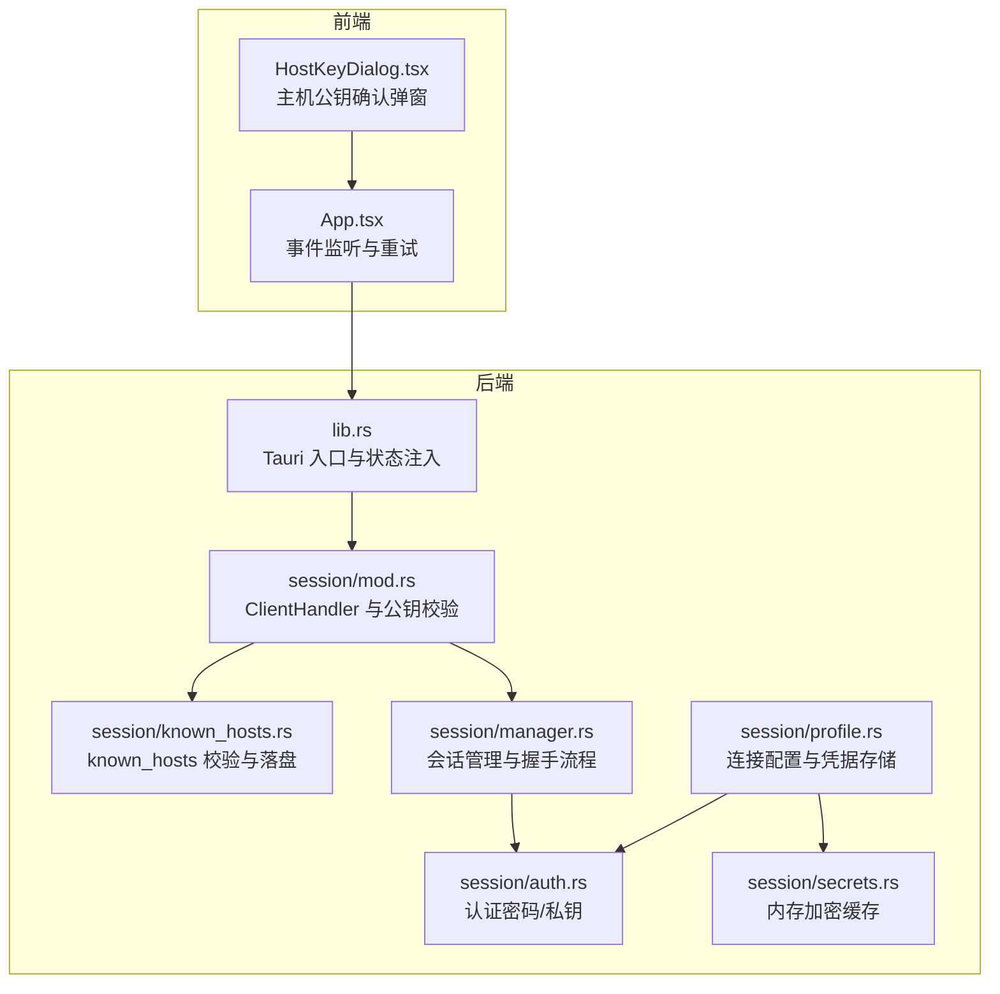
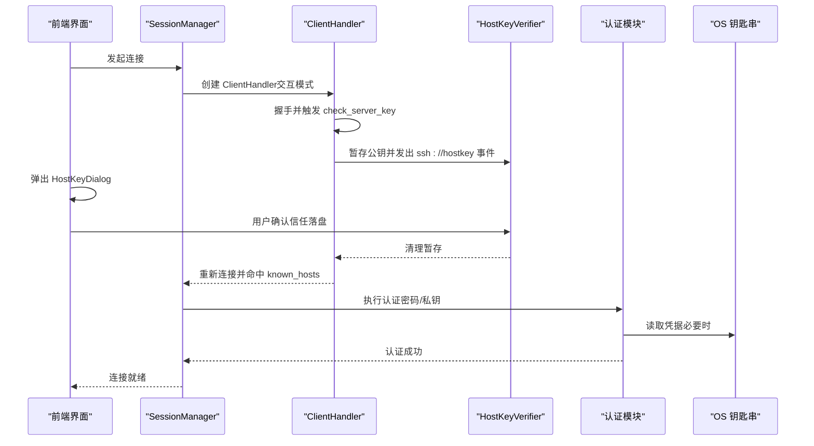
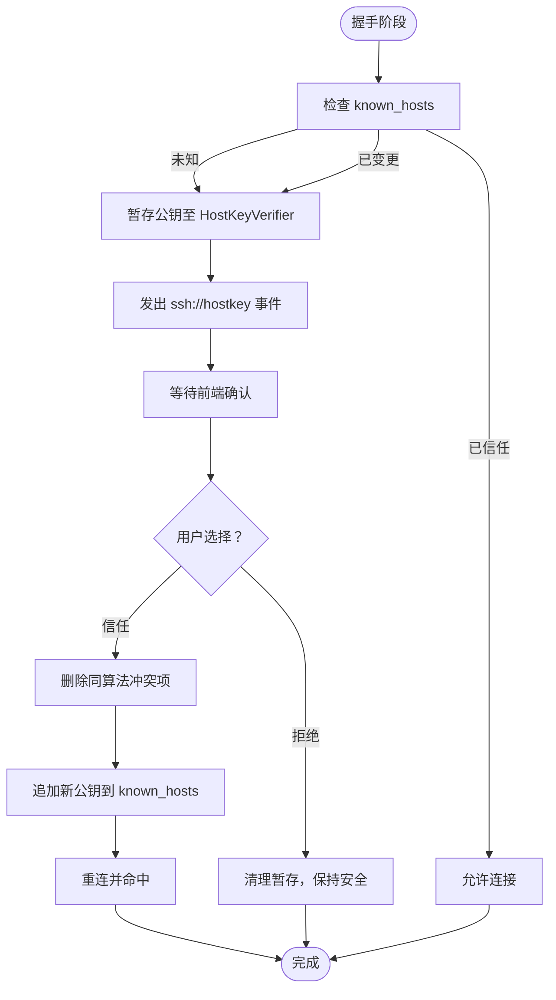
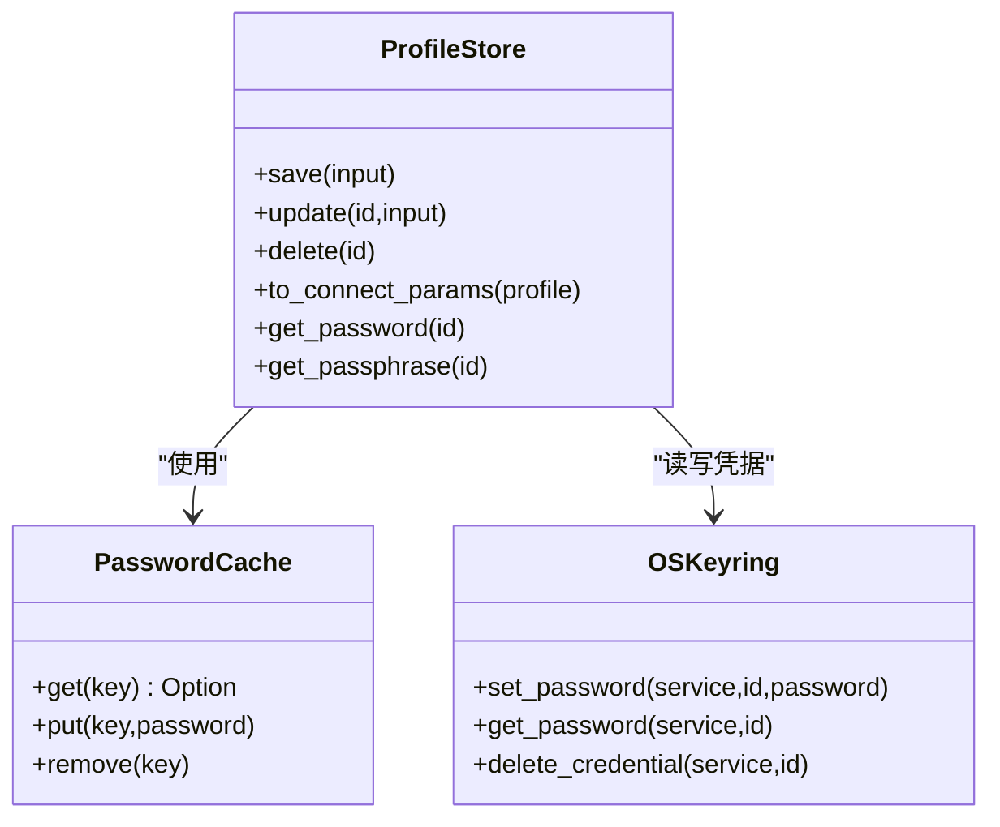
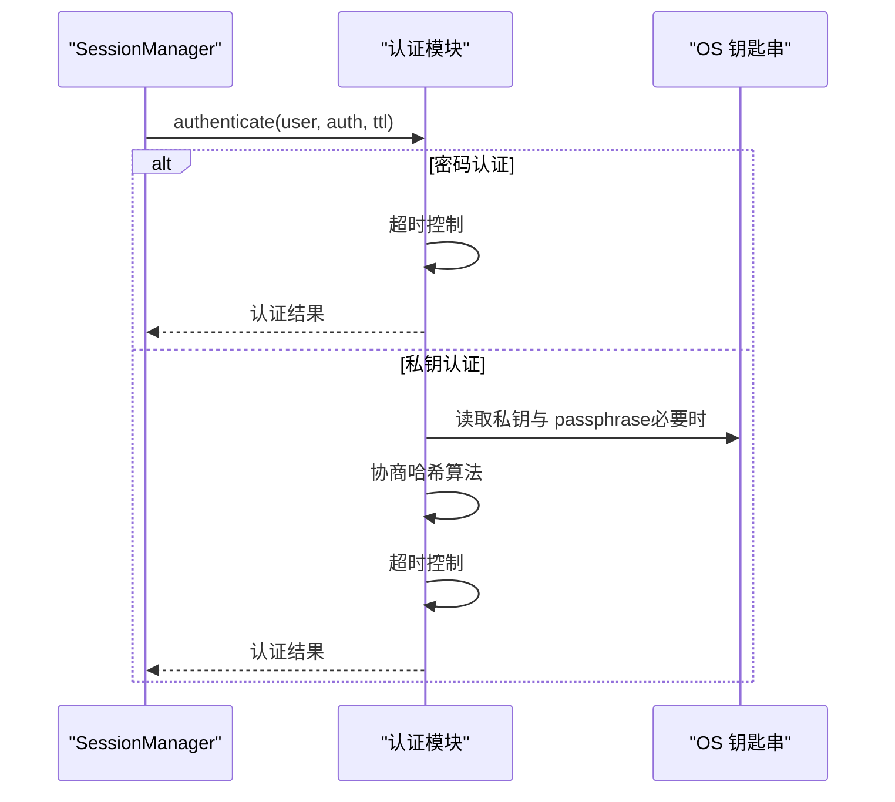
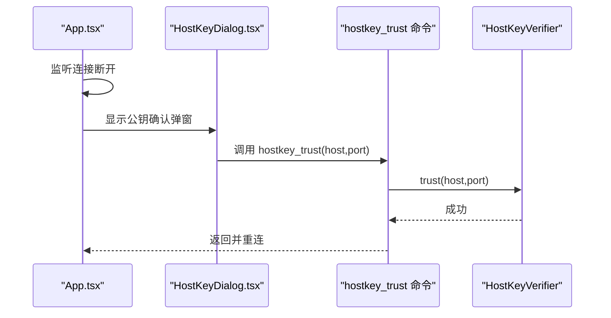
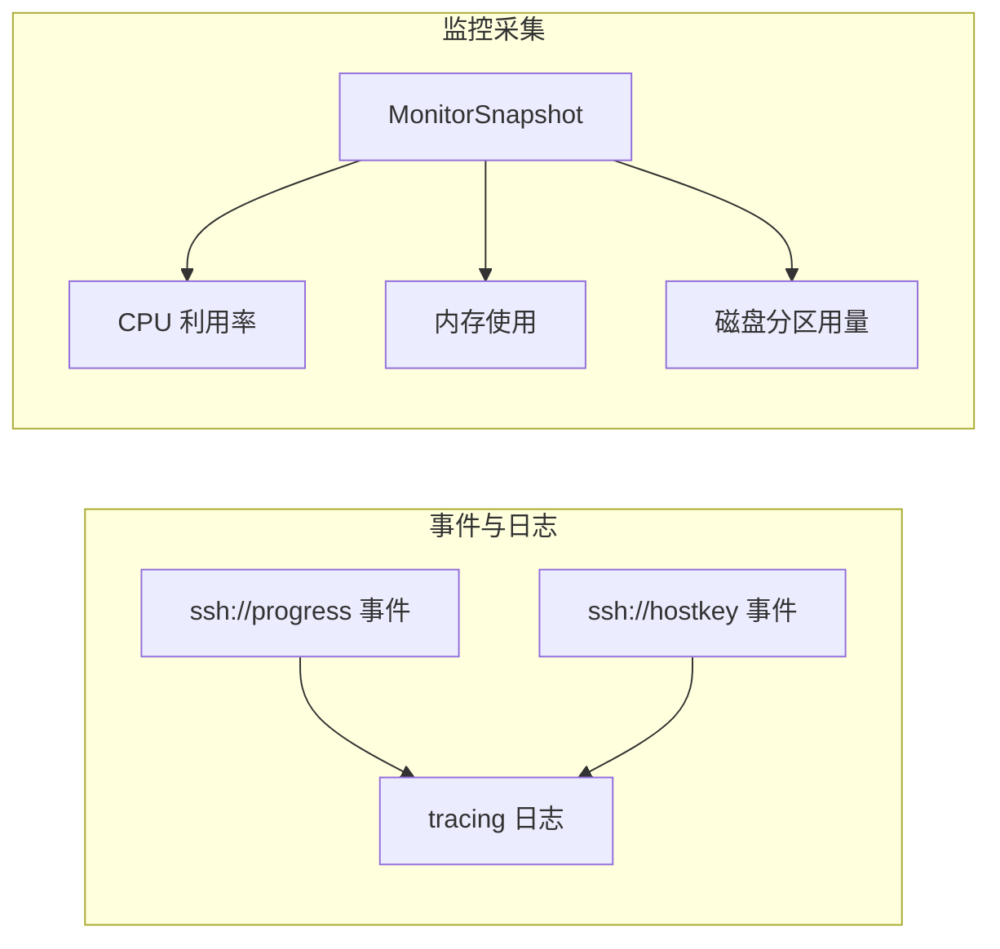
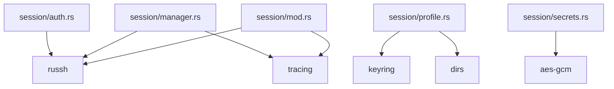

# 安全问题处理

<cite>
**本文档引用的文件**
- [src-tauri/src/session/known_hosts.rs](file://src-tauri/src/session/known_hosts.rs)
- [src-tauri/src/session/mod.rs](file://src-tauri/src/session/mod.rs)
- [src-tauri/src/session/manager.rs](file://src-tauri/src/session/manager.rs)
- [src-tauri/src/session/auth.rs](file://src-tauri/src/session/auth.rs)
- [src-tauri/src/session/profile.rs](file://src-tauri/src/session/profile.rs)
- [src-tauri/src/session/secrets.rs](file://src-tauri/src/session/secrets.rs)
- [src-tauri/src/lib.rs](file://src-tauri/src/lib.rs)
- [src-tauri/Cargo.toml](file://src-tauri/Cargo.toml)
- [src/components/HostKeyDialog.tsx](file://src/components/HostKeyDialog.tsx)
- [src/App.tsx](file://src/App.tsx)
- [src-tauri/src/session/monitor.rs](file://src-tauri/src/session/monitor.rs)
</cite>

## 目录
1. [简介](#简介)
2. [项目结构](#项目结构)
3. [核心组件](#核心组件)
4. [架构总览](#架构总览)
5. [详细组件分析](#详细组件分析)
6. [依赖关系分析](#依赖关系分析)
7. [性能考量](#性能考量)
8. [故障排查指南](#故障排查指南)
9. [结论](#结论)
10. [附录](#附录)

## 简介
本指南聚焦于本项目在安全方面的设计与实现，涵盖主机公钥验证、凭据存储与密钥管理、known_hosts 文件修复、凭据泄露风险防范、密钥轮换流程、安全审计日志查看、可疑活动检测与响应、安全配置最佳实践以及企业安全策略下的部署注意事项。文档基于仓库现有代码进行分析，并提供可操作的处理步骤与可视化图示。

## 项目结构
项目采用前后端分离的 Tauri 架构，后端 Rust 模块负责 SSH 会话、公钥校验、凭据存储与密钥缓存，前端 React 组件负责用户交互与事件驱动的确认流程。

**图表来源**
- [src-tauri/src/lib.rs:14-92](file://src-tauri/src/lib.rs#L14-L92)
- [src-tauri/src/session/mod.rs:52-160](file://src-tauri/src/session/mod.rs#L52-L160)
- [src-tauri/src/session/known_hosts.rs:63-135](file://src-tauri/src/session/known_hosts.rs#L63-L135)
- [src-tauri/src/session/manager.rs:82-145](file://src-tauri/src/session/manager.rs#L82-L145)
- [src-tauri/src/session/auth.rs:44-81](file://src-tauri/src/session/auth.rs#L44-L81)
- [src-tauri/src/session/profile.rs:67-128](file://src-tauri/src/session/profile.rs#L67-L128)
- [src-tauri/src/session/secrets.rs:37-87](file://src-tauri/src/session/secrets.rs#L37-L87)

**章节来源**
- [src-tauri/src/lib.rs:14-92](file://src-tauri/src/lib.rs#L14-L92)
- [src-tauri/src/session/mod.rs:1-226](file://src-tauri/src/session/mod.rs#L1-L226)

## 核心组件
- 主机公钥验证与交互确认：通过 russh 的 known_hosts 实现，结合前端弹窗进行 TOFU/变更确认。
- 凭据存储与密钥管理：连接配置元数据保存在本地 JSON，密码与私钥 passphrase 使用 OS 钥匙串存储；内存加密缓存提升用户体验并降低钥匙串访问频率。
- 会话管理与握手流程：统一的 ClientHandler 在握手阶段触发公钥校验，认证阶段执行密码或私钥认证。
- 安全审计与监控：会话级进度事件与远程系统指标采集，辅助安全审计与异常检测。

**章节来源**
- [src-tauri/src/session/known_hosts.rs:1-197](file://src-tauri/src/session/known_hosts.rs#L1-L197)
- [src-tauri/src/session/profile.rs:1-419](file://src-tauri/src/session/profile.rs#L1-L419)
- [src-tauri/src/session/secrets.rs:1-110](file://src-tauri/src/session/secrets.rs#L1-L110)
- [src-tauri/src/session/manager.rs:1-317](file://src-tauri/src/session/manager.rs#L1-L317)

## 架构总览
下图展示了从连接发起到公钥确认与认证的关键交互路径，强调安全控制点与用户参与环节。

**图表来源**
- [src-tauri/src/session/manager.rs:82-145](file://src-tauri/src/session/manager.rs#L82-L145)
- [src-tauri/src/session/mod.rs:118-160](file://src-tauri/src/session/mod.rs#L118-L160)
- [src-tauri/src/session/known_hosts.rs:97-135](file://src-tauri/src/session/known_hosts.rs#L97-L135)
- [src-tauri/src/session/auth.rs:44-81](file://src-tauri/src/session/auth.rs#L44-L81)
- [src/components/HostKeyDialog.tsx:14-118](file://src/components/HostKeyDialog.tsx#L14-L118)

## 详细组件分析

### 主机公钥验证与 known_hosts 管理
- 校验三态：已信任（Trusted）、未知（Unknown，首次连接 TOFU）、已变更（Changed，疑似 MITM）。
- 探针与确认：握手阶段若非 Trusted，将公钥暂存至内存中的 HostKeyVerifier，并发出 ssh://hostkey 事件，前端弹窗提示用户核对指纹。
- 落盘与冲突处理：用户确认后，先剔除与新公钥同算法但不一致的旧记录，再追加新公钥到 ~/.ssh/known_hosts。
- 非交互模式：一次性 exec demo 中，未知主机静默 TOFU，公钥变更则拒绝，避免无确认的自动信任。

**图表来源**
- [src-tauri/src/session/mod.rs:118-160](file://src-tauri/src/session/mod.rs#L118-L160)
- [src-tauri/src/session/known_hosts.rs:63-135](file://src-tauri/src/session/known_hosts.rs#L63-L135)

**章节来源**
- [src-tauri/src/session/known_hosts.rs:1-197](file://src-tauri/src/session/known_hosts.rs#L1-L197)
- [src-tauri/src/session/mod.rs:52-160](file://src-tauri/src/session/mod.rs#L52-L160)

### 凭据存储与密钥管理
- 连接配置元数据（名称、主机、端口、用户、认证方式、私钥路径等）保存在本地 JSON 文件。
- 凭据（密码、私钥 passphrase）使用 OS 钥匙串存储，不落明文。
- 内存加密缓存：读取钥匙串后进行 AES-GCM 加密缓存，24 小时 TTL，进程关闭即清空，避免频繁弹窗与明文泄露风险。
- 配置生命周期：新增、更新、删除均同步维护钥匙串与缓存，确保一致性与安全性。

**图表来源**
- [src-tauri/src/session/profile.rs:67-403](file://src-tauri/src/session/profile.rs#L67-L403)
- [src-tauri/src/session/secrets.rs:37-109](file://src-tauri/src/session/secrets.rs#L37-L109)

**章节来源**
- [src-tauri/src/session/profile.rs:1-419](file://src-tauri/src/session/profile.rs#L1-L419)
- [src-tauri/src/session/secrets.rs:1-110](file://src-tauri/src/session/secrets.rs#L1-L110)

### 认证流程与超时控制
- 支持密码认证与私钥认证（含 passphrase）。
- 握手、认证阶段分别设置超时，避免长时间阻塞。
- 私钥认证时协商最佳 RSA 哈希算法，增强兼容性与安全性。

**图表来源**
- [src-tauri/src/session/manager.rs:289-316](file://src-tauri/src/session/manager.rs#L289-L316)
- [src-tauri/src/session/auth.rs:44-81](file://src-tauri/src/session/auth.rs#L44-L81)

**章节来源**
- [src-tauri/src/session/auth.rs:1-82](file://src-tauri/src/session/auth.rs#L1-L82)
- [src-tauri/src/session/manager.rs:24-317](file://src-tauri/src/session/manager.rs#L24-L317)

### 前端交互与事件驱动确认
- HostKeyDialog 提示首次连接或公钥变更，引导用户通过可靠渠道核对指纹。
- App.tsx 监听连接断开事件，根据设置决定是否自动重连；用户确认后调用 hostkey_trust 触发后端落盘并重连。

**图表来源**
- [src/components/HostKeyDialog.tsx:14-118](file://src/components/HostKeyDialog.tsx#L14-L118)
- [src/App.tsx:390-427](file://src/App.tsx#L390-L427)
- [src-tauri/src/session/known_hosts.rs:103-121](file://src-tauri/src/session/known_hosts.rs#L103-L121)

**章节来源**
- [src/components/HostKeyDialog.tsx:1-119](file://src/components/HostKeyDialog.tsx#L1-L119)
- [src/App.tsx:390-427](file://src/App.tsx#L390-L427)

### 安全审计与可疑活动检测
- 会话进度事件：ssh://progress 包含 resolve、handshake、auth、jump、ready 等阶段，便于审计连接行为。
- 远程监控快照：在会话上执行轻量采集脚本，获取负载、内存、磁盘等指标，辅助识别异常资源占用。
- 建议：结合前端日志高亮与后端 tracing 输出，定期巡检连接失败、认证超时、公钥变更事件。

**图表来源**
- [src-tauri/src/session/manager.rs:39-48](file://src-tauri/src/session/manager.rs#L39-L48)
- [src-tauri/src/session/monitor.rs:46-79](file://src-tauri/src/session/monitor.rs#L46-L79)

**章节来源**
- [src-tauri/src/session/manager.rs:1-317](file://src-tauri/src/session/manager.rs#L1-L317)
- [src-tauri/src/session/monitor.rs:1-231](file://src-tauri/src/session/monitor.rs#L1-L231)

## 依赖关系分析
- 外部依赖：russh（SSH 协议与 known_hosts）、keyring（OS 钥匙串）、aes-gcm（内存缓存加密）、dirs（配置目录）、tracing（日志）。
- 组件耦合：SessionManager 依赖 ClientHandler、HostKeyVerifier、认证模块；ProfileStore 依赖钥匙串与内存缓存；前端通过 Tauri 命令与后端交互。

**图表来源**
- [src-tauri/Cargo.toml:22-49](file://src-tauri/Cargo.toml#L22-L49)
- [src-tauri/src/session/mod.rs:44-50](file://src-tauri/src/session/mod.rs#L44-L50)
- [src-tauri/src/session/manager.rs:11-18](file://src-tauri/src/session/manager.rs#L11-L18)
- [src-tauri/src/session/profile.rs:10-14](file://src-tauri/src/session/profile.rs#L10-L14)
- [src-tauri/src/session/secrets.rs:16-21](file://src-tauri/src/session/secrets.rs#L16-L21)

**章节来源**
- [src-tauri/Cargo.toml:1-50](file://src-tauri/Cargo.toml#L1-L50)

## 性能考量
- 连接超时：TCP 建连、SSH 握手、认证阶段分别设置超时，避免长时间阻塞。
- 内存加密缓存：减少钥匙串访问频次，提升用户体验；24 小时 TTL 平衡便利与安全。
- 会话复用：终端、SFTP、端口转发共享同一 Handle，降低资源消耗。

**章节来源**
- [src-tauri/src/session/manager.rs:24-317](file://src-tauri/src/session/manager.rs#L24-L317)
- [src-tauri/src/session/secrets.rs:26-87](file://src-tauri/src/session/secrets.rs#L26-L87)

## 故障排查指南

### 公钥验证失败的处理方法
- 首次连接（Unknown）：前端弹窗显示指纹，用户需通过可靠渠道核对后选择“信任并连接”。
- 公钥已变更（Changed）：提示可能存在中间人攻击，除非确知变更原因并已核对新指纹，否则不要继续。
- 非交互模式：一次性 exec demo 中，未知主机静默 TOFU，公钥变更则拒绝。

**章节来源**
- [src-tauri/src/session/mod.rs:118-160](file://src-tauri/src/session/mod.rs#L118-L160)
- [src-tauri/src/session/known_hosts.rs:63-84](file://src-tauri/src/session/known_hosts.rs#L63-L84)

### known_hosts 文件修复
- 用户确认信任后，后端会先剔除与新公钥同算法但不一致的旧记录，再追加新公钥到 ~/.ssh/known_hosts。
- 若需手动修复，可删除对应主机/端口的冲突行，保留其他算法记录。

**章节来源**
- [src-tauri/src/session/known_hosts.rs:103-135](file://src-tauri/src/session/known_hosts.rs#L103-L135)
- [src-tauri/src/session/known_hosts.rs:137-192](file://src-tauri/src/session/known_hosts.rs#L137-L192)

### 凭据泄露风险防范
- 凭据不落明文：密码与私钥 passphrase 仅存 OS 钥匙串，本地 JSON 仅保存元数据。
- 内存加密缓存：读取后进行 AES-GCM 加密，24 小时 TTL，进程退出即清空。
- 最小权限原则：钥匙串凭据按连接配置 ID 管理，删除配置时同步清理。

**章节来源**
- [src-tauri/src/session/profile.rs:343-393](file://src-tauri/src/session/profile.rs#L343-L393)
- [src-tauri/src/session/secrets.rs:37-109](file://src-tauri/src/session/secrets.rs#L37-L109)

### 密钥轮换流程
- 生成新私钥并更新连接配置中的私钥路径与 passphrase。
- 更新配置时，若切换认证方式或修改凭据，后端会清理旧钥匙串条目并写入新凭据。
- 重新连接时，若公钥发生变更，遵循公钥确认流程进行落盘。

**章节来源**
- [src-tauri/src/session/profile.rs:130-199](file://src-tauri/src/session/profile.rs#L130-L199)
- [src-tauri/src/session/known_hosts.rs:103-121](file://src-tauri/src/session/known_hosts.rs#L103-L121)

### 安全审计日志查看与可疑活动检测
- 查看后端日志：通过 tracing 初始化，结合 ssh://progress 与 ssh://hostkey 事件定位问题。
- 远程监控：采集 CPU、内存、磁盘指标，发现异常波动时结合连接历史与公钥事件进行交叉分析。
- 响应措施：对频繁公钥变更、认证超时、连接失败等事件进行告警与复核。

**章节来源**
- [src-tauri/src/lib.rs:16-18](file://src-tauri/src/lib.rs#L16-L18)
- [src-tauri/src/session/manager.rs:39-48](file://src-tauri/src/session/manager.rs#L39-L48)
- [src-tauri/src/session/monitor.rs:46-79](file://src-tauri/src/session/monitor.rs#L46-L79)

## 结论
本项目在安全方面实现了完善的主机公钥验证、凭据加密存储与密钥管理机制，并通过前端交互与事件驱动的方式确保用户对连接安全的知情与可控。结合会话进度事件与远程监控能力，可有效支撑安全审计与异常检测。建议在企业环境中进一步强化访问控制、审计留痕与合规策略。

## 附录

### 企业安全策略下的部署注意事项
- 禁止一次性 exec 非交互模式用于生产连接，确保交互式公钥确认流程。
- 强制使用私钥认证并启用 passphrase，定期轮换私钥与 passphrase。
- 限制钥匙串访问权限，避免在不受信环境弹窗授权。
- 配置最小权限与网络隔离，仅开放必要的端口转发与 SFTP 功能。
- 建立事件监控与告警机制，对公钥变更、认证失败、连接异常进行自动化响应。