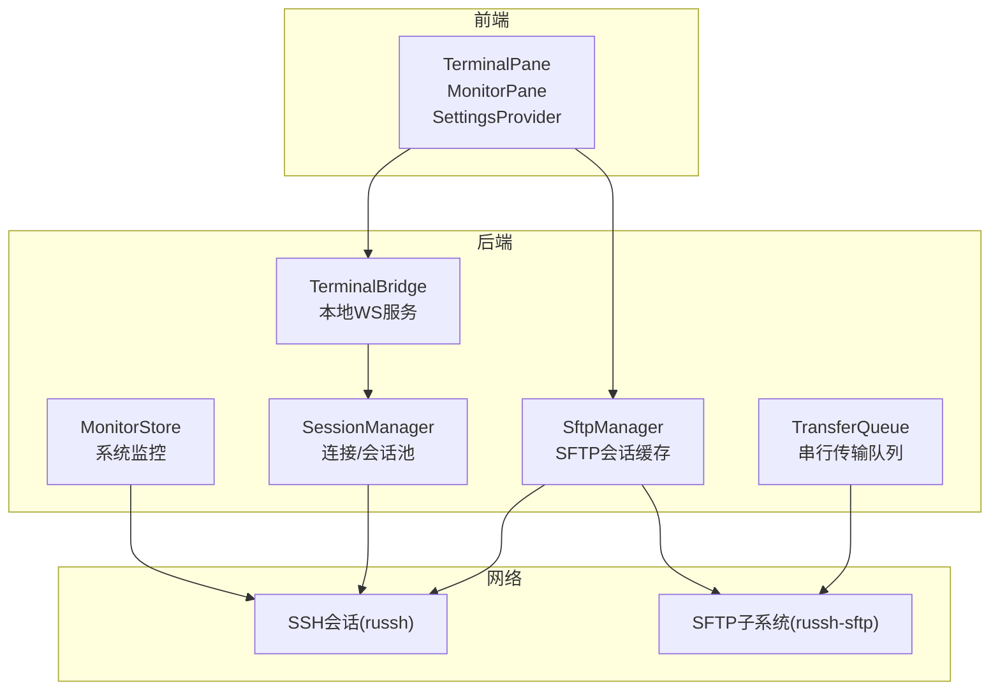
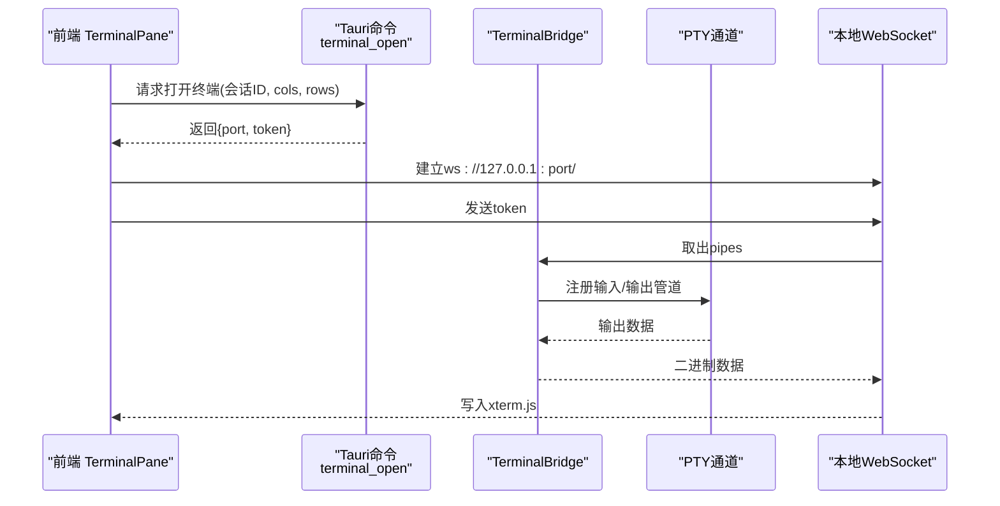
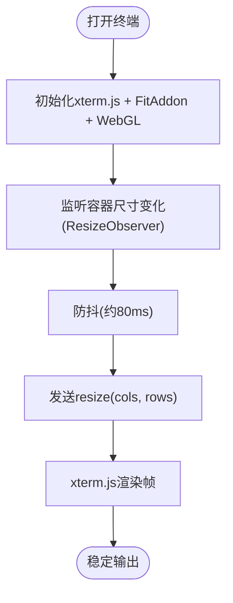
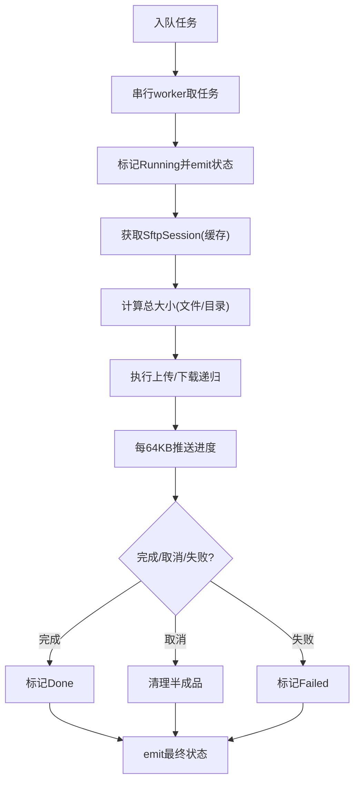
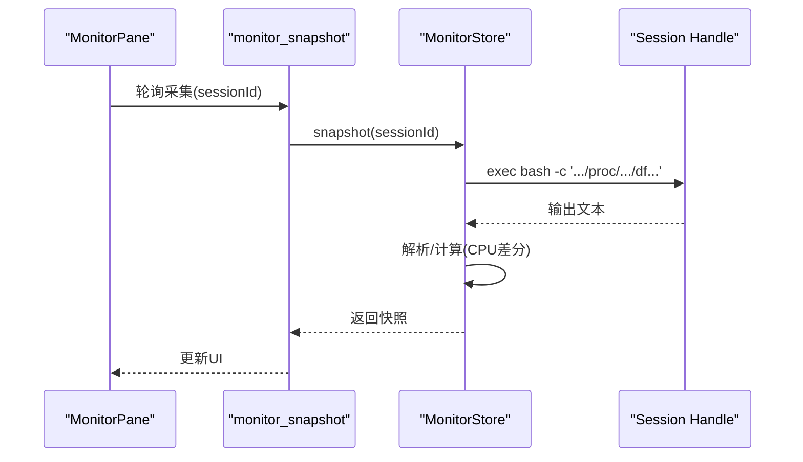
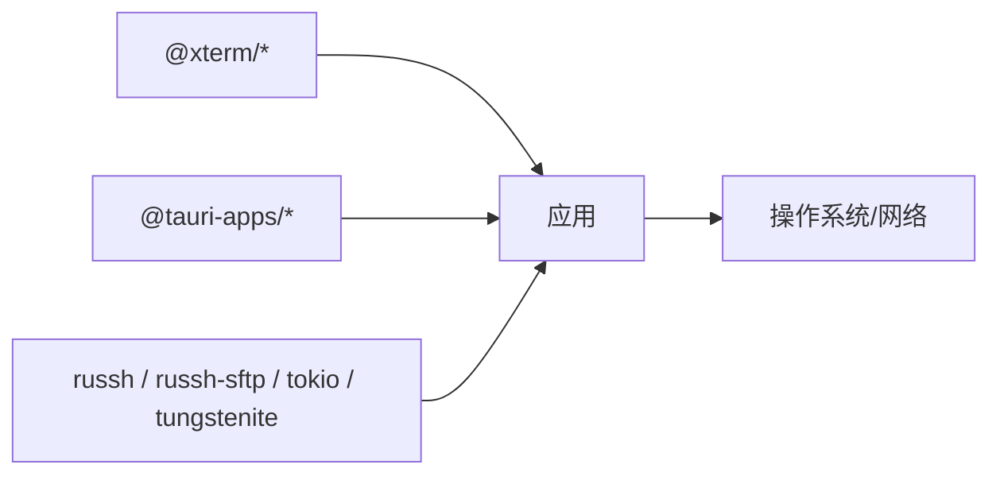

# 性能问题排查

<cite>
**本文引用的文件**
- [README.md](file://README.md)
- [src/main.tsx](file://src/main.tsx)
- [src-tauri/src/lib.rs](file://src-tauri/src/lib.rs)
- [src-tauri/Cargo.toml](file://src-tauri/Cargo.toml)
- [package.json](file://package.json)
- [src-tauri/src/session/manager.rs](file://src-tauri/src/session/manager.rs)
- [src-tauri/src/session/sftp.rs](file://src-tauri/src/session/sftp.rs)
- [src-tauri/src/session/transfer.rs](file://src-tauri/src/session/transfer.rs)
- [src-tauri/src/session/pty.rs](file://src-tauri/src/session/pty.rs)
- [src-tauri/src/session/monitor.rs](file://src-tauri/src/session/monitor.rs)
- [src/components/TerminalPane.tsx](file://src/components/TerminalPane.tsx)
- [src/components/MonitorPane.tsx](file://src/components/MonitorPane.tsx)
- [src/settings/SettingsProvider.tsx](file://src/settings/SettingsProvider.tsx)
</cite>

## 目录
1. [简介](#简介)
2. [项目结构](#项目结构)
3. [核心组件](#核心组件)
4. [架构总览](#架构总览)
5. [详细组件分析](#详细组件分析)
6. [依赖关系分析](#依赖关系分析)
7. [性能考量](#性能考量)
8. [故障排查指南](#故障排查指南)
9. [结论](#结论)
10. [附录](#附录)

## 简介
本指南面向使用 simpl-ssh 的用户与维护者，聚焦以下性能问题的识别与解决：
- 应用响应慢
- 终端渲染卡顿与滚动性能差
- SFTP 传输效率低
- 内存占用高与潜在内存泄漏
- CPU 使用率偏高
- 大数据量传输策略
- 多标签页管理最佳实践
- 性能监控与基准测试

项目采用 Rust + Tauri + xterm.js 架构，后端通过 russh + russh-sftp 提供 SSH/SFTP 能力，前端以 xterm.js v6（WebGL 加速）承载终端渲染，并通过本地 WebSocket 与后端 PTY 通道桥接。

## 项目结构
- 前端（React + TypeScript）：负责 UI、终端渲染、监控面板、设置等。
- 后端（Rust + Tauri）：负责会话管理、SFTP、传输队列、终端桥接、系统监控等。
- 关键性能点：
  - 会话池复用（减少重复握手与认证）
  - 传输队列串行化，避免并发争用
  - 终端使用 xterm.js WebGL 加速
  - 本地 WebSocket 降低跨进程通信开销
  - 系统监控基于 /proc 轻量采集

图表来源
- [src-tauri/src/lib.rs:20-42](file://src-tauri/src/lib.rs#L20-L42)
- [src-tauri/src/session/manager.rs:76-80](file://src-tauri/src/session/manager.rs#L76-L80)
- [src-tauri/src/session/pty.rs:42-45](file://src-tauri/src/session/pty.rs#L42-L45)
- [src-tauri/src/session/sftp.rs:24-28](file://src-tauri/src/session/sftp.rs#L24-L28)
- [src-tauri/src/session/transfer.rs:121-126](file://src-tauri/src/session/transfer.rs#L121-L126)
- [src-tauri/src/session/monitor.rs:41-44](file://src-tauri/src/session/monitor.rs#L41-L44)

章节来源
- [README.md:100-135](file://README.md#L100-L135)
- [src-tauri/src/lib.rs:1-93](file://src-tauri/src/lib.rs#L1-L93)

## 核心组件
- 会话池（SessionManager）：持久连接复用，避免重复握手与认证，支持跳板机链路。
- 终端桥（TerminalBridge）：本地 WebSocket 服务，将 PTY 数据桥接到前端 xterm.js。
- SFTP 管理（SftpManager）：在会话上开启 SFTP 子系统通道并缓存，避免重复认证。
- 传输队列（TransferQueue）：串行执行、可取消、带进度事件，避免并发争用。
- 系统监控（MonitorStore）：基于 /proc 与 df 的轻量采集，计算 CPU 利用率。
- 前端组件：TerminalPane（xterm.js + WebGL）、MonitorPane（轮询展示）、SettingsProvider（设置持久化）。

章节来源
- [src-tauri/src/session/manager.rs:76-145](file://src-tauri/src/session/manager.rs#L76-L145)
- [src-tauri/src/session/pty.rs:42-85](file://src-tauri/src/session/pty.rs#L42-L85)
- [src-tauri/src/session/sftp.rs:24-75](file://src-tauri/src/session/sftp.rs#L24-L75)
- [src-tauri/src/session/transfer.rs:121-203](file://src-tauri/src/session/transfer.rs#L121-L203)
- [src-tauri/src/session/monitor.rs:41-79](file://src-tauri/src/session/monitor.rs#L41-L79)
- [src/components/TerminalPane.tsx:19-199](file://src/components/TerminalPane.tsx#L19-L199)
- [src/components/MonitorPane.tsx:53-181](file://src/components/MonitorPane.tsx#L53-L181)
- [src/settings/SettingsProvider.tsx:37-73](file://src/settings/SettingsProvider.tsx#L37-L73)

## 架构总览
后端通过 Tauri 注入多个状态对象（会话池、SFTP、传输队列、监控等），前端通过 invoke 调用命令并与本地 WebSocket 交互。

图表来源
- [src/components/TerminalPane.tsx:103-135](file://src/components/TerminalPane.tsx#L103-L135)
- [src-tauri/src/session/pty.rs:75-141](file://src-tauri/src/session/pty.rs#L75-L141)
- [src-tauri/src/lib.rs:43-90](file://src-tauri/src/lib.rs#L43-L90)

## 详细组件分析

### 终端渲染性能优化
- 渲染加速：启用 xterm.js WebGL 插件，优先使用 GPU 加速；若不可用则回退 Canvas。
- 尺寸适配：使用 FitAddon 自适应容器尺寸，配合防抖发送 resize 消息，避免频繁窗口变化导致的重绘风暴。
- 输入输出：通过本地 WebSocket 与后端桥接，减少跨进程通信延迟。
- 设置联动：字体、字号、行高、光标样式等设置变更时仅触发必要重绘。

图表来源
- [src/components/TerminalPane.tsx:38-78](file://src/components/TerminalPane.tsx#L38-L78)
- [src/components/TerminalPane.tsx:103-135](file://src/components/TerminalPane.tsx#L103-L135)

章节来源
- [src/components/TerminalPane.tsx:19-199](file://src/components/TerminalPane.tsx#L19-L199)

### SFTP 传输效率提升
- 串行队列：传输任务串行执行，避免单连接上并发争用导致的吞吐下降。
- 可取消：每个任务内置取消标志，支持中途取消并清理半成品文件。
- 进度事件：每 64KB 片段推送一次进度，前端可实时更新 UI。
- 目录递归：上传/下载均支持目录递归，自动创建远程目录并保持相对路径。

图表来源
- [src-tauri/src/session/transfer.rs:128-203](file://src-tauri/src/session/transfer.rs#L128-L203)
- [src-tauri/src/session/transfer.rs:206-284](file://src-tauri/src/session/transfer.rs#L206-L284)
- [src-tauri/src/session/transfer.rs:448-482](file://src-tauri/src/session/transfer.rs#L448-L482)

章节来源
- [src-tauri/src/session/transfer.rs:1-483](file://src-tauri/src/session/transfer.rs#L1-L483)
- [src-tauri/src/session/sftp.rs:24-75](file://src-tauri/src/session/sftp.rs#L24-L75)

### 内存泄漏检测与 CPU 使用率优化
- 会话池：持久连接复用，避免重复分配与销毁带来的峰值内存波动。
- 监控面板：基于 /proc 与 df 的轻量采集，计算 CPU 利用率（两次采样差分），避免额外依赖。
- 设置持久化：前端设置变更写入 localStorage，避免重复解析与重建。

图表来源
- [src/components/MonitorPane.tsx:62-88](file://src/components/MonitorPane.tsx#L62-L88)
- [src-tauri/src/session/monitor.rs:46-79](file://src-tauri/src/session/monitor.rs#L46-L79)
- [src-tauri/src/session/monitor.rs:119-197](file://src-tauri/src/session/monitor.rs#L119-L197)

章节来源
- [src-tauri/src/session/monitor.rs:1-231](file://src-tauri/src/session/monitor.rs#L1-L231)
- [src/components/MonitorPane.tsx:1-181](file://src/components/MonitorPane.tsx#L1-L181)
- [src/settings/SettingsProvider.tsx:25-73](file://src/settings/SettingsProvider.tsx#L25-L73)

### 大数据量传输策略
- 串行队列：避免多任务并发导致的带宽竞争与拥塞。
- 分片传输：固定缓冲区大小（64KB）分片，平衡内存占用与吞吐。
- 取消与清理：取消时尽力清理半成品文件，减少磁盘碎片与后续失败概率。
- 目录递归：自动创建远程目录，保持层级结构，减少多次往返。

章节来源
- [src-tauri/src/session/transfer.rs:296-482](file://src-tauri/src/session/transfer.rs#L296-L482)

### 终端滚动性能调优
- WebGL 加速：优先启用 WebGL 插件，显著降低大量输出时的 CPU/GPU 压力。
- 防抖 resize：避免拖拽分隔条时的高频 resize 导致的重排。
- 仅在可见容器中渲染：隐藏时忽略尺寸变化，减少无效计算。
- 字体与行高：合理设置字体与行高，避免过大的字符尺寸导致的像素填充压力。

章节来源
- [src/components/TerminalPane.tsx:38-78](file://src/components/TerminalPane.tsx#L38-L78)
- [src/components/TerminalPane.tsx:151-178](file://src/components/TerminalPane.tsx#L151-L178)

### 多标签页管理最佳实践
- 会话复用：多个终端标签页共享同一会话，避免重复认证与握手。
- 会话池：后端维护会话池，按需创建与清理，减少资源浪费。
- 断开策略：断开会话时同时断开跳板机句柄，确保资源回收。

章节来源
- [src-tauri/src/session/manager.rs:76-145](file://src-tauri/src/session/manager.rs#L76-L145)

## 依赖关系分析
- 前端依赖：xterm.js v6（WebGL）、@xterm/addon-fit、@xterm/addon-search、@xterm/addon-webgl。
- 后端依赖：russh（SSH）、russh-sftp（SFTP）、tokio（异步）、tokio-tungstenite（WebSocket）、tracing（日志）。
- Tauri 插件：opener、dialog、process、updater。

图表来源
- [package.json:28-43](file://package.json#L28-L43)
- [src-tauri/Cargo.toml:22-49](file://src-tauri/Cargo.toml#L22-L49)

章节来源
- [package.json:1-53](file://package.json#L1-L53)
- [src-tauri/Cargo.toml:1-50](file://src-tauri/Cargo.toml#L1-L50)

## 性能考量
- 连接阶段超时与进度反馈：TCP 建连、SSH 握手、认证均有超时与阶段进度事件，有助于定位慢连接瓶颈。
- 本地 WebSocket：终端数据通过 127.0.0.1 本地 WS 传输，避免跨进程 IPC 延迟。
- 传输分片：64KB 分片兼顾吞吐与内存占用，适合大多数网络环境。
- 监控频率：监控面板默认 2.5 秒轮询一次，可根据场景调整。

章节来源
- [src-tauri/src/session/manager.rs:24-31](file://src-tauri/src/session/manager.rs#L24-L31)
- [src-tauri/src/session/pty.rs:48-73](file://src-tauri/src/session/pty.rs#L48-L73)
- [src/components/MonitorPane.tsx:82-88](file://src/components/MonitorPane.tsx#L82-L88)

## 故障排查指南

### 应用响应慢
- 检查连接阶段：关注“解析”“握手”“认证”阶段耗时，定位网络或服务端问题。
- 终端卡顿：确认是否启用 WebGL；适当降低字体/字号；避免过大的行高。
- 监控面板：确认轮询间隔是否合理，避免过于频繁导致 CPU 占用上升。

章节来源
- [src-tauri/src/session/manager.rs:31-48](file://src-tauri/src/session/manager.rs#L31-L48)
- [src/components/TerminalPane.tsx:52-56](file://src/components/TerminalPane.tsx#L52-L56)
- [src/components/MonitorPane.tsx:82-88](file://src/components/MonitorPane.tsx#L82-L88)

### 终端渲染性能问题
- 启用 WebGL：若抛出异常则回退 Canvas，但性能较差。
- 防抖 resize：确认容器尺寸变化是否频繁，避免拖拽分隔条时的高频 resize。
- 字体设置：合理设置字体与行高，避免过大字符尺寸。

章节来源
- [src/components/TerminalPane.tsx:52-56](file://src/components/TerminalPane.tsx#L52-L56)
- [src/components/TerminalPane.tsx:70-78](file://src/components/TerminalPane.tsx#L70-L78)

### SFTP 传输速度慢
- 检查队列状态：确认是否存在长时间排队任务。
- 分片与取消：观察进度事件是否正常推进；如需可取消任务。
- 网络环境：在高延迟/丢包环境下，适当增大缓冲区或减少并发。

章节来源
- [src-tauri/src/session/transfer.rs:128-203](file://src-tauri/src/session/transfer.rs#L128-L203)
- [src-tauri/src/session/transfer.rs:448-482](file://src-tauri/src/session/transfer.rs#L448-L482)

### 内存占用高与泄漏检测
- 会话池：确认会话是否正确断开，避免残留句柄导致内存增长。
- 监控：使用系统监控面板观察内存使用趋势，结合日志定位异常。
- 设置持久化：避免重复解析设置导致的内存抖动。

章节来源
- [src-tauri/src/session/manager.rs:234-252](file://src-tauri/src/session/manager.rs#L234-L252)
- [src-tauri/src/session/monitor.rs:46-79](file://src-tauri/src/session/monitor.rs#L46-L79)
- [src/settings/SettingsProvider.tsx:37-73](file://src/settings/SettingsProvider.tsx#L37-L73)

### CPU 使用率偏高
- 监控面板：确认 CPU 百分比是否真实升高，避免 UI 轮询导致的误判。
- 终端：检查是否启用了 WebGL；过高的字体/行高会增加绘制压力。
- 传输：确认是否有大量小文件传输导致频繁系统调用。

章节来源
- [src-tauri/src/session/monitor.rs:199-230](file://src-tauri/src/session/monitor.rs#L199-L230)
- [src/components/TerminalPane.tsx:52-56](file://src/components/TerminalPane.tsx#L52-L56)

### 大数据量传输策略
- 串行队列：保持串行，避免并发争用。
- 分片大小：默认 64KB，可根据网络质量调整。
- 取消策略：遇到异常及时取消，减少无效工作。

章节来源
- [src-tauri/src/session/transfer.rs:296-482](file://src-tauri/src/session/transfer.rs#L296-L482)

### 多标签页管理最佳实践
- 共享会话：多个终端标签页共享同一会话，避免重复认证。
- 断开顺序：断开会话时确保跳板机句柄也断开，防止资源泄露。

章节来源
- [src-tauri/src/session/manager.rs:234-252](file://src-tauri/src/session/manager.rs#L234-L252)

### 性能监控工具与基准测试
- 性能监控：
  - 使用系统监控面板查看 CPU、内存、负载与磁盘使用情况。
  - 轮询间隔建议 2.5 秒，避免过度采集。
- 基准测试：
  - 传输：准备固定大小的文件集合，测量串行上传/下载总耗时与平均速率。
  - 终端：在高输出场景（如持续编译/日志输出）下观察帧率与 CPU 占用。
  - 连接：分别测试直连与跳板机场景下的握手与认证耗时。

章节来源
- [src/components/MonitorPane.tsx:62-88](file://src/components/MonitorPane.tsx#L62-L88)
- [src-tauri/src/session/monitor.rs:46-79](file://src-tauri/src/session/monitor.rs#L46-L79)

## 结论
通过会话池复用、串行传输队列、xterm.js WebGL 加速与本地 WebSocket 桥接，simpl-ssh 在保证功能完整性的同时，提供了良好的性能基础。排查时应重点关注连接阶段、终端渲染参数、传输队列与系统监控数据，结合前端设置与后端日志进行定位与优化。

## 附录
- 前端入口禁用 React.StrictMode，避免终端生命周期不稳定导致的副作用。
- 后端通过 tracing 初始化日志，便于性能与问题追踪。

章节来源
- [src/main.tsx:10-12](file://src/main.tsx#L10-L12)
- [src-tauri/src/lib.rs:16-18](file://src-tauri/src/lib.rs#L16-L18)