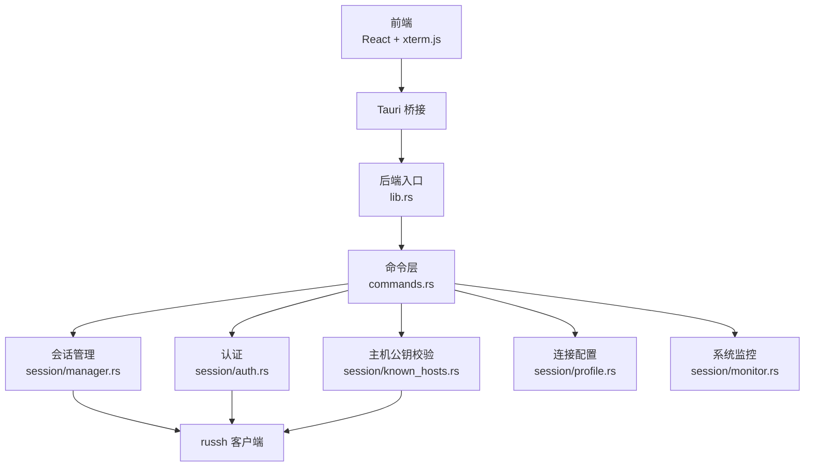
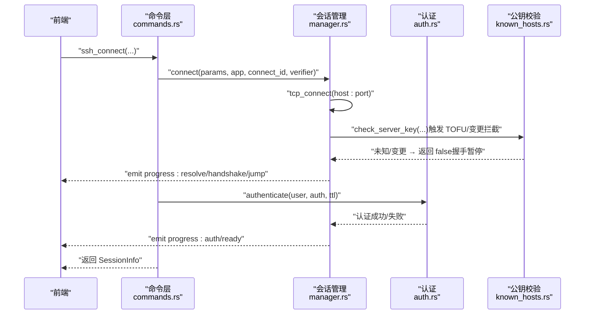
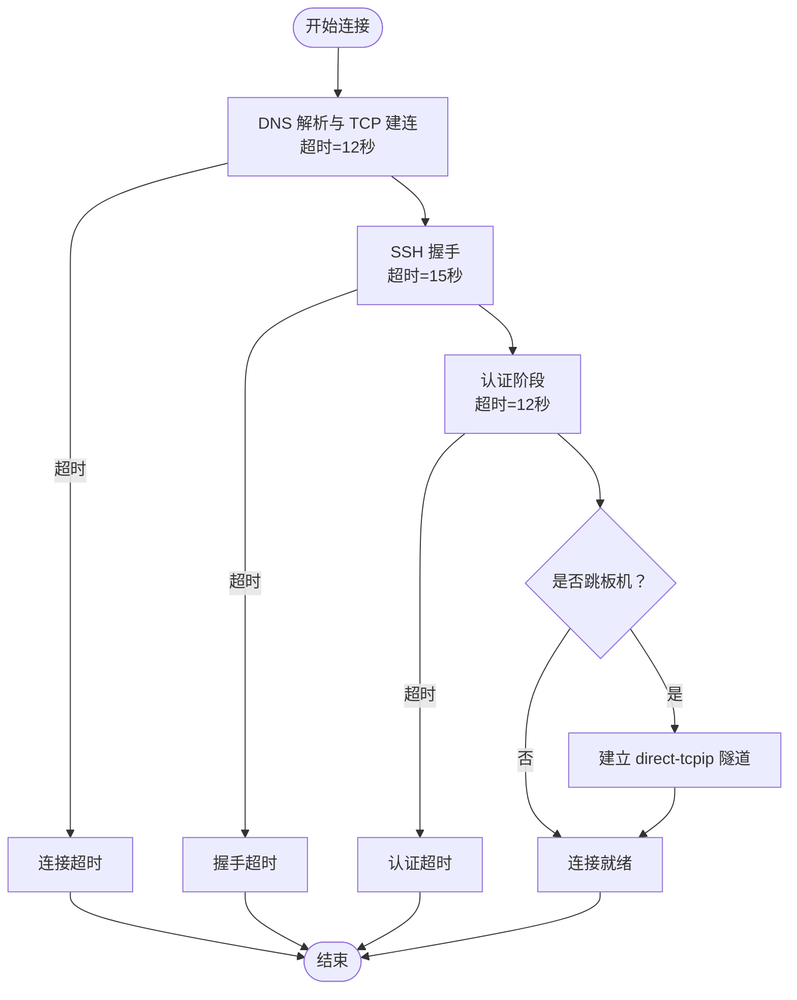
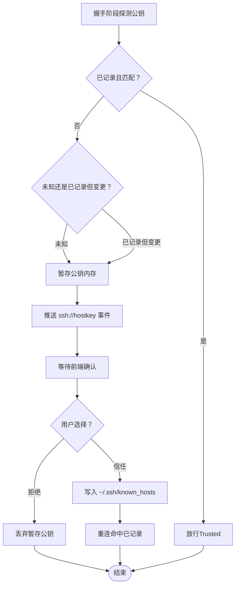
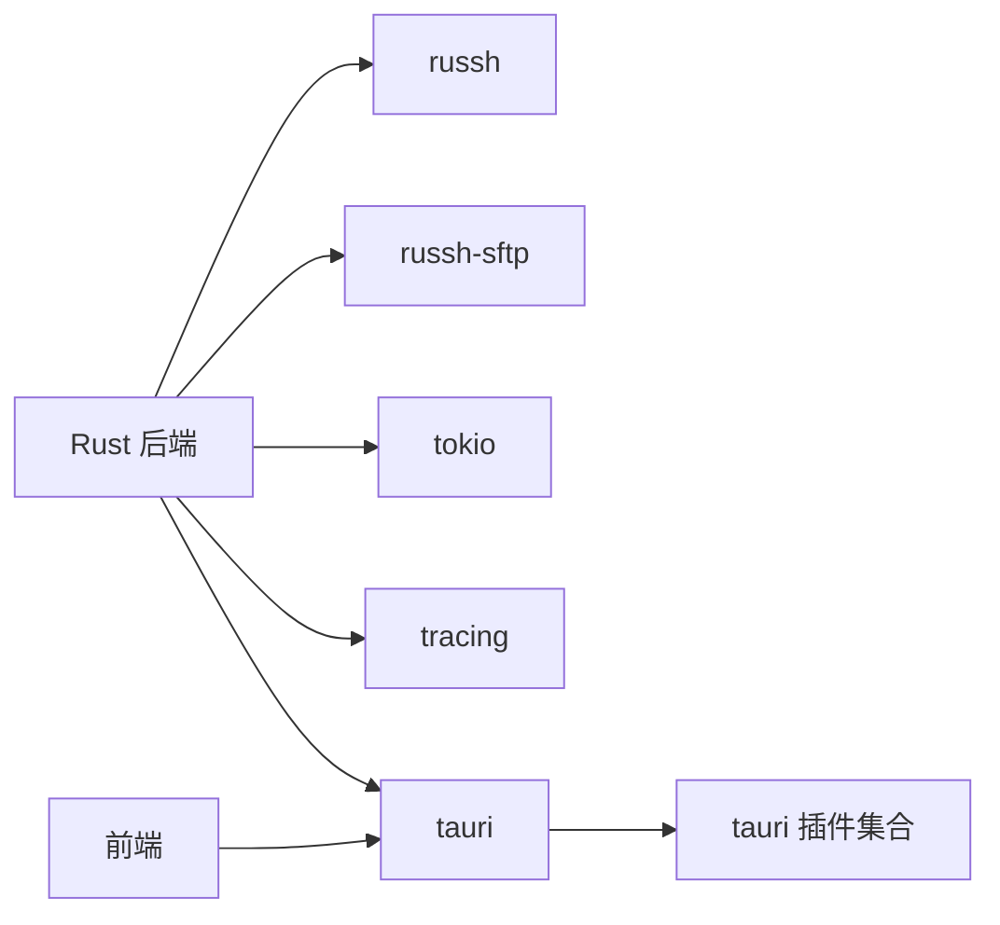

# 故障排除

<cite>
**本文档引用的文件**
- [README.md](file://README.md)
- [Cargo.toml](file://src-tauri/Cargo.toml)
- [lib.rs](file://src-tauri/src/lib.rs)
- [main.rs](file://src-tauri/src/main.rs)
- [tauri.conf.json](file://src-tauri/tauri.conf.json)
- [commands.rs](file://src-tauri/src/commands.rs)
- [manager.rs](file://src-tauri/src/session/manager.rs)
- [auth.rs](file://src-tauri/src/session/auth.rs)
- [known_hosts.rs](file://src-tauri/src/session/known_hosts.rs)
- [profile.rs](file://src-tauri/src/session/profile.rs)
- [monitor.rs](file://src-tauri/src/session/monitor.rs)
- [ssh.rs](file://src-tauri/src/session/ssh.rs)
</cite>

## 目录
1. [简介](#简介)
2. [项目结构](#项目结构)
3. [核心组件](#核心组件)
4. [架构总览](#架构总览)
5. [详细组件分析](#详细组件分析)
6. [依赖关系分析](#依赖关系分析)
7. [性能考虑](#性能考虑)
8. [故障排除指南](#故障排除指南)
9. [结论](#结论)
10. [附录](#附录)

## 简介
本指南面向使用 simpl-ssh 的用户与维护者，聚焦于连接问题诊断、性能优化、兼容性处理、错误日志分析与系统监控。文档基于后端 Rust 代码与前端集成的实际实现，提供可操作的排查步骤、常见错误含义与修复建议，并给出跨平台（macOS、Windows、Linux）的差异化处理要点。

## 项目结构
简化版项目采用“前端 React + Tauri 桥接 + Rust 后端”的分层设计：
- 前端负责 UI、对话框、终端与文件面板，通过 Tauri 命令与后端通信。
- 后端通过 russh 实现 SSH 协议，统一管理会话、认证、主机公钥校验、端口转发、SFTP 传输与系统监控。
- 日志通过 tracing 输出，结合 env-filter 控制级别。

图表来源
- [lib.rs:14-92](file://src-tauri/src/lib.rs#L14-L92)
- [commands.rs:23-766](file://src-tauri/src/commands.rs#L23-L766)
- [manager.rs:1-317](file://src-tauri/src/session/manager.rs#L1-L317)
- [auth.rs:1-82](file://src-tauri/src/session/auth.rs#L1-L82)
- [known_hosts.rs:1-197](file://src-tauri/src/session/known_hosts.rs#L1-L197)
- [profile.rs:1-419](file://src-tauri/src/session/profile.rs#L1-L419)
- [monitor.rs:1-231](file://src-tauri/src/session/monitor.rs#L1-L231)

章节来源
- [lib.rs:14-92](file://src-tauri/src/lib.rs#L14-L92)
- [Cargo.toml:22-49](file://src-tauri/Cargo.toml#L22-L49)
- [tauri.conf.json:1-54](file://src-tauri/tauri.conf.json#L1-L54)

## 核心组件
- 会话管理：负责 TCP 连接、SSH 握手、认证、进度事件推送、跳板机隧道、会话生命周期管理。
- 认证模块：支持密码与私钥认证，内置超时控制与错误包装。
- 主机公钥校验：与 OpenSSH 兼容的 known_hosts 校验，支持 TOFU 与公钥变更拦截。
- 连接配置：保存连接元数据，凭据通过 OS 钥匙串与内存加密缓存保护。
- 系统监控：在现有会话上执行轻量采集脚本，返回 CPU、内存、负载与磁盘使用。
- 命令层：将前端交互映射为后端操作，统一错误返回与状态管理。

章节来源
- [manager.rs:24-48](file://src-tauri/src/session/manager.rs#L24-L48)
- [auth.rs:44-81](file://src-tauri/src/session/auth.rs#L44-L81)
- [known_hosts.rs:25-84](file://src-tauri/src/session/known_hosts.rs#L25-L84)
- [profile.rs:67-72](file://src-tauri/src/session/profile.rs#L67-L72)
- [monitor.rs:19-31](file://src-tauri/src/session/monitor.rs#L19-L31)
- [commands.rs:23-766](file://src-tauri/src/commands.rs#L23-L766)

## 架构总览
后端初始化时启动本地终端桥接服务与传输队列工作线程，并注册所有 Tauri 命令。命令层根据业务场景调用会话管理、认证、公钥校验、配置与监控模块。

图表来源
- [commands.rs:42-72](file://src-tauri/src/commands.rs#L42-L72)
- [manager.rs:82-145](file://src-tauri/src/session/manager.rs#L82-L145)
- [manager.rs:255-316](file://src-tauri/src/session/manager.rs#L255-L316)
- [auth.rs:44-81](file://src-tauri/src/session/auth.rs#L44-L81)
- [known_hosts.rs:118-160](file://src-tauri/src/session/known_hosts.rs#L118-L160)

## 详细组件分析

### 会话连接流程与超时
- TCP 建连超时：12 秒，解析主机名与建立 TCP 连接。
- SSH 握手超时：15 秒，涵盖版本协商与密钥交换。
- 认证超时：12 秒，密码或私钥认证阶段。
- 连接进度事件：resolve → handshake → auth → jump（可选）→ ready。

图表来源
- [manager.rs:24-29](file://src-tauri/src/session/manager.rs#L24-L29)
- [manager.rs:255-273](file://src-tauri/src/session/manager.rs#L255-L273)
- [manager.rs:275-316](file://src-tauri/src/session/manager.rs#L275-L316)

章节来源
- [manager.rs:24-48](file://src-tauri/src/session/manager.rs#L24-L48)
- [manager.rs:255-316](file://src-tauri/src/session/manager.rs#L255-L316)

### 主机公钥校验与 TOFU
- 已记录且匹配：直接放行。
- 未知（首次连接）：触发 TOFU，前端弹窗显示算法与指纹，用户确认后落盘。
- 已记录但公钥变更：拦截并警示，需用户显式确认后替换。
- 校验流程：russh 在握手期间调用 check_server_key，若非 Trusted 则返回 false 并推送 ssh://hostkey 事件。

图表来源
- [known_hosts.rs:68-84](file://src-tauri/src/session/known_hosts.rs#L68-L84)
- [known_hosts.rs:97-135](file://src-tauri/src/session/known_hosts.rs#L97-L135)
- [mod.rs:118-160](file://src-tauri/src/session/mod.rs#L118-L160)

章节来源
- [known_hosts.rs:1-197](file://src-tauri/src/session/known_hosts.rs#L1-L197)
- [mod.rs:52-113](file://src-tauri/src/session/mod.rs#L52-L113)

### 认证失败与私钥相关问题
- 密码认证：超时或失败会断开连接并返回明确错误。
- 私钥认证：读取私钥失败、RSA 哈希协商失败、认证未通过均会报错。
- 建议：确认私钥路径、权限与 passphrase；优先使用 openssh 格式与受支持算法。

章节来源
- [auth.rs:44-81](file://src-tauri/src/session/auth.rs#L44-L81)

### 系统监控与资源占用
- 通过在会话上执行 bash 脚本采集 /proc 数据，计算 CPU 利用率、内存与磁盘使用。
- 非 Linux 主机会返回友好错误，避免阻塞。

章节来源
- [monitor.rs:46-79](file://src-tauri/src/session/monitor.rs#L46-L79)
- [monitor.rs:119-231](file://src-tauri/src/session/monitor.rs#L119-L231)

## 依赖关系分析
- 后端依赖 russh 与 russh-sftp 实现 SSH 与 SFTP；tokio 提供异步运行时；tracing 用于日志。
- Tauri 插件包括 opener、dialog、process、updater 等，增强系统集成能力。
- 前端通过 Tauri 命令调用后端能力，命令层集中处理参数解析、错误转换与状态管理。

图表来源
- [Cargo.toml:22-49](file://src-tauri/Cargo.toml#L22-L49)
- [lib.rs:20-24](file://src-tauri/src/lib.rs#L20-L24)

章节来源
- [Cargo.toml:1-50](file://src-tauri/Cargo.toml#L1-L50)
- [lib.rs:12-42](file://src-tauri/src/lib.rs#L12-L42)

## 性能考虑
- 会话复用：终端、SFTP、端口转发共享同一 SSH Handle，减少重复握手与认证成本。
- 传输队列：SFTP 串行传输、可取消，避免阻塞 UI 与文件浏览。
- 连接超时：TCP/握手/认证分别设置合理上限，避免长时间卡死。
- 监控开销：仅在需要时执行远程采集脚本，避免频繁调用。

章节来源
- [manager.rs:1-6](file://src-tauri/src/session/manager.rs#L1-L6)
- [commands.rs:362-431](file://src-tauri/src/commands.rs#L362-L431)
- [monitor.rs:46-79](file://src-tauri/src/session/monitor.rs#L46-L79)

## 故障排除指南

### 一、连接问题诊断
- 症状：连接中…长时间无响应
  - 可能原因：网络不可达、DNS 解析失败、服务器拒绝 TCP 连接。
  - 处理建议：检查主机名/端口、防火墙、代理；缩短重试间隔；观察 ssh://progress 事件。
  - 参考实现：TCP 建连超时 12 秒，握手超时 15 秒，认证超时 12 秒。
  
  章节来源
  - [manager.rs:24-29](file://src-tauri/src/session/manager.rs#L24-L29)
  - [manager.rs:255-273](file://src-tauri/src/session/manager.rs#L255-L273)

- 症状：握手超时或失败
  - 可能原因：服务器加密套件不匹配、网络延迟高、服务器负载过高。
  - 处理建议：降低并发、检查服务器日志、尝试不同加密算法；确认服务器允许 SSH 访问。
  
  章节来源
  - [manager.rs:275-316](file://src-tauri/src/session/manager.rs#L275-L316)

- 症状：认证失败
  - 可能原因：用户名/密码错误、私钥路径或权限不正确、私钥 passphrase 错误。
  - 处理建议：使用密码认证时确认凭据；私钥认证时检查路径、权限与 passphrase；查看命令层错误信息。
  
  章节来源
  - [auth.rs:44-81](file://src-tauri/src/session/auth.rs#L44-L81)
  - [commands.rs:698-722](file://src-tauri/src/commands.rs#L698-L722)

- 症状：主机公钥验证失败（未知或已变更）
  - 可能原因：首次连接、公钥变更、known_hosts 文件损坏。
  - 处理建议：在前端确认指纹；若为变更，确认是否被中间人攻击；必要时删除对应条目后重新 TOFU。
  
  章节来源
  - [known_hosts.rs:68-84](file://src-tauri/src/session/known_hosts.rs#L68-L84)
  - [mod.rs:118-160](file://src-tauri/src/session/mod.rs#L118-L160)

- 症状：跳板机连接失败
  - 可能原因：跳板机不可达、跳板机认证失败、direct-tcpip 隧道建立失败。
  - 处理建议：先单独测试跳板机连通性与认证；确认跳板机配置未嵌套；查看 jump 阶段进度事件。
  
  章节来源
  - [manager.rs:147-217](file://src-tauri/src/session/manager.rs#L147-L217)

### 二、性能优化建议
- 使用持久会话复用：终端、SFTP、转发共享同一连接，减少握手与认证次数。
- 合理设置传输队列：串行传输、可取消，避免大量并发导致拥塞。
- 监控频率控制：按需采集系统指标，避免频繁执行远程脚本。
- 超时参数：保持默认超时阈值，必要时在网络状况较差时适当放宽。

章节来源
- [manager.rs:1-6](file://src-tauri/src/session/manager.rs#L1-L6)
- [commands.rs:362-431](file://src-tauri/src/commands.rs#L362-L431)
- [monitor.rs:46-79](file://src-tauri/src/session/monitor.rs#L46-L79)

### 三、兼容性问题处理
- macOS 安装与公证
  - 若出现“已损坏，无法打开”，执行相应清理命令后重试安装。
  - 发布流水线已接入 Developer ID 签名 + Apple 公证，建议使用官方 Releases。
  
  章节来源
  - [README.md:58-75](file://README.md#L58-L75)

- Linux 系统依赖
  - 首次构建需安装 WebKit、SSL、AppIndicator 等系统依赖。
  
  章节来源
  - [README.md:93-98](file://README.md#L93-L98)

- Windows 平台
  - 使用系统 WebView 渲染前端，遵循 Tauri 默认配置；如遇权限问题，检查系统策略与杀软拦截。
  
  章节来源
  - [tauri.conf.json:12-23](file://src-tauri/tauri.conf.json#L12-L23)

### 四、错误日志分析与调试
- 日志输出
  - 后端初始化时启用 fmt 与 env-filter，可通过环境变量控制日志级别。
  - 常见错误路径：会话连接、认证、公钥校验、SFTP 读写、传输队列、监控采集。
  
  章节来源
  - [lib.rs:16-18](file://src-tauri/src/lib.rs#L16-L18)
  - [commands.rs:25-38](file://src-tauri/src/commands.rs#L25-L38)
  - [auth.rs:50-81](file://src-tauri/src/session/auth.rs#L50-L81)
  - [monitor.rs:82-117](file://src-tauri/src/session/monitor.rs#L82-L117)

- 前端事件
  - ssh://progress：连接阶段进度（resolve、handshake、auth、jump、ready）。
  - ssh://hostkey：主机公钥事件（unknown/changed），携带算法与指纹。
  
  章节来源
  - [manager.rs:31-48](file://src-tauri/src/session/manager.rs#L31-L48)
  - [known_hosts.rs:47-61](file://src-tauri/src/session/known_hosts.rs#L47-L61)

- 调试工具
  - 使用命令层提供的 ssh_exec 一次性执行命令进行链路验证。
  - 通过 monitor_snapshot 采集远程指标辅助定位资源瓶颈。
  
  章节来源
  - [ssh.rs:13-64](file://src-tauri/src/session/ssh.rs#L13-L64)
  - [monitor.rs:46-79](file://src-tauri/src/session/monitor.rs#L46-L79)

### 五、不同操作系统下的特定问题
- macOS
  - 钥匙串授权弹窗：使用内存加密缓存减少弹窗频率；若仍频繁弹窗，检查系统钥匙串权限。
  - 安装问题：若 Gatekeeper 报错，按说明执行清理命令后重试。
  
  章节来源
  - [profile.rs:6-8](file://src-tauri/src/session/profile.rs#L6-L8)
  - [README.md:58-63](file://README.md#L58-L63)

- Linux
  - 首次构建需安装系统依赖；X11 转发需本机存在 DISPLAY。
  - 监控脚本依赖 /proc 文件系统，非 Linux 主机将返回友好错误。
  
  章节来源
  - [README.md:93-98](file://README.md#L93-L98)
  - [commands.rs:127-136](file://src-tauri/src/commands.rs#L127-L136)
  - [monitor.rs:46-79](file://src-tauri/src/session/monitor.rs#L46-L79)

- Windows
  - 使用系统 WebView 渲染；如遇权限问题，检查杀软与系统策略。
  
  章节来源
  - [tauri.conf.json:12-23](file://src-tauri/tauri.conf.json#L12-L23)

### 六、问题报告标准格式
为便于快速定位问题，请在提交 Issue 时包含以下信息：
- 基本信息
  - 系统版本与架构（如 macOS 14.0 arm64、Windows 11 x64、Ubuntu 22.04 amd64）
  - 应用版本（可在 About 中查看）
  - 是否使用官方 Releases 包
- 网络与环境
  - 目标服务器类型与 SSH 服务端版本（如 OpenSSH）
  - 是否使用跳板机、代理或企业防火墙
  - 是否启用 X11 转发
- 复现步骤
  - 从点击“连接”到出现错误的完整操作序列
  - 是否可复现（必现/偶发）
- 日志与事件
  - ssh://progress 事件序列（从 resolve 到最终阶段）
  - ssh://hostkey 事件（unknown/changed 时的算法与指纹）
  - 后端日志（含时间戳与关键错误信息）
- 附加信息
  - 已尝试的修复措施
  - 曾用过的替代方案（如更换认证方式）

## 结论
本指南基于后端实现细节，提供了从连接流程、认证机制、公钥校验到系统监控的全链路故障排除方法。建议优先通过 ssh://progress 与 ssh://hostkey 事件定位阶段与原因，结合日志与命令层错误信息快速收敛问题范围。对于跨平台差异，重点检查系统依赖、安装签名与授权弹窗行为。

## 附录
- 常用命令与职责
  - ssh_connect：建立持久会话，返回 SessionInfo
  - ssh_exec：一次性执行命令（早期 demo）
  - hostkey_trust/hostkey_reject：公钥确认与拒绝
  - monitor_snapshot：采集远程系统指标
  - sftp_*：文件读写与目录操作
  - forward_*：端口转发管理

章节来源
- [commands.rs:25-38](file://src-tauri/src/commands.rs#L25-L38)
- [commands.rs:42-72](file://src-tauri/src/commands.rs#L42-L72)
- [commands.rs:772-799](file://src-tauri/src/commands.rs#L772-L799)
- [commands.rs:680-688](file://src-tauri/src/commands.rs#L680-L688)
- [commands.rs:190-200](file://src-tauri/src/commands.rs#L190-L200)