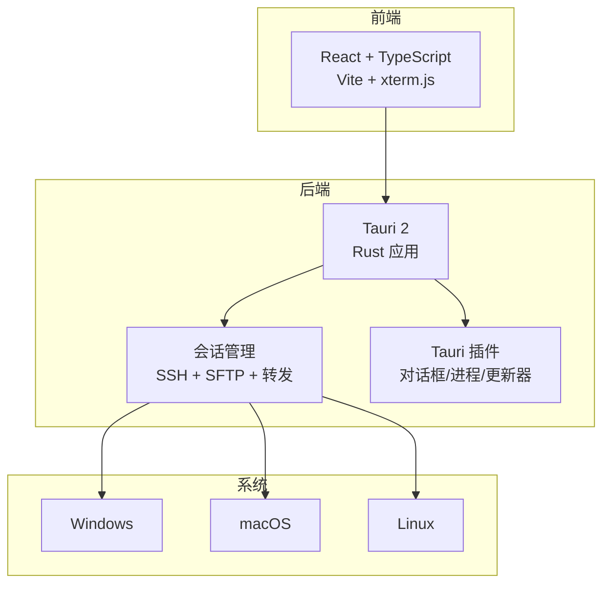
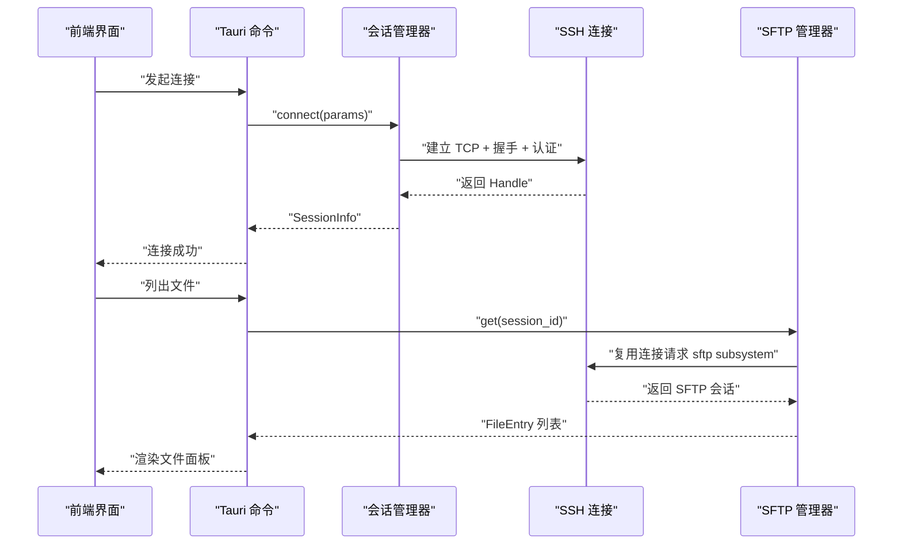
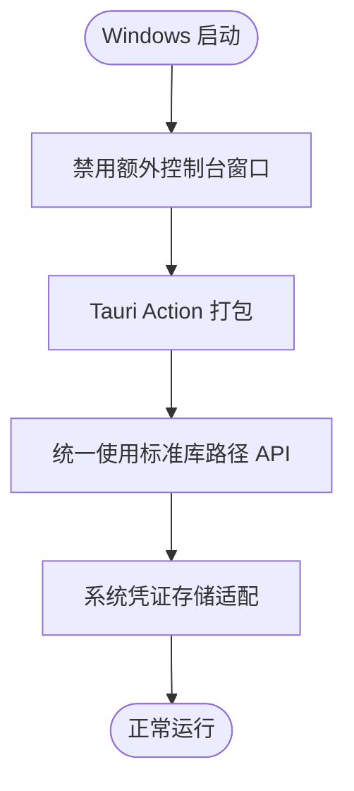
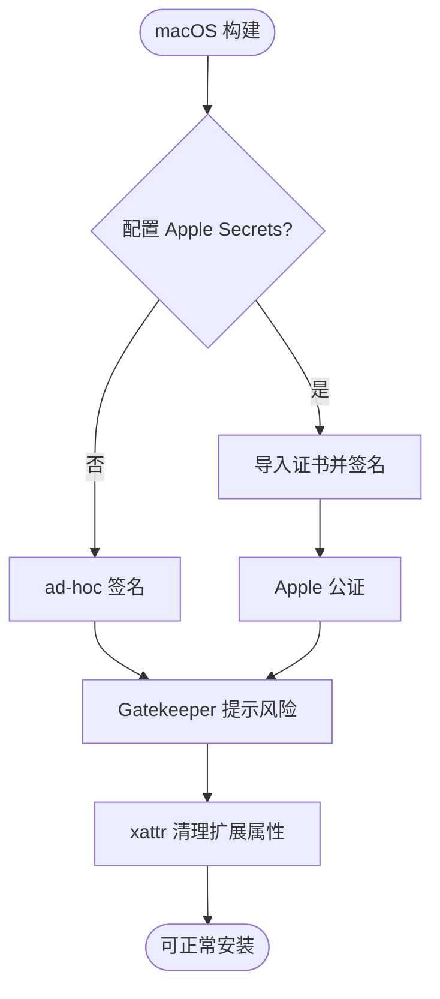
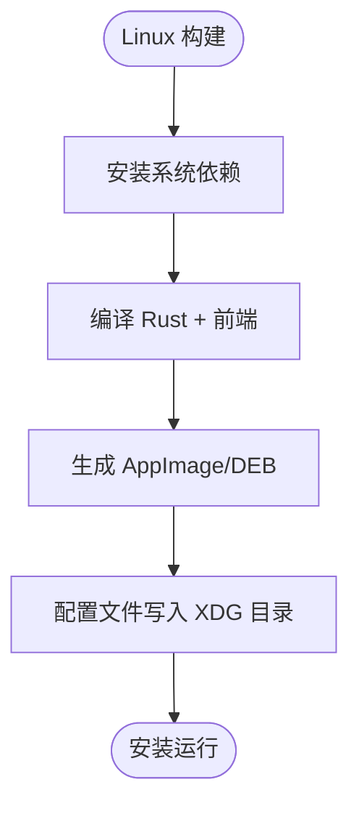
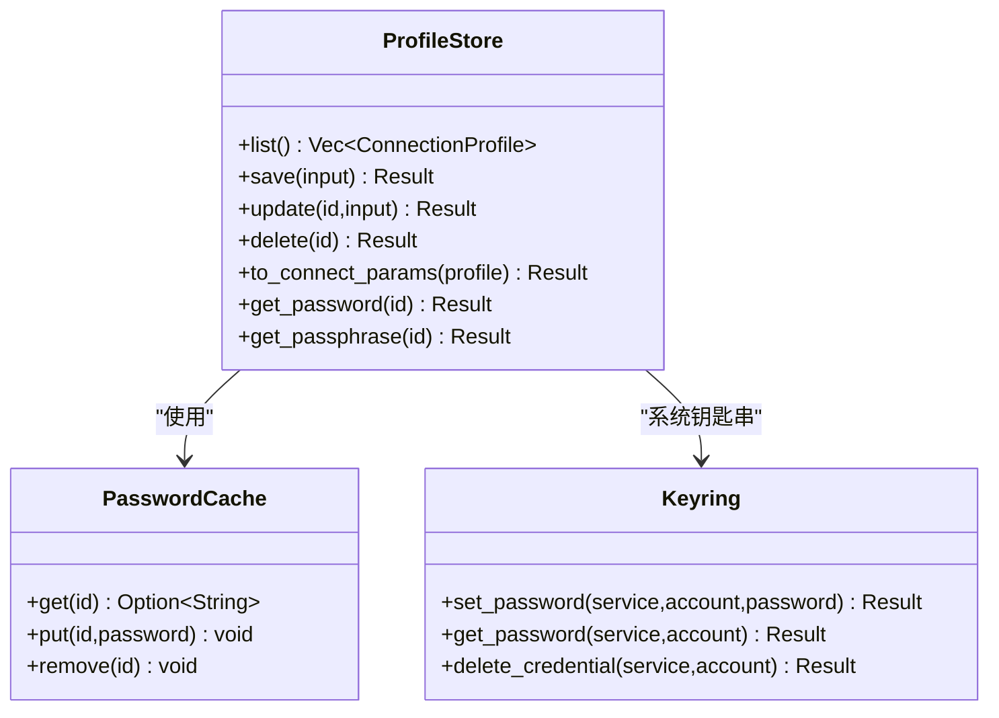
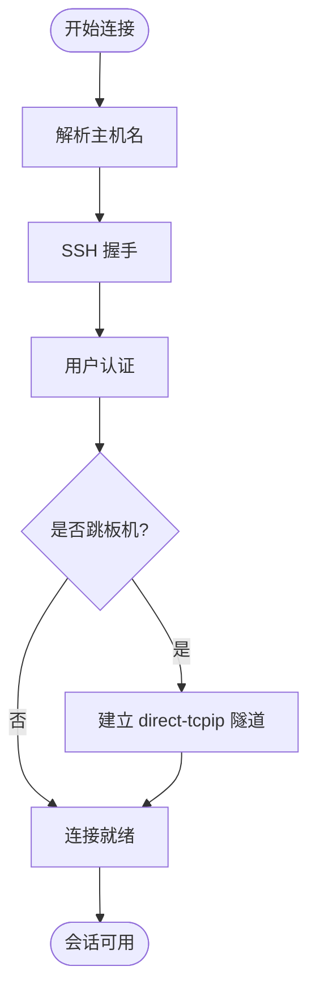
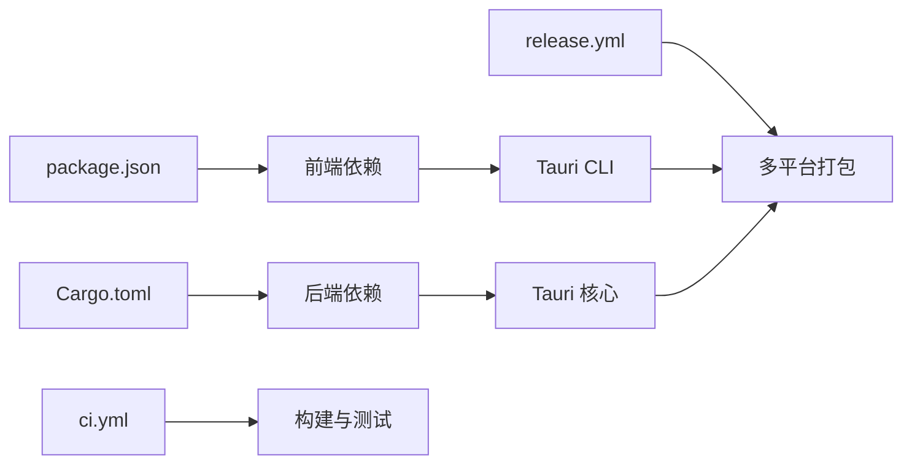

# 系统兼容性问题

<cite>
**本文档引用的文件**
- [README.md](file://README.md)
- [package.json](file://package.json)
- [Cargo.toml](file://src-tauri/Cargo.toml)
- [tauri.conf.json](file://src-tauri/tauri.conf.json)
- [ci.yml](file://.github/workflows/ci.yml)
- [release.yml](file://.github/workflows/release.yml)
- [lib.rs](file://src-tauri/src/lib.rs)
- [main.rs](file://src-tauri/src/main.rs)
- [manager.rs](file://src-tauri/src/session/manager.rs)
- [profile.rs](file://src-tauri/src/session/profile.rs)
- [sftp.rs](file://src-tauri/src/session/sftp.rs)
- [ssh.rs](file://src-tauri/src/session/ssh.rs)
- [mod.rs](file://src-tauri/src/session/mod.rs)
- [CONTRIBUTING.md](file://CONTRIBUTING.md)
</cite>

## 目录
1. [简介](#简介)
2. [项目结构](#项目结构)
3. [核心组件](#核心组件)
4. [架构概览](#架构概览)
5. [详细组件分析](#详细组件分析)
6. [依赖关系分析](#依赖关系分析)
7. [性能考虑](#性能考虑)
8. [故障排除指南](#故障排除指南)
9. [结论](#结论)
10. [附录](#附录)

## 简介
本指南专注于简化 SSH 客户端在不同操作系统和硬件环境下的系统兼容性问题处理。项目基于 Rust + Tauri 技术栈，支持 Windows、macOS 和 Linux 三大桌面平台，并通过 GitHub Actions 实现跨平台自动化构建与发布。文档将覆盖权限问题、路径分隔符差异、文件系统限制等平台特有问题，以及不同 Rust、Node.js 和 Tauri 版本的兼容性注意事项，并提供系统更新后的回滚方案与版本降级指南，同时包含企业环境下常见的部署限制与绕过方法。

## 项目结构
项目采用前后端分离的桌面应用架构：
- 前端：React 19 + TypeScript + Vite，使用 xterm.js v6 提供交互式终端体验
- 后端：Rust + Tauri 2，负责 SSH 连接、会话管理、SFTP 文件传输、端口转发等功能
- 平台打包：通过 Tauri CLI 在各平台生成原生安装包（macOS DMG、Windows MSI/EXE、Linux AppImage/DEB）

**图表来源**
- [lib.rs:14-92](file://src-tauri/src/lib.rs#L14-L92)
- [tauri.conf.json:1-54](file://src-tauri/tauri.conf.json#L1-L54)

**章节来源**
- [README.md:100-135](file://README.md#L100-L135)
- [package.json:1-53](file://package.json#L1-L53)
- [Cargo.toml:1-50](file://src-tauri/Cargo.toml#L1-L50)
- [tauri.conf.json:1-54](file://src-tauri/tauri.conf.json#L1-L54)

## 核心组件
- 会话管理器：负责持久 SSH 连接的建立、认证、状态管理和断开，支持跳板机连接
- SFTP 管理器：在现有会话上复用连接进行文件浏览与传输
- 配置存储：保存连接配置，凭据通过系统钥匙串安全存储
- 主机密钥验证：基于 ~/.ssh/known_hosts 的 TOFU 与变更检测，兼容 OpenSSH
- 自动更新：内置 Tauri Updater 插件，支持签名与发布

**章节来源**
- [manager.rs:76-317](file://src-tauri/src/session/manager.rs#L76-L317)
- [sftp.rs:24-124](file://src-tauri/src/session/sftp.rs#L24-L124)
- [profile.rs:67-419](file://src-tauri/src/session/profile.rs#L67-L419)
- [mod.rs:52-160](file://src-tauri/src/session/mod.rs#L52-L160)
- [tauri.conf.json:45-52](file://src-tauri/tauri.conf.json#L45-L52)

## 架构概览
应用启动时初始化日志、插件与状态管理，随后暴露一系列 Tauri 命令给前端调用。会话管理器负责连接生命周期，SFTP 管理器复用连接进行文件操作，配置存储与钥匙串结合实现凭据安全。

**图表来源**
- [lib.rs:43-89](file://src-tauri/src/lib.rs#L43-L89)
- [manager.rs:82-145](file://src-tauri/src/session/manager.rs#L82-L145)
- [sftp.rs:30-75](file://src-tauri/src/session/sftp.rs#L30-L75)

**章节来源**
- [lib.rs:14-92](file://src-tauri/src/lib.rs#L14-L92)
- [manager.rs:76-145](file://src-tauri/src/session/manager.rs#L76-L145)
- [sftp.rs:24-75](file://src-tauri/src/session/sftp.rs#L24-L75)

## 详细组件分析

### Windows 平台兼容性
- 控制台子系统：在发布版本中禁用额外控制台窗口，避免影响用户体验
- 系统依赖：Windows 平台通过 Tauri Action 自动打包，无需额外手动配置
- 文件路径：Rust 标准库与 Tauri 提供跨平台路径抽象，建议统一使用标准库 Path API
- 钥匙串替代：Windows 使用系统凭证存储，通过 keyring crate 适配

**图表来源**
- [main.rs:1-7](file://src-tauri/src/main.rs#L1-L7)
- [release.yml:134-160](file://.github/workflows/release.yml#L134-L160)

**章节来源**
- [main.rs:1-7](file://src-tauri/src/main.rs#L1-L7)
- [release.yml:134-160](file://.github/workflows/release.yml#L134-L160)

### macOS 平台兼容性
- 最低系统版本：macOS 11.0，确保系统 WebView 与安全框架可用
- 代码签名与公证：支持 Developer ID 签名 + Apple 公证，未配置时生成 ad-hoc 签名包
- Gatekeeper 处理：未签名包可能被标记为损坏，可通过 xattr 清理扩展属性
- 平台特定依赖：通过 Entitlements.plist 配置沙箱权限

**图表来源**
- [tauri.conf.json:28-31](file://src-tauri/tauri.conf.json#L28-L31)
- [release.yml:67-133](file://.github/workflows/release.yml#L67-L133)
- [README.md:58-63](file://README.md#L58-L63)

**章节来源**
- [tauri.conf.json:28-31](file://src-tauri/tauri.conf.json#L28-L31)
- [release.yml:67-133](file://.github/workflows/release.yml#L67-L133)
- [README.md:58-75](file://README.md#L58-L75)

### Linux 平台兼容性
- 系统依赖：需要 WebKitGTK、构建工具、SSL、指示器图标库等
- 打包格式：支持 AppImage 与 DEB，满足不同发行版需求
- 文件系统：遵循 XDG 目录规范，配置文件位于用户配置目录

**图表来源**
- [ci.yml:36-41](file://.github/workflows/ci.yml#L36-L41)
- [release.yml:51-57](file://.github/workflows/release.yml#L51-L57)
- [profile.rs:411-414](file://src-tauri/src/session/profile.rs#L411-L414)

**章节来源**
- [ci.yml:36-41](file://.github/workflows/ci.yml#L36-L41)
- [release.yml:51-57](file://.github/workflows/release.yml#L51-L57)
- [profile.rs:411-414](file://src-tauri/src/session/profile.rs#L411-L414)

### 权限与钥匙串集成
- 凭据存储：密码与私钥口令通过系统钥匙串存储，避免明文落盘
- 内存缓存：24 小时内重复连接命中内存缓存，减少钥匙串访问频率
- 跨平台适配：Windows 使用 native-keyring-store，macOS/Linux 使用相应后端

**图表来源**
- [profile.rs:67-419](file://src-tauri/src/session/profile.rs#L67-L419)

**章节来源**
- [profile.rs:1-419](file://src-tauri/src/session/profile.rs#L1-L419)

### 路径分隔符与文件系统限制
- 统一路径处理：使用 Rust 标准库 Path API，自动适配不同平台分隔符
- 文件系统行为：SFTP 列目录时过滤当前与父目录项，按目录优先排序
- 配置路径：遵循各平台配置目录规范，避免硬编码绝对路径

**章节来源**
- [sftp.rs:86-124](file://src-tauri/src/session/sftp.rs#L86-L124)
- [profile.rs:411-414](file://src-tauri/src/session/profile.rs#L411-L414)

### 连接与会话管理
- 分阶段进度：解析主机、协议握手、认证、跳板机、就绪五个阶段
- 超时控制：TCP 连接、SSH 握手、认证分别设置超时时间
- 跳板机支持：先连接跳板主机，再通过 direct-tcpip 隧道连接目标

**图表来源**
- [manager.rs:24-48](file://src-tauri/src/session/manager.rs#L24-L48)
- [manager.rs:82-145](file://src-tauri/src/session/manager.rs#L82-L145)
- [manager.rs:147-217](file://src-tauri/src/session/manager.rs#L147-L217)

**章节来源**
- [manager.rs:24-48](file://src-tauri/src/session/manager.rs#L24-L48)
- [manager.rs:82-217](file://src-tauri/src/session/manager.rs#L82-L217)

### 自动更新与版本管理
- 更新机制：启用 Tauri Updater 插件，支持签名公钥验证与远程更新源
- 发布流程：GitHub Actions 在打标签时自动构建多平台安装包并汇总到 Draft Release
- 回滚策略：通过版本号与发布说明进行人工确认，必要时回退到上一稳定版本

**章节来源**
- [tauri.conf.json:45-52](file://src-tauri/tauri.conf.json#L45-L52)
- [release.yml:1-161](file://.github/workflows/release.yml#L1-L161)

## 依赖关系分析
- 前端依赖：React 19、TypeScript、xterm.js v6、Tauri 插件集合
- 后端依赖：Tauri 2、russh/russh-sftp、tokio、keyring、dirs 等
- 构建工具：pnpm 11、Node.js ≥ 22、Rust stable

**图表来源**
- [package.json:28-51](file://package.json#L28-L51)
- [Cargo.toml:22-49](file://src-tauri/Cargo.toml#L22-L49)
- [ci.yml:14-56](file://.github/workflows/ci.yml#L14-L56)
- [release.yml:14-28](file://.github/workflows/release.yml#L14-L28)

**章节来源**
- [package.json:28-51](file://package.json#L28-L51)
- [Cargo.toml:22-49](file://src-tauri/Cargo.toml#L22-L49)
- [ci.yml:14-56](file://.github/workflows/ci.yml#L14-L56)
- [release.yml:14-28](file://.github/workflows/release.yml#L14-L28)

## 性能考虑
- 连接复用：终端、SFTP、端口转发共享同一 SSH 连接，减少认证与握手开销
- 传输优化：SFTP 使用复用连接，避免重复建立子系统通道
- 超时控制：针对网络不稳定场景设置合理超时，提升失败反馈速度
- 内存缓存：凭据内存缓存减少频繁钥匙串访问，改善用户体验

## 故障排除指南

### macOS Gatekeeper 提示
- 现象：未签名包可能被标记为损坏
- 处理：执行扩展属性清理命令后重试安装
- 参考：README 中的 Gatekeeper 与 xattr 处理说明

**章节来源**
- [README.md:58-63](file://README.md#L58-L63)

### Linux 依赖缺失
- 现象：构建失败或运行时报错
- 处理：安装 WebKitGTK、构建工具、SSL、指示器图标库等系统依赖
- 参考：CI 工作流中的依赖安装步骤

**章节来源**
- [ci.yml:36-41](file://.github/workflows/ci.yml#L36-L41)

### Windows 控制台闪烁
- 现象：发布版本出现额外控制台窗口
- 处理：已通过 windows_subsystem 配置禁用控制台窗口
- 参考：主程序入口注释说明

**章节来源**
- [main.rs:1-7](file://src-tauri/src/main.rs#L1-L7)

### 钥匙串访问失败
- 现象：凭据读取或写入失败
- 处理：检查系统钥匙串服务状态，确认应用具有相应权限
- 参考：配置存储模块对 keyring 的使用

**章节来源**
- [profile.rs:316-351](file://src-tauri/src/session/profile.rs#L316-L351)

### 连接超时与认证失败
- 现象：连接在解析、握手或认证阶段超时
- 处理：检查网络连通性、防火墙设置与服务器配置，适当调整超时参数
- 参考：会话管理器中的超时常量与进度事件

**章节来源**
- [manager.rs:24-48](file://src-tauri/src/session/manager.rs#L24-L48)
- [manager.rs:255-317](file://src-tauri/src/session/manager.rs#L255-L317)

### 企业环境部署限制
- 现象：受限网络环境导致更新或连接异常
- 处理：预置离线安装包、配置代理或内网镜像源、使用企业 CA 证书
- 参考：自动更新配置与企业网络策略

**章节来源**
- [tauri.conf.json:45-52](file://src-tauri/tauri.conf.json#L45-L52)

### 版本降级与回滚
- 步骤：下载历史版本安装包 → 停止应用 → 卸载当前版本 → 安装目标版本
- 注意：保留配置文件位置，避免因路径差异导致配置丢失
- 参考：发布页面与安装包命名规则

**章节来源**
- [README.md:47-57](file://README.md#L47-L57)

## 结论
本项目通过 Rust + Tauri 技术栈实现了跨平台的 SSH 客户端，具备良好的系统兼容性与安全性。针对不同平台的特性与限制，项目提供了相应的处理策略与故障排除方法。建议在企业环境中结合代理与内网镜像源，确保更新与连接的稳定性；在个人使用中，关注钥匙串权限与 macOS Gatekeeper 提示，及时处理扩展属性问题。

## 附录

### 版本兼容性清单
- Node.js：≥ 22（pnpm 11 需要）
- Rust：stable
- Tauri：2
- 前端：React 19 + TypeScript + xterm.js v6
- 后端：russh 0.61.2 + russh-sftp 2.3.0 + tokio 1.52.3

**章节来源**
- [README.md:77-98](file://README.md#L77-L98)
- [package.json:28-51](file://package.json#L28-L51)
- [Cargo.toml:22-49](file://src-tauri/Cargo.toml#L22-L49)
- [CONTRIBUTING.md:5-8](file://CONTRIBUTING.md#L5-L8)