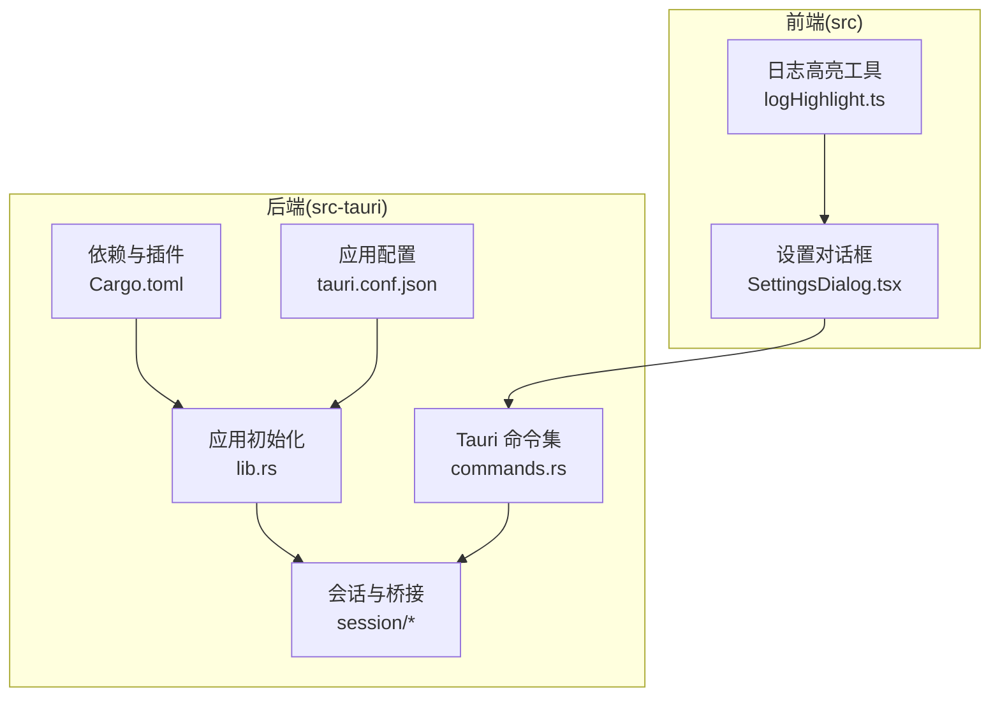
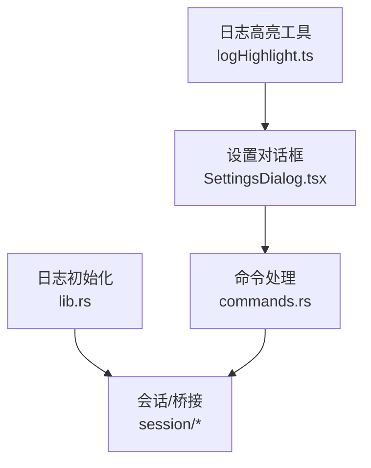
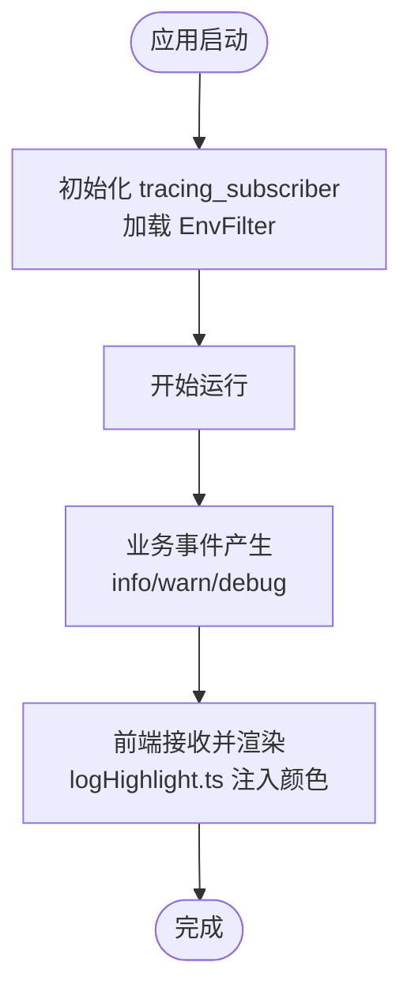
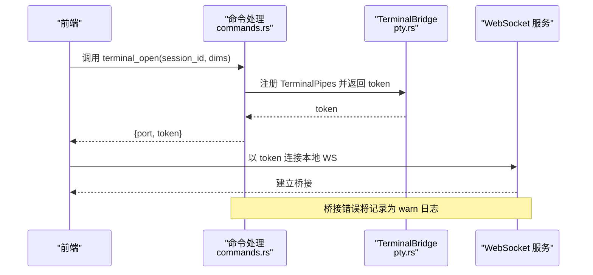
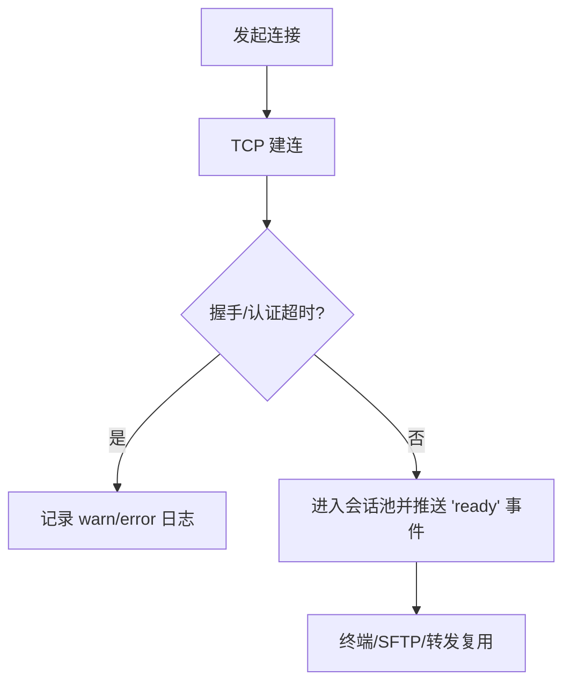
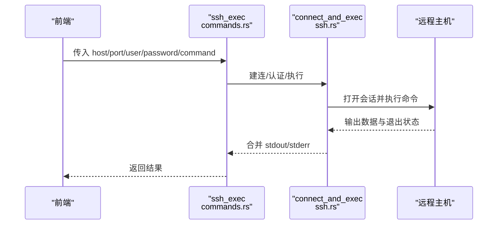
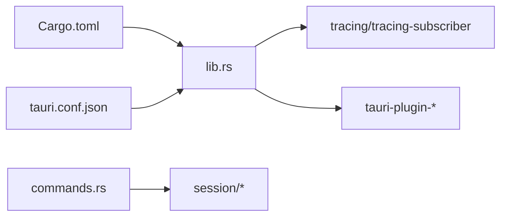

# 调试工具与日志

<cite>
**本文引用的文件**
- [src-tauri/src/lib.rs](file://src-tauri/src/lib.rs)
- [Cargo.toml](file://src-tauri/Cargo.toml)
- [tauri.conf.json](file://src-tauri/tauri.conf.json)
- [src-tauri/src/commands.rs](file://src-tauri/src/commands.rs)
- [src-tauri/src/session/mod.rs](file://src-tauri/src/session/mod.rs)
- [src-tauri/src/session/manager.rs](file://src-tauri/src/session/manager.rs)
- [src-tauri/src/session/pty.rs](file://src-tauri/src/session/pty.rs)
- [src-tauri/src/session/ssh.rs](file://src-tauri/src/session/ssh.rs)
- [src/utils/logHighlight.ts](file://src/utils/logHighlight.ts)
- [src/components/SettingsDialog.tsx](file://src/components/SettingsDialog.tsx)
</cite>

## 目录
1. [简介](#简介)
2. [项目结构](#项目结构)
3. [核心组件](#核心组件)
4. [架构总览](#架构总览)
5. [详细组件分析](#详细组件分析)
6. [依赖关系分析](#依赖关系分析)
7. [性能考量](#性能考量)
8. [故障排查指南](#故障排查指南)
9. [结论](#结论)
10. [附录](#附录)

## 简介
本指南面向开发者与高级用户，系统性介绍如何在本项目中进行调试与日志分析。内容涵盖：
- 内置日志系统的启用与环境变量控制
- 日志级别、输出格式与关键错误信息识别
- 开发者工具与前端设置项的配合使用
- 网络流量监控与终端桥接链路观测
- 内存与性能瓶颈定位方法
- 崩溃转储与堆栈跟踪的获取与解读
- 问题复现的标准化流程与最小化复现案例编写

## 项目结构
本项目采用 Rust + Tauri 的桌面应用架构，后端位于 src-tauri，前端位于 src。日志系统基于 tracing 与 tracing-subscriber，并通过环境变量进行过滤。

**图表来源**
- [src-tauri/src/lib.rs:15-18](file://src-tauri/src/lib.rs#L15-L18)
- [src-tauri/src/commands.rs:44-72](file://src-tauri/src/commands.rs#L44-L72)
- [src-tauri/src/session/mod.rs:1-26](file://src-tauri/src/session/mod.rs#L1-L26)
- [src-tauri/Cargo.toml:22-48](file://src-tauri/Cargo.toml#L22-L48)
- [src-tauri/tauri.conf.json:1-54](file://src-tauri/tauri.conf.json#L1-L54)

**章节来源**
- [src-tauri/src/lib.rs:15-18](file://src-tauri/src/lib.rs#L15-L18)
- [src-tauri/Cargo.toml:22-48](file://src-tauri/Cargo.toml#L22-L48)
- [src-tauri/tauri.conf.json:1-54](file://src-tauri/tauri.conf.json#L1-L54)

## 核心组件
- 日志子系统
  - 初始化：应用启动时通过 tracing_subscriber 初始化格式化输出，并从环境变量加载过滤规则。
  - 使用：后端广泛使用 tracing 的 info/warn/debug 等宏进行结构化日志记录。
- 前端日志高亮
  - 提供纯文本日志的 ANSI 颜色注入，增强可读性，便于快速识别错误、警告、状态码等。
- 会话与桥接
  - 会话池管理持久连接，终端通过本地 WebSocket 桥接，便于观测与调试。
- Tauri 命令
  - 暴露连接、终端、SFTP、端口转发、系统监控等命令，便于前端触发与观察后端行为。

**章节来源**
- [src-tauri/src/lib.rs:15-18](file://src-tauri/src/lib.rs#L15-L18)
- [src/utils/logHighlight.ts:1-162](file://src/utils/logHighlight.ts#L1-L162)
- [src-tauri/src/session/pty.rs:47-73](file://src-tauri/src/session/pty.rs#L47-L73)
- [src-tauri/src/commands.rs:44-72](file://src-tauri/src/commands.rs#L44-L72)

## 架构总览
下面的图展示了日志与调试相关的关键交互：前端设置影响日志可见性与终端行为，后端通过 tracing 输出，前端通过日志高亮增强可读性。

**图表来源**
- [src/components/SettingsDialog.tsx:15-242](file://src/components/SettingsDialog.tsx#L15-L242)
- [src/utils/logHighlight.ts:1-162](file://src/utils/logHighlight.ts#L1-L162)
- [src-tauri/src/lib.rs:15-18](file://src-tauri/src/lib.rs#L15-L18)
- [src-tauri/src/commands.rs:44-72](file://src-tauri/src/commands.rs#L44-L72)
- [src-tauri/src/session/mod.rs:1-26](file://src-tauri/src/session/mod.rs#L1-L26)

## 详细组件分析

### 日志系统与级别
- 初始化与过滤
  - 应用启动时初始化 tracing_subscriber，并使用 EnvFilter 从环境变量加载过滤规则，便于在不同环境下调整日志级别。
- 常用日志宏
  - info/warn/debug：用于连接进度、桥接错误、命令退出状态等关键事件记录。
- 日志格式
  - 默认使用 fmt 格式化输出，结合 EnvFilter 可按模块或级别过滤。
- 前端日志高亮
  - 自动识别时间戳、级别关键字、HTTP 状态码、异常类名等，注入 ANSI 颜色，提升可读性。

**图表来源**
- [src-tauri/src/lib.rs:15-18](file://src-tauri/src/lib.rs#L15-L18)
- [src/utils/logHighlight.ts:110-119](file://src/utils/logHighlight.ts#L110-L119)

**章节来源**
- [src-tauri/src/lib.rs:15-18](file://src-tauri/src/lib.rs#L15-L18)
- [src/utils/logHighlight.ts:1-162](file://src/utils/logHighlight.ts#L1-L162)

### 终端桥接与网络流量观测
- 终端桥接
  - 后端在本地随机端口启动 WebSocket 服务，前端通过 token 建立连接，实现 PTY 数据的双向传输。
  - 桥接过程中出现的错误会被记录为 warn 级别日志，便于定位连接失败、接受错误等问题。
- 流量监控建议
  - 使用本地回环地址与随机端口，避免外部干扰。
  - 结合前端日志高亮，观察终端输出中的异常状态码或错误关键字。

**图表来源**
- [src-tauri/src/commands.rs:107-186](file://src-tauri/src/commands.rs#L107-L186)
- [src-tauri/src/session/pty.rs:47-85](file://src-tauri/src/session/pty.rs#L47-L85)
- [src-tauri/src/session/pty.rs:87-141](file://src-tauri/src/session/pty.rs#L87-L141)

**章节来源**
- [src-tauri/src/commands.rs:107-186](file://src-tauri/src/commands.rs#L107-L186)
- [src-tauri/src/session/pty.rs:47-85](file://src-tauri/src/session/pty.rs#L47-L85)
- [src-tauri/src/session/pty.rs:87-141](file://src-tauri/src/session/pty.rs#L87-L141)

### 连接与会话管理调试要点
- 连接进度事件
  - 会话管理器在连接各阶段（解析、握手、认证、跳板、就绪）向前端推送进度事件，便于前端展示与用户感知。
- 关键超时与错误
  - TCP 建连、SSH 握手、认证均有超时设定，失败时会记录相应日志，便于快速定位网络或认证问题。
- 主机公钥校验
  - 首次连接或公钥变更时，会将事件推送到前端确认，若拒绝则仅清除内存缓存，避免误改 known_hosts。

**图表来源**
- [src-tauri/src/session/manager.rs:24-29](file://src-tauri/src/session/manager.rs#L24-L29)
- [src-tauri/src/session/manager.rs:39-48](file://src-tauri/src/session/manager.rs#L39-L48)
- [src-tauri/src/session/mod.rs:118-160](file://src-tauri/src/session/mod.rs#L118-L160)

**章节来源**
- [src-tauri/src/session/manager.rs:24-29](file://src-tauri/src/session/manager.rs#L24-L29)
- [src-tauri/src/session/manager.rs:39-48](file://src-tauri/src/session/manager.rs#L39-L48)
- [src-tauri/src/session/mod.rs:118-160](file://src-tauri/src/session/mod.rs#L118-L160)

### 一次性命令执行与退出状态
- 一次性执行
  - 适用于快速验证链路，执行完成后记录远程命令退出状态，便于判断脚本执行结果。
- 适用场景
  - 诊断命令可用性、快速验证权限与路径。

**图表来源**
- [src-tauri/src/commands.rs:27-38](file://src-tauri/src/commands.rs#L27-L38)
- [src-tauri/src/session/ssh.rs:14-64](file://src-tauri/src/session/ssh.rs#L14-L64)

**章节来源**
- [src-tauri/src/commands.rs:27-38](file://src-tauri/src/commands.rs#L27-L38)
- [src-tauri/src/session/ssh.rs:14-64](file://src-tauri/src/session/ssh.rs#L14-L64)

### 前端设置与调试辅助
- 设置面板
  - 包含终端字体、字号、行高、光标样式与闪烁等选项，有助于改善日志可读性与终端体验。
  - 自动重连策略与 X11 转发开关，便于在不同网络与图形环境下进行对比测试。
- 与日志的关系
  - 更合适的字体与行高能显著提升日志阅读效率；X11 转发问题可通过日志中的 warn 记录定位。

**章节来源**
- [src/components/SettingsDialog.tsx:15-242](file://src/components/SettingsDialog.tsx#L15-L242)

## 依赖关系分析
- 日志与插件
  - tracing 与 tracing-subscriber 用于日志输出与过滤。
  - Tauri 插件包括 process、dialog、updater 等，为调试与运维提供基础能力。
- 配置
  - tauri.conf.json 定义应用名称、窗口尺寸、安全策略与打包信息，间接影响日志输出与调试环境。

**图表来源**
- [src-tauri/src/lib.rs:15-18](file://src-tauri/src/lib.rs#L15-L18)
- [src-tauri/Cargo.toml:22-48](file://src-tauri/Cargo.toml#L22-L48)
- [src-tauri/tauri.conf.json:1-54](file://src-tauri/tauri.conf.json#L1-L54)

**章节来源**
- [src-tauri/src/lib.rs:15-18](file://src-tauri/src/lib.rs#L15-L18)
- [src-tauri/Cargo.toml:22-48](file://src-tauri/Cargo.toml#L22-L48)
- [src-tauri/tauri.conf.json:1-54](file://src-tauri/tauri.conf.json#L1-L54)

## 性能考量
- 日志级别与开销
  - debug/info/warn 的输出频率与字段数量会影响性能，建议在生产环境降低到 info 或更高。
- 终端桥接
  - mpsc 管道与 select! 并发处理确保低延迟，但过多并发或阻塞操作可能造成背压，需关注日志中的 warn 提示。
- 传输与同步
  - SFTP 与传输队列的串行 worker 有助于稳定吞吐，但大文件或大量小文件会增加 CPU 与 IO 压力，注意观察日志中的耗时与错误。

[本节为通用指导，无需列出具体文件来源]

## 故障排查指南

### 日志级别设置与过滤
- 环境变量
  - 使用 RUST_LOG 等环境变量配合 EnvFilter，按模块或全局设置级别（例如 info、warn、debug）。
- 实际效果
  - 启动后即可看到不同级别的日志输出，便于聚焦问题阶段。

**章节来源**
- [src-tauri/src/lib.rs:15-18](file://src-tauri/src/lib.rs#L15-L18)

### 日志文件位置与格式
- 输出位置
  - 默认输出到标准输出（控制台），便于开发与调试。
- 格式特征
  - 包含时间戳、级别、模块与消息体，结合前端日志高亮可快速识别错误与异常。

**章节来源**
- [src-tauri/src/lib.rs:15-18](file://src-tauri/src/lib.rs#L15-L18)
- [src/utils/logHighlight.ts:1-162](file://src/utils/logHighlight.ts#L1-L162)

### 关键错误信息识别
- 连接阶段
  - TCP 建连超时、握手失败、认证失败等，均会在会话管理器中记录 warn/error。
- 终端桥接
  - WS 接受错误、连接结束等会记录 warn，优先检查这些日志。
- 命令执行
  - 退出状态与错误输出，有助于判断远程命令是否成功。

**章节来源**
- [src-tauri/src/session/manager.rs:24-29](file://src-tauri/src/session/manager.rs#L24-L29)
- [src-tauri/src/session/pty.rs:63-68](file://src-tauri/src/session/pty.rs#L63-L68)
- [src-tauri/src/session/ssh.rs:50-51](file://src-tauri/src/session/ssh.rs#L50-L51)

### 开发者工具启用与前端设置
- 设置面板
  - 调整字体、字号、行高与光标样式，提升日志可读性。
  - 启用自动重连与 X11 转发，便于在不同网络与图形环境下对比问题。

**章节来源**
- [src/components/SettingsDialog.tsx:15-242](file://src/components/SettingsDialog.tsx#L15-L242)

### 网络流量监控与内存使用分析
- 流量监控
  - 通过本地回环与随机端口的 WebSocket 桥接，结合日志中的 warn 提示，定位连接与传输问题。
- 内存与性能
  - 观察日志中频繁的 warn 与错误，结合系统监控命令（如 monitor_snapshot）采集的指标，定位内存与 CPU 高占用场景。

**章节来源**
- [src-tauri/src/session/pty.rs:47-73](file://src-tauri/src/session/pty.rs#L47-L73)
- [src-tauri/src/commands.rs:680-688](file://src-tauri/src/commands.rs#L680-L688)

### 性能瓶颈定位技术
- 步骤
  - 逐步降低日志级别以减少开销，观察性能变化。
  - 在高负载场景下，关注日志中的 warn 与错误，结合系统监控快照定位瓶颈。
- 建议
  - 对于频繁的小文件传输，考虑批量或压缩策略，减少 IO 压力。

**章节来源**
- [src-tauri/src/commands.rs:680-688](file://src-tauri/src/commands.rs#L680-L688)

### 崩溃转储与堆栈跟踪解读
- 获取方式
  - 在开发环境中运行应用，遇到崩溃时可在控制台查看日志与错误信息。
  - 生产环境可通过系统崩溃转储机制收集信息（平台相关）。
- 解读要点
  - 关注日志中的错误上下文、模块路径与调用栈片段，结合命令与会话管理器的实现，定位问题根因。

**章节来源**
- [src-tauri/src/lib.rs:15-18](file://src-tauri/src/lib.rs#L15-L18)
- [src-tauri/src/commands.rs:44-72](file://src-tauri/src/commands.rs#L44-L72)

### 问题重现的标准化流程
- 步骤
  - 明确复现条件（主机、端口、用户、认证方式、网络环境）。
  - 启用较高日志级别，记录完整日志。
  - 重复操作直至复现，保留日志与截图。
- 最小化复现案例
  - 仅包含必要步骤与配置，排除无关因素，便于他人复现与定位。

**章节来源**
- [src-tauri/src/session/manager.rs:82-145](file://src-tauri/src/session/manager.rs#L82-L145)
- [src-tauri/src/commands.rs:44-72](file://src-tauri/src/commands.rs#L44-L72)

## 结论
本项目提供了完善的日志与调试基础设施：通过 tracing 与 tracing-subscriber 实现灵活的日志输出与过滤，结合前端日志高亮与设置面板，能够高效定位连接、终端、SFTP、端口转发等环节的问题。建议在开发与测试阶段保持较高日志级别，在生产环境适度降低，以平衡可观测性与性能。

[本节为总结性内容，无需列出具体文件来源]

## 附录

### 常用日志关键字速查
- 错误级别：FATAL、CRITICAL、ERROR、ERR、SEVERE；WARN、WARNING、WRN；INFO、INFORMATION、NOTICE；DEBUG、TRACE、VERBOSE、FINE、FINER、FINEST
- 时间戳：ISO 8601 与常见格式
- HTTP 状态码：1xx–5xx，按类别着色
- 异常类名：Java 风格异常类型

**章节来源**
- [src/utils/logHighlight.ts:34-50](file://src/utils/logHighlight.ts#L34-L50)