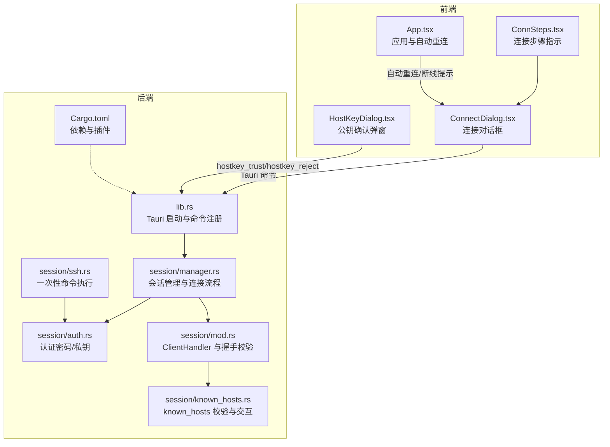
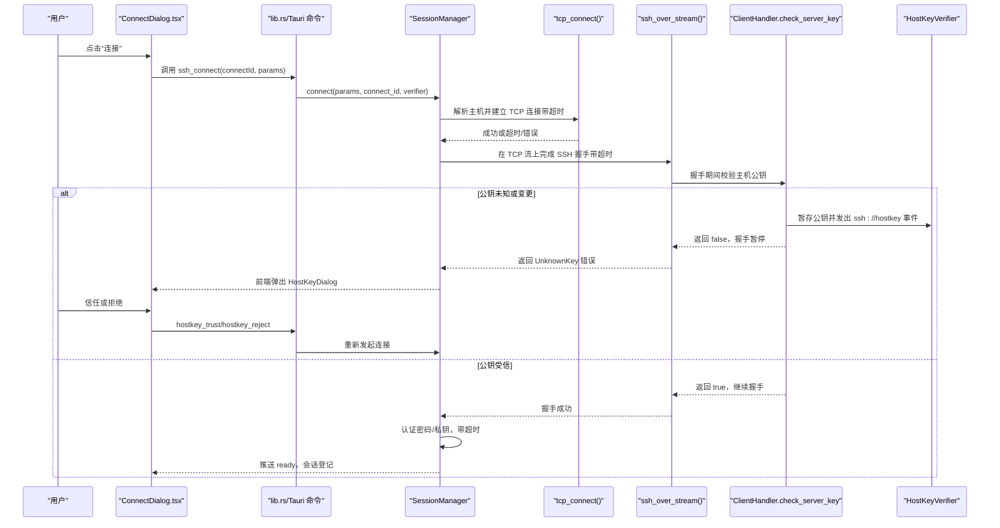
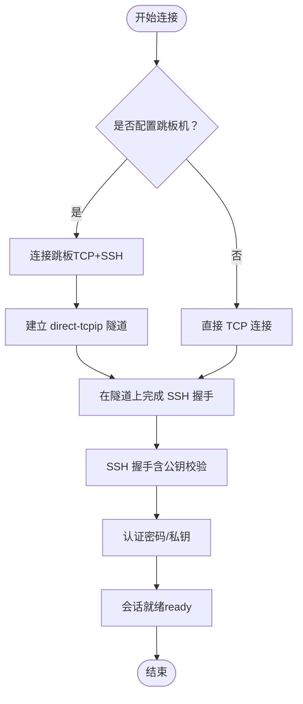
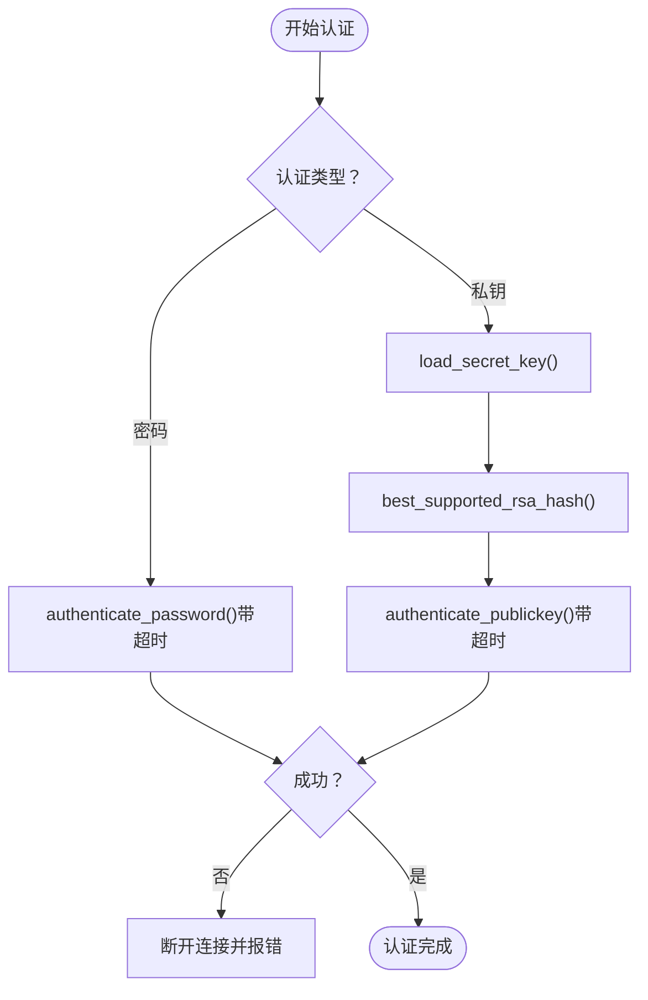
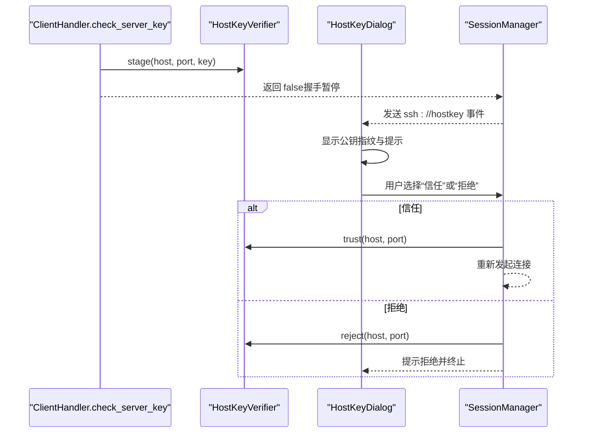
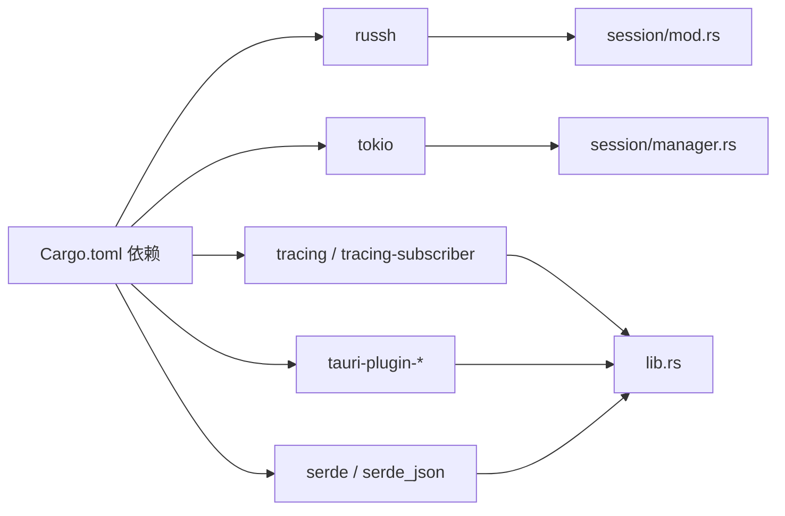

# 连接问题诊断

<cite>
**本文引用的文件**
- [src-tauri/src/session/manager.rs](file://src-tauri/src/session/manager.rs)
- [src-tauri/src/session/auth.rs](file://src-tauri/src/session/auth.rs)
- [src-tauri/src/session/ssh.rs](file://src-tauri/src/session/ssh.rs)
- [src-tauri/src/session/mod.rs](file://src-tauri/src/session/mod.rs)
- [src-tauri/src/session/known_hosts.rs](file://src-tauri/src/session/known_hosts.rs)
- [src-tauri/src/lib.rs](file://src-tauri/src/lib.rs)
- [src-tauri/Cargo.toml](file://src-tauri/Cargo.toml)
- [src/components/ConnectDialog.tsx](file://src/components/ConnectDialog.tsx)
- [src/components/HostKeyDialog.tsx](file://src/components/HostKeyDialog.tsx)
- [src/components/ConnSteps.tsx](file://src/components/ConnSteps.tsx)
- [src/App.tsx](file://src/App.tsx)
- [src/types.ts](file://src/types.ts)
</cite>

## 目录
1. [简介](#简介)
2. [项目结构](#项目结构)
3. [核心组件](#核心组件)
4. [架构总览](#架构总览)
5. [详细组件分析](#详细组件分析)
6. [依赖关系分析](#依赖关系分析)
7. [性能考量](#性能考量)
8. [故障排查指南](#故障排查指南)
9. [结论](#结论)
10. [附录](#附录)

## 简介
本指南面向使用本项目进行 SSH 连接的用户与运维人员，聚焦连接建立过程中的常见异常：认证失败、连接超时、主机公钥验证失败、网络中断等。文档结合前端连接对话框、后端会话管理与认证模块、主机公钥校验机制，给出可操作的诊断步骤、日志分析方法与跨平台（Windows、macOS、Linux）注意事项，并覆盖密码认证、私钥认证与跳板机（ProxyJump）场景。

## 项目结构
该项目采用 Rust + Tauri 架构，前端为 React/Vite，后端为 Tauri 静态库，核心 SSH 会话与认证逻辑位于 src-tauri 子目录。前端通过 Tauri 命令与后端交互，后端通过 russh 实现 SSH 协议栈。

图表来源
- [src-tauri/src/lib.rs:14-92](file://src-tauri/src/lib.rs#L14-L92)
- [src-tauri/src/session/manager.rs:82-145](file://src-tauri/src/session/manager.rs#L82-L145)
- [src-tauri/src/session/auth.rs:44-81](file://src-tauri/src/session/auth.rs#L44-L81)
- [src-tauri/src/session/mod.rs:52-160](file://src-tauri/src/session/mod.rs#L52-L160)
- [src-tauri/src/session/known_hosts.rs:63-135](file://src-tauri/src/session/known_hosts.rs#L63-L135)
- [src-tauri/src/session/ssh.rs:14-64](file://src-tauri/src/session/ssh.rs#L14-L64)
- [src-tauri/Cargo.toml:22-49](file://src-tauri/Cargo.toml#L22-L49)
- [src/components/ConnectDialog.tsx:75-98](file://src/components/ConnectDialog.tsx#L75-L98)
- [src/components/HostKeyDialog.tsx:14-118](file://src/components/HostKeyDialog.tsx#L14-L118)
- [src/components/ConnSteps.tsx:1-37](file://src/components/ConnSteps.tsx#L1-L37)
- [src/App.tsx:390-427](file://src/App.tsx#L390-L427)

章节来源
- [src-tauri/src/lib.rs:14-92](file://src-tauri/src/lib.rs#L14-L92)
- [src-tauri/Cargo.toml:22-49](file://src-tauri/Cargo.toml#L22-L49)

## 核心组件
- 会话管理与连接流程：负责 TCP 建连、SSH 握手、认证、跳板机隧道、进度事件推送与会话登记。
- 认证模块：支持密码认证与私钥认证（含 RSA 哈希协商），统一超时控制。
- 主机公钥校验：基于 OpenSSH 兼容的 known_hosts，支持首次连接（TOFU）与公钥变更（疑似 MITM）交互确认。
- 前端连接对话框：收集连接参数、监听进度事件、触发公钥确认、发起连接与保存配置。
- 一次性命令执行：演示连接→认证→执行命令→断开的最小流程。

章节来源
- [src-tauri/src/session/manager.rs:24-30](file://src-tauri/src/session/manager.rs#L24-L30)
- [src-tauri/src/session/auth.rs:44-81](file://src-tauri/src/session/auth.rs#L44-L81)
- [src-tauri/src/session/known_hosts.rs:63-135](file://src-tauri/src/session/known_hosts.rs#L63-L135)
- [src/components/ConnectDialog.tsx:75-98](file://src/components/ConnectDialog.tsx#L75-L98)
- [src-tauri/src/session/ssh.rs:14-64](file://src-tauri/src/session/ssh.rs#L14-L64)

## 架构总览
下图展示从用户点击“连接”到会话就绪的关键交互：前端发起连接请求，后端按阶段推送进度，遇到主机公钥问题时暂停握手并等待前端确认，最终建立持久会话供终端/SFTP/转发复用。

图表来源
- [src-tauri/src/session/manager.rs:82-145](file://src-tauri/src/session/manager.rs#L82-L145)
- [src-tauri/src/session/manager.rs:255-273](file://src-tauri/src/session/manager.rs#L255-L273)
- [src-tauri/src/session/manager.rs:275-316](file://src-tauri/src/session/manager.rs#L275-L316)
- [src-tauri/src/session/mod.rs:118-160](file://src-tauri/src/session/mod.rs#L118-L160)
- [src-tauri/src/session/known_hosts.rs:97-135](file://src-tauri/src/session/known_hosts.rs#L97-L135)
- [src/components/ConnectDialog.tsx:75-98](file://src/components/ConnectDialog.tsx#L75-L98)
- [src/components/HostKeyDialog.tsx:14-118](file://src/components/HostKeyDialog.tsx#L14-L118)

## 详细组件分析

### 会话管理与连接流程
- 超时策略：TCP 建连、SSH 握手、认证分别有独立超时，失败时快速返回错误。
- 进度事件：通过 ssh://progress 事件推送阶段消息，前端 ConnSteps 展示当前步骤。
- 跳板机（ProxyJump）：先连跳板，再在跳板上建立 direct-tcpip 隧道，最后在隧道上完成 SSH 握手与认证。
- 会话登记：成功后生成会话 ID，供终端/SFTP/转发复用。

图表来源
- [src-tauri/src/session/manager.rs:96-123](file://src-tauri/src/session/manager.rs#L96-L123)
- [src-tauri/src/session/manager.rs:147-217](file://src-tauri/src/session/manager.rs#L147-L217)
- [src-tauri/src/session/manager.rs:275-316](file://src-tauri/src/session/manager.rs#L275-L316)

章节来源
- [src-tauri/src/session/manager.rs:24-30](file://src-tauri/src/session/manager.rs#L24-L30)
- [src-tauri/src/session/manager.rs:82-145](file://src-tauri/src/session/manager.rs#L82-L145)
- [src-tauri/src/session/manager.rs:255-316](file://src-tauri/src/session/manager.rs#L255-L316)

### 认证模块（密码/私钥）
- 密码认证：在限定时间内完成密码认证，超时或失败均会中止连接。
- 私钥认证：加载本地私钥与可选口令，协商最佳 RSA 哈希算法，再在限定时间内完成公钥认证。
- 失败处理：认证失败时主动断开，避免悬挂状态。

图表来源
- [src-tauri/src/session/auth.rs:44-81](file://src-tauri/src/session/auth.rs#L44-L81)

章节来源
- [src-tauri/src/session/auth.rs:44-81](file://src-tauri/src/session/auth.rs#L44-L81)

### 主机公钥校验与交互
- 校验三态：已受信、未知（首次连接）、已变更（疑似 MITM）。
- 交互流程：握手期间若非受信，russh 返回 UnknownKey，后端将公钥暂存至 HostKeyVerifier，并通过 ssh://hostkey 事件通知前端，前端弹窗让用户确认指纹，确认后落盘 known_hosts，再重连。
- 首次连接（TOFU）：在非交互模式下未知主机将静默落盘，变更主机将拒绝。

图表来源
- [src-tauri/src/session/mod.rs:118-160](file://src-tauri/src/session/mod.rs#L118-L160)
- [src-tauri/src/session/known_hosts.rs:97-135](file://src-tauri/src/session/known_hosts.rs#L97-L135)
- [src/components/HostKeyDialog.tsx:14-118](file://src/components/HostKeyDialog.tsx#L14-L118)

章节来源
- [src-tauri/src/session/known_hosts.rs:63-135](file://src-tauri/src/session/known_hosts.rs#L63-L135)
- [src-tauri/src/session/mod.rs:118-160](file://src-tauri/src/session/mod.rs#L118-L160)

### 前端连接对话框与进度
- 表单校验：主机、用户、认证方式与必要字段校验。
- 进度监听：订阅 ssh://progress 事件，实时更新 ConnSteps 步骤。
- 公钥确认：收到 ssh://hostkey 事件后弹出 HostKeyDialog，支持复制指纹、信任或拒绝。
- 一次性命令：connect_and_exec 仅支持密码认证，适合快速验证链路。

章节来源
- [src/components/ConnectDialog.tsx:75-98](file://src/components/ConnectDialog.tsx#L75-L98)
- [src/components/ConnectDialog.tsx:147-199](file://src/components/ConnectDialog.tsx#L147-L199)
- [src/components/HostKeyDialog.tsx:14-118](file://src/components/HostKeyDialog.tsx#L14-L118)
- [src-tauri/src/session/ssh.rs:14-64](file://src-tauri/src/session/ssh.rs#L14-L64)

## 依赖关系分析
- russh：SSH 协议栈与公钥校验（known_hosts）。
- tokio：异步运行时，提供超时、I/O 与任务调度。
- tracing/tracing-subscriber：日志输出与过滤。
- tauri-plugin-*：系统集成能力（打开器、对话框、进程、更新器）。
- serde/serde_json：序列化事件与配置。

图表来源
- [src-tauri/Cargo.toml:22-49](file://src-tauri/Cargo.toml#L22-L49)
- [src-tauri/src/lib.rs:14-92](file://src-tauri/src/lib.rs#L14-L92)
- [src-tauri/src/session/mod.rs:44-49](file://src-tauri/src/session/mod.rs#L44-L49)

章节来源
- [src-tauri/Cargo.toml:22-49](file://src-tauri/Cargo.toml#L22-L49)
- [src-tauri/src/lib.rs:14-92](file://src-tauri/src/lib.rs#L14-L92)

## 性能考量
- 超时控制：TCP 建连、SSH 握手、认证均有明确超时，避免长时间阻塞。
- 异步 I/O：Tokio 提供高效的并发网络与文件操作，减少阻塞。
- 会话复用：持久会话供终端/SFTP/转发共享，降低重复握手成本。
- 日志：通过环境变量过滤日志级别，避免生产环境过度打印。

## 故障排查指南

### 一、连接超时
- 现象
  - 前端显示“连接超时：host:port 在 N 秒内未响应”。
  - 进度停留在“解析主机/连接目标”。
- 诊断步骤
  - 使用系统工具测试连通性：ping、telnet、nc 或 nmap。
  - 检查防火墙、安全组、代理与 NAT 规则。
  - 若使用跳板机，先单独验证跳板连通性。
- 解决方案
  - 优化网络路径或调整超时阈值（需修改源码）。
  - 更换目标主机或端口。
  - 确保 DNS 解析正常。

章节来源
- [src-tauri/src/session/manager.rs:255-273](file://src-tauri/src/session/manager.rs#L255-L273)

### 二、主机公钥验证失败（未知/已变更）
- 现象
  - 握手阶段返回“主机公钥未通过校验（未知或已变更）”，前端弹出 HostKeyDialog。
  - “首次连接”提示指纹；“公钥已变更”警示中间人风险。
- 诊断步骤
  - 对比 HostKeyDialog 中的指纹与权威渠道（如服务器控制台、ssh-keyscan）。
  - 若为变更：确认服务器确已更换密钥或排查中间人风险。
- 解决方案
  - 信任：在前端确认后落盘 known_hosts，再重连。
  - 拒绝：保持谨慎，检查网络与服务器状态。

章节来源
- [src-tauri/src/session/manager.rs:300-311](file://src-tauri/src/session/manager.rs#L300-L311)
- [src-tauri/src/session/mod.rs:118-160](file://src-tauri/src/session/mod.rs#L118-L160)
- [src-tauri/src/session/known_hosts.rs:97-135](file://src-tauri/src/session/known_hosts.rs#L97-L135)
- [src/components/HostKeyDialog.tsx:14-118](file://src/components/HostKeyDialog.tsx#L14-L118)

### 三、认证失败
- 现象
  - 进度停留在“认证”，随后报错“认证失败：请检查用户名、密码或私钥”。
- 诊断步骤
  - 密码认证：确认用户名与密码正确，尝试在命令行工具（如 openssh）验证。
  - 私钥认证：确认私钥路径、口令、权限与算法兼容性；检查服务器 authorized_keys。
- 解决方案
  - 更换认证方式或修正凭据。
  - 私钥认证失败时，查看后端日志定位具体错误（超时/读取失败/协商失败）。

章节来源
- [src-tauri/src/session/auth.rs:44-81](file://src-tauri/src/session/auth.rs#L44-L81)

### 四、网络中断与连接丢失
- 现象
  - 会话中途断开，前端提示“连接已断开”。
- 诊断步骤
  - 检查网络波动、路由变化、服务器端主动断开策略。
  - 查看自动重连设置与重连次数限制。
- 解决方案
  - 开启自动重连（前端设置），等待应用自动恢复。
  - 手动重新连接并确认公钥状态。

章节来源
- [src/App.tsx:390-427](file://src/App.tsx#L390-L427)

### 五、跳板机（ProxyJump）问题
- 现象
  - 进度卡在“连接跳板”或“经跳板连接目标”。
- 诊断步骤
  - 先单独验证跳板主机连通性与认证。
  - 检查 direct-tcpip 隧道是否建立成功。
- 解决方案
  - 修复跳板连通性与凭据。
  - 清理异常隧道后重试。

章节来源
- [src-tauri/src/session/manager.rs:147-217](file://src-tauri/src/session/manager.rs#L147-L217)

### 六、日志分析与网络连通性测试
- 日志
  - 后端初始化日志过滤器，可通过环境变量控制日志级别。
  - 前端可关注 ssh://progress 与 ssh://hostkey 事件，辅助定位阶段与交互。
- 网络测试
  - 使用系统工具验证 DNS、TCP 端口与路由。
  - 在服务器侧检查 SSH 服务状态与日志。

章节来源
- [src-tauri/src/lib.rs:16-18](file://src-tauri/src/lib.rs#L16-L18)
- [src-tauri/src/session/manager.rs:39-48](file://src-tauri/src/session/manager.rs#L39-L48)
- [src/types.ts:107-116](file://src/types.ts#L107-L116)

### 七、跨平台特定问题
- Windows
  - 控制台窗口行为差异，注意日志输出与路径分隔符。
  - 防病毒软件可能拦截端口或证书行为，建议临时放行或加入白名单。
- macOS
  - 默认禁用某些弱算法，若服务器配置较老，需在服务器端启用兼容算法。
  - 权限与钥匙串访问可能影响凭据存储与读取。
- Linux
  - 注意 umask 与 ~/.ssh 权限，确保 known_hosts 与私钥权限正确。
  - SELinux/AppArmor 可能限制进程行为，必要时调整策略。

## 结论
本项目通过明确的超时策略、阶段化进度事件与交互式公钥确认，提供了稳健的 SSH 连接体验。针对常见问题，建议优先检查网络连通性与公钥状态，其次核对认证凭据与服务器端配置。利用前端事件与日志，可快速定位问题阶段并采取相应措施。

## 附录

### A. 连接状态检查清单
- 网络
  - DNS 解析正常
  - TCP 端口可达
  - 防火墙/代理放行
- 服务器
  - SSH 服务运行正常
  - 公钥未变更或已更新 known_hosts
  - 用户与授权配置正确
- 客户端
  - 认证凭据有效
  - 私钥权限与算法兼容
  - 自动重连与日志级别设置合理

### B. 常见错误与对应阶段
- TCP 建连超时：阶段“解析主机/连接目标”
- SSH 握手超时/未知密钥：阶段“加密握手”
- 认证超时/失败：阶段“身份认证”
- 跳板隧道失败：阶段“连接跳板”