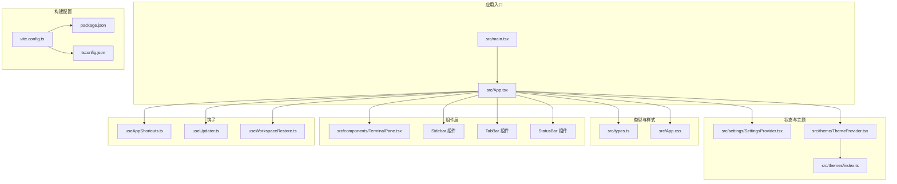
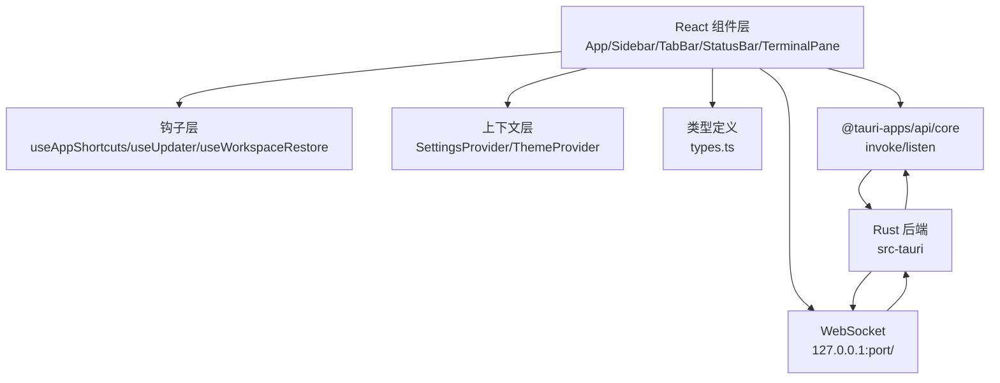
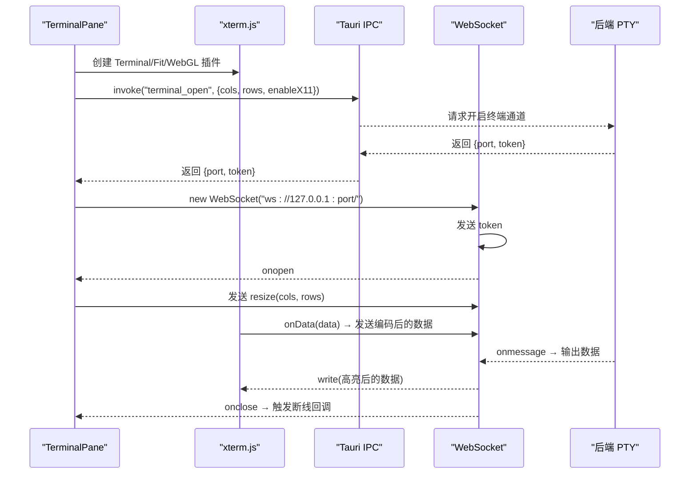
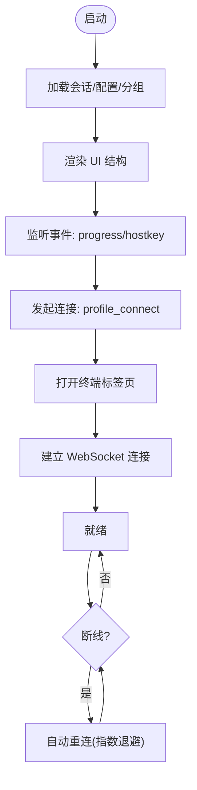
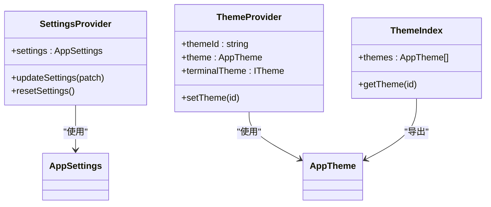
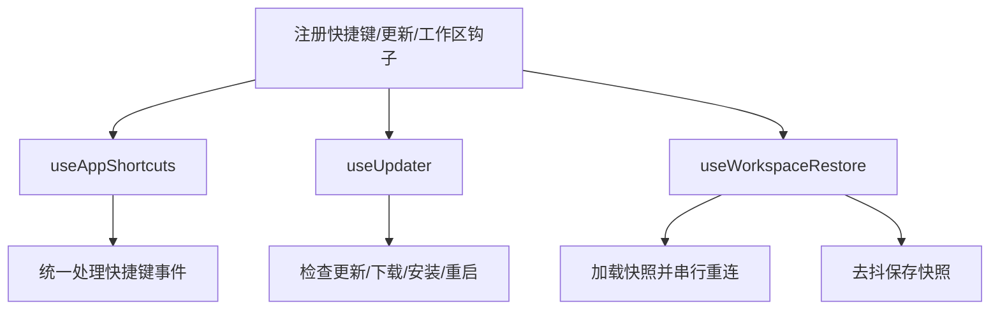
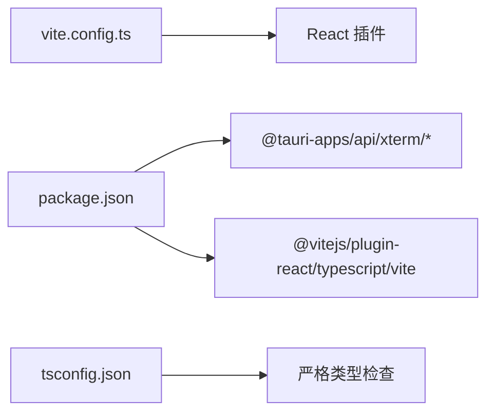
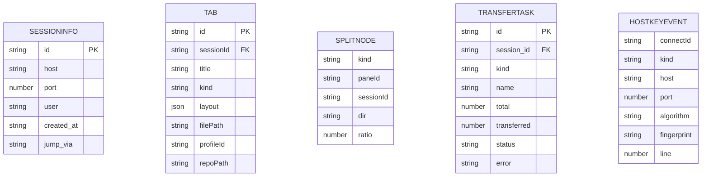

# 前端架构设计

<cite>
**本文档引用的文件**
- [src/main.tsx](file://src/main.tsx)
- [src/App.tsx](file://src/App.tsx)
- [vite.config.ts](file://vite.config.ts)
- [package.json](file://package.json)
- [tsconfig.json](file://tsconfig.json)
- [src/settings/SettingsProvider.tsx](file://src/settings/SettingsProvider.tsx)
- [src/theme/ThemeProvider.tsx](file://src/theme/ThemeProvider.tsx)
- [src/types.ts](file://src/types.ts)
- [src/components/TerminalPane.tsx](file://src/components/TerminalPane.tsx)
- [src/hooks/useAppShortcuts.ts](file://src/hooks/useAppShortcuts.ts)
- [src/hooks/useUpdater.ts](file://src/hooks/useUpdater.ts)
- [src/hooks/useWorkspaceRestore.ts](file://src/hooks/useWorkspaceRestore.ts)
- [src/themes/index.ts](file://src/themes/index.ts)
- [src/App.css](file://src/App.css)
</cite>

## 目录
1. [简介](#简介)
2. [项目结构](#项目结构)
3. [核心组件](#核心组件)
4. [架构总览](#架构总览)
5. [详细组件分析](#详细组件分析)
6. [依赖关系分析](#依赖关系分析)
7. [性能考虑](#性能考虑)
8. [故障排除指南](#故障排除指南)
9. [结论](#结论)
10. [附录](#附录)

## 简介
本项目采用 React 19 + TypeScript 构建，结合 Tauri 提供桌面端原生能力，前端负责用户界面、状态管理、主题与字体系统、以及与后端的桥接通信。核心特性包括：
- 终端集成：基于 xterm.js 的高性能终端，支持 WebGL 渲染、搜索、日志高亮与动态尺寸适配
- 多功能工作区：支持分屏布局、标签页切换、工作区持久化与自动重连
- 主题系统：内置多种终端与应用主题，支持 CSS 变量驱动的动态切换
- 轻量 UI：以 Tailwind CSS 与自定义样式为主，辅以少量图标库
- 桌面集成：通过 Tauri IPC 与 WebSocket 实现与 Rust 后端的稳定通信

## 项目结构
前端代码位于 src 目录，主要分为以下层次：
- 应用入口与根组件：main.tsx、App.tsx
- 状态与主题：SettingsProvider、ThemeProvider
- 类型定义：types.ts
- 组件层：TerminalPane、Sidebar、TabBar、StatusBar、对话框与面板组件
- 钩子：useAppShortcuts、useUpdater、useWorkspaceRestore
- 主题与样式：themes/index.ts、App.css
- 构建配置：vite.config.ts、package.json、tsconfig.json

**图表来源**
- [src/main.tsx:1-20](file://src/main.tsx#L1-L20)
- [src/App.tsx:1-685](file://src/App.tsx#L1-L685)
- [vite.config.ts:1-33](file://vite.config.ts#L1-L33)
- [package.json:1-53](file://package.json#L1-L53)
- [tsconfig.json:1-26](file://tsconfig.json#L1-L26)

**章节来源**
- [src/main.tsx:1-20](file://src/main.tsx#L1-L20)
- [src/App.tsx:1-685](file://src/App.tsx#L1-L685)
- [vite.config.ts:1-33](file://vite.config.ts#L1-L33)
- [package.json:1-53](file://package.json#L1-L53)
- [tsconfig.json:1-26](file://tsconfig.json#L1-L26)

## 核心组件
- 应用根组件 App：集中管理连接配置、会话、标签页、分屏布局、命令面板、设置与提示信息；通过 Tauri IPC 调用后端能力，监听事件并处理断线重连
- 终端面板 TerminalPane：封装 xterm.js，负责终端初始化、尺寸适配、输入输出转发、搜索与日志高亮，以及与后端 WebSocket 的交互
- 设置提供者 SettingsProvider：提供应用设置的读写与持久化，支持部分更新与默认值合并
- 主题提供者 ThemeProvider：提供应用与终端主题的切换与持久化，将主题变量注入 CSS 变量
- 钩子函数：
  - useAppShortcuts：全局快捷键处理，避免与可编辑元素冲突
  - useUpdater：检查并安装更新，支持重启
  - useWorkspaceRestore：工作区快照加载与保存，支持自动重连

**章节来源**
- [src/App.tsx:60-685](file://src/App.tsx#L60-L685)
- [src/components/TerminalPane.tsx:1-199](file://src/components/TerminalPane.tsx#L1-L199)
- [src/settings/SettingsProvider.tsx:1-80](file://src/settings/SettingsProvider.tsx#L1-L80)
- [src/theme/ThemeProvider.tsx:1-108](file://src/theme/ThemeProvider.tsx#L1-L108)
- [src/hooks/useAppShortcuts.ts:1-61](file://src/hooks/useAppShortcuts.ts#L1-L61)
- [src/hooks/useUpdater.ts:1-56](file://src/hooks/useUpdater.ts#L1-L56)
- [src/hooks/useWorkspaceRestore.ts:1-178](file://src/hooks/useWorkspaceRestore.ts#L1-L178)

## 架构总览
前端采用“组件 + 钩子 + 上下文”的组织方式，配合 Tauri IPC 与 WebSocket 实现与后端的双向通信。整体流程如下：

**图表来源**
- [src/App.tsx:2-4](file://src/App.tsx#L2-L4)
- [src/components/TerminalPane.tsx:5-131](file://src/components/TerminalPane.tsx#L5-L131)
- [src-tauri/src/lib.rs](file://src-tauri/src/lib.rs)

**章节来源**
- [src/App.tsx:2-4](file://src/App.tsx#L2-L4)
- [src/components/TerminalPane.tsx:5-131](file://src/components/TerminalPane.tsx#L5-L131)

## 详细组件分析

### 终端面板组件（TerminalPane）
TerminalPane 是前端与后端交互的核心组件，职责包括：
- 初始化 xterm.js 并加载插件（fit、webgl/canvas 回退）
- 监听容器尺寸变化并通过 WebSocket 发送 resize 事件
- 将用户输入通过 WebSocket 发送到后端 PTY，接收输出并进行日志高亮
- 处理意外断开并回调上层进行重连

**图表来源**
- [src/components/TerminalPane.tsx:103-135](file://src/components/TerminalPane.tsx#L103-L135)
- [src/components/TerminalPane.tsx:87-130](file://src/components/TerminalPane.tsx#L87-L130)

**章节来源**
- [src/components/TerminalPane.tsx:1-199](file://src/components/TerminalPane.tsx#L1-L199)

### 应用根组件（App）
App 负责：
- 管理连接配置、分组、会话列表与标签页
- 通过 IPC 列举会话、连接配置、分组，监听连接进度与主机密钥事件
- 控制断线重连（指数退避）、自动重连映射与工作区恢复
- 渲染侧边栏、标签栏、主工作区与状态栏，以及连接弹窗、设置弹窗、命令面板、传输与转发面板

**图表来源**
- [src/App.tsx:98-126](file://src/App.tsx#L98-L126)
- [src/App.tsx:136-160](file://src/App.tsx#L136-L160)
- [src/App.tsx:312-336](file://src/App.tsx#L312-L336)
- [src/App.tsx:339-388](file://src/App.tsx#L339-L388)

**章节来源**
- [src/App.tsx:60-685](file://src/App.tsx#L60-L685)

### 设置与主题系统
- SettingsProvider：提供设置的读取、部分更新与持久化，支持默认值合并与错误兜底
- ThemeProvider：将主题变量写入 CSS 变量，支持应用主题与终端主题切换，主题持久化
- themes/index.ts：内置多种 ANSI 调色板与应用主题，生成终端与应用配色

**图表来源**
- [src/settings/SettingsProvider.tsx:15-79](file://src/settings/SettingsProvider.tsx#L15-L79)
- [src/theme/ThemeProvider.tsx:14-107](file://src/theme/ThemeProvider.tsx#L14-L107)
- [src/themes/index.ts:409-433](file://src/themes/index.ts#L409-L433)

**章节来源**
- [src/settings/SettingsProvider.tsx:1-80](file://src/settings/SettingsProvider.tsx#L1-L80)
- [src/theme/ThemeProvider.tsx:1-108](file://src/theme/ThemeProvider.tsx#L1-L108)
- [src/themes/index.ts:1-800](file://src/themes/index.ts#L1-L800)

### 钩子函数
- useAppShortcuts：全局快捷键处理，避免在输入框内触发
- useUpdater：检查更新、下载安装、可选重启
- useWorkspaceRestore：启动时恢复工作区快照，标签变化时去抖保存

**图表来源**
- [src/hooks/useAppShortcuts.ts:23-59](file://src/hooks/useAppShortcuts.ts#L23-L59)
- [src/hooks/useUpdater.ts:18-52](file://src/hooks/useUpdater.ts#L18-L52)
- [src/hooks/useWorkspaceRestore.ts:41-158](file://src/hooks/useWorkspaceRestore.ts#L41-L158)

**章节来源**
- [src/hooks/useAppShortcuts.ts:1-61](file://src/hooks/useAppShortcuts.ts#L1-L61)
- [src/hooks/useUpdater.ts:1-56](file://src/hooks/useUpdater.ts#L1-L56)
- [src/hooks/useWorkspaceRestore.ts:1-178](file://src/hooks/useWorkspaceRestore.ts#L1-L178)

## 依赖关系分析
- 构建工具链：Vite + React + TypeScript，开发时固定端口与 HMR 配置，忽略 src-tauri 目录
- 运行时依赖：@tauri-apps/api 提供 IPC 与事件监听；xterm.js 及其插件提供终端能力；lucide-react 提供图标
- 开发依赖：@vitejs/plugin-react、typescript、vite

**图表来源**
- [vite.config.ts:8-32](file://vite.config.ts#L8-L32)
- [package.json:28-51](file://package.json#L28-L51)
- [tsconfig.json:2-25](file://tsconfig.json#L2-L25)

**章节来源**
- [vite.config.ts:1-33](file://vite.config.ts#L1-L33)
- [package.json:1-53](file://package.json#L1-L53)
- [tsconfig.json:1-26](file://tsconfig.json#L1-L26)

## 性能考虑
- 终端渲染优化
  - 优先启用 WebGL 插件，不可用时回退 Canvas，减少重绘开销
  - 使用 ResizeObserver 监听容器尺寸变化，配合防抖发送 resize 事件，避免频繁计算
  - 日志高亮在前端进行，减少后端负担
- 状态与渲染优化
  - App 中对连接状态、主机密钥、重连状态使用 useRef 缓存，降低渲染抖动
  - 分屏布局与标签页切换采用最小化更新策略，仅更新受影响节点
- 事件与 IPC
  - 事件监听在组件卸载时及时清理，避免内存泄漏
  - IPC 调用集中在 App 层，组件间通过 props 传递必要状态，降低耦合
- 主题与样式
  - 主题变量注入 CSS 变量，避免每次主题切换都重排 DOM
  - App.css 使用原子化样式与 CSS 变量，减少样式体积与计算

[本节为通用性能建议，无需特定文件引用]

## 故障排除指南
- 终端无法打开或空白
  - 检查 IPC 调用返回的端口与 token 是否正确，确认 WebSocket 地址可达
  - 若 WebGL 不可用，确认已回退到 Canvas 渲染
- 连接断开后无法自动重连
  - 检查设置中的自动重连开关与最大尝试次数
  - 确认 sessionProfileRef 映射是否存在，避免主动断开触发重连
- 主机密钥校验
  - 若出现未知或变更的主机密钥，需用户确认信任或拒绝
- 快捷键无效
  - 确保不在可编辑元素中触发快捷键，useAppShortcuts 会对输入框进行过滤

**章节来源**
- [src/components/TerminalPane.tsx:103-135](file://src/components/TerminalPane.tsx#L103-L135)
- [src/App.tsx:339-408](file://src/App.tsx#L339-L408)
- [src/hooks/useAppShortcuts.ts:12-18](file://src/hooks/useAppShortcuts.ts#L12-L18)

## 结论
该前端架构以 React 19 + TypeScript 为基础，结合 Tauri 提供的 IPC 与 WebSocket 能力，实现了高性能、可扩展的终端与文件管理体验。通过模块化的组件与钩子、完善的主题与设置系统，以及工作区持久化与自动重连机制，满足了复杂远程运维场景的需求。后续可在以下方面持续优化：
- 组件级懒加载与分割，进一步降低首屏负载
- 增强错误边界与日志上报，提升可观测性
- 丰富主题与配色体系，支持更多终端风格

[本节为总结性内容，无需特定文件引用]

## 附录

### 数据模型概览

**图表来源**
- [src/types.ts:1-209](file://src/types.ts#L1-L209)

**章节来源**
- [src/types.ts:1-209](file://src/types.ts#L1-L209)