# 后端架构设计

<cite>
**本文档引用的文件**
- [Cargo.toml](file://src-tauri/Cargo.toml)
- [lib.rs](file://src-tauri/src/lib.rs)
- [main.rs](file://src-tauri/src/main.rs)
- [commands.rs](file://src-tauri/src/commands.rs)
- [mod.rs](file://src-tauri/src/session/mod.rs)
- [manager.rs](file://src-tauri/src/session/manager.rs)
- [ssh.rs](file://src-tauri/src/session/ssh.rs)
- [sftp.rs](file://src-tauri/src/session/sftp.rs)
- [pty.rs](file://src-tauri/src/session/pty.rs)
- [profile.rs](file://src-tauri/src/session/profile.rs)
- [transfer.rs](file://src-tauri/src/session/transfer.rs)
- [forward.rs](file://src-tauri/src/session/forward.rs)
- [known_hosts.rs](file://src-tauri/src/session/known_hosts.rs)
- [secrets.rs](file://src-tauri/src/session/secrets.rs)
- [tauri.conf.json](file://src-tauri/tauri.conf.json)
</cite>

## 目录
1. [引言](#引言)
2. [项目结构](#项目结构)
3. [核心组件](#核心组件)
4. [架构总览](#架构总览)
5. [详细组件分析](#详细组件分析)
6. [依赖关系分析](#依赖关系分析)
7. [性能考量](#性能考量)
8. [故障排查指南](#故障排查指南)
9. [结论](#结论)
10. [附录](#附录)

## 引言
本文件面向基于 Rust + Tauri 2 的后端架构，系统性阐述模块化设计原则、会话管理机制、命令系统架构与异步事件处理。重点覆盖 Russh SSH 协议实现、russh-sftp 集成、Tokio 异步运行时的应用，以及后端服务的生命周期管理、错误处理策略与性能优化方案。文档同时给出模块间依赖关系、接口设计与扩展性建议，帮助开发者快速理解并高效迭代。

## 项目结构
后端位于 src-tauri 目录，采用“薄命令层 + 会话中心”的分层设计：
- 命令层：commands.rs 暴露给前端的 Tauri 命令，负责参数解析、状态注入与调用会话子模块。
- 会话层：session 子模块提供 SSH 会话、SFTP、端口转发、PTY、配置与传输队列等能力。
- 入口层：lib.rs 初始化日志、插件、状态管理与命令注册；main.rs 作为程序入口。
- 配置层：tauri.conf.json 提供构建、打包与安全策略配置。

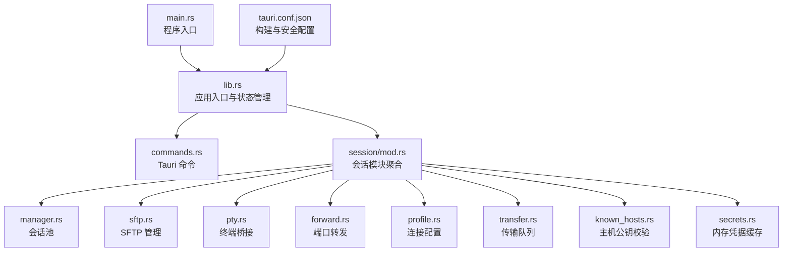

**图表来源**
- [lib.rs:14-92](file://src-tauri/src/lib.rs#L14-L92)
- [commands.rs:1-996](file://src-tauri/src/commands.rs#L1-L996)
- [mod.rs:1-226](file://src-tauri/src/session/mod.rs#L1-L226)
- [manager.rs:1-317](file://src-tauri/src/session/manager.rs#L1-L317)
- [sftp.rs:1-124](file://src-tauri/src/session/sftp.rs#L1-L124)
- [pty.rs:1-143](file://src-tauri/src/session/pty.rs#L1-L143)
- [forward.rs:1-295](file://src-tauri/src/session/forward.rs#L1-L295)
- [profile.rs:1-419](file://src-tauri/src/session/profile.rs#L1-L419)
- [transfer.rs:1-483](file://src-tauri/src/session/transfer.rs#L1-L483)
- [known_hosts.rs:1-197](file://src-tauri/src/session/known_hosts.rs#L1-L197)
- [secrets.rs:1-110](file://src-tauri/src/session/secrets.rs#L1-L110)
- [main.rs:1-7](file://src-tauri/src/main.rs#L1-L7)
- [tauri.conf.json:1-54](file://src-tauri/tauri.conf.json#L1-L54)

**章节来源**
- [lib.rs:1-92](file://src-tauri/src/lib.rs#L1-L92)
- [main.rs:1-7](file://src-tauri/src/main.rs#L1-L7)
- [tauri.conf.json:1-54](file://src-tauri/tauri.conf.json#L1-L54)

## 核心组件
- 会话管理器（SessionManager）：维护持久 SSH 连接池，支持直连与跳板机（ProxyJump）两种模式，统一推送连接进度事件。
- SFTP 管理器（SftpManager）：在已建立的 SSH 连接上打开 SFTP 子系统通道，按会话缓存 SftpSession。
- 终端桥（TerminalBridge）：在本地启动 WebSocket 服务，将 PTY 数据流桥接到前端。
- 端口转发（PortForwardManager）：支持本地转发（-L）、动态转发（-D）与远程转发（-R），统一注册与生命周期管理。
- 传输队列（TransferQueue）：串行执行上传/下载任务，支持取消与进度事件推送。
- 连接配置（ProfileStore）：保存连接元数据，凭据使用 OS 钥匙串存储，配合内存加密缓存减少授权弹窗。
- 主机公钥校验（HostKeyVerifier）：实现 known_hosts 校验与前端确认流程，支持 TOFU 与 MITM 场景。
- SSH 协议集成（russh）：统一的客户端配置、认证与回调处理，贯穿会话、转发与 X11 支持。

**章节来源**
- [manager.rs:76-253](file://src-tauri/src/session/manager.rs#L76-L253)
- [sftp.rs:24-75](file://src-tauri/src/session/sftp.rs#L24-L75)
- [pty.rs:41-86](file://src-tauri/src/session/pty.rs#L41-L86)
- [forward.rs:117-229](file://src-tauri/src/session/forward.rs#L117-L229)
- [transfer.rs:121-203](file://src-tauri/src/session/transfer.rs#L121-L203)
- [profile.rs:67-128](file://src-tauri/src/session/profile.rs#L67-L128)
- [known_hosts.rs:91-135](file://src-tauri/src/session/known_hosts.rs#L91-L135)
- [ssh.rs:1-65](file://src-tauri/src/session/ssh.rs#L1-L65)

## 架构总览
后端以 Tauri Builder 为核心，初始化日志、插件与状态管理，注册命令处理器，并在 setup 阶段启动本地终端桥与传输队列 worker。命令层通过状态注入调用会话子模块，实现 SSH 连接、SFTP 文件操作、端口转发与传输队列管理。

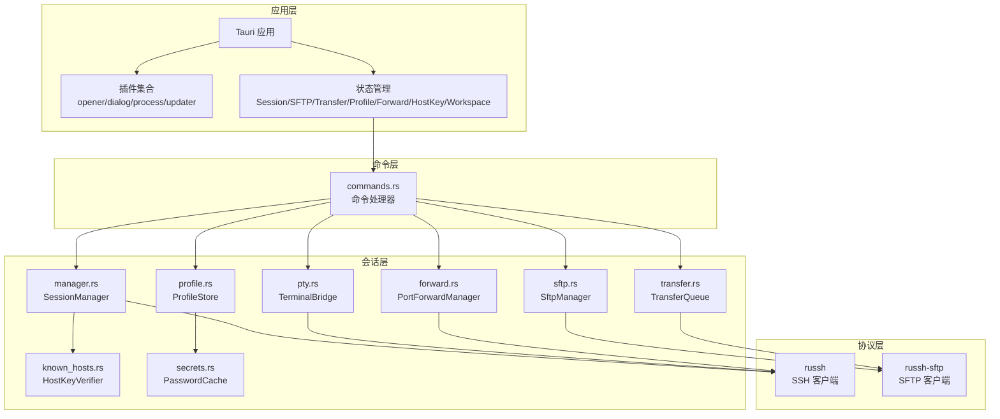

**图表来源**
- [lib.rs:20-91](file://src-tauri/src/lib.rs#L20-L91)
- [commands.rs:43-89](file://src-tauri/src/commands.rs#L43-L89)
- [manager.rs:76-145](file://src-tauri/src/session/manager.rs#L76-L145)
- [sftp.rs:24-75](file://src-tauri/src/session/sftp.rs#L24-L75)
- [pty.rs:41-86](file://src-tauri/src/session/pty.rs#L41-L86)
- [forward.rs:117-191](file://src-tauri/src/session/forward.rs#L117-L191)
- [transfer.rs:121-203](file://src-tauri/src/session/transfer.rs#L121-L203)
- [profile.rs:67-128](file://src-tauri/src/session/profile.rs#L67-L128)
- [known_hosts.rs:91-135](file://src-tauri/src/session/known_hosts.rs#L91-L135)
- [secrets.rs:37-87](file://src-tauri/src/session/secrets.rs#L37-L87)

## 详细组件分析

### 会话管理机制
- 生命周期：connect → 建连（TCP 超时）→ 握手（SSH 超时）→ 认证（密码/私钥）→ 注册会话 → ready 事件。
- 跳板机：先在跳板主机建立 SSH 会话，再通过 direct-tcpip 隧道连接目标主机。
- 进度事件：通过 ssh://progress 推送阶段与消息，前端据此展示连接进度。
- 断开：关闭主会话与可选的跳板会话，清理相关资源。

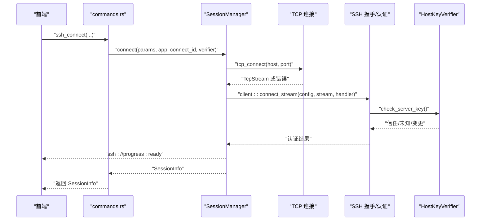

**图表来源**
- [commands.rs:43-72](file://src-tauri/src/commands.rs#L43-L72)
- [manager.rs:82-145](file://src-tauri/src/session/manager.rs#L82-L145)
- [mod.rs:115-160](file://src-tauri/src/session/mod.rs#L115-L160)
- [known_hosts.rs:68-84](file://src-tauri/src/session/known_hosts.rs#L68-L84)

**章节来源**
- [manager.rs:82-145](file://src-tauri/src/session/manager.rs#L82-L145)
- [ssh.rs:13-64](file://src-tauri/src/session/ssh.rs#L13-L64)
- [mod.rs:115-160](file://src-tauri/src/session/mod.rs#L115-L160)

### 命令系统架构
- 命令注册：在 lib.rs 中集中注册所有命令，命令函数通过 tauri::State 注入会话、SFTP、传输队列等状态。
- 参数解析：命令层负责参数校验、认证方式解析与跳板机解析。
- 事件推送：连接进度与传输进度通过 Emitter 推送到前端，确保 UI 实时反馈。

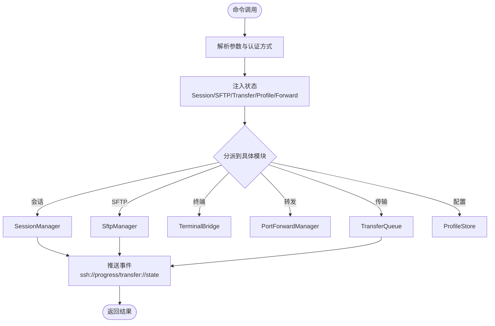

**图表来源**
- [lib.rs:43-89](file://src-tauri/src/lib.rs#L43-L89)
- [commands.rs:25-95](file://src-tauri/src/commands.rs#L25-L95)

**章节来源**
- [lib.rs:43-89](file://src-tauri/src/lib.rs#L43-L89)
- [commands.rs:25-95](file://src-tauri/src/commands.rs#L25-L95)

### 异步事件处理
- Tokio 运行时：全栈异步，使用 mpsc 管道与 select! 并发处理输入、输出与窗口调整。
- 事件模型：通过 tauri::Emitter 推送 ssh://progress 与 transfer://state/progress 事件，前端订阅并更新 UI。
- 终端桥：TerminalBridge 启动本地 WS 服务，按 token 将 mpsc 管道与 WS 连接绑定。

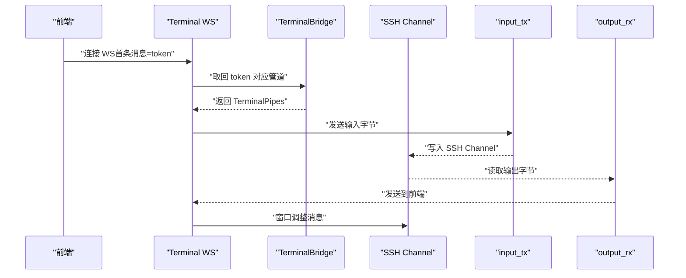

**图表来源**
- [pty.rs:87-141](file://src-tauri/src/session/pty.rs#L87-L141)
- [commands.rs:105-186](file://src-tauri/src/commands.rs#L105-L186)

**章节来源**
- [pty.rs:47-141](file://src-tauri/src/session/pty.rs#L47-L141)
- [commands.rs:105-186](file://src-tauri/src/commands.rs#L105-L186)

### Russh SSH 协议实现
- 客户端配置：统一的 client::Config，Handler 实现 check_server_key、server_channel_open_forwarded_tcpip、server_channel_open_x11。
- 认证：支持密码与私钥认证，认证过程带超时控制。
- 跳板机：通过 direct-tcpip 在跳板隧道上发起目标 SSH 会话。
- 主机公钥：known_hosts 校验，未知或变更时暂存公钥并通过事件通知前端确认。

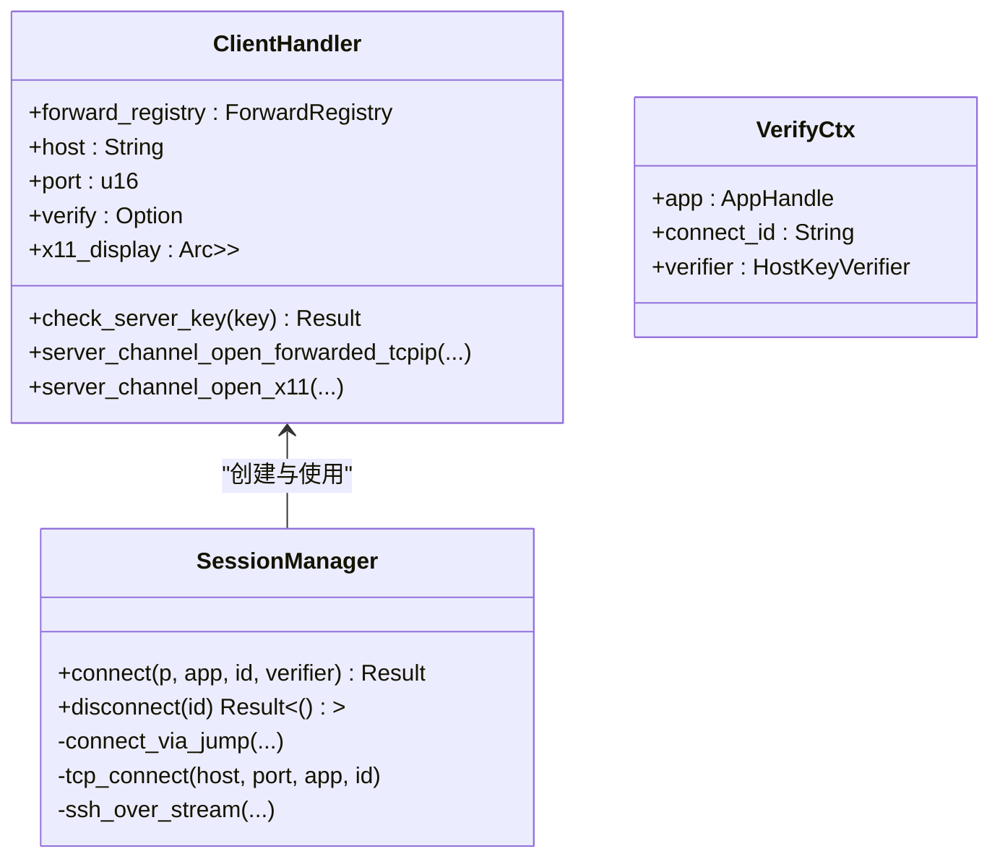

**图表来源**
- [mod.rs:59-113](file://src-tauri/src/session/mod.rs#L59-L113)
- [manager.rs:82-145](file://src-tauri/src/session/manager.rs#L82-L145)

**章节来源**
- [mod.rs:59-113](file://src-tauri/src/session/mod.rs#L59-L113)
- [manager.rs:147-217](file://src-tauri/src/session/manager.rs#L147-L217)

### russh-sftp 集成
- 复用会话：在已建立的 SSH 连接上请求 sftp 子系统，创建 SftpSession 并按会话缓存。
- 目录操作：canonicalize、read_dir、排序与过滤，返回标准化路径与条目列表。
- 文件读写：限制读取大小（5MB），二进制检测与 UTF-8 校验，保障安全性。

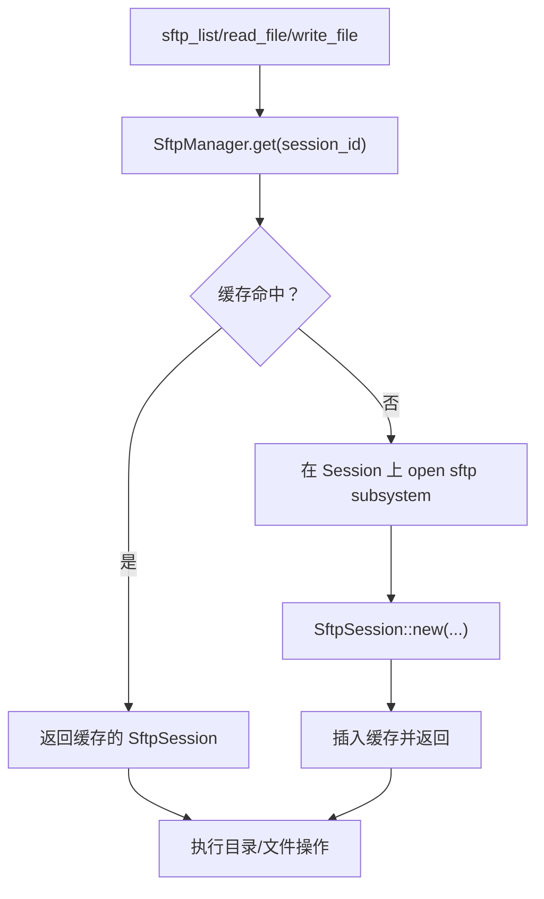

**图表来源**
- [sftp.rs:30-75](file://src-tauri/src/session/sftp.rs#L30-L75)
- [commands.rs:190-360](file://src-tauri/src/commands.rs#L190-L360)

**章节来源**
- [sftp.rs:30-124](file://src-tauri/src/session/sftp.rs#L30-L124)
- [commands.rs:190-360](file://src-tauri/src/commands.rs#L190-L360)

### 传输队列与并发控制
- 串行执行：队列按 FIFO 顺序取出任务并标记 Running，避免单连接上并发争用。
- 可取消：任务内每片传输前检查取消标志，支持半成品清理。
- 进度事件：每 64KB 片段推送 transfer://progress 事件，前端实时更新。
- 状态快照：通过 transfer://state 推送任务状态变更。

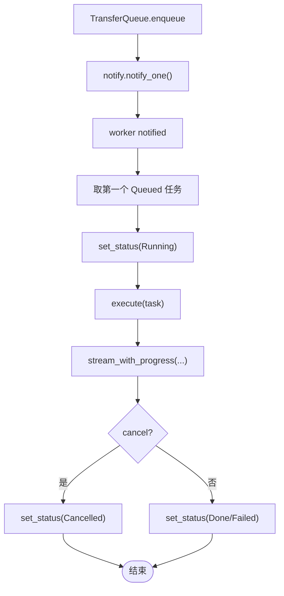

**图表来源**
- [transfer.rs:128-203](file://src-tauri/src/session/transfer.rs#L128-L203)
- [transfer.rs:206-284](file://src-tauri/src/session/transfer.rs#L206-L284)
- [transfer.rs:448-482](file://src-tauri/src/session/transfer.rs#L448-L482)

**章节来源**
- [transfer.rs:121-203](file://src-tauri/src/session/transfer.rs#L121-L203)
- [transfer.rs:205-284](file://src-tauri/src/session/transfer.rs#L205-L284)
- [transfer.rs:448-482](file://src-tauri/src/session/transfer.rs#L448-L482)

### 端口转发与 SOCKS5
- 本地转发（-L）：监听本地地址端口，每个连接在 SSH 上开 direct-tcpip 并桥接。
- 动态转发（-D）：SOCKS5 握手后解析目标，再建立 direct-tcpip。
- 远程转发（-R）：请求服务器在远端绑定端口，服务器连接时回调桥接至本地目标。
- 注册表：ForwardRegistry 记录远端绑定与本地目标映射，回调时查找并桥接。

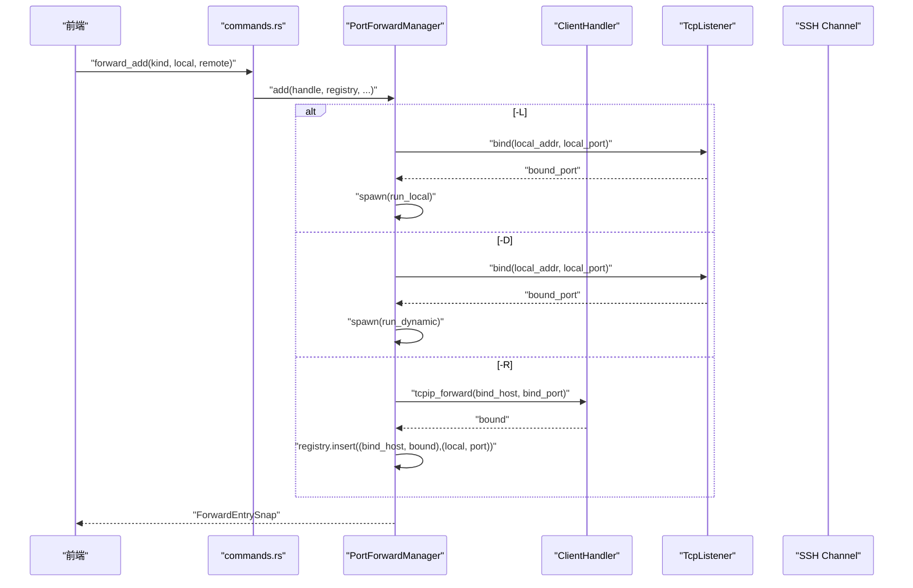

**图表来源**
- [forward.rs:123-191](file://src-tauri/src/session/forward.rs#L123-L191)
- [forward.rs:231-294](file://src-tauri/src/session/forward.rs#L231-L294)
- [mod.rs:162-207](file://src-tauri/src/session/mod.rs#L162-L207)

**章节来源**
- [forward.rs:1-295](file://src-tauri/src/session/forward.rs#L1-L295)
- [mod.rs:162-207](file://src-tauri/src/session/mod.rs#L162-L207)

### 连接配置与凭据安全
- 元数据：保存在本地 JSON 文件（~/.config/simpl-ssh/profiles.json）。
- 凭据：使用 OS 钥匙串存储密码与私钥 passphrase；ProfileStore 提供读写接口。
- 内存缓存：PasswordCache 使用 AES-GCM 加密缓存凭据，24 小时 TTL，减少授权弹窗。
- 跳板机：支持单跳跳板，禁止自引用与嵌套跳板。

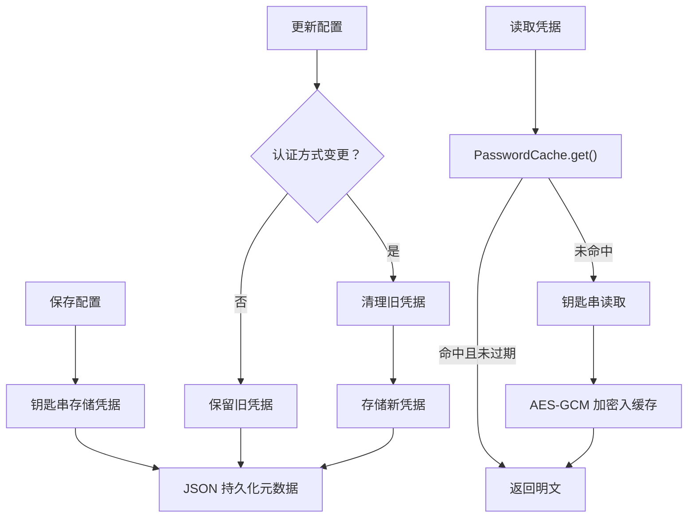

**图表来源**
- [profile.rs:102-128](file://src-tauri/src/session/profile.rs#L102-L128)
- [profile.rs:130-199](file://src-tauri/src/session/profile.rs#L130-L199)
- [secrets.rs:52-81](file://src-tauri/src/session/secrets.rs#L52-L81)

**章节来源**
- [profile.rs:67-251](file://src-tauri/src/session/profile.rs#L67-L251)
- [secrets.rs:37-87](file://src-tauri/src/session/secrets.rs#L37-L87)

### 主机公钥校验与前端确认
- 校验三态：Trusted、Unknown、Changed；Unknown 时进行 TOFU，Changed 时提示 MITM 风险。
- 探测与确认：check_server_key 暂存公钥并返回 false，前端弹窗确认；确认后落盘 known_hosts。
- 冲突处理：删除同算法但不一致的旧记录，保留其他算法记录。

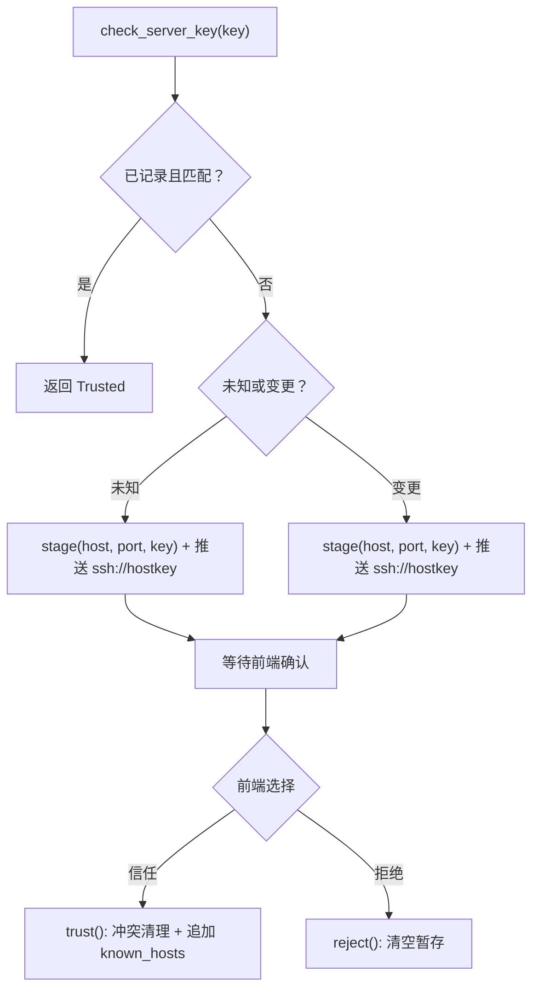

**图表来源**
- [known_hosts.rs:68-84](file://src-tauri/src/session/known_hosts.rs#L68-L84)
- [known_hosts.rs:97-135](file://src-tauri/src/session/known_hosts.rs#L97-L135)
- [mod.rs:118-160](file://src-tauri/src/session/mod.rs#L118-L160)

**章节来源**
- [known_hosts.rs:25-135](file://src-tauri/src/session/known_hosts.rs#L25-L135)
- [mod.rs:115-160](file://src-tauri/src/session/mod.rs#L115-L160)

## 依赖关系分析
- 外部依赖：russh、russh-sftp、tokio、tokio-tungstenite、futures-util、keyring、aes-gcm、sha2、uuid、dirs、tracing 等。
- 内部模块：commands 依赖 session 下各子模块；lib.rs 通过 manage 注入状态，setup 启动桥与 worker。
- 耦合与内聚：命令层薄封装，核心逻辑集中在 session 子模块，高内聚低耦合；状态通过 Tauri State 注入，避免全局变量。

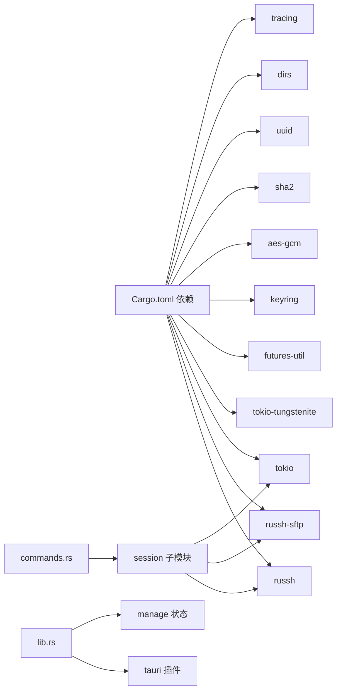

**图表来源**
- [Cargo.toml:22-49](file://src-tauri/Cargo.toml#L22-L49)
- [lib.rs:20-42](file://src-tauri/src/lib.rs#L20-L42)
- [commands.rs:10-21](file://src-tauri/src/commands.rs#L10-L21)

**章节来源**
- [Cargo.toml:22-49](file://src-tauri/Cargo.toml#L22-L49)
- [lib.rs:20-42](file://src-tauri/src/lib.rs#L20-L42)

## 性能考量
- 连接超时：TCP 建连、SSH 握手与认证均设置超时，避免长时间阻塞。
- 传输优化：64KB 片段传输，减少系统调用次数；串行队列避免并发争用。
- 终端桥：MPSC 管道与 select! 并发处理，降低延迟。
- 凭据缓存：24 小时内存缓存减少钥匙串访问与授权弹窗。
- 日志与追踪：tracing 子系统按环境变量过滤，生产默认关闭冗余日志。

[本节为通用性能指导，无需特定文件分析]

## 故障排查指南
- 连接失败：检查 ssh://progress 事件，定位阶段（resolve/handshake/auth/jump/ready）；查看 TCP/TLS/认证错误。
- 主机公钥问题：Unknown/Changed 时确认前端弹窗；若为 MITM，拒绝并删除冲突记录。
- 传输中断：检查 transfer://state 与 transfer://progress，确认任务取消标志与网络波动。
- 终端无输出：确认 WS token 正确、管道注册与连接建立；检查 resize 事件是否正确下发。
- 钥匙串权限：macOS 首次读取可能弹授权框，可通过内存缓存规避频繁弹窗。

**章节来源**
- [manager.rs:39-48](file://src-tauri/src/session/manager.rs#L39-L48)
- [known_hosts.rs:97-135](file://src-tauri/src/session/known_hosts.rs#L97-L135)
- [transfer.rs:168-176](file://src-tauri/src/session/transfer.rs#L168-L176)
- [pty.rs:87-141](file://src-tauri/src/session/pty.rs#L87-L141)
- [profile.rs:316-341](file://src-tauri/src/session/profile.rs#L316-L341)

## 结论
该后端架构以 Tauri 为载体，结合 Russh 与 russh-sftp 实现高性能、可扩展的 SSH 客户端能力。通过会话池、SFTP 缓存、传输队列与端口转发等模块化设计，实现了连接复用、并发控制与事件驱动的用户体验。配合主机公钥校验与凭据安全策略，兼顾了安全性与易用性。未来可在监控指标、连接池回收策略与跨平台证书管理等方面进一步增强。

[本节为总结性内容，无需特定文件分析]

## 附录
- 构建与打包：tauri.conf.json 定义产品名称、版本、图标与更新通道；构建前后命令与前端分发目录。
- 插件生态：opener、dialog、process、updater 插件按需启用，提升桌面端集成度。

**章节来源**
- [tauri.conf.json:1-54](file://src-tauri/tauri.conf.json#L1-L54)