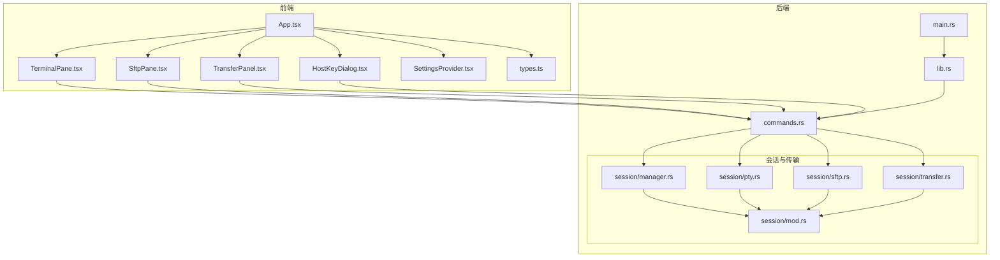
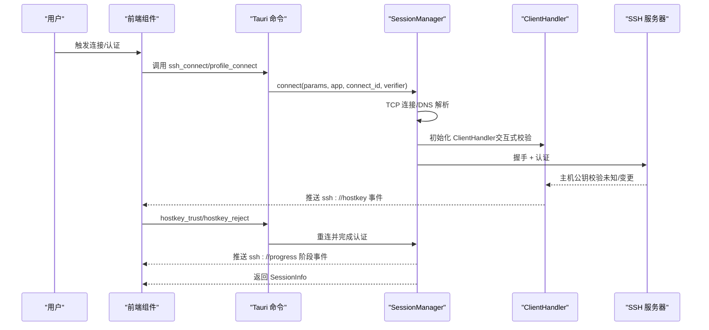
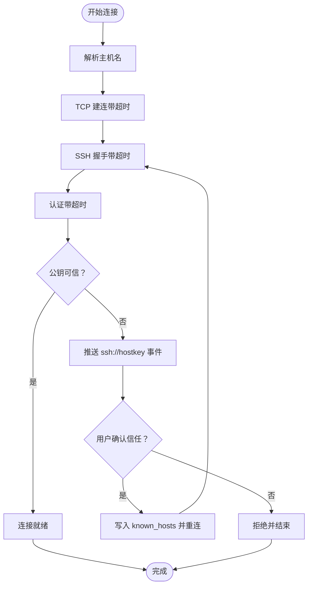
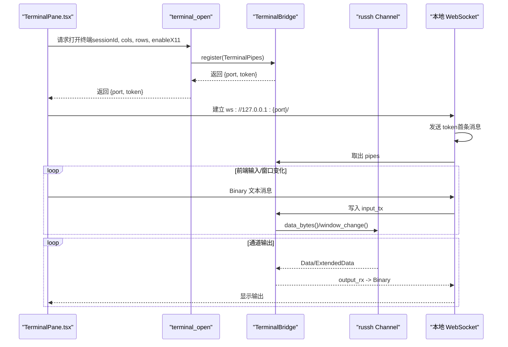
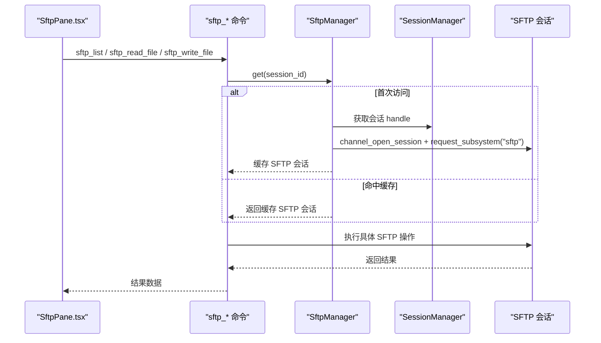
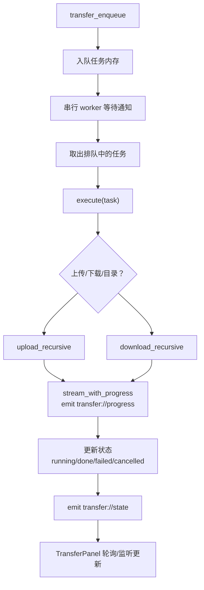
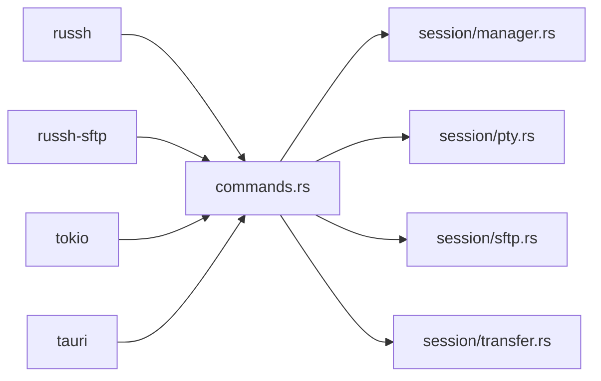

# 数据流设计

<cite>
**本文档引用的文件**
- [src-tauri/src/lib.rs](file://src-tauri/src/lib.rs)
- [src-tauri/src/main.rs](file://src-tauri/src/main.rs)
- [src-tauri/src/commands.rs](file://src-tauri/src/commands.rs)
- [src-tauri/src/session/mod.rs](file://src-tauri/src/session/mod.rs)
- [src-tauri/src/session/manager.rs](file://src-tauri/src/session/manager.rs)
- [src-tauri/src/session/pty.rs](file://src-tauri/src/session/pty.rs)
- [src-tauri/src/session/sftp.rs](file://src-tauri/src/session/sftp.rs)
- [src-tauri/src/session/transfer.rs](file://src-tauri/src/session/transfer.rs)
- [src-tauri/Cargo.toml](file://src-tauri/Cargo.toml)
- [src/App.tsx](file://src/App.tsx)
- [src/components/TerminalPane.tsx](file://src/components/TerminalPane.tsx)
- [src/components/SftpPane.tsx](file://src/components/SftpPane.tsx)
- [src/components/TransferPanel.tsx](file://src/components/TransferPanel.tsx)
- [src/components/HostKeyDialog.tsx](file://src/components/HostKeyDialog.tsx)
- [src/settings/SettingsProvider.tsx](file://src/settings/SettingsProvider.tsx)
- [src/types.ts](file://src/types.ts)
</cite>

## 目录
1. [引言](#引言)
2. [项目结构](#项目结构)
3. [核心组件](#核心组件)
4. [架构总览](#架构总览)
5. [详细组件分析](#详细组件分析)
6. [依赖关系分析](#依赖关系分析)
7. [性能考量](#性能考量)
8. [故障排查指南](#故障排查指南)
9. [结论](#结论)
10. [附录](#附录)

## 引言
本文件面向简化 SSH 客户端的数据流设计，系统性阐述从用户操作到 SSH 服务器响应的完整数据路径，覆盖连接建立、认证流程、终端数据传输、文件操作、端口转发、系统监控、工作区与配置持久化等环节。重点说明数据在不同组件间的传递方式、缓存策略与状态同步机制，以及异步数据流的处理模式、错误传播与恢复机制，并给出数据安全、性能优化与用户体验方面的建议。

## 项目结构
应用采用 Tauri 双端架构：前端使用 React + TypeScript，后端使用 Rust，通过 Tauri 命令与事件实现前后端通信。后端模块化组织，围绕会话管理、终端桥接、SFTP、传输队列、端口转发、主机公钥校验等能力构建。

图表来源
- [src-tauri/src/main.rs:1-7](file://src-tauri/src/main.rs#L1-L7)
- [src-tauri/src/lib.rs:1-93](file://src-tauri/src/lib.rs#L1-L93)
- [src-tauri/src/commands.rs:1-800](file://src-tauri/src/commands.rs#L1-L800)
- [src-tauri/src/session/mod.rs:1-226](file://src-tauri/src/session/mod.rs#L1-L226)
- [src-tauri/src/session/manager.rs:1-317](file://src-tauri/src/session/manager.rs#L1-L317)
- [src-tauri/src/session/pty.rs:1-143](file://src-tauri/src/session/pty.rs#L1-L143)
- [src-tauri/src/session/sftp.rs:1-124](file://src-tauri/src/session/sftp.rs#L1-L124)
- [src-tauri/src/session/transfer.rs:1-483](file://src-tauri/src/session/transfer.rs#L1-L483)
- [src/App.tsx:1-685](file://src/App.tsx#L1-L685)
- [src/components/TerminalPane.tsx:1-199](file://src/components/TerminalPane.tsx#L1-L199)
- [src/components/SftpPane.tsx:1-312](file://src/components/SftpPane.tsx#L1-L312)
- [src/components/TransferPanel.tsx:1-166](file://src/components/TransferPanel.tsx#L1-L166)
- [src/components/HostKeyDialog.tsx:1-119](file://src/components/HostKeyDialog.tsx#L1-L119)
- [src/settings/SettingsProvider.tsx:1-80](file://src/settings/SettingsProvider.tsx#L1-L80)
- [src/types.ts:1-209](file://src/types.ts#L1-L209)

章节来源
- [src-tauri/src/lib.rs:1-93](file://src-tauri/src/lib.rs#L1-L93)
- [src-tauri/src/main.rs:1-7](file://src-tauri/src/main.rs#L1-L7)
- [src-tauri/src/commands.rs:1-800](file://src-tauri/src/commands.rs#L1-L800)
- [src-tauri/src/session/mod.rs:1-226](file://src-tauri/src/session/mod.rs#L1-L226)
- [src/App.tsx:1-685](file://src/App.tsx#L1-L685)

## 核心组件
- 会话管理器：负责建立与维护持久 SSH 连接，提供连接进度事件、认证、跳板机代理、断开清理等能力。
- 终端桥接：在会话上开 PTY channel，通过本地 WebSocket 提供终端数据流，支持窗口大小变化与 X11 转发。
- SFTP 管理：在已有会话上打开 SFTP 子系统通道，缓存会话级 SFTP 会话，提供目录列举、文件读写等能力。
- 传输队列：串行执行上传/下载任务，支持入队、取消、进度与状态事件推送。
- 前端组件：负责用户交互、事件监听、状态展示与工作区持久化。

章节来源
- [src-tauri/src/session/manager.rs:1-317](file://src-tauri/src/session/manager.rs#L1-L317)
- [src-tauri/src/session/pty.rs:1-143](file://src-tauri/src/session/pty.rs#L1-L143)
- [src-tauri/src/session/sftp.rs:1-124](file://src-tauri/src/session/sftp.rs#L1-L124)
- [src-tauri/src/session/transfer.rs:1-483](file://src-tauri/src/session/transfer.rs#L1-L483)
- [src-tauri/src/commands.rs:1-800](file://src-tauri/src/commands.rs#L1-L800)
- [src/App.tsx:1-685](file://src/App.tsx#L1-L685)

## 架构总览
后端通过 Tauri 注入全局状态（会话、SFTP、传输队列、端口转发、主机公钥验证器、监控与工作区等），前端通过命令调用与事件订阅实现异步数据流与状态同步。

图表来源
- [src-tauri/src/commands.rs:40-95](file://src-tauri/src/commands.rs#L40-L95)
- [src-tauri/src/session/manager.rs:82-145](file://src-tauri/src/session/manager.rs#L82-L145)
- [src-tauri/src/session/mod.rs:115-160](file://src-tauri/src/session/mod.rs#L115-L160)
- [src/App.tsx:136-160](file://src/App.tsx#L136-L160)

## 详细组件分析

### 会话管理与认证流程
- 连接建立：支持直连与跳板机（ProxyJump）两种路径，分别建立 TCP 连接与 SSH 握手，期间通过“ssh://progress”事件上报阶段（resolve/handshake/auth/jump/ready）。
- 主机公钥校验：交互式场景下，未知或变更的公钥会暂存并通过“ssh://hostkey”事件推送前端确认；用户确认后落盘并重连。
- 认证超时与重试：握手与认证阶段设置超时，失败时返回明确错误；前端可基于事件与错误提示进行重试或终止。

图表来源
- [src-tauri/src/session/manager.rs:24-48](file://src-tauri/src/session/manager.rs#L24-L48)
- [src-tauri/src/session/manager.rs:82-145](file://src-tauri/src/session/manager.rs#L82-L145)
- [src-tauri/src/session/mod.rs:115-160](file://src-tauri/src/session/mod.rs#L115-L160)
- [src-tauri/src/commands.rs:772-800](file://src-tauri/src/commands.rs#L772-L800)
- [src/App.tsx:410-444](file://src/App.tsx#L410-L444)

章节来源
- [src-tauri/src/session/manager.rs:1-317](file://src-tauri/src/session/manager.rs#L1-L317)
- [src-tauri/src/session/mod.rs:1-226](file://src-tauri/src/session/mod.rs#L1-L226)
- [src-tauri/src/commands.rs:40-95](file://src-tauri/src/commands.rs#L40-L95)
- [src/App.tsx:136-160](file://src/App.tsx#L136-L160)

### 终端数据传输（PTY + WebSocket）
- 前端通过 terminal_open 在指定会话上打开 PTY，后端返回本地 WebSocket 端口与一次性 token。
- 后端在会话上开 PTY channel，桥接 mpsc 管道与 WebSocket：前端输入写入管道，后端从通道读取输出写入管道，再由 WS 推送至前端。
- 支持窗口大小变化（resize 控制消息）与 X11 转发（可选）。

图表来源
- [src-tauri/src/commands.rs:106-186](file://src-tauri/src/commands.rs#L106-L186)
- [src-tauri/src/session/pty.rs:47-142](file://src-tauri/src/session/pty.rs#L47-L142)
- [src/components/TerminalPane.tsx:103-135](file://src/components/TerminalPane.tsx#L103-L135)

章节来源
- [src-tauri/src/commands.rs:97-186](file://src-tauri/src/commands.rs#L97-L186)
- [src-tauri/src/session/pty.rs:1-143](file://src-tauri/src/session/pty.rs#L1-L143)
- [src/components/TerminalPane.tsx:1-199](file://src/components/TerminalPane.tsx#L1-L199)

### SFTP 文件操作与缓存
- SFTP 管理器在会话上打开 SFTP 子系统通道，缓存会话级 SFTP 会话，避免重复认证与通道开销。
- 前端通过命令调用进行目录列举、文件读写、新建/重命名/删除等操作；大文件读取限制与二进制检测保障安全与体验。
- 目录同步功能将差异文件入队传输队列，实现非阻塞批量传输。

图表来源
- [src-tauri/src/commands.rs:190-360](file://src-tauri/src/commands.rs#L190-L360)
- [src-tauri/src/session/sftp.rs:30-75](file://src-tauri/src/session/sftp.rs#L30-L75)
- [src/components/SftpPane.tsx:40-134](file://src/components/SftpPane.tsx#L40-L134)

章节来源
- [src-tauri/src/commands.rs:188-360](file://src-tauri/src/commands.rs#L188-L360)
- [src-tauri/src/session/sftp.rs:1-124](file://src-tauri/src/session/sftp.rs#L1-L124)
- [src/components/SftpPane.tsx:1-312](file://src/components/SftpPane.tsx#L1-L312)

### 传输队列与异步执行
- 传输队列串行执行任务，避免单连接上并发争用；支持入队、取消、进度与状态事件推送。
- 任务状态与进度通过事件与轮询结合，前端抽屉面板实时展示。

图表来源
- [src-tauri/src/session/transfer.rs:128-202](file://src-tauri/src/session/transfer.rs#L128-L202)
- [src-tauri/src/session/transfer.rs:206-284](file://src-tauri/src/session/transfer.rs#L206-L284)
- [src-tauri/src/session/transfer.rs:448-482](file://src-tauri/src/session/transfer.rs#L448-L482)
- [src/components/TransferPanel.tsx:16-50](file://src/components/TransferPanel.tsx#L16-L50)

章节来源
- [src-tauri/src/session/transfer.rs:1-483](file://src-tauri/src/session/transfer.rs#L1-L483)
- [src/components/TransferPanel.tsx:1-166](file://src/components/TransferPanel.tsx#L1-L166)

### 端口转发与 X11 转发
- 端口转发支持本地/远程/动态三种模式，后端在会话 handle 上注册转发规则并在回调中桥接本地/远端连接。
- X11 转发在终端开启时请求 X11 通道并将远端 GUI 程序输出桥接到本地 DISPLAY。

章节来源
- [src-tauri/src/session/mod.rs:162-224](file://src-tauri/src/session/mod.rs#L162-L224)
- [src-tauri/src/commands.rs:106-186](file://src-tauri/src/commands.rs#L106-L186)

### 主机公钥校验与安全
- 未知或变更的公钥通过“ssh://hostkey”事件推送前端确认；用户确认后写入 known_hosts 并重连。
- 前端提供指纹复制与安全提示，拒绝则仅清内存暂存，不改动 known_hosts。

章节来源
- [src-tauri/src/session/mod.rs:115-160](file://src-tauri/src/session/mod.rs#L115-L160)
- [src-tauri/src/commands.rs:772-800](file://src-tauri/src/commands.rs#L772-L800)
- [src/components/HostKeyDialog.tsx:1-119](file://src/components/HostKeyDialog.tsx#L1-L119)
- [src/App.tsx:410-444](file://src/App.tsx#L410-L444)

### 工作区与配置持久化
- 前端通过 SettingsProvider 使用 localStorage 持久化应用设置；工作区快照通过 workspace_* 命令保存/加载。
- 应用启动时恢复工作区，Tabs 变化时自动保存，提升用户体验。

章节来源
- [src/settings/SettingsProvider.tsx:1-80](file://src/settings/SettingsProvider.tsx#L1-L80)
- [src-tauri/src/commands.rs:780-89](file://src-tauri/src/commands.rs#L780-L89)
- [src/App.tsx:302-310](file://src/App.tsx#L302-L310)

## 依赖关系分析
后端依赖 russh 与 russh-sftp 实现 SSH 与 SFTP 功能，Tokio 提供异步运行时，Tauri 提供跨平台外壳与命令/事件系统。

图表来源
- [src-tauri/Cargo.toml:22-49](file://src-tauri/Cargo.toml#L22-L49)
- [src-tauri/src/commands.rs:1-800](file://src-tauri/src/commands.rs#L1-L800)

章节来源
- [src-tauri/Cargo.toml:1-50](file://src-tauri/Cargo.toml#L1-L50)
- [src-tauri/src/commands.rs:1-800](file://src-tauri/src/commands.rs#L1-L800)

## 性能考量
- 连接复用：会话池与 SFTP 缓存减少重复握手与通道开销。
- 串行传输：传输队列串行执行，避免连接拥塞与资源竞争。
- 异步 I/O：Tokio 异步运行时与 mpsc 管道降低阻塞，提升吞吐。
- 前端渲染：终端使用 WebGL 加速与 FitAddon 自适应，提升交互流畅度。
- 超时与退避：连接与认证阶段设置超时，断线重连采用指数退避，避免资源浪费。

## 故障排查指南
- 连接失败
  - 检查“ssh://progress”事件与错误信息，定位阶段（解析/握手/认证/跳板）。
  - 若出现“主机公钥未通过校验”，确认前端 HostKeyDialog 选项与 known_hosts 状态。
- 终端无输出/卡顿
  - 确认 WebSocket 连接与 token 是否正确发送；检查 resize 控制消息是否正常。
  - 查看 PTY 桥接任务是否仍在运行。
- SFTP 读写异常
  - 大文件读取受 5MB 限制；二进制文件不支持直接编辑。
  - 目录同步仅入队差异，不阻塞 UI；查看传输队列状态与进度事件。
- 传输中断/取消
  - 串行队列中任务可取消；检查任务状态与错误信息；必要时清理半成品文件。

章节来源
- [src-tauri/src/session/manager.rs:24-48](file://src-tauri/src/session/manager.rs#L24-L48)
- [src-tauri/src/session/pty.rs:87-141](file://src-tauri/src/session/pty.rs#L87-L141)
- [src-tauri/src/commands.rs:283-360](file://src-tauri/src/commands.rs#L283-L360)
- [src-tauri/src/session/transfer.rs:128-202](file://src-tauri/src/session/transfer.rs#L128-L202)

## 结论
该简化 SSH 客户端通过清晰的模块划分与事件驱动的数据流设计，实现了从连接建立到终端与文件操作的全链路异步处理。会话复用、SFTP 缓存、串行传输与前端事件监听共同确保了性能与用户体验；主机公钥校验与错误传播机制提升了安全性与可观测性。建议持续关注网络波动下的稳定性与大文件传输的断点续传能力。

## 附录
- 前端类型定义与事件载荷：涵盖会话、传输、转发、监控、编辑器、Git 等数据模型，便于前后端契约一致性。

章节来源
- [src/types.ts:1-209](file://src/types.ts#L1-L209)