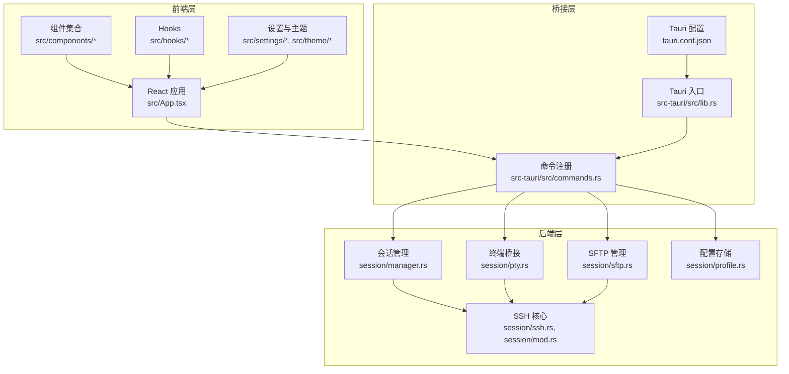
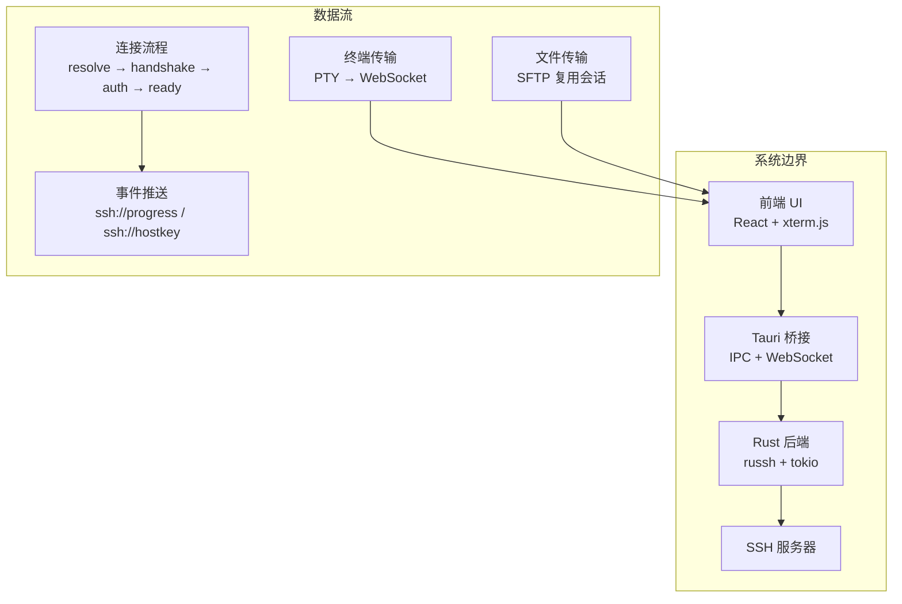
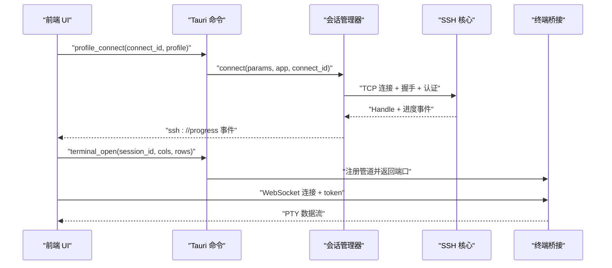
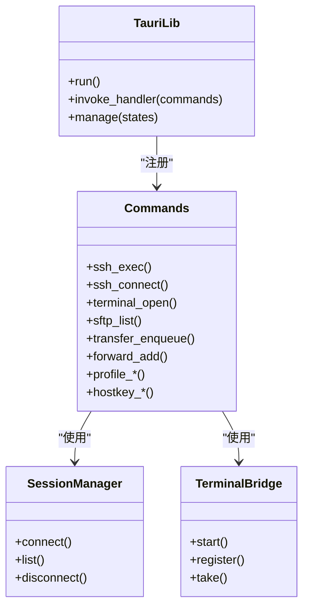
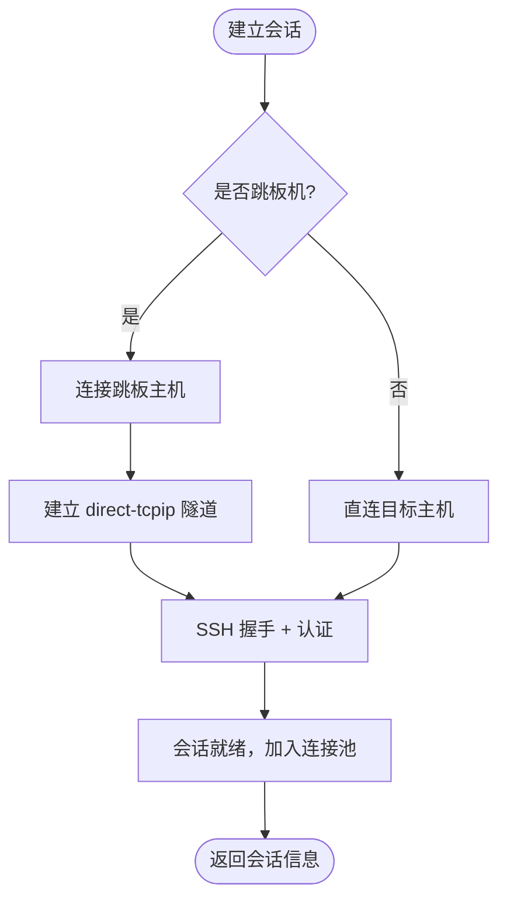
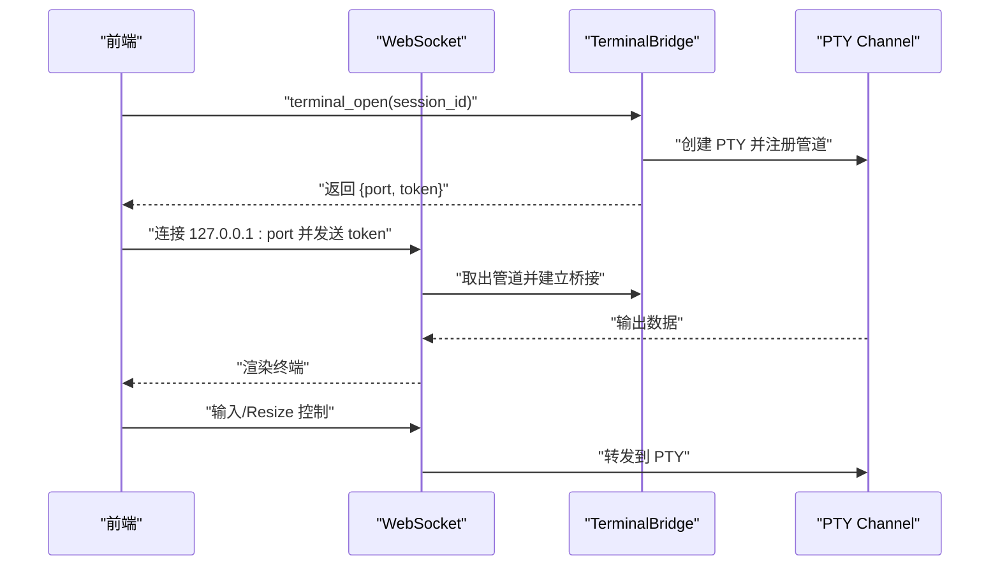
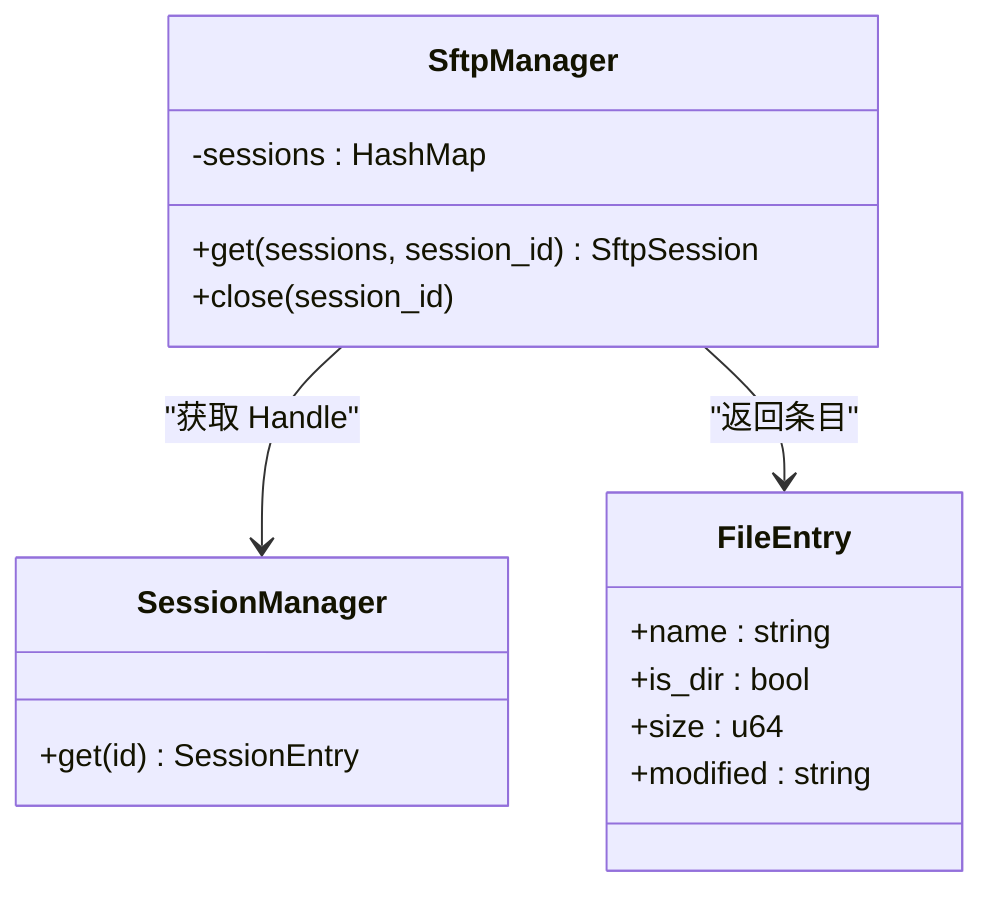
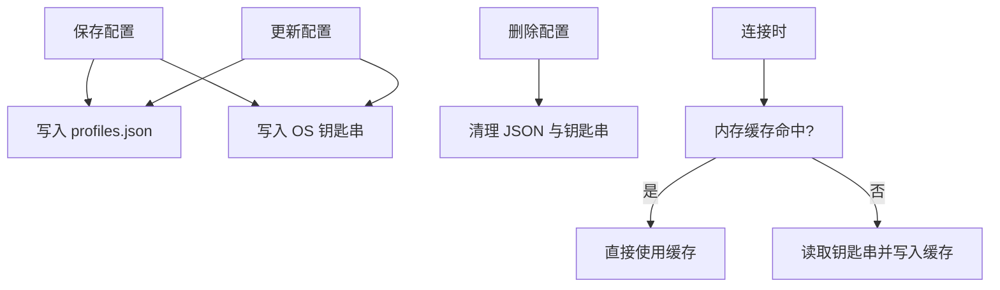
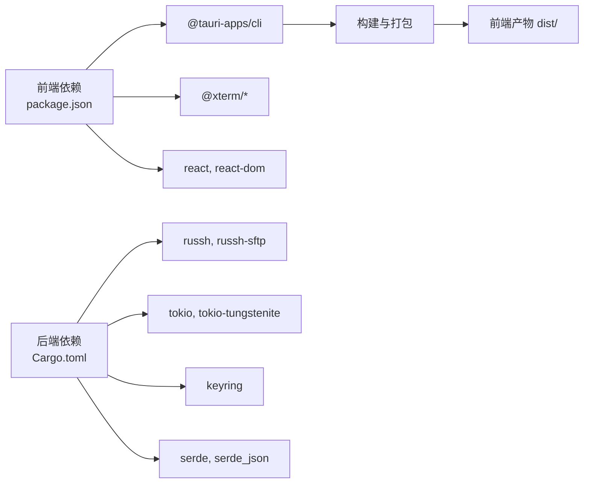

# 整体架构概览

<cite>
**本文档引用的文件**
- [README.md](file://README.md)
- [docs/DESIGN.md](file://docs/DESIGN.md)
- [src/main.tsx](file://src/main.tsx)
- [src/App.tsx](file://src/App.tsx)
- [src-tauri/Cargo.toml](file://src-tauri/Cargo.toml)
- [src-tauri/tauri.conf.json](file://src-tauri/tauri.conf.json)
- [src-tauri/src/lib.rs](file://src-tauri/src/lib.rs)
- [src-tauri/src/commands.rs](file://src-tauri/src/commands.rs)
- [src-tauri/src/session/mod.rs](file://src-tauri/src/session/mod.rs)
- [src-tauri/src/session/manager.rs](file://src-tauri/src/session/manager.rs)
- [src-tauri/src/session/pty.rs](file://src-tauri/src/session/pty.rs)
- [src-tauri/src/session/sftp.rs](file://src-tauri/src/session/sftp.rs)
- [src-tauri/src/session/profile.rs](file://src-tauri/src/session/profile.rs)
- [src-tauri/src/session/ssh.rs](file://src-tauri/src/session/ssh.rs)
- [package.json](file://package.json)
</cite>

## 目录
1. [简介](#简介)
2. [项目结构](#项目结构)
3. [核心组件](#核心组件)
4. [架构总览](#架构总览)
5. [详细组件分析](#详细组件分析)
6. [依赖关系分析](#依赖关系分析)
7. [性能考量](#性能考量)
8. [故障排查指南](#故障排查指南)
9. [结论](#结论)

## 简介
本项目是一个将终端与文件管理器合二为一的轻量级 SSH 客户端，采用三层架构设计：
- 前端 React 应用层：负责用户界面、交互逻辑与状态管理
- Tauri 桥接层：负责前端与后端 Rust 服务之间的 IPC 通信与能力暴露
- 后端 Rust 服务层：负责 SSH 连接、会话管理、终端传输、文件传输等核心业务

该架构通过 Tauri 将 React 前端与 Rust 后端无缝集成，既保持了前端的开发体验，又利用 Rust 的高性能与安全性。

## 项目结构
项目采用前后端分离的模块化组织方式，主要目录如下：
- src：前端 React 应用，包含组件、Hooks、主题与工具函数
- src-tauri：Rust 后端，包含 Tauri 入口、命令定义与会话管理等模块
- docs：设计文档与路线图
- public：静态资源
- 根目录配置文件：构建脚本、依赖声明与项目配置

**图表来源**
- [src-tauri/src/lib.rs:14-92](file://src-tauri/src/lib.rs#L14-L92)
- [src-tauri/src/commands.rs:43-89](file://src-tauri/src/commands.rs#L43-L89)
- [src-tauri/src/session/manager.rs:77-145](file://src-tauri/src/session/manager.rs#L77-L145)
- [src-tauri/src/session/pty.rs:47-85](file://src-tauri/src/session/pty.rs#L47-L85)
- [src-tauri/src/session/sftp.rs:25-75](file://src-tauri/src/session/sftp.rs#L25-L75)
- [src-tauri/src/session/profile.rs:67-128](file://src-tauri/src/session/profile.rs#L67-L128)

**章节来源**
- [README.md:100-135](file://README.md#L100-L135)
- [src-tauri/Cargo.toml:1-50](file://src-tauri/Cargo.toml#L1-L50)
- [src-tauri/tauri.conf.json:1-54](file://src-tauri/tauri.conf.json#L1-L54)

## 核心组件
- 前端应用入口与状态管理：负责连接状态、会话列表、标签页管理、工作区持久化与自动重连策略
- Tauri 命令系统：统一暴露后端能力给前端，包括 SSH 连接、终端 PTY、SFTP 文件操作、传输队列、端口转发、配置管理等
- 会话管理器：维护持久 SSH 连接池，支持跳板机、断线重连与连接进度事件推送
- 终端桥接：通过本地 WebSocket 提供低延迟的 PTY 传输通道
- SFTP 管理：在现有会话上复用 SSH 连接进行文件浏览与传输
- 配置存储：本地 JSON 存储连接配置，凭据通过 OS 钥匙串安全保存

**章节来源**
- [src/App.tsx:60-135](file://src/App.tsx#L60-L135)
- [src-tauri/src/lib.rs:43-89](file://src-tauri/src/lib.rs#L43-L89)
- [src-tauri/src/session/manager.rs:77-145](file://src-tauri/src/session/manager.rs#L77-L145)
- [src-tauri/src/session/pty.rs:47-85](file://src-tauri/src/session/pty.rs#L47-L85)
- [src-tauri/src/session/sftp.rs:25-75](file://src-tauri/src/session/sftp.rs#L25-L75)
- [src-tauri/src/session/profile.rs:67-128](file://src-tauri/src/session/profile.rs#L67-L128)

## 架构总览
本项目采用“前端 React + Tauri 桥接 + Rust 后端”的三层架构，核心设计理念包括：
- 分层解耦：前端专注 UI 与交互，后端专注网络与协议处理，桥接层负责能力暴露与 IPC
- 复用共享：终端与 SFTP 复用同一 SSH 会话，减少连接与认证开销
- 安全优先：凭据存储于 OS 钥匙串，配置文件本地化，支持主机公钥校验与 TOFU
- 性能优化：终端通过本地 WebSocket 传输，文件传输采用队列与进度事件，异步运行时基于 tokio

**图表来源**
- [docs/DESIGN.md:26-40](file://docs/DESIGN.md#L26-L40)
- [src-tauri/src/session/manager.rs:31-48](file://src-tauri/src/session/manager.rs#L31-L48)
- [src-tauri/src/session/pty.rs:87-141](file://src-tauri/src/session/pty.rs#L87-L141)
- [src-tauri/src/session/sftp.rs:30-75](file://src-tauri/src/session/sftp.rs#L30-L75)

**章节来源**
- [docs/DESIGN.md:26-40](file://docs/DESIGN.md#L26-L40)
- [README.md:19-40](file://README.md#L19-L40)

## 详细组件分析

### 前端应用层
- 应用壳与工作区：负责侧边栏、标签页、主工作区与状态栏的组合与布局
- 会话与连接：通过 invoke 调用后端命令建立持久会话，监听连接进度与主机公钥事件
- 自动重连：基于配置与指数退避策略实现断线自动重连
- 文件与终端：根据活动标签页动态渲染终端、SFTP、监控、编辑器等面板

**图表来源**
- [src/App.tsx:312-336](file://src/App.tsx#L312-L336)
- [src-tauri/src/commands.rs:618-636](file://src-tauri/src/commands.rs#L618-L636)
- [src-tauri/src/session/manager.rs:82-145](file://src-tauri/src/session/manager.rs#L82-L145)
- [src-tauri/src/session/pty.rs:75-85](file://src-tauri/src/session/pty.rs#L75-L85)

**章节来源**
- [src/App.tsx:60-135](file://src/App.tsx#L60-L135)
- [src/App.tsx:312-388](file://src/App.tsx#L312-L388)

### Tauri 桥接层
- 命令注册：集中暴露 SSH、终端、SFTP、传输、转发、配置、监控等命令
- 状态管理：注入会话管理器、SFTP 管理器、配置存储、传输队列、转发管理器、主机公钥验证器等
- WebSocket 服务：启动本地终端桥接服务，提供 PTY 数据传输通道

**图表来源**
- [src-tauri/src/lib.rs:20-91](file://src-tauri/src/lib.rs#L20-L91)
- [src-tauri/src/commands.rs:43-89](file://src-tauri/src/commands.rs#L43-L89)
- [src-tauri/src/session/pty.rs:47-85](file://src-tauri/src/session/pty.rs#L47-L85)

**章节来源**
- [src-tauri/src/lib.rs:14-92](file://src-tauri/src/lib.rs#L14-L92)
- [src-tauri/src/commands.rs:23-89](file://src-tauri/src/commands.rs#L23-L89)

### 后端 Rust 服务层

#### 会话管理器
- 持久连接池：维护多个 SSH 会话，支持直连与跳板机场景
- 连接进度：分阶段推送连接进度事件，便于前端展示
- 断线处理：支持断线重连与资源清理

**图表来源**
- [src-tauri/src/session/manager.rs:82-145](file://src-tauri/src/session/manager.rs#L82-L145)
- [src-tauri/src/session/manager.rs:147-217](file://src-tauri/src/session/manager.rs#L147-L217)

**章节来源**
- [src-tauri/src/session/manager.rs:77-145](file://src-tauri/src/session/manager.rs#L77-L145)

#### 终端桥接
- 本地 WebSocket：启动随机端口的本地 WebSocket 服务
- 管道注册：为每个终端会话生成一次性 token，建立输入/输出管道映射
- 数据传输：将 PTY 数据通过 WebSocket 低延迟传输到前端

**图表来源**
- [src-tauri/src/session/pty.rs:75-85](file://src-tauri/src/session/pty.rs#L75-L85)
- [src-tauri/src/session/pty.rs:87-141](file://src-tauri/src/session/pty.rs#L87-L141)

**章节来源**
- [src-tauri/src/session/pty.rs:47-85](file://src-tauri/src/session/pty.rs#L47-L85)
- [src-tauri/src/session/pty.rs:87-141](file://src-tauri/src/session/pty.rs#L87-L141)

#### SFTP 管理
- 会话复用：在现有 SSH 会话上打开 SFTP subsystem channel
- 缓存机制：按会话 ID 缓存 SFTP 会话，避免重复创建
- 目录操作：提供列表、创建、重命名、删除等基础操作

**图表来源**
- [src-tauri/src/session/sftp.rs:25-75](file://src-tauri/src/session/sftp.rs#L25-L75)
- [src-tauri/src/session/sftp.rs:87-123](file://src-tauri/src/session/sftp.rs#L87-L123)

**章节来源**
- [src-tauri/src/session/sftp.rs:25-75](file://src-tauri/src/session/sftp.rs#L25-L75)
- [src-tauri/src/session/sftp.rs:87-123](file://src-tauri/src/session/sftp.rs#L87-L123)

#### 配置存储
- 本地 JSON：存储连接配置元数据（名称、主机、端口、用户、认证方式等）
- OS 钥匙串：安全存储密码与私钥口令，避免明文落盘
- 内存缓存：24 小时内重复连接命中内存缓存，减少钥匙串访问

**图表来源**
- [src-tauri/src/session/profile.rs:102-128](file://src-tauri/src/session/profile.rs#L102-L128)
- [src-tauri/src/session/profile.rs:316-341](file://src-tauri/src/session/profile.rs#L316-L341)

**章节来源**
- [src-tauri/src/session/profile.rs:67-128](file://src-tauri/src/session/profile.rs#L67-L128)
- [src-tauri/src/session/profile.rs:316-341](file://src-tauri/src/session/profile.rs#L316-L341)

## 依赖关系分析
- 前端依赖：React 19、TypeScript、@xterm/xterm、@xterm/addon-*、@tauri-apps/* 等
- 后端依赖：russh、russh-sftp、tokio、tokio-tungstenite、keyring、serde 等
- 构建与打包：Vite、Tauri CLI、Cargo

**图表来源**
- [package.json:28-43](file://package.json#L28-L43)
- [src-tauri/Cargo.toml:22-49](file://src-tauri/Cargo.toml#L22-L49)

**章节来源**
- [package.json:1-53](file://package.json#L1-L53)
- [src-tauri/Cargo.toml:1-50](file://src-tauri/Cargo.toml#L1-L50)

## 性能考量
- 终端传输：通过本地 WebSocket 降低延迟，避免 Electron 重框架带来的性能损耗
- 连接复用：终端与 SFTP 共享同一 SSH 会话，减少认证与握手开销
- 异步模型：基于 tokio 的异步运行时，充分利用 I/O 并发
- 事件驱动：连接进度与主机公钥事件通过事件推送，前端无需轮询
- 断线重连：指数退避策略与自动重连，提升用户体验

## 故障排查指南
- 连接超时：检查网络连通性与超时配置，关注 TCP、握手与认证阶段的错误信息
- 主机公钥问题：首次连接会触发 TOFU，公钥变更会被拦截，需在前端确认或删除已知主机记录
- 传输失败：检查本地文件权限与远程路径有效性，查看传输队列状态与错误日志
- 终端无响应：确认 WebSocket 连接是否成功，token 是否正确传递，PTY 管道是否注册

**章节来源**
- [src-tauri/src/session/manager.rs:255-273](file://src-tauri/src/session/manager.rs#L255-L273)
- [src-tauri/src/session/manager.rs:275-316](file://src-tauri/src/session/manager.rs#L275-L316)
- [src-tauri/src/commands.rs:768-800](file://src-tauri/src/commands.rs#L768-L800)

## 结论
本项目通过清晰的三层架构实现了高性能、安全可靠的 SSH 客户端。前端专注于用户体验，后端专注于协议与数据处理，桥接层提供稳定的能力暴露与通信通道。该架构在保证功能完整性的同时，兼顾了性能与可维护性，适合长期演进与扩展。