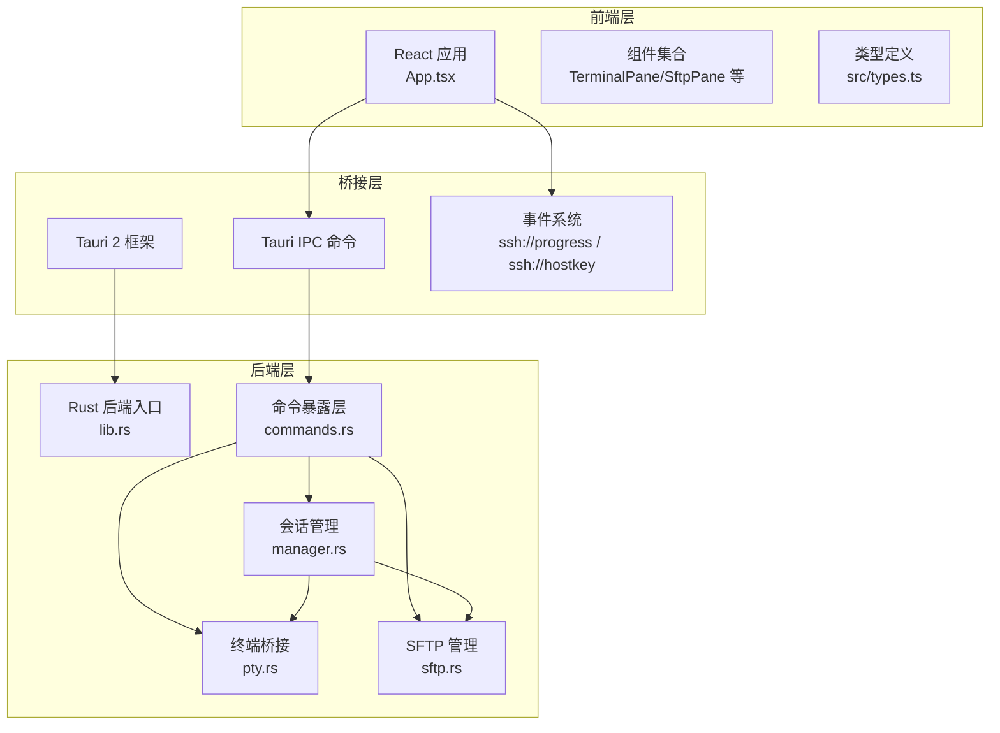
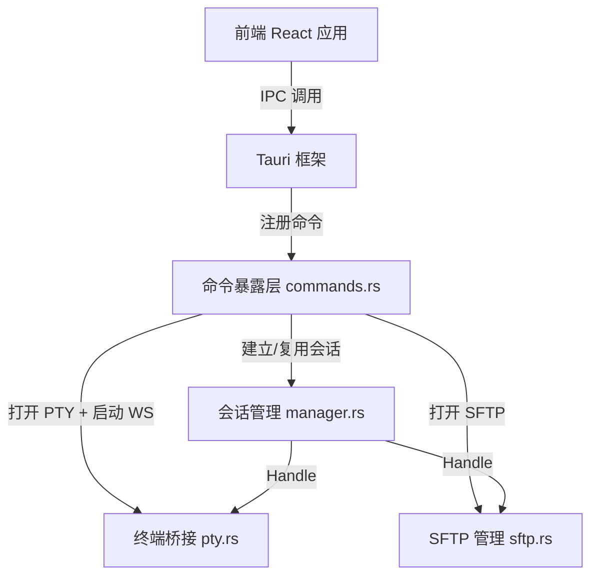
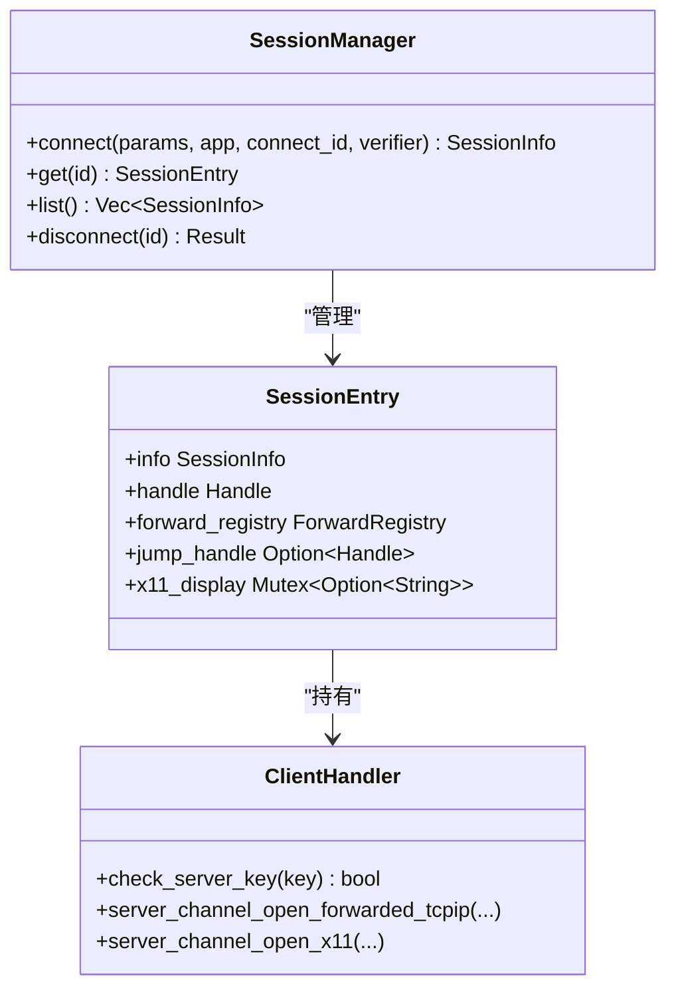
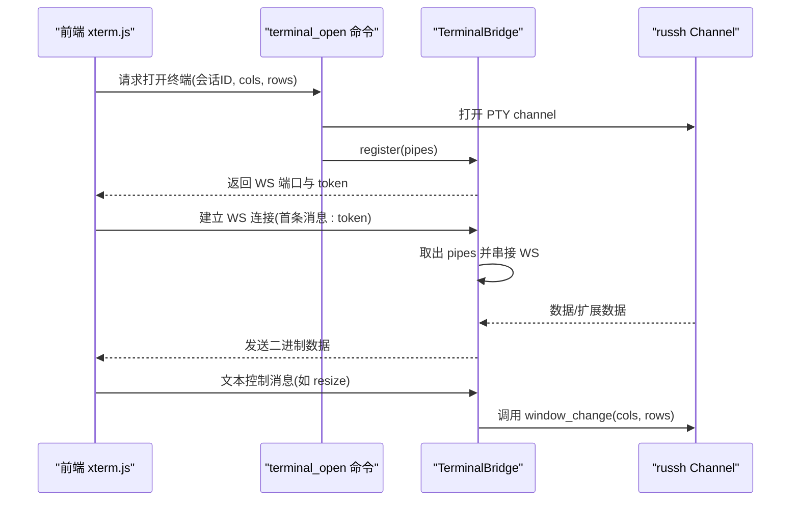
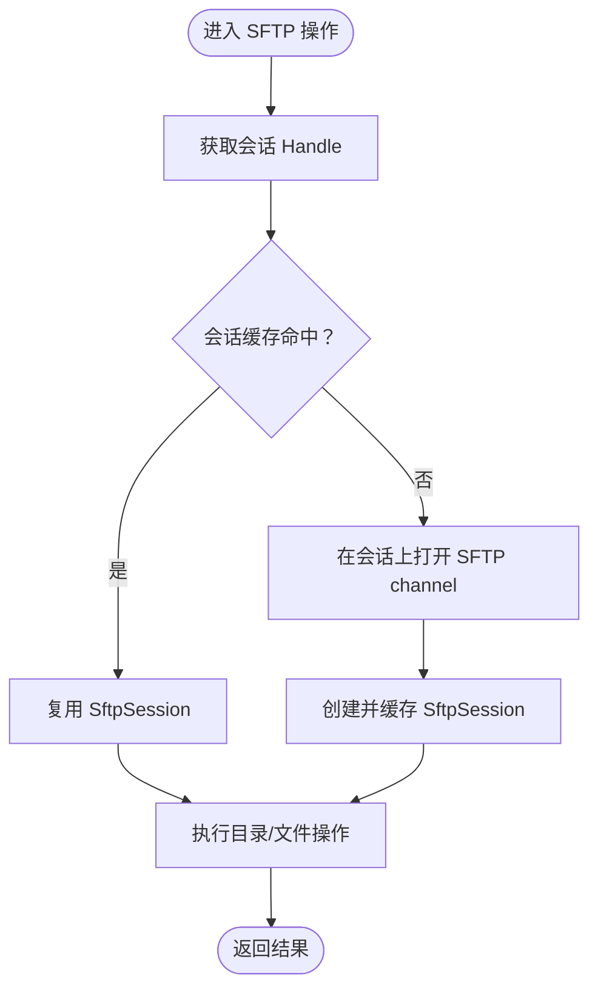
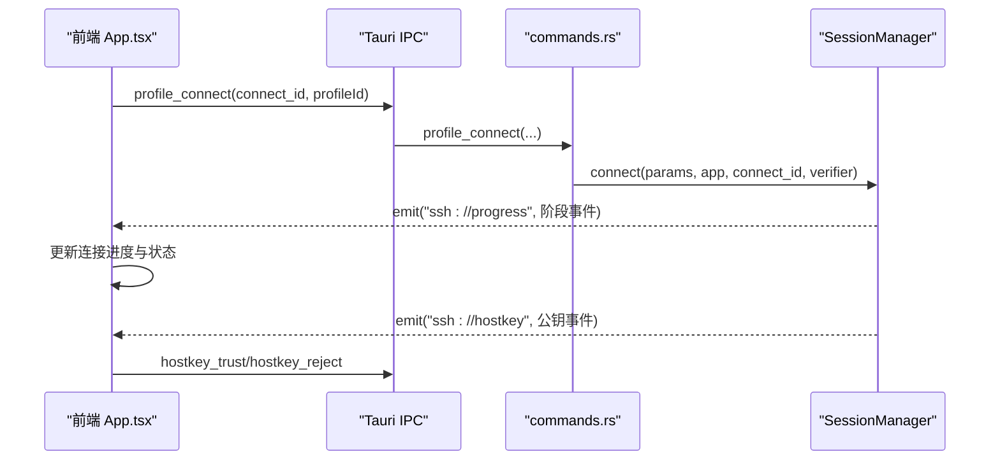
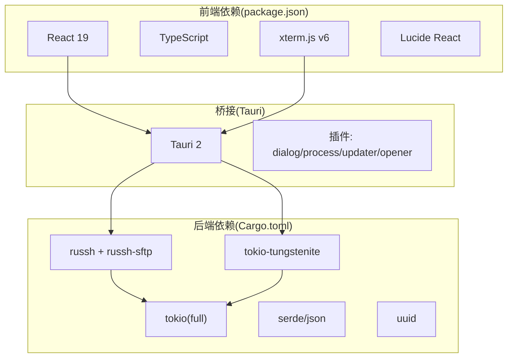

# 架构设计

<cite>
**本文档引用的文件**
- [README.md](file://README.md)
- [docs/DESIGN.md](file://docs/DESIGN.md)
- [src-tauri/Cargo.toml](file://src-tauri/Cargo.toml)
- [package.json](file://package.json)
- [src-tauri/tauri.conf.json](file://src-tauri/tauri.conf.json)
- [src-tauri/src/main.rs](file://src-tauri/src/main.rs)
- [src-tauri/src/lib.rs](file://src-tauri/src/lib.rs)
- [src-tauri/src/commands.rs](file://src-tauri/src/commands.rs)
- [src-tauri/src/session/mod.rs](file://src-tauri/src/session/mod.rs)
- [src-tauri/src/session/manager.rs](file://src-tauri/src/session/manager.rs)
- [src-tauri/src/session/pty.rs](file://src-tauri/src/session/pty.rs)
- [src-tauri/src/session/sftp.rs](file://src-tauri/src/session/sftp.rs)
- [src/App.tsx](file://src/App.tsx)
- [src/types.ts](file://src/types.ts)
</cite>

## 目录
1. [引言](#引言)
2. [项目结构](#项目结构)
3. [核心组件](#核心组件)
4. [架构总览](#架构总览)
5. [详细组件分析](#详细组件分析)
6. [依赖关系分析](#依赖关系分析)
7. [性能考量](#性能考量)
8. [故障排查指南](#故障排查指南)
9. [结论](#结论)
10. [附录](#附录)

## 引言
本项目旨在打造一个“Xshell + Xftp”的轻量合体 SSH 客户端，将交互式终端与 SFTP 文件管理器整合在同一窗口中，共享同一条 SSH 连接，实现低资源占用与高一致性体验。整体采用分层架构：前端 React 应用层负责用户界面与交互；Tauri 桥接层提供跨平台桌面能力与系统集成；后端 Rust 服务层承载 SSH 协议、会话管理、终端与文件传输等核心逻辑。

技术选型与权衡：
- Rust + Tauri：兼顾性能与跨平台，避免 Electron 的重型开销，系统 WebView 不打包 Chromium，内存与体积显著降低。
- Russh + russh-sftp：纯 Rust 实现，异步生态完善，与项目语言栈契合，便于深度优化与维护。
- xterm.js：成熟的 Web 终端渲染引擎，支持 WebGL 加速与完整 PTY，适配 vim/htop/tmux 等工具链。
- WebSocket 传输：将 PTY 数据流从主 UI 线程分离，降低阻塞风险，提升交互流畅度。

## 项目结构
项目采用前后端分层与模块化组织：
- 前端（src/）：React 19 + TypeScript，组件化 UI，状态与工作区持久化，命令面板与快捷键体系。
- 后端（src-tauri/）：Rust 2021，Tauri 2 Builder，命令暴露层、会话管理、终端桥接、SFTP 管理、传输队列、端口转发、主机公钥校验、工作区与监控等模块。
- 配置与构建：package.json（前端依赖与脚本）、Cargo.toml（Rust 依赖与特性）、tauri.conf.json（应用配置与打包策略）。

图表来源
- [src-tauri/src/lib.rs:14-92](file://src-tauri/src/lib.rs#L14-L92)
- [src-tauri/src/commands.rs:23-89](file://src-tauri/src/commands.rs#L23-L89)
- [src-tauri/src/session/manager.rs:76-145](file://src-tauri/src/session/manager.rs#L76-L145)
- [src-tauri/src/session/pty.rs:41-86](file://src-tauri/src/session/pty.rs#L41-L86)
- [src-tauri/src/session/sftp.rs:24-75](file://src-tauri/src/session/sftp.rs#L24-L75)
- [src/App.tsx:136-160](file://src/App.tsx#L136-L160)

章节来源
- [README.md:100-135](file://README.md#L100-L135)
- [docs/DESIGN.md:26-37](file://docs/DESIGN.md#L26-L37)

## 核心组件
- 前端应用（App.tsx）：负责工作区布局（侧栏、标签页、主面板、状态栏）、事件监听（连接进度、主机公钥确认）、会话与配置刷新、自动重连与错误提示。
- Tauri 命令层（commands.rs）：薄封装后端能力，暴露给前端调用，涵盖 SSH 连接、终端打开、SFTP 列表/读写、传输队列、端口转发、配置与分组管理、主机公钥处理、工作区持久化等。
- 会话管理（session/manager.rs）：维护持久 SSH 会话池，统一连接生命周期与超时控制，向终端与 SFTP 复用同一 Handle。
- 终端桥接（session/pty.rs）：在会话上开 PTY channel，通过本地 WebSocket 提供低延迟流式传输，前端 xterm.js 通过 token 建立连接。
- SFTP 管理（session/sftp.rs）：在已有会话上打开 SFTP subsystem，复用连接，提供目录浏览与文件读写。
- 类型系统（src/types.ts）：前后端共享的数据契约，定义会话、配置、分屏布局、传输任务、端口转发、主机公钥事件、监控快照等。

章节来源
- [src/App.tsx:60-126](file://src/App.tsx#L60-L126)
- [src-tauri/src/commands.rs:23-89](file://src-tauri/src/commands.rs#L23-L89)
- [src-tauri/src/session/manager.rs:76-145](file://src-tauri/src/session/manager.rs#L76-L145)
- [src-tauri/src/session/pty.rs:41-86](file://src-tauri/src/session/pty.rs#L41-L86)
- [src-tauri/src/session/sftp.rs:24-75](file://src-tauri/src/session/sftp.rs#L24-L75)
- [src/types.ts:1-209](file://src/types.ts#L1-L209)

## 架构总览
系统边界与集成点：
- 系统边界：前端通过 Tauri IPC 与 WebSocket 与后端交互；后端通过 Russh 与远端 SSH/SFTP 服务通信；系统能力通过 Tauri 插件访问（对话框、进程、更新器、打开器等）。
- 集成点：会话池统一管理 Handle；终端桥接将 PTY 数据流从 UI 线程解耦；SFTP 复用同一连接；事件系统推送连接进度与主机公钥确认请求。

图表来源
- [src-tauri/src/lib.rs:43-89](file://src-tauri/src/lib.rs#L43-L89)
- [src-tauri/src/commands.rs:42-95](file://src-tauri/src/commands.rs#L42-L95)
- [src-tauri/src/session/manager.rs:82-145](file://src-tauri/src/session/manager.rs#L82-L145)
- [src-tauri/src/session/pty.rs:47-86](file://src-tauri/src/session/pty.rs#L47-L86)
- [src-tauri/src/session/sftp.rs:30-75](file://src-tauri/src/session/sftp.rs#L30-L75)

## 详细组件分析

### 会话管理（SessionManager）
职责与设计要点：
- 统一连接生命周期：支持直连与跳板机（ProxyJump）两种路径，分别建立 jump_handle 与 target_handle，并在断开时一并清理。
- 分阶段进度：通过事件系统推送连接阶段（解析、握手、认证、跳板、就绪），前端展示进度与超时。
- 超时与稳定性：TCP 建连、SSH 握手、认证均设置 TTL，避免长时间阻塞；未知主机与公钥变更通过交互式校验中断握手，等待前端确认。

图表来源
- [src-tauri/src/session/manager.rs:76-145](file://src-tauri/src/session/manager.rs#L76-L145)
- [src-tauri/src/session/mod.rs:52-113](file://src-tauri/src/session/mod.rs#L52-L113)

章节来源
- [src-tauri/src/session/manager.rs:82-145](file://src-tauri/src/session/manager.rs#L82-L145)
- [src-tauri/src/session/mod.rs:52-113](file://src-tauri/src/session/mod.rs#L52-L113)

### 终端桥接（TerminalBridge）
职责与设计要点：
- PTY 通道与 WebSocket：在指定会话上打开 PTY channel，启动本地 WebSocket 服务，前端通过 token 建立连接，实现 UI 线程与数据流的解耦。
- 管道中转：russh Channel 类型参数未导出，使用 mpsc 管道作为桥接，避免类型约束问题。
- 控制消息：前端发送 resize 等控制消息，桥接任务转换为 channel.window_change 调用。

图表来源
- [src-tauri/src/commands.rs:106-186](file://src-tauri/src/commands.rs#L106-L186)
- [src-tauri/src/session/pty.rs:75-142](file://src-tauri/src/session/pty.rs#L75-L142)

章节来源
- [src-tauri/src/commands.rs:106-186](file://src-tauri/src/commands.rs#L106-L186)
- [src-tauri/src/session/pty.rs:41-86](file://src-tauri/src/session/pty.rs#L41-L86)

### SFTP 管理（SftpManager）
职责与设计要点：
- 复用连接：在已有会话上打开 SFTP subsystem channel，避免重复认证与连接成本。
- 缓存策略：按会话 ID 缓存 SftpSession，命中则直接复用，未命中则创建并缓存。
- 目录与文件操作：提供目录浏览、创建、重命名、删除、读写等基础能力，配合传输队列实现高效文件管理。

图表来源
- [src-tauri/src/session/sftp.rs:30-75](file://src-tauri/src/session/sftp.rs#L30-L75)

章节来源
- [src-tauri/src/session/sftp.rs:30-75](file://src-tauri/src/session/sftp.rs#L30-L75)

### 前端工作区与事件驱动
职责与设计要点：
- 工作区持久化：侧栏连接库、标签页布局、活动标签等状态在前端持久化，支持启动恢复与自动保存。
- 事件驱动：通过事件系统接收连接进度与主机公钥确认请求，动态更新 UI 并触发重连流程。
- 自动重连：基于配置与指数退避策略，在断线后尝试自动重连，避免频繁弹窗。

图表来源
- [src/App.tsx:136-160](file://src/App.tsx#L136-L160)
- [src-tauri/src/commands.rs:618-636](file://src-tauri/src/commands.rs#L618-L636)
- [src-tauri/src/session/manager.rs:39-48](file://src-tauri/src/session/manager.rs#L39-L48)

章节来源
- [src/App.tsx:136-160](file://src/App.tsx#L136-L160)
- [src/App.tsx:338-408](file://src/App.tsx#L338-L408)
- [src-tauri/src/commands.rs:618-636](file://src-tauri/src/commands.rs#L618-L636)

## 依赖关系分析
技术栈与依赖：
- 前端：React 19、TypeScript、xterm.js v6（WebGL）、Lucide React、Tailwind 等。
- 后端：Rust 生态（tokio、russh、russh-sftp、tokio-tungstenite、serde、uuid 等）。
- 桥接：Tauri 2（系统 WebView、插件体系）。

图表来源
- [package.json:28-43](file://package.json#L28-L43)
- [src-tauri/Cargo.toml:22-49](file://src-tauri/Cargo.toml#L22-L49)
- [src-tauri/tauri.conf.json:45-52](file://src-tauri/tauri.conf.json#L45-L52)

章节来源
- [package.json:28-43](file://package.json#L28-L43)
- [src-tauri/Cargo.toml:22-49](file://src-tauri/Cargo.toml#L22-L49)
- [src-tauri/tauri.conf.json:45-52](file://src-tauri/tauri.conf.json#L45-L52)

## 性能考量
- 低延迟终端传输：通过本地 WebSocket 与 mpsc 管道，将 PTY 数据流与 UI 线程解耦，避免主线程阻塞。
- 连接复用与缓存：会话池与 SFTP 缓存减少重复握手与认证成本，提升多标签页场景下的响应速度。
- 事件驱动与异步：Tokio 全栈异步运行时，结合超时与阶段进度，保障长连接的稳定与可观测性。
- 资源占用控制：Rust 后端 + Tauri 系统 WebView，目标内存与安装包体积显著低于 Electron 系方案。

## 故障排查指南
常见问题与定位建议：
- 连接超时/失败：检查网络连通性与主机可达性；关注前端进度事件与后端超时日志；必要时调整超时阈值。
- 主机公钥未知/变更：前端会收到 ssh://hostkey 事件，需用户确认；若拒绝，连接不会建立；可通过 hostkey_reject 清理并重新发起连接。
- 终端无输出/卡顿：确认 WebSocket 连接正常、token 正确；检查 resize 控制消息是否正确下发；查看桥接任务是否仍在运行。
- SFTP 读写异常：确认会话存在且 Handle 有效；检查路径合法性与权限；关注 SFTP 缓存是否命中。

章节来源
- [src-tauri/src/session/manager.rs:24-30](file://src-tauri/src/session/manager.rs#L24-L30)
- [src-tauri/src/commands.rs:772-790](file://src-tauri/src/commands.rs#L772-L790)
- [src-tauri/src/session/pty.rs:87-142](file://src-tauri/src/session/pty.rs#L87-L142)
- [src-tauri/src/session/sftp.rs:30-75](file://src-tauri/src/session/sftp.rs#L30-L75)

## 结论
本项目通过清晰的分层架构与合理的异步事件驱动模式，实现了“终端 + SFTP”的一体化体验。Rust + Tauri 的组合在性能与资源占用方面具备显著优势；Russh 与 russh-sftp 的纯 Rust 生态提供了良好的可维护性与扩展性；xterm.js 与 WebSocket 的组合确保了终端交互的流畅与稳定。未来可在端口转发、目录同步、系统监控、自动更新等方面持续演进，逐步完善产品能力。

## 附录
- 构建与运行：前端使用 Vite + Tauri CLI，后端通过 Tauri Builder 注册命令与状态管理；开发模式下前端 devUrl 指向本地 Vite 服务，构建时打包到 dist。
- 平台支持：macOS、Windows、Linux 三端统一构建，遵循 Tauri 2 的能力边界与安全模型。

章节来源
- [README.md:77-98](file://README.md#L77-L98)
- [src-tauri/tauri.conf.json:6-11](file://src-tauri/tauri.conf.json#L6-L11)
- [src-tauri/src/main.rs:4-6](file://src-tauri/src/main.rs#L4-L6)
- [src-tauri/src/lib.rs:14-42](file://src-tauri/src/lib.rs#L14-L42)