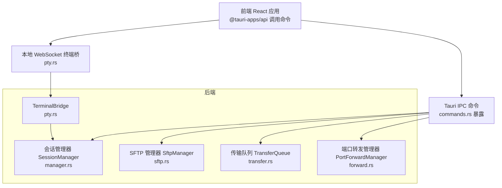
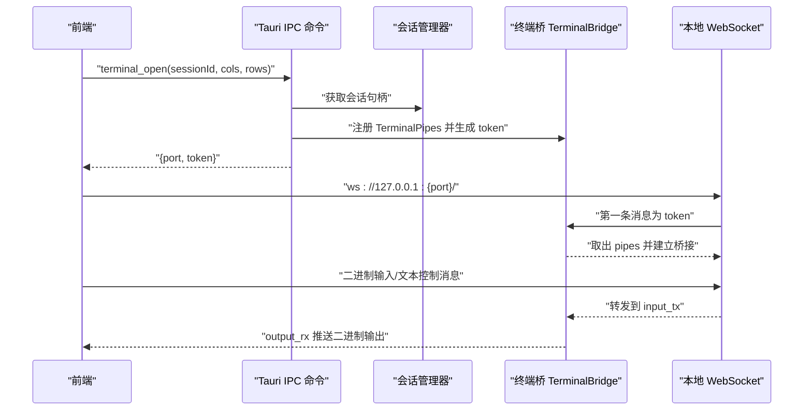
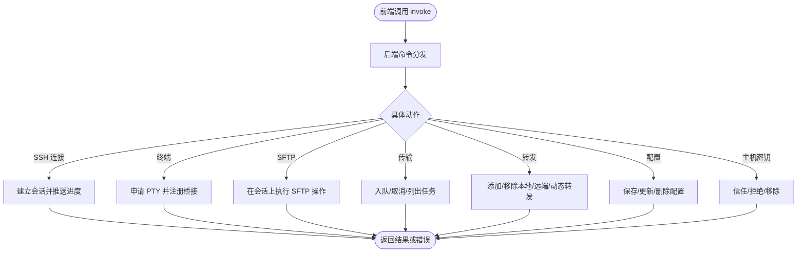
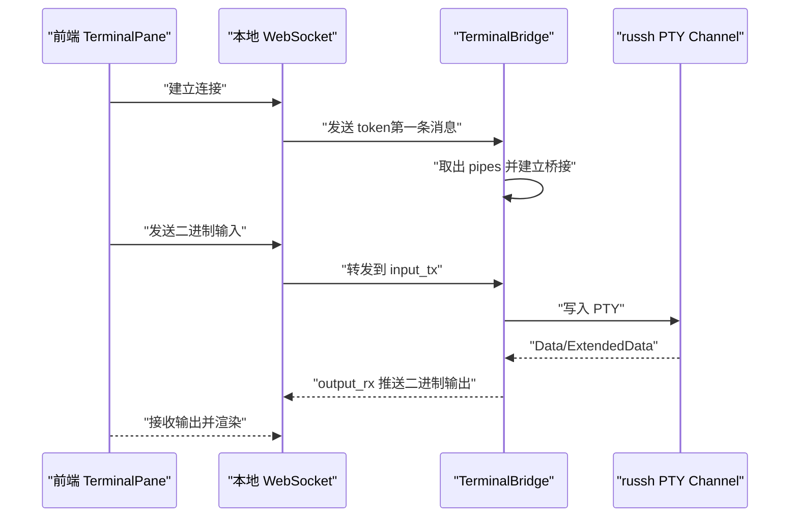
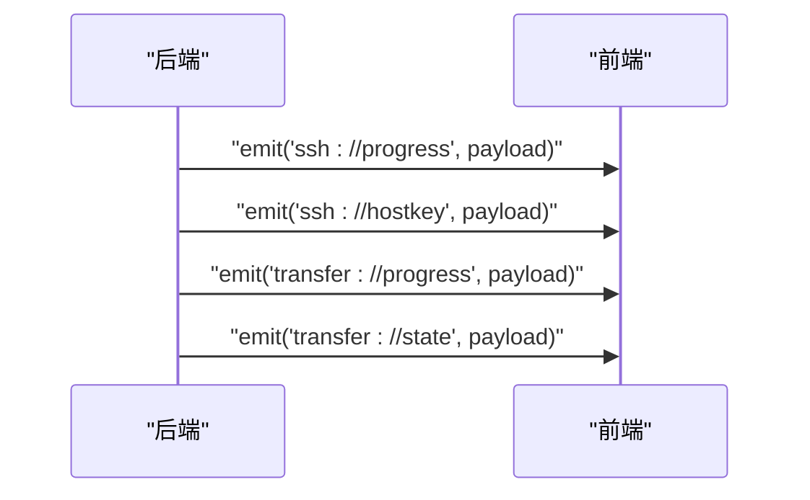
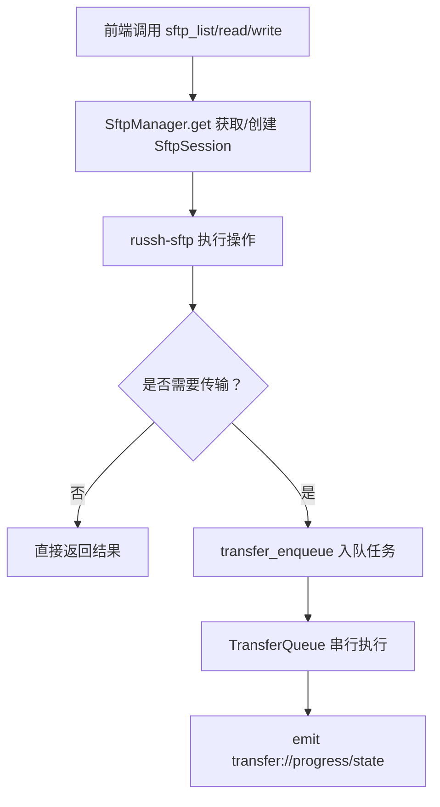
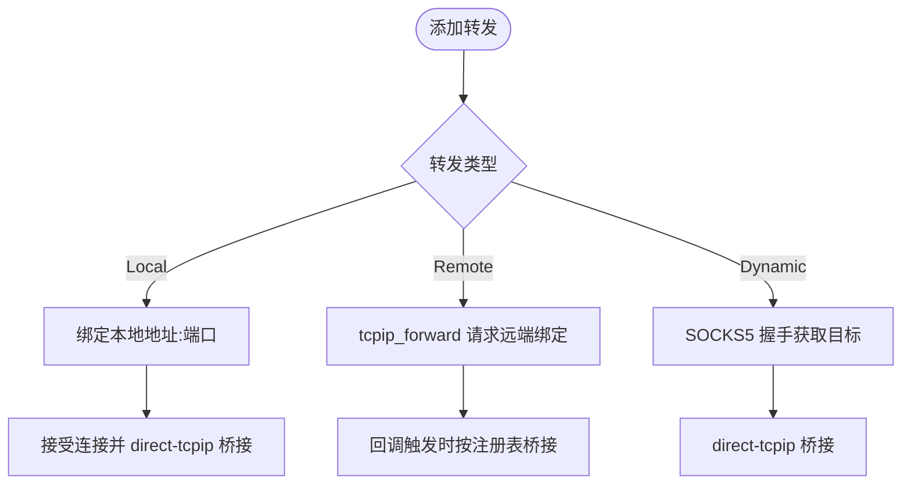
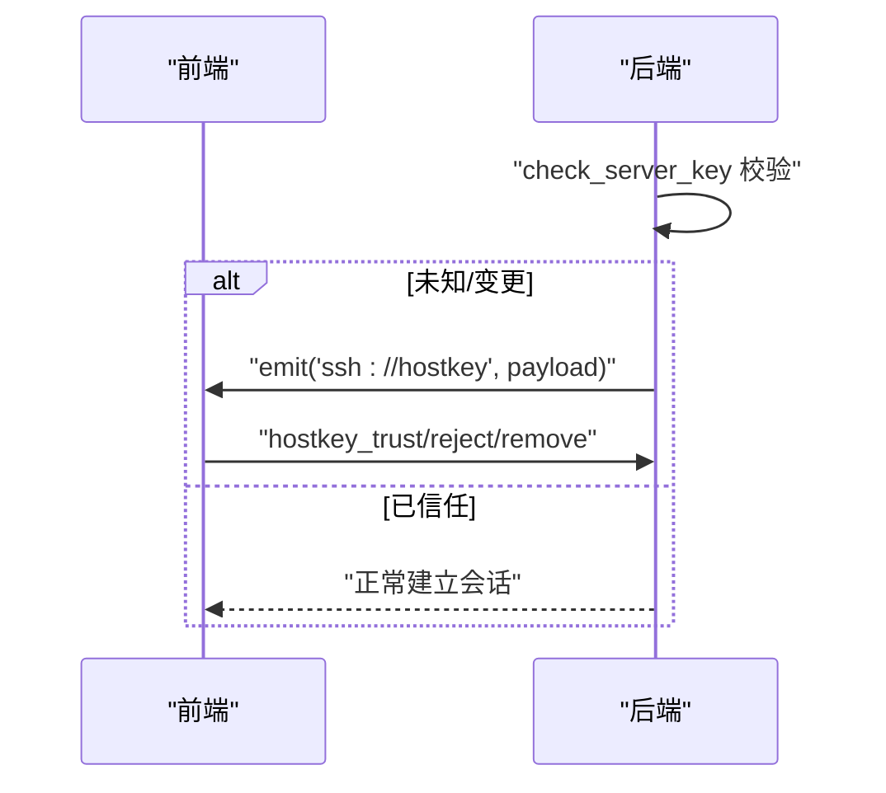
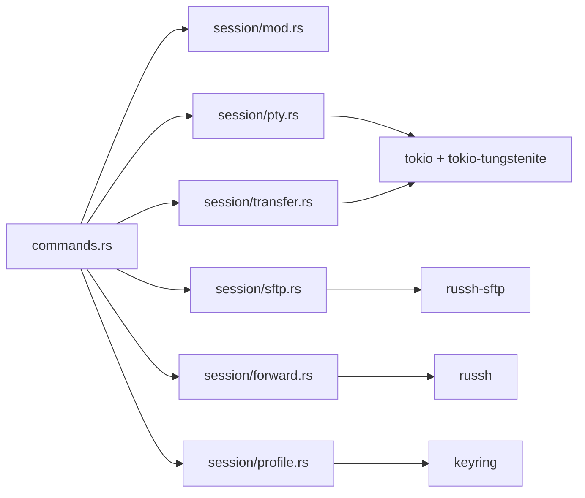

# 通信机制设计

<cite>
**本文档引用的文件**
- [src-tauri/src/lib.rs](file://src-tauri/src/lib.rs)
- [src-tauri/src/main.rs](file://src-tauri/src/main.rs)
- [src-tauri/src/commands.rs](file://src-tauri/src/commands.rs)
- [src-tauri/src/session/mod.rs](file://src-tauri/src/session/mod.rs)
- [src-tauri/src/session/pty.rs](file://src-tauri/src/session/pty.rs)
- [src-tauri/src/session/sftp.rs](file://src-tauri/src/session/sftp.rs)
- [src-tauri/src/session/manager.rs](file://src-tauri/src/session/manager.rs)
- [src-tauri/src/session/transfer.rs](file://src-tauri/src/session/transfer.rs)
- [src-tauri/src/session/forward.rs](file://src-tauri/src/session/forward.rs)
- [src-tauri/src/session/profile.rs](file://src-tauri/src/session/profile.rs)
- [src-tauri/Cargo.toml](file://src-tauri/Cargo.toml)
- [package.json](file://package.json)
- [src/components/TerminalPane.tsx](file://src/components/TerminalPane.tsx)
- [src/components/SftpPane.tsx](file://src/components/SftpPane.tsx)
- [src/types.ts](file://src/types.ts)
</cite>

## 目录
1. [引言](#引言)
2. [项目结构](#项目结构)
3. [核心组件](#核心组件)
4. [架构总览](#架构总览)
5. [详细组件分析](#详细组件分析)
6. [依赖关系分析](#依赖关系分析)
7. [性能考量](#性能考量)
8. [故障排查指南](#故障排查指南)
9. [结论](#结论)
10. [附录](#附录)

## 引言
本设计文档聚焦于前后端之间的多种通信方式与协议规范，涵盖：
- Tauri IPC 命令调用：后端暴露命令接口，前端通过 @tauri-apps/api 调用。
- WebSocket 数据传输：终端 PTY 通道通过本地 WebSocket 实现低延迟数据传输。
- 事件通知机制：后端通过 Tauri 事件系统向前端推送连接进度、传输进度与状态等。
- SFTP 数据流处理：基于会话复用的 SFTP 子系统，串行传输队列保障并发安全。
- 消息格式、协议规范、错误处理与重连机制、安全性与性能优化策略、调试方法。

## 项目结构
后端采用 Tauri 2 + Rust，前端使用 React + TypeScript。后端模块化组织，核心位于 src-tauri/src 下，前端组件位于 src/components。通信的关键在于：
- 后端通过 Tauri Builder 注册命令与状态管理器，并在应用启动时初始化本地 WebSocket 终端桥。
- 前端通过 @tauri-apps/api 的 invoke 调用后端命令，通过 WebSocket 与本地终端桥通信，通过事件监听接收后端推送。

**图表来源**
- [src-tauri/src/lib.rs:20-91](file://src-tauri/src/lib.rs#L20-L91)
- [src-tauri/src/commands.rs:1-996](file://src-tauri/src/commands.rs#L1-L996)
- [src-tauri/src/session/manager.rs:77-317](file://src-tauri/src/session/manager.rs#L77-L317)
- [src-tauri/src/session/sftp.rs:24-124](file://src-tauri/src/session/sftp.rs#L24-L124)
- [src-tauri/src/session/transfer.rs:121-483](file://src-tauri/src/session/transfer.rs#L121-L483)
- [src-tauri/src/session/forward.rs:117-295](file://src-tauri/src/session/forward.rs#L117-L295)
- [src-tauri/src/session/pty.rs:41-143](file://src-tauri/src/session/pty.rs#L41-L143)

**章节来源**
- [src-tauri/src/lib.rs:1-93](file://src-tauri/src/lib.rs#L1-L93)
- [src-tauri/src/main.rs:1-7](file://src-tauri/src/main.rs#L1-L7)
- [src-tauri/Cargo.toml:22-49](file://src-tauri/Cargo.toml#L22-L49)
- [package.json:28-52](file://package.json#L28-L52)

## 核心组件
- Tauri 命令层：commands.rs 暴露 SSH 连接、终端、SFTP、传输、端口转发、配置、主机密钥校验等命令。
- 会话管理层：manager.rs 提供持久会话池，复用 SSH 连接，支持跳板机与 X11 转发。
- 终端桥接：pty.rs 提供本地 WebSocket 服务，将 PTY 数据通过 mpsc 管道桥接到前端。
- SFTP 管理：sftp.rs 在现有会话上开启 SFTP 子系统，提供目录列表、文件读写等能力。
- 传输队列：transfer.rs 提供串行传输队列，支持取消、进度事件与状态快照。
- 端口转发：forward.rs 支持 -L/-R/-D 三种转发模式，本地监听与远端绑定。
- 配置存储：profile.rs 管理连接配置，凭据加密存储于系统钥匙串。

**章节来源**
- [src-tauri/src/commands.rs:1-996](file://src-tauri/src/commands.rs#L1-L996)
- [src-tauri/src/session/manager.rs:76-317](file://src-tauri/src/session/manager.rs#L76-L317)
- [src-tauri/src/session/pty.rs:41-143](file://src-tauri/src/session/pty.rs#L41-L143)
- [src-tauri/src/session/sftp.rs:24-124](file://src-tauri/src/session/sftp.rs#L24-L124)
- [src-tauri/src/session/transfer.rs:121-483](file://src-tauri/src/session/transfer.rs#L121-L483)
- [src-tauri/src/session/forward.rs:117-295](file://src-tauri/src/session/forward.rs#L117-L295)
- [src-tauri/src/session/profile.rs:67-419](file://src-tauri/src/session/profile.rs#L67-L419)

## 架构总览
后端启动时：
- 初始化会话管理器、SFTP 管理器、传输队列、端口转发、主机密钥验证器、工作区与监控等状态。
- 启动本地 WebSocket 终端桥，随机端口监听，仅绑定 127.0.0.1。
- 注册所有 Tauri 命令，前端通过 invoke 调用。

前端交互流程：
- 终端：invoke terminal_open 获取本地 WS 端口与一次性 token，建立 ws://127.0.0.1:port/，发送 token，随后二进制数据与控制消息（resize）在 WS 与 PTY 间流转。
- SFTP：invoke sftp_* 系列命令与后端交互，文件操作通过传输队列异步执行，进度通过事件推送。
- 事件：ssh://progress、ssh://hostkey、transfer://progress、transfer://state 等事件由后端推送。

**图表来源**
- [src-tauri/src/lib.rs:34-42](file://src-tauri/src/lib.rs#L34-L42)
- [src-tauri/src/commands.rs:106-186](file://src-tauri/src/commands.rs#L106-L186)
- [src-tauri/src/session/pty.rs:75-141](file://src-tauri/src/session/pty.rs#L75-L141)
- [src/components/TerminalPane.tsx:103-135](file://src/components/TerminalPane.tsx#L103-L135)

**章节来源**
- [src-tauri/src/lib.rs:20-91](file://src-tauri/src/lib.rs#L20-L91)
- [src/components/TerminalPane.tsx:19-149](file://src/components/TerminalPane.tsx#L19-L149)

## 详细组件分析

### Tauri IPC 命令调用
- 命令注册：后端在构建阶段集中注册所有命令，前端通过 @tauri-apps/api 的 invoke 调用。
- 典型命令：
  - ssh_connect：建立持久会话，推送连接进度事件 ssh://progress。
  - terminal_open：在指定会话上申请 PTY，返回本地 WS 端口与一次性 token。
  - sftp_*：目录列表、文件读写、新建/重命名/删除等。
  - transfer_*：入队、取消、列出传输任务，目录同步。
  - forward_*：添加/列出/移除端口转发。
  - profile_*：列出/保存/更新/删除连接配置，选择私钥。
  - hostkey_*：信任/拒绝/移除主机公钥。
- 错误处理：命令内部统一将错误转换为字符串返回，前端捕获并展示。

**图表来源**
- [src-tauri/src/lib.rs:43-89](file://src-tauri/src/lib.rs#L43-L89)
- [src-tauri/src/commands.rs:25-996](file://src-tauri/src/commands.rs#L25-L996)

**章节来源**
- [src-tauri/src/commands.rs:25-996](file://src-tauri/src/commands.rs#L25-L996)
- [package.json:31-39](file://package.json#L31-L39)

### WebSocket 终端传输（PTY 通道）
- 设计要点：
  - 后端在 127.0.0.1:0 随机端口启动本地 WebSocket 服务。
  - terminal_open 在指定会话上开启 PTY channel，创建一对 mpsc 管道（输入/输出/尺寸），注册到 TerminalBridge。
  - 前端连接 ws://127.0.0.1:{port}/，第一条消息必须是 token，之后二进制数据与控制消息（resize）在 WS 与 PTY 之间桥接。
  - 使用 mpsc 中转避免 russh Channel 类型参数无法命名与所有权问题。
- 协议细节：
  - 控制消息格式：{"type":"resize","cols":N,"rows":M}。
  - 数据消息：二进制字节流。
  - 生命周期：token 一次性使用，连接关闭后桥接断开。
- 低延迟特性：本地回环网络 + WebSocket 二进制帧 + mpsc 高效缓冲。

**图表来源**
- [src-tauri/src/session/pty.rs:87-141](file://src-tauri/src/session/pty.rs#L87-L141)
- [src/components/TerminalPane.tsx:103-135](file://src/components/TerminalPane.tsx#L103-L135)

**章节来源**
- [src-tauri/src/session/pty.rs:1-143](file://src-tauri/src/session/pty.rs#L1-L143)
- [src/components/TerminalPane.tsx:19-149](file://src/components/TerminalPane.tsx#L19-L149)

### 事件通知机制
- 连接进度：ssh://progress，载荷包含 connect_id、stage、message。
- 主机公钥确认：ssh://hostkey，载荷包含 kind（unknown/changed）、host、port、algorithm、fingerprint 等。
- 传输进度：transfer://progress，载荷包含 task_id、name、transferred、total。
- 传输状态：transfer://state，载荷为任务快照（id、session_id、kind、name、total、transferred、status、error）。
- 前端订阅：前端通过事件监听器接收并更新 UI。

**图表来源**
- [src-tauri/src/session/manager.rs:32-48](file://src-tauri/src/session/manager.rs#L32-L48)
- [src-tauri/src/session/transfer.rs:286-292](file://src-tauri/src/session/transfer.rs#L286-L292)
- [src/types.ts:108-136](file://src/types.ts#L108-L136)

**章节来源**
- [src-tauri/src/session/manager.rs:32-48](file://src-tauri/src/session/manager.rs#L32-L48)
- [src-tauri/src/session/transfer.rs:178-202](file://src-tauri/src/session/transfer.rs#L178-L202)
- [src/types.ts:71-102](file://src/types.ts#L71-L102)

### SFTP 数据流处理
- 会话复用：SftpManager 在 SessionManager 中缓存每个会话的 SftpSession，复用同一 SSH 连接。
- 操作接口：list_dir、create_dir、rename、remove_file/remove_dir、open/create 等。
- 文件读写：sftp_read_file 限制最大 5MB，仅支持文本文件；sftp_write_file 覆盖写入。
- 目录同步：sync_directory 将本地与远程差异比对并入队传输任务。
- 传输队列：串行执行，避免 SFTP 并发争用；支持取消与进度事件。

**图表来源**
- [src-tauri/src/session/sftp.rs:30-124](file://src-tauri/src/session/sftp.rs#L30-L124)
- [src-tauri/src/commands.rs:190-431](file://src-tauri/src/commands.rs#L190-L431)
- [src-tauri/src/session/transfer.rs:128-284](file://src-tauri/src/session/transfer.rs#L128-L284)

**章节来源**
- [src-tauri/src/session/sftp.rs:1-124](file://src-tauri/src/session/sftp.rs#L1-L124)
- [src-tauri/src/commands.rs:190-431](file://src-tauri/src/commands.rs#L190-L431)
- [src-tauri/src/session/transfer.rs:121-483](file://src-tauri/src/session/transfer.rs#L121-L483)

### 端口转发（-L/-R/-D）
- 本地转发（-L）：本地 TcpListener 接受连接，在 SSH 上开 direct-tcpip 通道桥接。
- 远程转发（-R）：请求服务器在远端 bind 端口，服务器连接时回调根据注册表桥接到本地目标。
- 动态转发（-D）：本地 TcpListener 接受连接，SOCKS5 握手后开 direct-tcpip。
- 注册表：ForwardRegistry 记录远端 bind_host/bind_port → 本地目标，用于 -R 回调桥接。

**图表来源**
- [src-tauri/src/session/forward.rs:123-295](file://src-tauri/src/session/forward.rs#L123-L295)
- [src-tauri/src/session/mod.rs:162-207](file://src-tauri/src/session/mod.rs#L162-L207)

**章节来源**
- [src-tauri/src/session/forward.rs:1-295](file://src-tauri/src/session/forward.rs#L1-L295)
- [src-tauri/src/session/mod.rs:52-225](file://src-tauri/src/session/mod.rs#L52-L225)

### 连接配置与主机密钥校验
- 配置存储：ConnectionProfile 保存元数据，凭据存入系统钥匙串（keyring），支持密码与私钥 passphrase。
- 交互式校验：未知主机或公钥变更时，后端将公钥暂存并通过 ssh://hostkey 事件推送前端确认。
- 跳板机：支持单跳 ProxyJump，禁止自引用与嵌套跳板。

**图表来源**
- [src-tauri/src/session/mod.rs:115-160](file://src-tauri/src/session/mod.rs#L115-L160)
- [src-tauri/src/commands.rs:770-800](file://src-tauri/src/commands.rs#L770-L800)
- [src-tauri/src/session/profile.rs:268-314](file://src-tauri/src/session/profile.rs#L268-L314)

**章节来源**
- [src-tauri/src/session/profile.rs:67-419](file://src-tauri/src/session/profile.rs#L67-L419)
- [src-tauri/src/session/mod.rs:115-160](file://src-tauri/src/session/mod.rs#L115-L160)

## 依赖关系分析
- 后端依赖：russh、russh-sftp、tokio、tokio-tungstenite、futures-util、uuid、keyring、dirs、chrono 等。
- 前端依赖：@tauri-apps/api、@xterm/*、lucide-react、react 等。
- 模块耦合：
  - commands.rs 依赖 session 各模块，形成薄封装。
  - TerminalBridge 与 SessionManager 解耦，通过 token 与 mpsc 管道桥接。
  - TransferQueue 与 SftpManager 通过 AppHandle 间接耦合，避免循环依赖。

**图表来源**
- [src-tauri/src/commands.rs:1-22](file://src-tauri/src/commands.rs#L1-L22)
- [src-tauri/Cargo.toml:22-49](file://src-tauri/Cargo.toml#L22-L49)

**章节来源**
- [src-tauri/Cargo.toml:22-49](file://src-tauri/Cargo.toml#L22-L49)
- [package.json:28-52](file://package.json#L28-L52)

## 性能考量
- 本地回环网络：终端桥接使用 127.0.0.1，避免网络抖动与跨网卡开销。
- WebSocket 二进制帧：减少协议开销，提升吞吐。
- mpsc 缓冲：输入/输出/尺寸管道容量合理设置，避免阻塞。
- 串行传输队列：避免 SFTP 并发争用，降低服务器负载与丢包风险。
- 超时控制：TCP 连接、SSH 握手、认证均设置超时，快速失败。
- Nagle 关闭：TCP 连接设置 TCP_NODELAY，降低延迟。
- 日志高亮：前端对输出进行语法高亮处理，减轻后端负担。

[本节为通用性能建议，无需特定文件引用]

## 故障排查指南
- 终端连接失败：
  - 检查 terminal_open 返回的端口与 token 是否正确。
  - 确认 WS 首条消息为 token，且 token 未被复用。
  - 观察后端日志与前端 onclose 回调，必要时触发断线重连。
- SFTP 操作异常：
  - 检查 sftp_list/sftp_read_file 等命令返回的错误信息。
  - 注意 5MB 限制与二进制文件不支持编辑。
  - 查看传输队列状态与进度事件，定位卡顿或取消任务。
- 连接超时/认证失败：
  - 查看 ssh://progress 事件中的阶段与消息。
  - 检查主机公钥事件 ssh://hostkey，确认信任或拒绝流程。
- 端口转发异常：
  - 检查转发类型与参数（-L 需要 remote_host/port，-R 需要远端端口）。
  - 查看转发状态与注册表映射，确认服务器端绑定成功。

**章节来源**
- [src-tauri/src/commands.rs:25-996](file://src-tauri/src/commands.rs#L25-L996)
- [src-tauri/src/session/manager.rs:24-317](file://src-tauri/src/session/manager.rs#L24-L317)
- [src-tauri/src/session/transfer.rs:178-202](file://src-tauri/src/session/transfer.rs#L178-L202)

## 结论
本项目通过 Tauri IPC 命令、本地 WebSocket 终端桥与事件系统，实现了稳定高效的前后端通信。PT 通道采用本地回环 + WebSocket 二进制帧，确保低延迟与高吞吐；SFTP 数据流通过串行队列与会话复用，兼顾并发安全与资源利用。配合完善的错误处理与超时控制，整体具备良好的可靠性与可维护性。

[本节为总结，无需特定文件引用]

## 附录

### 消息格式与协议规范
- 终端控制消息（WS 文本）：
  - {"type":"resize","cols":N,"rows":M}
- 终端数据消息（WS 二进制）：
  - 字节流，直接写入 PTY 输入。
- 事件载荷：
  - ssh://progress：{connect_id, stage, message}
  - ssh://hostkey：{connect_id, kind, host, port, algorithm, fingerprint, line}
  - transfer://progress：{task_id, name, transferred, total}
  - transfer://state：任务快照（id、session_id、kind、name、total、transferred、status、error）

**章节来源**
- [src-tauri/src/session/pty.rs:22-29](file://src-tauri/src/session/pty.rs#L22-L29)
- [src-tauri/src/session/manager.rs:32-48](file://src-tauri/src/session/manager.rs#L32-L48)
- [src-tauri/src/session/transfer.rs:286-292](file://src-tauri/src/session/transfer.rs#L286-L292)
- [src/types.ts:108-136](file://src/types.ts#L108-L136)

### 通信安全性考虑
- 本地回环：终端桥仅绑定 127.0.0.1，避免外部访问。
- 一次性 token：token 仅用于首次握手，使用后即失效。
- 凭据存储：密码与私钥 passphrase 存储于系统钥匙串，不落盘明文。
- 主机密钥校验：未知/变更时通过事件推送前端确认，防止中间人攻击。

**章节来源**
- [src-tauri/src/session/pty.rs:75-85](file://src-tauri/src/session/pty.rs#L75-L85)
- [src-tauri/src/session/profile.rs:1-419](file://src-tauri/src/session/profile.rs#L1-L419)
- [src-tauri/src/session/mod.rs:115-160](file://src-tauri/src/session/mod.rs#L115-L160)

### 调试方法
- 后端日志：启用 tracing-subscriber，结合环境变量过滤日志级别。
- 前端事件监听：订阅 ssh://progress、ssh://hostkey、transfer://progress、transfer://state。
- 终端桥测试：观察 WS 连接生命周期与 token 使用情况。
- SFTP 调试：通过 sftp_list/sftp_read_file 等命令验证权限与路径。

**章节来源**
- [src-tauri/src/lib.rs:16-18](file://src-tauri/src/lib.rs#L16-L18)
- [src/components/TerminalPane.tsx:128-135](file://src/components/TerminalPane.tsx#L128-L135)