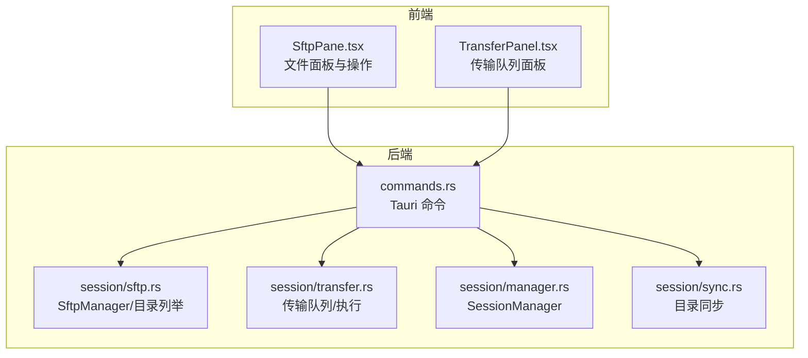
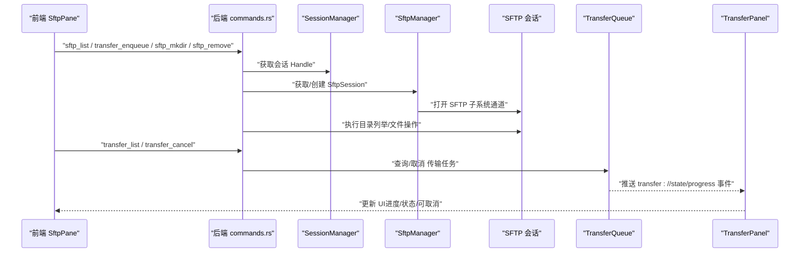
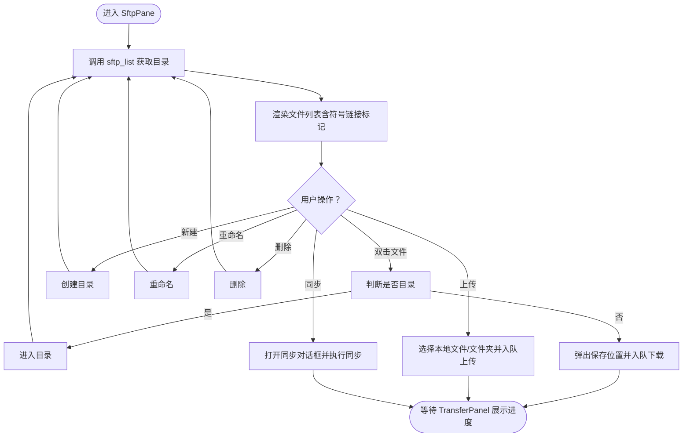
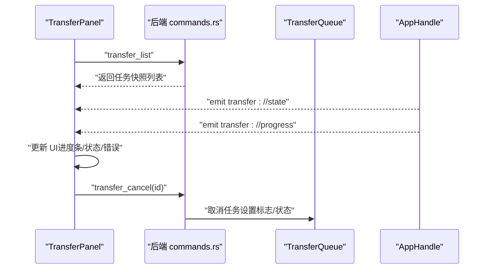
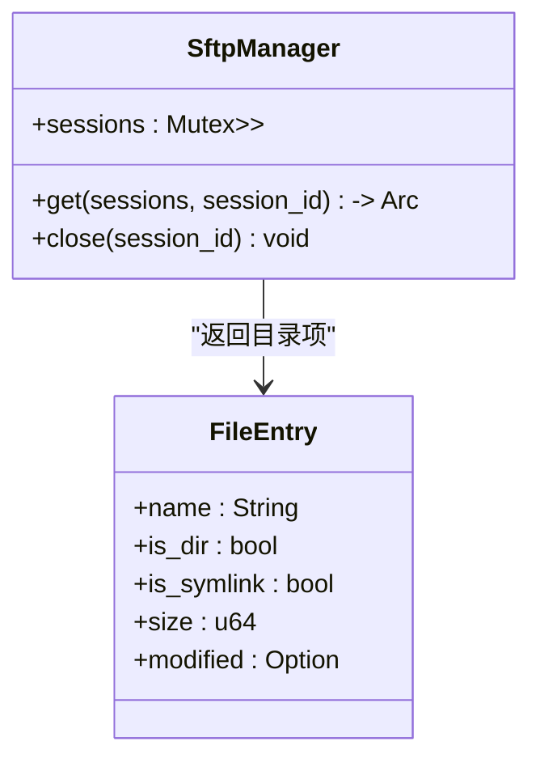
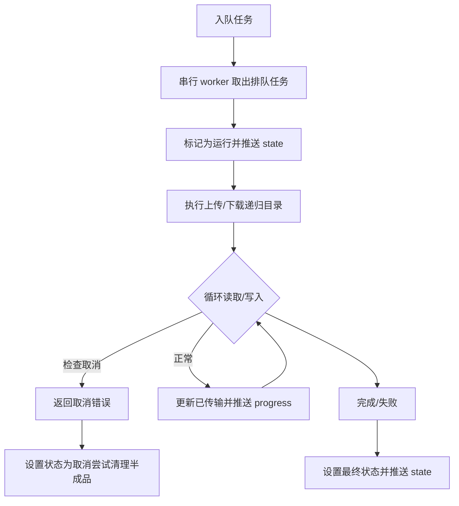
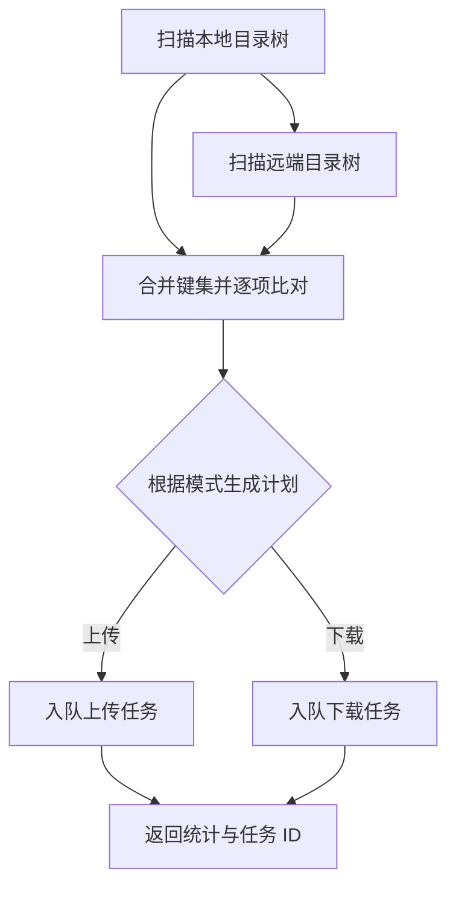
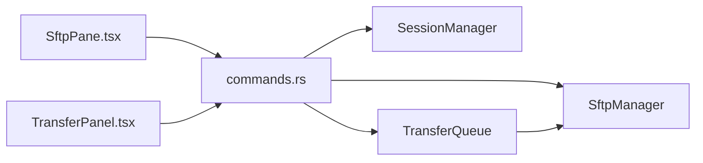

# 文件管理

<cite>
**本文档引用的文件**
- [SftpPane.tsx](file://src/components/SftpPane.tsx)
- [TransferPanel.tsx](file://src/components/TransferPanel.tsx)
- [sftp.rs](file://src-tauri/src/session/sftp.rs)
- [transfer.rs](file://src-tauri/src/session/transfer.rs)
- [manager.rs](file://src-tauri/src/session/manager.rs)
- [commands.rs](file://src-tauri/src/commands.rs)
- [types.ts](file://src/types.ts)
- [lib.rs](file://src-tauri/src/lib.rs)
- [sync.rs](file://src-tauri/src/session/sync.rs)
- [DESIGN.md](file://docs/DESIGN.md)
- [Cargo.toml](file://src-tauri/Cargo.toml)
</cite>

## 目录
1. [简介](#简介)
2. [项目结构](#项目结构)
3. [核心组件](#核心组件)
4. [架构总览](#架构总览)
5. [详细组件分析](#详细组件分析)
6. [依赖关系分析](#依赖关系分析)
7. [性能考量](#性能考量)
8. [故障排查指南](#故障排查指南)
9. [结论](#结论)
10. [附录](#附录)

## 简介
本文件管理功能围绕 SFTP 协议实现，提供远程文件系统的浏览、文件与目录操作、上传/下载/批量传输以及目录同步能力。传输采用串行队列与可取消机制，配合进度事件与状态变更事件，确保 UI 无阻塞、可观测、可恢复。同时，系统复用已建立的 SSH 会话进行 SFTP 操作，避免重复认证与资源浪费。

## 项目结构
文件管理相关模块分布于前端 React 组件与后端 Tauri/Rust 模块之间，形成清晰的分层：
- 前端层：SftpPane（文件面板）、TransferPanel（传输队列面板）
- 后端层：commands.rs（Tauri 命令）、session/sftp.rs（SFTP 会话与目录列举）、session/transfer.rs（传输队列与执行）、session/manager.rs（SSH 会话池）、session/sync.rs（目录同步）

**图表来源**
- [SftpPane.tsx:1-312](file://src/components/SftpPane.tsx#L1-L312)
- [TransferPanel.tsx:1-166](file://src/components/TransferPanel.tsx#L1-L166)
- [commands.rs:1-996](file://src-tauri/src/commands.rs#L1-L996)
- [sftp.rs:1-124](file://src-tauri/src/session/sftp.rs#L1-L124)
- [transfer.rs:1-483](file://src-tauri/src/session/transfer.rs#L1-L483)
- [manager.rs:1-317](file://src-tauri/src/session/manager.rs#L1-L317)
- [sync.rs:1-265](file://src-tauri/src/session/sync.rs#L1-L265)

**章节来源**
- [SftpPane.tsx:1-312](file://src/components/SftpPane.tsx#L1-L312)
- [TransferPanel.tsx:1-166](file://src/components/TransferPanel.tsx#L1-L166)
- [commands.rs:1-996](file://src-tauri/src/commands.rs#L1-L996)
- [sftp.rs:1-124](file://src-tauri/src/session/sftp.rs#L1-L124)
- [transfer.rs:1-483](file://src-tauri/src/session/transfer.rs#L1-L483)
- [manager.rs:1-317](file://src-tauri/src/session/manager.rs#L1-L317)
- [sync.rs:1-265](file://src-tauri/src/session/sync.rs#L1-L265)

## 核心组件
- SftpPane：远程文件浏览、进入目录、上传/下载（入队）、新建/重命名/删除、目录同步对话框集成
- TransferPanel：全局传输队列抽屉面板，监听状态与进度事件，支持取消进行中的任务
- SftpManager：在已有 SSH 会话上打开 SFTP 子系统通道，缓存并复用 SftpSession
- TransferQueue：串行传输队列，支持取消、进度事件与状态事件推送
- SessionManager：持久 SSH 会话池，负责连接、认证、断开与资源清理
- 同步工具：基于时间戳与大小的目录同步，生成传输计划并入队

**章节来源**
- [SftpPane.tsx:1-312](file://src/components/SftpPane.tsx#L1-L312)
- [TransferPanel.tsx:1-166](file://src/components/TransferPanel.tsx#L1-L166)
- [sftp.rs:1-124](file://src-tauri/src/session/sftp.rs#L1-L124)
- [transfer.rs:1-483](file://src-tauri/src/session/transfer.rs#L1-L483)
- [manager.rs:1-317](file://src-tauri/src/session/manager.rs#L1-L317)
- [sync.rs:1-265](file://src-tauri/src/session/sync.rs#L1-L265)

## 架构总览
文件管理的端到端流程如下：
- 前端通过 Tauri 命令触发后端操作
- 后端使用已建立的 SessionManager 获取 SSH Handle，并在该 Handle 上打开 SFTP 子系统通道
- SftpManager 缓存 SftpSession，避免重复创建
- 传输任务通过 TransferQueue 入队，串行执行，期间通过事件推送进度与状态
- 前端 TransferPanel 实时展示队列状态与进度，支持取消

**图表来源**
- [commands.rs:1-996](file://src-tauri/src/commands.rs#L1-L996)
- [manager.rs:1-317](file://src-tauri/src/session/manager.rs#L1-L317)
- [sftp.rs:1-124](file://src-tauri/src/session/sftp.rs#L1-L124)
- [transfer.rs:1-483](file://src-tauri/src/session/transfer.rs#L1-L483)
- [TransferPanel.tsx:1-166](file://src/components/TransferPanel.tsx#L1-L166)

**章节来源**
- [commands.rs:1-996](file://src-tauri/src/commands.rs#L1-L996)
- [manager.rs:1-317](file://src-tauri/src/session/manager.rs#L1-L317)
- [sftp.rs:1-124](file://src-tauri/src/session/sftp.rs#L1-L124)
- [transfer.rs:1-483](file://src-tauri/src/session/transfer.rs#L1-L483)
- [TransferPanel.tsx:1-166](file://src/components/TransferPanel.tsx#L1-L166)

## 详细组件分析

### SFTP 文件面板（SftpPane）
- 功能要点
  - 目录浏览：调用 sftp_list 列举远程目录，支持路径输入与回车跳转
  - 交互行为：双击目录进入、双击文件下载或在编辑器中打开
  - 文件操作：上传（单文件/文件夹）、新建目录、重命名、删除
  - 目录同步：弹出同步对话框，选择同步模式（镜像/仅上传/仅下载）
- 数据模型
  - FileEntry：包含文件名、是否目录、是否符号链接、大小、修改时间
- 错误处理
  - 操作失败时设置错误消息，避免 UI 阻塞

**图表来源**
- [SftpPane.tsx:1-312](file://src/components/SftpPane.tsx#L1-L312)
- [types.ts:63-69](file://src/types.ts#L63-L69)

**章节来源**
- [SftpPane.tsx:1-312](file://src/components/SftpPane.tsx#L1-L312)
- [types.ts:63-69](file://src/types.ts#L63-L69)

### 传输队列与进度监控（TransferPanel）
- 功能要点
  - 底部抽屉面板，展示所有传输任务（排队/进行中/完成/失败/取消）
  - 通过事件监听实时更新状态与进度：transfer://state、transfer://progress
  - 轮询 transfer_list 补充状态，避免遗漏
  - 进行中任务支持取消
- 数据模型
  - TransferTask：包含任务 ID、会话 ID、任务类型、本地/远程路径、名称、总大小、已传输、状态、取消标志
  - TransferTaskSnap：用于前端轮询的状态快照

**图表来源**
- [TransferPanel.tsx:1-166](file://src/components/TransferPanel.tsx#L1-L166)
- [transfer.rs:1-483](file://src-tauri/src/session/transfer.rs#L1-L483)
- [commands.rs:362-406](file://src-tauri/src/commands.rs#L362-L406)

**章节来源**
- [TransferPanel.tsx:1-166](file://src/components/TransferPanel.tsx#L1-L166)
- [transfer.rs:1-483](file://src-tauri/src/session/transfer.rs#L1-L483)
- [commands.rs:362-406](file://src-tauri/src/commands.rs#L362-L406)

### SFTP 协议实现与目录浏览（SftpManager 与 list_dir）
- 会话复用
  - SftpManager 在 SessionManager 提供的 Handle 上打开 SFTP 子系统通道
  - 使用 Arc 缓存 SftpSession，避免重复创建
- 目录列举
  - 支持空路径（家目录）与相对路径解析
  - 过滤“.”、“..”，整理目录在前、同类按名称排序
  - 标注符号链接与目录属性，格式化修改时间

**图表来源**
- [sftp.rs:1-124](file://src-tauri/src/session/sftp.rs#L1-L124)

**章节来源**
- [sftp.rs:1-124](file://src-tauri/src/session/sftp.rs#L1-L124)

### 传输执行与断点续传（TransferQueue 与 stream_with_progress）
- 串行执行
  - TransferQueue 使用 VecDeque 存储任务，Notify 唤醒 worker
  - 取出排队中的任务并标记为运行，执行完成后推送最终状态
- 可取消
  - 任务内循环前检查取消标志，支持中途取消
- 进度与状态
  - 每次写入后更新已传输字节并推送 progress 事件
  - 状态事件包含 queued/running/done/failed/cancelled
- 断点续传
  - 当前实现为一次性传输，未提供断点续传机制；如需实现可在任务中记录已传输偏移并使用 seek/append 打开文件

**图表来源**
- [transfer.rs:1-483](file://src-tauri/src/session/transfer.rs#L1-L483)

**章节来源**
- [transfer.rs:1-483](file://src-tauri/src/session/transfer.rs#L1-L483)

### 符号链接与权限处理
- 符号链接
  - 前端在文件列表中标记符号链接（→）
  - 下载时跳过符号链接，避免递归复制
- 权限
  - SFTP 层面的权限控制由远端服务器决定；当前实现未暴露权限修改接口
  - 若需权限管理，可在后端扩展命令以调用 SFTP 的权限设置接口

**章节来源**
- [SftpPane.tsx:274-292](file://src/components/SftpPane.tsx#L274-L292)
- [transfer.rs:393-395](file://src-tauri/src/session/transfer.rs#L393-L395)

### 大文件优化与并发控制
- 分块传输
  - 使用 64KB 固定缓冲区进行读写，降低内存峰值
- 并发控制
  - 串行队列避免单 SSH 连接上的并发争用
- 进度与取消
  - 每片写入后更新进度，取消标志在每次循环前检查
- 建议
  - 对超大文件可考虑动态调整缓冲区大小与并行度（当前串行策略简单可靠）

**章节来源**
- [transfer.rs:449-482](file://src-tauri/src/session/transfer.rs#L449-L482)

### 目录同步（SyncDialog 与 run_directory_sync）
- 同步模式
  - 支持镜像（双向较新覆盖）、仅上传、仅下载
- 比对策略
  - 基于修改时间与文件大小进行差异判断
- 传输计划
  - 生成上传/下载任务列表，统一入队执行
- 符号链接
  - 远端扫描时跳过符号链接，避免误传

**图表来源**
- [sync.rs:1-265](file://src-tauri/src/session/sync.rs#L1-L265)
- [SftpPane.tsx:295-301](file://src/components/SftpPane.tsx#L295-L301)

**章节来源**
- [sync.rs:1-265](file://src-tauri/src/session/sync.rs#L1-L265)
- [SftpPane.tsx:295-301](file://src/components/SftpPane.tsx#L295-L301)

## 依赖关系分析
- 前端依赖后端命令与事件
  - SftpPane 依赖 sftp_list、sftp_mkdir、sftp_rename、sftp_remove、sftp_select_local_files、sftp_select_folder、transfer_enqueue
  - TransferPanel 依赖 transfer_list、transfer_cancel，监听 transfer://state 与 transfer://progress
- 后端依赖
  - commands.rs 暴露命令并调用 SessionManager、SftpManager、TransferQueue
  - TransferQueue 依赖 SftpManager 获取 SFTP 会话
  - SftpManager 依赖 SessionManager 获取 Handle

**图表来源**
- [SftpPane.tsx:1-312](file://src/components/SftpPane.tsx#L1-L312)
- [TransferPanel.tsx:1-166](file://src/components/TransferPanel.tsx#L1-L166)
- [commands.rs:1-996](file://src-tauri/src/commands.rs#L1-L996)
- [manager.rs:1-317](file://src-tauri/src/session/manager.rs#L1-L317)
- [sftp.rs:1-124](file://src-tauri/src/session/sftp.rs#L1-L124)
- [transfer.rs:1-483](file://src-tauri/src/session/transfer.rs#L1-L483)

**章节来源**
- [commands.rs:1-996](file://src-tauri/src/commands.rs#L1-L996)
- [manager.rs:1-317](file://src-tauri/src/session/manager.rs#L1-L317)
- [sftp.rs:1-124](file://src-tauri/src/session/sftp.rs#L1-L124)
- [transfer.rs:1-483](file://src-tauri/src/session/transfer.rs#L1-L483)

## 性能考量
- 传输性能
  - 固定 64KB 缓冲区平衡吞吐与内存占用
  - 串行队列避免并发竞争，适合大多数场景
- UI 响应
  - 传输入队即返回，UI 无阻塞；通过事件驱动更新
- 资源管理
  - SftpSession 缓存减少通道创建开销
  - 会话断开时清理 SFTP 缓存，避免泄漏

**章节来源**
- [transfer.rs:449-482](file://src-tauri/src/session/transfer.rs#L449-L482)
- [sftp.rs:25-75](file://src-tauri/src/session/sftp.rs#L25-L75)
- [manager.rs:234-252](file://src-tauri/src/session/manager.rs#L234-L252)

## 故障排查指南
- 连接与认证
  - 若出现主机公钥未知或变更，前端将收到 ssh://hostkey 事件，需在前端确认后重连
- 传输失败
  - 查看 TransferPanel 中任务状态与错误信息
  - 检查网络波动与远端磁盘空间
- 取消无效
  - 确认任务仍处于排队状态；运行中任务需等待当前片结束才会响应取消
- 符号链接问题
  - 下载时会跳过符号链接；若需处理符号链接，需在后端扩展相应逻辑

**章节来源**
- [manager.rs:118-160](file://src-tauri/src/session/manager.rs#L118-L160)
- [TransferPanel.tsx:113-117](file://src/components/TransferPanel.tsx#L113-L117)
- [transfer.rs:156-166](file://src-tauri/src/session/transfer.rs#L156-L166)

## 结论
本文件管理功能以“串行队列 + 可取消 + 事件驱动”的方式实现了稳定可靠的 SFTP 文件传输体验。通过复用 SSH 会话与 SFTP 通道，系统在保持低资源占用的同时提供了良好的并发控制与可观测性。未来可在此基础上扩展断点续传、权限管理与符号链接处理等高级特性。

## 附录
- 设计文档概述了整体架构与技术选型，强调 SFTP 复用 SSH 连接、事件驱动与安全存储等关键点
- Cargo.toml 显示了 russh、russh-sftp、tokio 等核心依赖，支撑异步与纯 Rust 的实现

**章节来源**
- [DESIGN.md:1-87](file://docs/DESIGN.md#L1-L87)
- [Cargo.toml:1-50](file://src-tauri/Cargo.toml#L1-L50)