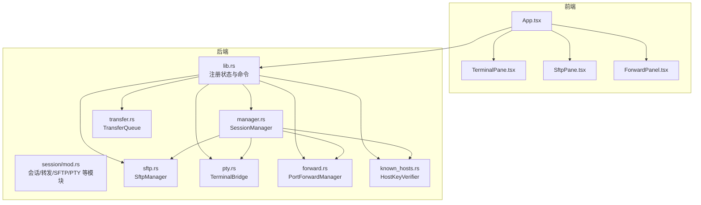
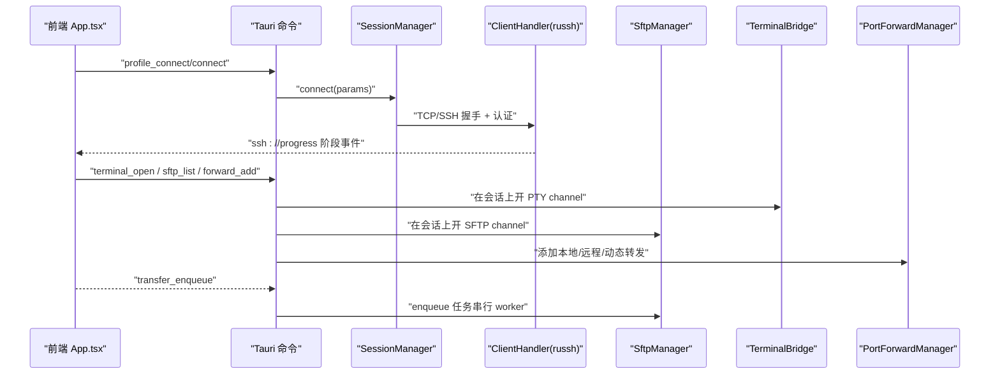
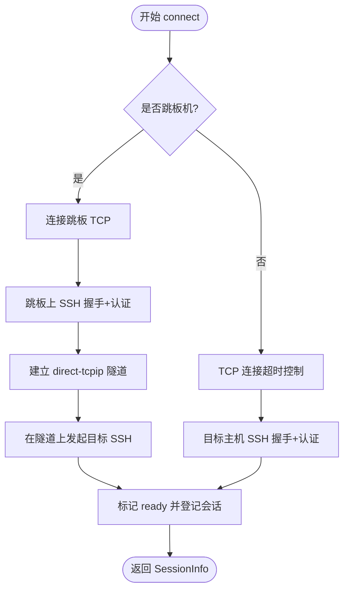
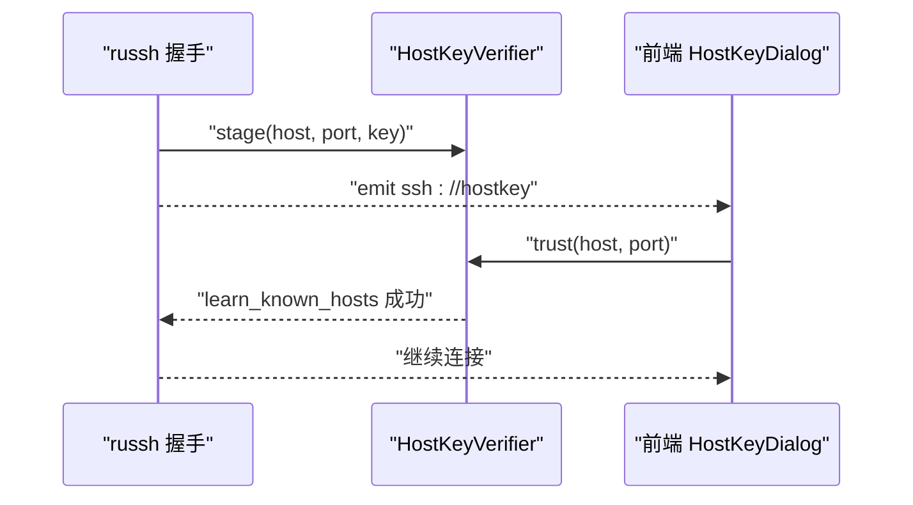
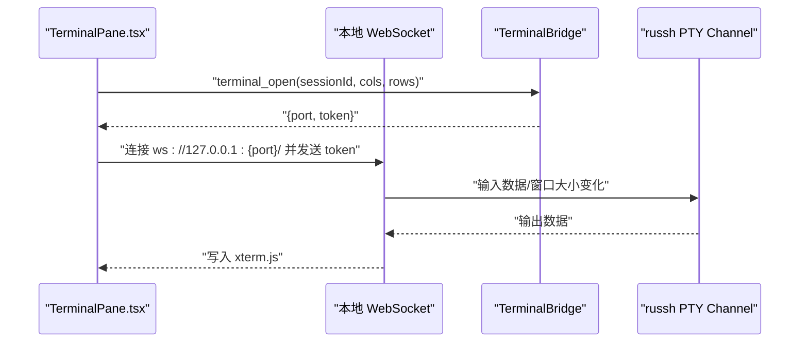
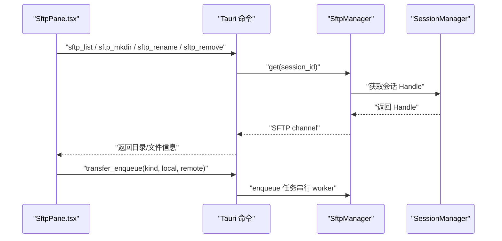
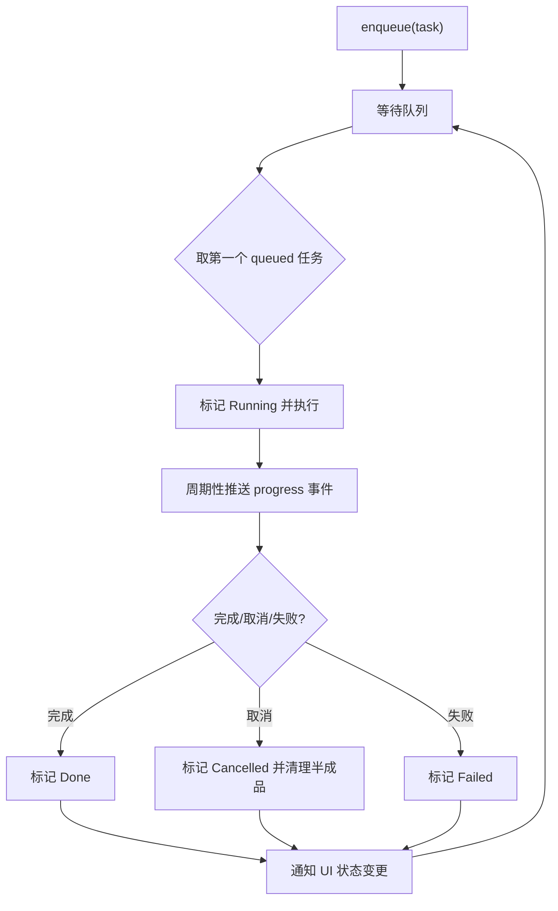
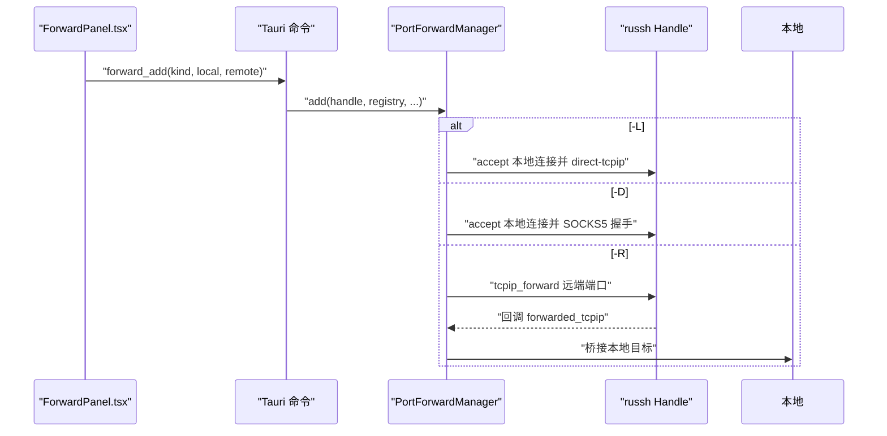
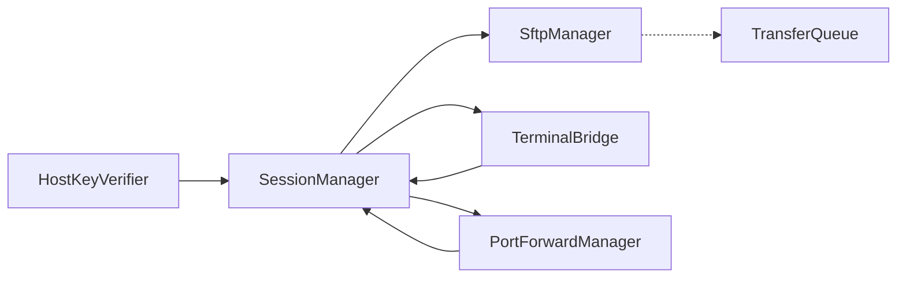

# 核心功能

<cite>
**本文档引用的文件**
- [README.md](file://README.md)
- [src-tauri/src/lib.rs](file://src-tauri/src/lib.rs)
- [src-tauri/src/main.rs](file://src-tauri/src/main.rs)
- [src-tauri/src/session/mod.rs](file://src-tauri/src/session/mod.rs)
- [src-tauri/src/session/manager.rs](file://src-tauri/src/session/manager.rs)
- [src-tauri/src/session/sftp.rs](file://src-tauri/src/session/sftp.rs)
- [src-tauri/src/session/pty.rs](file://src-tauri/src/session/pty.rs)
- [src-tauri/src/session/transfer.rs](file://src-tauri/src/session/transfer.rs)
- [src-tauri/src/session/forward.rs](file://src-tauri/src/session/forward.rs)
- [src-tauri/src/session/known_hosts.rs](file://src-tauri/src/session/known_hosts.rs)
- [src/App.tsx](file://src/App.tsx)
- [src/types.ts](file://src/types.ts)
- [src/components/TerminalPane.tsx](file://src/components/TerminalPane.tsx)
- [src/components/SftpPane.tsx](file://src/components/SftpPane.tsx)
- [src/components/ForwardPanel.tsx](file://src/components/ForwardPanel.tsx)
</cite>

## 目录
1. [简介](#简介)
2. [项目结构](#项目结构)
3. [核心组件](#核心组件)
4. [架构总览](#架构总览)
5. [详细组件分析](#详细组件分析)
6. [依赖分析](#依赖分析)
7. [性能考虑](#性能考虑)
8. [故障排查指南](#故障排查指南)
9. [结论](#结论)
10. [附录](#附录)

## 简介
本项目是一个“把 Xshell 和 Xftp 合二为一”的轻量 SSH 客户端，采用 Rust + Tauri 技术栈，核心目标是在一个窗口内共享同一条 SSH 连接，同时提供交互式终端、SFTP 文件面板、传输队列、端口转发、主机公钥校验、多会话管理、终端分屏等功能。项目强调“合体、轻量、开放”，内存占用低、安装包小，且与 OpenSSH 完全兼容。

## 项目结构
前端基于 React + TypeScript，后端使用 Tauri 2 与 Rust，核心会话与协议逻辑集中在 src-tauri/src/session 下，通过 Tauri 命令暴露给前端调用。整体结构清晰，模块职责明确：

- 前端工作区：侧边栏、标签页、状态栏、连接对话框、命令面板等。
- 会话层：统一的 SessionManager 管理持久连接，供终端、SFTP、端口转发共享。
- 传输层：SFTP 复用会话连接；传输队列串行执行，支持取消与进度事件。
- 转发层：本地 -L、远程 -R、动态 -D 三种转发，断开会话自动停止。
- 安全层：主机公钥校验（TOFU + 变更拦截），与 OpenSSH 兼容。

图表来源
- [src-tauri/src/lib.rs:20-91](file://src-tauri/src/lib.rs#L20-L91)
- [src-tauri/src/session/mod.rs:1-26](file://src-tauri/src/session/mod.rs#L1-L26)
- [src-tauri/src/session/manager.rs:77-81](file://src-tauri/src/session/manager.rs#L77-L81)
- [src-tauri/src/session/sftp.rs:25-28](file://src-tauri/src/session/sftp.rs#L25-L28)
- [src-tauri/src/session/pty.rs:42-45](file://src-tauri/src/session/pty.rs#L42-L45)
- [src-tauri/src/session/transfer.rs:122-126](file://src-tauri/src/session/transfer.rs#L122-L126)
- [src-tauri/src/session/forward.rs:118-121](file://src-tauri/src/session/forward.rs#L118-L121)
- [src-tauri/src/session/known_hosts.rs:92-95](file://src-tauri/src/session/known_hosts.rs#L92-L95)

章节来源
- [README.md:100-135](file://README.md#L100-L135)
- [src-tauri/src/lib.rs:1-93](file://src-tauri/src/lib.rs#L1-L93)
- [src-tauri/src/main.rs:1-7](file://src-tauri/src/main.rs#L1-L7)

## 核心组件
- 多会话管理：SessionManager 统一管理持久连接，支持跳板机、断线重连、自动重连策略。
- 保存连接：ProfileStore + OS 钥匙串 + 内存 AES-256-GCM 缓存，24 小时内重复连接免二次授权。
- 主机公钥校验：known_hosts 校验（TOFU + 变更拦截），与 OpenSSH 兼容。
- 交互式终端：xterm.js v6（WebGL 加速），PTY 通道 + 本地 WebSocket 传输。
- 终端分屏：树形布局（左右/上下递归切分），同会话并排多个独立终端。
- SFTP 文件面板：与终端共享同一条 SSH 连接，浏览/上传/下载/目录递归传输，带进度。
- 传输队列：串行执行、可取消、非阻塞 UI，全局面板查看进度。
- 端口转发：本地 -L、远程 -R、动态 SOCKS5 -D，断开会话自动停止。
- 连接进度可见：解析 → 握手 → 认证 分段超时 + 阶段反馈。
- 现代暗色界面：深墨 + 琥珀配色，IBM Plex 字体，IDE 式布局。
- 三端支持：macOS / Windows / Linux。

章节来源
- [README.md:27-39](file://README.md#L27-L39)
- [src-tauri/src/session/manager.rs:31-48](file://src-tauri/src/session/manager.rs#L31-L48)
- [src-tauri/src/session/known_hosts.rs:63-84](file://src-tauri/src/session/known_hosts.rs#L63-L84)
- [src-tauri/src/session/sftp.rs:30-75](file://src-tauri/src/session/sftp.rs#L30-L75)
- [src-tauri/src/session/transfer.rs:121-203](file://src-tauri/src/session/transfer.rs#L121-L203)
- [src-tauri/src/session/forward.rs:117-229](file://src-tauri/src/session/forward.rs#L117-L229)

## 架构总览
后端通过 Tauri 注入多个状态对象（SessionManager、SftpManager、TransferQueue、PortForwardManager、HostKeyVerifier 等），前端通过 invoke 调用命令与后端交互。核心思想是“一条 SSH 连接，多种用途共享使用”。

图表来源
- [src-tauri/src/lib.rs:20-91](file://src-tauri/src/lib.rs#L20-L91)
- [src-tauri/src/session/manager.rs:82-145](file://src-tauri/src/session/manager.rs#L82-L145)
- [src-tauri/src/session/sftp.rs:30-75](file://src-tauri/src/session/sftp.rs#L30-L75)
- [src-tauri/src/session/pty.rs:47-85](file://src-tauri/src/session/pty.rs#L47-L85)
- [src-tauri/src/session/forward.rs:117-191](file://src-tauri/src/session/forward.rs#L117-L191)
- [src-tauri/src/session/transfer.rs:128-203](file://src-tauri/src/session/transfer.rs#L128-L203)

## 详细组件分析

### 多会话管理（SessionManager）
- 职责：建立/保持/断开持久 SSH 连接，支持跳板机 ProxyJump，向前端推送连接进度事件。
- 关键点：
  - 连接超时策略：DNS 解析、SSH 握手、认证分别有超时限制。
  - 进度事件：resolve/handshake/auth/jump/ready 等阶段。
  - 跳板机：先连跳板，再在跳板隧道上发起目标 SSH。
  - 断开：同时断开主会话与跳板会话（如存在）。

图表来源
- [src-tauri/src/session/manager.rs:82-145](file://src-tauri/src/session/manager.rs#L82-L145)
- [src-tauri/src/session/manager.rs:147-217](file://src-tauri/src/session/manager.rs#L147-L217)
- [src-tauri/src/session/manager.rs:255-317](file://src-tauri/src/session/manager.rs#L255-L317)

章节来源
- [src-tauri/src/session/manager.rs:77-145](file://src-tauri/src/session/manager.rs#L77-L145)
- [src-tauri/src/session/manager.rs:255-317](file://src-tauri/src/session/manager.rs#L255-L317)

### 保存连接与凭据安全
- 保存连接：ProfileStore 存储连接配置（主机、端口、用户名、认证方式、跳板机等）。
- 凭据安全：OS 钥匙串存储密码；24 小时内重复连接使用内存 AES-256-GCM 缓存，避免反复弹窗。
- 使用方法：侧边栏连接库中新建/编辑连接，或通过命令面板快速连接。

章节来源
- [README.md:29-31](file://README.md#L29-L31)
- [src-tauri/src/lib.rs:25-33](file://src-tauri/src/lib.rs#L25-L33)

### 主机公钥校验（known_hosts）
- 校验三态：已信任（Trusted）、未知（首次连接 TOFU）、已变更（疑似中间人攻击）。
- 流程：握手阶段探测到非 Trusted 时，将公钥暂存至 HostKeyVerifier（仅内存），并触发 ssh://hostkey 事件，等待前端确认。用户确认后落盘 known_hosts，再次连接命中。
- 兼容性：与 OpenSSH 使用相同 known_hosts 格式与算法指纹计算。

图表来源
- [src-tauri/src/session/mod.rs:115-160](file://src-tauri/src/session/mod.rs#L115-L160)
- [src-tauri/src/session/known_hosts.rs:97-135](file://src-tauri/src/session/known_hosts.rs#L97-L135)
- [src/App.tsx:151-160](file://src/App.tsx#L151-L160)
- [src/App.tsx:410-444](file://src/App.tsx#L410-L444)

章节来源
- [src-tauri/src/session/known_hosts.rs:25-84](file://src-tauri/src/session/known_hosts.rs#L25-L84)
- [src-tauri/src/session/mod.rs:115-160](file://src-tauri/src/session/mod.rs#L115-L160)
- [src/App.tsx:151-160](file://src/App.tsx#L151-L160)

### 交互式终端（xterm.js + PTY）
- 传输链路：前端 xterm.js → 本地 WebSocket → 后端 TerminalBridge → russh PTY channel。
- 功能：动态 resize、Ctrl+F 搜索、主题联动、日志语法高亮、X11 转发开关。
- 分屏：SplitView 内部维护树形布局，每个叶子节点绑定一个 sessionId，支持拖拽调整比例。

图表来源
- [src/components/TerminalPane.tsx:103-135](file://src/components/TerminalPane.tsx#L103-L135)
- [src-tauri/src/session/pty.rs:47-85](file://src-tauri/src/session/pty.rs#L47-L85)
- [src-tauri/src/session/pty.rs:87-141](file://src-tauri/src/session/pty.rs#L87-L141)

章节来源
- [src/components/TerminalPane.tsx:19-199](file://src/components/TerminalPane.tsx#L19-L199)
- [src-tauri/src/session/pty.rs:41-143](file://src-tauri/src/session/pty.rs#L41-L143)

### 终端分屏（SplitView）
- 结构：SplitNode 为树形布局，叶子节点包含 sessionId；支持水平/垂直分割与比例调整。
- 行为：切换 Tab 时后台终端不被打断；重连后自动替换布局中的旧 sessionId 为新 sessionId。

章节来源
- [src/types.ts:35-61](file://src/types.ts#L35-L61)
- [src/App.tsx:42-58](file://src/App.tsx#L42-L58)
- [src/App.tsx:162-173](file://src/App.tsx#L162-L173)

### SFTP 文件面板（与终端共享连接）
- 复用会话：SftpManager 在 SessionManager 提供的 Handle 上打开 SFTP subsystem，后续 list/upload/download 等均在同一连接上进行。
- 功能：浏览目录、进入子目录、上传/下载/新建/重命名/删除；上传/下载入队传输队列，不阻塞 UI。
- 目录同步：提供同步对话框，支持双向对比与传输。

图表来源
- [src/components/SftpPane.tsx:40-62](file://src/components/SftpPane.tsx#L40-L62)
- [src/components/SftpPane.tsx:81-134](file://src/components/SftpPane.tsx#L81-L134)
- [src-tauri/src/session/sftp.rs:30-75](file://src-tauri/src/session/sftp.rs#L30-L75)
- [src-tauri/src/session/transfer.rs:128-203](file://src-tauri/src/session/transfer.rs#L128-L203)

章节来源
- [src/components/SftpPane.tsx:25-312](file://src/components/SftpPane.tsx#L25-L312)
- [src-tauri/src/session/sftp.rs:30-124](file://src-tauri/src/session/sftp.rs#L30-L124)

### 传输队列（串行 + 可取消）
- 设计：队列只在内存中，串行 worker 逐个执行任务；每个任务有原子计数与取消标志。
- 事件：通过 transfer://progress 与 transfer://state 推送进度与状态快照。
- 行为：可取消；半成品清理；错误分类（失败/取消）。

图表来源
- [src-tauri/src/session/transfer.rs:128-203](file://src-tauri/src/session/transfer.rs#L128-L203)
- [src-tauri/src/session/transfer.rs:206-284](file://src-tauri/src/session/transfer.rs#L206-L284)
- [src-tauri/src/session/transfer.rs:448-482](file://src-tauri/src/session/transfer.rs#L448-L482)

章节来源
- [src-tauri/src/session/transfer.rs:121-203](file://src-tauri/src/session/transfer.rs#L121-L203)
- [src-tauri/src/session/transfer.rs:206-483](file://src-tauri/src/session/transfer.rs#L206-L483)

### 端口转发（-L/-R/-D）
- 本地转发（-L）：本地监听，每个连接在 SSH 上开 direct-tcpip 并桥接。
- 远程转发（-R）：请求服务器在远端 bind 端口；服务器来连接时回调根据注册表桥接到本地目标。
- 动态转发（-D）：本地监听，每个连接先 SOCKS5 握手拿到目标，再 direct-tcpip。
- 生命周期：断开会话时自动停止该会话的所有转发。

图表来源
- [src/components/ForwardPanel.tsx:46-68](file://src/components/ForwardPanel.tsx#L46-L68)
- [src-tauri/src/session/forward.rs:117-229](file://src-tauri/src/session/forward.rs#L117-L229)
- [src-tauri/src/session/forward.rs:231-295](file://src-tauri/src/session/forward.rs#L231-L295)

章节来源
- [src/components/ForwardPanel.tsx:12-207](file://src/components/ForwardPanel.tsx#L12-L207)
- [src-tauri/src/session/forward.rs:1-295](file://src-tauri/src/session/forward.rs#L1-L295)

### 连接进度可见与断线重连
- 进度事件：前端监听 ssh://progress，分阶段显示“解析主机/协商加密/认证/跳板/就绪”。
- 断线重连：当会话断开且启用自动重连时，按指数退避重试；若因主机公钥问题导致重连失败，需用户手动确认后重连。

章节来源
- [src-tauri/src/session/manager.rs:31-48](file://src-tauri/src/session/manager.rs#L31-L48)
- [src/App.tsx:136-149](file://src/App.tsx#L136-L149)
- [src/App.tsx:338-408](file://src/App.tsx#L338-L408)

## 依赖分析
- 前端依赖：@xterm/*、lucide-react、@tauri-apps/api。
- 后端依赖：russh、russh-sftp、tokio、tokio-tungstenite、uuid、dirs、serde、chrono 等。
- 模块耦合：
  - SessionManager 为核心枢纽，被 SftpManager、TerminalBridge、PortForwardManager 共享。
  - HostKeyVerifier 仅在握手阶段参与，不长期持有。
  - TransferQueue 通过 SftpManager 获取 SFTP 会话，不直接持有 SessionManager。

图表来源
- [src-tauri/src/lib.rs:25-33](file://src-tauri/src/lib.rs#L25-L33)
- [src-tauri/src/session/sftp.rs:30-75](file://src-tauri/src/session/sftp.rs#L30-L75)
- [src-tauri/src/session/pty.rs:42-45](file://src-tauri/src/session/pty.rs#L42-L45)
- [src-tauri/src/session/forward.rs:118-121](file://src-tauri/src/session/forward.rs#L118-L121)
- [src-tauri/src/session/known_hosts.rs:92-95](file://src-tauri/src/session/known_hosts.rs#L92-L95)

章节来源
- [src-tauri/src/lib.rs:20-42](file://src-tauri/src/lib.rs#L20-L42)

## 性能考虑
- 低内存占用：Rust + Tauri（系统 WebView），目标内存约 34MB，安装包小于 10MB。
- 传输优化：SFTP 传输采用 64KB 片段流式拷贝，减少内存峰值；串行队列避免单连接并发争用。
- 终端加速：xterm.js 启用 WebGL 加速（不可用时回退 Canvas）。
- I/O 隔离：WebSocket 与 PTY 通过 mpsc 管道解耦，避免类型不便与所有权问题。
- 超时控制：连接各阶段设置超时，避免长时间阻塞。

## 故障排查指南
- 连接超时：
  - TCP 解析/握手/认证阶段均有超时，若超时请检查网络与服务器可达性。
- 主机公钥问题：
  - 首次连接会弹窗显示指纹，请通过可靠渠道核对；公钥变更会被拦截并警示。
  - 可通过命令删除 known_hosts 中的冲突条目，再重连。
- 传输失败：
  - 查看 TransferPanel 中的任务状态与错误信息；可取消后重试。
- 端口转发失败：
  - 检查本地端口是否被占用；-R 需要服务器具备相应权限。
- 终端无输出：
  - 确认本地 WebSocket 已建立并发送 token；检查 xterm.js 是否正常渲染。

章节来源
- [src-tauri/src/session/manager.rs:255-317](file://src-tauri/src/session/manager.rs#L255-L317)
- [src-tauri/src/session/known_hosts.rs:128-135](file://src-tauri/src/session/known_hosts.rs#L128-L135)
- [src-tauri/src/session/transfer.rs:156-176](file://src-tauri/src/session/transfer.rs#L156-L176)
- [src-tauri/src/session/forward.rs:136-191](file://src-tauri/src/session/forward.rs#L136-L191)
- [src/components/TerminalPane.tsx:103-135](file://src/components/TerminalPane.tsx#L103-L135)

## 结论
本项目通过“一条 SSH 连接，多种用途共享”的设计，实现了终端与 SFTP 的无缝整合，配合传输队列、端口转发、主机公钥校验与断线重连机制，既满足日常运维需求，又兼顾易用性与安全性。前端采用现代化 UI，后端以 Rust + Tauri 构建，整体性能优异、资源占用低，适合在多平台上稳定使用。

## 附录
- 使用示例与最佳实践：
  - 多会话管理：在侧边栏连接库中保存常用连接，使用命令面板快速打开终端或 SFTP。
  - 保存连接：建议使用 OS 钥匙串存储密码，避免明文落盘；利用 24 小时内存缓存减少重复授权。
  - 主机公钥校验：首次连接务必核对指纹；公钥变更时不要盲目信任，应先排查网络环境。
  - 传输队列：批量上传/下载时优先使用目录上传，避免 UI 阻塞；遇到失败及时查看错误并重试。
  - 端口转发：本地 -L 适用于访问内网服务；动态 -D 适合作为系统代理；-R 需谨慎使用并及时停止。
  - 终端分屏：合理规划布局，结合搜索与主题设置提升效率。

章节来源
- [README.md:27-39](file://README.md#L27-L39)
- [src-tauri/src/session/known_hosts.rs:155-166](file://src-tauri/src/session/known_hosts.rs#L155-L166)
- [src-tauri/src/session/transfer.rs:128-203](file://src-tauri/src/session/transfer.rs#L128-L203)
- [src-tauri/src/session/forward.rs:117-191](file://src-tauri/src/session/forward.rs#L117-L191)
- [src/components/TerminalPane.tsx:19-199](file://src/components/TerminalPane.tsx#L19-L199)