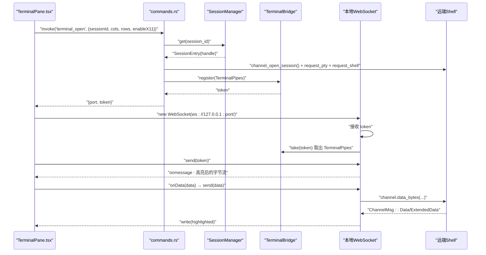
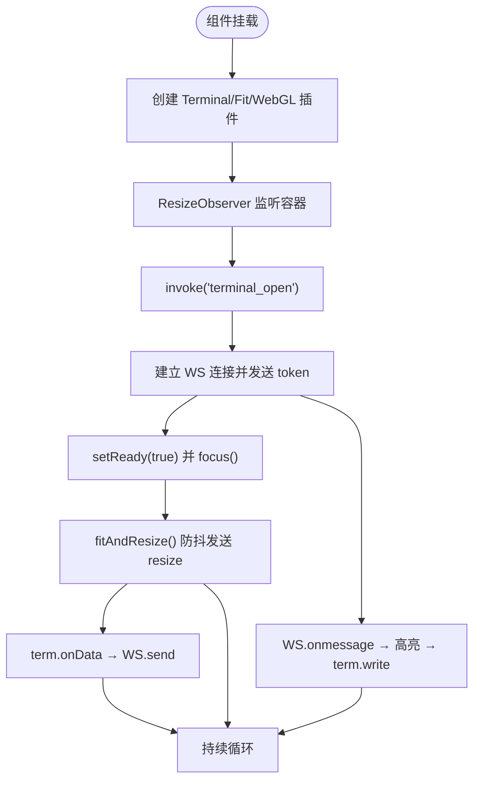
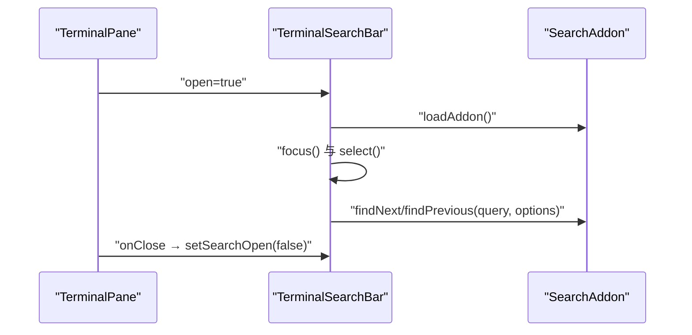
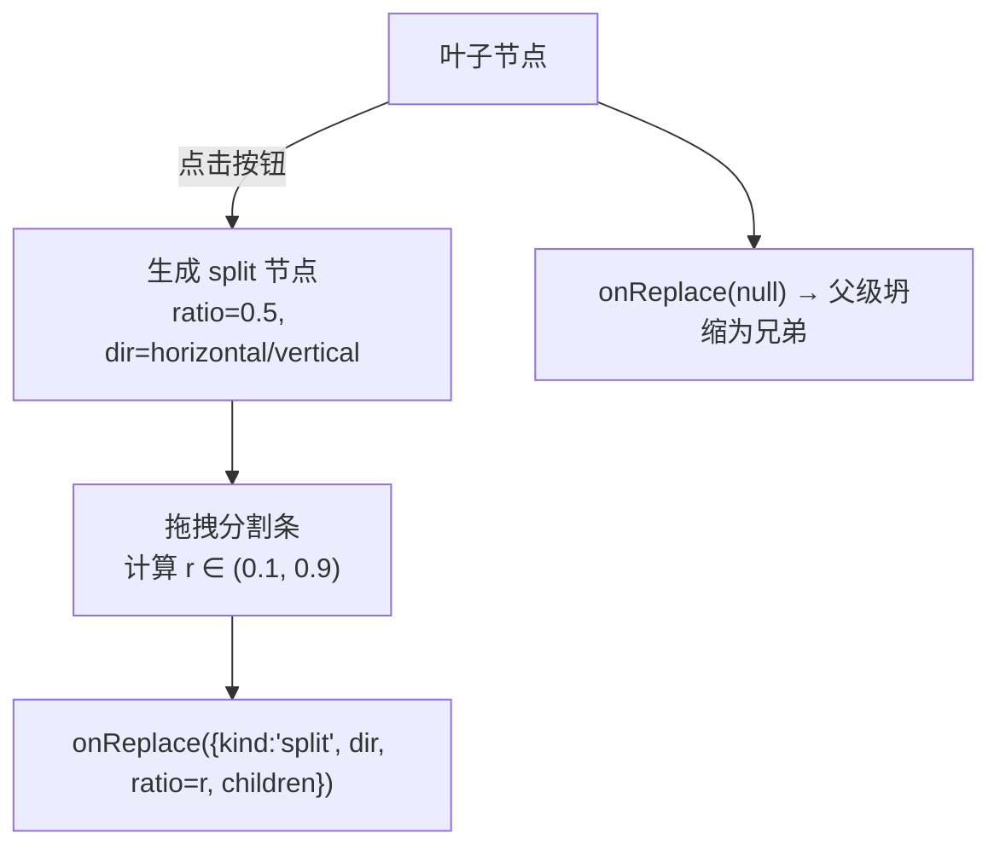
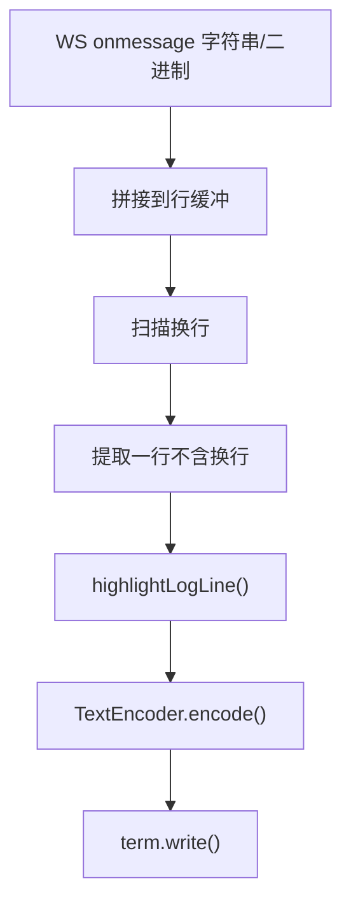
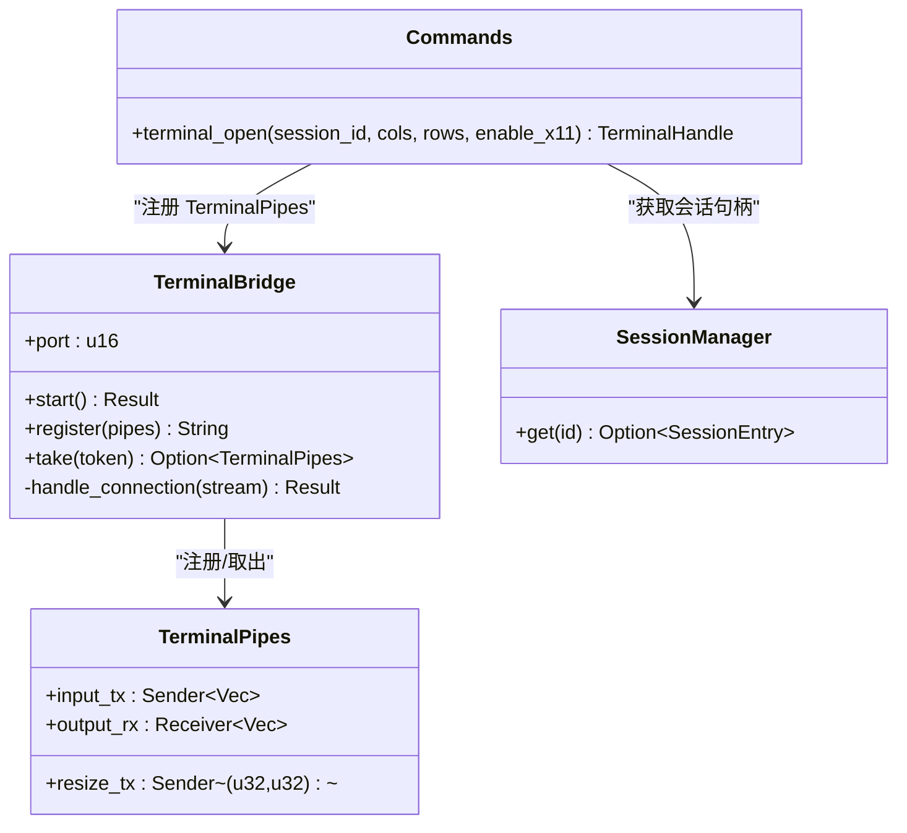
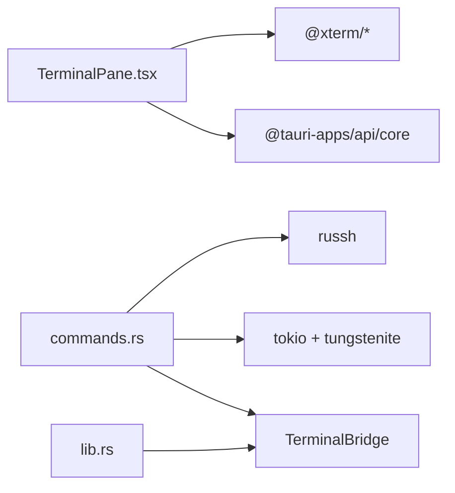

# 终端功能

<cite>
**本文档引用的文件**   
- [src/components/TerminalPane.tsx](file://src/components/TerminalPane.tsx)
- [src/components/TerminalSearchBar.tsx](file://src/components/TerminalSearchBar.tsx)
- [src/components/SplitView.tsx](file://src/components/SplitView.tsx)
- [src/types.ts](file://src/types.ts)
- [src/utils/logHighlight.ts](file://src/utils/logHighlight.ts)
- [src/settings/types.ts](file://src/settings/types.ts)
- [src/theme/ThemeProvider.tsx](file://src/theme/ThemeProvider.tsx)
- [src-tauri/src/lib.rs](file://src-tauri/src/lib.rs)
- [src-tauri/src/commands.rs](file://src-tauri/src/commands.rs)
- [src-tauri/src/session/pty.rs](file://src-tauri/src/session/pty.rs)
- [src-tauri/src/session/manager.rs](file://src-tauri/src/session/manager.rs)
- [src-tauri/src/session/mod.rs](file://src-tauri/src/session/mod.rs)
- [src-tauri/src/session/ssh.rs](file://src-tauri/src/session/ssh.rs)
- [src/App.tsx](file://src/App.tsx)
</cite>

## 目录
1. [简介](#简介)
2. [项目结构](#项目结构)
3. [核心组件](#核心组件)
4. [架构总览](#架构总览)
5. [详细组件分析](#详细组件分析)
6. [依赖分析](#依赖分析)
7. [性能考虑](#性能考虑)
8. [故障排查指南](#故障排查指南)
9. [结论](#结论)
10. [附录](#附录)

## 简介
本文件系统性梳理终端功能的设计与实现，覆盖以下要点：
- xterm.js 集成与渲染管线
- PTY 通道与 WebSocket 桥接机制
- 终端分屏布局系统（递归网格与动态分割）
- 终端搜索、文本高亮与复制粘贴
- 主题系统、字体配置与显示优化
- 终端与 SSH 会话的协作关系与实时交互
- 最佳实践与性能优化建议

## 项目结构
终端功能由前端 React 组件与后端 Tauri/Rust 两部分协同实现：
- 前端负责 UI、事件与 xterm.js 渲染；通过 Tauri 命令与后端通信
- 后端负责 SSH 会话管理、PTY 开启、终端桥接与本地 WebSocket 提供

```mermaid
graph TB
subgraph "前端"
TP["TerminalPane.tsx"]
TS["TerminalSearchBar.tsx"]
SV["SplitView.tsx"]
APP["App.tsx"]
end
subgraph "后端"
CMD["commands.rs<br/>terminal_open(...)"]
SM["SessionManager<br/>manager.rs"]
PTY["TerminalBridge<br/>pty.rs"]
LIB["lib.rs<br/>setup() 启动本地 WS"]
end
TP <- --> CMD
CMD --> SM
CMD --> PTY
LIB --> PTY
TP <- --> PTY
SV --> TP
APP --> SV
```

**图表来源**
- [src/components/TerminalPane.tsx:1-199](file://src/components/TerminalPane.tsx#L1-L199)
- [src-tauri/src/commands.rs:105-186](file://src-tauri/src/commands.rs#L105-L186)
- [src-tauri/src/session/manager.rs:76-145](file://src-tauri/src/session/manager.rs#L76-L145)
- [src-tauri/src/session/pty.rs:41-86](file://src-tauri/src/session/pty.rs#L41-L86)
- [src-tauri/src/lib.rs:34-42](file://src-tauri/src/lib.rs#L34-L42)

**章节来源**
- [src/components/TerminalPane.tsx:1-199](file://src/components/TerminalPane.tsx#L1-L199)
- [src-tauri/src/commands.rs:105-186](file://src-tauri/src/commands.rs#L105-L186)
- [src-tauri/src/session/pty.rs:1-143](file://src-tauri/src/session/pty.rs#L1-L143)
- [src-tauri/src/session/manager.rs:1-317](file://src-tauri/src/session/manager.rs#L1-L317)
- [src-tauri/src/lib.rs:14-93](file://src-tauri/src/lib.rs#L14-L93)

## 核心组件
- 终端面板 TerminalPane：初始化 xterm.js、加载插件、绑定事件、发起 terminal_open 命令、建立本地 WS 连接、处理输入输出与搜索
- 终端搜索栏 TerminalSearchBar：基于 @xterm/addon-search 的搜索 UI 与逻辑
- 分屏容器 SplitView：递归渲染 SplitNode 树，支持动态分割与调整比例
- 日志高亮工具 createLogHighlighter：对无 ANSI 的日志注入颜色
- 设置与主题：字体、字号、行高、光标样式、主题联动
- 后端命令与桥接：terminal_open、TerminalBridge、SessionManager

**章节来源**
- [src/components/TerminalPane.tsx:19-199](file://src/components/TerminalPane.tsx#L19-L199)
- [src/components/TerminalSearchBar.tsx:12-83](file://src/components/TerminalSearchBar.tsx#L12-L83)
- [src/components/SplitView.tsx:17-152](file://src/components/SplitView.tsx#L17-L152)
- [src/utils/logHighlight.ts:121-162](file://src/utils/logHighlight.ts#L121-L162)
- [src/settings/types.ts:1-48](file://src/settings/types.ts#L1-L48)
- [src/theme/ThemeProvider.tsx:14-108](file://src/theme/ThemeProvider.tsx#L14-L108)
- [src-tauri/src/commands.rs:105-186](file://src-tauri/src/commands.rs#L105-L186)
- [src-tauri/src/session/pty.rs:41-143](file://src-tauri/src/session/pty.rs#L41-L143)

## 架构总览
终端从“前端面板”到“后端会话”的端到端流程如下：



**图表来源**
- [src/components/TerminalPane.tsx:103-135](file://src/components/TerminalPane.tsx#L103-L135)
- [src-tauri/src/commands.rs:105-186](file://src-tauri/src/commands.rs#L105-L186)
- [src-tauri/src/session/pty.rs:87-141](file://src-tauri/src/session/pty.rs#L87-L141)
- [src-tauri/src/session/manager.rs:219-222](file://src-tauri/src/session/manager.rs#L219-L222)

## 详细组件分析

### 终端面板 TerminalPane
- 初始化与插件
  - 使用 Terminal 构造函数设置字体、字号、行高、光标样式与主题
  - 加载 FitAddon 与可选 WebglAddon，提升渲染性能
- 尺寸适配与防抖
  - 使用 ResizeObserver 监听容器变化，调用 FitAddon.fit 并在 80ms 防抖后发送 resize 消息
- 输入输出桥接
  - term.onData 将按键输入编码后通过 WS 发送
  - WS onmessage 接收远端输出，经日志高亮转换后再写入终端
- 搜索与覆盖层
  - 通过 Ctrl+F 触发展开搜索栏，隐藏连接中覆盖层
- 断线重连
  - WS onclose 触发 onConnectionLost 回调，交由上层进行自动重连策略



**图表来源**
- [src/components/TerminalPane.tsx:34-149](file://src/components/TerminalPane.tsx#L34-L149)

**章节来源**
- [src/components/TerminalPane.tsx:19-199](file://src/components/TerminalPane.tsx#L19-L199)

### 终端搜索栏 TerminalSearchBar
- 基于 @xterm/addon-search，提供输入框与上下导航按钮
- 支持大小写不敏感、正则开关、装饰器（概览标尺高亮）
- Enter 执行查找，Shift+Enter 向前查找，Esc 关闭



**图表来源**
- [src/components/TerminalSearchBar.tsx:19-81](file://src/components/TerminalSearchBar.tsx#L19-L81)

**章节来源**
- [src/components/TerminalSearchBar.tsx:12-83](file://src/components/TerminalSearchBar.tsx#L12-L83)

### 终端分屏布局 SplitView
- 数据模型
  - SplitNode：叶子节点包含 paneId 与 sessionId；split 节点包含方向、比例与两个子节点
- 递归渲染
  - NodeView 递归渲染，叶子节点嵌入 TerminalPane，split 节点以 flex 布局按比例分配空间
- 动态分割与调整
  - 叶子节点提供左右/上下分屏按钮，生成新的 split 节点
  - 拖拽分割条通过 pointer 事件计算比例并替换节点
  - 关闭子面板触发“坍缩”为兄弟节点



**图表来源**
- [src/components/SplitView.tsx:44-151](file://src/components/SplitView.tsx#L44-L151)
- [src/types.ts:35-43](file://src/types.ts#L35-L43)

**章节来源**
- [src/components/SplitView.tsx:17-152](file://src/components/SplitView.tsx#L17-L152)
- [src/types.ts:32-43](file://src/types.ts#L32-L43)

### 日志高亮与文本增强
- createLogHighlighter
  - 流式处理：按行缓冲，遇到换行注入颜色
  - 匹配规则：时间戳、日志级别、HTTP 状态码、异常类名、方括号/括号级别标记
  - 仅对疑似日志行注入颜色，避免干扰交互式 shell
- 终端写入
  - TerminalPane 在 onmessage 中调用 highlighter.transform，再写入终端



**图表来源**
- [src/utils/logHighlight.ts:125-161](file://src/utils/logHighlight.ts#L125-L161)
- [src/components/TerminalPane.tsx:120-127](file://src/components/TerminalPane.tsx#L120-L127)

**章节来源**
- [src/utils/logHighlight.ts:1-162](file://src/utils/logHighlight.ts#L1-L162)
- [src/components/TerminalPane.tsx:85-127](file://src/components/TerminalPane.tsx#L85-L127)

### 主题系统、字体与显示优化
- 主题联动
  - ThemeProvider 提供 terminalTheme（xterm ITheme），TerminalPane 动态应用
- 字体与光标
  - SettingsProvider 暴露 fontFamily、fontSize、lineHeight、cursorStyle、cursorBlink
  - TerminalPane 在设置变化时调用 term.options.* 更新
- 显示优化
  - WebglAddon 渲染加速（不可用时回退 Canvas）
  - FitAddon 适配容器尺寸，ResizeObserver 防抖发送 resize

**章节来源**
- [src/theme/ThemeProvider.tsx:14-108](file://src/theme/ThemeProvider.tsx#L14-L108)
- [src/settings/types.ts:1-48](file://src/settings/types.ts#L1-L48)
- [src/components/TerminalPane.tsx:38-56](file://src/components/TerminalPane.tsx#L38-L56)
- [src/components/TerminalPane.tsx:151-178](file://src/components/TerminalPane.tsx#L151-L178)

### PTY 通道与 WebSocket 桥接
- 前端命令 terminal_open
  - 后端在指定会话上开启 PTY 通道（request_pty + request_shell）
  - 创建 mpsc 管道（input_tx/output_rx/resize_tx），注册到 TerminalBridge，返回一次性 token
- 本地 WebSocket 服务
  - 后端启动 TerminalBridge，监听 127.0.0.1:0，接受 WS 连接
  - 首条消息必须为 token，取出 TerminalPipes 并将 mpsc 与 WS 串接
- 控制消息
  - 文本消息 {"type":"resize","cols":N,"rows":M} 触发窗口大小变更



**图表来源**
- [src-tauri/src/commands.rs:105-186](file://src-tauri/src/commands.rs#L105-L186)
- [src-tauri/src/session/pty.rs:41-86](file://src-tauri/src/session/pty.rs#L41-L86)
- [src-tauri/src/session/manager.rs:219-222](file://src-tauri/src/session/manager.rs#L219-L222)

**章节来源**
- [src-tauri/src/commands.rs:105-186](file://src-tauri/src/commands.rs#L105-L186)
- [src-tauri/src/session/pty.rs:1-143](file://src-tauri/src/session/pty.rs#L1-L143)
- [src-tauri/src/lib.rs:34-42](file://src-tauri/src/lib.rs#L34-L42)

### 终端与 SSH 会话协作
- 会话管理
  - SessionManager 管理持久 SSH 连接，支持直连与跳板机 ProxyJump
  - 连接过程通过 ssh://progress 事件向前端推送阶段信息
- X11 转发
  - terminal_open 支持 enable_x11，后端在会话级设置 x11_display，远端 X11 channel 桥接本地 DISPLAY
- 一次性 exec
  - connect_and_exec 展示了最小化的连接-认证-执行-断开流程，便于验收

**章节来源**
- [src-tauri/src/session/manager.rs:76-145](file://src-tauri/src/session/manager.rs#L76-L145)
- [src-tauri/src/session/mod.rs:52-113](file://src-tauri/src/session/mod.rs#L52-L113)
- [src-tauri/src/session/ssh.rs:13-65](file://src-tauri/src/session/ssh.rs#L13-L65)

## 依赖分析
- 前端依赖
  - @xterm/xterm、@xterm/addon-fit、@xterm/addon-webgl、@xterm/addon-search
  - @tauri-apps/api/core 用于 invoke 与事件监听
- 后端依赖
  - russh（SSH 客户端）、tokio、tokio-tungstenite（WebSocket）、uuid（token）



**图表来源**
- [src/components/TerminalPane.tsx:1-11](file://src/components/TerminalPane.tsx#L1-L11)
- [src-tauri/src/commands.rs:1-22](file://src-tauri/src/commands.rs#L1-L22)
- [src-tauri/src/lib.rs:14-42](file://src-tauri/src/lib.rs#L14-L42)

**章节来源**
- [src/components/TerminalPane.tsx:1-11](file://src/components/TerminalPane.tsx#L1-L11)
- [src-tauri/src/commands.rs:1-22](file://src-tauri/src/commands.rs#L1-L22)
- [src-tauri/src/lib.rs:14-42](file://src-tauri/src/lib.rs#L14-L42)

## 性能考虑
- 渲染性能
  - 优先启用 WebGL 插件；不可用时回退 Canvas
  - 使用 FitAddon 与防抖 resize，减少频繁窗口变更带来的重排
- I/O 与背压
  - mpsc 管道容量有限（示例中为 64/64/8），避免前端过快输入导致内存堆积
- 网络与协议
  - 本地 WS 仅在 127.0.0.1，降低网络开销与安全风险
  - 控制消息（resize）与数据消息分离，避免混杂解析
- 主题与字体
  - 字体族与字号影响渲染成本，建议选择等宽字体并适度字号
  - 行高过大可能引发频繁重绘，建议保持合理比例

[本节为通用指导，无需特定文件引用]

## 故障排查指南
- 终端无法打开
  - 检查 terminal_open 是否返回错误；前端会在终端区域写入错误提示
  - 确认后端 TerminalBridge 已启动（lib.rs setup）
- 连接中断
  - TerminalPane onclose 触发 onConnectionLost；若启用自动重连，按指数退避重试
  - 若因主机公钥问题，前端会弹窗确认；需调用 hostkey_trust 后重连
- 搜索无效
  - 确保 SearchAddon 已加载；输入框聚焦与选中
- 分屏异常
  - 检查 SplitNode 结构是否合法（children 数组长度为 2）
  - 拖拽比例需在 (0.1, 0.9) 之间，超出范围会被裁剪
- X11 转发失败
  - 本机需存在 DISPLAY 环境变量；enable_x11 时后端会在会话级设置 x11_display

**章节来源**
- [src/components/TerminalPane.tsx:132-135](file://src/components/TerminalPane.tsx#L132-L135)
- [src-tauri/src/lib.rs:34-42](file://src-tauri/src/lib.rs#L34-L42)
- [src/App.tsx:390-408](file://src/App.tsx#L390-L408)
- [src-tauri/src/commands.rs:127-136](file://src-tauri/src/commands.rs#L127-L136)

## 结论
本终端功能通过“前端 xterm.js + 后端 russh + 本地 WS 桥接”的架构，实现了高性能、可扩展的实时交互体验。结合分屏布局、日志高亮、主题与字体配置，满足日常运维与开发场景需求。建议在生产环境中关注会话生命周期管理、X11 转发与网络安全性，并根据设备能力选择合适的渲染后端。

[本节为总结，无需特定文件引用]

## 附录
- 最佳实践
  - 使用 FitAddon 与防抖 resize，避免频繁窗口变更
  - 启用 WebGL 插件，必要时回退 Canvas
  - 严格区分控制消息与数据消息，确保协议清晰
  - 合理设置 mpsc 容量，避免背压
  - 使用主题联动与字体配置统一视觉体验
- 性能优化建议
  - 降低字体大小与行高，减少绘制面积
  - 避免在终端中粘贴超大文本，必要时分批写入
  - 合理使用搜索与高亮，避免对大量历史数据重复处理

[本节为通用指导，无需特定文件引用]