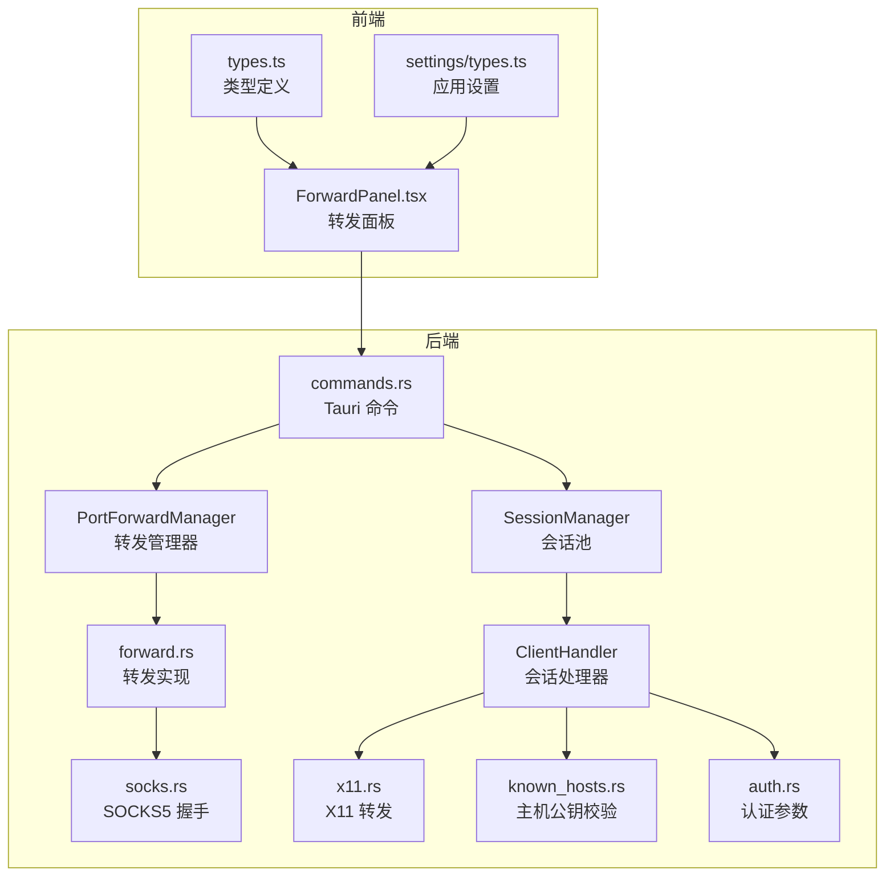
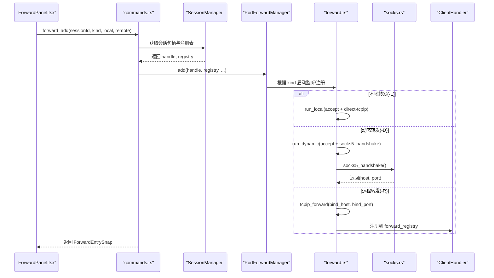
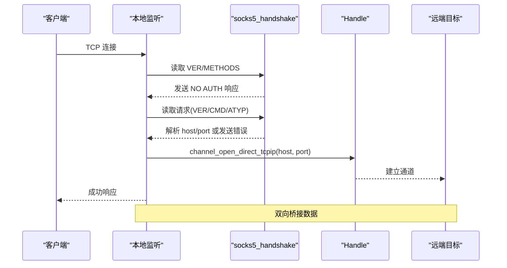
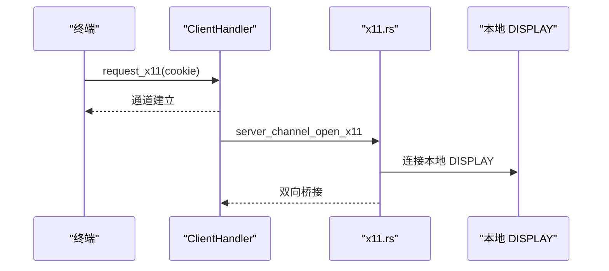
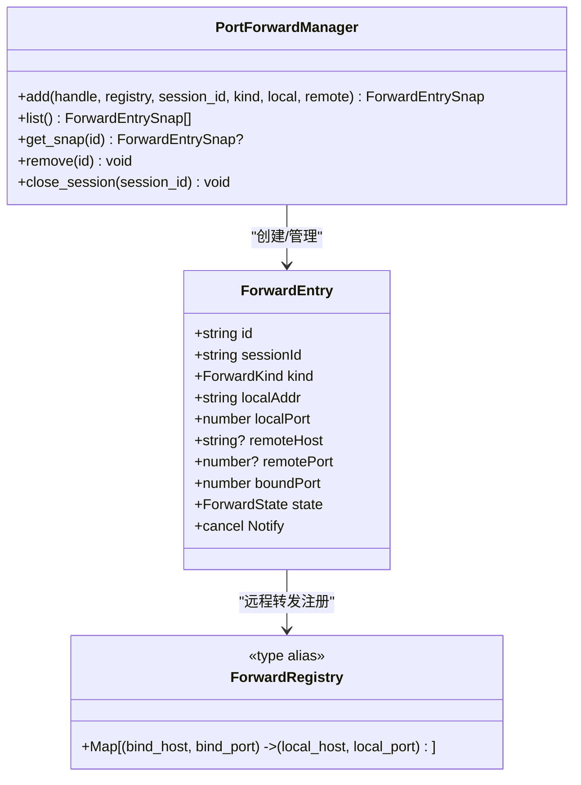
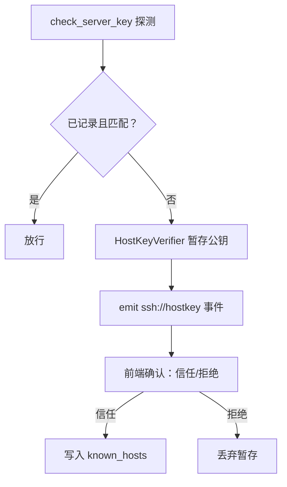
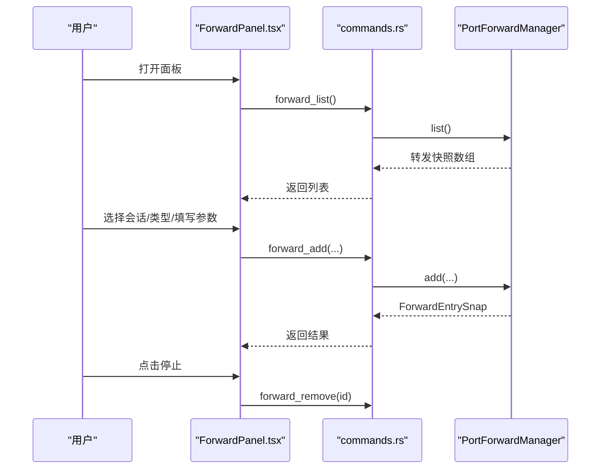
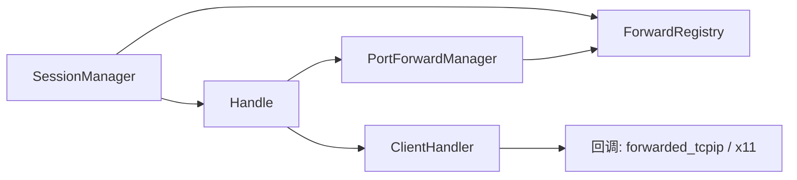
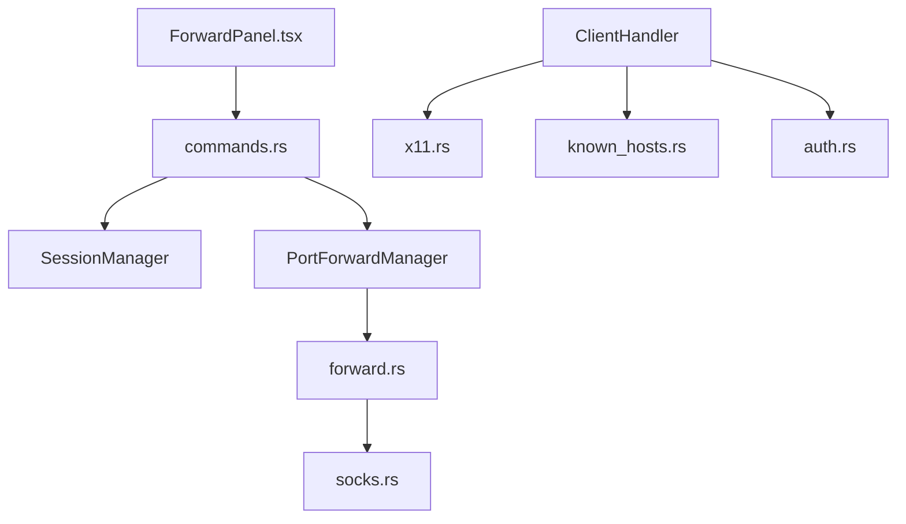

# 网络功能

<cite>
**本文档引用的文件**
- [src-tauri/src/session/forward.rs](file://src-tauri/src/session/forward.rs)
- [src-tauri/src/session/socks.rs](file://src-tauri/src/session/socks.rs)
- [src-tauri/src/session/x11.rs](file://src-tauri/src/session/x11.rs)
- [src-tauri/src/session/mod.rs](file://src-tauri/src/session/mod.rs)
- [src-tauri/src/session/manager.rs](file://src-tauri/src/session/manager.rs)
- [src-tauri/src/session/auth.rs](file://src-tauri/src/session/auth.rs)
- [src-tauri/src/session/known_hosts.rs](file://src-tauri/src/session/known_hosts.rs)
- [src-tauri/src/commands.rs](file://src-tauri/src/commands.rs)
- [src/components/ForwardPanel.tsx](file://src/components/ForwardPanel.tsx)
- [src/types.ts](file://src/types.ts)
- [src/settings/types.ts](file://src/settings/types.ts)
</cite>

## 目录
1. [简介](#简介)
2. [项目结构](#项目结构)
3. [核心组件](#核心组件)
4. [架构总览](#架构总览)
5. [详细组件分析](#详细组件分析)
6. [依赖关系分析](#依赖关系分析)
7. [性能考虑](#性能考虑)
8. [故障排查指南](#故障排查指南)
9. [结论](#结论)
10. [附录](#附录)

## 简介
本文件系统性地文档化了网络功能，重点覆盖端口转发（本地转发 L、远程转发 R、动态转发 D）、SOCKS 代理、X11 转发、转发规则配置与端口管理、安全控制、转发面板 UI 设计与操作流程，以及与 SSH 会话的集成方式与稳定性保障。文档旨在帮助开发者与使用者全面理解转发能力的设计与最佳实践。

## 项目结构
网络功能主要分布在 Rust 后端的会话模块与前端的转发面板组件之间，通过 Tauri 命令进行交互。整体采用“会话池 + 多路复用”的架构，转发能力复用同一 SSH 会话的 Handle，确保资源高效利用与一致性。



**图表来源**
- [src/components/ForwardPanel.tsx:16-181](file://src/components/ForwardPanel.tsx#L16-L181)
- [src-tauri/src/commands.rs:433-514](file://src-tauri/src/commands.rs#L433-L514)
- [src-tauri/src/session/manager.rs:76-144](file://src-tauri/src/session/manager.rs#L76-L144)
- [src-tauri/src/session/mod.rs:52-113](file://src-tauri/src/session/mod.rs#L52-L113)
- [src-tauri/src/session/forward.rs:117-229](file://src-tauri/src/session/forward.rs#L117-L229)
- [src-tauri/src/session/socks.rs:11-97](file://src-tauri/src/session/socks.rs#L11-L97)
- [src-tauri/src/session/x11.rs:27-36](file://src-tauri/src/session/x11.rs#L27-L36)
- [src-tauri/src/session/known_hosts.rs:63-84](file://src-tauri/src/session/known_hosts.rs#L63-L84)
- [src-tauri/src/session/auth.rs:44-81](file://src-tauri/src/session/auth.rs#L44-L81)

**章节来源**
- [src-tauri/src/session/forward.rs:1-295](file://src-tauri/src/session/forward.rs#L1-L295)
- [src-tauri/src/session/socks.rs:1-98](file://src-tauri/src/session/socks.rs#L1-L98)
- [src-tauri/src/session/x11.rs:1-151](file://src-tauri/src/session/x11.rs#L1-L151)
- [src-tauri/src/session/mod.rs:1-226](file://src-tauri/src/session/mod.rs#L1-L226)
- [src-tauri/src/session/manager.rs:1-317](file://src-tauri/src/session/manager.rs#L1-L317)
- [src-tauri/src/session/auth.rs:1-82](file://src-tauri/src/session/auth.rs#L1-L82)
- [src-tauri/src/session/known_hosts.rs:1-197](file://src-tauri/src/session/known_hosts.rs#L1-L197)
- [src-tauri/src/commands.rs:433-514](file://src-tauri/src/commands.rs#L433-L514)
- [src/components/ForwardPanel.tsx:1-207](file://src/components/ForwardPanel.tsx#L1-L207)
- [src/types.ts:90-102](file://src/types.ts#L90-L102)
- [src/settings/types.ts:1-48](file://src/settings/types.ts#L1-L48)

## 核心组件
- 端口转发管理器：负责新增、列出、移除转发，维护转发状态与生命周期。
- 转发实现：分别实现本地转发（-L）、动态转发（-D/SOCKS5）、远程转发（-R）。
- SOCKS5 握手：在动态转发中解析客户端目标，建立 direct-tcpip 通道。
- X11 转发：将远端 X11 channel 桥接到本地 DISPLAY。
- 会话池与处理器：统一承载转发、终端、SFTP 等能力，确保复用与一致性。
- 安全控制：主机公钥校验（known_hosts）、认证超时与失败处理。
- 前端转发面板：跨会话管理转发，提供添加、查看、停止等操作。

**章节来源**
- [src-tauri/src/session/forward.rs:117-229](file://src-tauri/src/session/forward.rs#L117-L229)
- [src-tauri/src/session/socks.rs:11-97](file://src-tauri/src/session/socks.rs#L11-L97)
- [src-tauri/src/session/x11.rs:27-36](file://src-tauri/src/session/x11.rs#L27-L36)
- [src-tauri/src/session/mod.rs:52-113](file://src-tauri/src/session/mod.rs#L52-L113)
- [src-tauri/src/session/known_hosts.rs:63-84](file://src-tauri/src/session/known_hosts.rs#L63-L84)
- [src-tauri/src/session/auth.rs:44-81](file://src-tauri/src/session/auth.rs#L44-L81)
- [src-tauri/src/commands.rs:433-514](file://src-tauri/src/commands.rs#L433-L514)
- [src/components/ForwardPanel.tsx:16-181](file://src/components/ForwardPanel.tsx#L16-L181)

## 架构总览
转发功能围绕“会话池 + 多路复用”展开：每个持久会话持有一份 russh Handle 与转发注册表，转发管理器在该 Handle 上创建 direct-tcpip 通道或监听本地端口，实现 L/R/D 三种模式。SOCKS5 握手在动态转发中完成，X11 转发在回调中桥接本地 DISPLAY。



**图表来源**
- [src/components/ForwardPanel.tsx:46-68](file://src/components/ForwardPanel.tsx#L46-L68)
- [src-tauri/src/commands.rs:438-472](file://src-tauri/src/commands.rs#L438-L472)
- [src-tauri/src/session/manager.rs:219-232](file://src-tauri/src/session/manager.rs#L219-L232)
- [src-tauri/src/session/forward.rs:123-191](file://src-tauri/src/session/forward.rs#L123-L191)
- [src-tauri/src/session/socks.rs:11-97](file://src-tauri/src/session/socks.rs#L11-L97)
- [src-tauri/src/session/mod.rs:165-207](file://src-tauri/src/session/mod.rs#L165-L207)

## 详细组件分析

### 端口转发（L/R/D）实现
- 本地转发（-L）：在本地监听指定地址与端口，每次连接通过 direct-tcpip 通道连接远端目标，桥接数据。
- 动态转发（-D）：在本地监听，每个连接先进行 SOCKS5 握手解析目标，再建立 direct-tcpip 通道。
- 远程转发（-R）：请求服务器在远端绑定端口，服务器收到连接时回调根据注册表桥接至本地目标。

```mermaid
flowchart TD
Start(["开始"]) --> Kind{"转发类型"}
Kind --> |本地(-L)| Local["run_local<br/>监听本地 -> direct-tcpip -> 桥接"]
Kind --> |动态(-D)| Dyn["run_dynamic<br/>监听本地 -> socks5_handshake -> direct-tcpip -> 桥接"]
Kind --> |远程(-R)| Remote["tcpip_forward<br/>注册 forward_registry -> 服务器回调桥接"]
Local --> Bridge["bridge_loop<br/>双向桥接"]
Dyn --> Bridge
Remote --> Bridge
Bridge --> End(["结束"])
```

**图表来源**
- [src-tauri/src/session/forward.rs:231-294](file://src-tauri/src/session/forward.rs#L231-L294)
- [src-tauri/src/session/socks.rs:11-97](file://src-tauri/src/session/socks.rs#L11-L97)
- [src-tauri/src/session/mod.rs:165-207](file://src-tauri/src/session/mod.rs#L165-L207)

**章节来源**
- [src-tauri/src/session/forward.rs:123-191](file://src-tauri/src/session/forward.rs#L123-L191)
- [src-tauri/src/session/forward.rs:231-294](file://src-tauri/src/session/forward.rs#L231-L294)
- [src-tauri/src/session/socks.rs:11-97](file://src-tauri/src/session/socks.rs#L11-L97)
- [src-tauri/src/session/mod.rs:165-207](file://src-tauri/src/session/mod.rs#L165-L207)

### SOCKS 代理（-D）
- 实现 RFC 1928 的 SOCKS5 握手，支持无认证（NO AUTH）与 CONNECT 命令。
- 解析目标地址类型（IPv4/域名/IPv6）与端口，返回给上游建立 direct-tcpip。
- 握手失败时发送对应错误响应并关闭连接。



**图表来源**
- [src-tauri/src/session/socks.rs:11-97](file://src-tauri/src/session/socks.rs#L11-L97)
- [src-tauri/src/session/forward.rs:264-294](file://src-tauri/src/session/forward.rs#L264-L294)

**章节来源**
- [src-tauri/src/session/socks.rs:11-97](file://src-tauri/src/session/socks.rs#L11-L97)

### X11 转发机制
- 在终端请求 X11 时，生成随机 cookie 并请求远端打开 X11 通道。
- 服务器回调触发后，将 X11 channel 与本地 DISPLAY（TCP 或 Unix）桥接。
- 支持 DISPLAY 形如 :0、:0.0、host:display.screen 等格式解析。



**图表来源**
- [src-tauri/src/session/mod.rs:209-224](file://src-tauri/src/session/mod.rs#L209-L224)
- [src-tauri/src/session/x11.rs:27-36](file://src-tauri/src/session/x11.rs#L27-L36)
- [src-tauri/src/session/x11.rs:62-125](file://src-tauri/src/session/x11.rs#L62-L125)

**章节来源**
- [src-tauri/src/session/mod.rs:209-224](file://src-tauri/src/session/mod.rs#L209-L224)
- [src-tauri/src/session/x11.rs:27-36](file://src-tauri/src/session/x11.rs#L27-L36)
- [src-tauri/src/session/x11.rs:62-125](file://src-tauri/src/session/x11.rs#L62-L125)

### 转发规则配置与端口管理
- 规则模型：包含会话 ID、转发类型、本地/远程地址与端口、绑定端口、状态等。
- 管理器：提供新增、列出、移除、按会话关闭等功能，内部使用 Notify 控制停止。
- 状态：Starting/Active/Failed/Stopped，用于 UI 展示与运维反馈。



**图表来源**
- [src-tauri/src/session/forward.rs:74-115](file://src-tauri/src/session/forward.rs#L74-L115)
- [src-tauri/src/session/forward.rs:117-229](file://src-tauri/src/session/forward.rs#L117-L229)
- [src-tauri/src/session/forward.rs:70-72](file://src-tauri/src/session/forward.rs#L70-L72)

**章节来源**
- [src-tauri/src/session/forward.rs:74-115](file://src-tauri/src/session/forward.rs#L74-L115)
- [src-tauri/src/session/forward.rs:117-229](file://src-tauri/src/session/forward.rs#L117-L229)

### 安全控制
- 主机公钥校验：基于 ~/.ssh/known_hosts 的 OpenSSH 兼容实现，支持未知（TOFU）与变更（疑似 MITM）两种情形。
- 认证超时与失败处理：密码与私钥认证均设置超时，失败时主动断开避免资源泄漏。
- 交互式确认：未知或变更时暂存公钥并在前端弹窗确认，确认后落盘 known_hosts。



**图表来源**
- [src-tauri/src/session/known_hosts.rs:63-84](file://src-tauri/src/session/known_hosts.rs#L63-L84)
- [src-tauri/src/session/known_hosts.rs:97-135](file://src-tauri/src/session/known_hosts.rs#L97-L135)
- [src-tauri/src/session/mod.rs:118-160](file://src-tauri/src/session/mod.rs#L118-L160)
- [src-tauri/src/session/auth.rs:44-81](file://src-tauri/src/session/auth.rs#L44-L81)

**章节来源**
- [src-tauri/src/session/known_hosts.rs:63-84](file://src-tauri/src/session/known_hosts.rs#L63-L84)
- [src-tauri/src/session/known_hosts.rs:97-135](file://src-tauri/src/session/known_hosts.rs#L97-L135)
- [src-tauri/src/session/mod.rs:118-160](file://src-tauri/src/session/mod.rs#L118-L160)
- [src-tauri/src/session/auth.rs:44-81](file://src-tauri/src/session/auth.rs#L44-L81)

### 转发面板 UI 设计与操作流程
- 全局浮动按钮 + 底部抽屉：跨会话管理转发，支持切换会话、选择类型、填写本地/远程参数。
- 实时刷新：定时调用 forward_list 与 ssh_list_sessions，保持列表与会话状态同步。
- 操作入口：添加（验证必填参数）、停止（调用 forward_remove）。
- 展示格式：动态转发标注 SOCKS5，远程转发显示“远端 ⇄ 本地”，本地转发显示“本地 → 远端”。



**图表来源**
- [src/components/ForwardPanel.tsx:28-40](file://src/components/ForwardPanel.tsx#L28-L40)
- [src/components/ForwardPanel.tsx:46-68](file://src/components/ForwardPanel.tsx#L46-L68)
- [src-tauri/src/commands.rs:474-480](file://src-tauri/src/commands.rs#L474-L480)
- [src-tauri/src/commands.rs:438-472](file://src-tauri/src/commands.rs#L438-L472)
- [src-tauri/src/commands.rs:482-514](file://src-tauri/src/commands.rs#L482-L514)

**章节来源**
- [src/components/ForwardPanel.tsx:16-181](file://src/components/ForwardPanel.tsx#L16-L181)
- [src/types.ts:90-102](file://src/types.ts#L90-L102)
- [src-tauri/src/commands.rs:474-480](file://src-tauri/src/commands.rs#L474-L480)
- [src-tauri/src/commands.rs:438-472](file://src-tauri/src/commands.rs#L438-L472)
- [src-tauri/src/commands.rs:482-514](file://src-tauri/src/commands.rs#L482-L514)

### 与 SSH 会话的集成
- 会话池：统一管理持久连接，转发、终端、SFTP 共享同一 Handle，减少握手与认证成本。
- 跳板机支持：通过 direct-tcpip 隧道在跳板上完成最终 SSH，转发注册表同样复用。
- 断开清理：断开会话时停止该会话下的所有转发，避免悬挂连接。



**图表来源**
- [src-tauri/src/session/manager.rs:76-144](file://src-tauri/src/session/manager.rs#L76-L144)
- [src-tauri/src/session/mod.rs:52-113](file://src-tauri/src/session/mod.rs#L52-L113)
- [src-tauri/src/session/forward.rs:117-122](file://src-tauri/src/session/forward.rs#L117-L122)

**章节来源**
- [src-tauri/src/session/manager.rs:76-144](file://src-tauri/src/session/manager.rs#L76-L144)
- [src-tauri/src/session/mod.rs:52-113](file://src-tauri/src/session/mod.rs#L52-L113)

## 依赖关系分析
- 前端依赖后端命令暴露的接口，通过 invoke 调用 forward_add、forward_list、forward_remove。
- 后端命令从 SessionManager 获取会话句柄与转发注册表，调用 PortForwardManager 完成具体转发。
- 转发实现依赖 russh 的 direct-tcpip 通道与 ChannelMsg 数据流，SOCKS5 握手与 X11 桥接独立于转发主流程。
- 安全控制贯穿握手与认证阶段，影响连接建立与 UI 事件推送。



**图表来源**
- [src/components/ForwardPanel.tsx:28-40](file://src/components/ForwardPanel.tsx#L28-L40)
- [src-tauri/src/commands.rs:438-472](file://src-tauri/src/commands.rs#L438-L472)
- [src-tauri/src/session/manager.rs:219-232](file://src-tauri/src/session/manager.rs#L219-L232)
- [src-tauri/src/session/forward.rs:123-191](file://src-tauri/src/session/forward.rs#L123-L191)
- [src-tauri/src/session/socks.rs:11-97](file://src-tauri/src/session/socks.rs#L11-L97)
- [src-tauri/src/session/x11.rs:27-36](file://src-tauri/src/session/x11.rs#L27-L36)
- [src-tauri/src/session/known_hosts.rs:63-84](file://src-tauri/src/session/known_hosts.rs#L63-L84)
- [src-tauri/src/session/auth.rs:44-81](file://src-tauri/src/session/auth.rs#L44-L81)

**章节来源**
- [src-tauri/src/commands.rs:433-514](file://src-tauri/src/commands.rs#L433-L514)
- [src-tauri/src/session/forward.rs:123-191](file://src-tauri/src/session/forward.rs#L123-L191)
- [src-tauri/src/session/socks.rs:11-97](file://src-tauri/src/session/socks.rs#L11-L97)
- [src-tauri/src/session/x11.rs:27-36](file://src-tauri/src/session/x11.rs#L27-L36)
- [src-tauri/src/session/known_hosts.rs:63-84](file://src-tauri/src/session/known_hosts.rs#L63-L84)
- [src-tauri/src/session/auth.rs:44-81](file://src-tauri/src/session/auth.rs#L44-L81)

## 性能考虑
- 复用会话：转发、终端、SFTP 共享同一 Handle，降低握手与认证开销。
- 异步桥接：使用 tokio select 实现双向桥接，避免阻塞，提升吞吐。
- 超时控制：TCP 连接、SSH 握手、认证均设置超时，防止长时间占用资源。
- 注册表查询：远程转发使用 HashMap 快速定位本地目标，复杂度 O(1)。
- UI 刷新：面板定时刷新列表，平衡实时性与性能。

[本节为通用性能讨论，无需特定文件引用]

## 故障排查指南
- 主机公钥问题：出现“未知或已变更”时，前端会收到 ssh://hostkey 事件，确认后信任并重连。
- 认证失败：检查用户名、密码或私钥路径/口令，注意认证超时与失败断开。
- 远程转发失败：确认服务器允许 tcpip_forward，检查绑定主机与端口权限。
- 动态转发无响应：检查本地监听端口是否被占用，确认 SOCKS5 握手超时（默认 5 秒）。
- X11 转发失败：确认本机 DISPLAY 环境变量可用，检查本地 X Server 是否可达。

**章节来源**
- [src-tauri/src/session/known_hosts.rs:97-135](file://src-tauri/src/session/known_hosts.rs#L97-L135)
- [src-tauri/src/session/auth.rs:44-81](file://src-tauri/src/session/auth.rs#L44-L81)
- [src-tauri/src/session/forward.rs:159-173](file://src-tauri/src/session/forward.rs#L159-L173)
- [src-tauri/src/session/socks.rs:277-283](file://src-tauri/src/session/socks.rs#L277-L283)
- [src-tauri/src/session/x11.rs:27-36](file://src-tauri/src/session/x11.rs#L27-L36)

## 结论
该网络功能以会话池为核心，通过 PortForwardManager 与 forward.rs 提供 L/R/D 三种转发模式，并结合 SOCKS5 与 X11 转发满足多样化需求。前端转发面板提供直观的操作入口，配合安全控制与超时策略，确保转发的稳定性与安全性。建议在生产环境中优先使用已保存配置与 known_hosts，合理规划转发规则，避免端口冲突与权限问题。

[本节为总结性内容，无需特定文件引用]

## 附录
- 使用场景与最佳实践
  - 本地转发（-L）：适合将本地服务暴露到远程网络，或访问内网服务。建议绑定到 127.0.0.1 并使用随机端口，避免对外暴露。
  - 远程转发（-R）：适合将本地服务暴露给远程访问，需确保服务器允许 tcpip_forward。建议使用受控的 bind_host 与最小权限端口。
  - 动态转发（-D）：适合作为系统级 SOCKS 代理，配合浏览器或系统代理使用。注意 SOCKS5 握手超时与防火墙策略。
  - X11 转发：仅在需要运行远程 GUI 程序时启用，确保 DISPLAY 正确且本地 X Server 可达。
  - 安全建议：始终使用 known_hosts 校验，避免 MITM；合理设置认证超时；定期审查转发规则与日志。

[本节为概念性内容，无需特定文件引用]